# 지피지기면 백전불태 2편: TPU의 등장과 부상
[지피지기면 백전불태 1편: GPU의 역사와 기초](https://hyper-accel.github.io/posts/how-gpu-works/)

>**지피지기면 백전불태(知彼知己 百戰不殆)**  
상대를 알고 나를 알면 백 번 싸워도 위태롭지 않다는 뜻입니다.  
이 시리즈는 AI 가속기 설계를 위해 경쟁사들의 하드웨어를 깊이 이해하는 것을 목표로 합니다.  
두 번째 글에서는 최근 AI 가속기 시장에 참전을 선언한 Google의 **TPU**(Tensor Processing Unit)에 대해 다룹니다.  

## TPU?  
최근 AI 가속기 시장에서 가장 핫하게 떠오른 키워드 중 하나는 바로 **TPU**일 것입니다. 지난 11월 구글은 7세대 TPU 아키텍쳐인 아이언우드(Ironwood)를 소개하면서 이전 세대에 비해 향상된 학습 및 추론 성능과 클러스터 확장성, 그리고 AI 스타트업인 앤트로픽(Anthropic)과의 협업 등을 발표하였습니다. 국내/외 언론에서도 이를 관심 있게 다루면서 일반 대중들에게도 TPU라는 용어가 알려지게 되었고, 이 뉴스 이후 구글과 엔비디아의 주가에도 적지 않은 영향을 주었습니다.

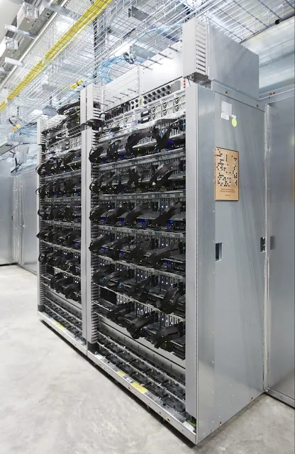

하지만 TPU는 갑자기 등장한 제품은 아닙니다. 이번에 발표된 TPU는 무려 7세대 TPU입니다. 구글은 2016년부터 지금까지 매년 새로운 세대의 TPU를 발표하였습니다. 초기에는 AlphaGo 등 내부 모델 개발 및 연구용으로만 사용하였지만, 구글 클라우드를 통해 다른 기업이나 연구기관에서 TPU를 사용할 수 있는 서비스도 판매해왔습니다. 

그런데 생각해보면 이상합니다. 구글은 분명 소프트웨어 기업인데 왜 GPU 대신 본인들만의 칩을 만들게 되었을까요? 거기에 더해 하드웨어 시장까지 진출하려고 하는 자신감은 어디서 나온 것일까요? 오늘은 TPU의 기원과 최신 세대 TPU인 Ironwood에 대해 파헤쳐보며 구글의 AI 반도체 시장에 대한 '근거 있는 자신감'에 대해 알아보고자 합니다.

---

## TPU의 등장

TPU 구조를 이해하기 위해서는 먼저 TPU가 개발된 배경에 대해 알아야 할 필요가 있습니다. 이는 [TPU 1세대 백서](https://arxiv.org/pdf/1704.04760)에 자세히 기술되어 있는데요. 

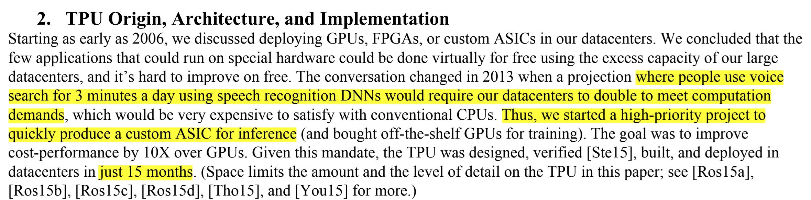

2000년대에 구글에서 제공하던 서비스들은 특수한 형태의 연산이 필요한 작업들도 custom ASIC이 필요 없이 기존의 데이터센터 내의 유휴 자원으로 돌릴 수 있는 수준이었습니다. 2010년대에 접어들어 인공지능 기술이 구글 서비스에 본격적으로 도입되면서 그 사정이 달라지게 됩니다. 사람들이 하루에 딱 3분씩만 음성 검색을 이용한다고 가정했을 때, 음성 인식 심층 신경망(DNN, Deep Neural Network)을 구동하기 위해서는 기존 데이터센터의 규모를 두 배로 늘려야 한다는 예측이 나왔기 때문입니다. 일반적인 CPU로는 이를 감당하기 어려워지자 구글 내부에서는 이를 위한 맞춤형 ASIC 프로젝트, TPU 프로젝트가 시작됩니다. 놀라운 점은 설계, 검증, 제작, 배포까지 **15개월** 만에 이루어졌다는 점입니다. 당시 제작된 TPU는 구글 내부에서만 사용되다가 2016년, 이세돌과 알파고의 대국에 TPU가 사용되었음이 공개되면서 TPU가 처음으로 외부에 알려지게 됩니다.

---

## TPU 하드웨어 아키텍쳐

그럼 본격적으로 TPU 아키텍쳐에 대해 살펴보겠습니다. 

### Systolic array

앞서 말씀드렸듯이 TPU는 AI 연산에 특화되어 제작되었습니다. AI 연산 중 가장 큰 특징은 대규모의 행렬 곱셈을 수행한다는 점인데요. 이는 모델 종류(CNN, RNN, Transformer)와 학습/추론 과정에 관계 없이 볼 수 있는 공통적인 특징입니다. 이 특징은 인공 신경망의 가중치를 사용하고 기타 다른 값들을 연산하는 과정에서 나타납니다.

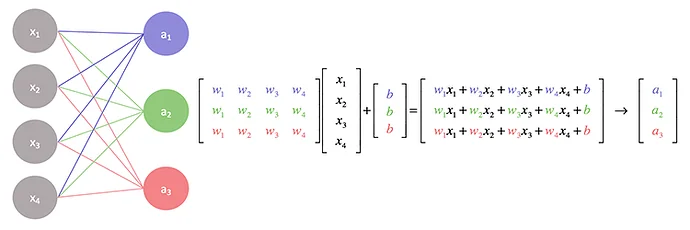

TPU에서는 이 행렬 곱셈을 효율적으로 실행할 수 있도록 일반적인 프로세서(CPU)에서는 볼 수 없는 Systolic array라는 특별한 유닛을 사용합니다. "Systolic"은 심장의 수축 운동인 '수축기(systole)'에서 유래한 단어입니다. 마치 심장이 규칙적으로 박동하며 혈액을 신체의 각 부분으로 보내는 것처럼, 배열 구조 내에서 데이터가 연산 유닛 사이를 리듬감 있고 규칙적으로 이동하며 연산이 수행되는 모습에서 착안된 이름입니다. Systolic array는 데이터 흐름을 최적화하고 병렬 처리를 극대화하여 행렬 곱셈과 같은 대규모 연산에 효율적입니다. Systolic array가 행렬 곱셈을 진행하는 과정을 애니메이션으로 나타내보면 아래와 같습니다.


다음으로는 Systolic array의 효과를 더 구체적으로 설명하기 위해 일반적인 프로세서의 연산 방식과 TPU의 systolic array를 사용한 연산 방식을 비교해보겠습니다.

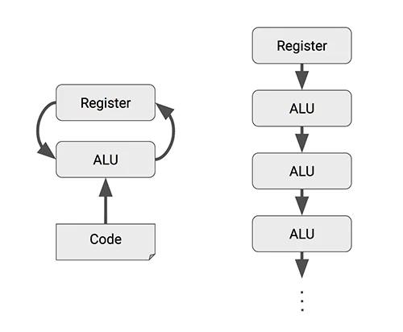

일반적인 프로세서에서 덧셈이나 곱셈과 같은 산술 연산을 수행하는 과정은 아래와 같습니다.

1. register에 데이터를 로드  
2. 컨트롤러에서 ALU(Arithmetic Logic Unit)에 명령을 전송  
3. ALU가 register에서 데이터를 읽어가서 연산을 수행한 후 결과값을 register에 다시 씀

즉, ALU가 개별 연산을 수행할 때마다 register에 데이터를 읽고 수행하는 과정이 필요한 것입니다. AI 연산에서 사용되는 대규모 행렬 연산은 일반적인 연산보다 월등히 많은 연산량을 필요로 합니다. 때문에 이 과정을 생략할 수 있다면 

1. 필요한 register의 용량을 줄임으로써 면적 효율을 증대시키고  
2. register ↔ ALU간 데이터 이동횟수를 줄임으로써 전력 소모를 줄일 수 있을 것입니다.

Systolic array는 이 과정을 생략할 수 있는 대안 중 하나인데요. 개별 ALU에서 연산된 결과를 register에 저장하는 것이 아니라 다른 ALU로 넘겨주는 것입니다. 이를 통해 앞서 말한 효과를 얻을 수 있는 것이죠.

하지만 Systolic array를 효과적으로 사용하기 위해서는 몇 가지 조건을 충족해야 합니다. 

1. ALU → ALU 간에 데이터를 넘겨주는 타이밍을 정확히 맞춰줘야 하고  
2. 개별 ALU에서 연산된 결과가 다음 ALU에서 사용되어야 하는 보장이 필요합니다.

첫번째 조건은 하드웨어적으로 적절히 조절한다 치더라고, 두번째 조건은 연산 자체의 특성이 이를 만족해야 합니다. 행렬 곱셈은 이 두번째 조건을 만족하기 때문에 Systolic array를 가장 효율적으로 사용할 수 있습니다.


행렬 곱셈을 작은 단위로 분해하면 여러 개의 벡터 내적으로 나타낼 수 있습니다. 벡터 내적은 개별 element의 곱셈결과의 누산값인데요. 개별 ALU에 입력으로 들어가는 element들의 타이밍을 정확하게 맞춰주고 element의 곱셈 값을 다음 ALU로 넘기면서 순차적으로 누산하게 되면 register와의 통신 없이 행렬 곱셈을 수행할 수 있게 됩니다. 

이러한 Systolic array는 TPU에서 사용한 대표적인 특징으로 AI 연산을 수행하는 GPU나 다른 AI 가속기(NPU, LPU) 아키텍쳐에도 큰 영향을 미치게 됩니다.

### TPU Building Block

다음으로는 TPU 개별 칩에서 사용하는 연산 단위에 대해 알아보겠습니다.    
앞서 살펴본 GPU는 수백 개의 **SM(Streaming Multiprocessor)**으로 구성되어 있습니다. 하드웨어 스케줄러가 32개 스레드 묶음인 '워프(Warp)' 중 실행 준비가 된 것을 실시간으로 선택해 연산 자원에 투입하는데, 이는 명령어를 무작위로 실행하는 것이 아니라 **대기 시간을 다른 작업으로 메워 효율을 극대화(Latency Hiding)**하는 방식입니다. 즉, GPU는 수많은 작은 연산 단위를 촘촘하게 관리하며 전체 처리량을 높이는 데 최적화되어 있습니다.

반면, **TPU(Tensor Processing Unit)**는 이와 대조적인 접근 방식을 취합니다. 잘게 쪼개진 수많은 유닛 대신, 거대한 행렬 연산을 한 번에 처리할 수 있는 소수의 강력한 전용 코어를 탑재하고 있습니다. 아울러 여러 인스트럭션을 합쳐둔 더 고수준의 명령어(VLIW, Very Long Instruction Word)를 통해 다량의 데이터를 연산 블록에 한번에 밀어넣는 방식으로 동작합니다. 복잡한 동적 스케줄링의 비중을 줄이는 대신, 인공지능 연산의 핵심인 대규모 행렬 곱셈을 마치 거대한 파이프라인이 흐르듯 단번에 수행하도록 설계된 것이 TPU 아키텍처의 핵심입니다.

TPU의 개별 칩에 사용되는 코어는 선형 대수 연산에 특화된 TensorCore와 임베딩 연산에 특화된 SparseCore로 나뉩니다. (GPU에서 사용하는 Tensor Core와 용어는 같지만 역할의 차이가 있습니다.)

**TensorCore**


TensorCore는 Systolic array와 DMA(Direct Memory Access) 유닛 등을 통해 전달된 데이터에 대한 연산을 수행하는 연산 파이프라인입니다. GPU의 CUDA core나 Tensor core와 유사한 역할을 하며, GPU에서는 정확히 어떤 시점에 어떤 코어를 사용하겠다고 지정할 수 없지만(빈 실행 장치에 자동으로 채워넣음), TPU의 TensorCore는 컴파일 타임에 최적화된 데이터플로우에 따라 정적으로 할당됩니다. 앞서 말씀드린 행렬 연산을 위한 MXU(Matrix Multiplication Unit)이 가장 대표적이고, 행렬 연산 뿐만 아니라 스칼라, 벡터 연산을 위한 연산기도 포함되어 있습니다. 세대에 따라 다르지만 칩별로 1~2개의 TensorCore가 탑재됩니다.

**SparseCore**

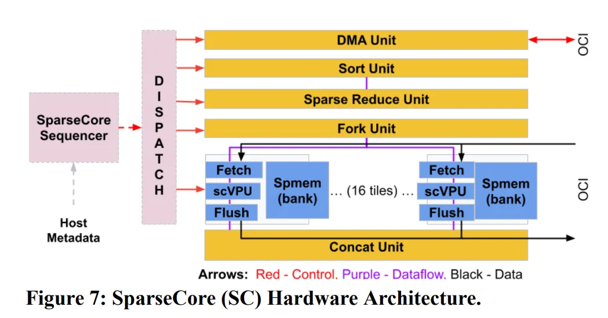

SparseCore는 4세대 TPU부터 적용된 core 아키텍쳐입니다. SparseCore는  AI에서 행렬 연산 이외에 사용되는 연산 중 하나인 **임베딩 연산**에 특화된 유닛입니다. LLM 등에서 사용하는 임베딩 연산은 테이블 크기가 비교적 작기 때문에 연산 오버헤드가 과하지 않지만,  DLRM(Deep Learning Recommendation Model)과 같은 추천 시스템에서는 임베딩 테이블 크기가 전체 파라미터의 대부분에 달할 정도로 오버헤드가 크기 때문에 임베딩 연산에서 연산 병목이 발생할 확률이 매우 높습니다. 

TPU에서 SparseCore가 차지하는 비중은 (4세대 기준) 5%정도로 Tensor core에 비해 작지만, 이 유닛으로 기존 대비 5~7배의 성능 향상을 이루어냈습니다. 세대에 따라 다르지만 칩별로 2개 혹은 4개의 SparseCore가 탑재됩니다.

### Scale-up/Scale-out System

TPU는 칩별로 1~2개의 적은 수의 거대한 코어로 연산을 수행합니다. 거대한 코어를 사용해 1개의 칩으로도 연산을 수행할 수도 있지만, 더 큰 연산을 위해서는 여러개의 칩을 연결하고 이를 병렬적으로 사용하는 것이 필요합니다. TPU는 이를 위해 아래와 같은 네트워크 기술을 사용합니다. 

**Torus topology**

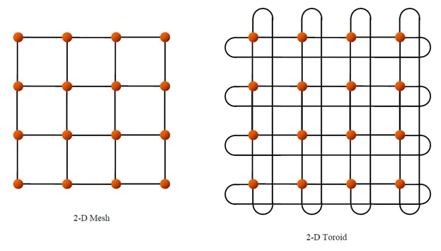

여러 개의 칩을 연결하여 하나의 거대한 서버를 구축하는 scale-up을 위해 TPU는 torus topology를 사용합니다. 여러 개의 칩을 연결한 모습을 떠올려보면 일반적으로 첫번째 그림과 같은 바둑판 모양의 격자 구조 (mesh topology)를 생각해볼 수 있는데요. 이 구조의 단점은 양끝에 있는 노드들끼리 연결이 안되어 있기 때문에 노드간 최대 거리가 길어진다는 점입니다. torus 구조에서는 양 끝에 있는 node들을 wrap-around link로 연결하여 배선 복잡도는 높아지지만 노드간 최대 거리를 N → N/2로 줄일 수 있습니다. 4세대 TPU에서는 이 torus 구조를 3D로 확장하여 노드간 통신 범위와 하나로 묶이는 TPU 개수를 확장하였습니다. 4 * 4 * 4(=64)개의 TPU 묶음을 **cube**라고 부르고 이 cube가 여러 개 모인 클러스터를 **pod**이라고 부릅니다. 

**Optical Circuit Switch(OCS)**

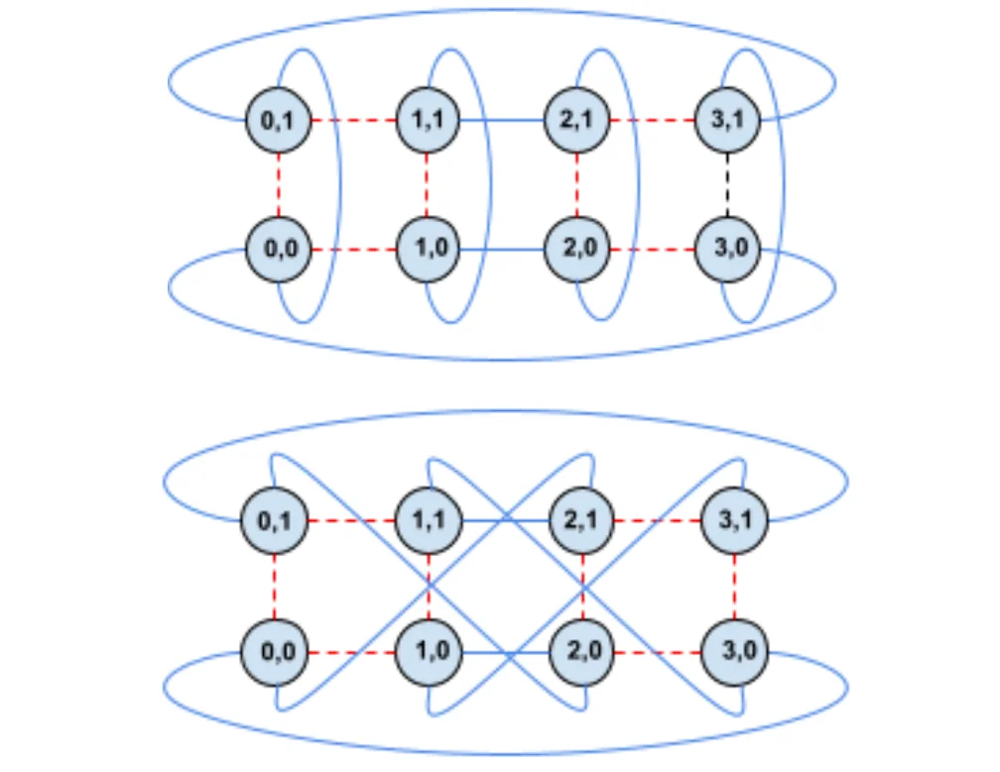

이러한 칩 간 통신을 중재 하기 위해서는 네트워크 스위치가 필요한데요. TPU는 광학 스위치인 OCS를 도입하여 torus 간의 연결 구조를 소프트웨어에서 재구성할 수 있도록 하였습니다. 연산 특성에 따라 최적화된 연결 구조를 소프트웨어에서 결정할 수 있도록 한 것입니다.

---

## TPU 소프트웨어 스택


다음으로는 TPU에서 사용하는 소프트웨어에 대해 알아보겠습니다. 

### TensorFlow


지난 포스팅에서 GPU는 CUDA라는 프로그래밍 모델로 제어할 수 있다고 말씀드린 바가 있는데요. 구글은 CUDA와 같은 kernel language를 개발하는 대신, GPU와 TPU 상관없이 사용할 수 있는 **TensorFlow**라는 딥러닝 프레임워크를 개발해왔습니다.
TensorFlow와 PyTorch와 같은 프레임워크의 특징은, CUDA와 달리 개발자가 하드웨어의 세부 구조를 이해하지 않아도 동일한 코드로 GPU와 TPU 같은 다양한 가속기에서 바로 실행할 수 있다는 점입니다. 구글은 생태계 확장을 위해 동일한 TensorFlow 소스코드를 사용하더라도 CPU, GPU, TPU 등 다양한 하드웨어 플랫폼에서 동작하고 모바일 기기부터 대규모 분산 시스템까지 어디에나 배포할 수 있도록 강력한 유연성을 제공했습니다. 이로 인해 산업/배포용으로는 **TensorFlow**가 강력한 도구로 자리잡게 되었습니다. 하지만 하드웨어에 대한 정밀한 제어가 어렵다보니 최적화 입장에서 한계가 있습니다.  

### JAX

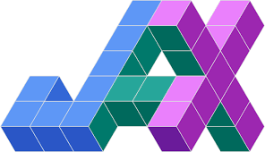

하지만 TPU 하드웨어를 소프트웨어 단에서 최적화 할 수 있는 방법이 없는 것은 아닙니다. JAX라는 python library를 활용하면 가능한데요. 이는 TPU를 적극적으로 활용하는 구글 내부 개발자들이 TPU를 보다 더 효율적으로 사용하기 위해 개발한 python library입니다. TPU에서는 직후에 설명할 머신러닝 가속형 컴파일러인 XLA를 사용할 수 있는데요. XLA는 TensorFlow와 JAX 모두에서 사용할 수 있는 컴파일러입니다. JAX는 이 XLA를 소프트웨어 개발자들이 더 직접적이고 유연하게 활용할 수 있도록 만들어진 일종의 python interface입니다. GPU/TPU 구분 없이 사용가능하며, 함수형 프로그래밍 패러다임과 자동 미분 기능을 제공하여 연구와 실험에 더 적합한 설계를 가지고 있습니다. 구글 AI 팀에서는 연구와 모델 학습에 적극적으로 이를 활용하고 있지만, 소프트웨어 레벨에서 연산 최적화를 진행해야 하기 때문에 진입장벽이 다소 높다는 것이 특징입니다.

### XLA(Accelerated Linear Algebra)


구글은 앞서 설명한 TensorFlow의 한계를 극복하고 머신러닝에서 TensorFlow의 성능을 한단계 더 향상시키기 위한 방법을 고민하게 됩니다. 구글에게는 크게 두 가지 방향의 선택지가 있었을 것으로 생각됩니다.

1. CUDA와 비슷하게 하드웨어를 직접적으로 제어할 수 있는 별도의 low-level 언어(가령, TPU-C)를 만들고, 최적화된 커널을 만들어 TensorFlow와 같은 high-level language에서 해당 커널을 호출  
2. 머신러닝에 특화된 컴파일러를 사용하여 컴파일러가 해당 하드웨어에 최적화된 기계어를 생성

전자의 방식은 개발자들이 직접 하드웨어를 제어할 수 있기 때문에 높은 자유도를 가집니다. 아울러 하드웨어에 새로운 기능이 추가되거나 새로운 알고리즘(FlashAttention, Mixture-of-Expert(MoE))이 개발될 때마다 개발자들은 최적화를 위해 새로운 CUDA kernel을 짜게 됩니다. 최적화의 요구는 항상 존재하며, 그럴 때마다 CUDA 생태계는 확장됩니다. 이는 다른 하드웨어 회사들의 시장진입을 어렵게 하는 CUDA 생태계의 거대한 기술적 해자로 작용하고 있습니다. 

구글은 머신러닝 연산의 핵심이 되는 선형 대수 연산에 특화된 **XLA** 컴파일러를 만드는 후자의 방식을 선택해왔습니다. CUDA 생태계에 전면적으로 도전하는 것은 우회했지만, 어떻게 보면 새로운 언어를 배워야 하는 개발자들의 짐을 컴파일러에게 넘겨줬다고 볼 수 있습니다. AI 연산 중 일부를 통해 XLA 컴파일러의 연산 최적화 방식에 대해 알아보겠습니다.

(* 본 설명은 XLA 컴파일러의 최적 방식을 설명하기 위한 예시로 실제 동작과 일치하지 않습니다.)

```python
import math

# 1. Linear: z = weight * x + bias
def linear_op(x, weights, bias):
    # write result to main memory
    z = [sum(xj * wj for xj, wj in zip(x, weights[i])) + bias[i] 
         for i in range(len(weights))]
    return z

# 2. Activation: ReLU
def relu_op(z):
    # Read z value from main memory -> write back result to main memory
    a = [max(0, val) for val in z]
    return a

# 3. Softmax
def softmax_op(a):
    # read a from main memory -> find max -> summation -> div -> write back result to main memory
    max_val = max(a)
    exp_vals = [math.exp(val - max_val) for val in a]
    sum_exp = sum(exp_vals)
    return [ev / sum_exp for ev in exp_vals]
```

단순히 위의 3개의 function을 순차적으로 실행하게 되면 각 function들의 중간 결과를 메인 메모리에 쓰고 다시 읽는 과정이 필요합니다. XLA 컴파일러의 핵심은 이 operation을 통합하여 불필요한 연산이나 메모리 할당을 제거하고 빠른 속도와 적은 메모리 사용으로 연산을 수행할 수 있도록 하는 것입니다.

GPU에서도 kernel fusion을 통해 여러 개의 연산 kernel을 통합할 수 있습니다. GPU에서는 통합된 CUDA kernel 수동으로 만드는 방법과 PyTorch나 TensorRT 내부 기능을 이용하여 커널을 자동으로 융합시키는 두 가지 방법이 있다면, XLA는 컴파일 단계에서 개별 operation을 분석하여 각 하드웨어(CPU/GPU/TPU)에 최적화된 기계어를 만들어낸다는 것에서 차이가 있습니다. 

XLA는 TensorFlow와 JAX에서 지원되다가 최근에는 PyTorch에서도 `pytorch/xla`를 통해 XLA를 사용할 수 있도록 지원되면서 그 저변을 확대하고 있습니다.  

### Pallas

XLA는 강력한 최적화 컴파일러로 동작하지만 한계도 존재합니다. 새로운 연산 알고리즘이 등장할 경우 컴파일러가 이를 최적화할 수 있는 버전으로 업데이트 되기 전까지 수동으로 생성한 custom kernel의 성능을 따라잡기 힘들다는 것입니다.

이를 위해 구글은 2023년 무렵부터 JAX의 실험적인 확장 기능으로 **Pallas**(`jax.experimental.pallas`)라는 kernel language API를 제공해왔습니다. 이는 앞서 언급한 성능 향상을 위한 두 가지 방법 중 첫번째 방법에 해당합니다. Pallas는 2021년 탄생한 GPU용 고수준 kernel language인 Triton과 비교해볼 수 있습니다.

[Triton](https://openai.com/index/triton/)은 2021년에 OpenAI에서 제작된 오픈소스 GPU 프로그래밍 언어입니다. 강력하지만 진입장벽이 높고 하드웨어 구조를 이해해야 한다는 CUDA의 한계점을 극복하기 위해 CUDA 보다 한단계 더 추상화된 인터페이스를 제공하여 머신러닝 개발자들이 다양한 연산과 알고리즘을 GPU에서 더 쉽게 최적화할 수 있도록 한 것이 특징입니다. Hopper/Blackwell 등 아키텍쳐의 구애 받지 않도록 추상화를 진행하여 개발자 편의성을 증대시켰으며, 높은 추상화 단계에도 불구하고 Triton으로 만들어진 프로그램들이 수동으로 만들어진 CUDA kernel과 성능 면에서 비슷한 수준에 도달한 [벤치마크](https://arxiv.org/pdf/2511.11581v1)도 존재합니다. 

JAX에서도 Triton 언어를 사용할 수 있도록 통합이 진행되었지만 Triton은 GPU에서만 작동하기 때문에 TPU에서는 이러한 최적화를 진행하기가 힘든 부분이 있었습니다. Pallas는 이를 극복하기 위한 TPU용 kernel-language API로 Triton과 달리 GPU와 TPU를 모두 지원하는 공통 커널 언어를 제공하는 것이 큰 특징입니다. Pallas는 JAX뿐만아니라 [PyTorch/XLA](https://cloud.google.com/blog/products/ai-machine-learning/introducing-pytorch-xla-2-3?hl=en)에서도 사용가능하도록 통합이 진행되었습니다.

---

## Ironwood 출시, 구글의 참전 선언

4세대 TPU 이후로는 기술적인 내용을 상세하게 기술한 자료가 많이 없어 기존에 비해 7세대 TPU에서 달라진 점과 AI 반도체 업계에 시사하는 점들에 대해 기술적인 관점에서 이야기해보겠습니다.

### 하드웨어 관점

**chiplet architecture**

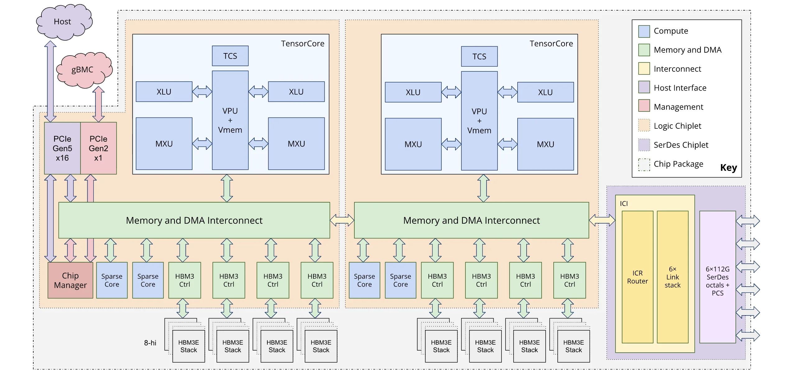

Ironwood는 TPU 아키텍쳐 중 최초로 chiplet 구조를 채택하였습니다. chiplet 구조는 레티클 한계라고 불리는 반도체 제조 공정의 한계를 극복하기 위해 도입된 공정 기술입니다. 

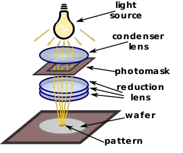

> 레티클 한계: 반도체 업계 표준으로 고정되어 사용하는 포토마스크(reticle)의 크기 회로를 그릴 때 사용되는 노광기의 렌즈의 축소 배율로 인해 단일 노광으로 찍어낼 수 있는 개별 다이의 크기를 레티클 한계라고 부릅니다. 이 한계 (현재는 약 858mm²)을 넘어가게 되면 단일 노광이 불가능하여 여러 노광 패턴을 이어붙이는 스티칭(Stitching) 기법이 필요합니다. 하지만 이 경우 불량률이 급격히 상승하여 제조 비용이 증가합니다. 이런 경제적인 이유로 기존 칩들은 프로세서 영역(메모리 이외의 영역)이 이 크기를 넘어가지 않도록 제작되었습니다.

하지만 데이터센터에서 사용되는 칩들의 수요 스펙이 증가하게 되면서 더 큰 칩들이 필요하게 되었고, 단일 칩 사이즈를 키우는 대신 이를 동일한 구조의 칩으로 여러개로 쪼개어서 만든 뒤 패키징 단계에서 이를 연결하는 chiplet 구조가 도입되었습니다. 이렇게 되면 개별 칩의 크기를 키울 수 있게 되면서 개별 제품들의 성능이 증가할 수 있습니다.

Nvidia GPU는 2024년에 출시한 Blackwell 아키텍쳐인 B100/B200 제품군부터 이 기술을 도입하였고 데이터센터향 가속기를 만드는 다른 가속기 회사들도 이 구조를 도입하고 있습니다. TPU는 이번세대 제품군부터 chiplet 구조를 적용하였고, 이로 인해 이전 제품군 단일 제품 성능(peak Compute, memory bandwidth 등)이 월등히 높은 것을 볼 수 있습니다.

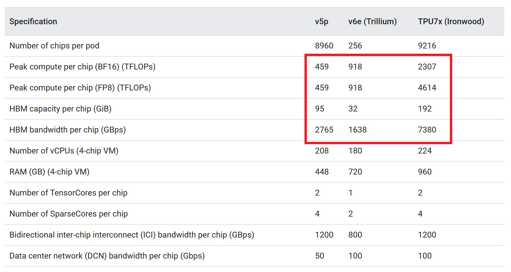

이 chiplet 구조에서 2개의 개별 die는 이전 제품의 개별 chip 이상의 성능을 보이기 때문에 Ironwood에서는 개별 die를 torus topology의 하나의 node로 보고 개별 제어가 가능하도록 합니다. 이를 위해 3D torus에서 축을 하나 더 추가한 4D torus topology를 도입하였습니다. 

### 소프트웨어 관점

**vLLM 지원과 tpu-inference의 등장**

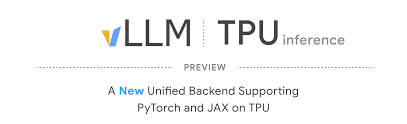

구글은 지난 10월 [tpu-inference](https://github.com/vllm-project/tpu-inference) 라는 새로운 하드웨어 플러그인을 vLLM에 통합했습니다. 이 플러그인은 JAX와 PyTorch를 단일 로어링 경로(Single Lowering Path)로 통일하여, 프레임워크에 상관없이 최적화된 TPU 기계어를 생성합니다. 이 플러그인의 가장 큰 장점은 GPU에서 쓰던 vLLM 인터페이스 그대로 TPU 위에서 LLM 모델을 고성능으로 서빙할 수 있게 된 것입니다.

**TensorFlow 지원 중단**

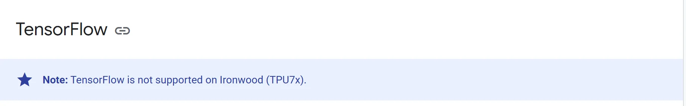

구글은 이번세대 TPU부터 과감하게 TensorFlow 지원을 중단했습니다. 이는 PyTorch의 생태계 지배력을 인정하면서 PyTorch 생태계 내에서(PyTorch/XLA) TPU의 성능을 최적화 할 수 있도록 **기존 생태계에 XLA를 통합**하고, 독자적인 framework 개발은 TensorFlow보다 성능 향상에 더 최적화된 **JAX framework에 더 집중**하겠다는 두 가지 의미로 해석됩니다.

**Pallas의 소프트웨어 생태계 안착**

JAX 공식문서에는 아직 pallas가 experimental 기능으로 기술되어 있지만, 블로그에서도 pallas를 TPU 성능 극대화를 위한 수단으로 공식적으로 소개하고 있습니다. 이는 XLA 컴파일러 업데이트를 기다리지 않고 개발자가 직접 최적화 커널을 짜는 것을 권장한 것으로 풀이됩니다. CUDA/Triton에 있던 커널 최적화의 자유도를 TPU에서도 누릴 수 있게 된 것입니다.

### 구글의 AI 반도체 시장 야욕

이러한 소프트웨어 생태계 확장과 하드웨어 성능의 비약적 향상은 단순한 기술 개선을 넘어 구글의 전략적 전환을 의미합니다. 이는 엔비디아가 독점해온 AI 반도체 시장에 본격적으로 진입하기 위한 움직임입니다. 구글의 시장 진입 전략을 살펴보자면 아래와 같습니다.

**TPU 직접 판매 가능성** 

그동안 TPU는 구글 클라우드(GCP)를 통해서만 임대할 수 있었습니다. 보안상의 이유로 하드웨어 기술문서를 상세하게 공개하지 않는 편이었으며, 직접 판매도 진행하지 않아 TPU는 구글 내부 데이터센터에만 존재했습니다. 하지만 최근 구글은 TPU를 타사 데이터센터에 직접 공급하거나 하드웨어 자체를 판매하는 전략을 검토 중인 것으로 알려졌습니다. 이는 폐쇄적인 구글 전용 칩 이미지를 벗고, 독립적인 AI 반도체 벤더로서 엔비디아와 정면 승부를 벌이겠다는 선언입니다.

**소프트웨어 개방과 수직 계열화의 완성** 

엔비디아의 강력함은 하드웨어뿐만 아니라 CUDA라는 소프트웨어 생태계에서 나옵니다. 구글은 이에 맞서 **XLA라는 자동화**와 **Pallas라는 개방성**을 무기로 삼고 있습니다. "GPU는 수동으로 최적화된 커널에서 최고의 성능이 나오지만, TPU는 컴파일러가 자동으로 최적화하고 필요하면 개발자가 직접 튜닝할 수도 있다"라는 메시지를 던지고 있는 것입니다. 더불어 구글의 소프트웨어 스택은 CUDA와 달리 특정 하드웨어에 국한되지 않아 최근 떠오르는 이종 컴퓨팅 시장에서도 경쟁력을 확보할 수 있습니다.

거기에 더해 구글은 모델(Gemini), 프레임워크(JAX), 컴파일러(XLA), 그리고 하드웨어(TPU)까지 AI의 모든 스택을 수직 계열화한 유일한 기업입니다. 소프트웨어와 하드웨어의 융합이 필수적인 AI 반도체 시장에서 구글은 이러한 수직 계열화를 통해 유리한 고지를 선점하고 있습니다.

---

## 정리

본 글에서는 

1. TPU의 등장 배경
2. TPU의 하드웨어/소프트웨어 아키텍쳐 
3. 최신 TPU 제품인 Ironwood의 특징
4. 구글의 반도체 시장 전략에 대해 알아보았습니다.

이를 통해 내릴 수 있는 결론을 요약하면 아래와 같습니다.

1. 구글은 10년 전부터 AI workload에 최적화된 ASIC인 TPU를 개발해왔습니다.
2. GPU와 CUDA의 기술적 해자를 허물고 하드웨어 종속적이지 않은 소프트웨어 생태계 구축을 위한 기술적 노력을 이어가고 있습니다.
3. 단순 클라우드 사업을 넘어 AI 반도체 시장에 직접 진출하여 엔비디아와 동등한 지위를 구축하고자 합니다.

---

그런데, 최초 TPU 프로젝트에 참여했던 인원이 또다른 **반도체 스타트업**을 설립했었다는 사실, 알고 계셨나요? 얼마 전 엔비디아와 한화 약 30조원 규모의 계약을 체결한 AI 반도체 스타트업 **Groq**이 바로 그 주인공인데요. 엔비디아가 어마어마한 규모의 돈을 주고 구매한 Groq의 기술은 무엇일까요? 다음 글에서는 저희와 같은 용어를 사용하는 **Groq의 LPU**에 대해 알아보겠습니다. 

## Reference

- [An in-depth look at Google’s first Tensor Processing Unit (TPU)](https://cloud.google.com/blog/products/ai-machine-learning/an-in-depth-look-at-googles-first-tensor-processing-unit-tpu?hl=en)
- [From silicon to softmax: Inside the Ironwood AI stack](https://cloud.google.com/blog/products/compute/inside-the-Ironwood-tpu-codesigned-ai-stack?hl=en)
- [Announcing Ironwood TPUs General Availability and new Axion VMs to power the age of inference](https://cloud.google.com/blog/products/compute/Ironwood-tpus-and-new-axion-based-vms-for-your-ai-workloads?hl=en)
- [In-Datacenter Performance Analysis of a Tensor Processing Unit](https://arxiv.org/pdf/1704.04760)
- [TPU v4: An Optically Reconfigurable Supercomputer for Machine Learning with Hardware Support for Embeddings](https://arxiv.org/pdf/2304.01433)


## 추신: HyperAccel은 채용 중입니다!

지피지기면 백전불태라지만 백전백승을 위해서는 훌륭한 인재가 많이 필요합니다!

저희가 다루는 기술들을 보시고, 관심이 있으시다면 [HyperAccel Career](https://hyperaccel.career.greetinghr.com/ko/guide)로 지원해 주세요!

HyperAccel에는 정말 훌륭하고 똑똑한 엔지니어분들이 많습니다. 여러분의 지원을 기다립니다.