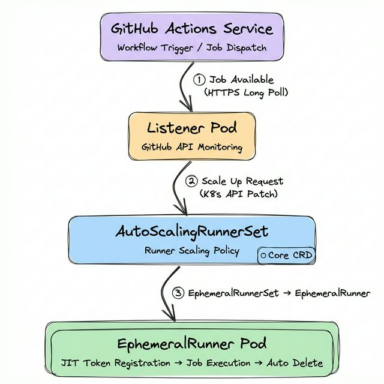
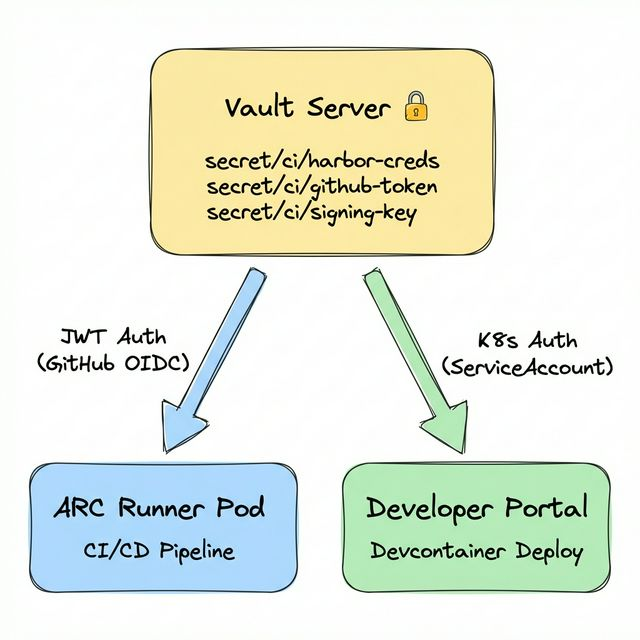
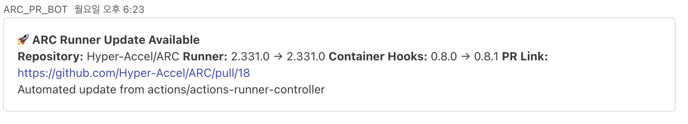
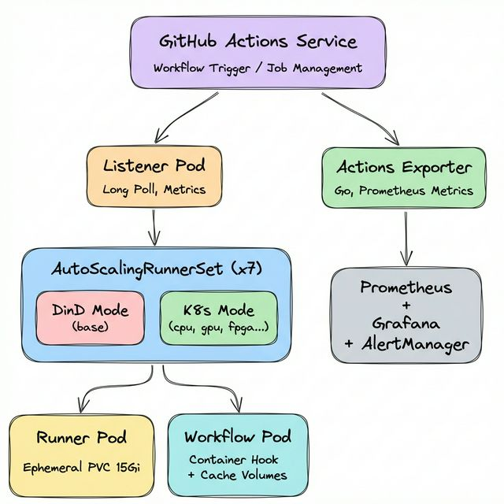

Hello. I'm Namyoon Kim, working on the ML team at HyperAccel.

In [Part 1](), we covered the motivation and overall design direction for building a Kubernetes-based development environment. This article continues from there, focusing on how we **redesigned our CI/CD infrastructure**.

Once the development environment lives on Kubernetes, running CI/CD pipelines on the same environment is the architecturally consistent choice. This article structurally analyzes why traditional self-hosted runners were unsustainable long-term, then documents the key technical decisions made during ARC (Actions Runner Controller) adoption — **the selection criteria between DinD mode and Kubernetes mode**, **Rook-Ceph based Ephemeral PVC strategy**, **secret lifecycle management through Vault**, and **pipeline observability through a custom-built GitHub Actions Exporter**.

---

## The Structural Limitations of Self-hosted Runners

Previously, we operated by **installing self-hosted runners as Docker containers directly on servers**. Runner labels were set to hostnames (e.g., `ha-xxx`), and GPU test workflows used the `--all-gpu` flag to utilize all GPUs on a given server.

The reasons we didn't use GitHub's **Hosted Runners** (`ubuntu-latest`, etc.) were as follows:

- **Hardware dependency**: FPGA synthesis and GPU-based testing can only run on nodes with these devices physically installed.
- **Network isolation**: Internal infrastructure such as Harbor registry and Vault server are unreachable from external runners.
- **Image transfer costs**: The round-trip of building, pushing, and pulling multi-GB Docker images through external networks is inefficient in both bandwidth and time.

While self-hosted runners resolved these constraints, fundamental problems with the structure itself emerged over time.

**First, tight coupling between servers and workflows.** Since runner labels were bound to hostnames, replacing or renaming a server required **modifying every workflow** referencing it. Additionally, the `--all-gpu` flag approach meant that when two jobs were scheduled on the same server simultaneously, **GPU resource contention couldn't be controlled**, causing one job to fail unpredictably.

**Second, execution environment contamination.** Runners execute directly on the host OS, so packages installed or system configurations changed during Build A can affect Build B's behavior. This means build reproducibility cannot be guaranteed — undermining the fundamental purpose of a CI pipeline.

**Third, inability to scale elastically.** The number of concurrent workflows varies significantly by time of day, but the number of server-installed runners is static. Under-provisioning increases queue wait times; over-provisioning wastes idle resources.

All three problems arise because **runners exist outside Kubernetes' scheduling and lifecycle management framework**. In an environment where a Kubernetes cluster is already established, converting runners to Pods and placing them under cluster control was the logical decision.

---

## ARC (Actions Runner Controller) Architecture

ARC is a GitHub-officially-supported Kubernetes Operator that manages the complete lifecycle of self-hosted runners on Kubernetes. Understanding ARC's architecture requires examining the **AutoScalingRunnerSet** CRD (Custom Resource Definition) — the core resource that controls runner creation, scaling, and deletion.

### Operational Flow



1. A **Listener Pod** maintains an HTTPS Long Poll connection with the GitHub Actions Service to watch for new jobs. Since this is polling-based rather than webhook-based, no inbound network configuration is required.

2. When a job is detected, the Listener patches the **EphemeralRunnerSet** replica count via the Kubernetes API to request a scale-up.

3. The **EphemeralRunner Controller** obtains a JIT (Just-in-Time) configuration token and creates a Runner Pod, which registers itself with the GitHub Actions Service.

4. Upon job completion, the EphemeralRunner Controller verifies with the GitHub API and deletes the pod. This ephemeral execution model fundamentally prevents residual artifacts from previous builds from affecting subsequent ones.

### Purpose-specific AutoScalingRunnerSet Design

HyperAccel's CI workloads span a wide resource spectrum — from general builds to FPGA synthesis to GPU testing. We deploy **7 AutoScalingRunnerSets** organized by purpose:

```bash
$ kubectl get autoscalingrunnerset -n arc-systems
NAME                     MIN   MAX   CURRENT   RUNNING
runner-base              1     10    1         1       # DinD Mode
runner-cpu               1     10    3         3       # Kubernetes Mode
runner-cpu-largememory   1     10    1         1       # Kubernetes Mode
runner-fpga              1      3    1         1       # Kubernetes Mode
runner-gpu               1      3    1         1       # Kubernetes Mode
runner-highcpu           1     10    1         1       # Kubernetes Mode
runner-hybrid            1      4    1         1       # Kubernetes Mode
```

Each Scale Set is scheduled only on appropriate nodes via `nodeAffinity` or `tolerations`:

- **runner-gpu**: Placed on GPU nodes with label `nvidia.com/gpu.present=true`
- **runner-fpga**: Placed only on specific FPGA-equipped nodes
- **runner-cpu / runner-cpu-largememory**: Placed on nodes with label `ci=large-memory`

Workflows select the appropriate runner via the `runs-on` key:

```yaml
jobs:
  gpu-test:
    runs-on: runner-gpu     # GPU Runner
  fpga-synth:
    runs-on: runner-fpga    # FPGA Runner
  build:
    runs-on: runner-cpu     # General CPU Runner
```

A critical observation: **only runner-base uses DinD mode, while the remaining 6 all use Kubernetes mode**. The difference between these two modes is one of the most important architectural decisions in ARC operations.

---

## DinD Mode vs Kubernetes Mode: Architectural Differences

When a Runner Pod needs to execute containers within a workflow (the `container:` key or container actions), ARC provides two modes: **DinD (Docker-in-Docker) mode** and **Kubernetes mode**. These modes differ fundamentally in their container execution mechanism, volume management, and security model.

### DinD Mode (runner-base)

Runs a **Docker daemon as a sidecar container** inside the Runner Pod. At HyperAccel, `runner-base` operates in this mode.

```yaml
# runner-base core configuration (DinD Mode)
spec:
  containers:
    - name: runner
      env:
        - name: DOCKER_HOST
          value: unix:///var/run/docker.sock
        - name: RUNNER_WAIT_FOR_DOCKER_IN_SECONDS
          value: "120"
      volumeMounts:
        - mountPath: /var/run
          name: dind-sock          # Docker socket sharing
        - mountPath: /home/runner/_work
          name: work
  initContainers:
    - name: init-dind-externals    # Copy runner externals
      command: ["cp"]
      args: ["-r", "/home/runner/externals/.", "/home/runner/tmpDir/"]
    - name: dind                   # Docker daemon (Sidecar)
      image: docker:dind
      securityContext:
        privileged: true           # ⚠️ Privileged required
      restartPolicy: Always
      args: ["dockerd", "--host=unix:///var/run/docker.sock"]
      volumeMounts:
        - mountPath: /var/run
          name: dind-sock
        - mountPath: /home/runner/externals
          name: dind-externals
  volumes:
    - name: dind-sock
      emptyDir: {}                 # Volatile volume
    - name: dind-externals
      emptyDir: {}
    - name: work
      emptyDir: {}
```

The structural characteristics of DinD mode are as follows.

**First**, the `docker:dind` image runs as an `initContainer` with `restartPolicy: Always`, operating in the **Sidecar pattern**. The runner container accesses this Docker daemon's Unix socket via the `DOCKER_HOST` environment variable.

**Second**, since the Docker daemon handles container layer management, image pulls, and network creation entirely within the Pod, it **cannot leverage the node's containerd image cache**. Even images already cached on the node must be pulled again by the DinD daemon.

**Third**, `privileged: true` is mandatory for Docker daemon execution. This grants the Pod access to nearly all host kernel capabilities, requiring careful consideration in environments with strict security policies.

**Fourth**, all volumes are configured as `emptyDir` — data disappears when the Pod is deleted. Docker build cache is also not preserved.

### Kubernetes Mode (runner-cpu, runner-gpu, runner-fpga, etc.)

The Runner Pod **calls the Kubernetes API to create workflow container steps as separate Pods**. ARC's **Container Hook** (`runner-container-hooks`) mediates this process.

```yaml
# runner-cpu core configuration (Kubernetes Mode)
spec:
  containers:
    - name: runner
      env:
        - name: ACTIONS_RUNNER_CONTAINER_HOOKS
          value: /home/runner/k8s/index.js
        - name: ACTIONS_RUNNER_CONTAINER_HOOK_TEMPLATE
          value: /home/runner/k8s/worker-podspec.yaml
        - name: ACTIONS_RUNNER_REQUIRE_JOB_CONTAINER
          value: "true"
      volumeMounts:
        - mountPath: /home/runner/_work
          name: work
        - mountPath: /home/runner/k8s/worker-podspec.yaml
          name: hook-template
          subPath: worker-podspec.yaml
  volumes:
    - name: work
      ephemeral:
        volumeClaimTemplate:        # Ephemeral PVC
          spec:
            accessModes: ["ReadWriteOnce"]
            storageClassName: rook-ceph-block
            resources:
              requests:
                storage: 15Gi
    - name: hook-template
      configMap:
        name: arc-hook-cpu          # worker-podspec ConfigMap
```

The core mechanisms of Kubernetes mode are as follows.

**`ACTIONS_RUNNER_CONTAINER_HOOKS`** specifies the Container Hook entry point (`index.js`). When a workflow uses the `container:` key, instead of executing directly, the Hook calls the Kubernetes API to create a **separate Workflow Pod**.

**`ACTIONS_RUNNER_CONTAINER_HOOK_TEMPLATE`** specifies the Workflow Pod's spec template (`worker-podspec.yaml`). This template is **managed as a ConfigMap**, with different ConfigMaps referenced per runner type (`arc-hook-cpu`, `arc-hook-gpu`, `arc-hook-fpga`, etc.).

**`ACTIONS_RUNNER_REQUIRE_JOB_CONTAINER=true`** enforces that all Jobs must execute within a container via the `container:` key, preventing direct execution on the Runner Pod itself.

When a job runs, a separate Workflow Pod is created alongside the Runner Pod, separating the runner from the actual workflow execution environment.

### Structural Comparison of Both Modes

| Aspect | DinD Mode (runner-base) | Kubernetes Mode (runner-cpu, etc.) |
|---|---|---|
| **Container execution** | Docker daemon inside Pod | Separate Pod via K8s API |
| **Privileged mode** | Required (Docker daemon) | Optional (per worker-podspec) |
| **Image cache** | Isolated in DinD (no node cache) | Shares node's containerd cache |
| **Work volume** | `emptyDir` (volatile) | Ephemeral PVC (`rook-ceph-block`, 15Gi) |
| **Step isolation** | Same Docker network | Independent Pod per step possible |
| **Docker CLI** | Fully compatible | Incompatible (via Container Hook) |
| **Config complexity** | Low | High (worker-podspec, RBAC, etc.) |
| **Best for** | Docker build/push workflows | In-container build/test |

`runner-base` is maintained in DinD mode because **workflows requiring direct Docker CLI usage** (image builds, registry pushes, etc.) exist. In Kubernetes mode, there is no Docker daemon, so `docker build` cannot be executed directly.

---

## Volume Strategy: Ephemeral PVCs and Cache Layers

Runner volume design directly impacts build performance and stability. The volume strategies differ qualitatively between DinD mode and Kubernetes mode.

### DinD Mode Volumes: emptyDir

```yaml
# runner-base volumes (DinD Mode)
volumes:
  - name: dind-sock          # Docker socket sharing (Runner ↔ DinD daemon)
    emptyDir: {}
  - name: dind-externals     # Runner externals copy
    emptyDir: {}
  - name: work               # Workspace (checkout, build artifacts)
    emptyDir: {}
  - name: harbor-ca          # Harbor CA certificate
    configMap:
      name: harbor-ca
```

All work volumes are `emptyDir`, so data is lost when the Pod is deleted. Docker build cache is also not preserved — previously cached layers cannot be reused. This is disadvantageous for large image builds.

### Kubernetes Mode Volumes: Ephemeral PVC + Cache Layers

```yaml
# runner-cpu volumes (Kubernetes Mode)
volumes:
  - name: work
    ephemeral:
      volumeClaimTemplate:
        spec:
          accessModes: ["ReadWriteOnce"]
          storageClassName: rook-ceph-block   # Ceph block storage
          resources:
            requests:
              storage: 15Gi                   # 15Gi per runner
  - name: hook-template
    configMap:
      name: arc-hook-cpu                      # worker-podspec template
```

In Kubernetes mode, the work directory (`/home/runner/_work`) uses **Ephemeral PVCs**. Unlike `emptyDir`, these are backed by Rook-Ceph block storage, providing stable I/O independent of node local disk conditions with a dedicated 15Gi volume per runner. Ephemeral PVCs are bound to the Runner Pod's lifecycle — they are automatically deleted when the Pod is deleted, ensuring consistent operation without storage leaks.

### Cache Volume Strategy in worker-podspec

Workflow Pods created by Container Hook have additional cache volumes mounted. These are defined in each runner type's ConfigMap (`arc-hook-cpu`, `arc-hook-gpu`, etc.) within `worker-podspec.yaml`.

```yaml
# arc-hook-cpu ConfigMap (worker-podspec.yaml) — excerpt
spec:
  containers:
    - name: "$job"
      env:
        - name: HF_HOME
          value: /mnt/cache/huggingface
        - name: CCACHE_DIR
          value: /mnt/cache/ccache
        - name: UV_CACHE_DIR
          value: /mnt/cache/uv
      resources:
        limits:
          cpu: "32"
          memory: "128Gi"
      volumeMounts:
        - name: huggingface-cache
          mountPath: /mnt/cache/huggingface
        - name: ccache-cache
          mountPath: /mnt/cache/ccache
        - name: uv-cache
          mountPath: /mnt/cache/uv
  volumes:
    - name: huggingface-cache
      persistentVolumeClaim:
        claimName: huggingface-runner-pvc    # 1Ti NFS (shared across all runners)
    - name: ccache-cache
      hostPath:
        path: /tmp/ccache                    # Node-local cache
    - name: uv-cache
      hostPath:
        path: /tmp/uv                        # Node-local cache
```

The volume strategy organized by layer:

| Layer | Volume Type | Capacity | Lifecycle | Purpose |
|---|---|---|---|---|
| **Work directory** | Ephemeral PVC (rook-ceph-block) | 15Gi / Runner | Pod-bound | Checkout, build artifacts |
| **Model cache** | PVC (huggingface-runner-pvc) |  | Persistent (shared) | HuggingFace models, datasets |
| **Build cache** | hostPath | Node disk | Node-bound | ccache, uv package cache |

Notably, `huggingface-runner-pvc` is a **PVC shared across all runners**, preventing multi-GB LLM models from being downloaded on every build. `ccache` and `uv` caches use `hostPath` to share between runners scheduled on the same node.

However, `hostPath` caches can cause lock contention when multiple runners execute simultaneously on the same node. We actually encountered this issue with `uv` cache, which we resolved by separating cache paths per runner using the `UV_CACHE_DIR` environment variable.

---

## Vault: Secret Lifecycle Management

Secret management (registry credentials, API keys, signing keys, etc.) in CI/CD pipelines is critical from both security and operational perspectives.

### GitHub Secrets Limitations

GitHub's Repository Secrets and Organization Secrets suffice for small-scale environments. However, as repositories scale to dozens, the following problems emerge:

- **Duplicate management**: Identical secrets registered across multiple repositories → full manual updates required on rotation
- **No audit trail**: No visibility into when a secret was last updated or by whom
- **No privilege separation**: Repository Admin permissions required for secret access

The most critical trigger for adopting Vault was devcontainer image tag management. Previously, we managed devcontainer image tags via GitHub Repository Variables (e.g., `vars.DEVCONTAINER_IMAGE_AIDA_CU126`). Every time a new image was built, a developer had to manually update the variable, and frequent omissions meant workflows ran with outdated images. After adopting Vault, CI pipelines automatically record the latest image tag in Vault upon build completion, and subsequent workflows and the Developer Portal reference the latest value via `needs.fetch-secrets.outputs`. The human step of managing/updating image version information is completely eliminated.

### Vault with Dual Auth Strategy

We deployed **HashiCorp Vault** on the Kubernetes cluster and applied **different Auth Methods depending on the access subject**.



**ARC Runners** use the **JWT Auth Method**. GitHub Actions' OIDC provider issues an ID Token, which is submitted to Vault for authentication. By declaring `permissions: id-token: write` in the workflow, GitHub automatically issues an OIDC token, and `hashicorp/vault-action` forwards it to Vault.

```yaml
# Vault secret injection in workflows (JWT Auth)
permissions:
  id-token: write    # Enable GitHub OIDC token issuance
  contents: read

steps:
  - name: Import Secrets from Vault
    uses: hashicorp/vault-action@v3
    with:
      url: ${{ secrets.VAULT_ACTION_URL }}
      method: jwt                              # GitHub OIDC JWT
      role: ${{ secrets.VAULT_ACTION_ROLE }}
      exportToken: true
      secrets: |
        secret/data/harbor username | HARBOR_USERNAME ;
        secret/data/harbor password | HARBOR_PASSWORD
```

In contrast, the **Developer Portal** runs as a Pod directly inside the Kubernetes cluster, so it authenticates via the **Kubernetes Auth Method** using its ServiceAccount token. By applying separate Auth Methods suited to each access subject's characteristics, we optimize the security model for each path.

The key benefits of this architecture are twofold:

**Single management point**: Secret rotation requires only a single update in Vault, immediately reflected across all pipelines.

**Audit logging**: Every secret access records who, when, and what — satisfying security audit requirements.

### fetch-secrets: Secret Centralization via Reusable Workflows

Even with Vault in place, if each workflow individually implements Vault authentication and secret retrieval logic, duplicate code proliferates. To prevent this, we designed a `fetch-secrets` **reusable workflow** (GitHub Actions `workflow_call`). Vault authentication (JWT) and secret retrieval logic are encapsulated in this single workflow, and callers simply reference the outputs.

```yaml
# docker-build-push.yml — Caller side
jobs:
  fetch-secrets:
    uses: ./.github/workflows/fetch-secrets.yml    # Delegate Vault auth/retrieval
    secrets: inherit

  build:
    needs: [fetch-secrets]
    steps:
      - name: Log in to Harbor
        uses: docker/login-action@v3
        with:
          registry: ${{ needs.fetch-secrets.outputs.harbor_registry_url }}
          username: ${{ needs.fetch-secrets.outputs.harbor_username }}
          password: ${{ needs.fetch-secrets.outputs.harbor_password }}
```

Build workflows don't even need to know Vault exists — they simply retrieve values from `needs.fetch-secrets.outputs`. Even if Vault's secret paths change, updating `fetch-secrets.yml` alone propagates to all pipelines.

---

## GitHub Actions Exporter: Pipeline Observability

To elevate the operational maturity of CI/CD infrastructure, **observability** is essential. GitHub Actions' web UI is adequate for checking individual workflow statuses, but falls short for real-time identification of cross-repository trends, bottleneck points, and anomalies.

To address this, we developed a **GitHub Actions Exporter** in Go.

### Development Rationale

Three metrics not provided by existing open-source exporters were needed:

- **Queue wait time by runner label**: To identify bottleneck points in a mixed ARC + Hosted Runner environment
- **Consecutive failure tracking**: For real-time detection and early response to serial workflow failures
- **Branch-level analysis**: Separate analysis needed since `main` and feature branch build patterns differ

### Architecture and Key Metrics

```
GitHub REST API  ──→  Collector  ──→  /metrics endpoint
                                           │
                                    Prometheus Scrape
                                           │
                                    Grafana Dashboard + AlertManager
```

| Metric | Description | Usage |
|---|---|---|
| `workflow_runs_total` | Total workflow run count | Usage trend analysis |
| `workflow_failure_rate` | Failure rate (0.0 ~ 1.0) | Quality monitoring |
| `workflow_duration_seconds` | Execution time histogram | Performance regression detection |
| `workflow_queue_time_seconds` | Queue wait time | Runner shortage detection |
| `workflow_consecutive_failures` | Consecutive failure count | Immediate alert trigger |
| `workflow_runs_in_progress` | Currently running workflows | Real-time status |
| `workflow_runs_by_branch_total` | Runs per branch | Branch strategy analysis |

Deployed as a Kubernetes Deployment and scraped via Prometheus ServiceMonitor. ARC's Listener Pods also have Prometheus metric annotations configured, enabling collection of runner scaling metrics.

### Decision-making Through Observability

Issues detected and addressed through the dashboard:

- **Queue time spikes**: Concurrent job surges hitting `maxRunners` limits → adjusted Scale Set maximum runner counts
- **50%+ failure rate on a specific workflow**: Identified Docker layer cache expiration pattern → revised caching strategy
- **Gradual build time increase**: Growing test cases extended builds from 30 to 45 minutes → applied test parallelization

```promql
# Identify workflows with failure rate > 20%
github_actions_workflow_failure_rate > 0.2

# Queue wait exceeding 60s — runner shortage signal
github_actions_workflow_queue_time_seconds_avg > 60

# 3+ consecutive failures — immediate response needed
github_actions_workflow_consecutive_failures >= 3
```

---

## Infrastructure Operations & Maintenance Automation

We automated operational tasks to maintain the stability and currency of the infrastructure.

### Automated Vault Backups

Secrets and policies stored in Vault are critical data for recovery in case of cluster failure. A **Raft snapshot** is created every Sunday morning and backed up to two storage locations (AWS S3 and on-premise MinIO). Old backups are automatically pruned according to the retention policy (default 6 days).

### ARC & Runner Version Tracking

GitHub Actions Runner and Container Hooks are continuously updated. A **version tracking workflow** runs every Monday to check for the latest releases and compare them with the current versions. If a new version is detected, it automatically opens a PR to notify administrators, ensuring the runner environment stays up-to-date.


---

## Full Architecture

Bringing all components together yields the following architecture:


| Component | Role |
|---|---|
| **AutoScalingRunnerSet (x7)** | Purpose-specific runner scaling policies (1 DinD + 6 K8s mode) |
| **Listener Pod** | Job detection via GitHub Long Poll, Prometheus metrics exposure |
| **EphemeralRunner** | JIT token registration → job execution → auto-deletion |
| **Container Hook + worker-podspec** | Workflow Pod creation with volume/resource injection in K8s mode |
| **Vault** | Centralized secret management with JWT (ARC) / K8s Auth (Portal) |
| **Rook-Ceph** | Ephemeral PVC backend (runner work directories) |
| **GitHub Actions Exporter** | Workflow metric collection, Prometheus exposure |

---

## Quantitative Impact

| Metric | Before | After |
|---|---|---|
| Build queue wait time | 3+ minutes average | Under 15 seconds |
| Secret management | Manual per-repository | Single Vault management |
| Incident detection latency | Post-inquiry confirmation | Real-time Grafana dashboard |
| Hardware resource management | Manual server allocation | nodeAffinity auto-scheduling |
| Build reproducibility | Non-deterministic | Guaranteed via Ephemeral Pods |

For hardware with limited availability like GPUs and FPGAs, `maxRunners` (3 each) caps concurrent job counts to match available hardware, preventing resource contention.

---

## Closing

This article covered the full journey from the structural limitations of self-hosted runners to a complete CI/CD infrastructure redesign with ARC. In particular — the architectural differences between DinD mode and Kubernetes mode, the Rook-Ceph based Ephemeral PVC and multi-layer cache strategy, secret lifecycle management through Vault, and pipeline observability through a custom-built Exporter — we aimed to share not just the tools adopted, but the technical rationale behind each design decision.


Thank you for reading!

---

## P.S.: HyperAccel is Hiring!

Vault manages secrets, ARC schedules workloads, Rook abstracts storage, and Prometheus observes everything. Each plays a different role, but when combined within a single cluster, they form a complete system. HyperAccel works the same way — experts across HW, SW, and AI come together, moving toward one goal. If you'd like to be part of this combination, visit [HyperAccel Career](https://hyperaccel.career.greetinghr.com/ko/guide).

## Reference

- [Actions Runner Controller (ARC) Documentation](https://docs.github.com/en/actions/hosting-your-own-runners/managing-self-hosted-runners-with-actions-runner-controller/about-actions-runner-controller)
- [Runner Container Hooks (GitHub)](https://github.com/actions/runner-container-hooks)
- [HashiCorp Vault — JWT/OIDC Auth Method](https://developer.hashicorp.com/vault/docs/auth/jwt)
- [GitHub Actions — OIDC Token for Vault](https://docs.github.com/en/actions/security-for-github-actions/security-hardening-your-deployments/configuring-openid-connect-in-hashicorp-vault)
- [Rook-Ceph Documentation](https://rook.io/docs/rook/latest/)
- [Building a Dev Environment with Kubernetes Part 1]()
