# Know Your Enemy, Know Yourself Part 5: Cerebras and the Wafer-Scale Engine

> **Know Your Enemy, Know Yourself** comes from the idea that if you understand both the opponent and yourself, you will not be imperiled in a hundred battles.  
> This series studies competing AI accelerator architectures so that we can reason about our own designs more clearly.  
> In the fifth post, we look at **Cerebras** and its **Wafer-Scale Engine(WSE)**.

Hello, this is Donghyeon Choi from the CL team.
Did you know there is a company that turns an entire wafer into a single chip?

Today, I want to talk about **Cerebras** and its **Wafer-Scale Engine(WSE)**.

In January 2026, **Cerebras** made headlines in the AI industry. According to several reports, the company signed a contract with **OpenAI** worth around $10 billion and planned to supply up to 750MW of compute capacity by 2028. It is unusual to see a non-**NVIDIA** AI accelerator company mentioned as a candidate for a deal of this scale.

This post explains what **Cerebras**'s **Wafer-Scale Engine(WSE)** architecture is, why yield was such a difficult problem, and how **Cerebras** approached the problem.

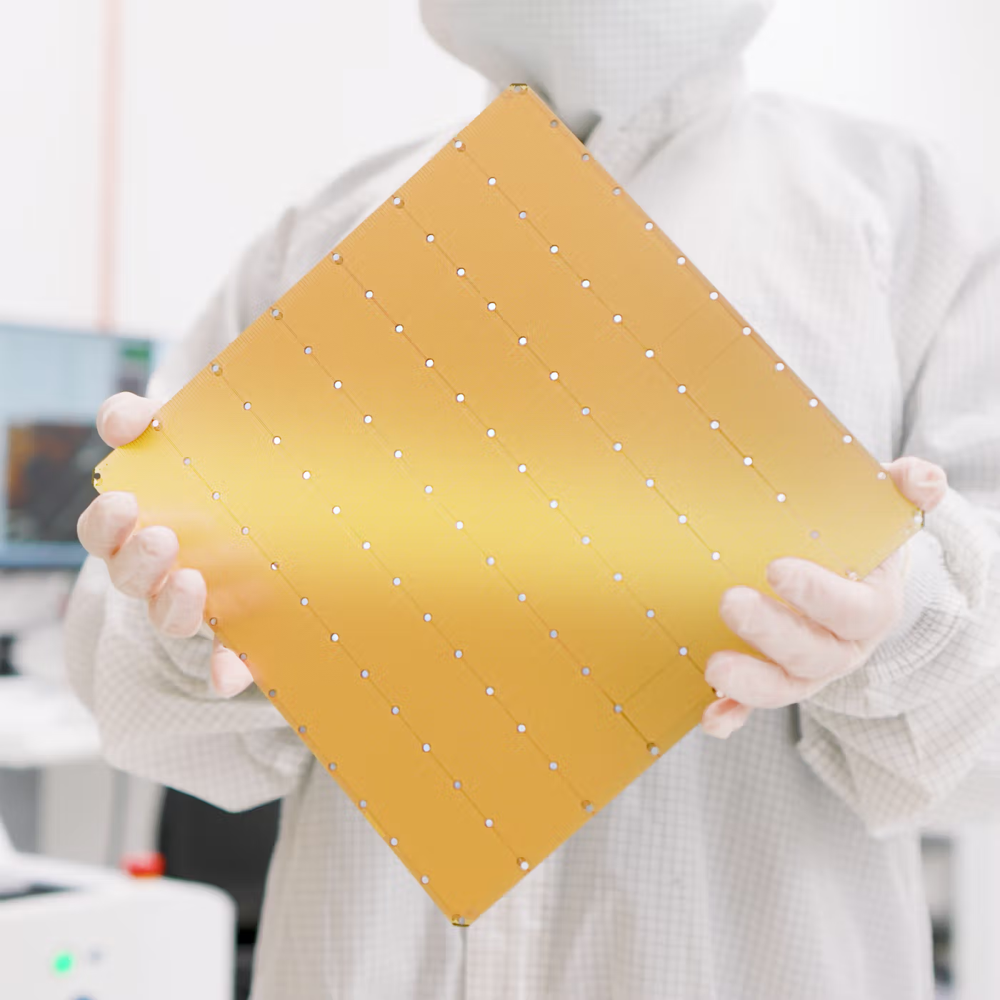

---

## Why Cerebras is getting attention

**Cerebras** is an AI semiconductor startup founded in California in 2015. Its founders, **Andrew Feldman** and **Gary Lauterbach**, previously co-founded **SeaMicro** in 2007 and sold it to **AMD** for $357 million in 2012. Drawing on that experience, they believed that the AI era needed an alternative path beyond general-purpose GPUs, and built **Cerebras** around that idea.

Their core concern was fairly clear. In conventional chip designs, on-chip memory capacity is limited by chip size, and larger models require more devices to work together. As a result, memory bandwidth and inter-chip communication easily become bottlenecks.

So the solution **Cerebras** chose was to keep as much computation and data movement as possible inside a single wafer. Instead of cutting the wafer into many smaller chips, it uses the wafer almost like one enormous chip through the **Wafer-Scale Engine(WSE)** for AI training and inference. The point is not simply “build a bigger chip.” It is to keep data that would normally move off-chip inside the wafer whenever possible.

This idea did not remain just a technical experiment. It also led to growing business attention. In August 2025, **Cerebras** announced that it ran **OpenAI**'s open model **gpt-oss-120B** at around 3,000 tokens per second. In January 2026, reports followed that **Cerebras** had signed a large contract with **OpenAI**. In March 2026, **AWS** and **Cerebras** officially announced an inference collaboration for **Amazon Bedrock**, combining **Trainium**-based prefill with **Cerebras CS-3**-based decode.

Capital markets reacted as well. **Cerebras** pursued an IPO in 2024, withdrew the plan in 2025, and then filed a new **S-1** with the U.S. **Securities and Exchange Commission(SEC)** in April 2026 as it pursued a Nasdaq listing under the ticker **CBRS**.

Why are alternatives like this getting more attention? Serving large-model services to hundreds of millions of weekly users requires ever-growing data-center capacity. But depending only on **NVIDIA** GPUs creates both cost and supply constraints. That is why large AI service operators have strong reasons to study accelerator architectures beyond GPU clusters.

In that sense, **Cerebras** is no longer just “the company with the unusual giant chip.” It has become a real option that cloud providers and model companies actively evaluate. And the reason begins with the unusual architecture of **WSE**.

---

## What is a Wafer-Scale Engine?

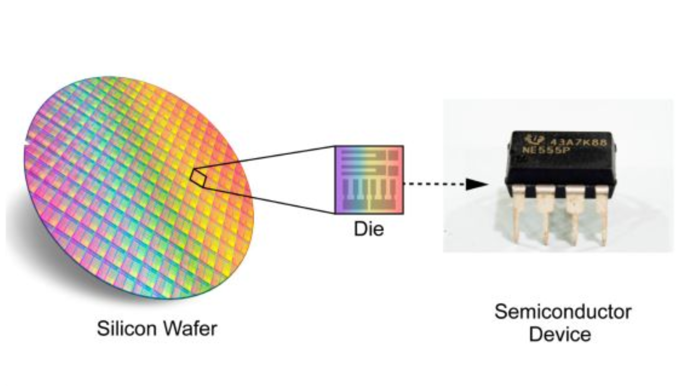

Normally, semiconductor chips are cut from a circular silicon plate called a **wafer**. A single wafer produces tens or hundreds of smaller chips, and each chip is packaged separately to become a GPU, CPU, or another product.

**Cerebras** flips that logic. It does not cut the wafer into many chips. It uses the whole wafer almost like a single chip. Based on public materials, **Wafer-Scale Engine 3(WSE-3)** has an area of **46,225mm²**. It is close to a 215mm by 215mm square and is more than 50 times larger than an **NVIDIA** H100 chip, which is about 814mm².

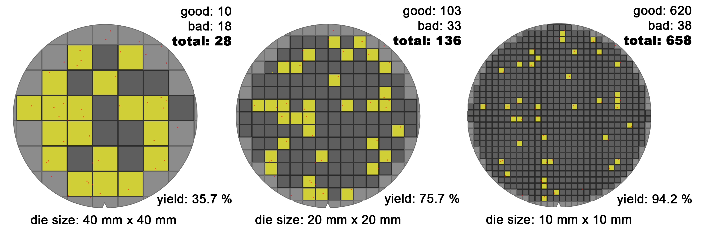

Why, then, have so few companies built wafer-scale chips? The biggest reason is **yield**. Defects are unavoidable in semiconductor manufacturing. With small chips, you can discard the defective chips and keep the rest. But as chip area grows, the probability that at least one defect lands inside the die rises, and the amount of silicon lost with each defect also grows.

If the same defect density is assumed, small dies can still produce many good chips. Larger dies reduce the ratio of usable chips much more quickly. On top of that, square dies printed on a circular wafer waste more edge area as die size increases.

As a result, large chips usually mean lower yield and more wasted wafer area, which pushes product cost up sharply. That is why wafer-scale chips were long considered economically difficult.

**Cerebras** attacked this problem through architecture.

---

## WSE-3 architecture

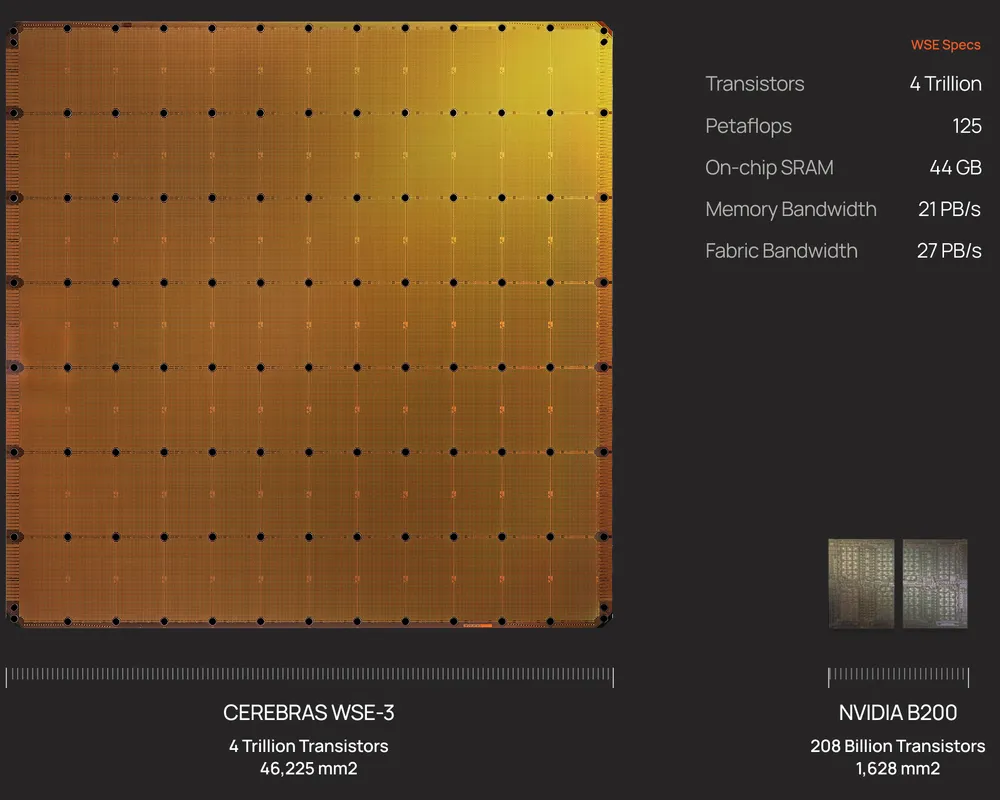

**WSE-3** is the third-generation wafer-scale chip announced in March 2024. It is built on **TSMC** 5nm technology. According to public materials, it contains more than **4 trillion transistors**, **900,000 active AI cores**, **44GB of on-chip SRAM**, **21PB/s of memory bandwidth**, and **214Pb/s of fabric bandwidth**.

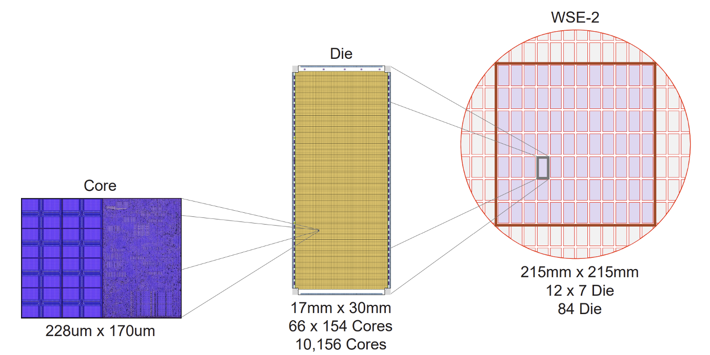

In **WSE**, one wafer becomes one chip, and that chip contains 84 connected die regions. In a conventional GPU or CPU, one die would normally be cut out and sold as a separate chip. In WSE, those die regions remain connected and are used together as one chip. Each die contains more than ten thousand cores.

Each core contains fabric for communicating with neighboring cores, 48KB of SRAM and a 512B cache for storage, registers for holding data right before computation, and parallel 16-bit and 8-bit compute units. The 16-bit unit can process 8 data elements at once, while the 8-bit unit can process 16 data elements in parallel.

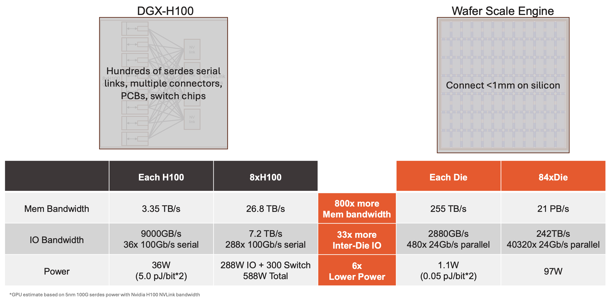

An H100 fetches data from off-chip **High Bandwidth Memory(HBM)**. HBM is fast, but it still lives outside the compute chip, so the physical connection between compute and memory can become a bottleneck. In addition, connecting multiple chips requires links such as NVLink and a large amount of board-level and system-level interconnect.

By contrast, **WSE-3** places memory directly on the chip. It distributes **Static Random-Access Memory(SRAM)** across the cores. Public WSE-3 materials describe **48KB of SRAM** per core, which adds up to **44GB** of on-chip memory across the wafer. This is why Cerebras emphasizes the bandwidth gain from moving from HBM-style off-chip memory access toward SRAM close to compute. Because the die regions are also kept together on a single chip, communication between them happens over very short on-silicon wires.

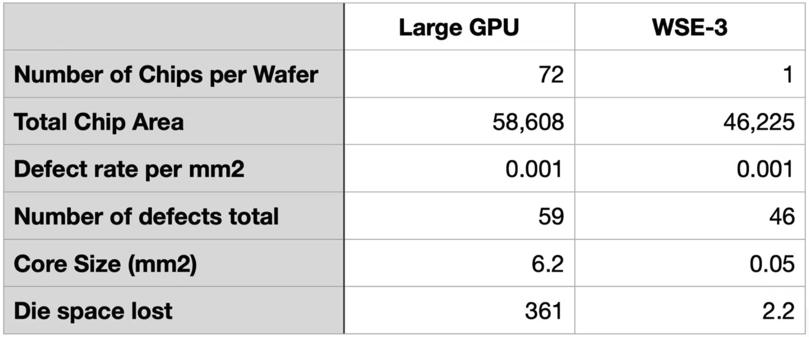

**Cerebras** addresses the wafer-scale yield problem by making each core very small. In other words, it makes the “unit of loss” from a defect extremely small. The whole wafer is not treated as one giant failure domain. Instead, only some of the many small cores are lost when defects appear.

The WSE-3 white paper describes an individual core as roughly 38,000µm², or 0.038mm². If we use about 6mm² as a rough size for an **H100** **Streaming Multiprocessor(SM)**, the difference is more than two orders of magnitude.

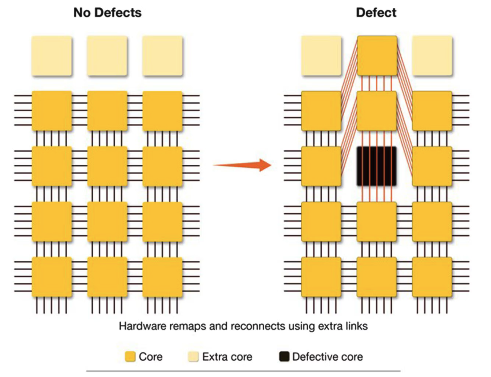

At that point, a natural question follows: if a wafer-scale chip still contains unusable cores, does that not make the whole chip unusable? WSE solves that by designing routing paths that can bypass defective cores. Each core is connected to its neighbors through a two-dimensional mesh. Spare cores and spare wires are included so that, when defects are found, the system can route around damaged regions while keeping the logical communication structure intact.

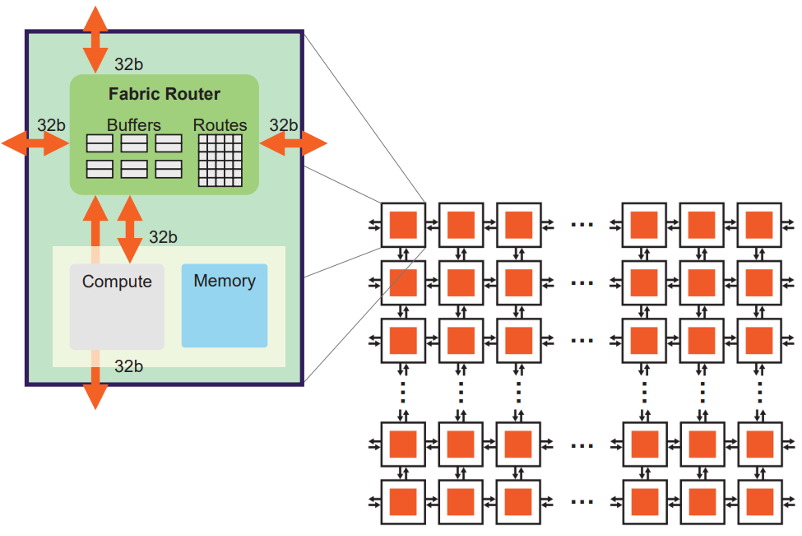

This design also affects how computation flows. **WSE** is close to a dataflow style, where computation is triggered when data arrives. In matrix multiplication, the wafer's cores can behave like one enormous array, and only non-zero weights can be broadcast to exploit sparsity. The WSE-2 paper explains that this structure can achieve high utilization on unstructured sparsity compared with GPUs.

---

## Putting models into SRAM

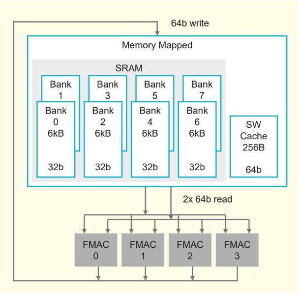

It is easy to describe LLM inference as “a lot of compute,” but that misses an important bottleneck. To generate each token, a model repeatedly reads weights, handles activations and the Key-Value cache, and then repeats the process for the next token. In many cases, the bottleneck is not FLOPS alone. It is how quickly the system can read the weights.

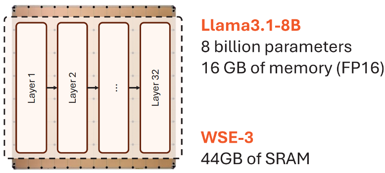

The 44GB SRAM on **WSE-3** targets this issue. Smaller models, or parts of a model, can be kept on the wafer and read at very high bandwidth close to the cores. GPU **HBM** is also fast, but WSE's SRAM is placed closer to compute and distributed much more densely. This is why **Cerebras** frames inference as a memory bandwidth problem and focuses on reducing the distance that weights and activations need to travel.

That does not mean every model fits entirely inside 44GB of SRAM. For models at the 70B scale and above, even reduced precision makes it difficult to place everything on a single WSE. So **Cerebras** does not follow a “put everything on-chip” strategy. Instead, it keeps as much as possible in SRAM and relies on external DRAM or Flash storage with weight streaming for larger models.

As a result, WSE performance is strongly tied to where the model is placed. Anything that fits in SRAM can be accessed extremely quickly. But as models grow and depend more on external memory or multi-device streaming, the locality advantage inside the wafer becomes smaller. That trade-off is why MemoryX and SwarmX matter.

---

## Inter-chip connectivity

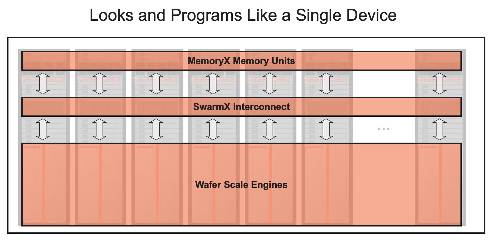

Supporting very large models requires more than a single WSE. That is why **Cerebras** designs not only the chip itself, but also the **CS-3 system** and the scale-out structure that connects many CS-3 systems together.

For large-model training, weights are not all stored on the wafer. Instead, they are stored externally in **MemoryX** and streamed layer by layer into **CS-3**. When multiple **CS-3** systems are connected, **SwarmX** handles weight broadcast and gradient reduction.

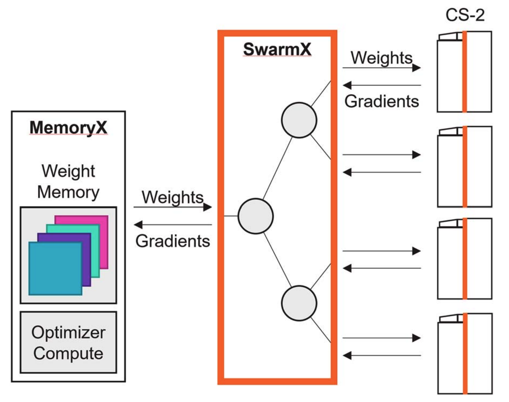

In plain terms, **MemoryX** is like a warehouse for model parameters. WSE SRAM is extremely fast, but it is not large enough to hold all the weights, gradients, and optimizer states of very large models. So those larger states live in **MemoryX**, while only the weights needed for the current layer are streamed toward **CS-3**. MemoryX is connected through 12 links of 100 Gigabit Ethernet, which is about 150GB/s when converted into bytes. That is still much slower than on-wafer SRAM, so the system tries to overlap loading with computation in order to hide memory latency.

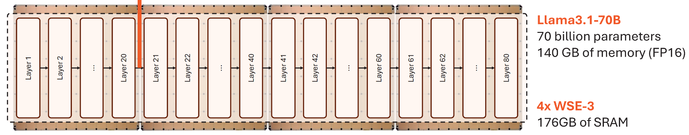

**SwarmX**, meanwhile, is the distributor and aggregator between multiple **CS-3** systems. During training, the same weights must be broadcast to many **CS-3** systems, and the gradients computed by those systems must be reduced back together. During inference, different model layers may be distributed across different CS-3 systems, and the output of one system must be passed to the next layer on another system. **SwarmX** handles these broadcast and reduce patterns so that many WSEs can act like one larger learning system.

The goal is to avoid forcing users to manually split the model in detail through tensor parallelism or pipeline parallelism. In **Cerebras**'s framing, the system should look closer to data parallelism even as model size grows. Internally, MemoryX, SwarmX, and CS-3 divide the roles of storage, communication, and compute.

Public materials describe systems that scale up to 2,048 CS-3 units. The important point is not simply that many machines can be connected. It is that weight broadcast and gradient reduction are designed as part of the system so that they do not immediately become bottlenecks.

The trade-off is that a scale-out system has more moving parts than a single chip. More systems mean more networking, power, cooling, and operational complexity. For inference, model placement, batch size, and the latency impact of streaming all matter.

---

## Putting it vertically in a server?!

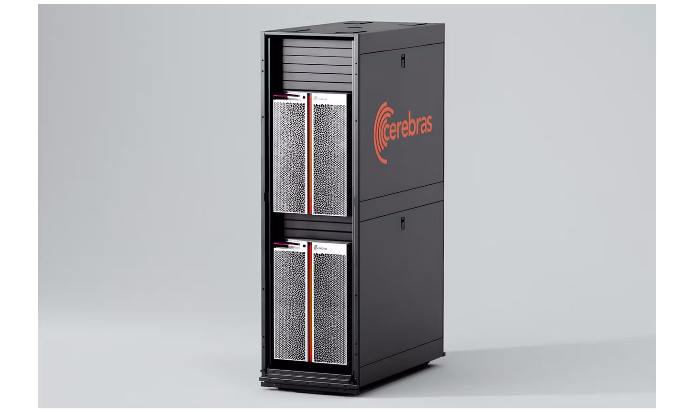

A wafer-scale chip is not just a large silicon die. It is a thin structure more than 20cm wide that must be mechanically supported, supplied with very large current, and cooled effectively. Its mechanical and thermal constraints are much harder than those of a conventional GPU package.

When a chip becomes this large, gravity, bending, thermal expansion, and contact pressure become difficult to ignore. If the wafer bends, electrical contact and cooling contact can become unstable. WSE therefore requires dedicated packaging, power delivery, cooling, and board support.

This is also why **Cerebras** sells complete systems such as CS-3. It is not a chip that a server vendor simply plugs into an ordinary board. **Cerebras** provides the wafer-scale chip, power modules, cooling structure, system fabric, MemoryX, and SwarmX as a complete machine.

From this perspective, **Cerebras** is closer to a wafer-scale computer company than a conventional chip vendor. The benefit starts inside the silicon, but using that benefit in a real data center requires packaging and system design to work together.

---

## Strengths and limitations of Cerebras

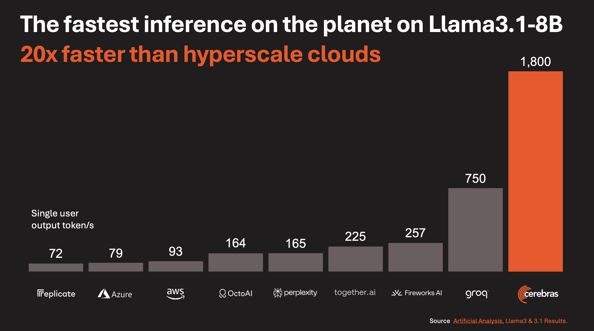

**Cerebras**'s biggest strength is **memory bandwidth and communication locality**. **Large Language Model(LLM)** inference often looks like a compute problem, but it is also a memory bandwidth problem because model weights must be read repeatedly for every generated token. WSE attacks that problem by maximizing bandwidth through large amounts of SRAM close to compute. It also reduces the communication overhead that appears when many chips must be connected together.

The limitations come from the same design choices. The most obvious one is that 44GB of SRAM is extremely fast, but still limited in capacity. Models at the 70B scale and above require either multiple devices or external weight streaming structures.

Under a short-output setting(128 prompt tokens and 20 output tokens), **Cerebras** keeps single-user speed high while increasing throughput as batch size grows. But what happens if many users submit book-length prompts and require long outputs? In high-batch, long-sequence settings, WSE may struggle to hold both model weights and KV cache inside 44GB. That would increase dependence on MemoryX loading, which could lead to more visible slowdowns compared with larger-capacity HBM-based systems.

If a user tries to avoid that by adding more systems for capacity, then dependence on MemoryX may decrease, but initial deployment cost rises as well.
There is no official price list, but public estimates help show the scale. The Next Platform estimates a CS-2/CS-3 node at roughly **$2.5M–$3.2M**, or around **$4M** when MemoryX and SwarmX are included. At a rough exchange rate of $1 = ₩1,500, that is about **₩3.75B–₩6B per node**. SEC-filed purchase orders also show CS-3 cluster goods fees in the **$178M–$350M** range. In other words, moving toward WSE is not just a matter of chip performance. It implies upfront deployments that bundle CS-3, MemoryX, SwarmX, networking, power, and cooling at multi-billion-won and even hundred-million-dollar scales.

---

## To sum up

In this post, we covered:

① **Cerebras**'s recent momentum and reports of a large **OpenAI** deal,  
② the company's founding background and why it chose wafer-scale computing,  
③ the concept of the **Wafer-Scale Engine(WSE)** and the core architecture of **WSE-3**,  
④ SRAM, MemoryX/SwarmX, and the scale-out connectivity structure,  
⑤ **Cerebras**'s strengths, including bandwidth, locality, and scale-out design, and its limits, including long-output inference, high-batch behavior, and high upfront cost.

**Cerebras**'s **Wafer-Scale Engine** is an aggressive design that uses an entire wafer as a chip. But the real point is not size alone. The important ideas are isolating defects at a small unit, placing SRAM close to cores, and keeping data movement inside the wafer through a two-dimensional mesh fabric.

The AI accelerator market can no longer be explained only through **NVIDIA**. Wafer-scale chips, inference-only accelerators, memory hierarchy expansion, optical interconnects, and many other approaches now coexist.
In an increasingly diverse NPU market, the more important question is: which accelerator is optimized for which workload?

See you in the next installment of **Know Your Enemy, Know Yourself**.

---

## Reference

- [100x Defect Tolerance: How Cerebras Solved the Yield Problem - Cerebras](https://www.cerebras.ai/blog/100x-defect-tolerance-how-cerebras-solved-the-yield-problem)
- [AWS and Cerebras announce AI inference collaboration - Cerebras](https://www.cerebras.ai/press-release/awscollaboration)
- [AWS and Cerebras bring ultra-fast AI inference to Amazon Bedrock - Amazon](https://www.aboutamazon.com/news/aws/aws-cerebras-ai-inference)
- [Cerebras Systems Form S-1 Registration Statement - SEC EDGAR](https://www.sec.gov/Archives/edgar/data/2021728/000162828026025762/0001628280-26-025762-index.htm)
- [Cerebras CS-3 Purchase Order #2024-0003 - SEC EDGAR](https://www.sec.gov/Archives/edgar/data/2021728/000162828024041596/exhibit1012f-sx1.htm)
- [Cerebras MBZUAI CS-3 Purchase Order - SEC EDGAR](https://www.sec.gov/Archives/edgar/data/2021728/000162828024041596/exhibit1017-sx1.htm)
- [Cerebras Goes Hyperscale With Third Gen Waferscale Supercomputers - The Next Platform](https://www.nextplatform.com/2024/03/14/cerebras-goes-hyperscale-with-third-gen-waferscale-supercomputers)
- [Cerebras WSE-3 Architecture White Paper](https://cdn.sanity.io/files/e4qjo92p/production/2d7fa58e3b820715664bcf42097e86c05070c161.pdf)
- [Hot Chips 2024: Cerebras WSE-3 and Inference](https://hc2024.hotchips.org/assets/program/conference/day2/72_HC2024.Cerebras.Sean.v03.final.pdf)
- [IEEE Micro: Cerebras Architecture Deep Dive](https://8968533.fs1.hubspotusercontent-na2.net/hubfs/8968533/IEEE%20Micro%202023-03%20Hot%20Chips%2034%20Cerebras%20Architecture%20Deep%20Dive.pdf)

---

## P.S. HyperAccel is hiring!

The saying is “know your enemy, know yourself,” but to win consistently, we also need great people.

If the technologies we discuss here interest you, please apply through [HyperAccel Career](https://hyperaccel.career.greetinghr.com/en/guide).

HyperAccel has many excellent and thoughtful engineers. We look forward to hearing from you.
