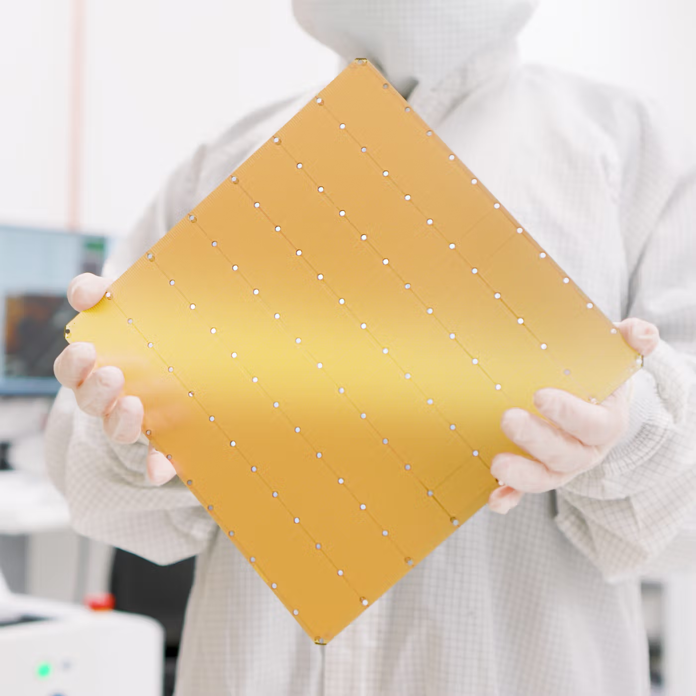
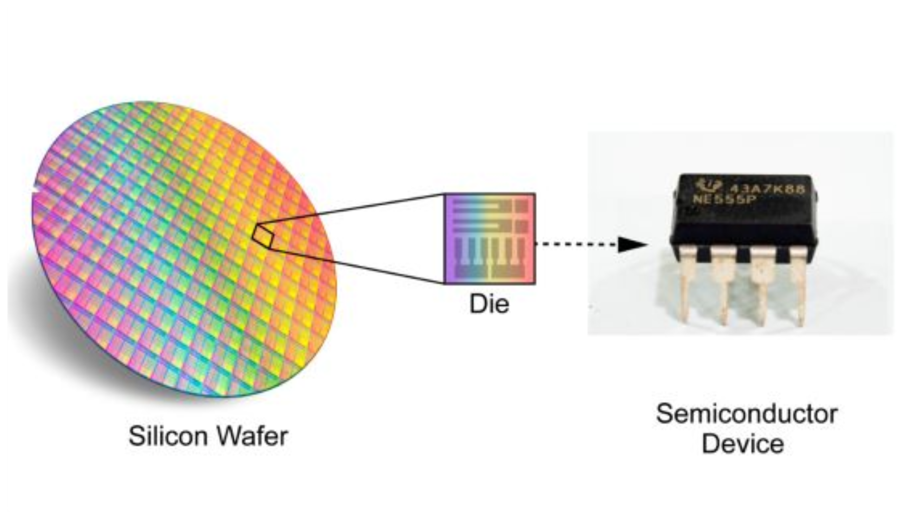

# 지피지기면 백전불태 5편: Cerebras와 웨이퍼 스케일 엔진

> **지피지기면 백전불태(知彼知己 百戰不殆)**  
상대를 알고 나를 알면 백 번 싸워도 위태롭지 않다는 뜻입니다.  
이 시리즈는 AI 가속기 설계를 위해 경쟁사들의 하드웨어를 깊이 이해하는 것을 목표로 합니다.  
다섯 번째 글에서는 **OpenAI** 가 100억 달러 규모로 선택한 **Cerebras** 의 **웨이퍼 스케일 엔진(WSE)** 을 다룹니다.

2026년 1월, **Cerebras** 는 AI 업계에 큰 소식을 전했습니다. **OpenAI** 와 100억 달러 규모의 계약을 맺었다는 것입니다. 최대 750MW 규모의 연산 능력을 2028년까지 3년간 공급한다는 내용이었죠. AI 가속기 시장에서 **NVIDIA** 이외의 플레이어가 이렇게 큰 계약을 따낸 건 이례적입니다.

이 글에서는 **Cerebras** 의 핵심 기술인 **웨이퍼 스케일 엔진(WSE)** 아키텍처가 무엇인지, 어떤 강점과 한계가 있는지 비전공자도 이해할 수 있게 정리합니다.

---

## Cerebras, 2026년에 왜 주목받는가

2026년 1월, **Cerebras** 는 **OpenAI** 와 100억 달러 규모 계약을 공식 발표했습니다. 최대 750MW 연산 능력을 2028년까지 3년간 공급한다는 내용이죠. 2025년 8월에는 **OpenAI** 오픈 모델 **gpt-oss-120B** 를 초당 3,000토큰이라는 속도로 구동하는 데 성공했습니다. 당시 세계 기록이었습니다.

주간 9억 명이 넘는 사용자를 돌리려면 **OpenAI** 에겐 데이터센터 용량이 크게 부족합니다. **NVIDIA** GPU에만 의존하면 비용과 공급 모두 한계가 있죠. **OpenAI** 는 더 저렴하고 효율적인 대안으로 **Cerebras** 에 눈을 돌린 것입니다. 특히 코딩 보조, 에이전트형 AI 같은 **추론(inference)** 작업에 적극 활용할 계획이라고 합니다.

---

## Cerebras란 어떤 회사인가

**Cerebras** 는 2015년 미국 캘리포니아에서 설립된 AI 반도체 스타트업입니다. 창업자 **Andrew Feldman** 과 **Gary Lauterbach** 는 2007년 **SeaMicro** 를 공동 설립했고, 2012년 **AMD** 에 3억 5,700만 달러에 매각한 경력이 있습니다. **Cerebras** 는 이 팀이 AI 시대를 맞아 "범용 GPU 외의 길"을 탐색하며 만든 회사입니다.

일반 GPU는 칩을 여러 개 이어 붙여 성능을 올립니다. 칩 간 통신과 메모리 대역폭이 병목이 되기 쉽죠. **Cerebras** 는 이 구조 자체를 바꾸겠다고 결심했습니다. 웨이퍼를 쪼개지 않고 **통째로 하나의 칩**처럼 쓰는 **웨이퍼 스케일 엔진(WSE)** 을 만들어 AI 학습과 추론에 쓰고 있습니다. 2016년 시리즈 A에서 2,700만 달러를 유치한 뒤, 2026년 기준 누적 18억 달러 이상을 모았습니다.

---

## 웨이퍼 스케일 엔진이란

일반적으로 반도체 칩은 **웨이퍼(wafer)** 라는 원형 실리콘 판에서 여러 개를 잘라냅니다. 하나의 웨이퍼에서 수십 개에서 수백 개의 작은 칩이 나오죠. 각 칩은 따로 포장되어 GPU, CPU 같은 제품이 됩니다.

**Cerebras** 는 이 방식을 뒤집었습니다. 웨이퍼를 쪼개지 않고 **통째로 하나의 칩**처럼 사용합니다. **Wafer Scale Engine 3(WSE-3)** 의 경우 가로세로 약 215mm로, **NVIDIA** H100 칩(약 814mm²)보다 면적이 50배 이상 큽니다. 이런 방식을 웨이퍼 스케일(wafer-scale)이라고 부릅니다.

그런데 왜 지금까지 웨이퍼 스케일 칩을 만드는 회사가 거의 없었을까요? 반도체 제조 과정에서 **결함(defect)** 이 생기는 것은 피할 수 없습니다. 칩이 클수록 결함이 하나라도 들어가면 전체가 못 쓰게 됩니다. 작은 칩은 결함 있는 부분만 버리고 나머지를 쓰면 되지만, 웨이퍼 통째로 쓰면 수율이 극히 낮아진다는 문제가 있었죠. 그래서 웨이퍼 스케일은 오랫동안 **경제적으로 불가능**하다고 여겨져 왔습니다.

**Cerebras** 는 이 문제를 **아키텍처 설계** 로 풀었습니다. 다음 섹션에서 그 비결을 살펴보겠습니다.

---

## WSE-3 아키텍처 핵심

**WSE-3** 는 2024년 3월에 공개된 3세대 웨이퍼 스케일 칩입니다. **TSMC** 5nm 공정으로 만들어진 단일 웨이퍼 위에 **4조 개의 트랜지스터** 가 들어갑니다. AI 연산에 최적화된 코어가 약 **90만 개** 들어가며, 최대 **125 페타플롭스(petaFLOPS)** 의 AI 연산 성능을 냅니다.

일반 GPU는 칩 밖에 있는 **High Bandwidth Memory(HBM)** 에서 데이터를 가져옵니다. **HBM** 은 대역폭이 크지만 칩과의 연결 구간에서 병목이 생기기 쉽죠. **WSE-3** 는 **44GB의 Static Random-Access Memory(SRAM)** 을 칩 안에 직접 넣었습니다. **SRAM** 은 **HBM** 보다 훨씬 빠르게 데이터를 읽고 쓸 수 있습니다. **WSE-3** 의 온칩 메모리 대역폭은 초당 **21 페타바이트(PB/s)** 에 달합니다. **NVIDIA** H100의 **HBM** 대역폭(약 3TB/s)과 비교하면 약 7,000배에 가깝죠.

웨이퍼 스케일의 수율 문제를 **Cerebras** 는 **코어를 매우 작게** 만드는 방식으로 해결했습니다. **WSE-3** 의 AI 코어 하나는 약 0.05mm²로, **H100** 의 **Streaming Multiprocessor(SM)** 하나(약 6mm²)의 1% 수준입니다. 결함이 생겨도 영향을 받는 면적이 작고, 칩 내부 회로로 우회할 수 있어 **결함 허용도** 가 기존 대비 수백 배 높아집니다.

**WSE-3** 를 쓰는 **CS-3** 슈퍼컴퓨터는 최대 2,048대까지 묶어 **256 엑사플롭스(exaFLOPS)** 규모까지 확장할 수 있습니다. 모델 파라미터 **24조 개** 까지 한 번에 올려 훈련할 수 있는 통합 메모리 구조를 갖추고 있습니다.

---

## Cerebras의 강점과 한계

**Cerebras** 의 가장 큰 강점은 **메모리 대역폭** 입니다. 온칩 **SRAM** 으로 **HBM** 대비 수천 배 수준의 대역폭을 얻습니다. 그 덕분에 **Large Language Model(LLM)** 추론처럼 메모리 접근이 많은 작업에서 **NVIDIA** DGX B200보다 2배 이상 빠른 토큰 생성 속도를 보이기도 합니다. Llama 4 Maverick 기준으로 사용자당 초당 2,500토큰을 처리했다는 벤치마크가 있습니다.

칩·메모리·연결이 모두 한 웨이퍼 안에 들어가 있어 여러 칩을 이어 붙일 때 생기는 **통신 오버헤드** 가 거의 없습니다. **NVLink** 같은 칩 간 연결이 필요하지 않죠. 이로 인해 대규모 AI 훈련에서 코드량을 GPU 대비 97% 줄일 수 있다고 **Cerebras** 는 주장합니다. **PyTorch** 2.0도 네이티브로 지원합니다.

반면 웨이퍼 스케일 방식의 한계도 있습니다. **TSMC** 와 함께 기존 **레티클 한계(reticle limit)** 를 넘어가는 노출 방식을 개발해야 했고, 제조 난이도와 초기 비용이 높습니다. 4편에서 다룬 **Inference Context Memory Storage(ICMS)** 나 3편의 **Language Processing Unit(LPU)** 와 비교하면, **Cerebras** 는 학습과 추론을 모두 목표로 하는 **범용 AI 가속기** 에 가깝습니다. **LPU** 는 추론 전용, **ICMS** 는 메모리 계층 확장에 집중한다는 점에서 역할이 다릅니다.

---

## 왜 OpenAI가 Cerebras를 선택했는가

**OpenAI** 는 2025년 말 기준 주간 9억 명이 넘는 사용자를 돌리며 **데이터센터 용량 부족** 이 심각해졌습니다. **NVIDIA** GPU에만 의존하면 공급과 비용 모두 한계가 있죠. **Sachin Katti** 인프라 담당자는 특히 코딩 보조, 문서 질의응답, 에이전트형 연구 같은 **추론** 워크로드에서 **Cerebras** 를 활용할 계획이라고 밝혔습니다.

**Cerebras** 의 추론 속도와 전력 효율은 **NVIDIA** 대비 유리할 수 있습니다. 같은 모델을 같은 조건에서 돌렸을 때 **Cerebras** 가 2배 이상 빠른 토큰 속도를 보인 사례가 있고, 단일 장치 구조 덕분에 여러 GPU를 묶는 복잡함과 오버헤드가 적습니다. **OpenAI** 입장에서는 비용 대비 성능과 확장성 모두에서 **Cerebras** 가 매력적인 선택이었을 것입니다.

---

## 정리하자면…

이 글에서는

① 2026년 **Cerebras** 의 근황과 **OpenAI** 100억 달러 계약,  
② **Cerebras** 의 창업 배경과 웨이퍼 스케일 도입 이유,  
③ **웨이퍼 스케일 엔진(WSE)** 개념과 **WSE-3** 아키텍처 핵심,  
④ **Cerebras** 의 강점(대역폭, 추론 속도)과 한계(제조 복잡도),  
⑤ **OpenAI** 가 **Cerebras** 를 선택한 배경을 살펴봤습니다.

**Cerebras** 의 **웨이퍼 스케일 엔진** 은 웨이퍼를 통째로 칩으로 쓰는 과감한 설계로, 메모리 대역폭과 결함 허용을 통해 기존 GPU와 다른 길을 걸어가고 있습니다. AI 가속기 시장은 이제 **NVIDIA** 일변도가 아닙니다. 웨이퍼 스케일, 추론 전용, 메모리 계층 확장 등 다양한 접근이 공존하는 시대가 됐습니다.

그럼 **지피지기면 백전불태 5편: Cerebras와 웨이퍼 스케일 엔진** 에서 다시 뵙겠습니다.

---

## 추신: HyperAccel은 채용 중입니다!

지피지기면 백전불태라지만 백전백승을 위해서는 훌륭한 인재가 많이 필요합니다!

저희가 다루는 기술들을 보시고, 관심이 있으시다면 [HyperAccel Career](https://hyperaccel.career.greetinghr.com/ko/guide)로 지원해 주세요!

HyperAccel에는 정말 훌륭하고 똑똑한 엔지니어분들이 많습니다. 여러분의 지원을 기다립니다.
