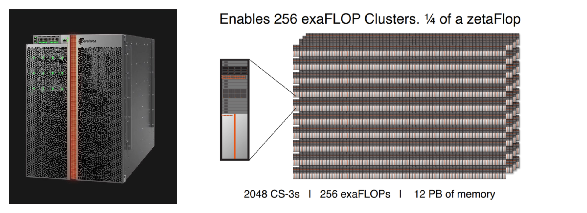
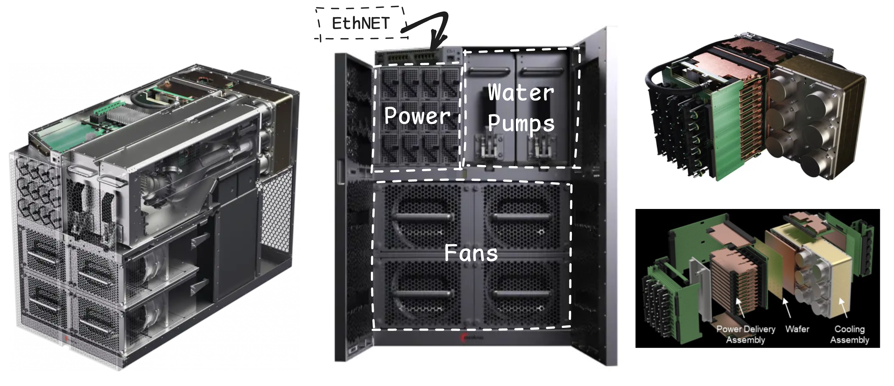
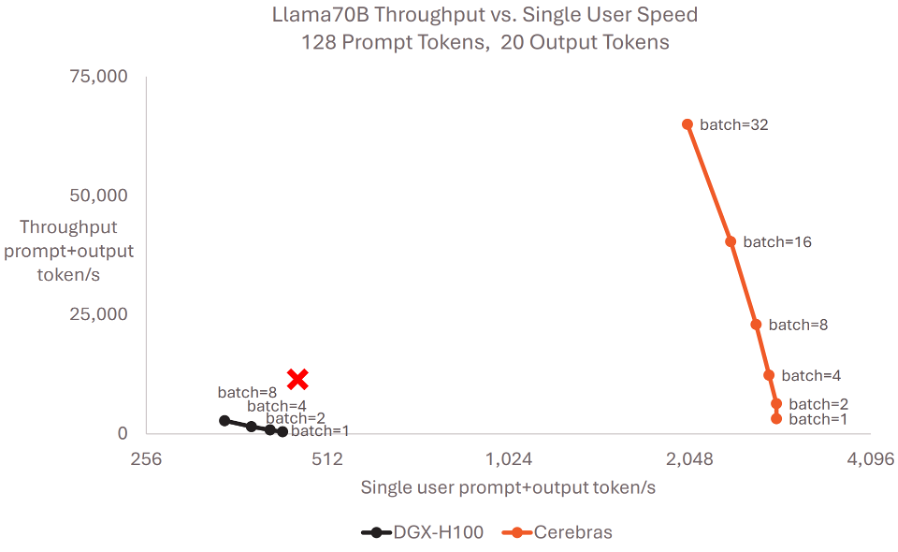

# 지피지기면 백전불태 5편: Cerebras와 웨이퍼 스케일 엔진

> **지피지기면 백전불태(知彼知己 百戰不殆)**  
> 상대를 알고 나를 알면 백 번 싸워도 위태롭지 않다는 뜻입니다.  
> 이 시리즈는 AI 가속기 설계를 위해 경쟁사들의 하드웨어를 깊이 이해하는 것을 목표로 합니다.  
> 다섯 번째 글에서는 **Cerebras** 의 **Wafer-Scale Engine(WSE)** 을 다룹니다.

안녕하세요, CL팀 최동현입니다.
웨이퍼 하나를 통째로 칩으로 만드는 회사가 있다는 것, 알고 계셨나요?

오늘은 **Cerebras** 의 **Wafer-Scale Engine(WSE)** 을 다뤄보려고 합니다.

2026년 1월, **Cerebras** 는 AI 업계에 큰 소식을 전했습니다. 여러 보도에 따르면 **OpenAI** 와 **100억 달러** 규모의 계약을 맺고, 최대 **750MW** 규모의 연산 용량을 2028년까지 공급한다는 내용이었습니다. AI 가속기 시장에서 **NVIDIA** 이외의 플레이어가 이렇게 큰 계약의 후보로 언급된 건 이례적입니다.

이 글에서는 **Cerebras** 의 핵심 기술인 **웨이퍼 스케일 엔진(WSE)** 아키텍처가 무엇인지, 왜 수율 문제가 어려웠는지, **Cerebras** 가 이를 어떻게 풀었는지 정리합니다.

---

## Cerebras, 왜 주목받는가

Cerebras는 2015년 미국 캘리포니아에서 설립된 AI 반도체 스타트업입니다. 창업자 **Andrew Feldman** 과 **Gary Lauterbach** 는 2007년 **SeaMicro** 를 공동 설립했고, 2012년 **AMD** 에 3억 5,700만 달러에 매각한 경력이 있습니다. 이들은 이런 경험을 바탕으로, AI 시대에는 범용 GPU와 다른 길도 필요하다고 보고 Cerebras를 세웠습니다.

이들의 문제의식은 비교적 분명했습니다. 통상적인 칩 크기로는 on-chip memory의 크기에 한계가 있고 이에 더해 모델이 커질수록 더 많은 기기간 연결이 필요합니다. 그 결과 메모리 대역폭, 칩 간 통신이 병목이 되기 쉽습니다.

그래서 Cerebras가 택한 해법은 계산과 데이터 이동을 가능한 한 하나의 웨이퍼 안에 가두는 것이었습니다. 웨이퍼를 잘게 나누지 않고 통째로 하나의 칩처럼 쓰는 **웨이퍼 스케일 엔진(WSE)** 을 만들어 AI 학습과 추론에 활용한 것이죠. 핵심은 단순히 “칩을 크게 만들자”가 아니라, 칩 밖으로 오가던 데이터를 웨이퍼 내부에서 처리하자는 데 있습니다.

이 아이디어는 기술적 실험에 그치지 않고 최근 사업적 관심으로도 이어졌습니다. 2025년 8월, **Cerebras** 는 **OpenAI** 오픈 모델 **gpt-oss-120B** 를 **초당 3,000토큰** 수준으로 구동했다고 발표했습니다. 이어 2026년 1월에는 **OpenAI** 와 대형 계약을 맺었다는 보도가 나왔고, 2026년 3월에는 **AWS** 와 함께 **Amazon Bedrock** 에서 **Trainium** 기반 prefill과 **Cerebras CS-3** 기반 decode를 결합하는 추론 협력을 공식 발표했습니다.

자본시장도 이런 흐름에 반응했습니다. Cerebras는 2024년 한 차례 기업공개를 추진했다가 2025년에 철회한 뒤, 2026년 4월 미국 **Securities and Exchange Commission(SEC)** 에 **S-1** 을 다시 제출해 Nasdaq 상장(티커 **CBRS**)을 추진 중입니다.

왜 이런 대안이 주목받을까요? 주간 수억 명 규모의 사용자에게 초거대 모델 기반 서비스를 제공하려면 데이터센터 용량을 계속 키워야 합니다. 그러나 **NVIDIA** GPU에만 의존하면 비용과 공급 모두에서 제약이 생깁니다. 그래서 대형 AI 서비스 사업자는 GPU 클러스터와 다른 구조의 가속기도 검토할 수밖에 없습니다.

결국 Cerebras는 단순히 “특이한 칩을 만든 회사”를 넘어, 클라우드 사업자와 모델 사업자가 실제 선택지로 검토하는 회사가 됐습니다. 그리고 그 선택지를 가능하게 한 핵심이 바로 **WSE** 라는 독특한 아키텍처입니다.

---

## 웨이퍼 스케일 엔진이란

일반적으로 반도체 칩은 웨이퍼(wafer)라는 원형 실리콘 판에서 여러 개를 잘라냅니다. 하나의 웨이퍼에서 수십 개에서 수백 개의 작은 칩이 나오고, 각 칩은 따로 패키징되어 GPU, CPU 같은 제품이 됩니다.

Cerebras는 이 방식을 뒤집었습니다. 웨이퍼를 쪼개지 않고 통째로 하나의 칩처럼 사용합니다. 공개 자료 기준 **Wafer-Scale Engine 3(WSE-3)** 의 면적은 **46,225mm²** 입니다. 가로세로 약 215mm인 정사각형에 가까운 칩으로, **NVIDIA** H100 칩(약 814mm²)보다 면적이 **50배 이상** 큽니다.

그런데 왜 지금까지 웨이퍼 스케일 칩을 만드는 회사가 거의 없었을까요? 가장 큰 이유는 **수율(yield)** 입니다. 반도체 제조 과정에서 결함(defect)이 생기는 것은 피할 수 없습니다. 작은 칩은 결함이 들어간 칩만 버리고 나머지를 쓰면 됩니다. 하지만 칩이 커질수록 결함 하나가 들어갈 확률이 높아지고, 결함 때문에 버려지는 면적도 커집니다.

그림처럼 **같은 밀도** 의 결함이 있다고 가정해 보겠습니다. 작은 die에서는 결함이 없는 정상 die를 많이 얻을 수 있습니다. 반대로 die 면적이 커지면 정상 die의 비율이 빠르게 낮아집니다. 여기에 원형 웨이퍼에서 사각형 die를 찍어낼 때 가장자리에서 버려지는 면적까지 더해집니다.

결론적으로 큰 칩은 낮은 수율과 낭비되는 웨이퍼 면적 때문에 제품 단가가 급격히 올라갑니다. 그래서 웨이퍼 스케일 칩은 오랫동안 **경제적으로 어렵다**고 여겨져 왔습니다.

Cerebras는 이 문제를 아키텍처 설계로 풀었습니다.

---

## WSE-3 아키텍처

**WSE-3** 는 2024년 3월에 공개된 3세대 웨이퍼 스케일 칩입니다. **TSMC** 5nm 공정으로 만들어졌고, 공개 자료 기준 **4조 개 이상의 트랜지스터**, **90만 개의 활성 AI 코어**, **44GB 온칩 SRAM**, **21PB/s 메모리 대역폭**, **214Pb/s 패브릭 대역폭** 을 갖습니다.

**WSE** 는 웨이퍼 하나에서 하나의 칩을 찍어내고, 칩 하나는 84개의 서로 연결된 다이(die)를 가지고 있습니다. 일반적인 GPU나 CPU의 경우 이 다이 하나를 잘라내어 칩 하나 판매하지만, WSE의 경우 이 다이들을 서로 연결시켜 하나의 칩으로 사용합니다. 각 다이 내에는 **만개** 이상의 코어(core)를 가지고 있습니다.

각 코어 안에는 인접 코어간 연결을 위한 **패브릭(fabric)**, 데이터 저장을 위한 **SRAM 48KB**와 **캐시 512B**, 연산 직전에 데이터를 담아두는 **레지스터**, 그리고 **16비트와 8비트 병렬 연산기**가 있습니다. 16비트 연산기는 8개 데이터, 8비트 연산기는 16개 데이터에 대해서 동시에 연산할 수 있습니다.

Nvidia의 H100은 칩 밖에 있는 **High Bandwidth Memory(HBM)** 에서 데이터를 가져옵니다. 물론 그 이름부터가 "고대역폭 메모리"이기 때문에 HBM은 굉장히 빠른 메모리이긴 합니다만 어찌되었건 연산이 이루어지는 칩 밖에 존재하는 메모리이기 때문에 연산 유닛과 메모리 사이의 물리적 연결이 병목이 될 수 있습니다. 또한 여러 칩이 연결되기 위해서는 NVLink를 거치고 칩간 연결을 위한 많은 커넥터가 필요합니다.
반면 **WSE-3** 는 메모리를 칩 위에 다 올려버렸습니다. 각 코어 내에 거대한 **Static Random-Access Memory(SRAM)** 를 분산 배치합니다. 공개된 WSE-3 자료에 따르면 코어 하나에는 **48KB SRAM** 이 붙어 있고, 전체 칩으로 따지면 **총 44GB** 온칩 메모리가 됩니다. HBM에서 SRAM으로 전환하면서 **800배가 넘는 메모리 대역폭 이득** 을 보는 것이죠.

여기에 더해 각 die를 별도의 칩으로 자르지 않고, 하나의 칩 위에 모두 같이 올린 형태입니다. 이 덕분에 die 간 통신은 매우 짧은 실리콘 상의 와이어로 연결됩니다. 결과적으로 **H100 대비 33배나 더 빠른 통신 속도** 를 기대할 수 있습니다.

Cerebras는 웨이퍼 스케일의 수율 문제를 코어를 매우 작게 만드는 방식으로 해결했습니다. 다시말해, “결함이 생겼을 때 잃는 단위”를 아주 작게 만드는 것입니다. 
개별 코어의 크기를 매우 작게 만들어 거대한 웨이퍼 전체가 하나의 실패 단위가 아니라, 수십만 개의 작은 코어 중 결함이 생긴 몇개 코어만 잃도록 하는 것이죠.
**WSE-3** white paper에 따르면 개별 코어 면적은 약 38,000µm², 즉 **0.038mm²** 수준으로 설명합니다. **H100** 의 **Streaming Multiprocessor(SM)** 가 약 **6mm²** 정도 된다고 하니 개별 코어 면적으로는 백배 이상의 차이가 납니다.
그 결과, 잃게 되는 다이면적(못 쓰는 코어의 개수)가 획기적으로 줄어들게 됩니다.

못쓰는 코어가 줄어든다고 해도, 웨이퍼레벨이라면 그 못쓰는 칩을 잘라낼 수 없으니 어찌됐건 칩을 못쓰는게 아니냐 라는 의문이 들 수 있습니다. WSE는 이 문제를 해결하기 위해 결함이 생긴 코어를 **우회하는 연결 구조**를 설계했습니다. 기본적으로 각 코어는 이웃한 코어와의 데이터 전송을 위해 **2차원 mesh**로 연결됩니다. 다이 안에는 **여분의 코어**를 만들어 넣어두고, 결함이 발견되면 결함이 발생한 코어를 우회하는 여분의 wire를 활성화시켜 정상 코어와 연결합니다. 즉, 결함이 발생한 코어가 있더라도 논리적인 코어간 연결 구조는 바뀌지 않습니다.

WSE는 데이터가 도착하면 연산이 발생하는 dataflow 방식으로 동작합니다. MemoryX에서 전송된 weight는 `(index, value)` 형태의 **packet**으로 만들어져 필요한 코어로 라우팅됩니다. packet을 받은 코어는 해당 index에 대응하는 activation을 읽고 multiply-add를 수행합니다.

이처럼 목적지와 연산 대상이 packet 단위로 지정되는 구조 덕분에, WSE는 **unstructured sparse pattern**에도 효과적으로 대응할 수 있습니다. 핵심은 값이 0인 weight packet을 애초에 MemoryX에서 **전송하지 않는다**는 점입니다. 따라서 0인 weight는 packet으로 만들어지지 않고, fabric traffic도 만들지 않으며, 대응되는 연산도 발생시키지 않습니다.

즉 WSE에서 sparsity를 활용한다는 것은 단순히 0을 압축해 저장하는 것이 아니라, **0에 해당하는 데이터 이동과 compute event를 아예 생성하지 않는다**는 의미입니다. 이 fine-grained dataflow 실행 방식 덕분에 WSE는 unstructured sparsity에서도 GPU의 dense tile 기반 실행보다 높은 실제 활용률을 기대할 수 있다고 설명합니다.

---

## SRAM에 모델 올리기

LLM 추론을 단순히 “연산량이 많다”라고만 보면 중요한 병목을 놓치기 쉽습니다. 생성형 모델은 token을 하나 만들 때마다 weight를 읽고, activation과 Key-Value cache를 다루고, 다음 token을 위해 다시 같은 과정을 반복합니다. 이때 많은 경우 병목은 FLOPS 자체보다 **weight를 얼마나 빨리 읽어 오느냐**에서 생깁니다.

**WSE-3** 의 44GB SRAM은 이 지점을 겨냥합니다. 작은 모델이나 일부 layer는 웨이퍼 안에 올려두고, 코어 가까이에서 매우 높은 대역폭으로 읽을 수 있습니다. GPU의 **HBM** 도 빠르지만, WSE의 SRAM은 더 가까운 위치에 더 촘촘히 분산되어 있습니다. 이 때문에 Cerebras는 추론을 memory bandwidth 문제로 보고, weight와 activation 이동 거리를 줄이는 데 집중합니다.

그렇다고 모든 모델을 44GB SRAM 안에 넣겠다는 뜻은 아닙니다. 70B급 이상의 모델은 정밀도를 낮춰도 단일 WSE SRAM에 모두 올리기 어렵습니다. 그래서 Cerebras의 시스템은 “모든 것을 칩 안에 넣는다”가 아니라, 올릴 수 있을 만큼 SRAM에 올려 두고, 더 큰 모델은 **외부 DRAM/Flash 메모리**에 두고 weight streaming을 통해 불러오는 방식을 택합니다.

따라서 WSE의 성능은 모델을 어디에 배치하느냐와 강하게 연결됩니다. SRAM에 올라가는 부분은 매우 빠르게 접근할 수 있습니다. 반대로 모델이 커져 외부 메모리나 여러 장치 간 streaming에 의존할수록, 웨이퍼 안에서 얻는 locality 이점은 줄어듭니다. 이 trade-off가 뒤에서 볼 MemoryX와 SwarmX가 필요한 이유입니다.

---

## 칩 간 연결성

44GB SRAM에도 다 들어가지 않는 초거대 모델을 지원하려면 단일 WSE만으로는 부족합니다. 그래서 Cerebras는 칩 하나가 아니라 **CS-3 시스템**, 그리고 여러 CS-3를 묶는 scale-out 구조까지 함께 설계합니다.

큰 모델 학습에서는 가중치를 웨이퍼 안에 모두 저장하지 않습니다. 외부의 **MemoryX** 에 모델 weight를 저장한 뒤, layer-by-layer로 **CS-3** 에 streaming합니다. 여러 **CS-3** 를 묶을 때는 **SwarmX** 가 weight broadcast와 gradient reduce를 담당합니다.

조금 풀어 말하면, **MemoryX** 는 모델 파라미터 창고에 가깝습니다. WSE의 SRAM은 매우 빠르지만 모든 거대 모델의 weight, gradient, optimizer state를 담기에는 부족합니다. 그래서 큰 상태값은 **MemoryX** 에 두고, 지금 계산할 layer의 weight만 **CS-3** 쪽으로 흘려보냅니다. MemoryX는 12개의 100 Gigabit 이더넷 링크로 연결되어있고 이 대역폭을 바이트단위로 환산하면 150GB/s 입니다. 상대적으로 매우 느린 저장공간이라고 할 수 있고, 따라서 WSE는 이 메모리 로드와 이미 불러온 44GB SRAM 상의 데이터에 대한 연산 시간을 겹쳐 메모리 로딩 시간을 감추는 방식을 사용합니다.

반면 **SwarmX** 는 여러 **CS-3** 사이의 분배기이자 합산기입니다. 학습할 때는 같은 weight를 여러 **CS-3** 에 뿌려야 하고, 각 장비가 계산한 gradient를 다시 모아야 합니다. 반면 추론할 때에는 각 CS-3에 모델 레이어를 분배하여야 하고 한 장비가 계산한 결과물을 다음 레이어를 가진 장비로 넘겨줘야 합니다. **SwarmX** 는 이 broadcast와 reduce 패턴을 담당해 여러 WSE가 하나의 큰 학습 시스템처럼 움직이도록 돕습니다.

이 구조의 목표는 사용자가 tensor parallelism이나 pipeline parallelism을 직접 세밀하게 쪼개지 않아도 되게 만드는 것입니다. Cerebras의 표현을 빌리면, 모델 크기를 키워도 프로그래머 입장에서는 데이터 병렬에 가까운 형태로 보이게 만드는 것이 목표입니다. 내부에서는 MemoryX, SwarmX, CS-3가 각각 저장, 통신, compute 역할을 나눠 맡습니다.

CS-3 시스템의 경우 **최대 2,048대** 까지 묶어 매우 큰 학습 시스템을 구성할 수 있다고 설명합니다. 이때 중요한 점은 단순히 “많이 연결한다”가 아닙니다. weight broadcast와 gradient reduce가 병목이 되지 않도록 네트워크를 시스템 일부로 함께 설계했다는 점입니다.

---

## 서버에 세로로 넣는다?!

웨이퍼 스케일 칩은 단순히 “큰 silicon die”가 아닙니다. 가로세로 20cm가 넘는 얇은 구조물을 안정적으로 지지하고, 수만 암페어 수준의 전류를 공급하고, 발생하는 열을 빼내야 하는 **시스템 문제**입니다. 일반 GPU 패키지보다 기계적·열적 제약이 훨씬 까다롭습니다.

너무 큰 칩을 다룰 때는 중력, 휨, 열팽창, 접촉 압력 같은 물리적 요소가 무시하기 어려워집니다. 웨이퍼가 휘면 전기적 접촉과 냉각 접촉이 불안정해질 수 있습니다. 그래서 WSE는 칩 설계만으로 끝나지 않고, **전용 패키징**, **전력 공급**, **냉각**, **보드 지지 구조**가 함께 필요합니다.

Cerebras가 CS-3 같은 완제품 시스템 형태로 판매하는 이유도 여기에 있습니다. WSE만 따로 팔아서 서버 업체가 알아서 꽂는 구조가 아닙니다. 웨이퍼 크기의 chip, 전력 공급 모듈, 냉각 구조, system fabric, MemoryX와 SwarmX까지 묶어 하나의 장비로 제공합니다.

이 관점에서 보면 Cerebras는 “칩 회사”라기보다 **“웨이퍼 스케일 컴퓨터 회사”** 에 가깝습니다. WSE의 장점은 silicon 내부에서 나오지만, 그 장점을 실제 데이터센터에서 쓰려면 패키징과 시스템 설계가 반드시 따라와야 합니다.

---

## Cerebras의 강점과 한계

Cerebras의 가장 큰 강점은 **메모리 대역폭과 통신 locality** 입니다. **Large Language Model(LLM)** 추론은 흔히 “연산 문제”처럼 보이지만, 실제로는 매 token마다 모델 weight를 반복해서 읽어야 하는 memory bandwidth 문제이기도 합니다. WSE는 거대한 SRAM을 사용하여 bandwidth를 극대화하는 방식으로 이 문제를 해결했습니다. 또한 칩·메모리·연결이 모두 한 웨이퍼 안에 들어가 있어 여러 칩을 이어 붙일 때 생기는 **통신 오버헤드** 를 줄였습니다.

한계도 같은 지점에서 나옵니다. 가장 큰 한계는 44GB SRAM은 대단히 빠르지만 용량이 제한적이라는 것입니다. 70B급 이상의 모델은 여러 장치나 외부 weight streaming 구조가 필요합니다.

짧은 출력 길이(128 prompt tokens, 20 output tokens)에서 Cerebras는 single-user speed를 높게 유지하면서, batch size 증가에 따라 throughput을 함께 끌어올리는 모습을 보여줍니다. 그러나 만약 **여러** 사용자가 **두꺼운 책을 입력**하고 그걸 기반으로 **장문의 답변**을 해야한다면 어떻게 될까요? high batch, long sequence 상황에서 WSE는 44GB로는 model weight와 KV cache를 감당하기 어려울 것이고, 이에 따라 **빈번한 MemoryX loading**을 필요로 할 것입니다. 즉, 용량이 큰 HBM 대비 직접적인 성능 하락이 보일 수 있다는 것이죠.

만약 충분한 메모리 공간 확보를 위해 장비를 **여러 대** 붙인다면 Memory X 접근은 줄겠지만 **초기 도입 비용**도 함께 커집니다.
공식 단가는 공개되어 있지 않지만, 인터넷상의 공개 정보를 인용하면 규모감을 잡는 데 도움이 됩니다. The Next Platform은 CS-2/CS-3 한 대를 대략 **250만\~320만 달러**로 추정했습니다. MemoryX와 SwarmX까지 포함하면 약 **400만 달러** 수준에 달합니다. 1달러를 1,500원으로 잡으면 노드당 약 **37.5억\~60억 원**입니다.

여기에 공개된 미국 증권거래위원회(SEC) 계약 문서에는 CS-3 클러스터 납품 금액이 **1.8억\~3.5억 달러** 규모로 나타납니다. 즉, WSE로의 전환은 칩 하나의 성능만 볼 문제가 아닙니다. CS-3, MemoryX, SwarmX, 네트워크, 전력, 냉각까지 묶인 **수십억~수천억 원대 초기 투자** 를 함께 요구한다고 볼 수 있습니다.

---

## 정리하자면…

이 글에서는

① 2026년 Cerebras의 근황과 **OpenAI** 관련 대형 계약 보도,  
② Cerebras의 창업 배경과 웨이퍼 스케일 도입 이유,  
③ **웨이퍼 스케일 엔진(WSE)** 개념과 **WSE-3** 아키텍처 핵심,  
④ SRAM에 모델을 올리는 방식과 MemoryX/SwarmX 기반 연결성,  
⑤ Cerebras의 강점(대역폭, locality, scale-out 구조)과 한계(긴 출력, 높은 배치에서의 추론, 초기도입 비용 문제)를 살펴봤습니다.

Cerebras의 **웨이퍼 스케일 엔진** 은 웨이퍼를 통째로 칩으로 쓰는 과감한 설계입니다. 하지만 진짜 핵심은 크기 자체가 아닙니다. 결함이 생겨도 작은 단위로 격리하고, SRAM을 코어 가까이에 두고, 2D mesh fabric으로 데이터 이동을 웨이퍼 안에 가둔다는 점입니다.

AI 가속기 시장은 이제 **NVIDIA** 일변도로만 설명하기 어렵습니다. 웨이퍼 스케일, 추론 전용, 메모리 계층 확장, optical interconnect 등 다양한 접근이 공존하는 시대가 됐습니다. 
점점 다변화되는 NPU 시장에서 중요한 질문은 “어떤 workload에 최적화된 가속기인가”일 것입니다.

그럼 **지피지기면 백전불태** 다음 편에서 다시 뵙겠습니다.

---

## Reference

- [100x Defect Tolerance: How Cerebras Solved the Yield Problem - Cerebras](https://www.cerebras.ai/blog/100x-defect-tolerance-how-cerebras-solved-the-yield-problem)
- [AWS and Cerebras announce AI inference collaboration - Cerebras](https://www.cerebras.ai/press-release/awscollaboration)
- [AWS and Cerebras bring ultra-fast AI inference to Amazon Bedrock - Amazon](https://www.aboutamazon.com/news/aws/aws-cerebras-ai-inference)
- [Cerebras Systems Form S-1 Registration Statement - SEC EDGAR](https://www.sec.gov/Archives/edgar/data/2021728/000162828026025762/0001628280-26-025762-index.htm)
- [Cerebras CS-3 Purchase Order #2024-0003 - SEC EDGAR](https://www.sec.gov/Archives/edgar/data/2021728/000162828024041596/exhibit1012f-sx1.htm)
- [Cerebras MBZUAI CS-3 Purchase Order - SEC EDGAR](https://www.sec.gov/Archives/edgar/data/2021728/000162828024041596/exhibit1017-sx1.htm)
- [Cerebras Goes Hyperscale With Third Gen Waferscale Supercomputers - The Next Platform](https://www.nextplatform.com/2024/03/14/cerebras-goes-hyperscale-with-third-gen-waferscale-supercomputers)
- [Cerebras WSE-3 Architecture White Paper](https://cdn.sanity.io/files/e4qjo92p/production/2d7fa58e3b820715664bcf42097e86c05070c161.pdf)
- [Hot Chips 2024: Cerebras WSE-3 and Inference](https://hc2024.hotchips.org/assets/program/conference/day2/72_HC2024.Cerebras.Sean.v03.final.pdf)
- [IEEE Micro: Cerebras Architecture Deep Dive](https://8968533.fs1.hubspotusercontent-na2.net/hubfs/8968533/IEEE%20Micro%202023-03%20Hot%20Chips%2034%20Cerebras%20Architecture%20Deep%20Dive.pdf)

---

## 추신: HyperAccel은 채용 중입니다!

지피지기면 백전불태라지만 백전백승을 위해서는 훌륭한 인재가 많이 필요합니다!

저희가 다루는 기술들을 보시고, 관심이 있으시다면 [HyperAccel Career](https://hyperaccel.career.greetinghr.com/ko/guide)로 지원해 주세요!

HyperAccel에는 정말 훌륭하고 똑똑한 엔지니어분들이 많습니다. 여러분의 지원을 기다립니다.
