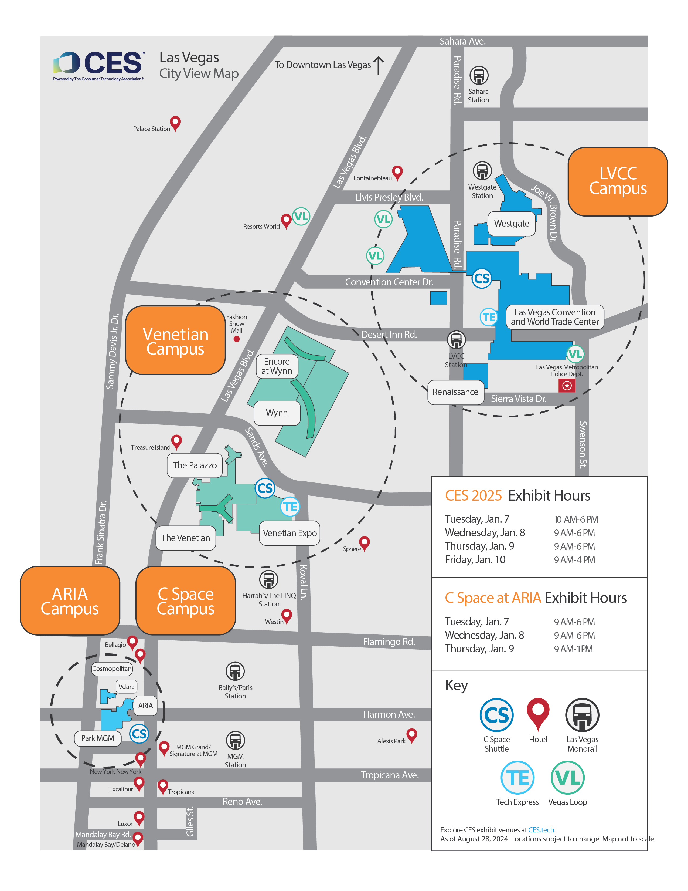
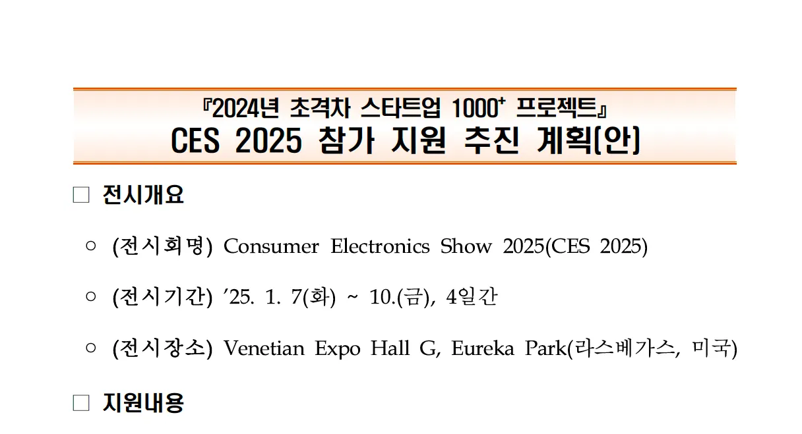
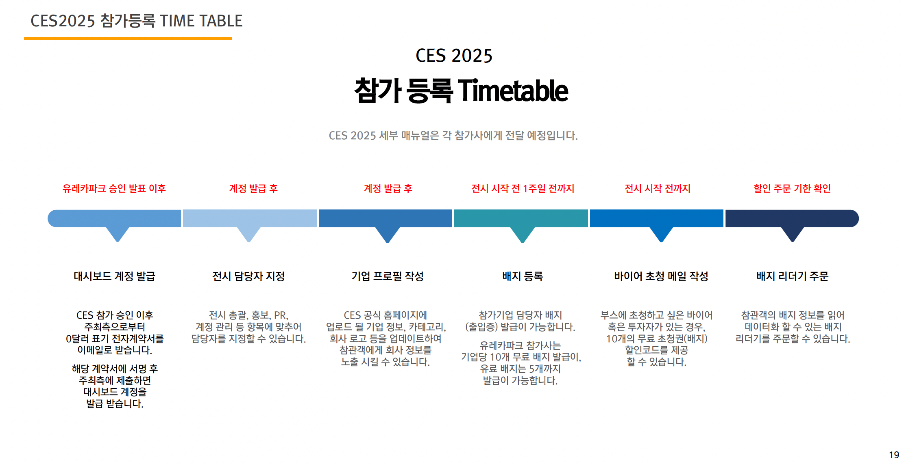
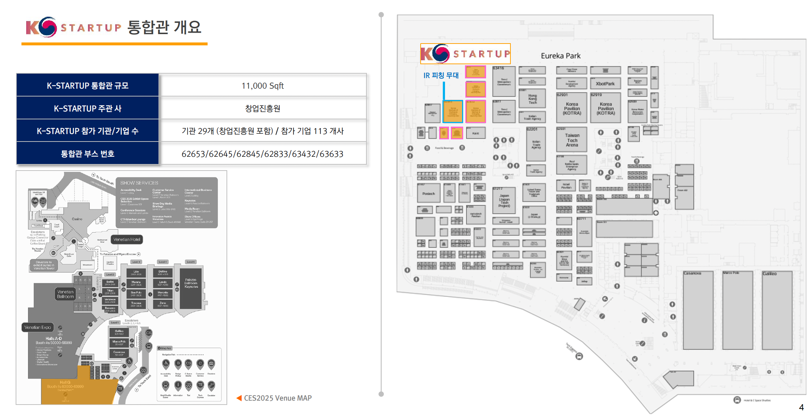
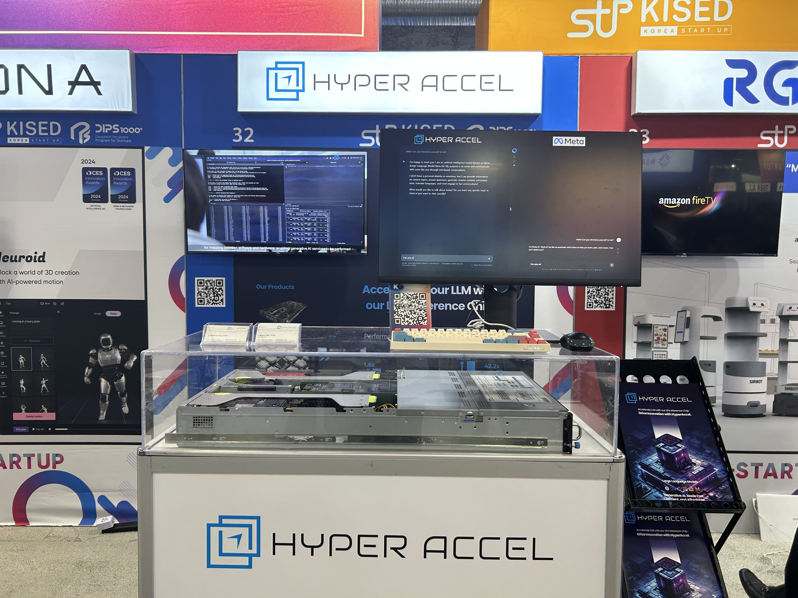
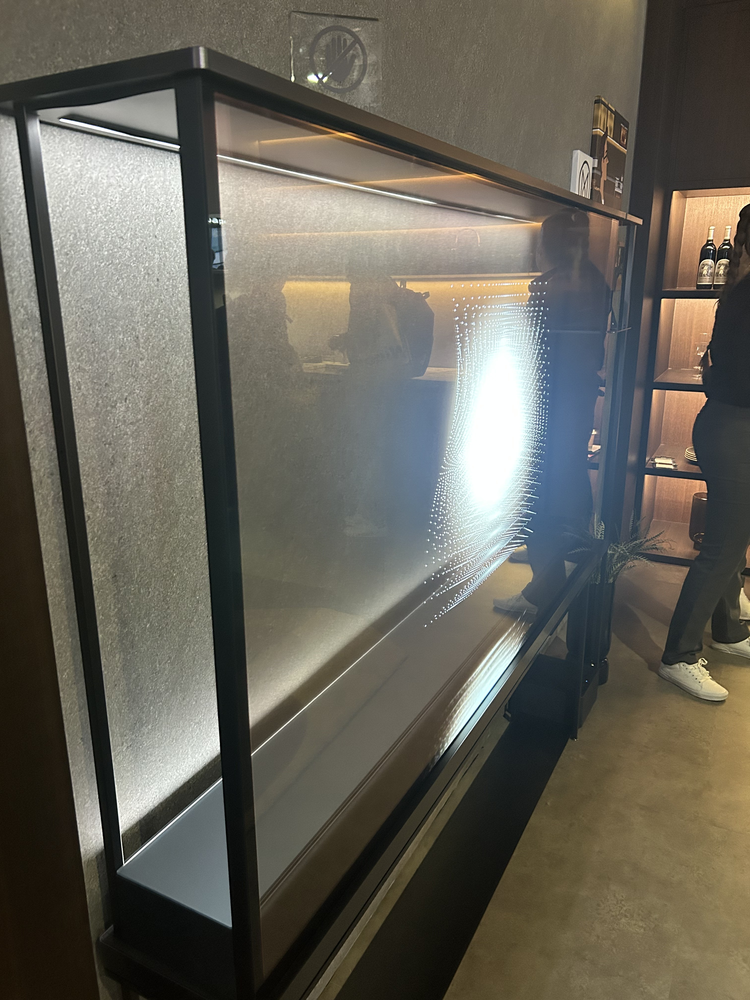
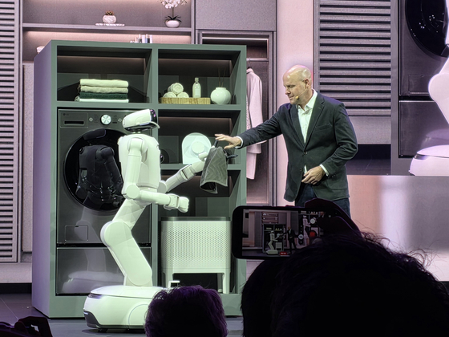
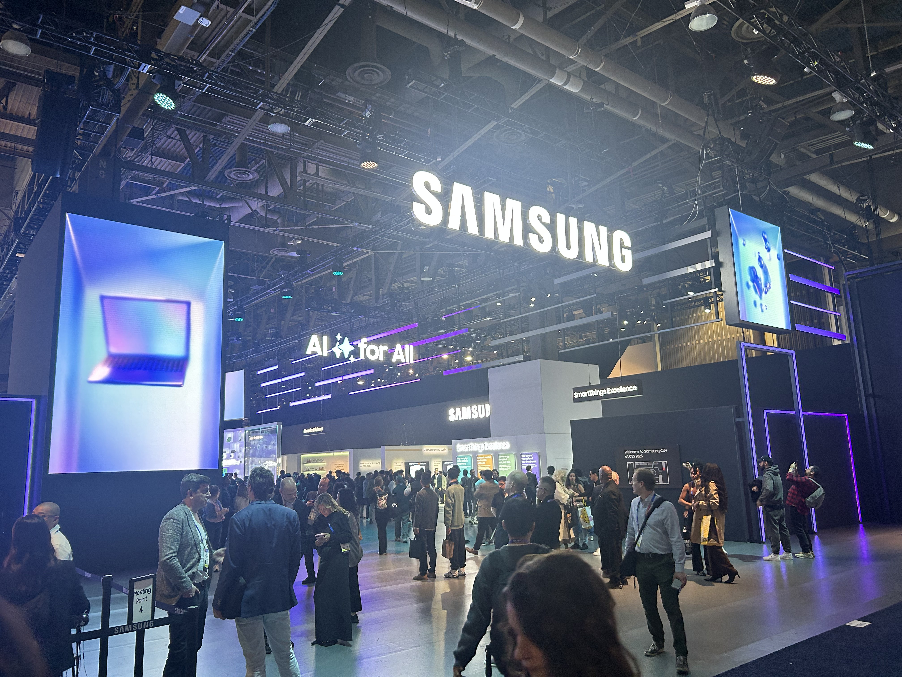
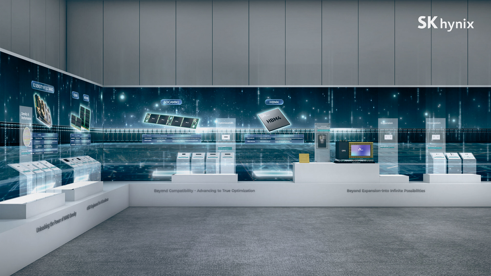

# CES 2026 Review from a 2025 Participant (feat. SAMSUNG, SK, LG)

Hello, I'm Hyunjun Park from the HyperAccel ML Team.

CES, which started in Las Vegas on January 6th, successfully concluded on January 9th. I participated in last year's (2025) CES, not this year's (2026), where I not only viewed exhibitions from global companies but also directly operated HyperAccel's company booth. In this blog post, I'd like to review this year's CES from the perspective of someone who participated last year. You might be wondering why I'm posting this now instead of last year.

The reason is simple: we didn't have a tech blog last year. As someone who participated last year, I became curious about how this year's CES would be after reading articles about CES 2026, and I took time to learn about this year's CES as an excuse to write for our tech blog.

After researching CES 2026 content, I found that there were already many articles about CES, and I spent a lot of time thinking about how to create a differentiated article and deliver meaningful content. After much consideration, I decided to write for readers who fall into the following categories. If you have these questions, I think my article will be helpful:

1. CES statistics and first-hand impressions
2. CES booth preparation and operation experience
3. Booth visits of Korean conglomerates (LG, SAMSUNG, SK)

---

## CES Statistics and First-Hand Impressions

CES is the world's largest technology exhibition held annually in Las Vegas since 1995. From a company's perspective, it's an opportunity to showcase their technology for marketing and branding, while from a visitor's perspective, it's a chance to understand the latest technology trends. South Korea actively participates, ranking third in the number of participating companies after the United States and China, and Korean companies receive the most innovation awards at CES, demonstrating the country's technological capabilities to the world.

|  | 2025 | 2026 |
| --- | --- | --- |
| Slogan | DIVE IN - Connect. Solve. Discover | innovators show up |
| Keywords | AI & Robotics, Mobility, Extended Reality, Smart Home, Digital Healthcare | Physical AI, Spatial Computing, Digital Health, Mobility, Smart Home |
| Participating Countries & Companies | 160+ countries, 4800+ companies | 150+ countries, 4500+ companies |
| Participating Korean Companies | 1000+ companies | 1000+ companies |
| Korean Best of Innovation Awards | 15 out of 34 (44%) | 15 out of 30 (50%) |
| Korean Innovation Awards | 219 out of 458 (47.8%) | 222 out of 367 (60.5%) |

My first impression was that the CES exhibition was much, much larger than I had expected. Even though I had organized the booths I wanted to visit beforehand, I found it extremely difficult to locate the booths I wanted to see. To move between different campuses, I had to take shuttle buses, and the lines for shuttle buses were so long that it was difficult to optimize my route.

Fortunately, I was able to apply on-site for a booth tour organized by the K-STARTUP integrated pavilion, which allowed me to see hot global companies' booths with an optimized route. However, on the other hand, I was disappointed that I couldn't focus on seeing the booths I wanted to see. Therefore, I recommend using booth tours if you don't have specific reasons to visit particular booths, but if you have specific reasons, I recommend planning not only the booths you want to visit but also your route in advance.

[1. CES Exhibition Map]

KOTRA, a company, provides expert analysis on viewing points and routes every year. Although it's not our article, I think it's very well-written and would like to recommend and share it.

CES 2025 Guide: https://dl.kotra.or.kr/pyxis-api/2/digital-files/51efe51a-718d-4f3a-9182-12c424384f7b

CES 2026 Guide: https://dl.kotra.or.kr/pyxis-api/2/digital-files/719ffe16-6ece-4214-969f-b663985315d3

---

## Experience Participating in CES as Part of K-STARTUP Integrated Pavilion

The Ministry of SMEs and Startups is conducting the "Super Gap Startup 1000+" project to foster startups. The ministry operates an exhibition zone called "K-STARTUP Korean Integrated Pavilion" at CES and actively supports small startups to participate comfortably.

[2. Participation Support Plan Announcement]

[3. Part of Guide PPT. CES Timetable]

Thanks to lowering the barrier to entry for CES, this year's K-STARTUP integrated pavilion had 470 companies from 38 organizations participating, and about 1,000 Korean companies participated in CES this year. As a result, Korean companies swept 222 out of 367 innovation awards at CES, achieving a remarkable feat.

[4. Part of Guide PPT. Exhibition Map and Booth Locations]

[5. Part of Guide PPT. List of Provided Supplies]

Thanks to the K-STARTUP branding, visitors of various nationalities and fields visited our booth. Through conversations with numerous clients, investors, and partners, I was able to gain personal insights, and from a company perspective, it was a valuable opportunity to build relationships with partners and brand to clients.

[6. HyperAccel Booth with First-Generation Orion Server]

We also benefited from this project, and thanks to it, we were able to prepare easily and successfully complete it despite it being our first time. In 2025, we exhibited the first-generation Orion server. This accelerator is implemented by porting HyperAccel's proprietary LPU architecture to AMD's U55C FPGA chip.

We plan to release Bertha, the second-generation ASIC chip, in the first half of this year, so I look forward to exhibiting the Bertha server at CES 2027.

---

## Technology Comparison: 2025 vs 2026

There were many global companies that surprised everyone with new technologies, but when I was actually at the venue, I was more excited to see Korean companies standing shoulder to shoulder with global companies on the world stage. (National pride!) Therefore, in this article, I'd like to explore how the exhibitions of Korean conglomerates Samsung, LG, and SK differed between 2025 and 2026.

|  | 2025 | 2026 |
| --- | --- | --- |
| Samsung Innovation Awards | 29 products including Galaxy Buds3 Pro | 27 products including quantum security chip |
| Samsung Highlights | Smart home with all appliances connected | World's first 130-inch Micro RGB TV |
| LG Innovation Awards | 24 products including LG OLED TV | 18 products including webOS platform |
| LG Highlights | Massive structure made of 28 OLED TVs | Home robot Cloi that helps with housework |
| SK Innovation Awards | HBM3E, etc. | HBM4, etc. |
| SK Highlights | Unique Best of Innovation Award in memory category | World's first HBM4 16-layer 48GB reveal |

### LG in CES

I felt that LG strives to make a visual impression on the audience. Last year, LG's exhibition was the most impressive of all the exhibitions I saw,

[7. LG OLED TV Structure]

They displayed 28 transparent/wireless OLED TVs in a circular formation to create a single structure showcasing their technological prowess. This LG showcase not only overwhelmed the surrounding space but also graced the cover of the official CES magazine.

[8. LG OLED TV Structure Interior]

When you entered the booth, you could see the actual products up close, and they looked as if images were appearing on windows rather than TVs, making them aesthetically excellent. For reference, LG signature OLED TV has won the Best of Innovation Award for four consecutive years from 2023 to 2026.

This year, LG launched the home assistant Cloi and once again heated up the media.

[9. LG Cloi Home Robot]

In the actual demo, they showcased various demonstrations such as taking milk out of the refrigerator, folding towels, and putting in laundry. Although it wasn't at a high enough level of completion for actual commercialization, it was meaningful as an early version of a home robot, and given the speed of AI development, I'm looking forward to seeing how much more complete it will be next year.

### SAMSUNG in CES

Samsung presented the story of smart homes with a museum concept at CES.

[10. Samsung Smart Home Booth 1]

[11. Samsung Smart Home Booth 2]

As befitting a global company, they operated an enormous booth and simply displayed how AI connects appliances, increases productivity, and enables efficient energy use.

In 2026, they proceeded with the exhibition under the concept of "AI Companion."

[12. Samsung 130-inch Micro RGB TV]

[13. Samsung Smart Home Booth 2026]

The 130-inch Micro RGB TV displayed in the main hall attracted the attention of passersby, and 2026 also presented Samsung's core smart home values in a museum format.

### SK

SK showcased HBM as their main technology both last year and this year. I'd like to carefully share my personal opinion: SK is relatively at a disadvantage (?) when it comes to demos. This is because it's difficult to visually showcase core technologies due to the nature of memory semiconductors.

[14. SK Booth Entrance]

However, the large-scale booth and overwhelming entrance were sufficient to attract people's attention. It gave the feeling of entering a cave behind a waterfall, and I found out that they implemented graphics that visualized bits like waves to represent that it's a memory company. And the mere existence of HBM is already the hottest topic in the world, so many people visited.

[15. SK HBM Display 1]

[16. SK HBM Display 2]

Since I work for a semiconductor company, I was naturally more interested. I was able to see the actual products and specifications of various memory semiconductors including HBM, which was great. To briefly explain HBM, which has captured Jensen Huang's love, HBM (High Bandwidth Memory) is a product that vertically connects multiple DRAMs to revolutionize data processing speed compared to conventional DRAM. HBM3E means the Extension version of HBM3, and it's such a hot model that more than half of HBM shipments in 2026 are expected to be HBM3E.

In 2026, they first revealed HBM4 16-layer. HBM4 goes beyond simple performance improvements and changed the entire architecture. They doubled the bandwidth and added logic processes to the bottom layer of memory, enabling computation functions near the memory.

[17. SK HBM4 1]

[18. SK HBM4 2]

Globally, there are fewer than 10 companies that generate over 100 trillion won in revenue, and Samsung and SK's expected revenue for 2026 exceeds 100 trillion won. As proven by the world's attention at CES, I look forward to Samsung and SK Hynix's activities in 2026 and beyond. (~~Please make memory cheaper~~)

---

## Conclusion

CES has been one of the most successful exhibitions in the world since its start in 1995, and this year once again proved it with its scale, the efforts of numerous companies, and the tremendous attention from around the world.

Generally, when you go to academic conferences, there are often too many deep contents that are difficult to understand unless you're an expert. However, CES targets the general public, so participating companies presented their technologies more intuitively and visually, making it a visually enjoyable conference.

It was an honor to be able to participate in an exhibition watched by the world, and it was a time to respect the many companies that achieved remarkable technological advances in just one year. It was once again a motivation for us to quickly release better products.

---

## Postscript

### HyperAccel Hiring Notice

HyperAccel is developing next-generation AI chips for LLM inference. We have completed FPGA verification and will soon release ASIC chips and server solutions. We are creating solutions that developers can easily use through integration with the PyTorch ecosystem.

**Career Site**: https://hyperaccel.career.greetinghr.com/ko/guide

If you're interested, please feel free to contact us anytime!

