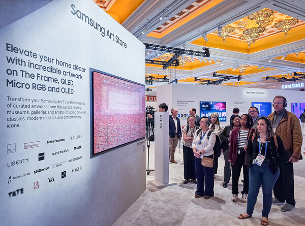
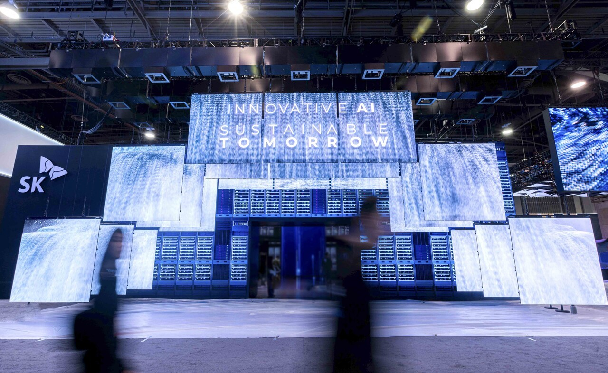
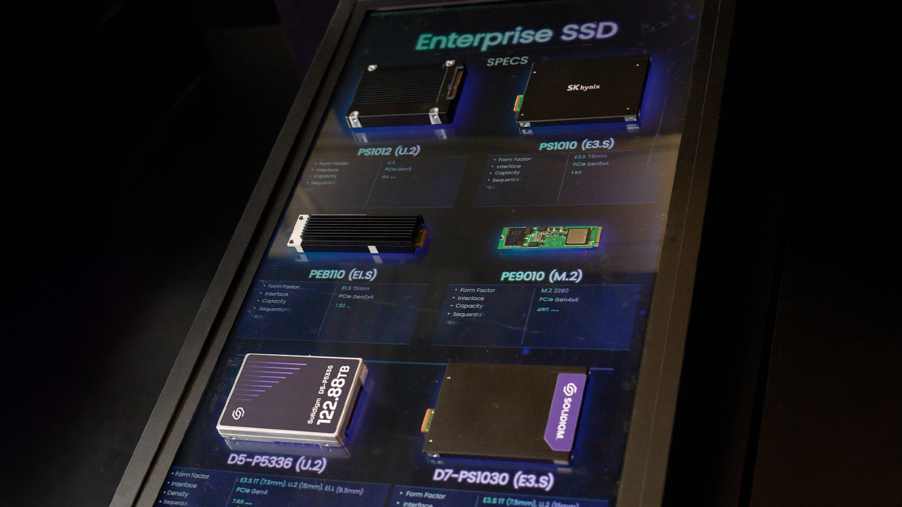
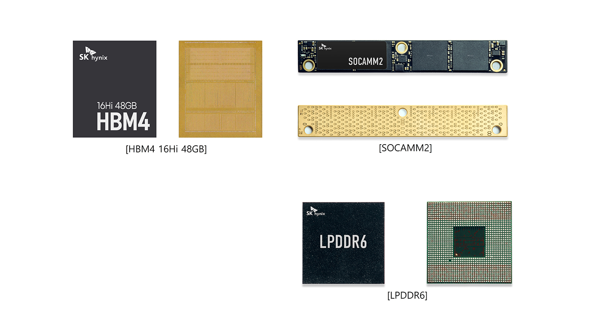

# 2025년에 바라보는 CES 2026 핵심 정리 (feat. SAMSUNG, SK, LG)

안녕하세요? HyperAccel ML팀 소속 박현준 입니다.

1월 6일에 라스베가스에서 시작한 CES가 1월 9일 성황리에 종료되었습니다. 저는 올해(2026년)이 아닌 작년(2025년) CES에 참여했고, 글로벌 기업들의 전시도 봤을 뿐만 아니라 직접 하이퍼엑셀 회사 부스도 운영했었습니다. 이번 블로그에서는 작년에 참여했던 입장에서 올해의 CES를 리뷰해보고자 합니다. 왜 작년에 안올리고 이제서야 올리는지 궁금하신 분도 계실겁니다. 

이유는 간단합니다. 작년에는 테크 블로그가 없었기 때문입니다. 작년에 참여한 입장으로써 CES 2026에 대한 기사를 보니 올해는 어땠을지 궁금해졌고, 테크 블로그에 글을 쓰겠다는 명분으로 올해 CES에 대해 알아보는 시간을 가졌습니다. 

CES 2026 내용을 찾아보니 CES 관련 글은 이미 많았고, 어떻게하면 차별화된 글을 작성할 수 있을지, 의미있는 내용을 전달할 수 있을지 고민을 많이 하였습니다. 고민 결과 아래 목록에 해당되는 분들을 예상 독자로 삼아서 글을 쓰자고 결정했습니다. 이러한 궁금증을 가진 분들이라면 제 글이 도움이 될 것 같습니다:

1. CES 관련 통계 및 직관 후기
2. CES 부스 준비 및 운영 후기
3. 한국의 대기업(LG, SAMSUNG, SK) 부스 관람 후기

---

## CES 관련 통계 및 직관 후기

CES는 1995년을 시작으로 LA에서 매년 열리는 세계 최대 규모의 기술 전시회입니다. 기업 입장에서는 자사의 기술을 뽐내며 마케팅 및 브랜딩을 할 수 있으며, 관람객 입장에서는 최신 기술 동향을 파악할 수 있습니다. 우리나라는 미국과 중국에 이어 3번째로 많은 기업이 참여할 정도로 적극적으로 참여하고 있으며, CES에서 수상하는 혁신상은 가장 많이 받아 국내 기술력을 전 세계에 뽐내고 있습니다.

|  | 2025 | 2026 |
| --- | --- | --- |
| 슬로건 | DIVE IN - Connect. Solve. Discover | innovators show up |
| 키워드 | AI&로보틱스, 모빌리티, 확장현실, 스마트홈, 디지털 헬스케어 | 피지컬 AI, 공간 컴퓨팅, 디지털 헬스, 모빌리티, 스마트홈 |
| 참여 국가 및 기업 | 160여 개국 4800+ 기업 | 150여 개국 4500+ 기업 |
| 참여 국내 기업 | 1000+ 기업 | 1000+ 기업 |
| 국내 기업 최고혁신상 | 34개 중 15개 (44%) | 30개 중 15개 (50%) |
| 국내 기업 혁신상 | 458개 혁신상 중 219개 수상 (47.8%) | 367개 혁신상 중 222개 수상 (60.5%) |

일단 처음 느꼈던 감정은 CES 전시회는 제 예상보다 훨씬, 훨씬 더 컸습니다. 사전에 가보고 싶은 부스들을 정리해두고 전시회에 참여했음에도 불구하고 제가 원하는 부스들을 찾기가 굉장히 어려웠고, 다른 캠퍼스로 이동하기 위해서는 셔틀 버스를 타야 했는데 셔틀 버스도 줄을 한참 서야 했기에 동선을 최적화 하기가 어려웠습니다.

저는 다행히도 K-STARTUP 통합관에서 운영해준 부스 투어를 현장 신청하여 핫한 글로벌 기업들의 부스를 최적화된 동선으로 볼 수 있었지만, 한편으로는 제가 보고싶은 부스를 집중해서 보지 못했다는 아쉬움도 남았습니다. 따라서 저는 만약 특별한 리즈가 없으시다면 부스 투어를 찾아서 이용하는 방식을 추천드리지만, 특별한 리즈가 있으시다면 가보고 싶은 부스 뿐만 아니라 동선까지 짜두고 오시는 편을 추천드립니다.

[1. CES 전시회 안내도]

관람 포인트나 동선 관련 전문가의 분석은 KOTRA라는 기업이 매년 작성해주고 있는데요, 저희가 쓴 글은 아니지만 정말 잘 쓰여진 글이라고 생각되어 추천하고 공유드립니다.

CES 2025 가이드: https://dl.kotra.or.kr/pyxis-api/2/digital-files/51efe51a-718d-4f3a-9182-12c424384f7b

CES 2026 가이드: https://dl.kotra.or.kr/pyxis-api/2/digital-files/719ffe16-6ece-4214-969f-b663985315d3

---

## K-STARTUP 통합관 소속으로 CES에 참가한 후기

중소벤처기업부에서는 스타트업 육성을 위한 "초격차 스타트업 1000+" 프로젝트를 진행하고 있습니다. 중기부는 CES에서 "K-STARTUP 한국통합관"이라는 이름의 전시존을 운영하고 있으며, 규모가 작은 스타트업도 편하게 참여할 수 있도록 적극적으로 지원해주고 있습니다. 

[2. 참가 지원 계획 공문]

[3. 안내 PPT 중 일부. CES 타임 테이블]

CES 진입장벽을 낮춰주신 덕분에 올해 K-STARTUP 통합관에는 무려 38개 기관에서 470개 사가 참여하였고, 한국에서는 CES에 올해 1000여 개의 회사가 참가하였습니다. 덕분에 CES에서 수상한 367개의 혁신상 중 무려 222개의 상을 한국 기업이 휩쓸었다고 하니 혁신상도 휩쓰는 쾌거도 이루었습니다.

[4. 안내 PPT 중 일부. 전시회 지도 및 부스 위치]

[5. 안내 PPT 중 일부. 제공되는 물품 리스트]

K-STARTUP 문구 덕분인지 다양한 국적, 다양한 분야의 분들께서 부스를 방문해주셨는데요, 고객사/투자자/협업사 등 수많은 분들과 이야기를 나눠보며 개인적으로는 insight를 키울 수 있었을 뿐만 아니라 회사 차원에서는 파트너들과 관계를 쌓을 수 있고 고객사에게 브랜딩을 할 수 있는 소중한 자리였습니다.

[6. 1세대 서버인 Orion가 전시된 하이퍼엑셀 부스]

저희도 이 프로젝트의 수혜를 받았고, 덕분에 처음인데도 불구하고 쉽게 준비하고 성공적으로 마칠 수 있었습니다. 2025년에는 1세대 서버인 Orion 서버를 전시했습니다. 해당 가속기는 하이퍼엑셀의 고유자산인 LPU architecture를 AMD의 U55C FPGA칩에 이식해서 동작하는 방식으로 구현되어 있습니다.

올해 상반기 중 ASIC 2세대 칩인 Bertha 출시 예정이니 CES 2027에는 bertha 서버를 전시할 수 있기를 기대해봅니다.

---

## 2025년과 비교해본 2026년의 기술

처음보는 신기술로 모두를 놀라게 한 글로벌 기업들도 많이 있었습니다만, 아무래도 실제 현장에 갔을 때는 세계 무대에서 글로벌 기업들과 당당히 어깨를 나란히 하고있는 한국 기업을 볼 때 더 가슴이 뛰었습니다.(국뽕맞음) 따라서 이번 글에서는 한국의 대기업인 삼성, LG, SK의 전시가 2025년과 2026년에 어떤 차이가 있었는지 알아보고자 합니다.

|  | 2025 | 2026 |
| --- | --- | --- |
| 삼성 혁신상 | 갤럭시 버즈3 프로 등 29개 제품 | 양자보안 칩 등 27개 제품 |
| 삼성 관전 포인트 | 모든 가전이 연결된 스마트홈 | 세계 최초 130형 마이크로 RGB TV |
| LG 혁신상 | LG OLED TV 등 24개 제품 | webOS 플랫폼 등 18개 제품 |
| LG 관전 포인트 | 28개의 OLED TV로 만들어진 거대한 구조물 | 집안일 도와주는 홈 로봇, 클로이드 |
| SK 혁신상 | HBM3E 등 | HBM4 등 |
| SK 관전 포인트 | 메모리 분야 유일무이 최고혁신상 | 세계 최초 HBM4 16단 48GB 공개 |

### LG in CES

LG는 관객에게 시각적인 인상을 주기위해 노력한다고 느꼈습니다. 작년에는 제가 본 전시 통틀어 LG의 전시가 가장 인상깊었는데요,

[7. LG OLED TV 구조물]

투명/무선 OLED 28대를 둥글게 전시하여 하나의 구조물을 형성하여 기술력을 뽐냈습니다. 이러한 LG의 차력쇼는 주변 공간을 압도하는 것을 넘어 CES 공식 메거진 1면까지 장식하였습니다.

[8. LG OLED TV 구조물 내부]

부스 안으로 들어가면 실물을 가까이서 볼 수 있었으며, 마치 TV가 아니라 창문에 상이 맺히는 것처럼 보여 미적으로도 뛰어났습니다. 참고로 LG signature OLED TV는 2023년부터 2026년까지 총 4년 연속 최고혁신상을 수상하고 있습니다.

올해 LG는 가사 도우미 클로이드를 출시하며 또 한번 메스컴을 뜨겁게 달궜습니다.

[9. LG 클로이드 홈 로봇]

실제 데모에서 냉장고에서 우유를 꺼내고, 수건을 접고, 세탁물을 넣는 등 다양한 데모를 실제로 선보였습니다. 아직 실제로 상용화할 만큼 높은 완성도는 아니었지만 가정형 로봇의 초기 버전이라는 점에서 의미있었고, AI의 발전 속도로 봤을 때 내년에는 얼마나 더 완성도 있는 모습을 보여줄지 기대가 되는 데모였습니다.

### SAMSUNG in CES

삼성은 CES에서 박물관 컨셉으로 스마트홈에 대한 이야기를 풀어냈습니다.

[10. 삼성 스마트홈 부스 1]

[11. 삼성 스마트홈 부스 2]

글로벌 기업답게 엄청 큰 부스를 운영하였고, AI가 어떻게 가전을 서로 연결하고 생산성을 높여주고 에너지를 효율적으로 사용할 수 있는지를 담백하게 전시하였습니다.

2026년에는 AI 동반자라는 컨셉으로 전시를 진행하였습니다. 

[12. 삼성 130형 마이크로 RGB TV]

[13. 삼성 스마트홈 부스 2026]

메인홀에 전시된 130형 마이크로 RGB TV는 지나가던 사람들들의 이목을 이끌었으며, 2026년도 역시 박물관 형식으로 삼성이 추구하는 스마트홈 핵심 가치를 담백하게 풀어냈습니다.

### SK

SK는 작년에도 올해도 HBM을 주력 기술로 선보였습니다. 개인적인 생각을 조심히 말씀드리면 SK는 상대적으로 데모에 불리(?)합니다. 왜냐하면 메모리 반도체 특성상 핵심 기술을 시각적으로 보여주기가 쉽지 않기 때문입니다. 

[14. SK 부스 입구]

하지만 대규모 부스와 주변을 압도하는 입구는 사람들의 이목을 끌기에 충분하였습니다. 이는 폭포 속 동굴에 들어가는 듯한 느낌을 주었는데, 찾아보니 bit를 파도처럼 형상화한 그래픽을 구현하여 메모리 회사임을 나타내었다고 합니다. 그리고 HBM 존재만으로도 이미 세계에서 가장 핫한 주제이기에 정말 많은 사람이 방문하였습니다.

[15. SK HBM 전시 1]

[16. SK HBM 전시 2]

저는 아무래도 반도체 회사에 종사하고 있으니만큼 더 많은 관심이 갔는데요, HBM을 비롯한 다양한 메모리 반도체들의 실물 및 스펙을 볼 수 있어서 좋았습니다. 젠슨 황의 사랑을 독차지하고 있는 HBM에 대한 설명을 간단히 드리자면, HBM(High Bandwidth Memory)은 여러 개의 DRAM을 수직으로 연결해 기존 D램보다 데이터 처리 속도를 혁신적으로 끌어올린 제품입니다. HBM3E는 HBM3의 Extension 버전이라는 뜻으로 2026년 기준 HBM 출하량의 절반 이상이 HBM3E로 예상될만큼 핫한 모델입니다.

2026년에는 HBM4 16단을 최초로 공개하였습니다. HBM4는 단순 성능 개선을 넘어 전체적인 아키텍쳐를 변경하였습니다. 대역폭을 2배로 넓혔고, 메모리 맨 아랫층에 로직 공정을 넣어 메모리 근처에서 연산 기능까지 수행할 수 있다고 합니다. 

[17. SK HBM4 1]

[18. SK HBM4 2]

전 세계적으로도 100조원 이상의 매출을 내는 기업이 10개도 안되는데 삼성과 SK의 2026년 기대 수익이 100조를 웃돈다고 합니다. CES에서도 세계의 관심을 증명받은 만큼 2026년 그리고 앞으로도 삼성과 하이닉스의 활약을 기대해봅니다. (~~메모리 싸게 주세요 흑흑~~)

---

## 결론

CES는 1995년 시작 이래 전 세계에서 가장 흥행하고 있는 전시회 중 하나로, 올해도 역시 그 규모와 수많은 회사들의 노력, 그리고 전 세계의 엄청난 관심으로 다시 한번 증명했습니다. 

일반적으로 학회를 가면 너무 deep한 내용이 많아 전문가가 아니면 이해하기 어려운 경우가 많은데, CES는 일반 대중이 타겟인 만큼 참가사들이 자사 기술을 더 직관적으로 시각적으로 풀어내었기에 눈이 즐거웠던 학회였습니다.

전 세계가 바라보는 전시회에 참여해볼 수 있었기에 영광이었고, 1년 사이에 눈부신 기술 발전을 이루어낸 많은 회사들에 대한 리스펙이 드는 시간이었습니다. 우리도 더 좋은 제품을 발빠르게 출시해야겠다는 동기부여가 다시한번 되었습니다.

---

## 추신

### HyperAccel 채용 안내

HyperAccel은 LLM 추론을 위한 차세대 AI 칩을 개발하고 있습니다. FPGA 검증을 완료했으며, 곧 ASIC 칩과 서버 솔루션을 출시할 예정입니다. PyTorch 생태계와의 통합을 통해 개발자들이 쉽게 사용할 수 있는 솔루션을 만들어가고 있습니다.

**채용 사이트**: https://hyperaccel.career.greetinghr.com/ko/guide

혹시 관심이 있으시다면 언제든지 연락 주세요!

