# 2025년에 바라보는 CES 2026 핵심 정리 (feat. SAMSUNG, SK, LG)

안녕하세요? HyperAccel ML팀 소속 박현준입니다.

1월 6일에 라스베가스에서 시작한 CES가 1월 9일 성황리에 종료되었습니다. 우선 저는 작년(2025년) CES에 참여하여 하이퍼엑셀 부스를 운영했었고, 해당 경험을 바탕으로 올해(2026년) CES를 리뷰해보려고 합니다. 혹자는 왜 작년에 안 올리고 이제서야 올리는지 의문을 가질 수 있는데요,

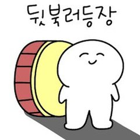

이유는 간단합니다. 작년에는 테크 블로그가 없었기 때문입니다. 작년에 참여한 입장으로서 CES 2026에 대한 기사를 보니 올해는 어땠을지 궁금해졌고, 테크 블로그에 글을 쓰겠다는 명분 덕분에 올해 CES에 대해 알아보는 시간을 가질 수 있었습니다. 아래 목록에 해당되는 분들께는 이번 포스트가 도움이 될 것 같습니다:

1. CES 관련 통계 및 핵심 정리가 궁금하신 분
2. CES 부스 준비 및 운영 후기가 궁금하신 분
3. 한국의 대기업(LG, SAMSUNG, SK)의 전시품 및 컨셉이 궁금하신 분

---

## CES 관련 통계 및 핵심 정리

CES는 1967년을 시작으로 매년 열리는 세계 최대 규모의 소비자 가전 전시회입니다. 기업 입장에서는 자사의 기술을 뽐내며 마케팅 및 브랜딩을 할 수 있으며, 관람객 입장에서는 최신 기술 동향을 파악할 수 있습니다. 우리나라는 미국과 중국에 이어 3번째로 많은 기업이 참여하고 있으며, 혁신상 수상 개수는 세계 1위를 기록하며 국내 기술력을 전 세계에 뽐내고 있습니다.

|  | 2025 | 2026 |
| --- | --- | --- |
| 슬로건 | DIVE IN - Connect. Solve. Discover | innovators show up |
| 키워드 | AI&로보틱스, 모빌리티, 확장현실, 스마트홈, 디지털 헬스케어 | 피지컬 AI, 공간 컴퓨팅, 디지털 헬스, 모빌리티, 스마트홈 |
| 참여 국가 및 기업 | 160여 개국 4800+ 기업 | 150여 개국 4500+ 기업 |
| 참여 국내 기업 | 1000+ 기업 | 1000+ 기업 |
| 국내 기업 최고혁신상 | 34개 중 15개 (44%) | 30개 중 15개 (50%) |
| 국내 기업 혁신상 | 458개 혁신상 중 219개 수상 (47.8%) | 367개 혁신상 중 222개 수상 (60.5%) |

일단 CES의 첫 인상을 말씀드리자면 제 예상보다 훨씬 더 컸습니다. 흡사 대학교 캠퍼스를 돌아보는 듯한 느낌을 받았습니다. 사전에 가보고 싶은 부스들을 정리해두고 참여했음에도 불구하고 원하는 부스들을 찾기가 어려웠고, 다른 캠퍼스로 이동하려면 셔틀 버스를 타야 했는데, 대기 줄이 길어서 동선을 짜기도 쉽지 않았습니다.

저는 이러한 고민을 하던 찰나에 K-STARTUP 통합관에서 운영하는 부스 투어를 현장 신청하여 주목받는 글로벌 기업들의 부스를 최적화된 동선으로 볼 수 있었습니다. 편하게 글로벌 기업의 부스를 전체적으로 둘러볼 수 있어서 좋았지만, 한편으로는 제가 보고 싶은 부스를 집중해서 보지 못했다는 아쉬움도 남았습니다. 저는 만약 특별한 니즈가 없으시다면 부스 투어를 찾아서 이용하는 방식을 추천드리고, 특별한 니즈가 있으시다면 동선까지 꼼꼼하게 짜오시기를 추천드립니다.

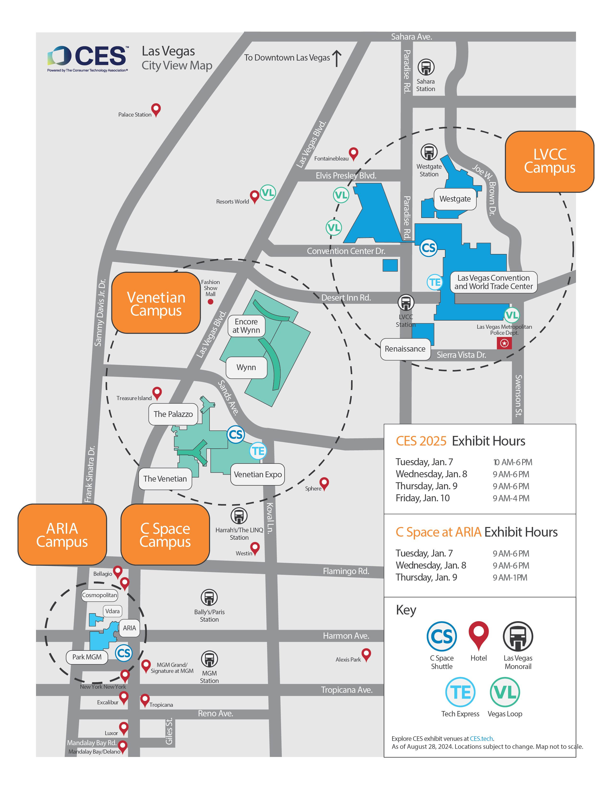

관람 포인트나 동선 관련 분석은 KOTRA라는 기업에서 매년 작성해주고 있는데요, 제가 쓴 글은 아니지만 잘 쓰여진 글이라고 생각되어 추천하고 공유드립니다.

CES 2025 가이드: https://dl.kotra.or.kr/pyxis-api/2/digital-files/51efe51a-718d-4f3a-9182-12c424384f7b

CES 2026 가이드: https://dl.kotra.or.kr/pyxis-api/2/digital-files/719ffe16-6ece-4214-969f-b663985315d3

---

## CES 2025 참가 후기

중소벤처기업부에서는 스타트업 육성을 위한 "초격차 스타트업 1000+" 프로젝트를 진행하고 있고, 프로젝트 중 일부로 한국 스타트업들을 모아 매년 CES 전시관을 운영하고 있습니다. 규모가 작은 스타트업도 편하게 참여할 수 있도록 잘 짜여 있었습니다. 

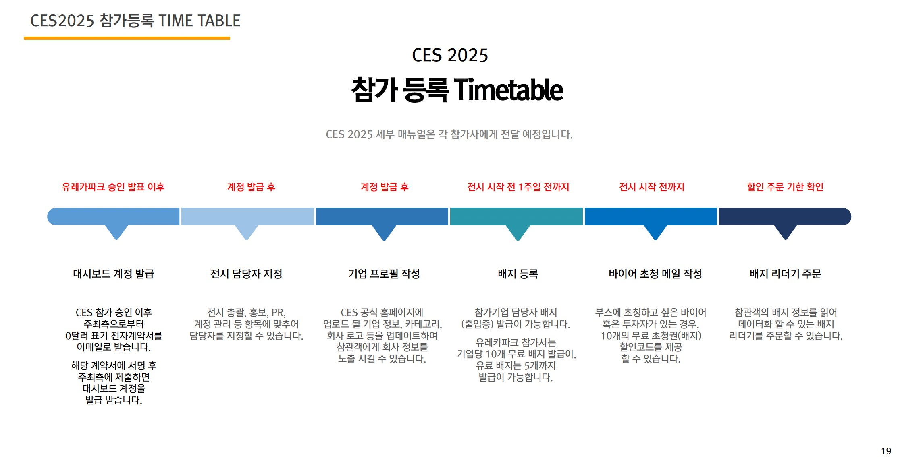

이렇게 CES 진입장벽을 낮춰주신 덕분에 작년에도 올해도 K-STARTUP 통합관에 많은 기업이 참여하고 있고, 올해 기준으로는 무려 38개 기관에서 470개 사가 참여하였습니다. 한국 전체로 봤을 때는 1000여 개의 회사가 참가하였습니다. 이러한 지원이 한국이 CES 혁신상을 가장 많이 받도록 하는 강력한 원동력 중 하나가 아닐까 생각이 들었습니다.

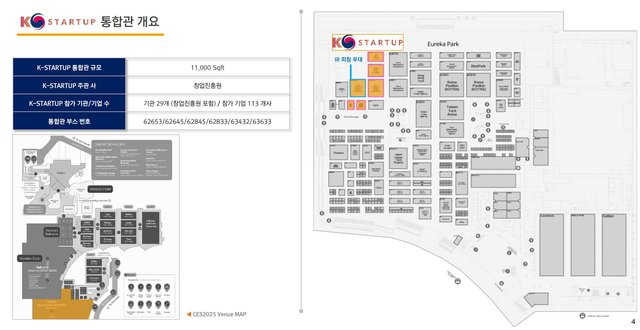

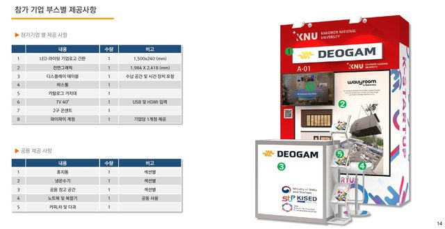

참가사 입장에서도 K-STARTUP 문구 덕분에 다양한 국적, 다양한 분야의 분들께서 부스를 방문해주셨는데요, 고객사/투자자/협업사 등 수많은 분들과 이야기를 나눌 수 있었습니다. 회사 차원에서는 파트너들과 관계를 쌓을 수 있을 뿐만 아니라 고객사에게 브랜딩을 할 수 있는 소중한 자리였고, 개인 입장에서도 인사이트를 키울 수 있는 좋은 기회였습니다.

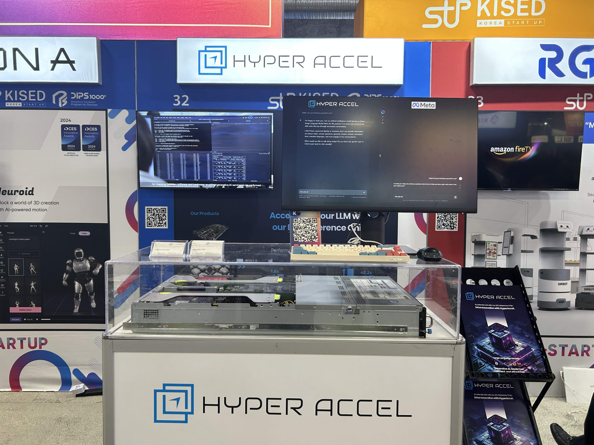

잘 도와주신 덕분에 저희도 처음임에도 불구하고 "참여"보다 "전시"에 집중할 수 있었고, 성공적으로 CES 부스 운영을 마칠 수 있었습니다. 작년에 전시했던 저희 부스 모습입니다. 사진에 보이는 서버는 FPGA 기반 1세대 서버로, LLM 추론을 위한 차세대 AI 칩 개발의 첫 단계였습니다.

---

## 한국 대기업의 CES 전시 동향

처음 보는 신기술로 모두를 놀라게 한 글로벌 기업들도 많이 있었습니다만, 아무래도 실제 현장에 갔을 때는 세계 무대에서 글로벌 기업들과 당당히 어깨를 나란히 하고 있는 한국 기업을 볼 때 더 가슴이 뛰었습니다.(국뽕맞음) 따라서 이번 목차에서는 한국의 대기업인 삼성, LG, SK가 CES 전시를 어떻게 운영하는지 2025년과 2026년을 비교해 보며 알아보고자 합니다.

| **회사** | **구분** | **2025년** | **2026년** |
| --- | --- | --- | --- |
| **LG** | **혁신상** | LG OLED TV 등 24개 제품 | webOS 플랫폼 등 18개 제품 |
| | **관전 포인트** | 28개의 OLED TV로 구성된 구조물 | 집안일 도와주는 홈 로봇, 클로이드 |
| **삼성** | **혁신상** | 갤럭시 버즈3 프로 등 29개 제품 | 양자보안 칩 등 27개 제품 |
| | **관전 포인트** | 모든 가전이 연결된 스마트홈 | 세계 최초 130형 마이크로 RGB TV |
| **SK** | **혁신상** | HBM3E 등 | HBM4 등 |
| | **관전 포인트** | 메모리 분야 유일무이 최고혁신상 | 세계 최초 HBM4 16단 48GB 공개 |

### LG in CES

LG는 관객에게 시각적인 인상을 주기 위해 노력한다고 느꼈습니다. 작년에 제가 본 전시 통틀어서도 LG의 전시가 가장 인상 깊었는데요,

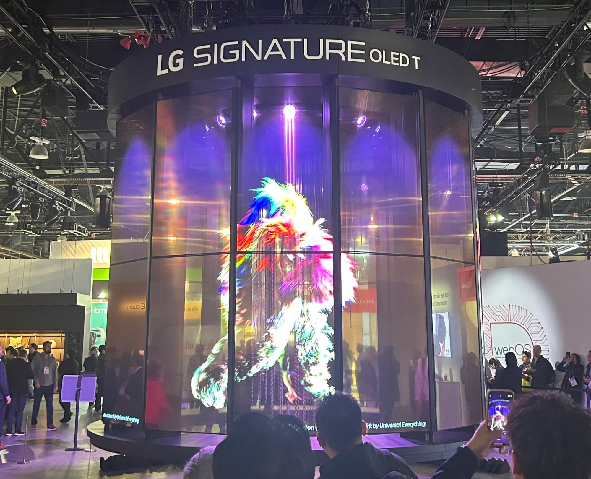

작년에 LG는 투명/무선 OLED 28대를 둥글게 전시하여 하나의 구조물을 형성하여 기술력을 뽐냈습니다. 이러한 LG의 차력쇼는 주변 공간을 압도하는 것을 넘어 CES 공식 매거진 1면까지 장식하였습니다.

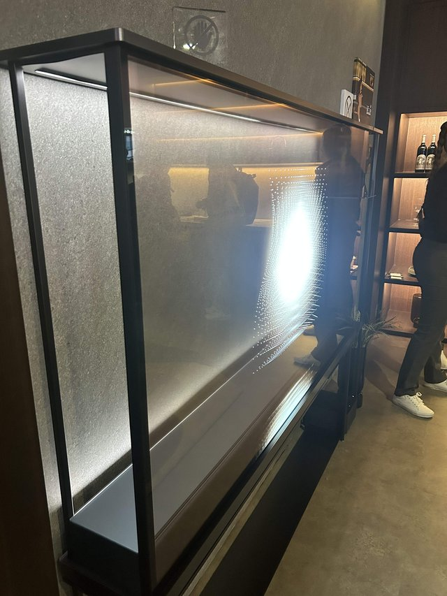

부스 안으로 들어가면 실물을 가까이서 볼 수 있었으며, 마치 TV가 아니라 창문에 상이 맺히는 것처럼 보여 미적으로도 뛰어났습니다. 참고로 LG signature OLED TV는 2023년부터 2026년까지 총 4년 연속 최고혁신상을 수상하고 있습니다.

올해 LG는 가사 도우미 클로이드를 출시하며 또 한번 언론을 뜨겁게 달궜습니다.

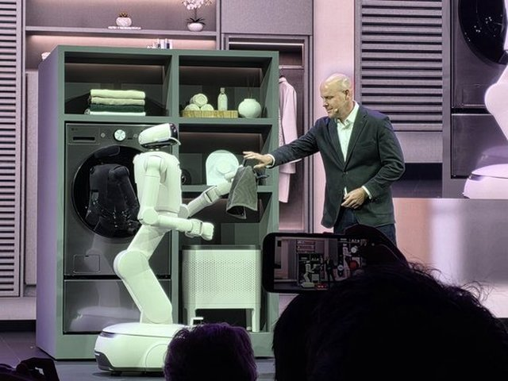

실제 데모에서 냉장고에서 우유를 꺼내고, 수건을 접고, 세탁물을 넣는 등 다양한 데모를 선보였습니다. 개인적으로 아직 실제로 상용화할 만큼 높은 완성도는 아니었지만 가정 로봇의 초기 버전이라는 점에서 큰 의미가 있고, AI의 발전 속도를 봤을 때 내년에는 얼마나 더 완성도 있는 모습을 보여줄지 정말 기대가 되는 데모였습니다.

### SAMSUNG in CES

삼성은 작년과 올해 모두 CES에서 박물관 컨셉으로 스마트홈에 대한 이야기를 풀어냈습니다.

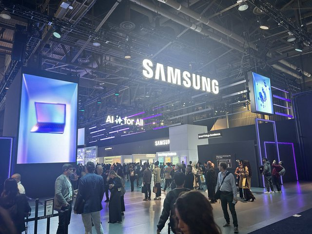

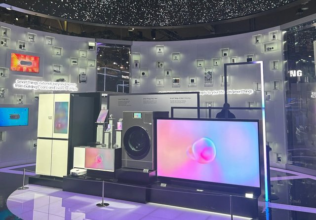

작년에는 AI가 어떻게 가전을 서로 연결하고 생산성을 높여주고 에너지를 효율적으로 사용할 수 있는지를 담백하게 전시하였습니다. 특히 SmartThings 플랫폼을 중심으로 냉장고, 세탁기, 에어컨 등 모든 가전이 하나로 연결되는 스마트홈 생태계를 강조하였습니다.

올해는 AI가 일상에서 어떻게 즐거움, 편리함, 돌봄을 제공할 수 있는지를 전시하였습니다.

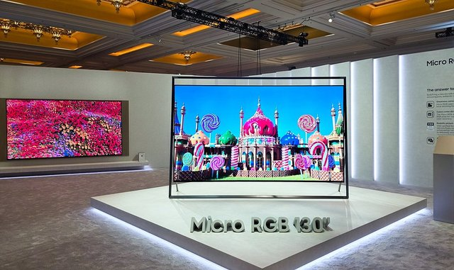

메인홀에 전시된 세계 최초 130형 마이크로 RGB TV는 관객의 이목을 잡기에 충분하였으며, 이 밖에도 구글 제미나이가 탑재된 비스포크 AI 냉장고, 웨어러블 기반 건강 관리 솔루션 등 AI가 일상에 스며드는 비전을 선보였습니다. 디스플레이부터 가전, 헬스케어까지 전 영역에서 AI를 접목하는 삼성의 행보가 인상적이었습니다.

### SK in CES

SK는 작년에도 올해도 HBM을 주력 기술로 선보였습니다. 개인적인 생각을 조심히 말씀드리면 SK의 HBM은 전시회 환경에서 데모를 통해 보여주기 어려운 기술이라고 생각합니다. 왜냐하면 메모리 반도체 특성상 핵심 기술을 시각적으로 보여주기가 쉽지 않기 때문입니다. 

하지만 작년 SK 전시관의 입구는 폭포 속 동굴에 들어가는 듯한 느낌을 주어 사람들의 발걸음을 멈추고 이목을 끌기에 충분하였습니다. 찾아보니 bit를 파도처럼 형상화한 그래픽을 구현하여 메모리 회사임을 나타내었다고 합니다. 그리고 HBM 존재만으로도 이미 세계에서 가장 핫한 주제이기에 정말 많은 사람이 방문하였습니다.

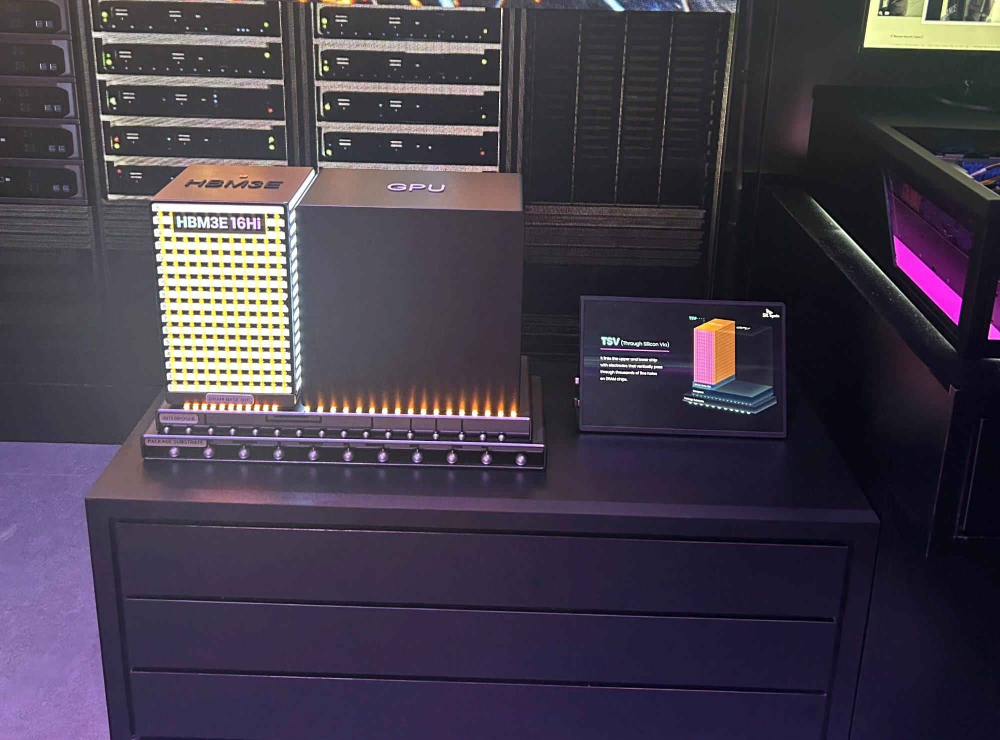

저는 아무래도 반도체 회사에 종사하고 있는 만큼 더 많은 관심이 갔는데요, HBM을 비롯한 다양한 메모리 반도체들의 실물 및 스펙을 볼 수 있어서 좋았습니다. 젠슨 황의 사랑을 독차지하고 있는 HBM에 대한 설명을 간단히 드리자면, HBM(High Bandwidth Memory)은 여러 개의 DRAM을 수직으로 연결하여 대역폭을 키운 제품으로, 기존 DRAM보다 데이터 전송 속도가 혁신적으로 빠르다는 점이 특징입니다. 그중 상단에 전시된 HBM3E는 HBM3의 Extension 버전이라는 뜻으로 2026년 기준 HBM 출하량의 절반 이상이 HBM3E로 예상될 만큼 핫한 모델입니다.

올해는 HBM4 16단을 최초로 공개하였습니다. HBM4는 단순 성능 개선을 넘어 전체적인 아키텍처를 변경하였습니다. 대역폭을 2배로 넓혔고, 메모리 맨 아랫층에 로직 공정을 넣어 메모리 근처에서 연산 기능까지 수행할 수 있다고 합니다. 

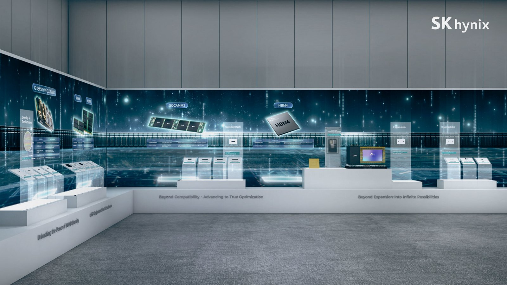

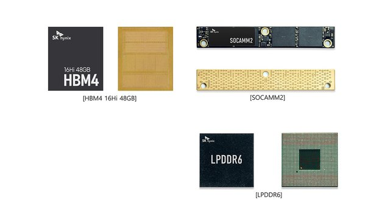

AI 시대의 핵심 부품인 HBM을 선도하고 있는 SK하이닉스가 CES에서도 세계의 주목을 받는 모습이 인상적이었습니다. 앞으로도 메모리 반도체 분야에서 SK하이닉스의 활약을 기대해봅니다. (~~메모리 싸게 주세요 흑흑~~)

---

## 결론

CES는 올해도 역시 규모와 많은 회사들의 노력, 그리고 전 세계의 엄청난 관심으로 World Best Show임을 다시 한번 증명했습니다. 

CES 2025에서 NVIDIA의 CEO, 젠슨황이 말했습니다. AI의 다음 개척 분야는 Physical AI라고. 1년이 지나 CES 2026을 바라보는 지금, AI가 단순히 소프트웨어에 머무르지 않고 물리적인 세계로 확장되고 있다는 점이 가장 눈에 띄었습니다. 대표적으로 LG의 클로이드가 실제 가정에서 활용되는 모습을 보여주었고, 이번 포스트에서는 다루지 않았지만 여러 부스에서 춤을 추거나 일을 하는 로봇을 어렵지 않게 찾아볼 수 있었습니다. 

그리고 CES 2026에서 AMD의 CEO, 리사 수가 말했습니다. 전 인류를 위해 수십억 개의 AI 에이전트가 24시간 백그라운드에서 돌아가는 세상이 올 것이라고. 이처럼 AI는 점점 더 인류의 삶에 깊숙이 침투하고 있고, 이러한 수요를 뒷받침하기 위해 NVIDIA의 GPU는 물론이고 SAMSUNG, SK의 HBM4 같은 하드웨어의 발전도 빠르게 이루어지고 있습니다. 이러한 흐름은 앞으로 더 가속화될 것으로 보입니다.

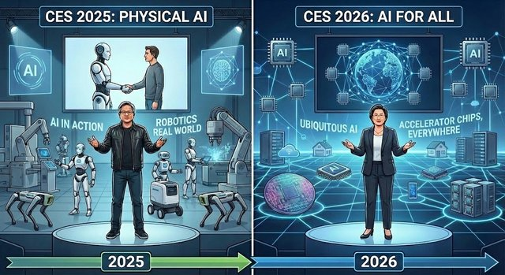

회사가 성공하기(=큰 매출을 올리기) 위해서는 "명확한 시장", "혁신적인 아이템", "훌륭한 팀" 3가지 요소가 필요하다고 생각합니다. 그리고 이번 CES를 보면서 현재 AI 시장은 전례 없이 빠르게 성장하고 있고, 한국의 많은 회사들이 이러한 환경 속에서 세계의 주목을 받고 있다고 느꼈습니다. 1년 사이에 눈부신 기술 발전을 이루어낸 많은 회사들에 대한 리스펙을 보내며, CES 2027에서의 한국 기업들의 활약을 기대해봅니다.

---

## 추신

### HyperAccel 채용 안내

이번 기회는 하이퍼엑셀을 되돌아보는 계기가 되기도 하였습니다. NPU 회사인 저희에게 "명확한 시장"은 이보다 더 좋을 수가 없어 보이고, "혁신적인 아이템"인 LPU는 이미 FPGA로 기능(Functionality)과 경쟁력(Performance) 검증이 끝나 ASIC 칩의 출시를 기다리고 있는 상황입니다. 저희는 마지막 요소인 "훌륭한 팀"을 함께 만들어갈 여러분을 기다리고 있습니다.

**채용 사이트**: https://hyperaccel.career.greetinghr.com/ko/guide

혹시 관심이 있으시다면 언제든지 연락 주세요!

