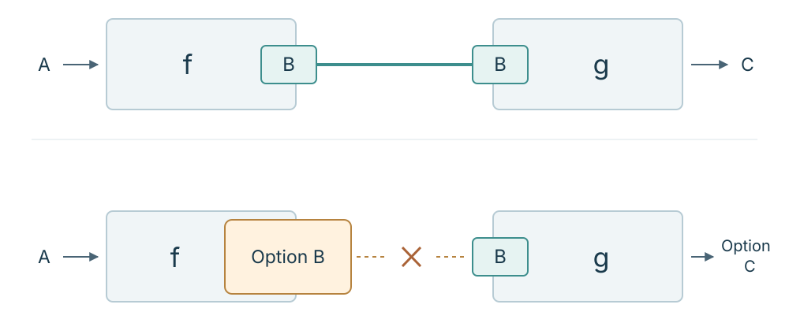
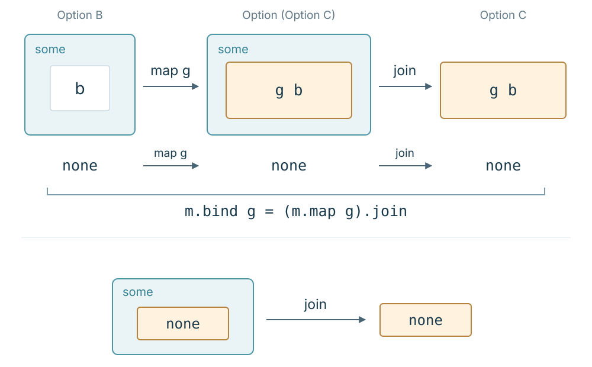

Hello, I am Jaeho Choi from the Compiler team at HyperAccel.

We live in an age when AI agents write code for us. A single prompt can produce hundreds of lines of functions in moments, and debates over paradigms such as functional programming can feel like a thing of the past.

Yet the faster we can produce code, the more important the work left to developers becomes: deciding how to assemble those functions.

> *“What rules should we use to connect all the functions AI produces?”*

When we can pass one function's result to the next, the task is straightforward. In real code, though, those connections do not always work as we intend.

This series begins where those connections break down. We will first write code that makes them work, then use the language of category theory to explore the laws that code satisfies and the mathematical structure within it. Along the way, we will work toward understanding what a monad is and how it relates to our original problem of connecting functions.

There is a reason for taking this approach. If you have looked for material on monads, you have probably encountered one of two barriers.

On one side stands the forbidding mathematical declaration, *“A monad is just a monoid in the category of endofunctors.”* Quoted without its original context, this alien vocabulary can exhaust readers before they even begin. On the other side are countless everyday analogies: *“A monad is a burrito,”* or *“A monad is a box.”* However many analogies you read, it can still be hard to find a clear answer to the basic questions: *“Why should I learn about monads? Why does my code need this?”*

Between mathematical declarations and everyday analogies lies code we can actually run. As we carry out computations and see exactly where their connections fail, the things those unfamiliar mathematical terms describe can begin to take a more concrete shape.

We will write that code in [Lean 4](https://lean-lang.org/lean4/doc). Lean 4 is both a functional programming language and an interactive theorem prover (ITP), which checks proofs of mathematical propositions. At first, we will use it to write and run functions. Later, we will use the same language to prove laws about the composition rules we have built. I will introduce the syntax as we need it in the examples.

In this article, we will connect two functions that may produce no value and build a reusable composition rule that works even when the functions change. Let us begin by connecting two ordinary functions.

---

## 1. Function composition: when outputs and inputs match

One way to manage complexity as software grows is to connect small functions.

Suppose we have one function that doubles a number and another that converts a number to a string. Applying them in sequence gives us a function that takes a number and returns a string representing twice that number. Whenever the output of the first function can serve as the input to the second, we can combine the two into a new function that performs a larger operation. In mathematics, this is called **function composition**, written $g \circ f$.

~~~text
f : A → B
g : B → C
g ∘ f : A → C
~~~

In terms of types, we can combine two functions when the return type of the first matches the input type of the next. The function $g \circ f$ first applies $f$ to an input $a$, then applies $g$ to the result.

What is interesting here is that as long as the return type of $f$ matches the input type of $g$, we can connect the computations regardless of how either function is implemented. In our example, we could replace $f$ with a function that squares a number or adds one to it. Any **function that returns a number** can compose with our number-to-string function $g$. If we also have a function $h$ that encodes a string as UTF-8 bytes, we can continue composing: $h \circ g \circ f$.

When we write real programs, however, we find that this assembly does not always go so smoothly.

---

## 2. Missing output: when composition's types no longer match

The usual mathematical function $f : A \to B$ returns some $b \in B$ for **every** input $a \in A$. Think of $\sin x$, $e^x$, or $x^2$. Such a function is called a **total function**.

In programs, however, we frequently encounter situations in which **there is no output value**: no corresponding $b$ is available for a given $a$.

Imagine writing a function that parses a user-provided string as a number. For the input `"42"`, it can return the number $42$, but for `"hello"`, it cannot return a valid number. Similarly, a lookup for a user account has no account information to return when the supplied ID is unregistered. A function whose output is undefined for **some** inputs is called a **partial function**.

Can we express a computation that cannot obtain a `B` for some inputs—a partial function—as a function defined for every input—a total function? Let us change one assumption: **what if the absence of a value were itself represented by a value?**

To do this, we change the return type from `B` to `Option B`. A value of `Option B` is either `some b`, containing a `b : B`, or `none`, representing **the absence of a value**. Even when there is no `B` to return, we can return `none` to express that fact. Python's `B | None`, C++'s `std::optional<B>`, and Haskell's `Maybe B` serve similar purposes. (Try looking up how your favorite language represents absence, too!)

We now define the function to return `some b` if it obtains a value for input `a`, and `none` otherwise. Every input has a corresponding `Option B` value, so this function has type `A → Option B` and is total. `Option` alone, however, does not tell us why the value is absent.

Let us connect two stages of such a computation. First, we parse an input string as a natural number; then we take that number's reciprocal. With `"42"`, we can complete both stages. With `"hello"`, the first stage cannot obtain a number. With `"0"`, parsing succeeds, but the second stage cannot obtain a reciprocal.

Call the first function $f$ and the next one $g$. Since either may fail to obtain a value, their types are:

~~~text
f : A → Option B
g : B → Option C
~~~

The problem appears when we try to compose them as before.

~~~text
g (f a)  -- Compile error: Option B cannot be used where B is required
~~~

$f$ hands us an `Option B`—a box (or a *burrito*) accounting for possible absence—while $g$ requires a $B$ value.

We therefore cannot directly define ordinary composition $g \circ f$ for $f : A \to \text{Option } B$ and $g : B \to \text{Option } C$.

How can we compose functions that may produce no value? How do programmers usually handle this mismatch?

---

## 3. Connecting two computations with branching

We cannot use $g \circ f$ directly, but the behavior we want from the connection is clear. If $f\,a$ is `none`, the overall result should be `none`. If it is `some b`, we should pass that $b$ to $g$ and use $g\,b$ as the result. For now, let us write this new composition as $g \star f : A \to \text{Option } C$.

Here is how we can write it using Lean's pattern matching. We will add one more stage, $h : C \to \text{Option } D$.

~~~lean
def runOption {A B C D : Type}
    (f : A → Option B) (g : B → Option C) (h : C → Option D)
    (a : A) : Option D :=
  match f a with
  | none => none
  | some b =>
    match g b with
    | none => none
    | some c => h c
~~~

This code computes exactly the result we want. If $f\,a$ is `none`, it stops at the first branch; if it is `some b`, it runs $g\,b$. If $g\,b$ is also `none`, it stops, and only if it is `some c` does it continue to $h\,c$. This is enough to write a single pipeline.

But what the branches do is independent of the particular computations performed by $f$, $g$, and $h$. We have written a connecting rule directly inside `runOption`: stop if the previous result is absent; otherwise, pass it to the next function. We need the same rule when connecting other functions or adding more stages.

Our goal goes beyond shortening this particular `runOption`: we want a **method of composition** that takes $f$ and $g$ and produces another function of type $A \to \text{Option } C$. This requires extracting the repeated branching at call sites into an **operation between two functions**. Let us first see whether an existing operation can do the job.

---

## 4. Nested contexts: why `map` alone is not enough

Developers familiar with functional programming might ask:

> *“Doesn't `map` apply a function to the value inside a container? Couldn't we use `(f a).map g`?”*

Here, $α$ and $β$ each stand for an arbitrary type. `Option.map` takes a function of type $α \to β$ and applies it to the value inside an `Option α`. Its type and behavior in the two cases are:

~~~text
Option.map : (α → β) → Option α → Option β

Option.map g none     = none
Option.map g (some b) = some (g b)
~~~

Since $g : B \to \text{Option } C$, applying it inside `some b` gives `some (g b)`. This wraps `Option C` in another layer, producing `Option (Option C)`. Applying it to the result of `f a` gives:

~~~text
f a               : Option B
g                 : B → Option C
(f a).map g       : Option (Option C)
~~~

For example, if $f\,a = \text{some }0$ and $g\,0 = \text{none}$, then `(f a).map g` is `some none`, rather than `none`. A value is present, but that value is itself “absent.” The two layers retain the fact that the first computation produced a value while the second did not.

We wanted a single `Option C` result: a value is either present or absent. What we have instead is `Option (Option C)`, one wrapper inside another.

It is like opening a box to find another box inside, as with Russian nesting dolls. `map` takes the inner $B$ and passes it to $g$, but does not remove the new wrapper ($\text{Option } C$) that $g$ itself produces.

Nor can we directly apply the next operation, $h : C \to \text{Option } D$, to this result. The value inside the outer `Option` is an `Option C`, whereas $h$ needs a $C$.

---

## 5. Building a composition rule with `join` and `bind`

We have just obtained an `Option (Option C)`. To return to the `Option C` we wanted, we need to remove the outer `Option` layer. If the outer value is `none`, return `none`; if it is `some result`, return the inner `result` unchanged. This operation has type `Option (Option C) → Option C` and is called `Option.join` in Lean. Because it reduces a nested context to one layer, its behavior is often described as **flattening**. We will use its operation name, `join`.

Let us apply `join` to the `map` result from Section 4. If $f\,a$ is `none`, $g$ is not run and the result is `none`. If $f\,a$ is `some b`, `map` produces `some (g b)`, and `join` removes the outer `some` to return $g\,b$.

~~~text
((f a).map g).join : Option C

if f a = none,    the result is none
if f a = some b,  the result is g b
~~~

The two branches we wrote explicitly in Section 3 have reappeared in this expression. In particular, when $g\,b$ is `none`, `map` produces `some none`, but `join` turns it into `none`. If we open the outer doll and find that the inner one is empty, the final result is simply “empty.”

Combining `map`, which applies a function to an inner value, with `join`, which removes one layer of nesting, gives an operation commonly called `flatMap` or `bind`. You will encounter it as `Option.bind` in Lean, `flatMap` in Java and Swift, and `and_then` in Rust and C++. In our code, we will use Lean's name, `bind`.

The relationship between the operations is expressed by this equation. This time, rather than using `#eval` to compute a few values, we will ask Lean to **prove** it. After `example` we write the equation to prove; after `by` we write instructions that construct its proof.

~~~lean
example {B C : Type} (m : Option B) (g : B → Option C) :
    m.bind g = (m.map g).join := by
  cases m <;> rfl
~~~

`cases m` splits `m` into the `none` and `some b` cases. `<;> rfl` runs `rfl` on both resulting goals; in each case, the two sides reduce to the same expression. Lean checks that both cases have been proved. Thus this code proves the equation for arbitrary `m` and `g`, rather than checking a few sample inputs.

Here, `m : Option B` and `g : B → Option C`. `bind` provides both steps together, while `join` removes one layer from an already nested `Option`. Later, in the formal definition of a monad, we will encounter this relationship again in the general form `bind m g = join (map g m)`.

~~~text
Option.bind : Option B → (B → Option C) → Option C

composeOption (f : A → Option B) (g : B → Option C) : A → Option C
composeOption f g a = Option.bind (f a) g
~~~

`Option.bind` connects an existing `Option B` value to the next function. Using it, we define `composeOption`, an **operation that takes two functions and produces a new function**. For each input $a$, it runs $f$, then connects the result to $g$ using `bind`. The composition we previously wrote as $g \star f$ is exactly `composeOption f g`.

Notice that the result of composition is itself a function of type `A → Option C`. If another function `h : C → Option D` follows, we can connect this result to `h` using the same operation.

~~~text
composeOption f g                  : A → Option C
composeOption (composeOption f g) h : A → Option D
~~~

Where we previously wrote another branch for each additional function, we can now reuse the composition operation we have already built. Each function handles its own computation; `composeOption` handles stopping when a value is absent and passing it to the next function when it is present.

---

## 6. Checking composition in Lean 4

We will now define the three ways of connecting functions in Lean 4 and compare their results on representative inputs.

We will define `parseNat`, which parses a string as a natural number, and `reciprocal`, which represents the reciprocal of a nonzero natural number as a string of the form `"1/n"`. The example focuses on absence and function connections, rather than numerical operations on fractions.

~~~lean
-- Monads and Category Theory ① When Functions Do Not Compose
-- Lean 4.32.1. Runs without additional libraries.

-- 1. Two functions that may produce no value
def parseNat (s : String) : Option Nat :=
  s.toNat?

def reciprocal (n : Nat) : Option String :=
  if n == 0 then
    none -- No reciprocal is represented for zero
  else
    some s!"1/{n}"

~~~

We define the connecting rule as `composeOption`. For comparison, we will also write out the branching from Section 3 and the `map` followed by `join` from Section 5.

~~~lean
-- Call the next function according to the previous result
def composeOptionByMatch {A B C : Type}
    (f : A → Option B) (g : B → Option C) : A → Option C :=
  fun x =>
    match f x with
    | none   => none
    | some b => g b

-- Express the same rule using Option.bind
def composeOption {A B C : Type}
    (f : A → Option B) (g : B → Option C) : A → Option C :=
  fun x => (f x).bind g

-- The same rule: apply map, then flatten one layer with join
def composeOptionByJoin {A B C : Type}
    (f : A → Option B) (g : B → Option C) : A → Option C :=
  fun x => ((f x).map g).join

~~~

Now let us compose the two functions.

~~~lean
def parseAndReciprocal : String → Option String :=
  composeOption parseNat reciprocal

~~~

`parseAndReciprocal` specifies only which two functions to connect. `composeOption` handles stopping when the previous result is absent and passing it to the next function when it is present. We can use the same rule unchanged to connect other functions.

Running the code lets us check an input that succeeds, along with inputs for which a value is absent at either stage.

~~~lean
#eval parseAndReciprocal "42"  -- some "1/42"
#eval parseAndReciprocal "0"   -- none       (No reciprocal is represented for zero)
#eval parseAndReciprocal "foo" -- none       (Parsing failed)
#eval (parseNat "0").map reciprocal -- some none (Two layers before join)

~~~

We can also use `#guard` to check whether the three implementations produce the same results. If its condition is true, the check passes; if false, Lean reports an error. Here are some of the checks; the Playground contains the full set for all three inputs.

~~~lean
#guard composeOptionByMatch parseNat reciprocal "42" == parseAndReciprocal "42"
#guard composeOptionByJoin parseNat reciprocal "0" == parseAndReciprocal "0"
#guard parseAndReciprocal "foo" == none
~~~

To modify the code and run it yourself, [open this example in the Lean 4 Playground](https://live.lean-lang.org/#code=--%20Monads%20and%20Category%20Theory%20%E2%91%A0%20When%20Functions%20Do%20Not%20Compose%0A--%20Lean%204.32.1.%20Runs%20without%20additional%20libraries.%0A%0A--%201.%20Two%20functions%20that%20may%20produce%20no%20value%0Adef%20parseNat%20%28s%20%3A%20String%29%20%3A%20Option%20Nat%20%3A%3D%0A%20%20s.toNat%3F%0A%0Adef%20reciprocal%20%28n%20%3A%20Nat%29%20%3A%20Option%20String%20%3A%3D%0A%20%20if%20n%20%3D%3D%200%20then%0A%20%20%20%20none%20--%20No%20reciprocal%20is%20represented%20for%20zero%0A%20%20else%0A%20%20%20%20some%20s%21%221%2F%7Bn%7D%22%0A%0A--%202.%20Call%20the%20next%20function%20according%20to%20the%20previous%20result%0Adef%20composeOptionByMatch%20%7BA%20B%20C%20%3A%20Type%7D%0A%20%20%20%20%28f%20%3A%20A%20%E2%86%92%20Option%20B%29%20%28g%20%3A%20B%20%E2%86%92%20Option%20C%29%20%3A%20A%20%E2%86%92%20Option%20C%20%3A%3D%0A%20%20fun%20x%20%3D%3E%0A%20%20%20%20match%20f%20x%20with%0A%20%20%20%20%7C%20none%20%20%20%3D%3E%20none%0A%20%20%20%20%7C%20some%20b%20%3D%3E%20g%20b%0A%0A--%20Express%20the%20same%20rule%20using%20Option.bind%0Adef%20composeOption%20%7BA%20B%20C%20%3A%20Type%7D%0A%20%20%20%20%28f%20%3A%20A%20%E2%86%92%20Option%20B%29%20%28g%20%3A%20B%20%E2%86%92%20Option%20C%29%20%3A%20A%20%E2%86%92%20Option%20C%20%3A%3D%0A%20%20fun%20x%20%3D%3E%20%28f%20x%29.bind%20g%0A%0A--%20The%20same%20rule%3A%20apply%20map%2C%20then%20flatten%20one%20layer%20with%20join%0Adef%20composeOptionByJoin%20%7BA%20B%20C%20%3A%20Type%7D%0A%20%20%20%20%28f%20%3A%20A%20%E2%86%92%20Option%20B%29%20%28g%20%3A%20B%20%E2%86%92%20Option%20C%29%20%3A%20A%20%E2%86%92%20Option%20C%20%3A%3D%0A%20%20fun%20x%20%3D%3E%20%28%28f%20x%29.map%20g%29.join%0A%0A--%203.%20Compose%20two%20functions%20to%20build%20a%20new%20function%0Adef%20parseAndReciprocal%20%3A%20String%20%E2%86%92%20Option%20String%20%3A%3D%0A%20%20composeOption%20parseNat%20reciprocal%0A%0A--%204.%20Check%20the%20evaluation%20results%0A%23eval%20parseAndReciprocal%20%2242%22%20%20--%20some%20%221%2F42%22%0A%23eval%20parseAndReciprocal%20%220%22%20%20%20--%20none%20%20%20%20%20%20%20%28No%20reciprocal%20is%20represented%20for%20zero%29%0A%23eval%20parseAndReciprocal%20%22foo%22%20--%20none%20%20%20%20%20%20%20%28Parsing%20failed%29%0A%23eval%20%28parseNat%20%220%22%29.map%20reciprocal%20--%20some%20none%20%28Two%20layers%20before%20join%29%0A%0A--%205.%20Check%20the%20three%20implementations%20on%20representative%20inputs.%0A%23guard%20composeOptionByMatch%20parseNat%20reciprocal%20%2242%22%20%3D%3D%20parseAndReciprocal%20%2242%22%0A%23guard%20composeOptionByMatch%20parseNat%20reciprocal%20%220%22%20%3D%3D%20parseAndReciprocal%20%220%22%0A%23guard%20composeOptionByMatch%20parseNat%20reciprocal%20%22foo%22%20%3D%3D%20parseAndReciprocal%20%22foo%22%0A%23guard%20composeOptionByJoin%20parseNat%20reciprocal%20%2242%22%20%3D%3D%20parseAndReciprocal%20%2242%22%0A%23guard%20composeOptionByJoin%20parseNat%20reciprocal%20%220%22%20%3D%3D%20parseAndReciprocal%20%220%22%0A%23guard%20composeOptionByJoin%20parseNat%20reciprocal%20%22foo%22%20%3D%3D%20parseAndReciprocal%20%22foo%22%0A%23guard%20parseAndReciprocal%20%2242%22%20%3D%3D%20some%20%221%2F42%22%0A%23guard%20parseAndReciprocal%20%220%22%20%3D%3D%20none%0A%23guard%20parseAndReciprocal%20%22foo%22%20%3D%3D%20none%0A).

`composeOptionByMatch` explicitly handles `none` and `some b`, while `composeOptionByJoin` applies `map` followed by `join`. `Option.bind` expresses the same connection in one line. The `#guard` checks comparing these implementations on representative inputs verify examples; they do not prove equality for every input.

- With `"42"`: parsing succeeds ($\text{some } 42$) $\to$ a fraction representation is produced ($\text{some } "1/42"$).
- With `"0"`: parsing succeeds ($\text{some } 0$) $\to$ the second function returns `none`.
- With `"foo"`: parsing fails ($\text{none}$) $\to$ the second function is never run, and $\text{none}$ is returned immediately.

We handled absence inside the composition rule, `composeOption`, without manually checking it at every call. `join` flattens both an outer `none` and a `some none` whose inner value is absent to `none`. Consequently, the final result alone cannot tell us which stage failed to produce a value.

---

## 7. The next question: laws of the composition rule

At first, we could not pass the `Option B` returned by the first function directly to the next. We can now express a rule in `composeOption`: stop when a value is absent, or pass it to the next computation when it is present. The rule remains reusable even when the functions change. The monads we will study bring together operations that connect computations in this way and the laws those operations must obey.

Will this rule give consistent results across multiple stages? We need to check whether either grouping of three functions gives the same result, and whether a function that simply wraps its input in `some` leaves composition unchanged.

In the next article, we will build a composition for `List`, where a single input can produce multiple results. Comparing these two kinds of computation—absence and multiple results—will help us see what their compositions have in common. We will then ask whether matching the types of a composition is enough, and prove in Lean 4 that our `Option` composition satisfies **associativity** and the **identity laws**.
