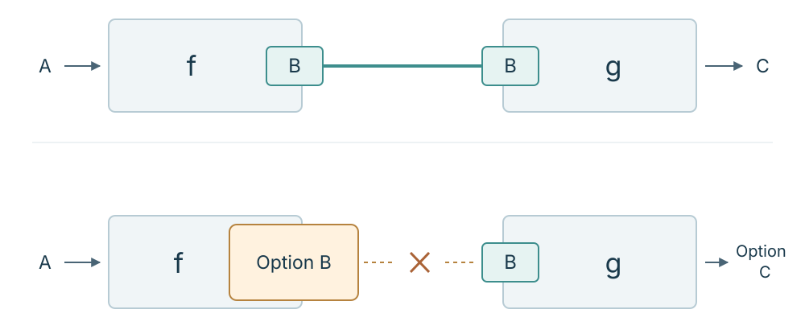
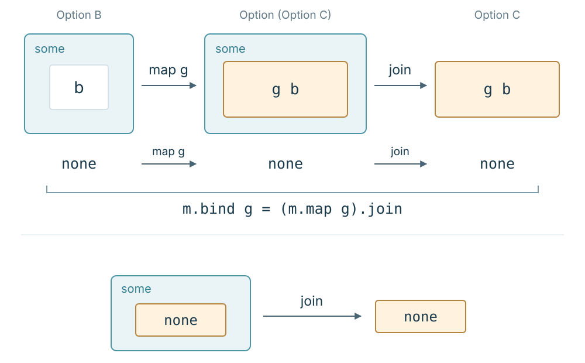

안녕하세요, HyperAccel Compiler팀 최재호입니다.

AI 에이전트가 코드를 대신 작성해 주는 시대입니다. 프롬프트 한 줄이면 수백 줄의 함수가 순식간에 완성되고, 함수형 프로그래밍 같은 패러다임 논쟁은 이미 한물간 옛날이야기처럼 느껴지기도 합니다.

하지만 코드를 만드는 속도가 빨라질수록, 개발자에게 남는 일, 곧 그 함수들을 어떻게 조립할지 결정하는 일은 더 중요해집니다.

> *"AI가 쏟아내는 수많은 함수들을 어떤 규칙으로 이어 붙일 것인가?"*

앞 함수의 결과를 다음 함수에 건넬 수 있을 때는 일이 간단합니다. 그런데 실제 코드를 쓰다 보면 그 연결이 뜻대로 되지 않는 경우도 만납니다.

이 시리즈에서는 바로 그 연결이 막히는 곳에서 출발해 보려 합니다. 막힌 연결을 다시 잇는 방법을 코드로 만들어 낸 뒤, 그 방법이 만족하는 법칙과 그 안에 내재된 수학적 구조를 범주론(category theory)의 언어로 살펴보겠습니다. 그 과정을 따라가며 모나드(monad)가 무엇인지, 처음의 함수 연결 문제와 어떻게 이어지는지 이해해 보겠습니다.

이 순서를 택한 데에는 이유가 있습니다. 모나드를 이해하려고 자료를 찾아본 분들이라면 대개 두 가지 장벽 중 하나를 마주했을 것입니다.

한쪽에는 “*모나드는 자기함자 범주의 모노이드일 뿐이다(A monad is just a monoid in the category of endofunctors)*”라는 불친절한 수학적 선언이 있습니다. 원래의 맥락이 잘린 채 인용되는 외계어 같은 수학 용어들은 시작도 하기 전에 독자를 지치게 만듭니다. 반대쪽에는 “*모나드는 부리또다*”, “*모나드는 상자다*”와 같은 수많은 일상적 비유들이 있습니다. 비유를 아무리 읽어도 정작 “*모나드를 왜 배워야 하지? 그래서 내 코드에 이게 왜 필요하지?*”라는 본질적인 질문에는 명쾌한 답을 얻기 어렵습니다.

수학적 선언과 일상적인 비유 사이에는 직접 실행해 볼 수 있는 코드가 있습니다. 계산을 직접 해 보고, 어떤 부분에서 연결이 막히는지 확인하다 보면 낯선 수학 용어가 설명하려는 대상도 조금씩 구체적인 모습을 드러낼 것입니다.

이 시리즈에서는 그 코드를 [Lean 4](https://lean-lang.org/lean4/doc)로 작성하겠습니다. Lean 4는 함수형 프로그래밍 언어이면서, 수학적 명제의 증명을 검사하는 대화형 정리 증명기(interactive theorem prover, ITP)이기도 합니다. 처음에는 함수를 작성하고 실행하는 데 사용하고, 이후에는 우리가 만든 합성 규칙이 어떤 법칙을 만족하는지 같은 언어로 증명해 보겠습니다. 필요한 문법은 예제와 함께 설명하겠습니다.

이번 편에서는 값이 없을 수 있는 두 함수를 연결하면서, 함수가 달라져도 재사용할 수 있는 합성 규칙을 직접 만들어 보겠습니다. 먼저 평범한 두 함수를 이어 붙이는 일부터 시작하겠습니다.

---

## 1. 함수 합성: 출력과 입력이 맞을 때

소프트웨어가 커질 때 복잡도를 낮추는 방법 중 하나는 작은 함수들을 이어 붙이는 것입니다.

어떤 숫자를 받아 두 배로 불려 주는 함수가 있고, 숫자를 받아 문자열로 변환하는 함수가 있다고 가정해 봅시다. 그렇다면 우리는 이 두 함수를 연달아 적용해, 숫자를 받아서 그 숫자의 두 배를 문자열로 변환하는 함수를 쉽게 만들 수 있습니다. 즉, 첫 번째 함수의 출력을 두 번째 함수의 입력으로 사용할 수 있다면, 두 함수를 하나로 묶어 더 큰 동작을 하는 새로운 함수를 만들 수 있습니다. 수학에서는 이를 **함수 합성**(composition)이라 부르고 $g \circ f$라고 적습니다.

~~~text
f : A → B
g : B → C
g ∘ f : A → C
~~~

함수의 타입 관점에서 생각해 보면, 앞선 함수의 반환 타입이 다음 함수의 입력 타입과 같을 때 두 함수를 하나의 함수로 묶을 수 있습니다. 이때 $g \circ f$는 입력 $a$에 먼저 $f$를 적용하고, 그 결과에 $g$를 적용하는 함수입니다.

여기서 흥미로운 건 $f$의 반환 타입과 $g$의 입력 타입이 일치하기만 한다면, 함수 내부가 어떻게 구현되었는가에 상관없이 계산들을 이어 갈 수 있다는 점입니다. 예를 들어 앞선 예시에서 $f$를 '숫자를 제곱하는 함수'나 '숫자에 1을 더하는 함수'로 바꾸어도, **숫자를 출력하는 함수**라면 숫자를 문자열로 바꾸는 $g$와 합성할 수 있습니다. 또한 문자열을 UTF-8 바이트로 인코딩하는 함수 $h$가 있다면 $h \circ g \circ f$와 같이 합성을 이어 갈 수 있습니다.

그런데 실제 프로그램을 작성하다 보면 이러한 조립이 생각만큼 잘 이뤄지지 않는다는 것을 알게 됩니다.

---

## 2. 출력값의 부재: 입력과 출력이 어긋나는 합성

우리가 일반적으로 떠올리는 함수 $f : A \to B$는 **모든** 입력 $a \in A$에 대해 어떤 $b \in B$를 돌려줍니다($\sin x$, $e^x$, $x^2$ 등을 떠올려 보세요). 수학에서는 이런 함수를 전함수(total function)라고 부릅니다.

하지만 프로그램의 함수에서는 **출력값이 없는 상황**, 즉 $a$에 대응하는 $b$가 존재하지 않는 경우가 빈번하게 발생합니다.
예를 들어 유저가 입력한 문자열을 숫자로 파싱하는 함수를 작성한다고 상상해 봅시다. 입력이 `"42"`라면 숫자 $42$를 돌려줄 수 있지만, 입력이 `"hello"`라면 유효한 숫자를 돌려줄 수 없습니다. 또 다른 예로, 회원 정보를 조회할 때 등록되지 않은 계정 ID를 입력하면 돌려줄 회원 정보가 없습니다. 이처럼 **어떤** 입력에 대해 출력이 정의되지 않은 함수를 부분 함수(partial function)라고 합니다.

그렇다면 입력에 따라 `B` 값을 구하지 못하는 계산(부분 함수)을 모든 입력에서 정의되는 함수(전함수)로 표현할 수 있을까요? 여기서 한 가지 발상을 바꿔 보겠습니다. **값이 없다는 사실도 하나의 값으로 표현하면 어떨까요?**

이를 위해 반환 타입을 `B`에서 `Option B`로 바꿉니다. `Option B`의 값은 어떤 `b : B`를 담은 `some b`이거나, **값의 부재**를 나타내는 `none`입니다. 돌려줄 `B` 값이 없어도, 그 사실을 나타내는 `none`은 돌려줄 수 있는 것입니다. Python의 `B | None`, C++의 `std::optional<B>`, Haskell의 `Maybe B`도 비슷한 역할을 합니다. (즐겨 쓰는 언어에서는 값의 부재를 어떻게 표현하는지도 찾아보세요!)

이제 입력 `a`에서 값을 구했다면 `some b`를, 구하지 못했다면 `none`을 돌려주도록 함수를 정의합니다. 어느 입력에도 `Option B` 값 하나가 대응하므로, 이 함수의 타입은 `A → Option B`이고 전함수입니다. 다만 `Option`만으로는 값이 없는 이유까지 알 수 없습니다.

이제 이렇게 값이 없을 수 있는 계산을 두 단계 이어 보겠습니다. 먼저 입력 문자열을 자연수로 파싱하고, 그다음에는 그 수의 역수를 구하는 것입니다. 입력이 `"42"`라면 두 단계를 모두 진행할 수 있습니다. 하지만 `"hello"`라면 첫 단계에서 숫자를 구하지 못하고, `"0"`이라면 파싱에는 성공해도 두 번째 단계에서 역수를 구할 수 없습니다.

첫 함수를 $f$, 다음 함수를 $g$라고 하면, 둘 다 값을 구하지 못할 수 있으므로 타입은 다음과 같습니다.

~~~text
f : A → Option B
g : B → Option C
~~~

두 함수를 이전과 같이 이어 붙여 합성하려 하면 문제가 드러납니다.

~~~text
g (f a)  -- 컴파일 에러: Option B를 B 자리에 넣을 수 없음
~~~

$f$는 값의 부재 가능성을 담은 `Option B`를 상자(혹은 *부리또*)로 건네는데, $g$는 $B$ 값만을 요구합니다.

결국 $f : A \to \text{Option } B$와 $g : B \to \text{Option } C$에는 보통의 합성 $g \circ f$를 그대로 정의할 수 없습니다.

어떻게 하면 값이 없을 가능성이 있는 함수들을 합성할 수 있을까요? 프로그래머들은 보통 이 어긋남을 어떻게 해결할까요?

---

## 3. 조건 분기로 두 계산을 이어 보면

$g \circ f$를 그대로 쓸 수는 없지만, 두 함수를 이어 붙였을 때 원하는 동작은 분명합니다. $f\,a$가 `none`이면 전체 결과도 `none`이고, `some b`이면 그 $b$를 $g$에 넘겨 $g\,b$를 결과로 삼으면 됩니다. 이렇게 만든 새 합성을 잠시 $g \star f : A \to \text{Option } C$라고 적겠습니다.

Lean의 분기문으로 쓰면 다음과 같습니다. 여기서는 $h : C \to \text{Option } D$까지 한 단계 더 이어 보겠습니다.

~~~lean
def runOption {A B C D : Type}
    (f : A → Option B) (g : B → Option C) (h : C → Option D)
    (a : A) : Option D :=
  match f a with
  | none => none
  | some b =>
    match g b with
    | none => none
    | some c => h c
~~~

이 코드는 원하는 결과를 정확히 계산합니다. $f\,a$가 `none`이면 첫 분기에서 멈추고, `some b`이면 $g\,b$를 실행합니다. $g\,b$도 `none`이면 멈추고, `some c`일 때만 $h\,c$로 넘어갑니다. 하나의 파이프라인을 작성하는 데에는 이 방법으로 충분합니다.

다만 분기문이 담당하는 일은 $f$, $g$, $h$의 고유한 계산과 관계가 없습니다. 앞선 결과가 없으면 멈추고, 있으면 다음 함수에 넘기는 연결 규칙을 `runOption` 안에 직접 적은 것입니다. 다른 함수들을 잇거나 단계를 추가할 때도 같은 규칙이 필요합니다.

이 글의 목표는 특정한 `runOption` 하나를 짧게 쓰는 것이 아니라, $f$와 $g$를 받아 다시 $A \to \text{Option } C$ 함수를 만드는 **합성 방법**을 찾는 것입니다. 그러려면 호출부에 반복되는 분기를 두 **함수 사이의 연산**으로 꺼내야 합니다. 먼저 이미 있는 연산으로 그 일을 할 수 있는지 살펴보겠습니다.

---

## 4. 중첩된 문맥: 왜 `map`만으로는 충분하지 않은가

함수형 프로그래밍을 접해 본 개발자라면 이렇게 물을 수 있습니다.

> *"컨테이너 안쪽의 값에 함수를 적용해 주는 `map`이 있지 않나요? `(f a).map g`를 쓰면 되지 않을까요?"*

여기서 $α$와 $β$는 각각 임의의 타입을 나타냅니다. `Option.map`은 $α \to β$인 함수를 받아 `Option α`의 안쪽 값에 적용합니다. 타입과 두 경우의 동작을 적으면 다음과 같습니다.

~~~text
Option.map : (α → β) → Option α → Option β

Option.map g none     = none
Option.map g (some b) = some (g b)
~~~

여기서 $g : B \to \text{Option } C$이므로, `some b`에 $g$를 적용한 결과는 `some (g b)`입니다. 이 값은 `Option C`를 한 겹 더 감싼 `Option (Option C)`입니다. `f a`의 결과에 적용하면 다음과 같습니다.

~~~text
f a               : Option B
g                 : B → Option C
(f a).map g       : Option (Option C)
~~~

예를 들어 $f\,a = \text{some }0$이고 $g\,0 = \text{none}$이라면, `(f a).map g`는 `none`이 아니라 `some none`입니다. 값이 있긴 있는데, 그 값이 '없음'인 셈입니다. 첫 계산은 값을 돌려주었지만 두 번째 계산에서는 값이 없었다는 사실이 두 층에 남습니다.

우리가 원한 것은 값이 있거나 없는 단일한 결과인 `Option C`였습니다. 그런데 손에 쥐어진 것은 껍질 속에 또 껍질이 들어 있는 `Option (Option C)`입니다.

마치 상자를 열었더니 그 안에 또 상자가 들어 있는 러시아 마트료시카 인형과 같습니다. `map`은 안쪽의 알맹이 $B$를 꺼내 $g$에 넘겨주는 일까지는 하지만, $g$ 자신이 새로 만들어 낸 껍질($\text{Option } C$)까지 책임져 주지는 못합니다.

또한 이 결과에 다음 연산인 $h : C \to \text{Option } D$를 바로 적용할 수도 없습니다. 바깥쪽 `Option` 안에 있는 것은 $C$가 아니라 `Option C`이기 때문입니다.

---

## 5. `join`과 `bind`로 합성 규칙 만들기

방금 얻은 것은 `Option (Option C)`입니다. 우리가 원했던 `Option C`로 돌아가려면 바깥쪽 `Option` 층을 한 겹 제거해야 합니다. 바깥쪽이 `none`이면 `none`을 돌려주고, `some result`이면 안쪽의 `result`를 그대로 돌려주는 연산입니다. 타입은 `Option (Option C) → Option C`이고, Lean에서는 `Option.join`이라고 부릅니다. 이 연산은 중첩된 문맥을 한 겹으로 줄이므로 동작을 설명할 때는 흔히 평탄화(flatten)라고도 합니다. 여기서는 정식 연산 이름인 `join`을 사용하겠습니다.

이제 4절의 `map` 결과에 `join`을 적용해 보겠습니다. $f\,a$가 `none`이면 뒤의 $g$는 실행되지 않고 결과도 `none`입니다. $f\,a$가 `some b`라면 `map`은 `some (g b)`를 만들고, `join`은 바깥쪽 `some`을 벗겨 $g\,b$를 돌려줍니다.

~~~text
((f a).map g).join : Option C

f a = none    이면  none
f a = some b  이면  g b
~~~

3절의 조건문에서 직접 적었던 두 갈래가 이 식에서 다시 나타났습니다. 특히 $g\,b$가 `none`일 때 `map`의 결과는 `some none`이지만, `join`을 거치면 `none`이 됩니다. 바깥 인형을 열었더니 안쪽 인형이 비어 있었다면, 결과도 그냥 '비어 있음'이 되는 셈입니다.

안쪽 값에 함수를 적용하는 `map`과 중첩을 한 겹 줄이는 `join`을 합친 연산은 보통 `flatMap` 또는 `bind`라고 부릅니다. Lean에서는 `Option.bind`, Java와 Swift에서는 `flatMap`, Rust와 C++에서는 `and_then`이라는 이름으로 만날 수 있습니다. 이 글의 코드에서는 Lean의 이름인 `bind`를 사용하겠습니다.

두 연산의 관계는 다음 등식으로 나타납니다. 여기서는 `#eval`로 몇 가지 값을 계산하는 대신, Lean에서 이 등식을 **증명**해 보겠습니다. `example` 뒤에 증명할 등식을 적고, `by` 뒤에 그 증명을 구성하는 명령을 씁니다.

~~~lean
example {B C : Type} (m : Option B) (g : B → Option C) :
    m.bind g = (m.map g).join := by
  cases m <;> rfl
~~~

`cases m`은 `m`이 `none`인 경우와 `some b`인 경우를 나눕니다. `<;> rfl`은 두 경우 각각에서 등식의 양쪽을 계산하면 같은 값이 됨을 확인합니다. Lean은 두 경우의 증명이 모두 끝났는지 검사합니다. 따라서 이 코드는 몇 가지 입력을 실행해 본 예가 아니라, 임의의 `m`과 `g`에 대해 등식이 성립한다는 증명입니다.

여기서 `m : Option B`, `g : B → Option C`입니다. `bind`는 이 두 단계를 한 번에 제공하고, `join`은 이미 만들어진 중첩 `Option` 한 겹을 줄입니다. 이후 모나드의 정식 정의에서는 이 관계를 `bind m g = join (map g m)`으로 일반화해 다시 만나게 됩니다.

~~~text
Option.bind : Option B → (B → Option C) → Option C

composeOption (f : A → Option B) (g : B → Option C) : A → Option C
composeOption f g a = Option.bind (f a) g
~~~

`Option.bind`는 이미 얻은 `Option B` 값과 다음 함수를 연결합니다. 이를 이용해 **두 함수를 받아 하나의 새 함수를 만드는 연산**을 `composeOption`이라고 정의하겠습니다. 각 입력 $a$에서 $f$를 실행한 뒤, 그 결과를 `bind`로 $g$에 연결하는 것입니다. 앞서 $g \star f$라고 적어 둔 합성이 바로 `composeOption f g`입니다.

여기서 눈여겨볼 점은 합성한 결과도 `A → Option C`인 함수라는 것입니다. 뒤에 `h : C → Option D`가 오더라도, 이 결과와 `h`를 같은 연산으로 다시 연결할 수 있습니다.

~~~text
composeOption f g                  : A → Option C
composeOption (composeOption f g) h : A → Option D
~~~

함수가 하나 늘어날 때마다 분기문을 새로 작성하던 자리에, 이제는 이미 만든 합성 연산을 다시 사용할 수 있습니다. 각 함수는 자기 계산을 맡고, 값이 없으면 멈추고 있으면 다음 함수로 넘기는 일은 `composeOption`이 맡습니다.

---

## 6. Lean 4로 확인하는 합성

이제 앞에서 살펴본 세 가지 연결 방식을 Lean 4 코드로 정의하고, 대표 입력에서 결과를 비교하겠습니다.

문자열을 자연수로 파싱하는 함수(`parseNat`)와 0을 제외한 자연수의 역수를 `"1/n"` 형태의 문자열로 나타내는 함수(`reciprocal`)를 정의하겠습니다. 이 예제는 분수의 수치 연산이 아니라 값의 부재와 함수 연결에 초점을 맞춥니다.

~~~lean
-- 모나드와 범주론 ① 함수가 이어지지 않을 때
-- Lean 4.32.1. 별도의 라이브러리 없이 실행됩니다.

-- 1. 값이 없을 수 있는 두 함수
def parseNat (s : String) : Option Nat :=
  s.toNat?

def reciprocal (n : Nat) : Option String :=
  if n == 0 then
    none -- 0의 역수는 나타내지 않음
  else
    some s!"1/{n}"

~~~

두 함수를 잇는 규칙은 `composeOption`으로 정의합니다. 3절에서 직접 쓴 분기와 5절의 `map` 다음 `join`도 나란히 적어 비교해 보겠습니다.

~~~lean
-- 앞의 결과에 따라 다음 함수를 호출하는 규칙
def composeOptionByMatch {A B C : Type}
    (f : A → Option B) (g : B → Option C) : A → Option C :=
  fun x =>
    match f x with
    | none   => none
    | some b => g b

-- 같은 규칙을 Option.bind로 표현
def composeOption {A B C : Type}
    (f : A → Option B) (g : B → Option C) : A → Option C :=
  fun x => (f x).bind g

-- map으로 적용한 뒤 join으로 한 겹 평탄화하는 같은 규칙
def composeOptionByJoin {A B C : Type}
    (f : A → Option B) (g : B → Option C) : A → Option C :=
  fun x => ((f x).map g).join

~~~

이제 두 함수를 합성해 보겠습니다.

~~~lean
def parseAndReciprocal : String → Option String :=
  composeOption parseNat reciprocal

~~~

`parseAndReciprocal`에는 어떤 두 함수를 연결할지만 적혀 있습니다. 앞의 결과가 없을 때 멈추고, 있으면 다음 함수로 넘기는 방법은 `composeOption`이 맡습니다. 다른 함수들을 연결할 때도 같은 규칙을 그대로 사용할 수 있습니다.

직접 실행하면 성공하는 입력과 각 단계에서 값이 없어지는 입력을 확인할 수 있습니다.

~~~lean
#eval parseAndReciprocal "42"  -- some "1/42"
#eval parseAndReciprocal "0"   -- none       (0의 역수는 나타내지 않음)
#eval parseAndReciprocal "foo" -- none       (파싱 실패)
#eval (parseNat "0").map reciprocal -- some none (join 전의 두 겹)

~~~

세 구현이 같은 결과를 내는지도 `#guard`로 확인할 수 있습니다. 조건이 참이면 검사를 통과하고, 거짓이면 Lean이 오류를 보고합니다. 아래는 검사 중 일부이며, Playground에는 세 입력에 대한 전체 검사가 들어 있습니다.

~~~lean
#guard composeOptionByMatch parseNat reciprocal "42" == parseAndReciprocal "42"
#guard composeOptionByJoin parseNat reciprocal "0" == parseAndReciprocal "0"
#guard parseAndReciprocal "foo" == none
~~~

코드를 직접 바꿔 가며 실행해 보고 싶다면 [Lean 4 Playground에서 이 예제를 열어 보세요](https://live.lean-lang.org/#code=--%20%EB%AA%A8%EB%82%98%EB%93%9C%EC%99%80%20%EB%B2%94%EC%A3%BC%EB%A1%A0%20%E2%91%A0%20%ED%95%A8%EC%88%98%EA%B0%80%20%EC%9D%B4%EC%96%B4%EC%A7%80%EC%A7%80%20%EC%95%8A%EC%9D%84%20%EB%95%8C%0A--%20Lean%204.32.1.%20%EB%B3%84%EB%8F%84%EC%9D%98%20%EB%9D%BC%EC%9D%B4%EB%B8%8C%EB%9F%AC%EB%A6%AC%20%EC%97%86%EC%9D%B4%20%EC%8B%A4%ED%96%89%EB%90%A9%EB%8B%88%EB%8B%A4.%0A%0A--%201.%20%EA%B0%92%EC%9D%B4%20%EC%97%86%EC%9D%84%20%EC%88%98%20%EC%9E%88%EB%8A%94%20%EB%91%90%20%ED%95%A8%EC%88%98%0Adef%20parseNat%20%28s%20%3A%20String%29%20%3A%20Option%20Nat%20%3A%3D%0A%20%20s.toNat%3F%0A%0Adef%20reciprocal%20%28n%20%3A%20Nat%29%20%3A%20Option%20String%20%3A%3D%0A%20%20if%20n%20%3D%3D%200%20then%0A%20%20%20%20none%20--%200%EC%9D%98%20%EC%97%AD%EC%88%98%EB%8A%94%20%EB%82%98%ED%83%80%EB%82%B4%EC%A7%80%20%EC%95%8A%EC%9D%8C%0A%20%20else%0A%20%20%20%20some%20s%21%221%2F%7Bn%7D%22%0A%0A--%202.%20%EC%95%9E%EC%9D%98%20%EA%B2%B0%EA%B3%BC%EC%97%90%20%EB%94%B0%EB%9D%BC%20%EB%8B%A4%EC%9D%8C%20%ED%95%A8%EC%88%98%EB%A5%BC%20%ED%98%B8%EC%B6%9C%ED%95%98%EB%8A%94%20%EA%B7%9C%EC%B9%99%0Adef%20composeOptionByMatch%20%7BA%20B%20C%20%3A%20Type%7D%0A%20%20%20%20%28f%20%3A%20A%20%E2%86%92%20Option%20B%29%20%28g%20%3A%20B%20%E2%86%92%20Option%20C%29%20%3A%20A%20%E2%86%92%20Option%20C%20%3A%3D%0A%20%20fun%20x%20%3D%3E%0A%20%20%20%20match%20f%20x%20with%0A%20%20%20%20%7C%20none%20%20%20%3D%3E%20none%0A%20%20%20%20%7C%20some%20b%20%3D%3E%20g%20b%0A%0A--%20%EA%B0%99%EC%9D%80%20%EA%B7%9C%EC%B9%99%EC%9D%84%20Option.bind%EB%A1%9C%20%ED%91%9C%ED%98%84%0Adef%20composeOption%20%7BA%20B%20C%20%3A%20Type%7D%0A%20%20%20%20%28f%20%3A%20A%20%E2%86%92%20Option%20B%29%20%28g%20%3A%20B%20%E2%86%92%20Option%20C%29%20%3A%20A%20%E2%86%92%20Option%20C%20%3A%3D%0A%20%20fun%20x%20%3D%3E%20%28f%20x%29.bind%20g%0A%0A--%20map%EC%9C%BC%EB%A1%9C%20%EC%A0%81%EC%9A%A9%ED%95%9C%20%EB%92%A4%20join%EC%9C%BC%EB%A1%9C%20%ED%95%9C%20%EA%B2%B9%20%ED%8F%89%ED%83%84%ED%99%94%ED%95%98%EB%8A%94%20%EA%B0%99%EC%9D%80%20%EA%B7%9C%EC%B9%99%0Adef%20composeOptionByJoin%20%7BA%20B%20C%20%3A%20Type%7D%0A%20%20%20%20%28f%20%3A%20A%20%E2%86%92%20Option%20B%29%20%28g%20%3A%20B%20%E2%86%92%20Option%20C%29%20%3A%20A%20%E2%86%92%20Option%20C%20%3A%3D%0A%20%20fun%20x%20%3D%3E%20%28%28f%20x%29.map%20g%29.join%0A%0A--%203.%20%EB%91%90%20%ED%95%A8%EC%88%98%EB%A5%BC%20%ED%95%A9%EC%84%B1%ED%95%98%EC%97%AC%20%EC%83%88%EB%A1%9C%EC%9A%B4%20%ED%95%A8%EC%88%98%20%EA%B5%AC%EC%84%B1%0Adef%20parseAndReciprocal%20%3A%20String%20%E2%86%92%20Option%20String%20%3A%3D%0A%20%20composeOption%20parseNat%20reciprocal%0A%0A--%204.%20%EC%8B%A4%ED%96%89%20%EA%B2%B0%EA%B3%BC%20%ED%99%95%EC%9D%B8%0A%23eval%20parseAndReciprocal%20%2242%22%20%20--%20some%20%221%2F42%22%0A%23eval%20parseAndReciprocal%20%220%22%20%20%20--%20none%20%20%20%20%20%20%20%280%EC%9D%98%20%EC%97%AD%EC%88%98%EB%8A%94%20%EB%82%98%ED%83%80%EB%82%B4%EC%A7%80%20%EC%95%8A%EC%9D%8C%29%0A%23eval%20parseAndReciprocal%20%22foo%22%20--%20none%20%20%20%20%20%20%20%28%ED%8C%8C%EC%8B%B1%20%EC%8B%A4%ED%8C%A8%29%0A%23eval%20%28parseNat%20%220%22%29.map%20reciprocal%20--%20some%20none%20%28join%20%EC%A0%84%EC%9D%98%20%EB%91%90%20%EA%B2%B9%29%0A%0A--%205.%20%EC%84%B8%20%EA%B5%AC%ED%98%84%EC%9D%98%20%EA%B2%B0%EA%B3%BC%EC%99%80%20%EB%8C%80%ED%91%9C%20%EC%9E%85%EB%A0%A5%EC%9D%84%20%ED%99%95%EC%9D%B8%ED%95%A9%EB%8B%88%EB%8B%A4.%0A%23guard%20composeOptionByMatch%20parseNat%20reciprocal%20%2242%22%20%3D%3D%20parseAndReciprocal%20%2242%22%0A%23guard%20composeOptionByMatch%20parseNat%20reciprocal%20%220%22%20%3D%3D%20parseAndReciprocal%20%220%22%0A%23guard%20composeOptionByMatch%20parseNat%20reciprocal%20%22foo%22%20%3D%3D%20parseAndReciprocal%20%22foo%22%0A%23guard%20composeOptionByJoin%20parseNat%20reciprocal%20%2242%22%20%3D%3D%20parseAndReciprocal%20%2242%22%0A%23guard%20composeOptionByJoin%20parseNat%20reciprocal%20%220%22%20%3D%3D%20parseAndReciprocal%20%220%22%0A%23guard%20composeOptionByJoin%20parseNat%20reciprocal%20%22foo%22%20%3D%3D%20parseAndReciprocal%20%22foo%22%0A%23guard%20parseAndReciprocal%20%2242%22%20%3D%3D%20some%20%221%2F42%22%0A%23guard%20parseAndReciprocal%20%220%22%20%3D%3D%20none%0A%23guard%20parseAndReciprocal%20%22foo%22%20%3D%3D%20none%0A).

`composeOptionByMatch`는 `none`과 `some b`를 직접 나누고, `composeOptionByJoin`은 `map` 다음 `join`을 적용합니다. `Option.bind`는 같은 연결을 한 줄로 표현합니다. 세 구현을 대표 입력에서 비교한 `#guard`는 예제 확인이며, 모든 입력에 대한 증명은 아닙니다.

- `"42"`가 들어오면: 파싱 성공($\text{some } 42$) $\to$ 분수 표기 생성($\text{some } "1/42"$).
- `"0"`이 들어오면: 파싱 성공($\text{some } 0$) $\to$ 두 번째 함수가 `none` 반환.
- `"foo"`가 들어오면: 파싱 실패($\text{none}$) $\to$ 두 번째 함수는 실행조차 되지 않고 즉시 $\text{none}$ 반환.

값의 부재를 매 호출마다 수동으로 검사하지 않고, 합성 규칙(`composeOption`) 안에서 처리했습니다. `join`은 바깥쪽 `none`과 안쪽이 비어 있는 `some none`을 모두 `none`으로 평탄화합니다. 그래서 최종 결과만으로는 어느 단계에서 값이 없어졌는지 알 수 없습니다.

---

## 7. 다음 질문: 합성 규칙의 법칙

처음에는 앞 함수가 돌려준 `Option B`를 다음 함수에 그대로 넘길 수 없었습니다. 이제는 값이 없으면 멈추고, 있으면 다음 계산으로 넘기는 규칙을 `composeOption`으로 표현할 수 있습니다. 연결할 함수가 달라져도 이 규칙은 그대로 사용할 수 있습니다. 앞으로 살펴볼 모나드는 이처럼 계산을 잇는 연산과 그 연산이 지켜야 할 법칙을 함께 다루는 구조입니다.

그렇다면 이 규칙을 여러 단계에 써도 결과가 일관될까요? 세 함수를 어느 괄호부터 묶어도 같은 결과가 나오는지, 입력을 `some`으로 감싸기만 하는 함수가 합성을 바꾸지 않는지 확인해야 합니다.

다음 편에서는 하나의 입력에서 여러 결과를 내는 `List`의 합성을 만들어 보겠습니다. 값의 부재와 다중 결과라는 서로 다른 계산을 비교하며, 두 합성에서 무엇이 공통으로 남는지 살펴보겠습니다. 이어서 합성의 타입을 맞추는 것만으로 충분한지 묻고, `Option`의 합성이 **결합법칙**과 **항등법칙**을 만족하는지 Lean 4로 증명하겠습니다.
