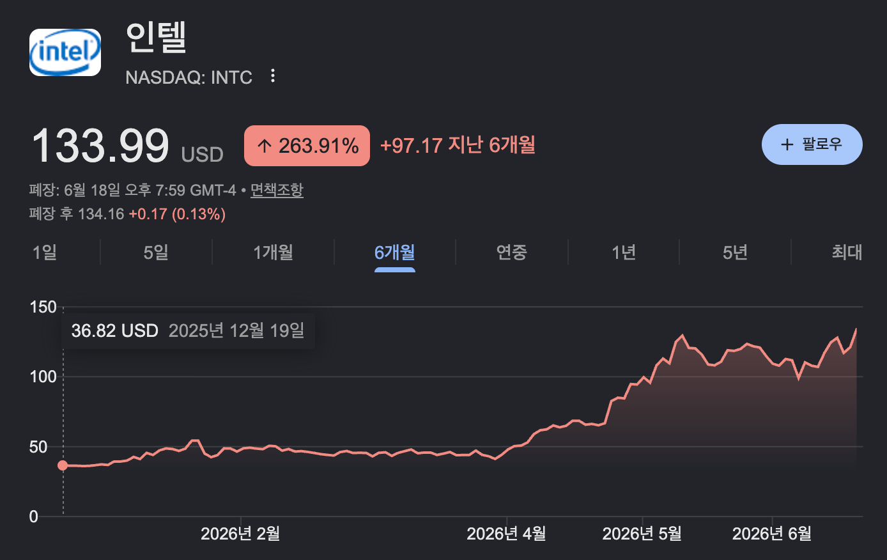
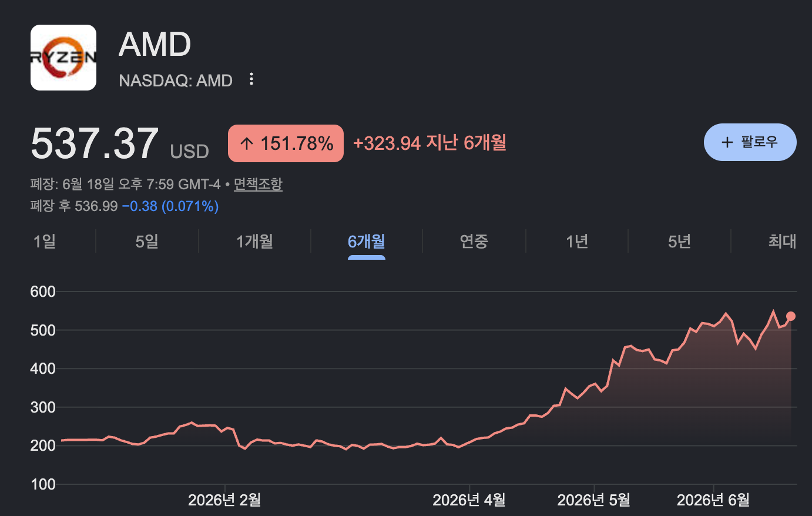
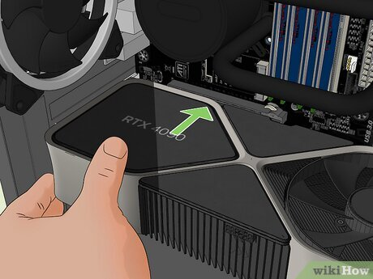
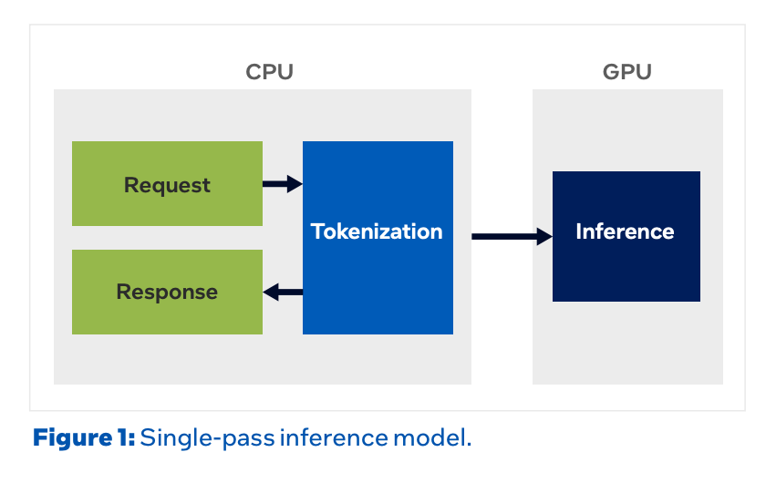
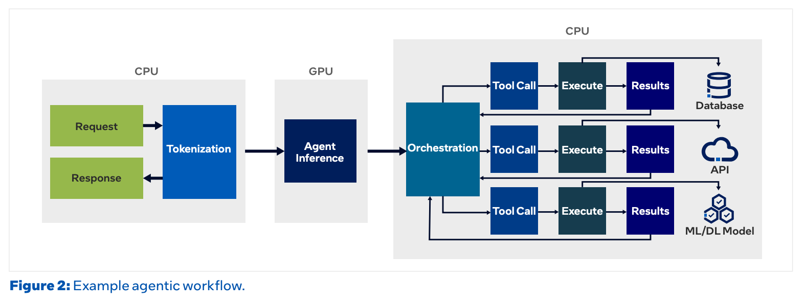
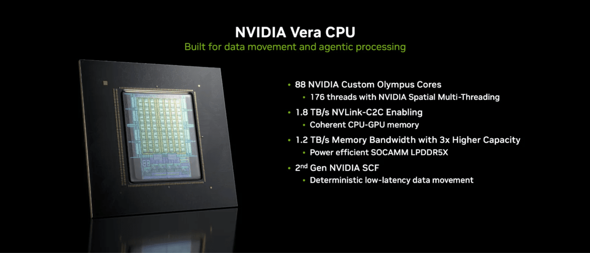
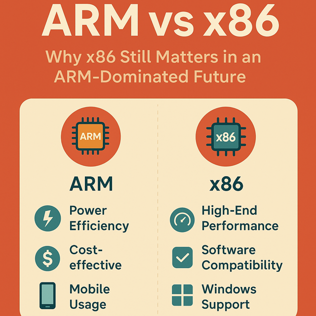
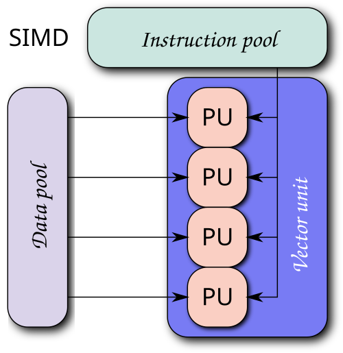
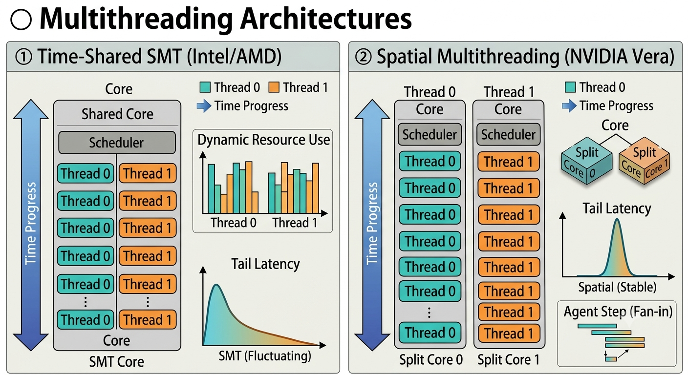

# 지피지기면 백전불태 6편 : Agentic AI 시대, CPU의 부활과 CPU 삼국지의 시작

> **"상대를 알고 나를 알면 백 번 싸워도 위태롭지 않다."**  
> 이 시리즈는 AI 가속기 설계를 위해 경쟁사들의 하드웨어를 깊이 이해하는 것을 목표로 합니다.  
> 여섯 번째 글에서는 Agentic AI 시대에 다시 주목받는 **데이터센터 CPU**, 그리고 이를 둘러싼 Intel·AMD·NVIDIA 세 벤더의 경쟁에 대해 다룹니다.

---

안녕하세요? HyperAccel DV팀 소속 하드웨어 검증 엔지니어 임재원입니다.

오늘 글은 두 기업의 주가 차트로 시작해 보겠습니다.

지난 4월 말, Intel이 1분기 실적을 발표하자 다음 날 주가가 하루 만에 **24%** 뛰었습니다. 1987년 이후 가장 큰 일간 상승폭이었습니다. 2주 뒤 실적을 낸 AMD의 주가도 다음 날 **18.6%** 올랐습니다. 두 회사의 실적 성장 뒤에는 공통점이 하나 있었습니다. 바로 **CPU** 였습니다.

AMD의 데이터센터 매출은 전년 대비 **57%**, Intel은 **22%** 늘었고, 두 회사 모두 서버 CPU 수요 급증을 그 배경으로 꼽았습니다. AMD의 리사 수 CEO는 서버 CPU 시장이 2030년까지 **1,200억 달러** 규모로 커질 것이라 전망하기도 했습니다.

> GPU가 AI의 중심이라고 했는데, 왜 다시 CPU 이야기를 하는 것일까요?

이 질문이 오늘 글의 출발점입니다. 지금까지 이 시리즈에서 다룬 가속기 구조와 여러 솔루션은 모두 "가속기를 AI 연산에 어떻게 최적화하느냐"에 대한 이야기였습니다. 그런데 추론 워크로드가 **Agentic AI** 로 옮겨가면서, 정작 이 최적화된 가속기가 오히려 일을 못하고 준비 상태로 기다리게 되는 역설이 나타나기 시작했습니다. 그리고 그 병목에는 생각지도 못한 **CPU** 가 자리잡고 있습니다.

이번 글에서는 먼저 Agentic AI 시대에 CPU가 다시 병목이 된 이유를 짚어 본 뒤, **Intel · AMD · NVIDIA** 세 회사의 최신 데이터센터 CPU를 비교해 보며 GPU 전쟁에 이어 앞으로 이어질 CPU 전쟁에 대해 살펴보겠습니다.

## GPU만 늘리면 될까? : 다시 불려 나온 CPU

본격적인 이야기에 앞서, CPU와 GPU의 관계를 잠깐 짚고 가겠습니다. 우리는 흔히 AI 연산의 주인공을 GPU라고 생각하지만, **GPU는 혼자서는 한 줄도 실행하지 못합니다**. GPU는 본래 화면을 그리는 그래픽 연산을 빠르게 처리하려고 만든 보조 장치였고, 운영체제를 올리고 프로그램을 띄우고 무슨 일을 할지 지시하는 일은 처음부터 CPU의 몫이었습니다. CPU는 혼자서 컴퓨터를 돌릴 수 있지만, GPU는 자신을 먹여 주고 지휘해 줄 호스트 CPU 없이는 아무것도 하지 못합니다. PC에 그래픽카드를 꽂던 시절부터 지금까지 이 종속 관계는 지금도 변하지 않았습니다.

이후 CUDA로 대표되는 GPGPU(General-Purpose computing on GPU)가 등장하며 GPU는 그래픽을 넘어 범용 연산까지 떠맡았지만, 그것이 CPU를 완전히 대체하려는 것은 아니었습니다. 무겁고 규칙적인 행렬 연산은 GPU가, 분기와 제어가 많은 나머지 일은 여전히 CPU가 맡는 분업이었죠. 그런데 AI 시대에 GPU의 몸값이 폭등하면서, 어느새 CPU는 'GPU를 먹여 주는 덜 중요한 부품' 정도로 취급되기 시작했습니다. 주연과 조연이 뒤바뀐 것처럼 보였습니다.

하지만 GPU는 여전히 범용 장치가 아닙니다. 그리고 Agentic AI는 검색 엔진을 두드리고, 샌드박스에서 코드를 실행하고, 여러 도구를 조율하는, 어디에나 필요한 범용적인 일들을 끝없이 요구합니다. 이것은 GPU가 할 수 없고 CPU만이 하는 일입니다. 한동안 조연으로 밀려나 있던 CPU가 다시 무대 중앙으로 불려 나오고, 데이터센터 CPU를 둘러싼 새로운 전쟁이 시작되는 지점입니다.

AI 연산에 병목이 생길 때 가장 흔하게 떠올릴 수 있는 해결책은 GPU입니다. 더 좋은 성능의 GPU, 더 많은 GPU로 인프라를 확장하는 것입니다. 모델을 한 번 통과시키는 것이 AI 애플리케이션의 전부이던 시절에는 대체로 맞는 처방이었습니다.

그런데 최근 연구들은 조금 이상한 장면을 보여 줍니다. 한 연구에 따르면, agent가 도구를 호출하고 그 결과를 처리하는 시간이 워크로드에 따라 전체 응답 지연의 **최대 88%** 까지 차지했습니다. 그리고 이 도구 실행은 거의 전부 CPU에서 일어납니다. 정작 값비싼 GPU는 그 시간 동안 CPU의 실행 결과를 기다리며 놀고 있었던 셈입니다.

더 흥미로운 것은 이를 해결할 방법을 보여준 또 다른 연구입니다. 여기서는 GPU를 단 한 장도 추가하지 않았습니다. 대신 GPU 하나에 배정된 CPU 코어를 1개에서 8개로 늘렸을 뿐입니다. 그러자 첫 토큰까지 걸리는 시간(TTFT)이 최대 **5배** 까지 빨라졌습니다. 

GPU를 더 늘리지 않고, CPU 코어 몇 개를 추가하는 것만으로 몇 배의 속도 차이를 보인 것입니다. CPU가 다시 컴퓨팅의 최전선으로 돌아온 것일까요? 다음 섹션에서 그 배경에 대해 알아보겠습니다.

## 왜 CPU가 중요해지는가 : 단일 패스에서 agentic 루프로

CPU를 추가하는 것만으로 어떻게 이러한 성능 향상을 이룰 수 있었을까요? 답은 추론의 형태가 진화했다는 데 있습니다.

지금까지 LLM 추론은 한 번의 경로로 끝납니다. CPU가 입력을 토큰으로 쪼개면, GPU가 모델을 통과시켜 답을 만들고, CPU가 다시 사람이 읽을 글자로 풀어냅니다. 이 구조에서 GPU는 거의 쉴 틈 없이 일합니다. CPU가 맡는 일은 앞뒤로 토큰을 변환하는 가벼운 작업뿐입니다.

**Agentic AI** 는 이 그림을 바꿉니다. 에이전트는 모델의 답변을 내놓는 데서 끝나지 않고, 코드·문서·디자인 같은 결과물을 직접 만들어 냅니다. 이를 위해 계획을 세우고, 도구를 부르고, 결과를 본 뒤 다시 판단하는 과정을 여러 번 반복하죠. 이 과정에서 도구 실행과 검색, 코드 실행, 오케스트레이션, 재시도는 **모두** CPU의 몫입니다. GPU는 모델을 빠르게 통과시키는 일에만 특화돼 있어, 그 한 순간을 빼면 나머지는 전부 CPU가 떠안기 때문입니다. 결국 GPU는 모델을 통과시키는 순간에만 일하고, CPU가 도구를 돌리는 동안에는 멈춰서 기다립니다.

그렇다면 CPU가 떠안는 일은 구체적으로 무엇일까요? 크게 세 가지입니다.

첫째는 정보 검색입니다. **RAG**(Retrieval-Augmented Generation)나 벡터 DB 조회, 데이터베이스 질의처럼 외부 지식을 찾아오는 작업입니다. 거대한 인덱스를 뒤지고 디스크와 네트워크를 오가는 일이기 때문에 메모리를 많이 소모하고, CPU에서 성능이 더 좋기 때문에 CPU가 주로 진행합니다.

둘째는 코드 실행입니다. Agentic AI는 코딩 작업에 특히 많이 사용됩니다. 모델이 만든 코드는 사용자에게 전달되기 전에 정상적인 코드인지 확인하는 작업을 거칩니다. 이때 격리된 샌드박스(컨테이너나 별도 프로세스)를 띄워 그 안에서 파이썬이나 shell을 돌립니다. 이 역시 전형적인 CPU·운영체제 작업입니다.

셋째는 작업과 작업을 연결하는 일입니다. 도구 호출을 준비하고, 돌아온 결과를 파싱하고, 다음 단계를 정하고, 실패하면 재시도하는 오케스트레이션이 CPU 위에서 끊임없이 돌아갑니다.

Intel 측의 표현을 빌려 말하면, Agentic AI는 추론을 LLM과 같은 하나의 거대한 프로그램이 아니라, 여러 작은 서비스가 협력하는 마이크로서비스에 가깝게 만듭니다. 제어 흐름과 도구 호출, 재시도, 조율 과정이 전부 CPU 위에서 이루어집니다. 그 결과 한 번의 작업이 진행되는 시간의 상당 부분, 측정에 따라서는 **30-90%** 가 CPU에 머뭅니다.

### 비용의 역설

역설적인 것은 비용입니다. 클라우드 인스턴스 가격을 기준으로 보면, GPU 연산은 CPU보다 100배에서 많게는 1,600배까지 비쌉니다. 그런데 이 병목을 풀기 위해 CPU 코어를 더 얹는 비용은 한 서버 기준 약 1.5%에 그쳤습니다. 비싼 GPU를 놀리지 않으려고 값싼 CPU를 조금 더 쓰는 편이 훨씬 남는 장사인 셈입니다.

아울러 앞선 연구 결과들은 "GPU가 좋아질수록 병목은 오히려 CPU로 더 빠르게 옮겨간다"고 말합니다. 차세대 GPU가 모델을 더 빨리 통과시킬수록, 그 사이 다른 작업을 실행하는 CPU의 상대적 부담이 더 커지기 때문입니다. 결국 GPU를 키우는 것만으로는 이 문제가 풀리지 않습니다. 더 좋은 CPU, 더 많은 CPU가 필요해지는 것입니다. 그렇다면 이제 시선을 CPU 자체로, 그리고 CPU를 만드는 회사들로 옮겨 보겠습니다.

## 2강 구도에서 3강 구도로 — CPU 경쟁에 뛰어든 NVIDIA

전통적으로 서버 한 대에서 CPU 한 개는 GPU 4-8개를 거느렸습니다. agentic 시대에는 이 비율이 거꾸로 뒤집힙니다. Intel은 차세대 GPU가 더 빨라질수록, GPU 한 개를 제대로 운용하는 데 CPU가 **최대 7개까지** 필요해질 수 있다고 주장합니다.

그래서 CPU를 만드는 회사들 모두 "이제 다시 CPU의 시대"라고 외칩니다. 그런데 여기서 그동안 보이지 않던 이름이 하나 등장합니다 — 바로 GPU를 만들던 **NVIDIA** 입니다. NVIDIA가 CPU 경쟁에 직접 뛰어든 것이죠.

사실 이는 **반은 맞고 반은 틀린** 이야기입니다. NVIDIA가 데이터센터 CPU 경쟁의 한복판으로 걸어 들어온 것은 분명 새로운 사건이지만, 'NVIDIA가 CPU를 처음 만든다'는 뜻은 아니기 때문입니다. GPU는 혼자서는 아무것도 시작하지 못합니다. 부팅도, 연산할 일을 나눠 던지는 것도 모두 곁에 붙은 **CPU(호스트)** 가 해 줘야 하죠. 그래서 NVIDIA는 오래전부터 자사 GPU를 거느릴 CPU를 직접 만들어 왔습니다.

다만 그 무대가 데이터센터는 아니었습니다. 전통적인 데이터센터와 PC 시장은 x86을 쥔 **Intel과 AMD** 가 단단히 틀어쥐고 있었고, x86 라이선스가 없는 NVIDIA가 비집고 들어갈 자리는 거의 없었습니다. 그래서 NVIDIA의 CPU는 주로 Arm 기반 SoC인 **Tegra** 의 형태로, 닌텐도 스위치 같은 게임기와 모바일·자동차 임베디드 영역에 자리 잡았죠.

하지만 NVIDIA는 그 과정에서 쌓은 코어 설계 노하우와 자사 GPU와의 호환성을 발판 삼아, Arm ISA를 중심으로 'GPU와 함께 파는' 데이터센터 CPU로 무대를 넓혀 왔습니다. Hopper·Blackwell에 짝지은 **Grace** 가 그 첫 결실이었죠. 그리고 마침내 2026년 6월 GTC Taipei에서, NVIDIA는 Arm 라이선스 코어를 빌려 쓰던 Grace와 달리 직접 설계한 코어로 만든 **Vera** 를 들고 나와 데이터센터 CPU 시장을 정조준한다고 선언했습니다. 오랫동안 Intel과 AMD의 2강 구도였던 CPU 전쟁이, 비로소 **3강 구도** 로 바뀌게 된 것입니다. 다음 섹션에서는 세 회사의 CPU 아키텍처를 나란히 뜯어보겠습니다

## 3사 CPU 아키텍처 톺아보기

### ① x86 vs Arm

세 회사를 가르는 가장 근본적인 선은 코어를 얼마나 크게 키웠느냐가 아니라, 어떤 **명령어 집합(ISA)** 위에 코어를 세웠느냐입니다 — Intel·AMD는 **x86**, NVIDIA의 Vera는 **Arm** 이죠. ISA(Instruction Set Architecture)는 소프트웨어와 하드웨어 사이의 약속, 즉 프로그램이 CPU에게 시킬 수 있는 명령어의 종류와 형식·레지스터 규격을 정해 둔 '계약서'입니다. 같은 ISA끼리는 한 번 컴파일한 프로그램이 그 위 어떤 칩에서도 돌지만, ISA가 다르면 같은 프로그램도 새로 컴파일해야 합니다.

x86과 Arm은 이 계약서를 짜는 철학부터 다릅니다. x86은 **CISC(Complex Instruction Set Computer)** 계열에서 출발해 명령어 하나가 복잡한 일을 처리하고 길이도 제각각(가변 길이)입니다. Arm은 **RISC(Reduced Instruction Set Computer)** 계열로 명령어를 단순하게 쪼개고 길이를 4바이트로 고정합니다. 오늘날엔 두 진영 모두 내부에서 명령어를 잘게 나눈 마이크로 연산(µop)으로 바꿔 실행해 이 경계가 많이 흐려졌지만, 한 가지 차이는 끝까지 남습니다 — **명령어를 해석(decode)하는 비용** 입니다. 길이가 들쭉날쭉한 x86은 명령어의 경계부터 찾아야 해 디코더가 복잡하고 전력을 더 먹는 반면, 길이가 고정된 Arm은 여러 명령어를 한꺼번에 나란히 해석하기 쉬워 디코더를 넓히기에 유리합니다. Arm 아키텍처 기반 프로세서들이 과거 모바일 시대에 AP(application processor)에 많이 사용된 이유가 여기에 있습니다.

그렇다면 전력이 중요한 AI 연산에서도 효율 좋은 Arm 아키텍처가 유리하지 않을까요? 성능 또한 x86과 비교했을 때 뒤지지 않을 정도로 많이 올라왔지만 현실은 쉽지 않습니다. x86의 진짜 해자는 성능이 아니라 **호환성** 이기 때문입니다. 수십 년간 쌓인 운영체제와 기업용 소프트웨어, 드라이버가 모두 x86 바이너리로 컴파일돼 있고, 이 자산을 옮기는 데는 막대한 비용이 듭니다. 게다가 x86을 만들 수 있는 회사는 사실상 Intel과 AMD 둘뿐이라, 그 울타리 자체가 진입 장벽입니다.

반면 Arm의 무기는 **효율과 개방성** 입니다. 본래 모바일에서 출발해 '전력당 성능'을 최우선으로 설계됐고, ISA를 라이선스로 개방해 누구나 그 위에 자기만의 코어를 직접 설계할 수 있게 했습니다. Apple의 M 시리즈, 그리고 NVIDIA의 Grace·Vera가 모두 이를 통해 만들어진 것입니다. 전성비와 코어 밀도가 곧 운영비인 데이터센터에서 이 철학은 점점 힘을 받고 있고, NVIDIA가 x86 대신 Arm을 고른 이유도 여기에 있습니다.

**병렬 연산 ISA 확장** 

이 기본 ISA 위에, 벡터/행렬 연산을 빠르게 처리하기 위한 **확장 명령어** 가 올라탑니다. 기본 명령어들은 대부분 연산을 스칼라 단위로 하나씩 처리하기 때문에 여러 개의 데이터를 연산하기 위해서는 그만큼의 명령어가 필요합니다. 이 때문에 병렬화가 가능한 작업은 단일 명령어로 수행하여 처리량을 늘리기 위해 만들어진 것이 SIMD(single instruction, multiple data) 명령어입니다. 이는 지난 GPU편에서도 설명한 개념으로 CPU에서도 성능 향상을 위해 사용하고 있습니다.

x86 진영(Intel·AMD)은 벡터 길이를 고정하는 **AVX(Advanced Vector Extensions)** 기반 SIMD 유닛을 공통 토대로 삼고, Arm 진영은 가변 길이 벡터 확장인 **SVE(Scalable Vector Extension)** 를 씁니다. 여기까지는 ISA가 갈라놓은 차이지만, x86 진영 안에서도 Intel과 AMD의 접근이 나뉩니다.

<figure style="background-color: white; padding: 16px; border-radius: 8px;">

</figure>

**Intel** 은 AVX 위에 전용 2차원 타일 행렬 엔진 **AMX**(Advanced Matrix Extensions)를 코어 안에 추가했습니다. AMX는 1차원 벡터가 아니라 행렬 단위로 곱셈-누산을 처리하는 전용 유닛으로, 코어 하나가 한 사이클에 INT8 기준 2,048번, BF16·FP16 기준 1,024번의 곱셈-누산을 처리합니다. 이 전용 행렬 엔진으로 작은 모델(SLM) 정도는 GPU 없이 CPU만으로도 추론이 가능합니다.

**AMD** 는 전용 타일 엔진 없이 **AVX-512와 VNNI(Vector Neural Network Instructions)** 로 행렬 연산을 처리합니다. 전용 2차원 행렬 엔진보다 하드웨어 처리 밀도는 낮지만, 기존 SIMD 유닛으로도 행렬 연산은 충분히 수행할 수 있고 무거운 연산은 GPU에 넘깁니다. 

이에 더해 Intel과 AMD는 x86 생태계에서 CPU 측 AI 행렬 연산 확장을 표준화하기 위한 **ACE**(AI Compute Extensions) 규격을 공동으로 발표했습니다. 이는 x86 아키텍처에서 AMX와 같은 전용 연산 유닛 없이 범용 연산 유닛으로 AI 연산을 수행할 수 있게 하기 위한 표준입니다.

**NVIDIA** Vera는 Arm **SVE2** 에 네이티브 **FP8** 을 더한 경로를 씁니다. 전용 타일 엔진은 없지만, 가변 길이 벡터 유닛과 FP8 지원으로 추론 연산 중 일부를 처리하고 무거운 행렬 연산은 GPU에 넘깁니다.

### ② 멀티스레딩 — 시간을 쪼갤까, 공간을 가를까

ISA 다음으로 세 회사의 CPU 설계 철학이 가장 뚜렷하게 갈리는 지점이 바로 멀티스레딩입니다. 여기서 NVIDIA가 x86 두 회사와 근본적으로 다른 길을 택합니다.

**멀티스레딩(hardware multithreading)** 은 코어 하나에 여러 스레드를 동시에 얹는 기법입니다. 코어가 한 스레드만 돌리면, 그 스레드가 메모리를 기다리며 멈출 때 비싼 실행 유닛이 통째로 놀게 됩니다. 그래서 스레드 두 개를 코어 하나에 같이 얹어, 한쪽이 멈춰 있는 사이 다른 쪽이 빈 유닛을 메우게 하는 것이죠. Intel은 이를 하이퍼스레딩(Hyper-Threading), AMD는 동시 멀티스레딩(Simultaneous Multi-Threading, SMT)이라 부르지만 원리는 같습니다. 관건은 '한 코어의 자원을 두 스레드가 어떻게 나눠 쓰느냐'이고, 여기서 길이 둘로 갈립니다.

**시분할 SMT (Intel · AMD).** 전통적인 2-way SMT는 디코더·실행 포트·레지스터 같은 코어 자원을 두 스레드가 시간 위에서 **동적으로** 공유합니다. 매 사이클 비어 있는 자원을 그때그때 나눠 갖는 방식이라, 한 스레드만 돌 때는 코어를 통째로 독차지하고 둘이 함께 돌면 서로 경쟁합니다. 평균 처리량은 높지만, 옆 스레드가 자원을 많이 쓰면 내 스레드가 느려지기 때문에 스레드별 성능과 테일 지연(tail latency)이 들쭉날쭉해집니다. 

**공간 멀티스레딩 (NVIDIA Vera).** Vera의 Olympus 코어는 다른 방향성을 취합니다. 시간을 쪼개 번갈아 쓰는 대신, 코어 자원을 두 스레드에 **물리적으로 분할** 해 각 스레드가 고정된(그리고 그만큼 축소된) 자원 집합을 받습니다. 88코어가 이렇게 2-way로 갈라져 176스레드가 됩니다. 한 스레드가 낼 수 있는 최고 속도는 시분할 SMT보다 낮을 수 있지만, 옆 스레드가 무엇을 하든 내 스레드의 지연이 흔들리지 않는다는 것이 장점입니다.

이 차이는 agentic 워크로드에서 의미를 갖습니다. agent의 한 스텝은 수십·수백 개의 도구 호출과 샌드박스 세션을 한꺼번에 펼친 뒤 그 결과가 다 모여야 다음 추론으로 넘어가므로(fan-out·fan-in), 스텝의 완료 시간은 세션들의 평균이 아니라 가장 늦게 끝나는 하나가 결정합니다. 시분할 SMT에서는 이 꼬리가 옆 스레드의 자원 경쟁에 따라 출렁이지만(noisy neighbor), 자원을 물리적으로 분할하면 각 세션의 지연이 이웃과 무관하게 고정돼 테일 지연이 안정됩니다. 결국 한 스레드의 최고 속도보다 모든 세션이 **예측 가능한 시간** 안에 끝나는 것이 중요해지는 것입니다. 

### ③ CPU-GPU 링크

마지막은 CPU와 GPU를 잇는 연결부입니다. CPU에서 연산한 결과값을 GPU에 전달해야 할 뿐만 아니라, KV 캐시 용량이 GPU HBM 용량을 초과할 경우 CPU 메모리를 사용해야 하기 때문에 이 연결부는 더욱 중요해집니다.

**Intel과 AMD** 는 표준적인 방법을 씁니다. Xeon은 PCIe 5 / CXL로, EPYC은 PCIe 5 / Infinity Fabric으로 CPU와 GPU를 잇습니다. PCIe 5는 x16 레인 기준 방향당 약 64 GB/s, 양방향을 합쳐도 약 128 GB/s 수준입니다. 

**NVIDIA** 는 독자적인 규격을 사용합니다. Vera는 1.8 TB/s에 이르는 **NVLink-C2C** 라는 coherent 인터커넥트로 Rubin GPU와 한 몸이 됩니다. 이는 전작 Grace의 900 GB/s를 무려 2배로 끌어올린 수치입니다. 

지금까지 살펴본 세 축을 한 표로 정리하면 다음과 같습니다.

| 구분 | Intel Xeon | AMD EPYC | NVIDIA Vera |
|---|---|---|---|
| 현세대 대표 | Xeon 6980P · Redwood Cove | EPYC 9755·9965 · Zen 5 / 5c | Vera · Olympus(커스텀 Arm) |
| **명령어 집합 (ISA)** | **x86-64** (CISC 계열) | **x86-64** (CISC 계열) | **Arm** Armv9.2-A (RISC 계열) |
| 코어 / 스레드 | 128C / 256T | 128C/256T(9755) · 192C/384T(9965) | 88C / 176T |
| **행렬 연산 ISA** | **AMX** + AVX-512 (전용 타일 행렬엔진) | AVX-512 / VNNI (SIMD 기반 행렬연산) | SVE2 + **FP8** |
| **② 멀티스레딩** | 2-way **시분할 SMT** | 2-way **시분할 SMT** | 2-way **공간 멀티스레딩** (자원 물리분할) |
| **③ CPU-GPU 링크** | PCIe 5 / CXL | PCIe 5 / Infinity Fabric | **NVLink-C2C 1.8 TB/s (coherent)** |

## 정리

오늘은 Agentic AI 시대에 다시 떠오른 CPU를 살펴봤습니다. 추론이 단일 패스에서 도구를 부르는 루프로 바뀌면서, 제어와 도구 실행이 CPU로 내려왔고, 그 사이 비싼 GPU가 노는 새로운 병목이 생겼습니다. 여러 실험 결과는 이를 분명히 보여 줬습니다. 도구 실행이 응답 지연의 상당 부분을 차지했고, GPU를 늘리는 대신 CPU를 늘리는 것만으로 속도가 빨라졌습니다.

CPU 수요가 커지는 이러한 상황에서 기존의 Intel과 AMD 두 회사가 양분하고 있던 시장에 NVIDIA가 참전을 선언했습니다. 두 회사와는 매우 다른 접근법과 GPU 인프라 구축 노하우를 기반으로 달성한 높은 성능을 보여주며 고객사들의 기대감을 증폭시키고 있습니다. 세 CPU를 동일한 agentic 워크로드로 직접 비교한 벤치마크는 아직 존재하지 않지만, 발표된 성능만으로는 CPU 시장이 3강 체제로 흘러가지 않을까 생각됩니다.

흥미로운 점은, 이 흐름이 GPU를 키울수록 더 강해진다는 것입니다. 차세대 GPU가 모델을 더 빨리 통과시킬수록, 그 사이 도구를 돌려서 응답을 보내줘야 하는 CPU의 부담은 오히려 커집니다. AI 가속기를 설계하는 입장에서도, 호스트 CPU를 어떻게 고르고 어떻게 이을 것인가는 점점 더 중요한 질문이 되고 있습니다.

### 추신 : HyperAccel은 채용 중입니다.

HyperAccel은 데이터센터향 LPU 첫 제품 출시를 목전에 두고 있으며, 하드웨어/소프트웨어 최적화를 통해 LLM 추론의 핵심 병목들을 해소하고 효율적인 서비스를 제공할 수 있는 기술을 개발해 나가고 있습니다. 

저희의 기술적 여정에 흥미가 있으시다면, [HyperAccel Career](https://hyperaccel.career.greetinghr.com/ko/guide)를 통해 지금 바로 지원해 주세요! 

HyperAccel은 여러분의 지원을 기다립니다.

## Reference

**실적·시장 반응**

- [AMD Reports First Quarter 2026 Financial Results (공식 IR)](https://ir.amd.com/news-events/press-releases/detail/1284/amd-reports-first-quarter-2026-financial-results)
- [Intel Reports First-Quarter 2026 Financial Results (공식 IR)](https://www.intc.com/news-events/press-releases/detail/1767/intel-reports-first-quarter-2026-financial-results)
- [Intel's stock has best day since 1987, soaring 24% — CNBC (2026-04-24)](https://www.cnbc.com/2026/04/24/intel-stock-soars-more-than-20percent-as-chipmaker-shows-signs-of-turnaround.html)
- [AMD (AMD) Stock Price History — stockanalysis.com](https://stockanalysis.com/stocks/amd/history/)

**Agentic AI와 CPU 병목 (연구·분석)**

- [Ritik Raj et al., "Towards Understanding, Analyzing, and Optimizing Agentic AI Execution: A CPU-Centric Perspective" (arXiv:2511.00739)](https://arxiv.org/abs/2511.00739)
- [Euijun Chung et al., "Characterizing CPU-Induced Slowdowns in Multi-GPU LLM Inference" (arXiv:2603.22774)](https://arxiv.org/abs/2603.22774)
- [The CPU Bottleneck in Agentic AI and Why Server CPUs Matter More Than Ever — viksnewsletter](https://www.viksnewsletter.com/p/the-cpu-bottleneck-in-agentic-ai)
- [SemiWiki, "Agentic AI Demands More Than GPUs" (2026-04-08)](https://semiwiki.com/semiconductor-manufacturers/intel/368183-agentic-ai-demands-more-than-gpus/)

**CPU:GPU 비율 재조정 · 수요/공급**

- [TrendForce, "The Great Rebalance: How Agentic AI Is Reshaping the CPU:GPU Ratio" (2026-04)](https://insights.trendforce.com/p/agentic-ai-cpu-gpu)
- [Tom's Hardware, "'CPUs are cool again' — agentic AI로 CPU 수요 급증·공급 부족" (2026-04)](https://www.tomshardware.com/pc-components/cpus/cpus-are-cool-again-intel-and-amd-reporting-spikes-in-cpu-demand-due-to-agentic-ai-shortages-lisa-su-says-business-exceeded-expectations-while-intel-is-looking-at-long-term-agreements-with-potential-customers)
- [Tom's Hardware, "AI 워크로드 CPU 수요 증가로 공급 부족·가격 인상" (2026-04)](https://www.tomshardware.com/pc-components/cpus/shifting-need-for-cpus-in-ai-workloads-drives-intensifying-shortages-price-hikes)

**벤더 자료**

- [Intel White Paper, "Agentic AI Requires More CPUs" (2026)](https://www.intel.com/content/www/us/en/content-details/916705/agentic-ai-requires-more-cpus.html)
- [AMD Blog, "Agentic AI Changes the CPU/GPU Equation" (2026)](https://www.amd.com/en/blogs/2026/agentic-ai-changes-the-cpu-gpu-equation.html)
- [NVIDIA, "NVIDIA Unveils Vera, the CPU for Agents" — GTC Taipei 2026 (2026-05-31)](https://nvidianews.nvidia.com/news/nvidia-unveils-vera-the-cpu-for-agents)
- [NVIDIA Vera CPU 제품 페이지 — "The CPU for agents"](https://www.nvidia.com/en-us/data-center/vera-cpu/)

**CPU 아키텍처 비교**

- [Babai Das, "Arm vs x86: Why x86 Still Matters in an Arm-Dominated Future" — Medium](https://medium.com/@dasbabai2017/arm-vs-x86-why-x86-still-matters-in-an-arm-dominated-future-39fdecb044d5)
