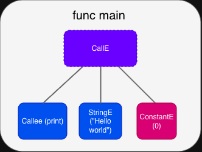

# **프로그래밍 언어 만들기**

컴파일러를 만들기 전에, 우리는 먼저 언어를 정의해야 합니다. 프로그래밍 언어는 단순히 구문으로 정의되는 것이 아닙니다. 사실 프로그래밍 언어는 인간과 컴퓨터 사이의 사용자 인터페이스입니다.

---

## **프로그래밍 언어란 무엇인가?**

추상화는 컴퓨터 과학의 핵심 개념 중 하나입니다. 추상화가 없다면, 컴퓨터로 무언가를 하기 위해서는 전기 신호, 메모리 레이아웃, 레지스터, 그리고 수많은 하드웨어의 특징을 고려해야 할 것입니다.

프로그래밍 언어는 이러한 복잡성을 단순화합니다. 그것은 아이디어를 표현하는 인간 친화적인 방법을 제공하면서, 그것들을 작동하게 만드는 low-level 메커니즘을 숨깁니다. 이런 의미에서, programming language는 **computing을 위한 UI**로 기능합니다—하드웨어를 수동으로 조작하는 대신, 로직, 애플리케이션, 그리고 시스템을 구축하는 데 집중할 수 있게 해주는 계층입니다.

Python, Rust, C++, Go, 또는 완전히 새로운 언어를 선택하든 목적은 동일합니다: 인간의 명령을 기계의 행동으로 바꾸는 것입니다.
먼저 프로그래밍 언어가 어떤 방식으로 디자인될 수 있는지 함께 살펴봅시다.

---

## **컴파일러(Compiled) vs 인터프리터(Interpreter)**

Programming language 구현은 종종 코드를 실행하는 방식에 따라 분류됩니다:

- **Compiled language**
- **Interpreted language**

컴파일 언어는 실행 전에 전체 소스 코드를 machine instruction으로 변환합니다. 일단 컴파일되면, 프로그램은 하드웨어에서 직접 실행될 수 있으며, 높은 성능과 효율적인 CPU 사용을 제공합니다.

반면에 인터프리터 언어는 코드를 단계별로 실행합니다. 인터프리터는 각 명령어를 읽고 즉시 수행하며, 독립적인 machine binary를 생성하지 않습니다.

간단한 비유를 해봅시다:

> 프랑스어로 작성된 요리책이 있다고 상상해보세요.
> 
- **인터프리터**를 사용하면, 요리책 한 줄을 읽고, 그것을 한국어로 번역한 다음, 번역된 내용대로 그대로 따릅니다. 그리고, 다음 한 줄을 또 읽고, 번역한 다음 그대로 하기를 또 반복합니다. 
- **컴파일러**를 사용하면, 프랑스어에 능통한 친구를 데려와 책을 끝까지 한국어로 번역한 다음 (이래서 마음씨 좋은 친구가 필요하겠지요?), 여러분은 한국어 책을 보며 멈추지 않고 원활하게 요리합니다.

컴파일 언어(C, C++, 또는 Rust 같은)는 일반적으로 속도, 안전성 분석, 그리고 최적화를 제공하지만, 코드가 변경되면 다시 컴파일 해야합니다. 인터프리터 언어(Python, Ruby, 또는 Perl 같은)는 편의성, 상호작용성, 그리고 유연성을 우선시합니다 (특히 초기 개발 단계에서 유용하지요) 하지만 "일반적으로" 더 느리게 실행됩니다. 이것이 C가 일반적으로 Python보다 빠른 이유입니다. C도 REPL(Read Eval Print Loop 의 약자로, 사용자와 곧바로 상호작용하면서 프로그램을 실행할 수 있는 환경)과 같은 환경을 가질 수 있지만, 잘 쓰이지 않고 표준 toolchain의 일부가 아닙니다.

**Language는 동시에 컴파일(Compiled) 되거나 인터프리트(Interpreted) 될 수 있습니다**

실제로, "컴파일 언어" 또는 "인터프리터 언어" 라는 것은 언어 자체의 속성이 아니며, 이러한 구분을 언어 자체보다는 언어 구현의 속성으로 보는 것이 더 정확합니다.

한 가지 예로, JVM(Java Virtual Machine 자바 가상머신) 기반 언어는 "compiled"와 "interpreted" 둘 다 될 수 있습니다. 즉, runtime에 Just-In-Time compiler를 사용하여 즉석에서 기계어로 컴파일되거나, 실행 (interpret) 될 수 있습니다. 일반적으로 Java(또는 다른 JVM 기반 언어) 프로그램은 먼저 "bytecode"라고 불리는 것으로 compile됩니다. 이것은 JVM을 위한 instruction이지만, 하드웨어의 종류에 영향을 받지 않습니다. 이 bytecode는 JVM이 실행되는 어디든 배포될 수 있으며, target 특정 코드로 컴파일하거나 bytecode를 실행하는 것은 JVM의 구현 방식에 따라 달라집니다.

Python 또한 종종 인터프리터 언어로 설명되지만, 실제로는 소스 코드가 먼저 Python bytecode(.pyc 파일)로 컴파일된 다음, PVM(Python Virtual Machine)에 의해 실행됩니다. PyPy와 같은 일부 파이썬 구현은 JVM이 하는 것처럼 Python을 기계어로 컴파일할 수도 있습니다.

---

## **Managed vs. Unmanaged**

프로그래밍 언어의 특성을 구분하는 또 다른 유용한 방법은 메모리를 관리하는 방식입니다.

프로그램이 실행되려면 메모리가 필요합니다. 프로그램은 운영 체제로부터 메모리를 요청하고 완료되면 반환해야 합니다. 그렇게 하지 않으면 문제가 발생합니다:

- 프로그램이 소유하지 않은 메모리에 접근할 때 **Segmentation fault**
- 사용하지 않는 메모리가 절대 반환되지 않을 때 **Memory leak**

**Managed language**는 메모리 처리를 자동화하며, 종종 garbage collection이나 runtime 분석을 사용합니다. 이것은 메모리 관련 실수의 가능성을 줄이고 개발을 단순화합니다. 그들은 일반적으로 "Garbage Collector (GC)"라고 불리는 프로그램을 사용하는데, GC는 자동으로 도달할 수 없는 메모리 영역을 감지하고 해제하므로, 운영 체제가 다른 프로그램(process)을 위해 그 메모리를 할당할 수 있습니다. 일부 garbage collector는 특정 단계에서 전체 프로그램을 중지할 수 있지만(stop-the-world), 현대의 collector들은 다양한 기법들을 사용하여 긴 일시 중지를 줄이거나 피합니다. Garbage collector는 편리하지만 프로그램을 더 느리게 만들 수 있다는 단점이 있습니다.

Managed programming language 예시 (Python)

```python
# my_list is internally allocated
size = input()

# Python internally allocates memory space for storing list.
my_list = [x for x in range(0, int(size))]

# Do some work using my_list
# my_list is automatically deallocated after use
```

**Unmanaged language** (C/C++)는 개발자에게 직접적인 제어권을 줍니다. 그들은 malloc과 free와 같은 API를 제공하며, 이것은 궁극적으로 lower-level system call을 통해 운영 체제로부터 메모리를 요청합니다. 프로그래머는 메모리가 올바르게 할당되고 해제되는지 확인하고, 잘못되지 않도록 직접 관리해야 합니다. Unmanaged language는 garbage collector에 의존하지 않기 때문에, stop-the-world event(GC를 돌리기 위해 프로그램을 일시정지 하는 것) 와 같은 GC 관련 일시 중지를 피하지만, 정확성과 안전성의 책임을 프로그래머에게로 넘깁니다. 프로그래머가 언제 메모리를 할당하고 해제할지 수동으로 최적화할 수 있기 때문에 더 많은 최적화를 진행할 수도 있죠. 하지만 이것을 프로그래머가 직접 관리해야 하므로, 프로그램을 더 복잡하게 만들고, 깨지기 쉽게 만듭니다. (Rust는 garbage collection 없이 메모리 안전성을 달성하기 위해 컴파일러가 강제하는 정적 ownership 및 borrowing 시스템을 사용합니다.)

Unmanaged programming language 예시 (C)

```c
#include <stdio.h>
#include <stdlib.h>

int main(){
  int size;
  scanf("%d", &size);
  
  // Explicitly allocate aray
  int* my_list = malloc(size * sizeof(int));
  for(int i = 0; i < size; ++i){
	  my_list[i] = i;
	}
	
	// Do some work with my_list
	
	// my_list has to be explicitly freed, or memory would leak.
	free(my_list);
	return 0;
}
```

---

## 함수형 프로그래밍 (Functional Programming)

마지막으로, 프로그래밍 언어의 또 다른 패러다임 중 하나인 함수형 프로그래밍에 관해 간단히 소개하고자 합니다. 일반적인 언어보다는 조금 덜 사용되지만, 그만큼 장점이 많은 프로그래밍 패러다임이기 때문에 소개하고자 합니다. 함수형 프로그래밍을 하면 훨씬 버그를 적게 발생시키는 프로그램을 작성할 수 있거든요. 여러분이 함수형 프로그래밍을 실제로 하고 있지 않더라도, 프로그래머로써 알아두면 더 안정적인 프로그램을 만드는 데 도움이 됩니다. 

함수형 프로그래밍 언어는 프로그램을 수학적인 함수로 구성함으로써 함수의 순수성, 값의 불변성, 그리고 함수들이 합성되는 방식을 강조하는 프로그래밍 언어입니다. 함수형 언어는 computation이 표현식(expression)의 평가(evaluation)로 표현됩니다. 우리가 수학에서 정의하는 함수는, 입력이 같을 경우 결과가 절대 달라질 수 없지요? 함수형 프로그래밍에서는 이 사고방식을 따릅니다.

다음은 list의 모든 숫자를 더하는 간단한 예시입니다

Python으로 list의 값들을 모두 더하는 예시
```python
my_list = [1,2,3,4,5]

sum = 0
for elem in my_list:
  sum += elem
print(f"Sum : {sum}") # Prints "Sum : 15"
```

함수형 언어의 예시 (F#)

```fsharp
let my_list = [1;2;3;4;5]
let sum = List.fold (fun acc elem -> acc + elem) 0 my_list
printfn "Sum : %A" sum // Prints "Sum : 15"
```

둘 다 같은 일을 하지만, 작성되는 방식이 조금 다르지요?

Pure functional language는 다른 언어들이 갖지 않는 제약사항이 있습니다.

1. 모든 값(let binding)은 불변 (immutable) 입니다.
2. for loop가 없습니다 (모든 iteration은 recursion으로 수행됩니다)
    1. 그러나, compiler는 함수가 "tail-recursive"이면 최적화를 위해 recursion을 loop로 변환할 수 있습니다 (이것에 대해서는 나중에 더 설명하겠습니다)
    2. 순수 함수형 언어가 아닌 함수형을 지향하는 멀티 패러다임(multi-paradigm) 언어들은, for loop을 제공하기도 합니다.
3. 함수가 "순수(Pure)" 합니다
    1. "순수(Pure)"하다는 것은 함수가 프로그래머가 모르는 side-effect가 들어있는 동작을 하지 않는다는 것을 의미합니다.
        - Side-effect라 함은, 겉으로 들어나지 않는 내부적인 동작을 의미합니다 예를 들면 파일 입출력 등이 있지요.
    2. Side-effect가 없으므로, 결과가 사용되지 않으면 함수를 제거해도 안전합니다 (Compiler는 더 공격적으로 dead code elimination을 할 수 있습니다)
    3. Function은 동일한 입력이 주어지면 항상 같은 결과를 제공합니다

Functional programming language는 일반적으로 더 가파른 학습 곡선을 가지며, 많은 프로그래머들이 functional language에 익숙하지 않습니다. 그러나 몇 가지 명확한 장점이 있습니다.

**함수형 프로그래밍의 장점**

1. Side-effect가 없기 때문에, 프로그램이 더 안전하고, 안정성 분석이 쉽습니다.
2. 컴파일러가 잠재적인 오류를 감지하기 쉽게 만듭니다.
3. 프로그램을 더 명확하게 표현할 수 있습니다. 실행 자체보다 "무엇을 계산할지"에 초점을 맞춥니다. (조금 잘 안 와닿을 수 있지만, 함수형 언어의 구현들을 보면 보다 쉽게 이해하실 겁니다)
4. Purity(순수 함수)와 immutability(값의 불변성)는 안전한 concurrent 프로그램을 작성하기 쉽게 만듭니다.

위에 나열된 이유들을 모두 설명하는 것은 이 장의 범위를 벗어나지만, programming language를 만들어가다 보면, 왜 이러한 문제가 중요한지, 그리고 함수형 언어가 일반적인 프로그래밍 언어와 비교해 가지는 장점들을 이해할 수 있을 것입니다.
물론, 함수형 언어는 만능 해결책이 아닙니다. 특정 작업, 특히 복잡한 side effect가 필요하거나, 성능이 중요한 작업의 경우, 함수형 스타일로 만들지 않는 것이 더 자연스럽거나 효율적일 수 있습니다.

---

## Programming language를 만들어봅시다!

그래서, 우리는 어떤 종류의 언어를 만들게 될까요?

우리는 GC를 사용하지 않는 (즉 컴파일러나 사용자가 메모리를 관리하는), 함수형 스타일 (100% 함수형으로는 만들지 않을 것입니다) 언어와, 컴파일러를 만들 것입니다. 하지만 우리는 ownership control(Rust처럼!)을 구현할 것이므로 프로그래머가 데이터의 lifetime을 수동으로 관리할 필요가 없습니다. 왜 이렇게 하냐고요? Compiler 자체에 집중하기 더욱 쉽고(interpreter나 garbage collector를 만들 필요가 없습니다!), 그리고 이미 interpreter를 구현하는 것에 대해서는 좋은 글들이 많기 때문에, 여기서는 컴파일러에 더 집중해 보고자 합니다.

**왜 함수형 언어인가?**

함수형 언어는 대부분의 사람들에게 배우기 더 어렵고, 많은 프로그래머들이 익숙하지 않은 유형의 언어입니다. 그런데 왜 함수형 언어를 만들고자 할까요? 첫째, language designer의 관점에서, 정의하기 더 쉽고 명확합니다. 둘째, 대부분의 프로그래머들이 함수형 프로그래밍에 익숙하지 않기 때문에, 함수형 프로그래밍에 대해 소개해주고 싶었습니다. 우리는 그것이 일반적인 프로그래밍 언어와 어떻게 다르게 행동하는지 보고, 어떤 장점과 단점이 있는지 볼 것입니다. 그러나, 함수형 언어를 만들지 않더라도 여기서 설명된 개념들을 이용하면 도움이 될 것입니다.

---

## Hoya Language.

우리의 언어는 "Hoya"라고 이름을 붙여 보았습니다. 이 글의 나머지 부분은 Hoya를 구현하는 것을 중심으로 진행될 것입니다. 하지만  키보드를 치기 전에, 먼저 Hoya가 어떻게 생겼는지 살펴봐야겠지요? 만들기 전에, 먼저 우리가 뭘 만들지 정의하고 시작합시다.

### Hello world!

Hoya가 "Hello world!"를 출력하게 해 봅시다. 다음은 Hoya language의 가장 간단한 예시입니다.

```go
func main(){
  print("Hello world!")
  0
}
```

이 프로그램은 간단한 트리(tree) 형태로 표현해볼 수 있습니다.



이것은 우리의 프로그램이 어떻게 보이는지입니다 (접미사 "E"는 "Expression"을 나타냅니다).

`CallE` (call expression)는 세 개의 자식으로 구성됩니다. 첫 번째는 callee(호출되는 함수)를 나타냅니다. 두 번째는 인수인 "Hello world"이며, string을 나타냅니다. 마지막은 `NextE`이며, 실행할 다음 expression을 나타냅니다. 여기서, 다음 expression은 상수 0입니다.

프로그램을 tree와 같은 형식으로 표현함으로써, 컴파일러나 인터프리터는 그것을 순회하고 컴파일하거나 실행할 수 있습니다. 이러한 종류의 트리를 AST(Abstract Syntax Tree의 약자)라고 합니다. 프로그램—컴퓨터의 관점에서는 단순한 문자열을 AST로 변환하는 것은 일반적으로 compiler가 수행하는 첫 번째 과정입니다. 프로그램이 AST로 변환되면, 컴파일러가 기계어로 번역하거나, 인터프리터로 직접 실행할 시작할 수 있습니다.

다음 장부터, Hoya의 모든 부분을 설계하기 시작할 것입니다. 언어가 어떻게 정의될 수 있는지, 그리고 각 표현식(expression) 이 평가될 때 동작을 어떻게 정의하는지 살펴봅시다.
