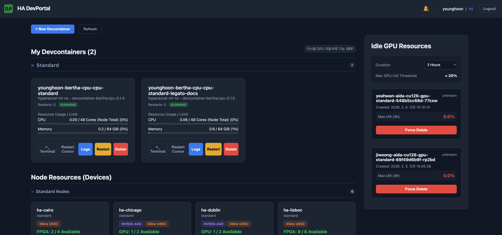
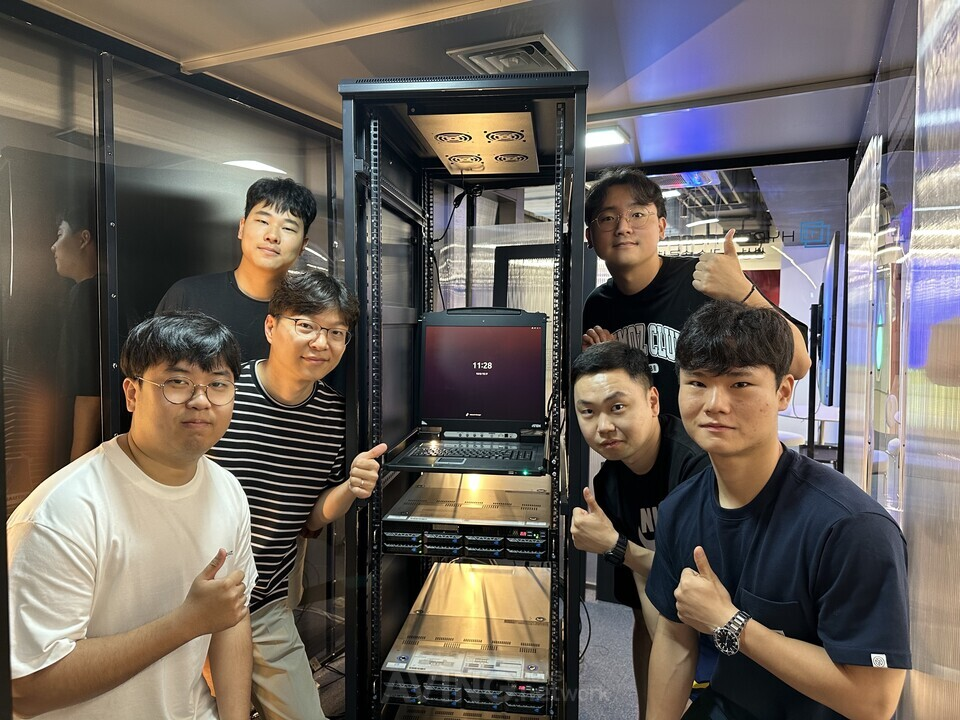
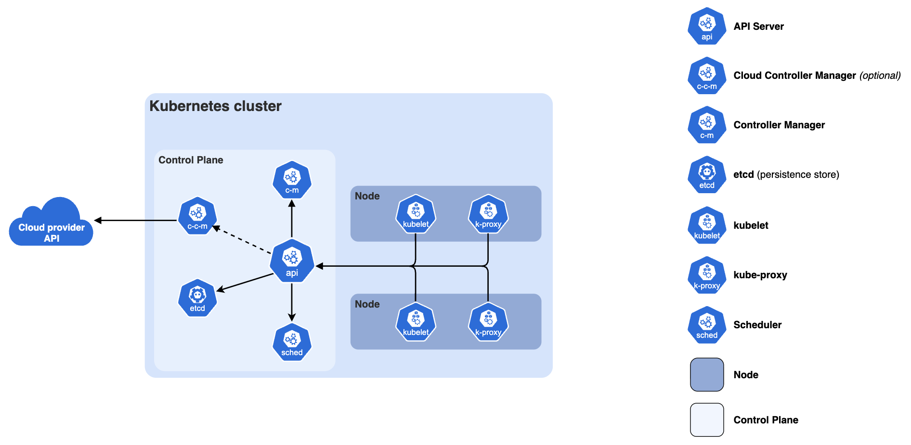
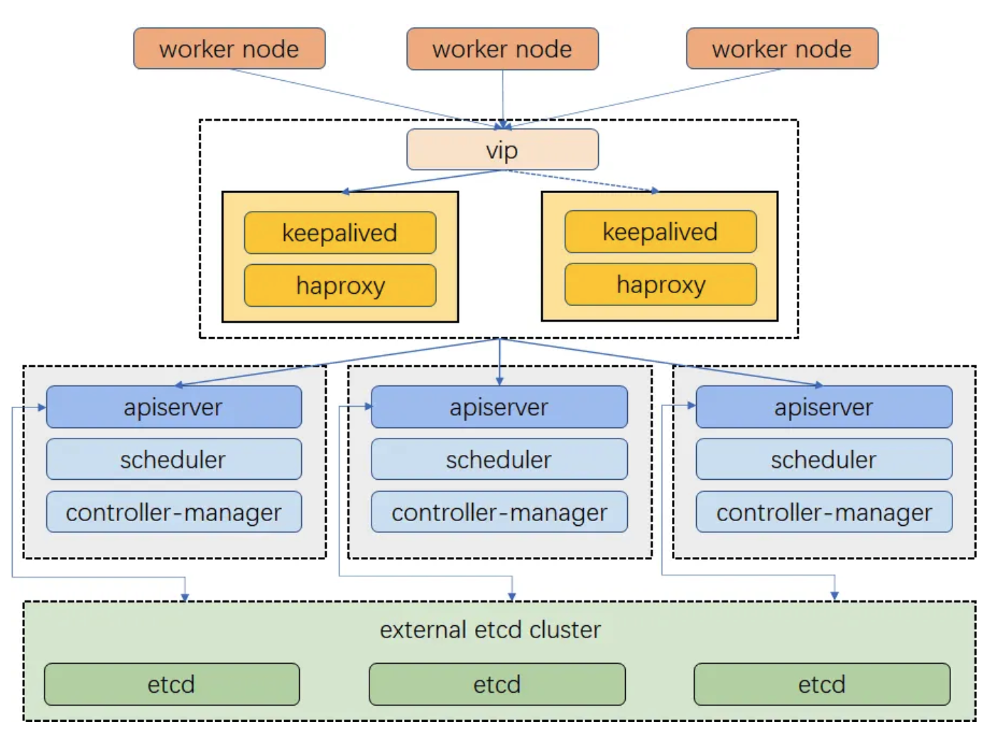

# Building an Internal Development Environment with Kubernetes Chapter 1: Why Kubernetes?

Hello! I'm Younghoon Jun, a DevOps Engineer on the ML team at HyperAccel.

For those of you reading this, what kind of environment do you develop in? I imagine you're working in various environments—local setups, direct server access, cloud services, and more.

The HyperAccel SW group develops on an environment built on top of a Kubernetes cluster. We spin up Pods based on `devcontainers` pre-configured with the packages needed for development, then connect to the container to do our work. To make things easier for our internal developers, we've created and provided a `devcontainer portal`.

Through this portal, you can easily perform container-related operations such as creating and deleting containers, checking error logs, and monitoring available resources across Kubernetes cluster nodes.

We're incredibly grateful that our SW group developers have been actively using it. However, we didn't always develop in a Kubernetes environment. In this **Building an Internal Development Environment with Kubernetes** series, we want to share our journey of building a Kubernetes-based development environment to address developer pain points and provide an efficient development process. In this first post of the series, we'll cover the limitations of our previous development environment before Kubernetes and the path that led us to adopt it.

---

## Before Container-Based Development

HyperAccel is a startup that began small, founded by members of KAIST's [CAST Lab](https://castlab.kaist.ac.kr/).

Given the nature of an early-stage startup, development moved at an incredibly fast pace, making it difficult to establish a systematic development environment. Since this was before I joined HyperAccel, I learned about the development environment at that time through conversations with Hyunjun Park ([Author](https://hyper-accel.github.io/authors/hyunjun-park/), [LinkedIn](https://www.linkedin.com/in/hyunjun-park-14b8352a2/)), one of our founding members on the ML team.

> Back then, we were a really small team of about 10 people, and we couldn't pay much attention to the development environment while trying to meet our goals within tight deadlines. Everyone created their own accounts on the company servers and logged in to use them. If someone was using too many resources, you'd just walk over to their desk and ask when they'd be done. (laughs)

Let's take a closer look at the challenges that arise when there's no shared development environment.

### Server Management Challenges
If you have 10 servers and 10 developers, you need a total of **100 accounts** for everyone to access all servers. Of course, you might think account creation isn't that difficult if you use automation scripts. However, developing in this environment makes it extremely hard for developers to track whether their work is in sync across different servers. (Even with GitHub, it's very inconvenient.)

Security and server stability are also concerns. For example, you need additional policies for granting `sudo` privileges. Furthermore, if a server gets damaged due to a mistake during development (think of drastic examples like `sudo rm -rf /`...), there's a cost to recovery.

### Package Version Consistency Challenges
When multiple people are working on code together, integrating everyone's work is essential. If everyone develops in their own isolated environment, version conflicts can arise during integration. You might run into Torch version conflicts, Clang version mismatches, and so on. This is where everyone starts claiming **"It Works on my Machine."**

### Resource Usage Challenges
HyperAccel's [first-generation chip](https://aws.amazon.com/ko/blogs/tech/hyperaccel-fpga-on-aws/) was built on FPGA. Since FPGA servers are connected in a ring topology, to use them in complete isolation within a server, you had to either use just one server or all of them. This structure made it difficult for multiple developers to use them simultaneously. (Currently, this works smoothly on our Kubernetes environment. We'll cover this in detail in a future post on Kubernetes Device Plugins.)

Additionally, for GPUs, checking availability required running commands like `nvidia-smi` to see running processes or manually checking a dashboard—quite inconvenient.

---

## Introducing Devcontainers

As the company grew and the number of developers increased, we needed a more systematic development environment. To address this, Minho Park ([Author](https://hyper-accel.github.io/authors/minho-park/), [LinkedIn](https://www.linkedin.com/in/minho-park-804a56142/)), the ML team lead, built `HyperAccel-Devcontainer`, a containerized development environment (which we'll refer to as `devcontainer` in this post for convenience).

The `devcontainer` comes in two versions. The first is for development and management of HyperAccel's first-generation chip, and the second is for developing HyperAccel's second-generation ASIC chip. Both versions are built on top of a `base-image` that provides packages and environments common to both. Each version then adds its own specific packages and configurations on top of this foundation.

Providing a container-based development environment has the advantage that **all developers work in the same environment**. No more **"It Works on my Machine."** Also, since development happens in an isolated environment, we can largely avoid situations where a server gets damaged due to individual mistakes.

However, this container-based development environment still had clear limitations.

### Individual Server Accounts Still Required

We still needed to provide individual server access accounts. From a developer's perspective, development depended on having a server account, and from an administrator's perspective, account management became another task whenever team membership changed. Additionally, since individuals had server access, the possibility of server damage from mistakes still existed.

### Lack of Development Environment Flexibility

First, developers still needed to manage their own directories on each server, so they remained tied to the server environment. If a specific server went down, developers using that server might face work disruptions if they didn't have backups and couldn't track their work. Since we also use servers at external IDCs, if an administrator had to travel to fix a server, work could be delayed even longer.

Additionally, developers need time and effort to learn how to use the container environment. From basic container knowledge to execution procedures and precautions, this can be challenging for developers who aren't familiar with DevOps.

### Unresolved Resource Usage Challenges

FPGA and GPU usage still had constraints. The issues mentioned earlier could still occur in the container environment.

To overcome these limitations and provide a more comfortable development environment, we decided to adopt Kubernetes.

---

## Adopting Kubernetes-Based Devcontainer Development Environment

If you've read this far, you might be wondering:

> *"What exactly is Kubernetes, and why should we use it?"*

Before diving into the Kubernetes-based development environment, let me introduce what Kubernetes is and the benefits of building a development environment on top of it.

### Container Orchestration

Kubernetes is a **Container Orchestration Tool**. It's an open-source platform that makes it easy to deploy and scale containers quickly while automating their management. Beyond being a simple container platform, it aims to be a microservices and cloud platform, serving as a vessel that can easily hold and manage everything built with containers. To put it in one sentence:

> *A tool that codifies and automates complex infrastructure operations, allowing anyone to consistently deploy, scale, and operate services*

Let me explain the concept of **Container Orchestration** a bit more. In a container-based environment, services are delivered to users in the form of containers. If the number of containers to manage is small, one person can handle issues. But as the organization scales, one person handling all issues becomes impossible. Large-scale environments require operational techniques like:

- **Monitoring** systems that continuously check whether all services are running normally
- **Scheduling**, **load balancing**, and **scaling** to prevent work from piling up on specific clusters or containers

**Container Orchestration** is a system that provides features to make managing and operating numerous containers a bit easier and more automated.

---

### About Kubernetes

So far, we've looked at what Kubernetes and Container Orchestration are. Next, let's briefly explore Kubernetes components. The diagram below shows an overview of the essential components that make up a Kubernetes cluster.

A Kubernetes cluster consists of a Control Plane and one or more Worker Nodes.

#### Control Plane Components

These manage the overall state of the Kubernetes cluster.

- `kube-apiserver`

  - The core server component that exposes the Kubernetes HTTP API

- `etcd`

  - A consistent and highly available key-value store for all API server data

- `kube-scheduler`

  - Finds pods not assigned to nodes and assigns them to appropriate nodes

- `kube-controller-manager`

  - Runs controllers to implement Kubernetes API behavior

#### Worker Node Components

These run on every node, maintaining running pods and providing the Kubernetes runtime environment.

- `kubelet`

  - The node agent that ensures pods and their containers are running

- `kube-proxy` (Optional)

  - Maintains network rules on nodes to implement services

- `container-runtime`

  - Software responsible for running containers

We've now looked at Kubernetes and its role at the cluster level. So why did we choose Kubernetes for our internal development environment? Next, I'll explain our reasoning based on the advantages of managing a development environment as a Kubernetes cluster.

---

### Advantages of a Kubernetes-Based Development Environment

What advantages do you get from providing a development environment based on Kubernetes? Let me explain, focusing on how we overcame the limitations of the container-based development environment mentioned earlier.

#### Fully Isolated Development Environment

With the Kubernetes cluster in place, developers no longer need to access servers directly. Developers simply run their `devcontainer` in the Kubernetes environment and connect to the container to develop! Infrastructure concerns like node selection and resource management are all handled at the cluster level.

Additionally, you can specify node usage policies at the cluster level to control user access permissions and resource usage. By separating nodes within the cluster by purpose, many pain points for users are eliminated, and abnormal resource usage can be controlled to prevent node downtime.

#### Flexible Development Environment Operations

Development environments are no longer tied to specific nodes! Even if some nodes go down, pods can be scheduled to other nodes within the cluster. Developer home directories are provided via NFS provisioner on NAS, so you can confidently continue development on a pod running on a different node.

Additionally, since we provide a `portal` interface to users (which I'll explain in detail below), once users are granted cluster access, they can start using it with no initial learning curve.

#### Easy Resource Management

Custom resources like FPGAs and GPUs can be used exclusively at the container level. Kubernetes treats any resources beyond CPU and Memory as custom resources. To use these resources in Kubernetes, you need `Device Plugins`.

Our cluster currently has `Device Plugins` configured, and by allocating these resources to containers, you can use them in isolation without interference from other containers.

---

### Building the Kubernetes Cluster and Introducing the Development Environment

> *In the end, we built a Kubernetes cluster and introduced our internal development environment based on it!!*

Let me briefly introduce some of the components currently applied to our Kubernetes cluster that aim to enhance development environment convenience.

- High Availability

  - If you maintain only one Control Plane in Kubernetes, you have a SPOF (Single Point of Failure). If the cluster goes down, all developer work stops—a disaster. To prevent this, we designated 3 nodes as Control Plane and applied `KeepAlived` and `HAProxy` so that even if a specific node goes down, the cluster continues to operate normally.

    

- Storage Management

  - For management convenience and minimizing network latency, we introduced `Rook-Ceph` and `Harbor` to operate an internal OCI Registry.
  - We introduced `Nexus` to provide an internal PyPi server environment.

- CI/CD Enhancement

  - When running CI/CD in the GitHub environment, we previously ran GitHub Action Runners directly on compute nodes. With the Kubernetes cluster in place, we introduced `ARC (Actions Runner Controller)` for more stable runner execution.

    

  - We introduced `Vault` for centralized secret management and to improve developer access to secrets.

- Portal Provision

  - We provide the [Devcontainer Portal](#devcontainer-portal-image) to our developers. Before providing the Portal, we used `Makefile` and `.env` files to run pods. This approach caused initial entry barriers and inconvenience for users. To solve this, we applied a GUI approach through the Portal, and the required specifications are provided using `go-template` and `ConfigMap`. Developers can now easily launch development environment infrastructure, and monitoring makes log checking convenient, creating an environment where developers can focus more on development.

During my master's program, I researched scheduling for efficient GPU usage in distributed training environments. I modified the Kubernetes scheduler directly for my research, but only used limited Kubernetes features. Through this project, I gained valuable experience going through the entire process from cluster setup to operation.

Building a Kubernetes cluster for the development environment and figuring out how to increase productivity and convenience for our internal developers was challenging, but it was truly rewarding and enjoyable.

## In Summary...

In this post, we covered the first topic in the **Building an Internal Development Environment with Kubernetes** series: the limitations of our previous development environment and the motivation and process for adopting Kubernetes.

We provided a container-based environment for isolated development under common conditions and adopted Kubernetes to manage it.
From the *developer's perspective*, infrastructure concerns are minimized, allowing them to focus comfortably on development. From the *administrator's perspective*, the environment can be stably managed and issues addressed even as scale increases, greatly improving work efficiency.

In upcoming posts in this series, we'll introduce what frameworks we've added to the Kubernetes cluster to enhance the development environment and boost productivity!

Furthermore, our ML team is developing a software stack to support using HyperAccel's upcoming ASIC chip on Kubernetes.
Kubernetes plays an important role as the foundational infrastructure for LLM (Large Language Model) Serving, one of the most prominent technologies today.
We'll share more about this topic in future posts!

Thank you for your continued interest in our upcoming articles, and thank you for reading to the end!

---

## P.S.: HyperAccel is Hiring!

HyperAccel is a company working on HW, SW, and AI to launch an LLM acceleration ASIC chip. We have talented people across all areas, and in this environment, we're learning broadly (and deeply!) beyond just one domain, sharing knowledge, and growing together at a rapid pace!

The **DevOps team within our ML team** provides development environments and management to boost internal developer productivity, and develops software stacks to effectively support LPU chip utilization at the cloud level.

If you're interested in the technologies we work with at HyperAccel, please apply at [HyperAccel Career](https://hyperaccel.career.greetinghr.com/ko/guide)!

## Reference

- [Kubernetes Docs](https://kubernetes.io/docs/home/)
- [What is Kubernetes?](https://www.mirantis.com/cloud-native-concepts/getting-started-with-kubernetes/what-is-kubernetes/)
- [Why Kubernetes?](https://mlops-for-all.github.io/docs/introduction/why_kubernetes/)
- [HyperAccel Builds High-Efficiency LLM Inference Service with LPU Based on Amazon EC2 F2 Instance](https://aws.amazon.com/ko/blogs/tech/hyperaccel-fpga-on-aws/)
- [Hyperdex Toolchain Software Stack](https://docs.hyperaccel.ai/1.5.2/)
- [Actions Runner Controller](https://docs.github.com/en/actions/concepts/runners/actions-runner-controller)

