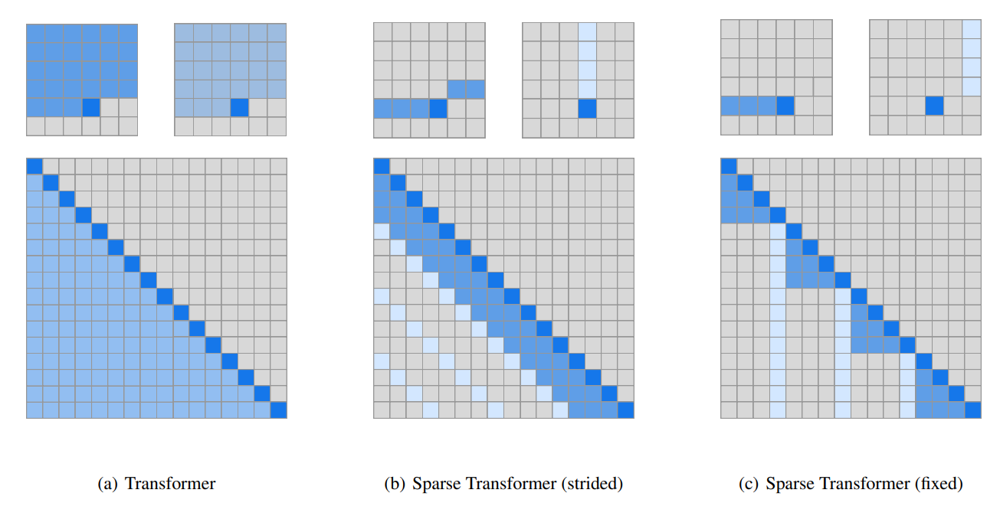
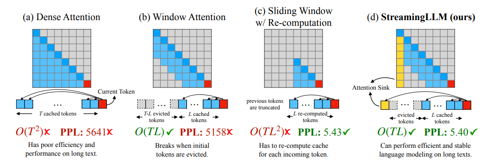
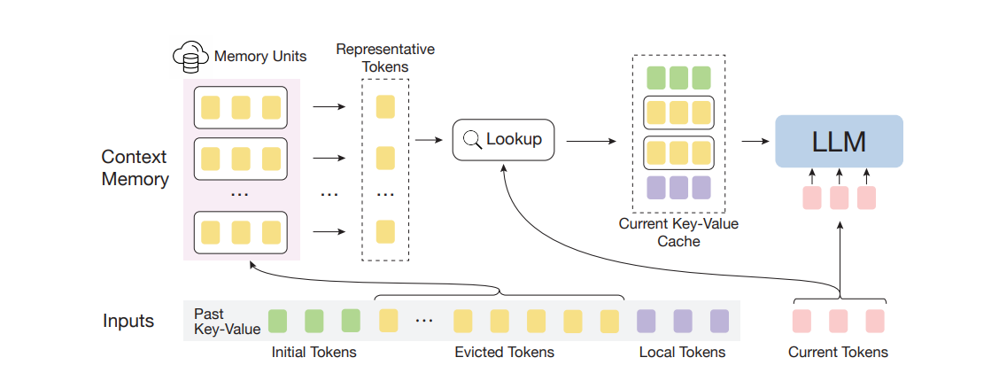
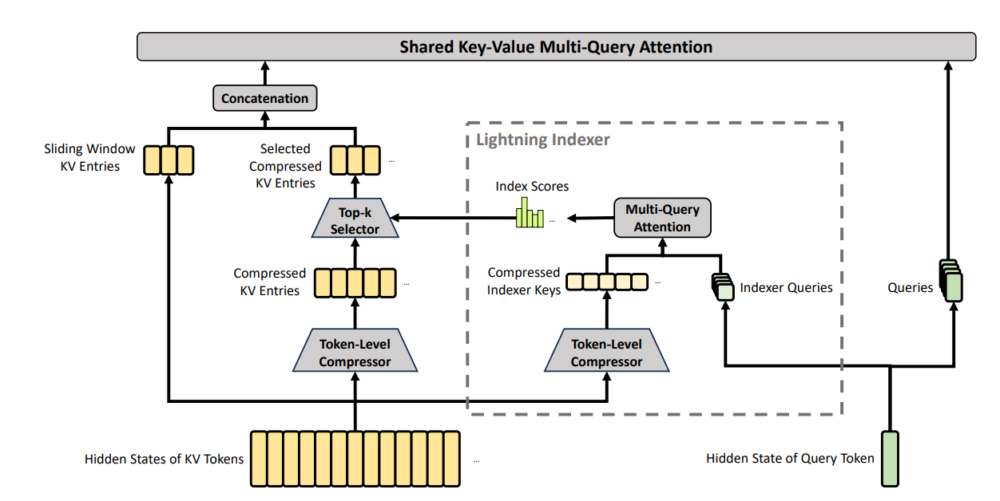
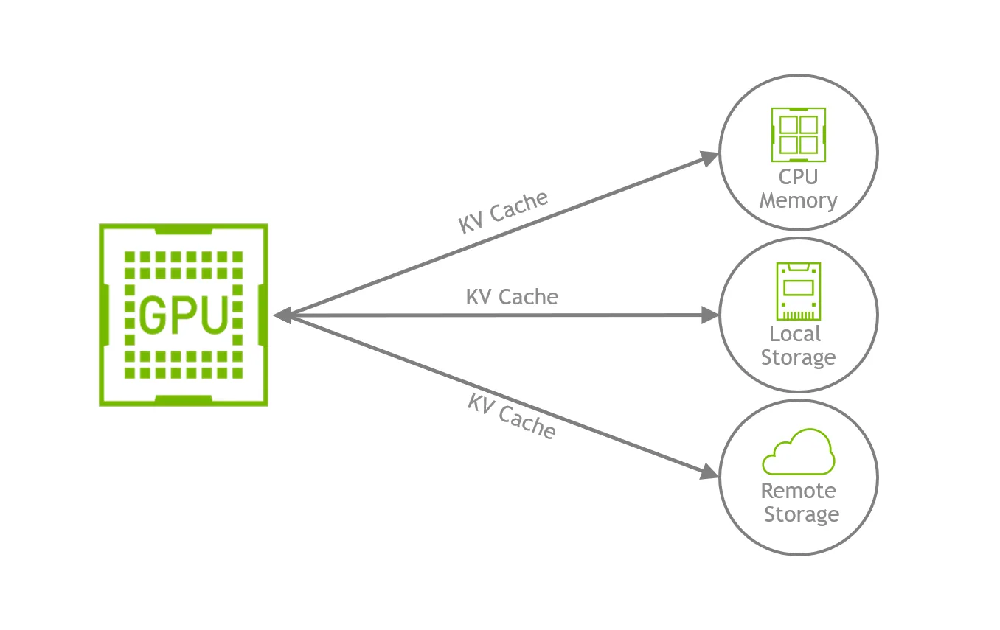
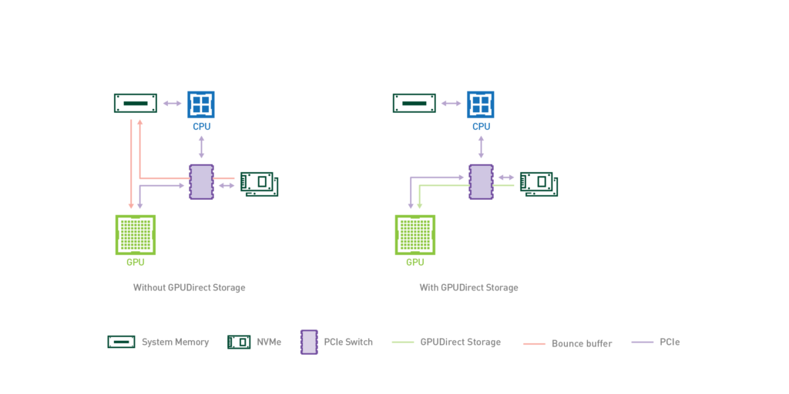
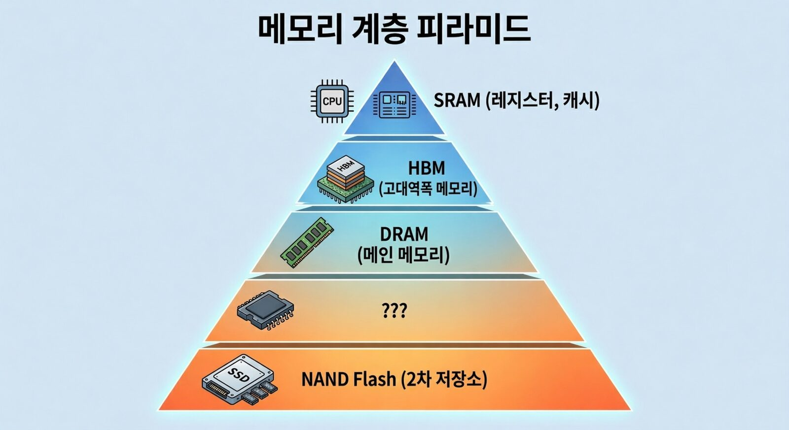
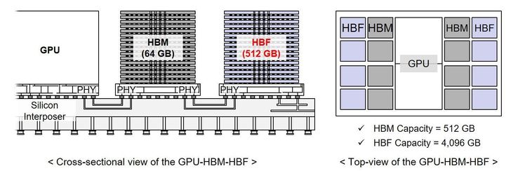

> 이 글은 **AI 시대의 필수 소비재, 메모리 이해하기** 시리즈의 3편입니다.  
> [2편](https://hyper-accel.github.io/posts/hbf-workload/) 에서는 HBF가 효과적으로 쓰일 수 있는 자리들(CAG, H³, 그리고 그 너머의 후보 워크로드들)을 정리했습니다.  
> 이번 편에서는 HBF가 마주해야 할 새로운 워크로드들과 HBF 상용화를 위해 필요한 과제들에 대해 알아보겠습니다.

<!-- 그림 #1: 커버 이미지 (cover.jpg) -->

## 들어가며

안녕하세요. HyperAccel DV팀 임재원입니다.

지난 2편의 결론을 한 문장으로 요약하면 다음과 같습니다. 
> **워크로드를 잘 고르면 HBF의 약점은 숨길 수 있다.** 

HBF가 가진 약점과 이를 극복할 수 있는 워크로드의 조건, 그리고 활용 예시인 SK하이닉스의 H³와 조지아텍의 HAVEN과 같은 아이디어들을 살펴보았습니다.

하지만 이는 HBF의 약점을 숨길 수 있는 방법이지 완전히 극복할 수 있는 방법은 아닙니다. 여러 가지 가정이 충족된 workload에서 이룰 수 있는 조건부 아이디어입니다. LLM 워크로드가 HBF를 많이 필요로 하지 않는 방향으로 발전한다면 기술이 발전한다고 하더라도 수요는 크지 않을 것입니다.
아울러 HBF의 약점은 NAND Flash 자체의 약점이기도 합니다. HBF는 HBM의 용량 한계를 극복하기 위해 제안되었습니다. 하지만 HBF가 Flash를 기반으로 만들어진 대안인 만큼, LLM에서 Flash memory가 현재 어떻게 사용되는지 확인이 필요합니다. 이것이 선행되어야 HBF가 기존 Flash memory와 어떤 차별점을 갖는지 알 수 있기 때문입니다.

이번 편에서는 최신 LLM workload의 추세에 대해 알아보고 Flash memory(SSD)가 LLM 서빙 환경에서 어떻게 사용되는지 살펴본 뒤 HBF가 상용화되기 위해 풀어야 할 과제들을 알아보겠습니다. 

---

## 최신 LLM 워크로드 살펴보기

지난 편에서 알아본 HBF의 단점을 숨길 수 있는 워크로드의 조건 중 하나는 **워크로드가 deterministic 하다면 prefetch로 숨길 수 있다.** H³의 실험도 정확히 이 가정 위에 서 있습니다. 다음 layer가 어떤 weight와 KV cache를 읽을지 미리 알 수 있다는 전제입니다.

하지만 최근 frontier 모델들의 개발 방식은 이 전제를 조금 흔들고 있습니다.

### Sparse attention: KV cache의 일부만 연산에 활용하기

Transformer model의 가장 중요한 연산인 attention mechanism의 가장 큰 문제는 입력 길이에 따라 연산량이 quadratic하게 증가한다는 것입니다. 이를 극복하기 위해 **Mamba** 와 같은 linear attention도 연구되고 있지만, Transformer에 비해서는 성능 한계가 뚜렷하여 기존의 full attention과 mamba를 hybrid 형태로 사용하는 방식으로서만 사용되고 있습니다.

때문에 최근 프론티어 연구들은 full attention의 연산량을 줄이기 위해 현재까지 입력된 token으로 만들어진 Key-Value 중 실제 연산에는 일부만 사용하거나 이를 압축한 데이터를 사용하여 연산량과 메모리 통신량을 줄이는 방법을 보여주고 있습니다. Attention mechanism은 근본적으로 모든 단어간의 맥락을 통해 다음 토큰을 예측하지만, 실제로 중요한 토큰은 일부만 필요하다는 주장에서 비롯된 아이디어입니다. 이를 그림으로 나타내보면 아래와 같습니다.

KV cache 자체는 연산되고 메모리에 저장되어야 하기 때문에 KV cache를 저장할 용량은 여전히 필요합니다. 이로 인해 용량적인 측면에서는 HBF의 이점을 사용할 수 있습니다. 하지만 sparse attention의 종류에 따라 KV cache를 선택하는 알고리즘이 조금씩 다르며, KV cache를 읽는 패턴도 조금씩 달라집니다.

**StreamingLLM: Attention sink + sliding window attention**

비교적 단순한 형태의 **StreamingLLM** 은 특정 토큰이 처음 토큰과 현재 위치 기준으로 근접한 몇개의 토큰과의 attention만 연산합니다. 이 경우 기존의 attention 패턴과 유사하게 필요한 KV cache의 위치를 예측하는 것이 비교적 수월합니다.

하지만 이 경우 현재 위치한 토큰이 첫 토큰과 인접한 토큰과의 관계만을 파악하여 중간에 위치한 토큰과의 관계는 완전히 무시해버린다는 단점이 있습니다. 

**InfLLM & Quest: query-aware sparse attention**

이후에 나온 기법인 **InfLLM** 과 **Quest** 는 이를 보완하고자 조금 다른 방식을 사용합니다. 두 방식의 약간의 차이는 있지만 두 방식 모두 현재 처리 중인 토큰으로 만들어진 query와 저장된 KV cache 중 일부를 연산하여 필요한 Key-value의 idx를 계산합니다. 이후 구해진 idx에 해당하는 Key-value만을 사용하여 attention 연산을 진행합니다. 앞선 방식과 다른 점은 토큰에 따라 필요한 Key value의 위치가 달라지기 때문에 이를 미리 예측하는 것이 어렵다는 점입니다. 추가로 idx를 계산하기 위해 사용되는 Key들도 읽기 패턴이 불규칙합니다.

**Compressed Sparse Attention(CSA) & Heavily Compressed Attention(HCA): KV cache를 압축해서 저장하기**

가장 최근에 발표된 Deepseek-V4에서는 앞에서 설명한 selection 방식에서 더 나아가 전체 KV cache를 토큰 방향으로 압축합니다. 이를 통해 실제 attention 연산에 사용되는 KV cache를 줄일 수 있습니다. 압축하는 과정에서 전체 KV cache가 projection matrix를 한번 거치기 때문에 read가 최소 한번 일어나고 압축된 KV cache는 이후에도 반복적으로 재사용될 수 있습니다.

Sparse Attention과 같은 새로운 소프트웨어 기법의 등장은 HBF 적용 시 오히려 병목을 만들 수 있습니다. 읽어야할 주소를 찾는 것이 어려워지게 되면 prefetch를 사용할 경우 miss되는 비율이 올라가거나 불필요한 양의 데이터를 읽어와야 하는 일이 생길 수 있습니다. 이 경우 HBF의 성능을 제대로 발휘하기 어려워집니다. 소프트웨어 최적화를 통해 prefetch hint를 현재 사용한 attention 기법에 맞게 주거나 하드웨어를 고려한 모델 설계가 필요합니다.

흥미로운 점은 Deepseek에서 발표한 paper에서는 이렇게 만들어진 KV cache를 메모리에서 어떻게 관리할 것인가에 대한 고민도 담겨 있다는 것입니다. Deepseek은 모델 추론 서비스 과정에서 이 압축된 KV를 SSD storage에 보관하여 재사용의 이점을 살린다고 소개하고 있습니다. 이러한 방식의 메모리 맞춤형 최적화 방식은 Flash에 기반한 HBF의 활용시에도 큰 이점으로 작용할 것입니다.

그러면 자연스럽게 LLM 서빙에서 기존의 Flash 기반 SSD storage가 어떻게 사용되고 있는지 살펴보겠습니다.

---

## LLM 서비스 내에서의 SSD storage 활용처

이전 글에서도 이야기한 바와 같이 증가되는 KV cache size는 앞에서 말한 압축과 희소기법을 적용하더라도 GPU HBM에서 감당하기 힘든 문제입니다. 이로 인해 KV cache를 CPU memory나, 나아가 GPU 밖의 시스템 메모리까지 offloading하여 HBM의 용량 문제를 극복하기 위한 기법들이 많이 사용되고 있습니다. 특히 대용량의 이점을 활용할 수 있는 SSD를 효과적으로 사용하기 위한 기법들이 주목을 받는 추세입니다.

### 모델 로딩: Flash storage의 가장 기본적인 활용

가장 보편적인 SSD 사용 사례는 **모델 가중치의 보관과 로딩** 입니다. DRAM 기반 HBM은 휘발성이라 전원이 꺼지면 데이터가 사라지지만, NAND 기반 SSD는 비휘발성이기 때문에 학습이 끝난 모델 가중치를 지속적으로 보관하는 storage로 사용됩니다. 서비스가 기동될 때 SSD에 저장된 가중치를 읽어 GPU HBM에 로드하는 것이 기본적인 흐름입니다. 특히 여러 GPU 노드가 동일한 모델을 동시에 서빙하는 환경에서는 모든 노드가 접근 가능한 공유 SSD storage가 사실상 필수적입니다. 

### KV cache swapping: 비활성 세션은 낮은 티어의 메모리로

**vLLM** 과 같은 서빙 프레임워크는 GPU HBM의 KV cache 공간이 부족해질 때 **비활성 세션의 KV cache를 GPU 밖으로 swap-out** 합니다. 여러 명의 사용자를 처리하는 서비스 환경에서는 어느 시점에 어떤 세션이 활성화될지 미리 알 수 없습니다. 사용자가 한참 질문을 하다가도 언제 질문을 중단하거나 다시 시작할지 알기 힘들기 때문이죠. 이러한 경우 잠시 대기 중인 세션의 KV cache가 GPU memory를 계속 점유하게 되면 신규 요청을 받을 여력이 줄어듭니다. 비활성 세션의 KV cache를 CPU DRAM 풀로 swap하거나, context가 큰 세션의 KV cache는 SSD로 swap하는 것으로 이러한 문제를 해결할 수 있습니다.

### GPU memory 자체를 SSD로 확장하기: offloading과 GPU Direct Storage

여기서 한 발 더 나아가 **GPU가 사용하는 동적 메모리를 SSD로 확장하는** 시도들도 활발히 이루어지고 있습니다. GPU HBM, CPU DRAM, NVMe SSD를 하나의 통합된 메모리 계층으로 다루고, 사용자 환경과 상황에 따라 최적화된 저장소 위치를 파악하고 데이터를 할당하는 것입니다.

다만 이 접근의 본질적 한계는 데이터 경로에 있습니다. **SSD → CPU DRAM → GPU** 로 이어지는 긴 경로와 PCIe 대역폭에서 병목을 만들어 latency와 throughput이 크게 감소합니다. 

이 경로를 단축하기 위해 NVIDIA는 **GPU Direct Storage(GDS)** 기능을 제공합니다. GDS는 PCIe Peer-to-Peer DMA를 활용해 NVMe controller에서 GPU로 데이터를 write/read할 수 있습니다. 호스트 DRAM을 거치지 않으므로 CPU 메모리 대역폭 소비가 사라지고, PCIe 트래픽도 한 번으로 줄어듭니다. 

---

정리하면 SSD/Flash는 이미 LLM 서빙 스택의 각 계층에서 다양한 역할로 자리잡고 있고, HBM - DRAM - Flash를 하나의 통합된 메모리로서 관리하기 위한 다양한 최적화 기법이 개발되고 있습니다. 하지만 구조적인 한계도 엿볼 수 있습니다. Flash에서 GPU로 데이터를 운반하기 위해서는 구조적으로 PCIe를 활용해야 하는데, PCIe 대역폭이 HBM 대역폭에 비해 낮아 이 구간에서 피할 수 없는 병목이 발생하게 됩니다. SSD의 read latency와 운반 경로에서 더해지는 latency도 병목입니다.

1편에서 다뤘던 메모리 계층 피라미드를 다시 살펴보겠습니다. HBF가 노리고 있는 자리는 **DRAM과 SSD 사이의 자리** 입니다. GPU 패키지 가까이에 배치해 access latency를 줄이고, HBM처럼 적층 + 광대역 인터페이스를 사용해 단일 디바이스의 대역폭을 SSD 대비 수십 배 수준으로 끌어올려서 SSD의 두 가지 구조적 약점(거리와 대역폭)을 device 레벨에서 동시에 보완하려는 접근입니다. 만약 이 그림이 실현된다면, 앞서 살펴본 SSD를 활용한 접근법의 문제 상당수가 device 단에서 해소될 수 있습니다.

문제는 이 청사진이 실현되기 위해 HBF가 NAND 본연의 약점들을 풀어내야 한다는 데 있습니다. 지난 글에서는 NAND의 치명적인 latency 문제와 이를 우회할 수 있는 방안들을 살펴보았습니다. 하지만 latency 외에도 해결해야 할 문제는 아직 있습니다. 이어지는 섹션에서 이에 대해 알아보겠습니다. 

---

## 현실적인 문제와 HBF의 남은 과제

### GPU / DRAM 수명과 NAND 수명의 mismatch

가장 큰 문제는 NAND의 수명이 일정하지 않고 사용 패턴에 의해 가변적이라는 점입니다. 현재 AI 데이터센터에서 SSD를 활용하는 방식은 write가 드물어 SSD 수명에 큰 부담이 되지 않습니다. 반면 HBF가 HBM과 같이 활용되면서 write가 자주 일어나게 된다면, NAND 특성상 셀이 빠르게 마모되고, 같이 패키징되는 GPU·DRAM의 5~7년 수명보다 메모리가 먼저 죽는 최악의 상황이 발생합니다. 기존의 SSD는 write가 많이 일어나게 된다 해도 교체해버리면 그만입니다. 하지만 HBF는 어떨까요? 이 문제는 아직 공개되지 않은 패키징과 인터페이스 표준과 연결됩니다.

### 아직 결정되지 않은 패키징과 인터페이스 표준

HBF 개발에 가장 적극적인 Sandisk는 SK Hynix와 함께 올해 초 HBF 표준 확립을 위한 작업을 시작하였습니다. 하지만 시제품 출시를 앞둔 현재까지 아직 정확한 세부 스펙이 공개되지 않았습니다. 용량과 대역폭보다 제가 더 주목하고 있는 스펙은 패키징과 인터페이스 표준입니다.

선택지는 크게 두 가지로 나뉩니다. 첫 번째는 **PCIe** 기반 연결입니다. 이는 운영 환경에서 오랫동안 검증된 안정적인 방식이라 도입 부담이 적고, GPU와 분리된 슬롯 형태로 배치할 수 있어 *교체 가능성*이라는 이점도 가집니다. 다만 PCIe 한 링크가 낼 수 있는 대역폭은 Gen 5 x16 기준으로도 약 64 GB/s 수준에 머무릅니다. 기존 SSD storage에 비해 GPU와 가까워지기만 할 뿐 **HBF가 타겟하는 TB/s 단위의 대역폭은 PCIe 인터페이스만으로는 물리적으로 도달이 불가능** 합니다. 

두 번째 선택지는 **HBM 스타일 interposer** 를 통한 패키지 통합입니다. GPU와 HBM을 interposer를 이용해 패키징한 것과 마찬가지로 GPU - HBF를 연결하거나 GPU - HBM - HBF를 순차적으로 연결하는 방식입니다. 이 방법이 HBM에 준하는 광대역을 얻을 수 있기 때문에 HBF의 본래 강점을 살릴 수 있는 사실상 유일한 선택지입니다. 다만 GPU·HBM·HBF가 같은 패키지 안에 묶이는 순간 앞 절에서 짚은 수명 mismatch가 부분 교체 불가의 형태로 그대로 따라붙고, 발열과 전력 예산도 같은 패키지 안에서 함께 풀어야 한다는 부담이 동시에 올라옵니다.

### 결국 필요한 것은 고도화된 controller와 소프트웨어 최적화

기존 SSD 기반 offloading은 데이터 경로 관리의 상당 부분을 host CPU나 **DPU** 가 담당해 왔습니다. SSD 내부 controller는 메모리 자체 동작만 책임지면 충분했고, KV cache의 swap 정책이나 prefetch 결정과 같은 운영 정책은 host 측 몫이었습니다. 하지만 HBF는 가속기 구성 안에 직접 들어가는 메모리입니다. 따라서 기존의 CPU/DPU가 처리하던 업무를 **HBM/HBF controller** 나 **base die** 에서 직접 처리해야 할 가능성이 높습니다. 단순한 메모리가 아니라 시스템 측 정책의 일부를 흡수한 고도화된 메모리가 필요한 것입니다.

SW 측도 그에 맞춰 진화해야 합니다. HBF를 효과적으로 활용하기 위해서는 application과 framework가 어떤 데이터를 어디에 둘지 controller에게 명시적으로 hint를 전달할 수 있어야 합니다. HW와 SW가 같은 가정 위에서 함께 설계되어야 앞에서 본 수명 문제와 대역폭 활용 문제가 해소되고 HBF의 강점이 실제 성능으로 이어질 수 있습니다.

---

## 마무리

오늘 글에서는 

>1. 고도화되고 있는 LLM workload의 패턴
>2. LLM 서비스에서 SSD storage의 사용 방식
>3. HBF의 구조적 한계와 남아있는 과제에 대해 알아보았습니다. 

한편으로는 **HBF가 위치가 약간 어색하다** 는 생각도 듭니다. HBF의 역할이 단순한 메모리 계층구조로 설명하기 어렵기 때문입니다. 단순한 하드웨어 특성으로는 **DRAM과 SSD의 중간** 역할을 하는 것으로 보이지만, GPU와 물리적으로 가까이 위치한다는 점에서는 **HBM과 DRAM 중간** 에 위치한다고 볼 수도 있습니다. 

이러한 어색함이 드는 이유는 AI 시대에 등장한 새로운 형태의 메모리(HBM, HBF)가 근본적으로 기존의 메모리인 DRAM과 NAND Flash를 기초로 만들어졌기 때문일 것입니다. HBM과 HBF 모두 기존의 사용하던 메모리를 **적층이라는 공정기술** 과 **interposer와 CoWoS와 같은 패키징 기술** 을 통해 AI 연산에 최적화하고 있습니다. 이러한 현상은 어쩌면 본질적으로 기존의 DRAM과 NAND 메모리가 AI 연산에 온전히 최적화된 메모리가 아니기 때문에 나온 결과는 아닐까요? 

>NVIDIA와 기존의 GPU/TPU 회사들은 **HBM** 을 통한 대역폭 확장으로 메모리 병목을 해결해왔습니다.  
>Groq와 Cerebras는 **On-chip SRAM** 과 본인들의 하드웨어 구조를 통해 새로운 형태의 가속기를 선보였습니다.    
>저희 HyperAccel도 **LPDDR** 과 이를 최대한으로 활용할 수 있는 독자적인 하드웨어 최적화 기술로 메모리 문제를 극복하고 있습니다. 

모두 기존의 메모리와 공정기술 / 패키징 기술 / 하드웨어 소프트웨어 최적화 방식으로 AI라는 새로운 형태의 문제를 풀어내고 있습니다. 하지만 근본적인 병목을 해소하기 위해서는 어쩌면 기존의 메모리보다 더 적합한 **새로운 형태의 메모리** 가 필요할지도 모르겠습니다. 물론 **AI에 최적화된 메모리** 라는 것이 정답이 있는 문제는 결코 아니고, 새로운 메모리라는 것은 조금 먼 이야기일 수 있습니다. 하지만 이와 관련된 논의도 학계와 산업계에서 조금씩 이루어지고 있습니다. 이에 대해서는 다음에 좀 더 자세히 이야기해보도록 하겠습니다.

---

## 다음 글 예고

메모리 시리즈 1편부터 3편에서는 메모리 용량 병목을 해소하기 위해 등장한 **HBF** 에 대해 알아보았습니다. 그러나 HBF가 유일한 솔루션은 아닙니다. 다음 편에서는 [신승빈님](https://www.linkedin.com/in/seungbin-shin-41a2a2292/) 께서 메모리 문제를 풀 수 있는 또 다른 대안인 **CXL**(Compute Express Link) 기술에 대해 소개드릴 예정입니다. 많은 관심 부탁드립니다!

---

## 추신: HyperAccel은 채용 중입니다!

메모리 계층이 다양해질수록 가속기 회사는 보다 더 복잡하고 흥미로운 문제를 풀어내야 합니다. 
더욱이 메모리와 연산 로직, 소프트웨어와 알고리즘 등 하나의 영역에 국한되지 않고 서로 다른 도메인이 하나로 통합되어야 최적화된 가속기를 개발할 수 있습니다.
HyperAccel은 HW, SW, AI를 모두 다루는 회사입니다. 폭넓은 지식을 깊게 배우며 함께 성장하고 싶으신 분들은 언제든지 [채용 사이트](https://hyperaccel.career.greetinghr.com/ko/guide) 에서 지원해 주세요!

---

## Reference

**Sparse Attention**

- R. Child, S. Gray, A. Radford, I. Sutskever (OpenAI), "Generating Long Sequences with Sparse Transformers," 2019. [arxiv:1904.10509](https://arxiv.org/abs/1904.10509)
- A. Gu, T. Dao, "Mamba: Linear-Time Sequence Modeling with Selective State Spaces," 2023. [arxiv:2312.00752](https://arxiv.org/abs/2312.00752)
- G. Xiao, Y. Tian, B. Chen, S. Han, M. Lewis, "Efficient Streaming Language Models with Attention Sinks (StreamingLLM)," *ICLR 2024*. [arxiv:2309.17453](https://arxiv.org/abs/2309.17453)
- C. Xiao et al., "InfLLM: Training-Free Long-Context Extrapolation for LLMs with an Efficient Context Memory," *NeurIPS 2024*. [arxiv:2402.04617](https://arxiv.org/abs/2402.04617)
- J. Tang et al., "Quest: Query-Aware Sparsity for Efficient Long-Context LLM Inference," *ICML 2024*. [arxiv:2406.10774](https://arxiv.org/abs/2406.10774)
- DeepSeek-AI, "DeepSeek-V4 Technical Report," 2026. [HuggingFace](https://huggingface.co/deepseek-ai/DeepSeek-V4-Pro)

**SSD / Flash offloading**

- Y. Sheng et al., "FlexGen: High-Throughput Generative Inference of Large Language Models with a Single GPU," *ICML 2023*. [arxiv:2303.06865](https://arxiv.org/abs/2303.06865)
- R. Ren et al., "An I/O Characterizing Study of Offloading LLM Models and KV Caches to NVMe SSD," *CHEOPS '25*. [DOI:10.1145/3719330.3721230](https://doi.org/10.1145/3719330.3721230)
- K. Kyung, S. Yun, J. H. Ahn (SNU), "SSD Offloading for LLM Mixture-of-Experts Weights Considered Harmful in Energy Efficiency," *IEEE Computer Architecture Letters*, 2025. [arxiv:2508.06978](https://arxiv.org/abs/2508.06978)
- I. Jeong, S. Woo, S. Namkung, D. Jeon, "HiFC: High-efficiency Flash-based KV Cache Swapping for Scaling LLM Inference," 2025. [OpenReview](https://openreview.net/pdf?id=onhjdWCxZY)

**NVIDIA technical resources**

- [NVIDIA GPUDirect Storage Documentation](https://docs.nvidia.com/gpudirect-storage/)
- [NVIDIA Developer Blog — GPUDirect Storage: A Direct Path Between Storage and GPU Memory](https://developer.nvidia.com/blog/gpudirect-storage/)
- [NVIDIA Developer Blog — How to Reduce KV Cache Bottlenecks with NVIDIA Dynamo](https://developer.nvidia.com/blog/how-to-reduce-kv-cache-bottlenecks-with-nvidia-dynamo/)

**HBF**

- [KAIST TERALAB, "2026 HBF Workload and Roadmap" (YouTube)](https://youtu.be/xzDe5cQuaZ8) — [KAIST TERALAB](https://tera.kaist.ac.kr/)