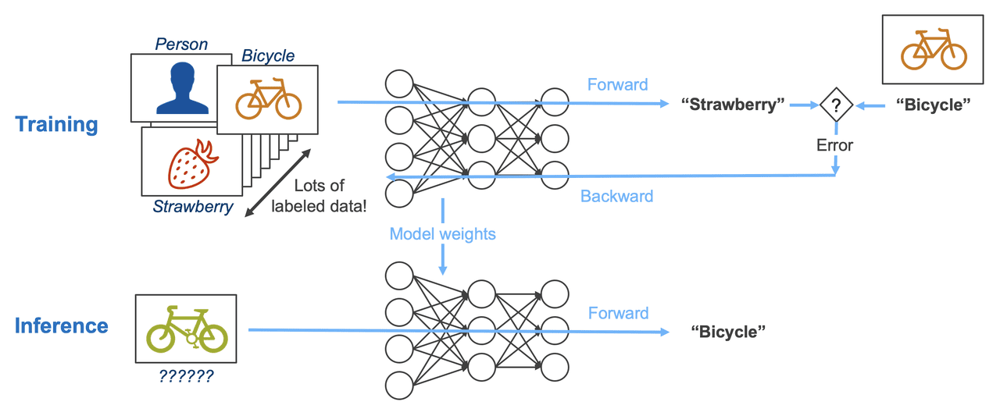
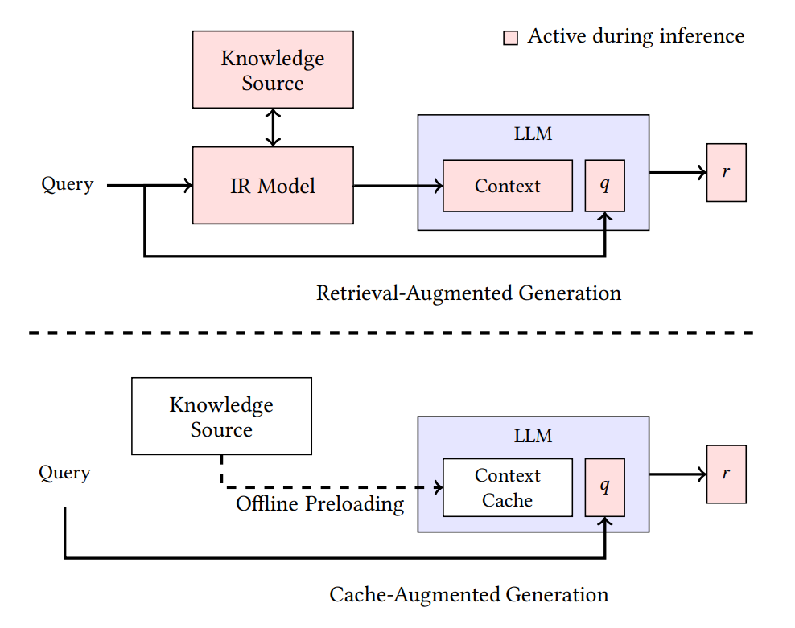
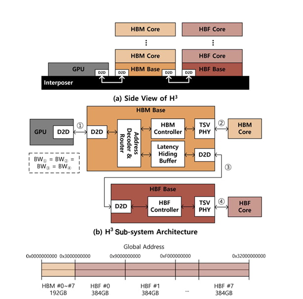
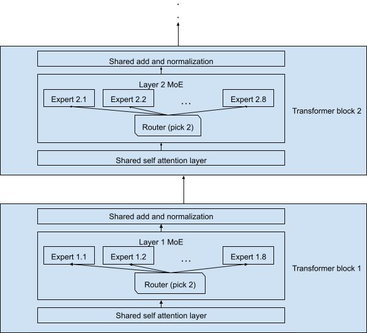
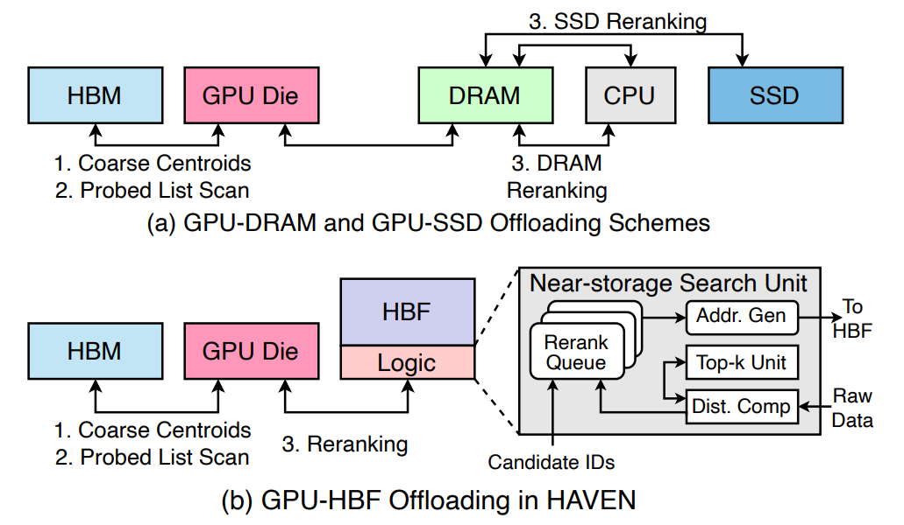

> This post is Part 2 of the **Memory in the AI Era** series.  
> [Part 1: Understanding HBF](https://hyper-accel.github.io/posts/what-is-hbf/) covered what HBF is and where it sits in the memory hierarchy.  
> This part asks the next question, **given those weaknesses, where does HBF actually pay off?**, and walks through SK hynix's **H³** architecture and the candidate workloads beyond it.

<!-- Cover image is auto-rendered via frontmatter cover.image -->

## Setting the stage

Hi, I'm Jaewon Lim, a hardware verification engineer on HyperAccel's DV team.

Did you read Seungbin Shin's tour of **High Bandwidth Flash (HBF)** in Part 1? If we collapse it to one line:

> **HBF is fast and huge, but too slow.**

More precisely: HBF matches **High Bandwidth Memory (HBM)** on bandwidth and offers 8–16× the capacity, but its latency sits at conventional SSD levels, roughly 100× HBM's. **Bandwidth and capacity rival HBM (and capacity even beats it), while latency lands at SSD scale**, a spec ambiguous enough that "where does this fit?" becomes the actual open question. Finding the workloads that genuinely suit HBF becomes its own exercise.

If Part 1 answered "what is HBF," Part 2 picks up the next question:

**"How would you actually use it?"**

HBF is still pre-volume-production. For the market and accelerator companies to commit, the picture beyond the spec sheet (which workloads will use it, and why) has to come into focus first. So that's our starting point.

Here's the interesting bit. **Pick the workload right, and HBF's weaknesses can be hidden.** This post walks through the **H³** architecture that SK hynix published at *IEEE Computer Architecture Letters 2026*, and then explores what else might fit beyond it.

---

## HBF's weaknesses, revisited

The three weaknesses Part 1 laid out:

**First, latency.** HBF is NAND flash with packaging applied to it. The cell-level read mechanism is fundamentally slower than DRAM, so while HBM reads at tens of nanoseconds, HBF needs about 10–20 μs. Roughly 100× slower. No amount of packaging cleverness can erase that. It's a cell-level limit.

**Second, write endurance.** NAND flash cells have physical limits on erase/write cycles. Workloads that hammer the same locations wear cells out fast. So training or frequently-updated data isn't a fit.

**Third, read granularity.** HBF is NAND-based, so each read request is processed at page granularity, around 4 KB. Contrast HBM4, which can do 32 B fine-grained accesses. If a workload picks small chunks at random, only a fraction of the 4 KB pulled per request actually gets used, and effective bandwidth collapses. Even if nominal bandwidth matches HBM, realized bandwidth can drop sharply.

---

## Workload conditions that sidestep the weaknesses

To neutralize all three weaknesses simultaneously, the workload has to satisfy:

- **Load once, read many times**: neutralizes write endurance.
- **Deterministic access patterns**: knowable in advance, so latency can be hidden by prefetch.
- **Coarse-grained reads**: once a page is fetched, enough of it actually gets used to keep effective bandwidth high.

The fastest way to see where these conditions land is to compare **training** and **inference**: the two LLM phases sit at opposite ends of the memory-access spectrum.

**Training** updates weights every step. The backward pass computes gradients and the optimizer state writes alongside, so writes happen continuously across memory. For HBF, limited by write endurance, this is the worst-case workload. It fails the first condition (read-only) immediately.

**Inference** is a different story. Once training is done, the weights never change during inference. Run Llama 3.1 405B in FP8 and you're holding ~405 GB of weights that get read end-to-end every batch (only read, never written). Clearly huge + read-only.



But inference has another piece that can grow as large as the weights, **the KV cache**. With 1M, 10M context, KV cache balloons from hundreds of gigabytes to several terabytes. Putting that on HBF would dramatically expand HBF's reach. Catch: an ordinary KV cache is exactly the access pattern HBF hates. How to bring it onto HBF anyway is the next section's problem.

---

## CAG: computing the KV cache once, reusing it many times

The KV cache is hard for HBF for two reasons:

- **It's written every token.** During decode, every output token appends new entries across all layers' KV. Write rate is high.
- **It differs per request.** User queries change every time, so even with the same model, the KV cache contents are recomputed from scratch. A cache built for one request isn't reused by another.

Both properties hit HBF exactly where it's weak. Frequent writes burn endurance, and non-shareable data has no claim on HBF's huge capacity. Put differently: only when the KV cache shifts to a **single-write, multi-read** shape does HBF actually pull its weight.

So how do real-world inference techniques actually handle the KV cache? The two closest candidates are worth lining up side by side.

The most common technique for lifting LLM response quality is **Retrieval-Augmented Generation (RAG)**: pull query-relevant documents from an external knowledge base (typically a vector DB), splice them into the prompt, and generate. Every request triggers a fresh retrieve, and a fresh KV cache is built from the fetched context. So far the cache is still per-request and one-shot, both of those weaknesses intact.

But what if the knowledge the model needs to consult **doesn't change much across requests** (the same manual, the same codebase, the same internal docs)? Re-retrieving and recomputing it every time is plain waste.

A late-2024 paper (Chan et al., "Don't Do RAG", arxiv:2412.15605) called out this waste directly and proposed a new pattern: **Cache-Augmented Generation (CAG)**.



CAG is mechanically simple:

1. Run the shareable, massive knowledge base **once** through the model and build a KV cache.
2. When a user query arrives, treat that pre-built KV cache as a prefix and generate from there. No recomputation of the same material.
3. When many requests come in, **share** that same KV cache and generate per-request answers on top.

A one-line contrast:

- **RAG**: retrieve + recompute every time.
- **CAG**: compute once, read many times.

The memory profile contrast is even starker. RAG's KV cache is short and one-shot per request, but CAG's KV cache is **huge, read-only, and accessed repeatedly across requests.** Hundreds of GB at 1M context, several TB at 10M.

Lay this profile next to the "HBF-friendly conditions" we defined earlier:

- read-only → write endurance issue neutralized
- load once, read many → instead of recomputing every request, one built cache is shared across requests
- layer-by-layer KV cache usage is predictable → latency hideable by prefetch

This workload fits the conditions cleanly. That's why SK hynix picked CAG as the central use case to justify H³.
Next we'll look at the hardware architecture they propose.

---

## SK hynix's H³: dividing roles between HBM and HBF

SK hynix's **H³** boils down to one idea:

> **Don't replace HBM with HBF. Bolt HBF on next to HBM as a dedicated slot for huge read-only data.**


*Source: Ha et al., IEEE CAL 2026*

### Physical layout: daisy-chaining HBF behind HBM

In a typical GPU, HBM stacks sit next to the GPU on the interposer and consume all of the available shoreline. H³ leaves that alone. **HBM is still wired directly to the GPU shoreline.**

The change is what comes after. Each HBM stack's base die gains a **Die-to-Die (D2D)** interface, and an HBF stack hangs off the back of HBM through it. The HBM and HBF are daisy-chained.

From the GPU's perspective, both HBM and HBF appear as main memory inside a **unified address space**. An address decoder and router on the HBM base die decide whether a request goes to HBM core or makes the extra hop to HBF.

The win is that you get tens of times more capacity without spending any more GPU shoreline. By SK hynix's assumption, on top of 192 GB / 8 TB/s of HBM3e per GPU, an HBF stack adds roughly 3 TB / 8 TB/s per GPU, about a 16× capacity bump.

### Data placement: who lives where

H³'s operating principle is to split data between the two memories by character.

- **In HBF**: model weights, the pre-computed shared CAG KV cache, both huge and read-only at inference time.
- **In HBM**: the KV cache being generated, activations, anything else that gets updated frequently.

This split sidesteps HBF's weaknesses cleanly. Huge read-only data never raises endurance. And in batch-heavy inference, HBF's extra power is paid back in throughput.

### Latency Hiding Buffer

One problem remains: NAND's tens-of-microseconds latency. A GPU compute pipeline tuned around nanosecond-scale memory will stall hard if it suddenly has to wait microseconds.

SK hynix's answer is the **Latency Hiding Buffer (LHB)**, a prefetch SRAM integrated into the HBM base die.

It leans on a key property of LLM inference: **layer-by-layer access is deterministic.** You can know in advance which weights and KV blocks the next layer needs. The deep-learning framework hands those prefetch hints down, and the LHB pulls the next layer's data ahead of time, hiding the HBF latency behind the current layer's compute.

LHB sizing is a simple formula:

```text
Capacity_LHB = 2 × BW_HBF × Latency_HBF
```

This assumes double buffering. Plugging in SK hynix's example numbers (BW 1 TB/s, latency 20 μs), you land on about **40 MB**. At 3 nm SRAM that works out to roughly 8 mm², about 6.7% of the HBM base die's ~121 mm² area. A modest overhead that fits comfortably into existing base-die slack.

In other words, H³ solves the latency problem by "adding a bit of SRAM into HBM's spare base-die area."

### Simulation results

The team simulated H³ on **Llama 3.1 405B** (~405 GB of FP8 weights) with an NVIDIA **B200** GPU setup. Headline gains relative to HBM-only:

| Metric (H³ vs HBM-only) | 1M context | 10M context |
| --- | :---: | :---: |
| Max batch size | ~2.6× | ~18.8× |
| Throughput (Tokens Per Second / request) | ~1.25× | ~6.14× |
| Throughput per power (max) | — | ~2.69× |

*Source: Ha et al., IEEE CAL 2026. Throughput-per-power figure fully accounts for HBF's higher power consumption.*

Gains scale steeply with context length. Even more striking: **1M context inference fits on a single GPU, and 10M fits on two GPUs**, workloads that would otherwise need 8 and 32 GPUs respectively on HBM-only systems.

---

## Beyond H³: other workloads HBF might fit

H³ showed one combination, HBF + LLM inference (CAG specifically). But workloads that satisfy the "weakness-isn't-a-weakness" conditions (huge, read-only, deterministic-prefetchable) aren't limited to CAG. Here are two HBF candidates I'd flag.

### Candidate 1. Mixture of Experts (MoE) inference: single-chip trillion-parameter serving



A lot of frontier LLMs now use **Mixture of Experts (MoE)**. The model holds tens to hundreds of expert **Feed-Forward Networks (FFNs)**, with only a few (typically 2–8) activated per token. The unactivated experts still have to live in memory, so total weight quickly balloons into trillion-parameter territory.

Running that much weight on HBM alone forces you to spread the model across multiple GPUs, which adds communication overhead from moving weights or intermediate activations between GPUs. But if you lean on HBF's capacity, a different picture opens up: **put every expert weight on HBF and serve a trillion-parameter model from a single chip.**

- **HBF**: model weights (read-only)
- **HBM**: attention KV cache, activations, hot path

The catch: it's hard to predict which expert each layer will pick. The router decides which expert handles a token only after the input has gone through the attention layer. To hide the latency of pulling expert weights from HBF, you need an additional mechanism that effectively predicts the upcoming expert and feeds prefetch hints down to HBF.

### Candidate 2. Storing the RAG vector-DB raw data

Embedding collections in RAG vector DBs covered earlier can hit billion-scale. Capacity runs from hundreds of GB to several TB, so in real services these vector DBs are parked in host memory or external storage rather than on-package memory like HBM.

In a typical RAG inference flow, a query encoder produces a query embedding, the vector DB scores it against all entries to pull a top-k, and the top-k's raw embeddings or source chunks are spliced into the LLM's prompt.

Bringing HBF into this pipeline lets the vector DB sit much closer to the accelerator, and one step further, you can place a dedicated search engine between HBF and the accelerator. **[HAVEN (arxiv:2603.01175)](https://arxiv.org/pdf/2603.01175), published earlier this year, adopts exactly this structure.** The massive vector DB lives on HBF, a search engine sits adjacent to HBF and runs similarity scoring + top-k selection right there, and the accelerator only receives the narrowed top-k payload.



- **HBF**: the full vector DB (raw embeddings + source chunks)
- **Search engine adjacent to HBF**: similarity scoring + top-k selection
- **HBM / accelerator**: query encoder, LLM proper

The traffic and latency story is the win. The random fine-grained access search demands still happens, but it stays inside the short HBF ↔ search-engine path. **Only the narrowed top-k payload travels between HBF and the accelerator, as page-aligned reads.** The accelerator-side memory interface stays clean, and placing the data close to the accelerator also speeds up search itself. As the vector DB scales (billions of documents), the combination of HBF capacity and an adjacent search engine becomes a direct cost-and-throughput lever.

The catch: this picture requires a dedicated search engine alongside the vector DB, which means search-acceleration logic the HBM standard base die doesn't carry. In other words, you need a **custom base die** rather than the standard one. This is not something that rides a vanilla packaging line, but vendor- and workload-specific base-die customization that has to come together.

---

## Closing

This post explored **the workload conditions that can neutralize HBF's critical weaknesses, and the LLM workloads that meet them**. But the workloads we covered today are only a slice of the full LLM service stack. To match HBM-scale market reach, HBF needs broader, more general-purpose use cases, but real technical limits and unsolved engineering problems still stand in the way. The next post looks at how existing flash memory is already used in LLM serving and walks through the homework HBF has to clear before it can be commercialized in earnest.

---

## P.S. HyperAccel is hiring!

The more memory hierarchies diversify, the more interesting the problems accelerator designers get to work on.

I work on hardware verification of LLM-acceleration ASICs at HyperAccel's DV team. Beyond verifying single chips, the role lets me work on memory hierarchy, system integration, and workload matching, fresh problems show up every day.

HyperAccel works across hardware, software, and AI. If you'd like to learn deeply across that range while growing alongside the team, please apply through the [careers site](https://hyperaccel.career.greetinghr.com/ko/guide).

---

## References

- M. Ha, E. Kim, H. Kim, "H³: Hybrid Architecture using High Bandwidth Memory and High Bandwidth Flash for Cost-Efficient LLM Inference," *IEEE Computer Architecture Letters*, 2026. DOI: [10.1109/LCA.2026.3660969](https://doi.org/10.1109/LCA.2026.3660969)
- B. J. Chan, C.-T. Chen, J.-H. Cheng, H.-H. Huang, "Don't Do RAG: When Cache-Augmented Generation is All You Need for Knowledge Tasks," *Proc. The ACM Web Conference (WWW) 2025*, 2025. [arxiv:2412.15605](https://arxiv.org/abs/2412.15605)
- [SanDisk, "Memory-Centric AI: Sandisk's High Bandwidth Flash Will Redefine AI Infrastructure"](https://www.sandisk.com/company/newsroom/blogs/2025/memory-centric-ai-sandisks-high-bandwidth-flash-will-redefine-ai-infrastructure)
- P.-K. Hsu, W. Xu, Q. Liu, T. Rosing, S. Yu, "HAVEN: High-Bandwidth Flash Augmented Vector Engine for Large-Scale Approximate Nearest-Neighbor Search Acceleration," 2026. [arxiv:2603.01175](https://arxiv.org/abs/2603.01175)
