# Know Your Enemy, Know Yourself, Part 1: GPU History and Fundamentals

When we talk about AI infrastructure in the 2020s, it is almost impossible to avoid talking about NVIDIA GPUs.  
If we are building AI accelerators that will compete with NVIDIA, we first need to understand **how NVIDIA got here and what kind of machine a GPU really is.**

This first post in the series looks at how the NVIDIA GPU was born, which architectural choices brought it to its current position,  
and summarizes the **strengths and structural characteristics** of this design from a hardware engineer’s point of view.

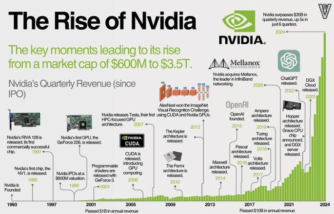

Very briefly, NVIDIA was founded in 1993 and entered the graphics market in 1995 with the NV1.  
With RIVA 128 (1997) and GeForce 256 (1999), the company firmly established itself in the PC graphics card market,  
but then hit a major crisis when the GeForce FX series failed.

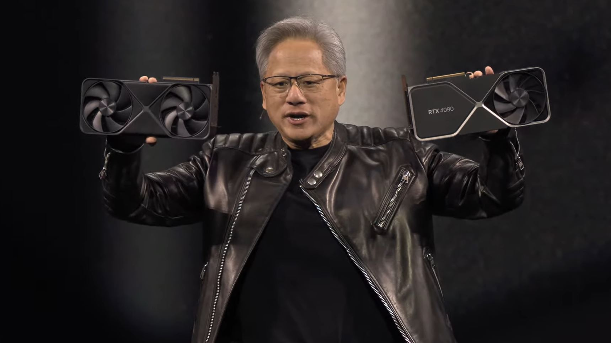

From that failure, NVIDIA rebuilt its GPU architecture, introducing the G80 Tesla architecture and CUDA.  
That pivot turned the GPU from “just” a graphics chip into a platform that could also dominate the HPC and GPGPU markets.

In 2012, AlexNet – a convolutional neural network trained on GPUs – won the ImageNet Large Scale Visual Recognition Challenge (ILSVRC),  
firmly tying GPUs to deep learning. In 2022, the release of ChatGPT pushed generative AI into the mainstream,  
and the AI hardware device market effectively consolidated around NVIDIA; the company would go on to become the world’s most valuable by market cap.

Today, NVIDIA GPUs are no longer “just graphics accelerators” – they are **a de‑facto standard parallel computing platform that underpins the AI infrastructure layer**,  
and, from our point of view, **a baseline that any new accelerator must beat.**

So how did GPUs emerge, and how did they expand from graphics into the AI market?

---

## The Birth of the Graphics Card

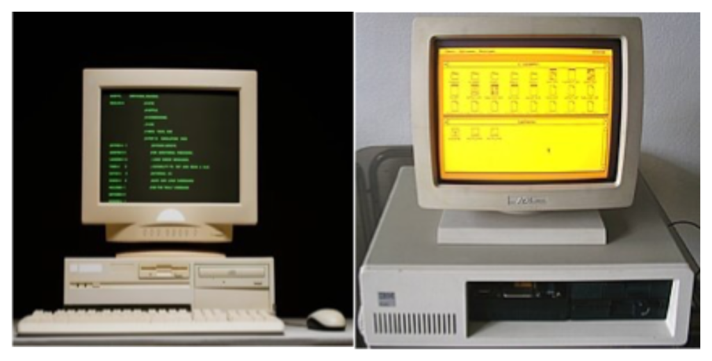

Early mass‑market computers used command line interfaces (CLI). The screen was mostly green text on a black background,  
and there was very little graphics work to do. The CPU could easily handle both computation and screen updates.  
But CLIs required users to remember commands, which limited usability and mass‑market appeal.

Systems like Xerox Alto and Apple Lisa kicked off the era of graphical user interfaces (GUI) with windows, icons and a mouse.  
This greatly improved usability, but it also put more load on the CPU.  
In response, vendors like IBM steadily beefed up the graphics circuits on the motherboard, and by the time we reached VGA,  
graphics had become a first‑class component in the PC.

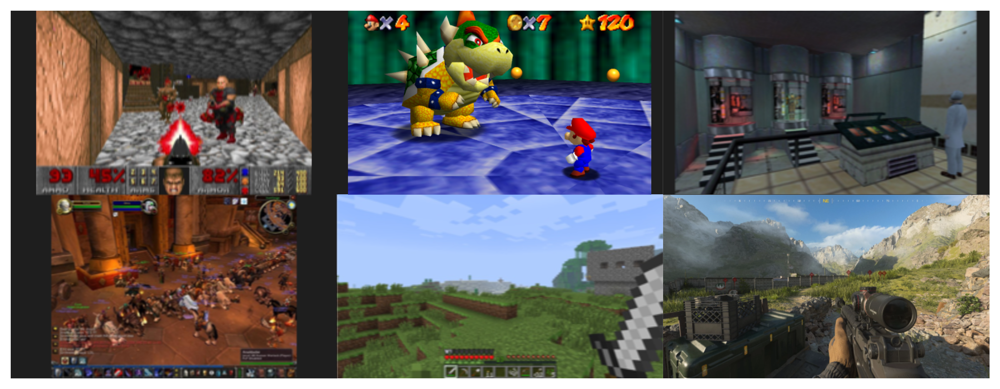

In the 1990s, demand for 3D games exploded and the need for graphics compute grew with it.  
DOOM (1993) was a breakthrough 3D game and required around ten million operations per second.  
The required compute can be thought of as:

> frames per second × resolution × physics simulation × texture effects

As each of these factors improved, the required operations grew explosively.  
Super Mario 64 (1996) needed roughly 100M operations per second,  
Half‑Life (1998) about 500M, World of Warcraft (2004) ~2.2B, and Minecraft (2011) around 100G operations per second.  
By Call of Duty: Modern Warfare III (2023), we are talking about **30–40 trillion operations per second**.

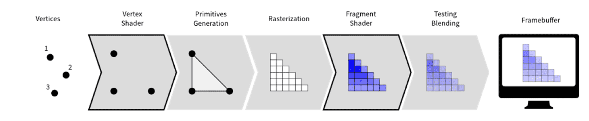

What are these “graphics operations” in practice?  
The CPU first sends a set of vertices. The GPU runs a vertex shader to place them in screen space,  
then primitive generation and rasterization map them to pixels.  
For each pixel, fragment shaders compute the final color, and the results are written into the framebuffer.  
As graphics quality improved, additional effects like anti‑aliasing, blending, transparency and shadow mapping were added on top.

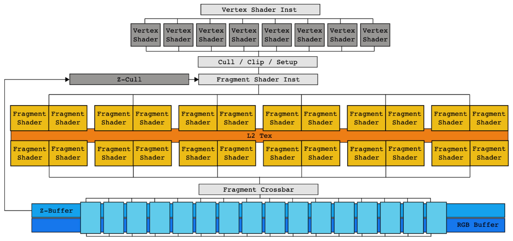

If we look at an NVIDIA FX‑series GPU, early GPUs essentially hard‑wired this graphics pipeline into hardware.  
There was a separate vertex shader block for vertex shading, a separate fragment shader block for fragment shading –  
in other words, a **fixed‑function accelerator dedicated to the graphics pipeline.**

This strictly feed‑forward pipeline had an important drawback: if an intermediate stage took a long time,  
upstream stages would stall, leading to bubbles and poor utilization.  
This became more apparent with the arrival of programmable shaders.  
Custom shader programs often took longer to run, which hurt the overall hardware utilization,  
and as the pipeline got deeper, it became harder to identify where the bottlenecks were.

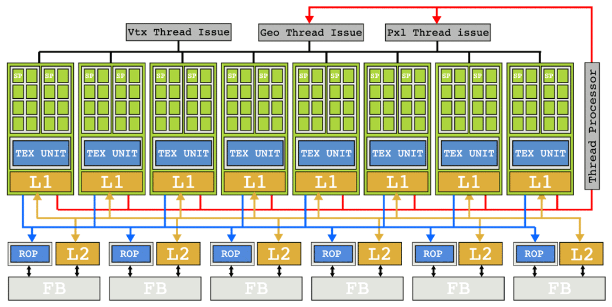

NVIDIA’s answer was the G80 Tesla architecture with **unified shaders**.  
Instead of separate vertex and fragment shader hardware, all shader work could run on a common pool of cores.  
Computation that had been processed as small fixed‑width vectors of pixels was broken down into per‑pixel work,  
and many such pieces were scheduled together across the cores.

This architectural shift meant that even if some shader invocations took a long time,  
other shader work could still make progress on the same cores.  
The classic issues of a strict one‑way pipeline were greatly reduced.  
This shift in turn opened the door to a new way of thinking about GPUs: **GPGPU for HPC**.

---

## The Rise of GPGPU and CUDA

As GPUs evolved as graphics processors, researchers started asking a simple question:

> *“If GPUs can do so many operations per second, can we use them for general‑purpose math?”*

Around 2003, two independent research teams showed that some general linear algebra problems could be solved faster on GPUs than on CPUs.  
This kicked off the first wave of interest in GPGPU.

To understand the context: DirectX 8 (2000) introduced programmable shaders,  
allowing developers to write custom shader programs that run on dedicated shader hardware.  
DirectX 9 (2002) added `HLSL`, making programmable shaders truly practical.  

At the same time, the fundamental nature of the GPU workload – **the same operation on many pixels** –  
looked a lot like linear algebra problems such as matrix multiplication – **the same operation on many data elements**.  
Input vertices could be interpreted as function inputs, and the framebuffer as function outputs.  
That is how the concept of a “general‑purpose GPU” took shape.

However, as mentioned earlier, the hardware of that era was still built as a graphics pipeline.  
Doing GPGPU back then was effectively a hack: you had to reinterpret your linear algebra problem as a graphics problem,  
fit it into the graphics pipeline, and rewrite existing `C` code in shader languages like `HLSL` or `GLSL`.  
This was powerful but very cumbersome.

Tesla (2006) and CUDA (2007) solved this problem.  
CUDA was designed not for graphics but for **general‑purpose parallel computation**,  
and it mapped naturally onto the unified shader architecture.

Conceptually:
- work on a single data element becomes a **`thread`**,  
- a group of threads that run together on one `SM` becomes a **`block`**,  
- and all the threads launched by a kernel form a **`grid`**.

CUDA lets you express kernels in a C‑like language instead of in shader languages,  
and the Tesla architecture executes them efficiently. This is where the GPU truly became a GPGPU platform.

Now let’s look more closely at the CUDA programming model on top of a modern GPU like Hopper.

### Hopper Architecture Overview

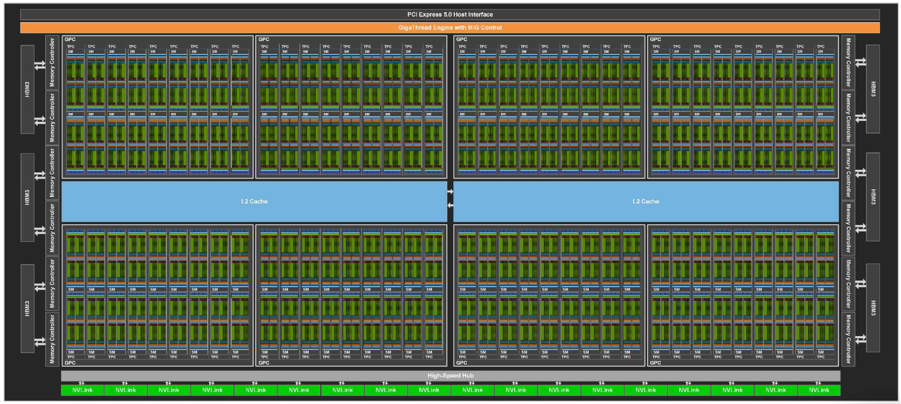

#### GPU (Device)

* The full chip, including GPCs, memory controllers (HBM/GDDR), L2 cache, PCIe/NVLink interfaces, etc.
* The GigaThread Engine at the top receives kernel launch requests and distributes thousands of thread blocks across GPCs and SMs.

#### GPC (Graphics Processing Cluster)

* A higher‑level grouping of multiple SMs.
* Shares common resources for graphics (e.g., raster engines) and, in Hopper, forms the boundary for thread‑block clusters.  
* Within a GPC, high‑bandwidth links connect SMs, enabling Distributed Shared Memory (DSMEM) access.

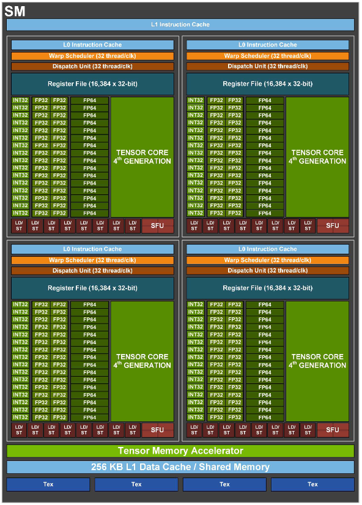

#### SM (Streaming Multiprocessor)

* The main compute building block of the GPU – the place where thread blocks actually run.  
  It is analogous to a CPU core but designed to keep **many more threads in flight**.
* Key components:
  * 4 SM sub‑partitions (SMSPs): groups of execution units.
  * Unified shared memory / L1 cache (256 KB on Hopper): fast on‑chip storage for data sharing and caching.
  * TMA (Tensor Memory Accelerator): an async copy engine introduced with Hopper to offload memory movement from compute units.
* A single SM can have tens of warps active at the same time.  
  When one warp stalls on memory, the scheduler quickly swaps in another to keep the pipelines busy (latency hiding).

#### SM Sub‑partition (Processing Block / SMSP)

* Each SM is split into 4 SMSPs in modern NVIDIA GPUs.
* Each SMSP has its own warp scheduler, dispatch unit, register file (64 KB), and a set of CUDA Cores and Tensor Cores.
* This partitioning makes the scheduling problem more tractable and allows each SMSP to independently issue work, improving parallelism.

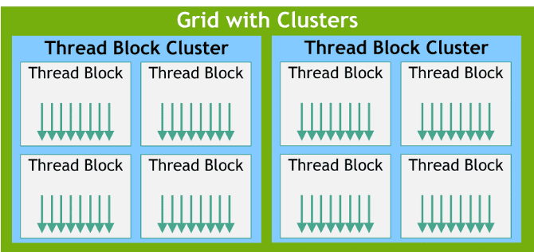

On top of this hardware, the CUDA execution model groups work into five main levels:

* **Thread** – the smallest unit of parallel work  
  A CUDA thread runs the kernel function on one piece of data.  
  All threads execute the same program (SPMD: Single Program, Multiple Data),  
  but each has its own thread ID and can follow slightly different control flow and access different memory.

* **Warp** – the minimum unit of execution in hardware  
  A warp is a group of 32 consecutive threads. The warp is the unit at which instructions are issued:  
  all 32 threads in a warp execute the same instruction at the same time.  
  Each warp has a program counter in the instruction cache. When the warp is issued,  
  the instruction at that PC is sent to the dispatch unit, executed, and then the PC advances.  
  If threads in a warp branch in different directions (branch divergence), the hardware serializes the different paths and reconverges later.  
  To get good performance, you want threads within a warp to follow the same control path.  
  The warp scheduler rapidly context‑switches between warps to hide memory latency.

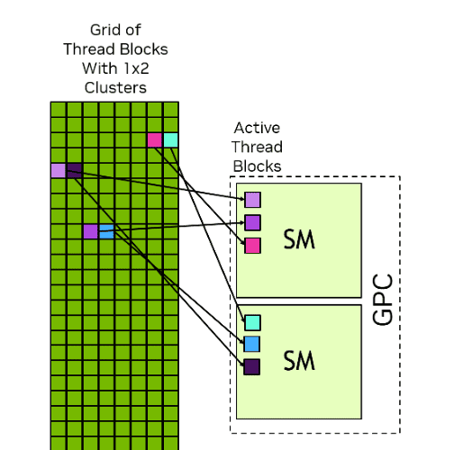

* **Thread Block (CTA)** – the unit of cooperation and shared memory  
  A block is a group of threads (up to 1024) that can cooperate closely.  
  Threads in the same block share **shared memory** and can synchronize with `__syncthreads()`.  
  For that reason, a block is always scheduled entirely on a single SM for its lifetime.  
  Register and shared memory limits on an SM constrain the maximum block size.  
  Blocks can be 1D, 2D or 3D (`blockDim.x/y/z`), which maps naturally to images and volume data.

* **Thread Block Cluster**  
  Introduced in Hopper, a cluster is a group of blocks that can communicate more efficiently.  
  Traditionally, blocks could communicate only via global memory, which is slow.  
  In a cluster, blocks mapped to the same GPC can access each other’s shared memory via DSMEM without going through L2,  
  enabling faster inter‑block cooperation.

* **Grid** – the whole kernel launch  
  All the blocks created by one kernel launch together form a grid.  
  Blocks in a grid are independent: their execution order is not guaranteed,  
  and they may run in parallel across many SMs or sequentially on a smaller number of SMs.  
  This independence is what gives CUDA its scalability: the same kernel can run on a GPU with 10 SMs or 144 SMs without code changes.

---

## How Does a GPU Actually Run Your Code?

Now let’s walk through a concrete scheduling example to see what happens when we actually run code on the GPU.

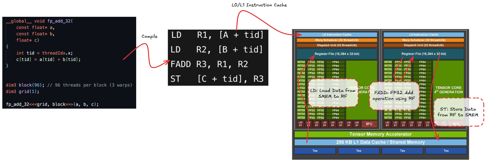

Consider a simple `fp32 add` kernel. We launch a grid with a single block of 96 threads.  
In practice, the kernel is compiled down to machine code (SASS), but we can think of it as four logical steps:

1. Load operand `A` from memory (`SMEM` / `L1` / `L2` / global) into register file (`LD`)  
2. Load operand `B` into registers (`LD`)  
3. Perform the floating‑point add `FADD R3, R1, R2` and store the result in a register  
4. Store the result back to memory (`SMEM` / `L1` / `L2` / global) (`ST`)

The load and store operations are asynchronous from the perspective of the compute pipelines:  
`LD/ST` units compute addresses and send memory requests to the memory subsystem, which completes them later.

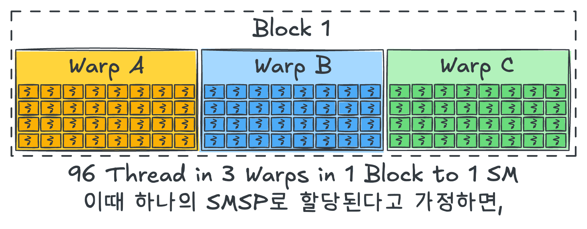

Our 96 threads are split into three `warps` (A, B, C) of 32 threads each, and all belong to one `block`.  
For simplicity, assume that this block is mapped entirely onto a single `SMSP`.

### Warp Scheduling Hardware on Hopper

Before we dive into the timeline diagrams, it helps to understand **what the warp scheduler and dispatch unit actually do** on Hopper.

The warp scheduler uses a scoreboard to track dependencies for each warp and picks **eligible warps** that are ready to run.  
When it does so, it must respect the capacity of the dispatch unit – on Hopper, the effective issue width is roughly one warp (32 threads) per cycle –  
so warps that cannot be dispatched due to resource limits are deferred to later cycles.

The dispatch unit then maps the issued warp’s instruction onto the actual execution pipelines.  
Even though the warp scheduler issues work at warp granularity, the dispatch unit can spread the 32 threads across multiple cycles,  
and mix different pipeline types (LD/ST, INT, FP, etc.) in the same cycle (co‑issue) to keep the hardware as full as possible.

With that in mind, let’s now follow how the first warp, Warp A, is scheduled step by step.

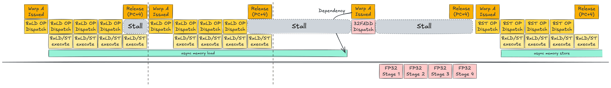

### Single Warp Scheduling

Instead of starting with the full three‑warp picture, let’s first follow **Warp A** in isolation.

Warp A is issued by the warp scheduler (WS). Based on its PC, the first instruction `LD R1, [A+tid]` is sent to the dispatch unit.  
The dispatch unit scans the SMSP for available LD/ST units – suppose there are 8.  
It then dispatches the 32 threads of Warp A across these 8 LD/ST units over 4 cycles (8 threads per cycle).  
Each LD/ST unit computes addresses and sends load requests to the memory subsystem;  
these loads complete asynchronously.

On the fifth cycle, the LD/ST activity finishes and the WS releases Warp A, advancing its PC by 4 bytes (32‑bit opcode).  
On the next cycle, the WS can issue Warp A again for the second LD, which proceeds in the same way.

Once both loads are issued, Warp A cannot immediately execute `FADD R3, R1, R2`,  
because `R1` and `R2` are still being filled by the asynchronous loads.  
The warp must wait until both operands are ready. During this wait, the FP units would sit idle – a stall.  
Roughly speaking, L1 cache hits may take ~20 cycles, L2 ~100 cycles, and HBM hundreds of cycles (300–800).

When the loads complete and the dependencies are resolved, Warp A becomes eligible again.  
The WS issues it; `FADD` is sent to the FP32 pipeline. On Hopper, there are 32 FP32 units per SMSP,  
so all 32 threads in the warp can be processed in one go. After the FADD completes, the warp is released again,  
and the final ST instruction proceeds similarly to the LD.

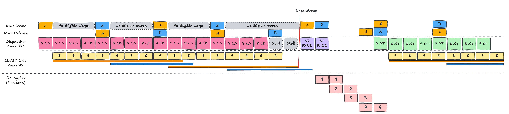

### Double Warp Scheduling

Now add **Warp B** to the picture.

In the single‑warp scenario, when the first LD finished, there was a cycle where Warp A’s PC had not yet advanced,  
so the scheduler could not immediately re‑issue Warp A, leaving one idle cycle.  
With Warp B around, this idle slot can be used.

While Warp A is using all LD/ST units, Warp B cannot run.  
But as soon as A’s LD is fully dispatched, the WS can issue B and perform its LD in the same fashion.  
We alternate between A and B, issuing four LD instructions in total (two per warp),  
and then both warps wait for their loads to complete before FADD.

Compared to the single‑warp case, the key difference is that **the memory latency of Warp A’s loads is overlapped with Warp B’s loads**,  
reducing the visible stall time. When A’s loads finish, its FADD can run immediately;  
if B’s loads also complete soon after, B’s FADD can follow, with the pipeline stages overlapping like a classic CPU pipeline.

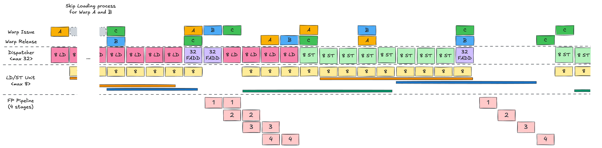

### Multiple Warp Scheduling

Finally, add **Warp C**.  
With three warps in flight, the GPU can overlap memory operations and computation even more effectively,  
filling in most of the stalls that would otherwise occur.  

In the end, CUDA programming on Hopper is all about **packing enough independent work into the SMSP pipelines** –  
issuing loads, arithmetic and stores from many warps so that asynchronous memory communication time is well overlapped.

---

## To Sum Up…

In this post we:
1. Looked at NVIDIA’s history from a graphics‑card vendor to the dominant AI GPU provider,  
2. Traced how Tesla and CUDA turned the GPU into a GPGPU platform, and  
3. Examined the Hopper‑generation hardware and a scheduling example to see how it actually runs code.

Taken together, these show that *“a GPU is a machine that hides slow memory with many warps and aggressive concurrency.”*  
The memory hierarchy, scheduling policies and execution pipelines are all designed around that goal.

In the next post, we’ll turn our attention to **Google’s TPU**, which has been rapidly gaining share in the AI hardware market.  
We’ll walk through the history of TPU and analyze the latest TPU architecture, Ironwood, from a hardware engineer’s perspective.

See you again in **Know Your Enemy, Know Yourself, Part 2: TPU History and Fundamentals**.

---

## P.S.: HyperAccel is Hiring!

Knowing your enemy and yourself is important, but to truly win we also need great people on the team.  
If you’re interested in the kinds of technologies we work on, please apply via [HyperAccel Career](https://hyperaccel.career.greetinghr.com/en/guide).  
We’re looking forward to hearing from talented engineers like you.
