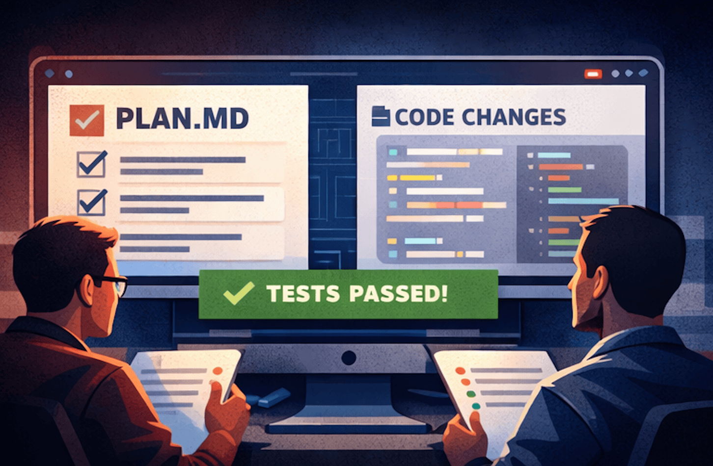

# Copy & Paste에서 자율 코딩 에이전트까지: 조용한 변화의 시작

안녕하세요, 하이퍼엑셀 ML 팀 엔지니어 엄태서입니다.

개발자들 사이에는 이런 농담이 있습니다. “우리 일은 결국 문제를 구글에 검색하고, 첫 번째로 뜨는 링크를 눌러서, Stack Overflow에서 답을 복사해 붙여넣는 거 아니냐?”
어떤 면에서는 AI 코딩 도구의 등장이 우리가 하는 일을 완전히 바꾼 건 아닙니다. 다만 **그 일을 훨씬 더 잘, 훨씬 더 빠르게** 하게 만들었죠. 지난 몇 달 동안 우리 팀은 AI 보조 개발의 거의 모든 물결을 직접 타 봤습니다. 초기의 단발성 상호작용부터, 지금은 사실상 일상적으로 의존하는 **자율 에이전트**까지요. 이 글에서는 그 여정이 어떤 모습이었는지, 무엇을 배웠는지, 그리고 앞으로 어디로 향하고 있다고 생각하는지 정리해 보려고 합니다.

---

## 초창기: AI는 더 똑똑한 검색 엔진이었다

대형 언어 모델(LLM)이 처음 대중에게 열렸을 때, 특히 개발자들에게는 “정답”이나 “정석”이 없었습니다. 대부분 사람들은 LLM을 친구, 선생님, 개인 상담가, 혹은 그냥 새로운 검색 엔진처럼 다양하게 사용했죠. 그럼 개발자들은 어땠을까요? 초창기 사용 사례는 솔직히 말해 **조금 민망할 정도로 단순**했습니다. 에러 메시지를 복사해서 ChatGPT에 붙여넣고, 유용한 답이 나오길 기대하는 것 이였죠.

그 경험은 “대화형 Stack Overflow”에 가까웠지만, 놀랍게도 꽤 잘 작동했습니다. 예전에는 forum thread를 한참 스크롤하면서 “내 Python 버전과 정확히 맞는 답” 하나를 찾기 위해 시간을 썼다면, 이제는 몇 초 만에 상황에 맞춘 설명을 받을 수 있으니까요.

그 다음부터는 사용경험이 자연스럽게 확장됐습니다. 개발자들은 문법 질문을 하고, 코드 snippet을 요청하고, 익숙하지 않은 API에 대한 설명을 받기 시작했습니다. 이때의 멘탈 모델은 여전히 “내가 특정 질문을 하면, 내 상황에 맞는 답을 준다”에 가까웠습니다. 하지만 미묘한 변화가 이미 진행되고 있었죠. 모델이 **컨텍스트를 유지할 수 있다**는 걸 깨닫자, 더 큰 코드 덩어리(때로는 파일 전체)를 넣고 아키텍처, 디자인 패턴, 디버깅 전략 같은 **상위 레벨의 질문**을 하기 시작했습니다. 아직 AI가 모든 코드를 쓰는 단계는 아니었지만, 점점 꽤 유능한 페어 프로그래밍 파트너가 되어가고 있었습니다. (무엇보다… 어떠한 질문을 해도 덜 민망한 상대였죠.)

---

## 탭 자동완성이 모든 것을 바꿨다

진짜 변곡점은 GitHub Copilot, Cursor 같은 도구들이 등장하면서였습니다. IDE 자동완성은 수십 년 전부터 존재했지만, 이건 근본적으로 달랐습니다. 변수명이나 메서드 시그니처를 제안하는 수준이 아니라, **코드 logic 전체를 예측**하기 시작했으니까요. 뭔가를 조금 입력하거나, 심지어 주석 한 줄만 적어도 나머지가 마치 마법처럼 나타났습니다. Tab을 누르고, 수락하고, 넘어갑니다. (가끔은 “잊어버리고” 계속 진행하죠.)

이 변화가 코딩의 리듬을 얼마나 바꿨는지는 과장하기 어렵습니다. 보일러플레이트, 반복 패턴, 표준 구현을 작성하는 시간이 분 단위에서 초 단위로 줄었습니다. 개발자들은 더 빨라졌고, 더 중요한 변화는 **플로우(flow) 상태를 더 오래 유지**하게 되었다는 점입니다. 문서나 검색 엔진으로 이동하며 컨텍스트가 끊기던 마찰이 거의 사라졌습니다.

그리고 그 다음은 “에이전트적인 경험(agentic experience)”의 등장입니다. Cursor 같은 도구들은 단순 자동완성을 넘어 더 야심찬 방향으로 진화했습니다. 자연어로 문제를 설명하면 LLM/IDE가 코드베이스를 훑고, 관련 파일을 찾아내고, 여러 곳에 걸친 변경을 제안한 뒤, 내가 검토하고 수락하길 요청합니다. 개발자의 역할은 “코드를 작성하는 사람”에서 “코드를 **지시하고 검토하는 사람**”으로 이동하기 시작했습니다. 마치 레포지토리를 밀리초 단위로 읽고 (거의) 전부 다 이해해버리는 주니어 엔지니어가 생긴 느낌이랄까요.

---

## CLI 에이전트와 구조화된 AI 워크플로우의 부상

IDE 통합 도구들이 강력하긴 했지만, 우리는 곧 한계를 느꼈습니다. **구조(Structure)가 부족**했던 겁니다. Cursor가 rules(룰)이라는 개념—코딩 표준, 코멘팅 컨벤션, 일반 정보 등을 정의하는 마크다운 파일—을 도입했을 때 우리 팀도 바로 도입했습니다. 거의 모든 레포지토리에 룰 파일을 추가해, AI 보조 도구를 사용하더라도 최소한 팀 표준을 따르는 코드가 나오게 만들었죠. 단순한 아이디어였지만 효과는 상당했습니다.

다음 도약은 MCP(Model Context Protocols)였습니다. MCP는 AI 도구가 외부 데이터 소스에 연결될 수 있게 해줍니다. 갑자기 에이전트가 Confluence 문서에서 컨텍스트를 가져오고, 내부 문서를 이해하고, 코드 밖에 있던 설계 의사결정까지 참조할 수 있게 된 겁니다. AI는 이제 코드만 읽는 게 아니라 **조직의 지식(기관 기억, institutional knowledge)**을 읽기 시작했습니다.

하지만 “AI로 생산성을 올려보자”라는 우리 팀의 엔진에 진짜 로켓 부스터를 단 건 Claude Code였습니다. Claude Code는 skills(스킬)이라는 개념을 도입했는데, 이는 정적인 rules를 훨씬 뛰어넘는 구조화된 다단계 워크플로우입니다. 저희 팀 레포 중 하나에서는 이제 .claude 디렉토리를 두고, 계획 수립, 기능 구현, 테스트 작성, PR 오픈, PR 리뷰 코멘트 가져와 반영하기 같은 스킬들을 관리하고 있습니다. 또한 플랫폼에 특화된 하드웨어 제약, 팀이 trial and error로 배운 안티패턴, SDK별 컨벤션 같은 것도 스킬 또는 Claude Code rules로 녹여두었습니다.

저희가 사용해 온 Claude Code skills 파일을 어떻게 만들었는지, 그리고 기타 Claude Code 활용 사례를 어떻게 최적화했는지에 대한 자세한 내용은 향후 블로그 게시물에서 심도 있게 다룰 예정입니다.

룰 파일과 스킬의 차이는, 스타일 가이드와 “훈련된 동료”의 차이에 가깝습니다.
룰은 “pytest를 써라, unittest는 쓰지 마라”라고 말합니다.
스킬은 “이 유형의 모듈에 맞는 테스트 스위트를 작성하고, 실행하고, 실패하면 최대 다섯 번까지 자동 수정하고, 결과를 요약 보고하라”라고 말합니다.

/implement-tested, /pr-review, /open-pr 같은 스킬은 과거에 몇 시간이 걸리던 작업들을, 인간의 감독 하에 몇 분 단위의 작업으로 바꿔놓았습니다.

기존에도 LLM을 활용해 코드 생성을 시도해 왔지만, 대부분은 “한 번의 요청–한 번의 응답” 구조에 머물러 있었습니다. Claude Code의 skills는 계획 → 구현 → 테스트 → 수정 → 보고까지 이어지는 실행 흐름 전체를 하나의 재사용 가능한 단위로 구조화할 수 있었고, 특히 반복적이지만 인지 부하가 큰 작업을 안정적으로 압축해 주었다는 점에서 체감 생산성에 큰 차이를 만들었습니다.
---

## 코드 리뷰 병목: 아무도 경고해주지 않았던 부분

아무도 미리 말해주지 않았던 문제가 있습니다. AI와 에이전트 도구들이 개발자를 엄청나게 빠르게 만들었습니다. 하루 걸리던 PR이 한 시간 만에 열리기 시작했죠. 그런데 코드 리뷰—사람이 꼼꼼히 읽고 이해하고 검증해야 하는 단계—는 빨라지지 않았습니다. 오히려 병목은 더 심해졌습니다. 코드 생산 속도가 빨라질수록 리뷰 대기열이 길어지고, 진짜 개발 속도는 저희가 기대한 만큼 늘지 않았습니다.

GitHub PR에서 AI를 활용해 surface-level 문제들을 잡는 데 도움을 받았지만, 더 근본적인 질문은 남았습니다. **더 높은 속도에서 품질을 어떻게 유지할 것인가?**

그 질문에 답은 계속 진화 중이지만, 최근에는 이런 workflow 모델로 움직이고 있습니다. AI 에이전트가 코드를 작성하기 전에 먼저 `plan.md` 파일을 생성합니다. 이는 접근 방식, 변경할 파일들, 각 결정의 이유를 구조적으로 담은 문서입니다. 이후 사람 리뷰어는 구현 코드의 모든 라인을 샅샅이 보는 대신 **계획(plan)을 리뷰**합니다. 핵심 제약은 변경된 코드가 **포괄적인 test suite**를 통과해야 한다는 점입니다. 이렇게 하면 정확성의 부담이 라인 단위 리뷰에서 테스트 커버리지로 이동하고, 결과적으로 “좋은 테스트”의 중요성이 그 어느 때보다 커집니다.

다만 여기에는 결정적인 단서가 있습니다. **새 테스트를 만들거나 기존 테스트 코드를 수정하는 작업은 반드시 사람이 리뷰해야 합니다.** 테스트는 plan 기반 리뷰 모델을 신뢰할 수 있게 만드는 계약(Contract)입니다. 테스트가 약하거나 잘못되면 워크플로우 전체가 무너집니다. 그래서 구현 코드에 대해서는 점진적으로 더 ‘가벼운’ 리뷰 전략을 도입하려고 하지만, 테스트 코드는 여전히 신중한 인간 판단의 영역으로 남겨두고 있습니다.

---

## 미래는 어떻게 될까?

저희 팀, 저희 회사뿐만 아니라, 저는 전 세계가 아직도 초기 단계에 있다고 믿습니다. 도구는 매달 좋아집니다. 아니, 솔직히 말해 **매일 좋아집니다.** AI 워크플로우가 안정화되는 것 같다가도, 언제나 또 다른 변화가 찾아옵니다. 개발자로서 중요한 건 이 변화들을 계속 주시하고, 계속 적응하는 것입니다. 적응할 준비가 되어 있지 않다면, 뒤처지게 됩니다. 세상에서 가장 뛰어난 프로그래머일지라도, AI 도구를 “어떻게 활용해야 하는지”를 아는 사람이 훨씬 빠르게 앞질러갈 수도 있습니다. 우리 팀은 AI 도구가 현재이자 미래라는 점을 이해하고 매우 열린 태도를 갖고 있고, 그 공통된 믿음 덕분에 팀의 개발 속도는 실제로 가속되고 있습니다.

우리가 보는 미래는 이렇습니다. AI 에이전트가 점점 더 복잡한 일을 처리하고, 우리는 그저 “빨리 되는 것”이 아니라 **빠르게 진행되면서도 제대로 되고 있는지**를 확인하는 역할에 더 집중하게 될 겁니다. 사람들은 항상 “이 모델의 컨텍스트 길이”를 이야기합니다. 물론 중요합니다. 하지만 현장에서 이 도구들을 활용해 ‘더러운 일’을 맡기는 개발자 입장에서는 우리가 **컨텍스트 마스터**가 되어야 합니다. 큰 그림을 완전히 이해하고, 가장 작은 디테일까지 놓치지 않으며, 무엇을 해야 하는지 의도를 정의하고, 아키텍처를 검증하고, 테스트 스위트를 큐레이션하며, 빠르고 중요한 판단을 내리는 사람 말이죠.

결국 인간의 역할은 코드를 쓰고 검토하는 것에서, **의도를 정의하고, 아키텍처를 검증하고, 테스트를 관리하고, 중요한 판단을 빠르게 내리는 것**으로 계속 이동할 것입니다.

앞으로 성공할 팀은 지금부터 이런 기반에 투자하는 팀입니다. 잘 구조화된 스킬 정의, 포괄적인 테스트 커버리지, 명확한 아키텍처 문서화, 그리고 AI 툴을 지름길이 아니라 **새로운 규율을 요구하는 증폭기** (force multiplier)로 받아들이는 문화요.

우리는 개발자를 대체하는 게 아닙니다.
**개발자라는 직업의 의미를 다시 정의하고 있을 뿐입니다.**

---

## Upcoming...

이번 글은 전체적인 방향성과 문제의식을 공유하는 인트로 성격의 글로 생각하며 공유드렸습니다. 이후에는 Skills, Kernel Agent, 그리고 기타 AI 도구 활용 사례에 대해 각각 별도의 글로 나누어, 사용 방법뿐 아니라 내부적으로 어떻게 설계하고 최적화했는지까지 상세히 정리해 글을 올리도록 하겠습니다.

HyperAccel 내부적으로 AI가 워크플로우에 자연스럽게 통합되는 방식을 끊임없이 탐색하고 있습니다. 그 과정에서 우리는 “코드를 개발하는 방식”이 근본적으로 변화하고 있는 이 새로운 패러다임 속을 항해하고 있습니다. 앞으로도 그 시행착오와 인사이트를 계속 공유하겠습니다.
---

## HyperAccel 채용 중!

사실 우리가 이 테크 블로그를 운영하는 큰 이유 중 하나는 **최고의 인재를 끌어오기 위해서**입니다!

저희가 다루는 기술에 관심이 있고, 이 혁신의 흐름에 함께하고 싶다면 아래 링크에서 지원해 주세요.
[HyperAccel Career](https://hyperaccel.career.greetinghr.com/ko/guide)

HyperAccel에는 뛰어난 엔지니어들이 가득합니다.
함께할 날을 기다리고 있겠습니다.
