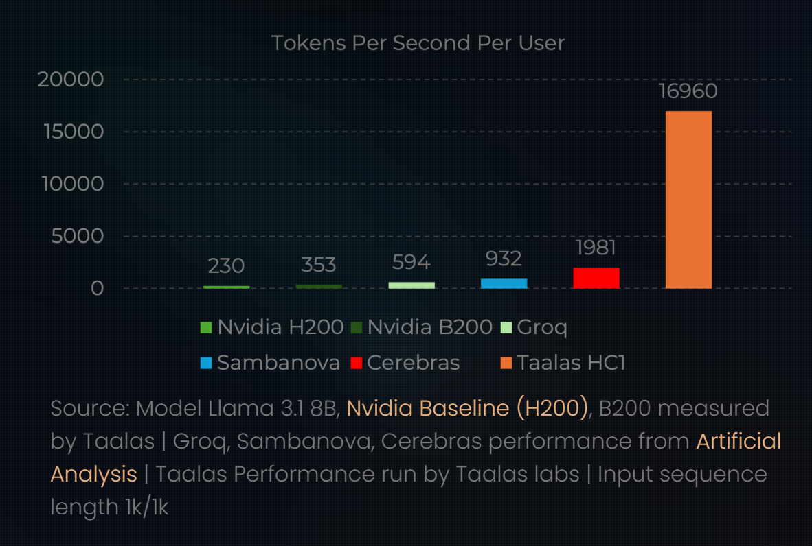
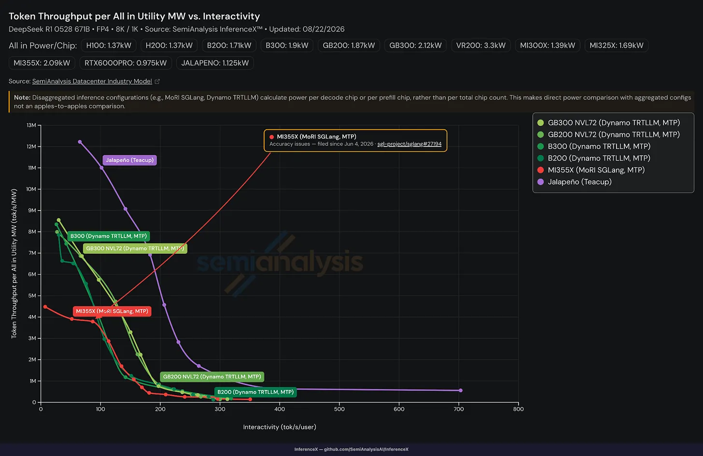
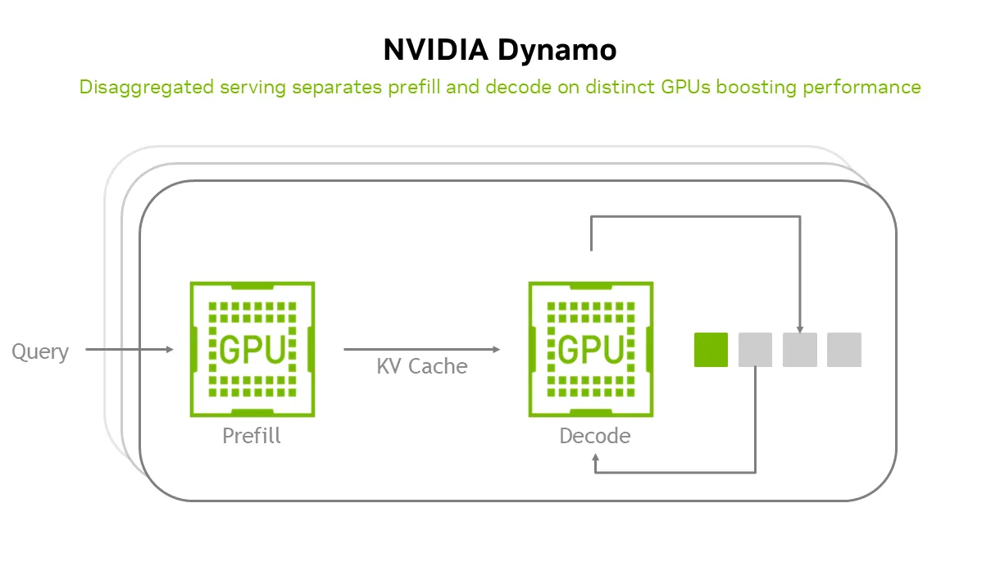
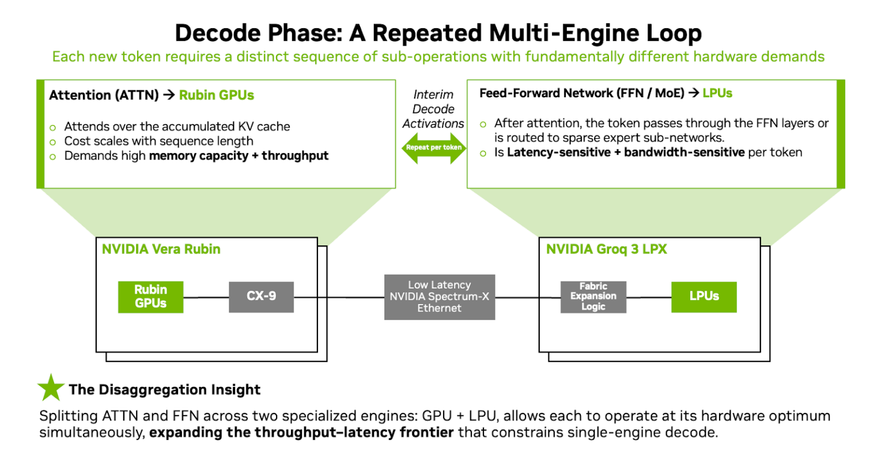
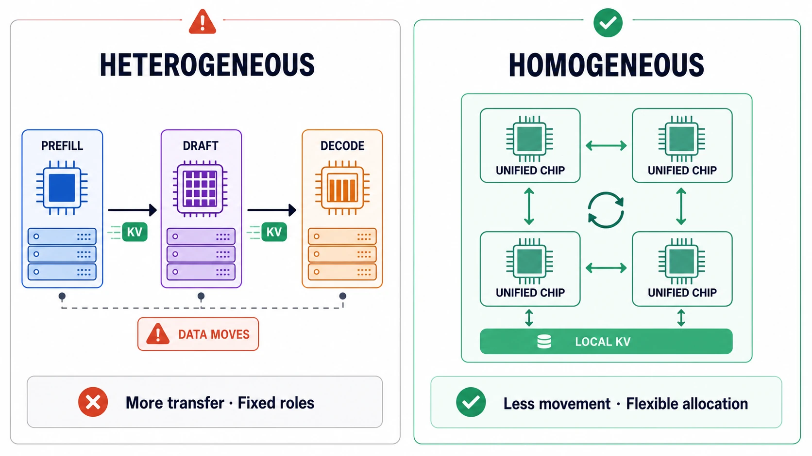
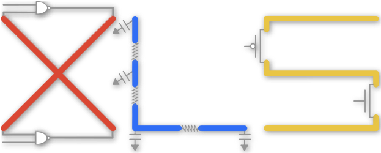

> OpenAI, the company that first brought LLMs to market, has now used an LLM to build a chip.
>
> And apparently, it has built a chip better than NVIDIA's.
>
> In this installment, we look at Jalapeño, the LLM inference accelerator OpenAI unveiled at Hot Chips 2026.

## The Jalapeño Shock

In the early hours of August 26, I was scrolling through LinkedIn before bed when a post kept me awake for the rest of the night.

SemiAnalysis, a semiconductor research firm, had published performance results for Jalapeño, the chip jointly developed by OpenAI and Broadcom.

I already knew that OpenAI was developing a chip, so I had been imagining what it might look like while waiting for the actual silicon to arrive. What was finally revealed went far beyond anything I had imagined.

### A General-Purpose LLM Accelerator, Not a GPT-Specific Chip

My initial assumption was that OpenAI would build a chip optimized for serving its own models so that it could construct AI data center infrastructure beyond the GPU monopoly. Other startups had already gone beyond domain-specific LLM inference accelerators and begun building accelerators specialized for individual models. **Taalas**, a startup recently acquired by AMD, demonstrated this approach by effectively “hardwiring” the weights of Llama 3.1 into read-only memory (ROM), whose high read performance maximizes inference throughput.

*Figure 1. Per-user token throughput comparison between the Taalas HC1 and leading AI accelerators. Source: Taalas*

MoonshotAI's recently released Kimi K3 technical report also included a notable hardware-related detail. Kimi K3 had fully autonomously verified the prototype RTL of a Kimi-specific accelerator, commonly called the KPU, built experimentally by MoonshotAI, and had taken it through layout. I looked into the prototype and found that it structurally incorporated modules specialized for the attention mechanisms used by Kimi K3, including Kimi Delta Attention and Multi-Head Latent Attention.

Although it was only an experimental prototype, these developments made me think that OpenAI might also build an accelerator with an architecture specialized for its own models. A newly developed first-generation chip was unlikely to outperform the GPUs serving frontier models, so the likely strategy seemed to be serving older or relatively lower-performance model architectures on accelerators specialized for those models.

Then Jalapeño's performance was unveiled in both the SemiAnalysis report and the Hot Chips presentation held that same day, and I could not hide my surprise. SemiAnalysis is not only a research firm; it also benchmarks serving performance on the latest GPUs from NVIDIA, AMD, and others. These benchmarks use open-weight models such as Llama and Chinese models. SemiAnalysis published Jalapeño's results from the same benchmark suite. OpenAI had not merely optimized a chip for its internal GPT models. It had built an accelerator that performed well as a general-purpose platform across LLMs.

## Performance Better Than GPUs

*Figure 2. Throughput-latency frontier comparison between Jalapeño and leading GPUs. Source: SemiAnalysis*

Its performance is as remarkable as its versatility. Across the reported metrics, Jalapeño delivered 1.5–4 times the performance of the GB300, the fastest NVIDIA product currently in customer deployments, and surpassed the not-yet-commercially-released Vera Rubin in performance per watt. Even more surprising, the software used for the benchmark had not yet been fully optimized. That makes sense: OpenAI's original objective was not to sell its chip on the market but to install it in its own infrastructure. It therefore had little reason to tune benchmark results for publicity. Even so, Jalapeño outperformed the best current-generation GPUs, whose performance has already been heavily optimized. Let us take a closer look at what that means.

### STP (Single-Token Prediction) vs. MTP (Multi-Token Prediction)

One of the biggest limitations of LLMs is that they emit response tokens one at a time, a process known as single-token prediction (STP). Even if hundreds of thousands of input tokens are processed in parallel, response tokens still have to be generated sequentially, creating a bottleneck. To introduce more parallelism into response generation, speculative decoding has recently gained attention. A relatively small model generates multiple tokens at once through multi-token prediction (MTP), and the main model verifies them in parallel. What stands out in the benchmark is that Jalapeño outperformed a GB300 using MTP even though the benchmark model on Jalapeño did not use MTP. In performance per watt, it also posted a higher result than NVIDIA's latest Vera Rubin product running MTP.

### Disaggregated Systems vs. Homogeneous Systems

*Figure 3. NVIDIA Dynamo's PDD configuration, which separates prefill and decode. Source: NVIDIA*

One of the biggest recent trends in LLM inference serving optimization is prefill-decode disaggregation (PDD). The process of producing tokens in an LLM can be broadly divided into two stages. The prefill stage processes the initial prompt, while the decode stage feeds the first generated token back into the model and then produces subsequent tokens one by one. Because these stages have different computational characteristics, PDD seeks to improve efficiency by separating accelerator clusters designed for prefill from those optimized for decode.

*Figure 4. An AFD configuration that splits attention and FFN computation between GPUs and LPUs. Source: NVIDIA*

NVIDIA has also announced plans for attention-FFN disaggregation (AFD), which breaks the prefill and decode stages down even further. Using LPX clusters built with the Groq LPU introduced in the previous installment, attention computation runs on GPU racks while feed-forward network (FFN) computation, which uses fixed weights, runs on LPX clusters.

However, these disaggregated approaches introduce several serious problems.

First, splitting computation across different racks incurs inter-node communication costs. The KV cache is especially problematic because it occupies so much capacity. PDD provides a straightforward example: the KV cache generated during prefill must also be used during decode. As the input sequence grows longer, the KV cache grows with it, increasing the cost of moving that data.

Another problem is that clusters become fixed around optimization for either prefill or decode. A cluster will likely be designed after determining an optimal configuration for an expected workload, but there is no guarantee that only the expected workload will arrive. An unforeseen workload can make a supposedly optimal cluster configuration suboptimal.

> OpenAI: Why bother with disaggregation? If we can maximize efficiency for both prefill and decode, isn't that enough?

*Figure 5. Data movement and resource allocation in heterogeneous and homogeneous systems*

OpenAI directly challenges the conventional approach to overcome these drawbacks. Its argument is that disaggregation is unnecessary if the system can fully utilize its performance. By allocating resources optimally for each incoming workload, even a homogeneous system can maximize efficiency.

## An AI Chip Built by AI

Now that we have looked at the performance, let us turn to the development process. Large fabless technology companies devote hundreds or even thousands of people to chip development, but OpenAI's initial chip team is estimated to have had only about 20 members. They were undoubtedly some of the world's best engineers, but delivering the company's first chip within this timeline with a team of that size is still an extraordinary achievement. Hardware development took nine months, and it reportedly took less than three more months after receiving the chip to get Codex and ChatGPT running on it. Unsurprisingly, OpenAI says its most powerful tool—AI—played a major role. Let us look at how.

### Hardware Optimization

The development of a digital circuit such as an AI accelerator can be broadly divided into three stages: hardware architecture design -&gt; RTL design -&gt; physical layout. Because register-transfer level (RTL) code describes the register-level organization that determines the chip's physical layout, most performance (**P**erformance), power (**P**ower), and area (**A**rea) metrics—collectively known as **PPA**—are determined at the RTL level. Once the architecture is fixed, engineers therefore need to optimize the RTL for PPA, and this is one of the core capabilities of a hardware engineer. RTL is written in languages such as Verilog and SystemVerilog. Today's AI models have learned these languages well enough that AI-assisted RTL optimization is already common, but the Jalapeño team took a somewhat different approach.

### HLS (High-Level Synthesis)

*Figure 6. The XLS hardware synthesis tool used by the Jalapeño team*

High-level synthesis (HLS)—and specifically XLS, which the Jalapeño team used—does not involve writing SystemVerilog directly. Instead, hardware is described in C code, one level of abstraction above RTL, and the RTL code is then “generated” from it.

> ???: Why go through C instead of optimizing the RTL directly?

I had the same question. For a human designer, generating RTL from C may be more convenient. When designing alongside AI, however, the RTL itself could be supplied directly as input, seemingly allowing the system to optimize it without the extra step. In its presentation, OpenAI argued that “concepts that are easier for humans to understand are also easier for AI to understand,” making optimization easier as well. XLS being a language designed for real hardware development likely contributed, but I found the idea that something easier for AI to understand is also easier for it to optimize particularly striking.

### Software Optimization

OpenAI says it also used AI to perform fully automated software optimization. A new chip needs a software stack tailored to it, and that stack must provide the kernels required to run LLMs on the hardware. When measuring the DeepSeek R1 benchmark, OpenAI had not yet performed any optimization with human intervention, so it handed the entire process over to AI. The AI reportedly succeeded in carrying out most of the optimization on its own.

### The Self-Improvement Loop

The two optimization processes shared a common pattern: turn optimization into a loop, then have AI pass through that loop repeatedly to improve the result. This appears to be an application of Andrej Karpathy's idea of *verifiability* to chip performance optimization.

> When a task is verifiable, it can be optimized directly or through reinforcement learning, allowing a neural network to become exceptionally good at it.
>
> — Andrej Karpathy, *Verifiability*

In other words, the optimization process becomes a verifiable loop through which AI repeatedly improves its own result. OpenAI claims this approach produced greater performance gains than human experts could achieve in both hardware and software optimization.

### What About Anthropic?

While researching this article, I also found reports that Anthropic has begun developing chips. News had already emerged months earlier that a key member of the Jalapeño project had moved to Anthropic, followed by reports that engineers who had worked on TPU development had joined the company. AI companies are now making a serious push to build their own chips and infrastructure. I expect frontier AI companies in China to make similar moves.

## Conclusion

GPUs have dominated the AI semiconductor market through the moat of CUDA. But that moat now appears to be eroding little by little. Or perhaps another moat is being built in its place: **“intelligence.”**

Frontier AI companies do not immediately release their highest-performing models to the public. For safety and other reasons, they may test models internally, provide them only to selected companies as Anthropic did with Fable 5, or release models to consumers with certain capabilities restricted. If so, frontier AI labs hold an **exclusive position: they can use “advanced intelligence” earlier than anyone else, at the greatest “speed,” and “without refinement.”** AI has already surpassed human capability in nearly every field. In this environment, early exclusive access to intelligence may already be building an invisible moat across every knowledge-intensive industry. I do not think I will fall asleep easily tonight either. I will close with a passage I shared on LinkedIn. Thank you, as always, for reading.

> When AI came for the translators, 
> I remained silent. 
> I was not a translator.
>
> Then it came for the artists, 
> and I remained silent. 
> I was not an artist.
>
> Then it came for the developers, 
> and I remained silent. 
> I was not a developer.
>
> When it came for me, 
> no one was left 
> to speak for me.
>
> — Adapted from Martin Niemöller's “First They Came”

### Sources

- [SemiAnalysis - OpenAI Jalapeño: Better Than Nvidia Blackwell](https://newsletter.semianalysis.com/p/openai-jalapeno-better-than-nvidia)
- OpenAI - You Can Just Build ~~Things~~ … Chips (Hot Chips 2026)
- [Taalas - HC1 Technology Demonstrator](https://taalas.com/products/)
- [Moonshot AI - Kimi K3: Open Frontier Intelligence](https://arxiv.org/pdf/2607.24653)
- [NVIDIA Technical Blog - NVIDIA Accelerates OpenAI gpt-oss Models Delivering 1.5 M TPS Inference on NVIDIA GB200 NVL72](https://developer.nvidia.com/blog/delivering-1-5-m-tps-inference-on-nvidia-gb200-nvl72-nvidia-accelerates-openai-gpt-oss-models-from-cloud-to-edge/)
- [NVIDIA Technical Blog - Inside NVIDIA Groq 3 LPX](https://developer.nvidia.com/blog/inside-nvidia-groq-3-lpx-the-low-latency-inference-accelerator-for-the-nvidia-vera-rubin-platform)
- [Google XLS - XLS: Accelerated HW Synthesis](https://google.github.io/xls/)
- [Andrej Karpathy - Verifiability](https://karpathy.bearblog.dev/verifiability/)
