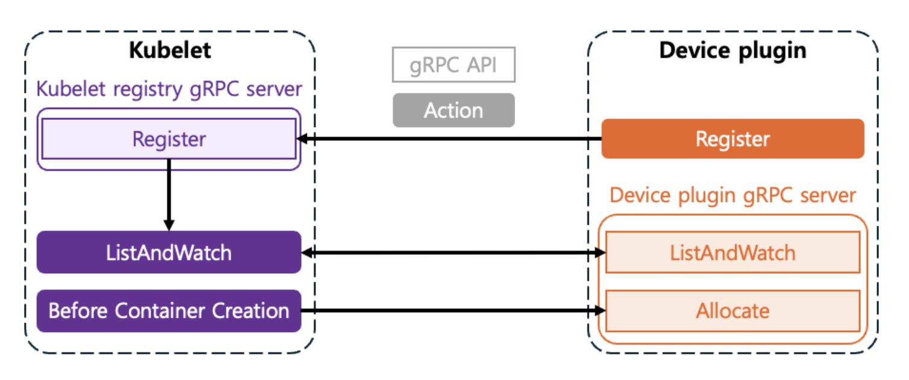
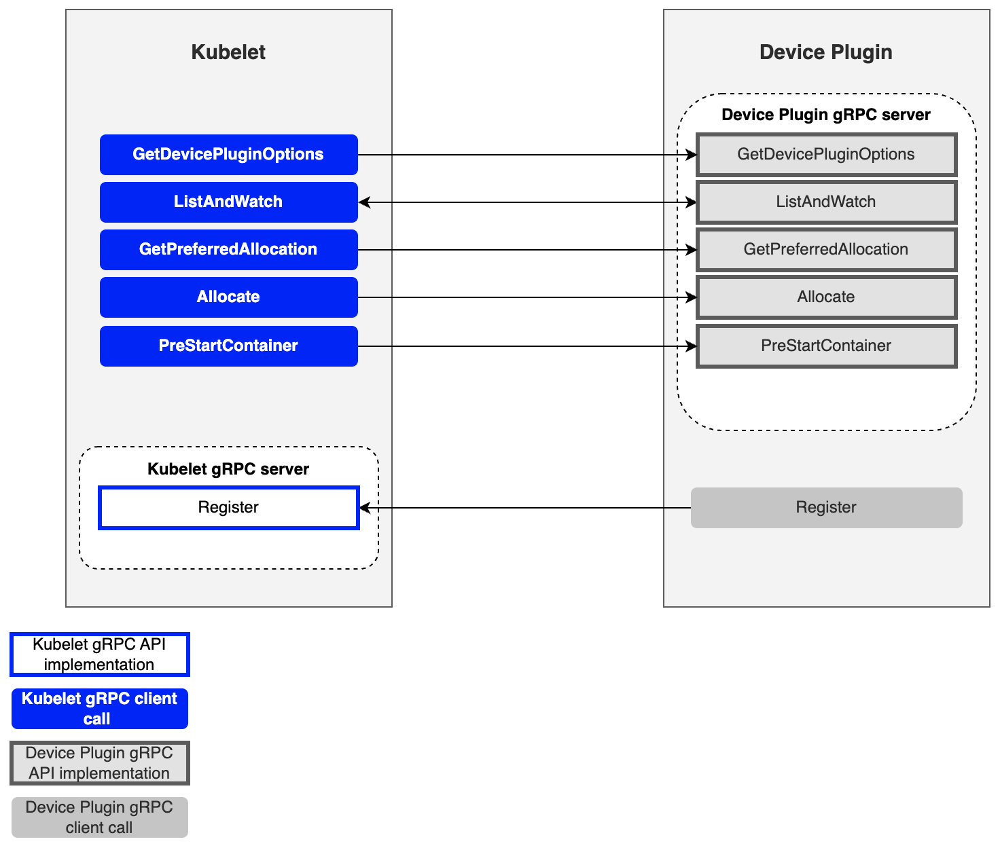
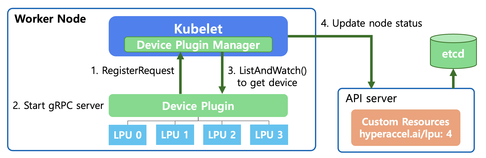
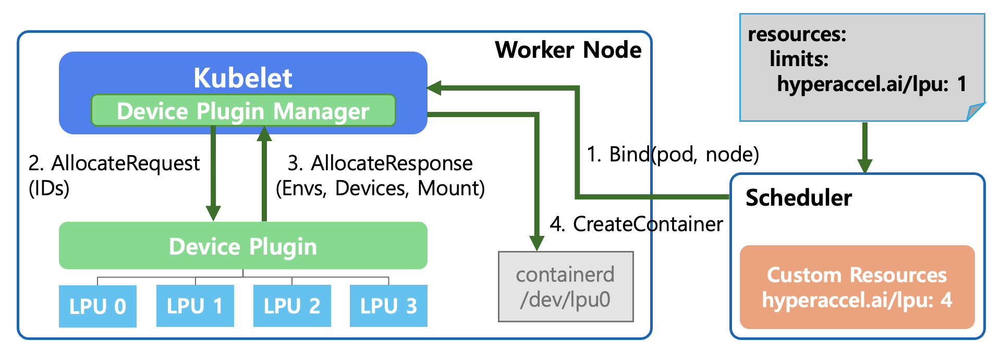
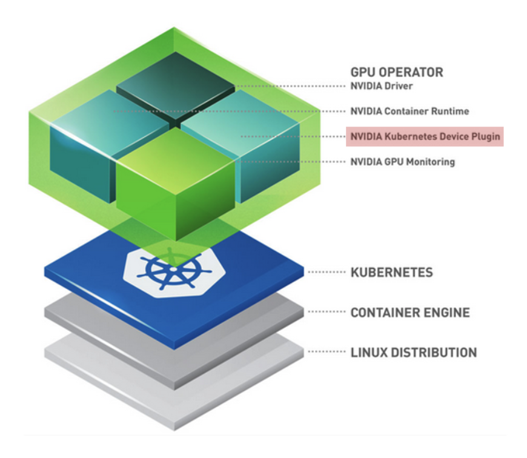
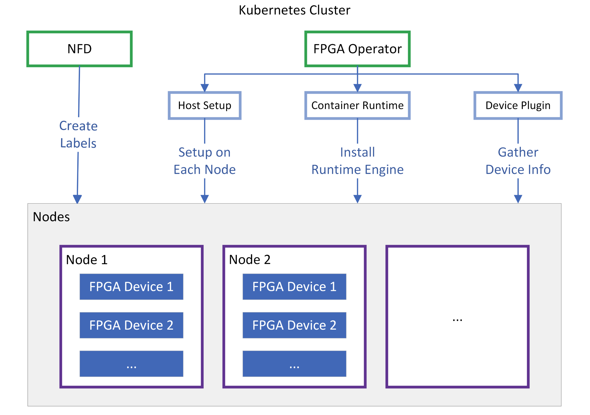
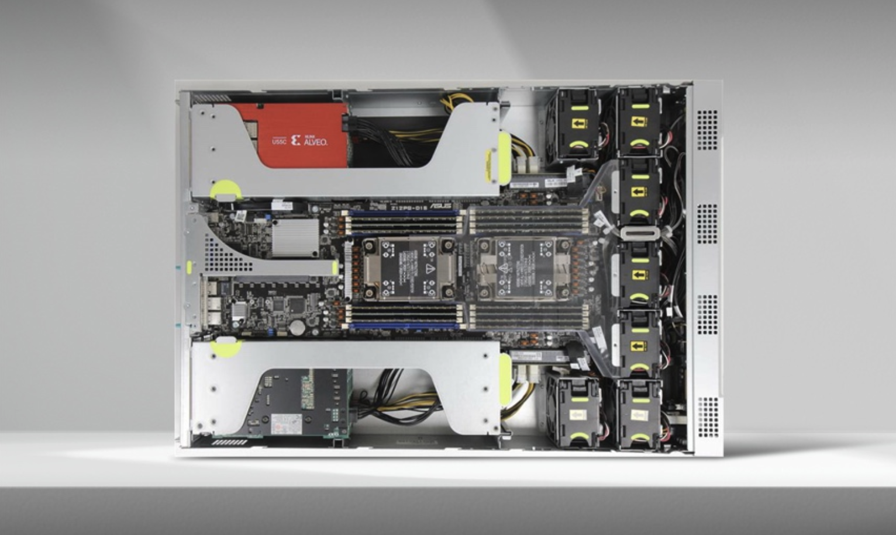
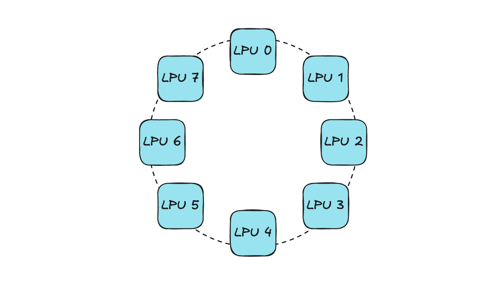
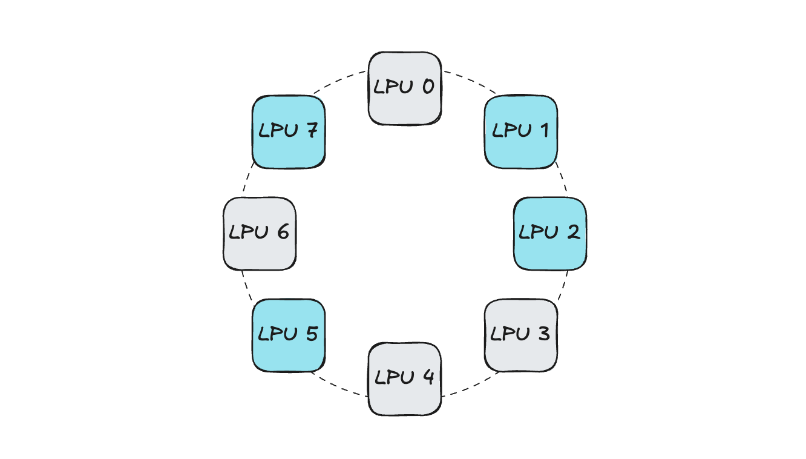

# Kubernetes 기반 사내 개발 환경 구축기 3편: LPU를 위한 Kubernetes Device Plugin

안녕하세요! 저는 HyperAccel ML팀에서 DevOps Engineer로 근무하고 있는 전영훈입니다.

이번 포스팅은 **Kubernetes 기반 사내 개발 환경 구축기** 시리즈의 3번째 글입니다!

1편에서는 Kubernetes를 기반으로 하는 개발 환경 구축의 배경과 전체적인 설계 및 방향에 대해서 살펴보았고, 2편에서는 기존 Self-Hosted Runner의 구조적인 한계를 뛰어넘기 위한 ARC 기반 CI/CD 인프라 설계 전략 수립 및 구축 과정에 대해 소개하였습니다. 3번째 글에서는 **Kubernetes 환경 위에서 Custom Resource 활용 시에 필요한 Device Plugin**에 관련된 내용을 전달하고자 합니다.

하이퍼엑셀은 LLM 추론에 특화된 LPU device를 만드는 회사입니다. Kubernetes 환경 위에서 LPU라는 custom resource를 인식하게 하고 원활한 스케줄링을 돕기 위해서는 LPU를 위해 개발된 Device Plugin이 필요합니다.

이번 글에서는 LPU Device Plugin이라는 키워드를 주제로 아래 내용들에 대해 이야기해보려고 합니다!

우선, Kubernetes Device Plugin의 동작 원리와 구체적인 동작 방식에 대해 설명합니다. 이후에 하이퍼엑셀의 1세대 FPGA 기반 LPU를 위한 device plugin의 개발 과정 및 어떠한 방식으로 제공되고 있는지에 대해 소개합니다. 이어서 곧 출시를 앞둔 ASIC 기반 LPU인 **Bertha**를 위한 device plugin의 개발 과정에 대해 간략하게 소개하겠습니다. 마지막으로는 현재 각광받고 있는 기술인 **DRA(Dynamic Resource Allocation)** 를 소개하고, DRA가 Kubernetes에서 스케줄러 및 Device Plugin과 어떤 연관성이 있는지 설명하겠습니다.

---

## Kubernetes Device Plugin

Kubernetes Device Plugin 프레임워크는 GPU, FPGA, NIC과 같은 custom device들을 **Kubernetes 클러스터에 노출하고 관리할 수 있게 해주는 표준 인터페이스**입니다. 

기본적으로 Kubernetes는 CPU와 메모리 리소스만 인식할 수 있습니다. 따라서 Device Plugin을 적용하지 않는다면 Kubernetes에서 custom device들에 대한 정보가 전혀 없기 때문에 하드웨어 간 구분이 어렵고, device의 상태 체크 혹은 Pod을 스케줄링할 때 기준으로 삼는 것과 같은 동작이 어렵습니다. Device Plugin을 통해 Vendor들이 **Kubernetes 코드를 직접 수정하지 않고도 자신들의 하드웨어를 지원할 수 있게 되었습니다.**

---

### 왜 Device Plugin이 필요한가?

Device Plugin이 제공되기 이전에는 새로운 하드웨어를 지원하기 위해서는 Kubernetes 자체의 소스 코드를 직접 수정해야 했습니다. 이러한 방식은 방대한 양의 Kubernetes 소스 코드의 파악이 필요하기 때문에 유지보수가 어렵고, 새로운 하드웨어에 대해서 매번 코드를 수정해야 하기 때문에 확장성이 떨어지는 방식이었습니다.

정리해보자면,

- 유지보수 용이성 및 확장성 증가: Kubernetes는 **컨테이너 오케스트레이션에만 집중**하고, 하드웨어 제어 로직은 제조사(NVIDIA, AMD, HyperAccel 등)가 만든 Device Plugin이 담당합니다.

- 다양한 하드웨어 지원: GPU 뿐만 아니라 고성능 네트워크(SR-IOV), 암호화 가속기(QAT) 등 다양한 자원을 동일한 방식으로 관리할 수 있습니다.

---

### Device Plugin의 작동 원리 & 워크플로우

Device Plugin은 일반적으로 `DaemonSet`으로 실행되며, 각 노드에서 gRPC 서비스를 통해 `Kubelet`과 통신합니다. `Kubelet`과 Device Plugin의 통신을 통해 device를 인식하게 하는 과정은 아래와 같습니다.



1. **등록 단계 (Registration)**

    - Plugin이 시작되면 노드의 특정 경로(`/var/lib/kubelet/device-plugins/kubelet.sock`)를 통해 `Kubelet`에 자신을 등록합니다.
    
    - *"나는 `hyperaccel.ai/lpu`라는 리소스를 관리하는 plugin이다!"* 라고 `Kubelet`에게 알리는 과정입니다.

2. **목록 확인 및 모니터링 단계 (ListAndWatch)**

    - `Kubelet`은 주기적으로 plugin에게 사용 가능한 디바이스 목록을 요청합니다.
    
    - Plugin은 `ListAndWatch` 메서드를 통해 디바이스의 상태(`Healthy/Unhealthy`)를 실시간으로 모니터링하여 `Kubelet`에 보고합니다.

3. **할당 단계 (Allocate)**

    - 노드 레벨에서는, 사용자가 Pod 스펙에 `resources.limits.hyperaccel.ai/lpu: 1`을 명시하면, 스케줄러는 해당 리소스가 여유 있는 노드에 Pod를 배치합니다. **스케줄러는 Pod이 할당될 노드를 선택하는 역할**을 합니다.

    - 스케줄러를 통해 Pod이 노드에 배치되면, `Kubelet`은 plugin의 `Allocate` 메서드를 호출합니다. Plugin은 해당 컨테이너가 장치에 접근할 수 있도록 필요한 설정(환경 변수, 장치 노드 경로, 볼륨 마운트 등)을 응답합니다.
    
    - **Device Plugin은 노드 내부에서 어떠한 디바이스를 할당할지 선택하는 역할**을 합니다.

지금까지 Device Plugin이 Kubernetes가 디바이스를 인식하도록 Kubelet과 통신을 주고 받는 과정에 대해 살펴보았습니다. 그렇다면 두 컴포넌트가 서로 통신할 때 어떤 인터페이스가 필요할까요? Device Plugin이 Kubelet과 통신할 때 필요한 gRPC 인터페이스를 살펴보겠습니다.

---

### 주요 gRPC 인터페이스



| 메서드 이름 | 역할 |
| --- | --- |
| **GetDevicePluginOptions** | Plugin의 옵션(정기적인 체크포인트 등)을 확인 |
| **ListAndWatch** | 디바이스 목록을 반환하고 상태 변경을 스트리밍 |
| **GetPreferredAllocation** | 선호 조건을 통해 특정 하드웨어가 선택되게끔 유도하는 기능 제공 |
| **Allocate** | 컨테이너 생성 시 특정 하드웨어를 사용하기 위한 설정 제공 |
| **PreStartContainer** | 컨테이너가 시작되기 전 장치를 초기화 (optional) |

다음으로는 실제 pod이 디바이스를 요청하는 과정에서 Device Plugin을 비롯한 Kubernetes 내부 컴포넌트들이 어떤 과정을 통해 디바이스를 pod에게 할당하는지 설명하겠습니다.

---

### Pod에게 디바이스가 할당되는 과정

하이퍼엑셀의 LPU를 예시로 설명하겠습니다.

#### 노드에서 사용 가능한 LPU 탐지

우선, Kubernetes 레벨에서 Device Plugin과 상호작용하여 `API Server`와 `Kubelet`이 어떻게 새로운 디바이스를 탐지하고 모니터링하는지에 대해 설명하겠습니다.



1. **RegisterRequest (디바이스 등록 요청)**

    - Device Plugin이 실행되면 Unix Domain Socket을 통해 `Kubelet`의 Device Plugin Manager에게 plugin을 등록합니다.
    
    - *"이 노드에는 `hyperaccel.ai/lpu`라는 자원이 있으니 내가 관리하겠다"* 라고 알리는 과정입니다.

2. **Start gRPC server (통신 서버 시작)**

    - Device Plugin은 `Kubelet`과 통신하기 위해 gRPC 서버를 구동합니다. 이를 통해 `Kubelet`은 장치의 상태를 묻거나 장치를 할당(Allocate) 해달라는 요청을 보낼 수 있게 됩니다.

3. **ListAndWatch (장치 목록 확인 및 감시)**

    - `Kubelet`은 Device Plugin의 ListAndWatch() 함수를 호출합니다.
    
    - 이 과정에서 Device Plugin은 하단에 연결된 LPU를 탐지하고, 이들의 상태(Healthy/Unhealthy)를 `Kubelet`에 보고합니다. 해당 연결은 계속 유지되어 장치에 문제가 생기면 즉시 알립니다.

4. **Update node status (노드 상태 업데이트)**

    - `Kubelet`은 확인된 LPU 자원 정보(예: `hyperaccel.ai/lpu: 4`)를 `API Server`에 전달합니다.
    
    - `API Server`는 이 정보를 etcd에 기록합니다.
    
    - 이제 클러스터 전체가 *"해당 노드에서 LPU 4개를 사용할 수 있다"* 는 사실을 알게 됩니다.

이제 사용자가 pod를 생성할 때 YAML 파일에 아래와 같이 요청하면, Kubernetes Scheduler가 해당 노드로 pod를 배치할 수 있게 됩니다.

```yaml
# User Pod YAML file

resources:
  limits:
    hyperaccel.ai/lpu: 1  # LPU 1개 요청
```

---

#### Pod의 요청에 맞는 적절한 LPU 선택 및 할당

위 과정을 통해 Kubernetes 레벨에서 LPU라는 새로운 디바이스를 사용할 준비가 완료되었다면, 이제 실제 할당 과정에 대해 살펴볼 필요가 있습니다. 사용자가 YAML 파일에 *"LPU 1개가 필요해"* 라고 선언했을 때, Kubernetes 내부적으로 어떤 동작이 일어나는지 단계별로 설명하겠습니다.



1. **Bind(pod, node) - Pod 스케줄링**

    - 사용자가 `PodSpec`에 `hyperaccel.ai/lpu: 1`을 요청합니다.
    
    - **Kubernetes Scheduler**는 전체 노드 중 IDLE 상태인 LPU가 있는 노드를 탐색합니다.
    
    - 조건에 맞는 worker node를 선택하고, *"해당 pod을 지정된 노드에 배치해!"* 라고 명령(Bind)합니다.

2. **AllocateRequest (할당 요청)**

    - `Kubelet`은 자신에게 배정된 pod을 실행하는데 LPU가 필요함을 확인합니다.
    
    - `Kubelet` 내부의 Device Plugin Manager가 Device Plugin에게 *"LPU 1개가 필요하니 쓸 수 있게 준비해줘"* 라고 요청합니다. 이때 사용할 특정 LPU의 ID(예: LPU 0)를 함께 전달합니다.

3. **AllocateResponse (할당 응답)**

    - Device Plugin은 해당 LPU를 컨테이너에서 사용할 수 있도록 필요한 설정 정보들을 `Kubelet`에 응답합니다.
    
      - **Envs**: 컨테이너 안에서 참조할 환경 변수
      - **Devices**: 컨테이너가 접근해야 할 장치 경로 (예: `/dev/lpu0`)
      - **Mount**: 필요한 라이브러리나 드라이버 파일의 마운트 경로

4. **CreateContainer (컨테이너 생성)**

    - `Kubelet`은 받은 정보를 바탕으로 컨테이너 런타임(containerd)에 컨테이너 생성을 요청합니다.
    
    - 이때 containerd는 설정된 대로 호스트의 `/dev/lpu0` 디바이스를 컨테이너 내부로 연결하여, 최종적으로 실행된 pod이 LPU 하드웨어에 직접 접근할 수 있게 됩니다.

결과적으로 사용자는 복잡한 하드웨어 설정 과정을 몰라도, 단지 YAML 파일에 `limits: hyperaccel.ai/lpu: 1`이라는 한 줄만 추가함으로써 새로운 디바이스인 LPU를 안전하고 격리된 환경에서 사용할 수 있게 되는 것입니다!

---

## Device Plugin Examples

지금까지 Kubernetes Device Plugin이 **무엇이고, 왜 필요하고, 어떤 과정을 통해 디바이스를 감지하고 할당하는지** 살펴보았습니다. 본격적으로 LPU를 위한 Device Plugin을 살펴보기 전에, 대표적인 vendor인 NVIDIA와 AMD에서 제공하는 Device Plugin을 예시로 살펴보겠습니다.

---

### NVIDIA GPU Device Plugin



NVIDIA Cloud-Native Toolkit Stack Layer에서 볼 수 있듯이, NVIDIA는 GPU 활용을 위해 계층화된 구조를 제시합니다.

- Linux Distribution: 호스트 OS 레벨

- Container Engine (Docker/containerd): 컨테이너 실행 환경

- Kubernetes: Pod 스케줄링 및 관리

- **GPU Operator (Top Layer)**: 이 모든 과정을 자동화하는 운영 도구로, 그 핵심 구성 요소 중 하나가 바로 **NVIDIA Device Plugin**입니다.

NVIDIA GPU Operator는 **자원 노출(Expose Resources), 상태 모니터링(Health Check), 장치 할당 및 격리(Device Allocation & Isolation)** 와 같은 Device Plugin의 기본 기능을 전부 지원하면서도 다음과 같은 확장성을 가집니다.

| 특징 | 설명 |
| --- | --- |
| **MIG(Multi-Instance GPU) 지원** | MIG 기능을 통해 하나의 물리 GPU를 여러 개의 가상 GPU로 나누어 관리할 수 있음 |
| **생태계 통합** | Prometheus(모니터링), Grafana(시각화)와 연동되는 `dcgm-exporter`와 긴밀하게 작동 |
| **운영 자동화** | GPU Operator를 통해 드라이버 설치부터 플러그인 배포까지 한 번에 관리하는 현대적인 패턴으로 제공 |

---

### AMD Xilinx Device Plugin

Xilinx는 제공하는 디바이스인 FPGA를 Kubernetes 환경에서 원활하게 사용할 수 있도록 지원하기 위해 **Node Feature Discovery(NFD)와 FPGA Operator를 융합**하여 활용합니다.



NFD는 각 노드를 스캔하여 *"이 노드에는 어떤 Xilinx 카드가 꽂혀 있는가?"* 를 파악하고, 노드에 label을 생성합니다. FPGA는 모델명뿐만 아니라 장착된 Shell 버전, PCIe 정보 등이 매우 중요하기 때문에, 스케줄러가 FPGA 모델이나 특정 기능 지원 여부를 보고 pod를 배치할 수 있도록 기초 데이터를 제공합니다.

NFD가 노드에 label을 생성했다면, FPGA Operator는 이를 기반으로 노드를 READY 상태로 만듭니다.

| 컴포넌트 | 설명 |
| --- | --- |
| Host Setup | 각 노드에 XRT(Xilinx Runtime) 드라이버와 펌웨어를 자동으로 설치 |
| Container Runtime | 컨테이너 내에서 `xbutil` 같은 도구를 사용하거나 FPGA 자원에 접근할 수 있도록 전용 런타임 엔진을 구성 |
| **Device Plugin** | 최종적으로 `xilinx.com/fpga`와 같은 가상 자원을 `API Server`에 보고 |

하이퍼엑셀의 1세대 LPU는 Xilinx의 FPGA를 기반으로 합니다. 즉, 전술한 Xilinx Device Plugin을 적용해야만 Kubernetes 환경에서 LPU를 활용할 수 있습니다.

하지만, Xilinx Device Plugin을 그대로 적용하여 실제 서버 환경에서 사용하기는 기능적인 한계가 있기 때문에 어렵습니다. 어떤 한계점이 있고 저희는 어떻게 이를 극복했을까요? 이제 본격적으로 저희가 어떻게 LPU를 위한 Device Plugin을 구현했는지 설명해보겠습니다.

---

## HyperAccel LPU를 위한 Kubernetes Device Plugin

[하이퍼엑셀의 1세대 LPU](https://hyperaccel.ai/ha_product/forte-55x/)는 FPGA(Field-Programmable Gate Array) 위에 설계되었고, Xilinx Alveo U55C 디바이스를 기반으로 하고 있습니다.

Xilinx에서 [Xilinx FPGA Device Plugin](https://github.com/Xilinx/FPGA_as_a_Service/tree/master/k8s-device-plugin)을 오픈소스로 제공하고 있습니다. 이를 활용하여 클러스터에 `Daemonset` 형태로 plugin을 배포하면, Kubernetes에서 FPGA를 리소스 하드웨어로 인식하고 스케줄링의 대상을 선택할 수 있습니다. FPGA는 `amd.com/xilinx_u55c_gen3x16_xdma_base_3-0`와 같은 이름을 가지고 인식됩니다.

---

### 기존 Xilinx Device Plugin 적용의 어려움

현재 하이퍼엑셀은 FPGA 기반 LPU를 탑재한 오리온(Orion) 서버를 제공하며, 오리온 서버 하나에는 8개의 LPU 디바이스가 장착됩니다.



이때 8개의 LPU는 **Ring-Topology** 형태로 연결됩니다.



기존 Xilinx FPGA Device Plugin에서는 단순하게 *"현재 노드에 IDLE 디바이스의 개수가 현재 pod이 요청하는 디바이스 개수보다 많은가?"* 의 정보만 전달할 수 있기 때문에 스케줄러는 이를 기준으로 pod이 할당될 노드를 선택하게 됩니다. 이때 **device topology를 고려하지 않고 할당해준다면, 연결성 문제가 발생할 수 있습니다.**

예시와 함께 살펴보겠습니다. Pod이 요청하는 오리온 서버 내부 LPU 개수가 4개라고 가정해보겠습니다. 디바이스 할당 요청이 오면 Device Plugin은 `Kubelet`에게 IDLE한 디바이스 목록을 전달하고, `Kubelet`에서는 이를 기반으로 **랜덤하게 디바이스를 선택**하게 됩니다.



이러한 상황에서 위 예시처럼 연결성이 고려되지 않고 디바이스가 선택된다면,

- 4개의 LPU가 서로 연결되어 있지 않기 때문에 분산 추론과 같은 동작이 어렵습니다. (Gradient 동기화 불가)

- 향후에 4개의 LPU를 가진 pod이 스케줄링을 요청하는 상황이 발생하는 경우, 똑같은 문제가 발생합니다. (IDLE 디바이스 개수는 만족되어 스케줄링되지만, 디바이스 간 연결성이 없음)

이렇게 된다면 물론 여러 LPU를 활용하는 분산 작업이 어려울 뿐만 아니라 오리온 서버 내부에 자원 파편화가 발생하기 때문에 서버 차원에서 utilization이 감소하게 됩니다.

이러한 한계점으로 인해 오리온 서버를 활용한 내부 개발 및 테스트 환경과 외부 PoC 환경에서는 LPU를 1개 혹은 전부 할당해주는 방법만 적용할 수 있었습니다. 이렇듯 `1 or ALL` 방식으로 할당하게 되면, Kubernetes 환경 위에서 멀티 디바이스로 개발 혹은 테스트가 필요한 상황에서 오리온 서버 하나에서 개발자 여러 명이 작업하기 어려운 상황에 봉착하게 됩니다. 해당 문제를 극복하여 **Kubernetes 기반 개발 환경에서 보다 유연한 디바이스 활용을 위해 자체적으로 Orion Device Plugin을 개발**하였습니다.

---

### Orion Device Plugin

Orion Device Plugin은 기존 Xilinx Device Plugin의 기능에 **Topology-Aware 할당 기능**을 추가한 컴포넌트입니다.

사내에서 개발한 [HyperDex-Toolchain](https://docs.hyperaccel.ai/1.5.4/hyperdex_toolchain/)을 활용하면 오리온 서버 내 LPU의 연결성을 보여주는 **network table**을 추출할 수 있습니다. Pod에서 요청한 LPU의 개수와 network table에서 추출한 오리온 서버의 IDLE 상태인 LPU의 연결성을 기반으로 최적의 디바이스 할당 조합을 결정합니다. Device Plugin에서 앞서 설명한 `GetPreferredAllocation` 함수를 통해 해당 목록을 `Kubelet`으로 전달하면, `Kubelet`은 이를 기반으로 Pod에게 LPU를 할당합니다.

개발한 컴포넌트를 활용해서 현재 아래와 같은 경로에서 오리온 서버를 다양하게 사용하고 있습니다.

- Kubernetes 기반 사내 개발 환경에서 FPGA 개발자에게 완전 격리된 오리온 서버 내부 LPU를 제공합니다. 즉, **오리온 서버 하나에서 여러 명의 개발자가 디바이스 간섭 없이 동시에 작업**할 수 있습니다.

- 오리온 서버를 기반으로 실행되는 하이퍼엑셀 Chat Demo 시에 여러 모델을 같은 오리온 서버에서 동시에 서빙할 수 있습니다.

- 고객사 PoC를 진행할 때, 만약 Kubernetes 환경 위에서 테스트 해보고 싶은 니즈가 있다면 Device Plugin을 함께 제공합니다.

---

### Bertha Device Plugin

하이퍼엑셀의 차세대 ASIC chip인 [Bertha](https://koreajoongangdaily.joins.com/news/2026-03-18/business/industry/Korean-startup-targets-Nvidiadominated-AI-inference-market-with-2027-chip-launch/2546587)가 곧 시장에 공개될 예정입니다!

Bertha는 완전히 새로운 하이퍼엑셀의 독자적인 ASIC chip이기 때문에 Kubernetes 환경에서 활용하기 위해서는 Device Plugin을 비롯한 NFD, Metric Exporter와 같은 컴포넌트들이 모두 포함된 `Bertha Operator`의 개발이 필요합니다. 현재 Bertha를 위한 Cloud-Native Software Stack에 대해 **ML팀 김남윤([Author](https://hyper-accel.github.io/authors/namyoon-kim/), [LinkedIn](https://www.linkedin.com/in/namyoon-kim-67730b132/))님**과 함께 개발을 진행하고 있습니다.

---

## DRA in Kubernetes

지금까지 Kubernetes에서 새로운 디바이스를 활용하기 위해 꼭 필요한 컴포넌트인 Device Plugin에 대해 소개하고, 현재 하이퍼엑셀 개발 환경에서 이를 어떻게 활용하고 있는지 살펴보았습니다. 하지만, Device Plugin에도 일부 한계점이 존재합니다.

### Kubernetes Device Plugin의 한계점

Device Plugin을 통한 하드웨어 관리는 다음과 같은 한계점이 있습니다.

- **정적 할당**: 리소스 할당 방식이 단순히 **요청하는 디바이스의 개수** 기반입니다.

- **복잡한 설정 부족**: 하드웨어의 세부 설정(예: GPU 분할, 메모리 대역폭 설정 등)을 pod 요청 시점에 동적으로 반영하기 어렵습니다.

- **리소스 공유의 어려움**: 여러 pod이 하나의 자원을 유연하게 나누어서 사용하는 시나리오 구현이 복잡합니다.

### DRA(Dynamic Resource Allocation)

기존 Device Plugin 한계점을 극복하고 GPU, FPGA와 같은 커스텀 하드웨어 자원을 기존보다 훨씬 유연하고 세밀하게 관리하기 위해 새로 도입된 프레임워크인 Kubernetes DRA가 활발하게 활용되고 있습니다.

DRA는 **마치 스토리지(PVC/PV)를 사용하는 것과 유사한 방식으로 하드웨어 자원을 요청하고 할당받을 수 있게 설계**되었습니다. 쉽게 말해, 과거에는 *"LPU 1개 주세요"* 라고만 할 수 있었다면, DRA를 통해서는 *"특정 모델 추론에 최적화된 설정의 LPU를 동적으로 할당해주세요"* 와 같은 훨씬 복잡한 요청을 할 수 있게 된 것입니다.

### DRA의 핵심 구성 요소

DRA는 리소스를 정의하고 요청하는 방식을 **자원 할당(Allocation)**과 **사용(Usage)**으로 명확히 분리합니다.

| 구성 요소 | 설명 |
| --- | --- |
| **ResourceClaim** | 사용자가 필요한 자원(예: "16GB 이상의 GPU 1개")을 정의하고 요청하는 객체 (PVC와 유사) |
| **ResourceClass** | 자원의 종류와 이를 처리할 드라이버를 정의 (StorageClass와 유사) |
| **ResourceSlice** | 각 노드에 실제 존재하는 디바이스의 세부 정보(모델, 용량, 상태 등)를 담고 있는 데이터 단위 |
| **DRA Driver** | 특정 하드웨어 Vendor가 제공하는 플러그인으로, 실제 하드웨어 준비 및 할당을 담당 |

### Device Plugin vs DRA

| 특징 | Device Plugin | DRA |
| --- | --- | --- |
| **리소스 모델** | 정수 기반 (예: `hyperaccel.ai/lpu: 1`) | 객체 기반 (ResourceClaim) |
| **파라미터 전달** | 매우 제한적 (Annotation 활용 등) | 매우 자유로움 (Custom 파라미터 지원) |
| **스케줄링** | 단순 개수 체크 | 복잡한 제약 조건 반영 가능 |
| **라이프사이클** | Pod 실행 시점에 고정 | Pod와 독립적으로 할당/해제 가능 |

2025년 하반기 출시된 **Kubernetes v1.34를 기점으로 DRA의 주요 기능들이 정식 버전(GA, General Availability)으로 전환**되었습니다. 이에 따라 최신 클라우드 환경(GKE, EKS 등)이나 온프레미스 AI 클러스터에서 NVIDIA GPU 등의 가속기 관리를 위해 표준적으로 채택되고 있는 추세입니다.

**하이퍼엑셀에서도 이에 발 맞추어 Kubernetes 환경에서 DRA를 활용한 Bertha의 사용을 지원할 수 있도록 준비하고 있습니다!**

---

## 정리하자면...

이번 글에서는 **Kubernetes 기반 개발 환경 구축기** 시리즈 중 3번째 내용인 Kubernetes Device Plugin이 무엇인지, 하이퍼엑셀의 LPU를 Kubernetes 환경에서 활용하기 위한 Device Plugin의 개발 과정, 그리고 보다 유연하게 자원을 할당하는 기술인 DRA에 대해 소개드렸습니다.

시장 경쟁력이 있는 LPU를 위해서는 HW 레벨에서 잘 설계하는 것도 중요하지만, 최적화된 SW 스택이 반드시 동반되어야 합니다. 가장 보편적으로 사용되고 있는 Kubernetes 환경 위에서 LPU의 원활한 사용을 지원하는 것은 chip 성공의 중요한 과제입니다!

저희 ML팀의 DevOps 파트에서는 하이퍼엑셀 LPU의 잠재적인 고객분들을 위한 Cloud-Native Toolkit 소프트웨어를 개발하고 있습니다. 이러한 소프트웨어의 기반이 되는 Device Plugin, DRA와 같은 컴포넌트를 통해 컴퓨팅 노드 내부에서 원활하게 LPU를 할당할 수 있도록 지원해야 합니다.

끝까지 읽어주셔서 감사합니다!

---

## 추신: HyperAccel은 채용 중입니다!

HyperAccel은 LLM 가속 ASIC 칩 출시를 위해 모든 구성원들이 열심히 달리고 있습니다! HW, SW뿐만 아니라 추론 AI 기술을 전체적으로 다루는 회사로, 모든 방면에 걸쳐 뛰어난 인재들이 함께 일하고 있습니다. 멋진 동료들과 같이 일하며 한 분야에 국한된 것이 아닌 폭넓은 지식을, 심지어 깊게 배우며 지식을 공유하고 빠른 속도로 함께 성장하고 있습니다!

저희 **ML팀의 DevOps 파트**는 사내 개발자들의 생산성 증대를 위한 개발 환경 제공 및 관리 업무와 함께 LPU chip의 클라우드 레벨 활용을 효과적으로 지원하기 위한 Cloud-Native Toolkit을 개발하고 있습니다.

HyperAccel에서 다루는 기술들을 보시고, 관심이 있으시다면 [HyperAccel Career](https://hyperaccel.career.greetinghr.com/ko/guide)를 통해 지원해 주세요!

## Reference

- [Kubernetes 1.26: Device Manager graduates to GA](https://kubernetes.io/blog/2022/12/19/devicemanager-ga/)
- [NVIDIA Device Plugin](https://github.com/nvidia/k8s-device-plugin)
- [AMD Xilinx Device Plugin](https://github.com/Xilinx/FPGA_as_a_Service/tree/master/k8s-device-plugin)
- [Dynamic Resource Allocation](https://kubernetes.io/docs/concepts/scheduling-eviction/dynamic-resource-allocation/)
