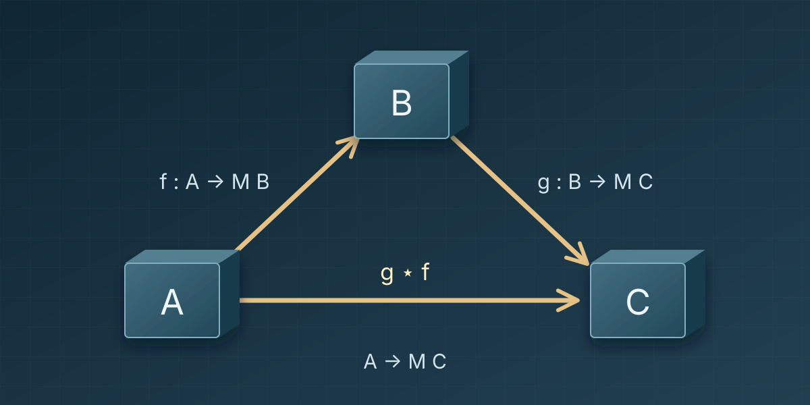
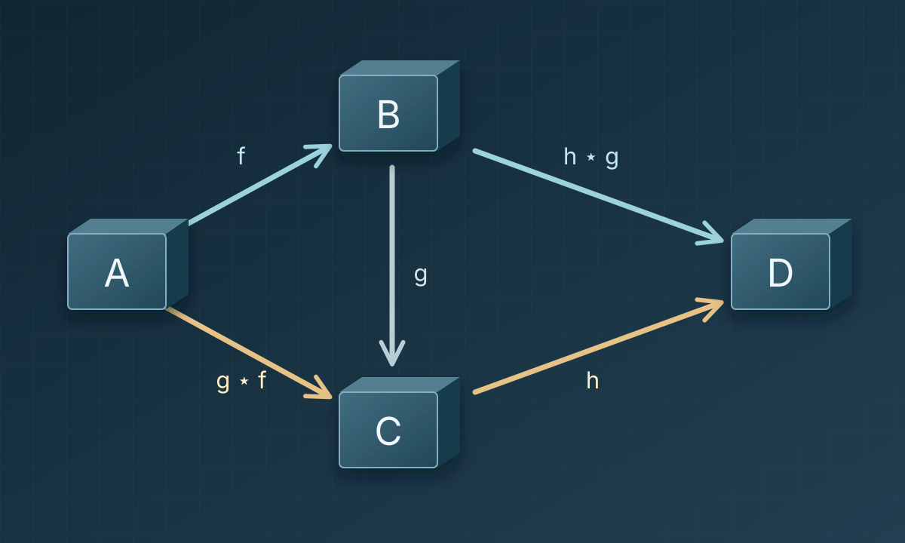
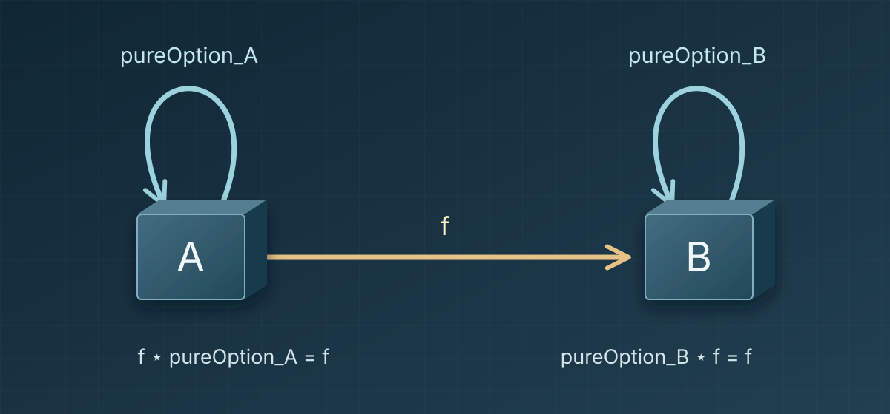
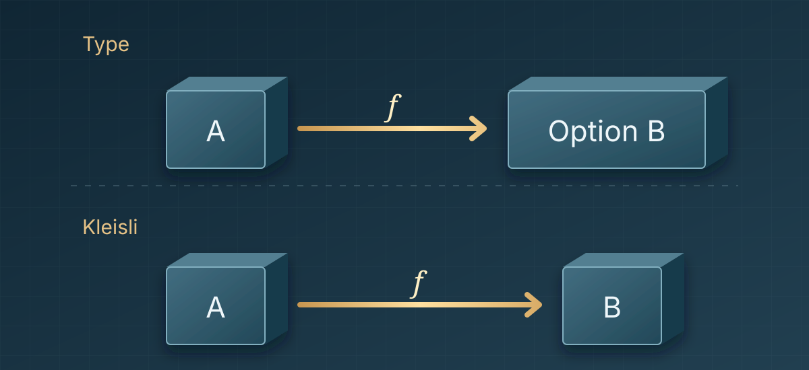

Hello, I am Jaeho Choi from the Compiler team at HyperAccel.

In part 1, we used `Option.bind` to define `composeOption`, an operation that joins two functions. `composeOption f g` applies `f` to its input and passes the result, together with `g`, to `Option.bind`. If that result is `none`, `Option.bind` returns `none`; if it is `some b`, it computes `g b`. We can therefore replace `f` and `g` with any functions of the right types without rewriting the check for an absent value each time.

Does this approach work only for `Option` and missing values? Here we will build `composeList`, a composition operation for functions that return `List`.

Putting `composeOption` and `composeList` side by side will reveal a similar shape beneath their different ways of handling results. We will then ask what laws these operations need when we connect several functions, and prove those laws for `composeOption` in Lean 4. Finally, we will see whether the arrows and composition we built form a **category**.

---

## 1. Connecting functions that return several results

Consider a function that splits a string on spaces into a list of words, and another that turns one word into a list of characters. We want to connect them so that `"hi ok"` yields `['h', 'i', 'o', 'k']`: find the words, find each word's characters, then concatenate the results in order.

Call the first function $f$ and the second $g$:

~~~text
f : String → List String   -- split a string into words
g : String → List Char     -- turn a word into characters
~~~

Ordinary function composition runs into the same problem we saw in part 1.

~~~text
g (f sentence)  -- type error: g expects String, not List String
~~~

$f$ returns a **list of words**, `List String`, while $g$ accepts **one word**, a `String`. Merely checking whether a value exists will not connect them. We need to apply $g$ to every word in the list and collect its results.

Let us make the functions concrete in Lean. We define `splitWords` and give `String.toList` the name `wordChars`. These are the $f$ and $g$ above.

~~~lean
def splitWords (s : String) : List String := s.splitOn " "
def wordChars : String → List Char := String.toList

#eval splitWords "hi ok"   -- ["hi", "ok"]
#eval wordChars "hi"       -- ['h', 'i']
#eval wordChars "ok"       -- ['o', 'k']
~~~

First, we can connect them by matching on the list directly. An empty list leaves no words to process, so we return `[]`. Otherwise, we obtain the first word's characters and concatenate them with the characters from the remaining words. This resembles the split between `none` and `some` for `Option` in part 1.

~~~lean
def sentenceCharsByMatch (sentence : String) : List Char :=
  let rec collect (words : List String) : List Char :=
    match words with
    | [] => []
    | word :: rest => wordChars word ++ collect rest
  collect (splitWords sentence)

#eval sentenceCharsByMatch "hi ok" -- ['h', 'i', 'o', 'k']
~~~

`word :: rest` is a list with first word `word` and remaining words `rest`. The operator `++` concatenates two lists, and `collect rest` applies the same rule to the remaining words. For `"hi ok"`, processing the two words eventually reaches `collect []`, which ends the recursion.

The code computes the result we want. But, as with `runOption` in part 1, `collect` mixes an *individual computation* (`wordChars`) with a *rule for connecting results* (`++`). To use another `String → List Char` function, such as `reverseWordChars`, we would have to edit the body of `collect`.

In part 1, we separated the rule “stop if there is no value; otherwise pass it to the next function” into `Option.map` and `Option.join`, then used `Option.bind` to perform both steps in `composeOption`. Let us similarly split up the work of `collect`. First, `List.map` applies `wordChars` to every word.

~~~lean
#eval (splitWords "hi ok").map wordChars
-- [['h', 'i'], ['o', 'k']]
~~~

The result of `map` contains all the characters we need, but its type is `List (List Char)`, not the desired `List Char`. We still have to concatenate the inner lists in order.

Lean calls this operation `List.flatten`. Applying it to the result of `map` gives the desired character list.

~~~lean
#eval ((splitWords "hi ok").map wordChars).flatten
-- ['h', 'i', 'o', 'k']
~~~

`map` applied `wordChars` to each word; `flatten` concatenated the resulting lists. We have carried out separately the two jobs that were combined in `collect`.

---

## 2. The common shape behind two computations

Now compare `Option` from part 1 with the `List` computation above. In both cases, `map` creates a nested result, although the operation that removes one layer differs.

| Kind of computation | Return type | Nested result | How to remove one layer |
|---|---|---|---|
| **Possible absence (`Option`)** | $A \to \text{Option } B$ | `Option (Option C)` | `none` becomes `none`; `some result` yields the inner `result` |
| **Multiple results (`List`)** | $A \to \text{List } B$ | `List (List C)` | Concatenate the inner lists in order |

In part 1, for `m : Option B` and `g : B → Option C`, we found `(m.map g).join = m.bind g`.

For `List`, Lean's `List.flatMap` similarly combines `map` followed by `flatten`. For any `xs : List B` and `h : B → List C`, we have `(xs.map h).flatten = xs.flatMap h`.

The two computations remove nesting differently, but both apply the next function and then merge one layer of results. Just as we defined `composeOption` with `Option.bind`, let us define `composeList` with `List.flatMap`.

~~~lean
def composeList {A B C : Type}
    (f : A → List B) (g : B → List C) : A → List C :=
  fun x => (f x).flatMap g

#eval composeList splitWords wordChars "hi ok"
-- ['h', 'i', 'o', 'k']
~~~

To discuss `composeOption` and `composeList` together, let $M$ stand for either `Option` or `List`. We will use the notation $g \star f$ from part 1 in both cases: when $M$ is `Option`, it means `composeOption f g`; when $M$ is `List`, it means `composeList f g`.

Consider $f : A \to M B$ and $g : B \to M C$ in this notation. Ordinary composition $g \circ f$ would evaluate `g (f a)` on input `a`. But `f a` has type `M B`, while $g$ expects a `B`; the expression is ill typed. The new composition $g \star f$ instead passes `f a` to `bind` or `flatMap` along with $g$. `Option` passes its value to $g$ when one exists, and `List` passes each element to $g$. Thus `(g ⋆ f) a : M C`. **Two functions that ordinary composition could not connect now form one function of type `A → M C`.**

Let us draw **arrows** according to this new composition. A function `A → M B` is an arrow from $A$ to $B$, and `B → M C` is an arrow from $B$ to $C$. We choose $B$ as the destination of the first arrow because that is the type accepted by the next function. Their composite also has the form `A → M C`, so it is an arrow from $A$ to $C$.

In our example, `splitWords : String → List String` returns a list whose elements (`String`) can be passed to `wordChars : String → List Char`. In the arrow notation we just chose, we can therefore draw `splitWords` from `String` to `String`, and `wordChars` from `String` to `Char`.

The diagram shows the same relationship for either choice of $M$.

Call a sequence of composable arrows a **path**. Its length is the number of arrows it contains, so a single arrow is a path of length one. In the diagram, $f$ followed by $g$ is a path of length two; the lower arrow $g \star f$ is its composite. Because this composite has type `A → M C`, we can append $h : C \to M D$ and apply the same operation again.

Having defined $g \star f$ for two arrows, we would like to write the result for three as $h \star g \star f$. But $\star$ combines only two arrows at a time, so we must first choose a pair. Combining $f$ and $g$ gives $h \star (g \star f)$; combining $g$ and $h$ gives $(h \star g) \star f$. If these differ, the unparenthesized expression $h \star g \star f$ does not name a unique composite unless we specify a grouping. Let us ask when the two results coincide.

---

## 3. Associativity: does the grouping change the computation?

Consider a path of three arrows, with the following function types:

~~~text
f : A → M B
g : B → M C
h : C → M D
~~~

Joining $f$ and $g$ first gives $g \star f : A \to M C$; joining $g$ and $h$ first gives $h \star g : B \to M D$. The diagram includes both choices.

The upper path $A \to B \to D$ groups $g$ and $h$ first, producing $(h \star g) \star f$. The lower path $A \to C \to D$ groups $f$ and $g$ first, producing $h \star (g \star f)$. Both perform $f$, $g$, and $h$ in the same order; they differ only in which portion is composed first.

If the two results agree, we can treat $h \star g \star f$ as one composite arrow without specifying the grouping. This requirement is **associativity**. When the upper and lower paths give the same arrow, we say the diagram **commutes**.

~~~text
h ⋆ (g ⋆ f) = (h ⋆ g) ⋆ f
~~~

As a concrete example, append `duplicateChar : Char → List Char`, which repeats a character, to `splitWords` and `wordChars`. If we compose `splitWords` with `wordChars` first, we gather all characters and then repeat each one. If we compose `wordChars` with `duplicateChar` first, we repeat the characters within each word and then collect the results. Let us compare both computations on `"hi ok"`.

~~~lean
def duplicateChar (c : Char) : List Char := [c, c]

#guard composeList (composeList splitWords wordChars) duplicateChar "hi ok"
    == ['h', 'h', 'i', 'i', 'o', 'o', 'k', 'k']
#guard composeList splitWords (composeList wordChars duplicateChar) "hi ok"
    == ['h', 'h', 'i', 'i', 'o', 'o', 'k', 'k']
~~~

The two expressions agree on `"hi ok"`. This execution alone cannot establish associativity for every choice of functions and input.

If associativity holds, three arrows in the same order give the same result regardless of which pair we compose first. Applying the law repeatedly extends this to four, five, or any finite number of arrows: parentheses do not change the composite. In programming terms, we may move a consecutive group of steps into a helper function and insert that helper back into the original sequence without changing the whole computation.

---

## 4. Identity laws: what does “do nothing” mean?

So far, every path has contained at least one arrow. A path with one arrow has that arrow as its composite. For longer paths, we repeatedly compose arrows; if associativity holds, the grouping does not matter. What should be the composite of an **empty path** that starts at $A$ and traverses no arrows?

For ordinary function composition, the answer is `id_A : A → A`, which returns its input unchanged. Composing `id_A` before a function $p : A \to B$, or `id_B` after it, leaves $p$ unchanged:

~~~text
p ∘ id_A = p
id_B ∘ p = p
~~~

Our new composition also needs an arrow with this role at each type $A$. But `fun x => x` has type `A → A`, not the `A → Option A` type required of an `Option` arrow. A candidate for `Option` is `fun x => some x`. For `List`, a candidate is `fun x => [x]`, which turns one input into exactly one result. Returning `[]` would discard the input before the next computation; returning `[x, x]` would run that computation twice. Neither preserves it.

We will call the functions that place an ordinary value into these result types `pureOption` and `pureList`:

- **Candidate identity arrow for Option**: `pureOption x = some x`
- **Candidate identity arrow for List**: `pureList x = [x]`

For $f : A \to \text{Option } B$, the candidates on its two sides are $\text{pureOption}_A : A \to \text{Option } A$ and $\text{pureOption}_B : B \to \text{Option } B$. Both equations must hold for our new composition $\star$:

~~~text
f ⋆ pureOption_A = f    -- wrap first, then run f
pureOption_B ⋆ f = f    -- run f, then wrap its result
~~~

In our arrow notation, they look like this:

The loops `pureOption_A` and `pureOption_B` each start and end at the same object. Traversing the loop at $A$ before $f$, or the loop at $B$ after $f$, must yield the same composite as $f$ itself. These are the two **identity laws**. When they hold, the loops can serve as the composites of the empty paths at $A$ and $B$.

For `List`, let us check both directions using `wordChars : String → List Char`. Wrapping `"hi"` with `pureList` yields `["hi"]`. Applying `flatMap wordChars` to that one-element list returns `wordChars "hi"`, or `['h', 'i']`. Putting `pureList` before the computation has left this result unchanged.

In the opposite direction, running `wordChars "hi"` first yields `['h', 'i']`. Wrapping each character with `pureList` produces `[['h'], ['i']]`; concatenating these lists gives `['h', 'i']` again. Putting `pureList` after the computation also preserves the result. The same reasoning applies to empty and longer result lists: each element is wrapped once and then concatenated. Absence and multiplicity are different kinds of computation, but each needs a way to preserve a computation on both sides of composition.

Like $0$ for addition or $1$ for multiplication, `pureOption` and `pureList` provide an element that leaves their respective compositions unchanged.

---

## 5. From checking examples to proving the laws

In section 3, we compared two `List` composites on one input. In section 4, we chose candidate identity arrows for `Option` and `List`. Associativity and the identity laws, however, must hold for arbitrary types, functions, and inputs. Let us return to the `Option` composition from part 1 and prove its laws. An `Option` result is either `none` or `some b`, so we can inspect those two cases.

First, we repeat the definition of `composeOption` and define its candidate identity arrow `pureOption`.

~~~lean
-- Option composition and its candidate identity arrow
def composeOption {A B C : Type}
    (f : A → Option B) (g : B → Option C) : A → Option C :=
  fun x => (f x).bind g

def pureOption {A : Type} (x : A) : Option A :=
  some x
~~~

### 5.1. Associativity: the two groupings define the same function

In the notation of section 2, `composeOption f g` is $g \star f$. The two sides of the theorem group the first two functions and the last two functions, respectively. This is a statement that the resulting **functions themselves** are equal, beyond checking a particular input.

~~~lean
-- Associativity
-- h ⋆ (g ⋆ f) = (h ⋆ g) ⋆ f
theorem composeOption_assoc {A B C D : Type}
    (f : A → Option B) (g : B → Option C) (h : C → Option D) :
    composeOption (composeOption f g) h = composeOption f (composeOption g h) := by
  funext x
  unfold composeOption
  cases f x with
  | none => rfl
  | some b => rfl
~~~

`funext x` applies function extensionality: two functions are equal if they return the same result for every input `x`. We unfold `composeOption`, then split the first result `f x` into its `none` and `some b` cases with `cases f x`.

If it is `none`, both groupings return `none`. If it is `some b`, both groupings stop when `g b` is absent and pass its value to `h` when one is present. Evaluating the two branches of `Option.bind` makes the sides equal, so `rfl` closes each case.

### 5.2. Identity laws: inserting an identity leaves a function unchanged

First, connect `pureOption` after `f`. In composition notation, `pureOption ⋆ f = f`; this is called the left identity law.

~~~lean
-- Left identity
-- pure ⋆ f = f
theorem composeOption_left_id {A B : Type} (f : A → Option B) :
    composeOption f pureOption = f := by
  funext x
  unfold composeOption pureOption
  cases f x with
  | none => rfl
  | some b => rfl
~~~

When `f x` is `none`, it remains `none`; when it is `some b`, `pureOption b` returns `some b` again. Both cases preserve the original result.

What about running `pureOption` first, then connecting `f`?

~~~lean
-- Right identity
-- f ⋆ pure = f
theorem composeOption_right_id {A B : Type} (f : A → Option B) :
    composeOption pureOption f = f := by
  funext x
  unfold composeOption pureOption
  rfl
~~~

`pureOption x` is always `some x`, so unfolding composition immediately gives `f x`. This time no case split is needed.

These three theorems are more than checks on selected inputs. They prove the laws for every type and function admitted by the declarations. We could prove the general laws for `List` as well, but that requires induction over list traversal and concatenation. Here we focus on the three `Option` laws.

You can run the [complete example and proofs in the Lean 4 Playground](https://live.lean-lang.org/#code=--%20%EB%AA%A8%EB%82%98%EB%93%9C%EC%99%80%20%EB%B2%94%EC%A3%BC%EB%A1%A0%20%E2%91%A1%20%EB%8B%A4%EB%A5%B8%20%EA%B3%84%EC%82%B0%2C%20%EA%B0%99%EC%9D%80%20%ED%95%A9%EC%84%B1%0A--%20Lean%204.32.1.%20%EB%B3%84%EB%8F%84%EC%9D%98%20%EB%9D%BC%EC%9D%B4%EB%B8%8C%EB%9F%AC%EB%A6%AC%20%EC%97%86%EC%9D%B4%20%EC%8B%A4%ED%96%89%EB%90%A9%EB%8B%88%EB%8B%A4.%0A%0Adef%20splitWords%20%28s%20%3A%20String%29%20%3A%20List%20String%20%3A%3D%20s.splitOn%20%22%20%22%0Adef%20wordChars%20%3A%20String%20%E2%86%92%20List%20Char%20%3A%3D%20String.toList%0A%0A%23eval%20splitWords%20%22hi%20ok%22%20%20%20--%20%5B%22hi%22%2C%20%22ok%22%5D%0A%23eval%20wordChars%20%22hi%22%20%20%20%20%20%20%20--%20%5B%27h%27%2C%20%27i%27%5D%0A%23eval%20wordChars%20%22ok%22%20%20%20%20%20%20%20--%20%5B%27o%27%2C%20%27k%27%5D%0A%0Adef%20sentenceCharsByMatch%20%28sentence%20%3A%20String%29%20%3A%20List%20Char%20%3A%3D%0A%20%20let%20rec%20collect%20%28words%20%3A%20List%20String%29%20%3A%20List%20Char%20%3A%3D%0A%20%20%20%20match%20words%20with%0A%20%20%20%20%7C%20%5B%5D%20%3D%3E%20%5B%5D%0A%20%20%20%20%7C%20word%20%3A%3A%20rest%20%3D%3E%20wordChars%20word%20%2B%2B%20collect%20rest%0A%20%20collect%20%28splitWords%20sentence%29%0A%0A%23eval%20sentenceCharsByMatch%20%22hi%20ok%22%20--%20%5B%27h%27%2C%20%27i%27%2C%20%27o%27%2C%20%27k%27%5D%0A%0A%23eval%20%28splitWords%20%22hi%20ok%22%29.map%20wordChars%0A--%20%5B%5B%27h%27%2C%20%27i%27%5D%2C%20%5B%27o%27%2C%20%27k%27%5D%5D%0A%0A%23eval%20%28%28splitWords%20%22hi%20ok%22%29.map%20wordChars%29.flatten%0A--%20%5B%27h%27%2C%20%27i%27%2C%20%27o%27%2C%20%27k%27%5D%0A%0Adef%20composeList%20%7BA%20B%20C%20%3A%20Type%7D%0A%20%20%20%20%28f%20%3A%20A%20%E2%86%92%20List%20B%29%20%28g%20%3A%20B%20%E2%86%92%20List%20C%29%20%3A%20A%20%E2%86%92%20List%20C%20%3A%3D%0A%20%20fun%20x%20%3D%3E%20%28f%20x%29.flatMap%20g%0A%0A%23eval%20composeList%20splitWords%20wordChars%20%22hi%20ok%22%0A--%20%5B%27h%27%2C%20%27i%27%2C%20%27o%27%2C%20%27k%27%5D%0A%0Adef%20duplicateChar%20%28c%20%3A%20Char%29%20%3A%20List%20Char%20%3A%3D%20%5Bc%2C%20c%5D%0A%0A%23guard%20composeList%20%28composeList%20splitWords%20wordChars%29%20duplicateChar%20%22hi%20ok%22%0A%20%20%20%20%3D%3D%20%5B%27h%27%2C%20%27h%27%2C%20%27i%27%2C%20%27i%27%2C%20%27o%27%2C%20%27o%27%2C%20%27k%27%2C%20%27k%27%5D%0A%23guard%20composeList%20splitWords%20%28composeList%20wordChars%20duplicateChar%29%20%22hi%20ok%22%0A%20%20%20%20%3D%3D%20%5B%27h%27%2C%20%27h%27%2C%20%27i%27%2C%20%27i%27%2C%20%27o%27%2C%20%27o%27%2C%20%27k%27%2C%20%27k%27%5D%0A%0A--%20Option%EC%9D%98%20%ED%95%A9%EC%84%B1%EA%B3%BC%20%ED%95%AD%EB%93%B1%20%ED%99%94%EC%82%B4%ED%91%9C%20%ED%9B%84%EB%B3%B4%0Adef%20composeOption%20%7BA%20B%20C%20%3A%20Type%7D%0A%20%20%20%20%28f%20%3A%20A%20%E2%86%92%20Option%20B%29%20%28g%20%3A%20B%20%E2%86%92%20Option%20C%29%20%3A%20A%20%E2%86%92%20Option%20C%20%3A%3D%0A%20%20fun%20x%20%3D%3E%20%28f%20x%29.bind%20g%0A%0Adef%20pureOption%20%7BA%20%3A%20Type%7D%20%28x%20%3A%20A%29%20%3A%20Option%20A%20%3A%3D%0A%20%20some%20x%0A%0A--%20%EA%B2%B0%ED%95%A9%EB%B2%95%EC%B9%99%20%28associativity%29%0A--%20h%20%E2%8B%86%20%28g%20%E2%8B%86%20f%29%20%3D%20%28h%20%E2%8B%86%20g%29%20%E2%8B%86%20f%0Atheorem%20composeOption_assoc%20%7BA%20B%20C%20D%20%3A%20Type%7D%0A%20%20%20%20%28f%20%3A%20A%20%E2%86%92%20Option%20B%29%20%28g%20%3A%20B%20%E2%86%92%20Option%20C%29%20%28h%20%3A%20C%20%E2%86%92%20Option%20D%29%20%3A%0A%20%20%20%20composeOption%20%28composeOption%20f%20g%29%20h%20%3D%20composeOption%20f%20%28composeOption%20g%20h%29%20%3A%3D%20by%0A%20%20funext%20x%0A%20%20unfold%20composeOption%0A%20%20cases%20f%20x%20with%0A%20%20%7C%20none%20%3D%3E%20rfl%0A%20%20%7C%20some%20b%20%3D%3E%20rfl%0A%0A--%20%EC%A2%8C%EC%B8%A1%20%ED%95%AD%EB%93%B1%EB%B2%95%EC%B9%99%20%28left%20identity%29%0A--%20pure%20%E2%8B%86%20f%20%3D%20f%0Atheorem%20composeOption_left_id%20%7BA%20B%20%3A%20Type%7D%20%28f%20%3A%20A%20%E2%86%92%20Option%20B%29%20%3A%0A%20%20%20%20composeOption%20f%20pureOption%20%3D%20f%20%3A%3D%20by%0A%20%20funext%20x%0A%20%20unfold%20composeOption%20pureOption%0A%20%20cases%20f%20x%20with%0A%20%20%7C%20none%20%3D%3E%20rfl%0A%20%20%7C%20some%20b%20%3D%3E%20rfl%0A%0A--%20%EC%9A%B0%EC%B8%A1%20%ED%95%AD%EB%93%B1%EB%B2%95%EC%B9%99%20%28right%20identity%29%0A--%20f%20%E2%8B%86%20pure%20%3D%20f%0Atheorem%20composeOption_right_id%20%7BA%20B%20%3A%20Type%7D%20%28f%20%3A%20A%20%E2%86%92%20Option%20B%29%20%3A%0A%20%20%20%20composeOption%20pureOption%20f%20%3D%20f%20%3A%3D%20by%0A%20%20funext%20x%0A%20%20unfold%20composeOption%20pureOption%0A%20%20rfl%0A).

---

## 6. Different computations, the same rules: categories and Kleisli categories

`Option` stops when a value is absent; `List` concatenates multiple results. Yet both compositions we built take a function of the form `A → M B` as an arrow and produce another arrow of that form. We also examined the associativity and identity laws needed to compose several such arrows.

This resemblance is no accidental coding pattern. The details of the computation differ, but a common structure remains: **which arrows we use, how we compose them, and which laws the composition obeys**. Mathematics calls these arrows **morphisms** and calls a structure of objects, morphisms, composition, and identity morphisms satisfying those laws a **category**. Let us state the definition and see how our proven `Option` composition fits it.

- **Objects**: a collection of things from which morphisms start and at which they end.
- **Morphisms**: for every pair of objects $A,B$, a collection $\mathrm{Hom}\_{\mathcal C}(A,B)$ of morphisms from $A$ to $B$. We write a member $f$ as $f : A \to B$; every morphism has a specified source and target.
- **Composition**: for $f \in \mathrm{Hom}\_{\mathcal C}(A,B)$ and $g \in \mathrm{Hom}\_{\mathcal C}(B,C)$, a morphism $g \circ f \in \mathrm{Hom}\_{\mathcal C}(A,C)$.
- **Identity morphisms**: for each object $A$, a designated $\mathrm{id}\_A \in \mathrm{Hom}\_{\mathcal C}(A,A)$. This is the morphism assigned to the empty path at $A$.

The data must satisfy these laws for $f : A \to B$, $g : B \to C$, and $h : C \to D$:

~~~text
h ∘ (g ∘ f) = (h ∘ g) ∘ f    -- associativity
f ∘ id_A = f                  -- right identity
id_B ∘ f = f                  -- left identity
~~~

We say “collection” rather than “set” because the objects of a category cannot always be gathered into a single set. For this series, though, thinking of the objects and morphisms as sets will suffice.

Keeping the objects while changing the morphisms, composition, or identities can give us a different category. We will compare two categories whose objects are types in Lean's `Type`. Objects need not be types, and morphisms need not be functions, in an arbitrary category.

### 6.1. The category $\mathbf{Type}$ of types and ordinary functions

- **Objects**: types $A,B,C,\dots$ in Lean's `Type`.
- **Morphisms**: $\mathrm{Hom}\_{\mathbf{Type}}(A,B)$ consists of functions `f : A → B`.
- **Composition**: join `f : A → B` and `g : B → C` as `g ∘ f : A → C`, evaluating `g (f a)` on input `a`.
- **Identity morphism**: `id_A : A → A` at each type $A$, returning its input unchanged.

These data satisfy the category laws. Whichever pair we compose first among three functions, the result on input `a` is `h (g (f a))`. Composing `id_A` or `id_B` with $f$ changes no output. We will write this category as $\mathbf{Type}$.

### 6.2. The Kleisli category for `Option`

Now keep the same types as objects but use the `Option` arrows and composition we built. Temporarily call the resulting category $K$.

- **Objects**: the same types $A,B,C,\dots$.
- **Morphisms**: $\mathrm{Hom}\_K(A,B)$ consists of functions `f : A → Option B`. We may write them as $A \to_K B$.
- **Composition**: join `f : A → Option B` and `g : B → Option C` as `composeOption f g`, or $g \star f : A \to \text{Option } C$, evaluating `(f a).bind g` on input `a`.
- **Identity morphism**: `pureOption_A : A → Option A` at each type $A$, wrapping `a` as `some a`.

Writing $A \to_K B$ does not change the actual return type of the function, which remains `Option B`. The diagram shows the difference: the very same function `f : A → Option B` is a morphism from $A$ to `Option B` in $\mathbf{Type}$, but a morphism from $A$ to $B$ in the new category.

The theorems `composeOption_assoc`, `composeOption_left_id`, and `composeOption_right_id` in section 5 prove the associativity and both identity laws for arbitrary types and functions. Therefore, these data form a category. We call `composeOption` **Kleisli composition** and the resulting category the **Kleisli category** of `Option`.

Choosing `List` instead gives a separate Kleisli category with the same types as objects, functions `A → List B` as morphisms, `composeList` as composition, and `pureList` as identity. We do not mix `Option` and `List` morphisms within one of these categories. For example, `f : A → Option B` and `g : B → List C` cannot be passed directly to either `composeOption` or `composeList`. Here we proved the laws for `Option` in Lean 4 and left the general proof for `List` aside.

---

## 7. The next question: describing a type without inspecting its internals

In part 3, we will return to $\mathbf{Type}$, whose morphisms are ordinary functions `A → B`. The category definition above says nothing about a type's fields or how many values it contains. Yet in programming, we make types that hold two values together, as in a `struct`, or one of several alternatives, as in an `enum`. Can we describe these types by the relationships among functions entering and leaving them, rather than by their internal representation?

We will start with functions into the two fields of a `struct` and functions that handle each case of an `enum`. Given such functions, we will ask when there is **exactly one** compatible morphism. A condition that describes an object by the existence and uniqueness of a morphism is called a **universal property**. Types with the same universal property are isomorphic: inverse functions connect them, even if their internal implementations differ.
