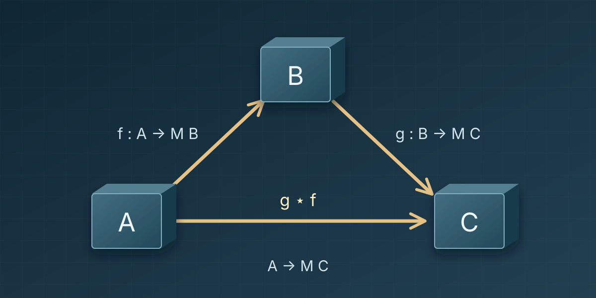
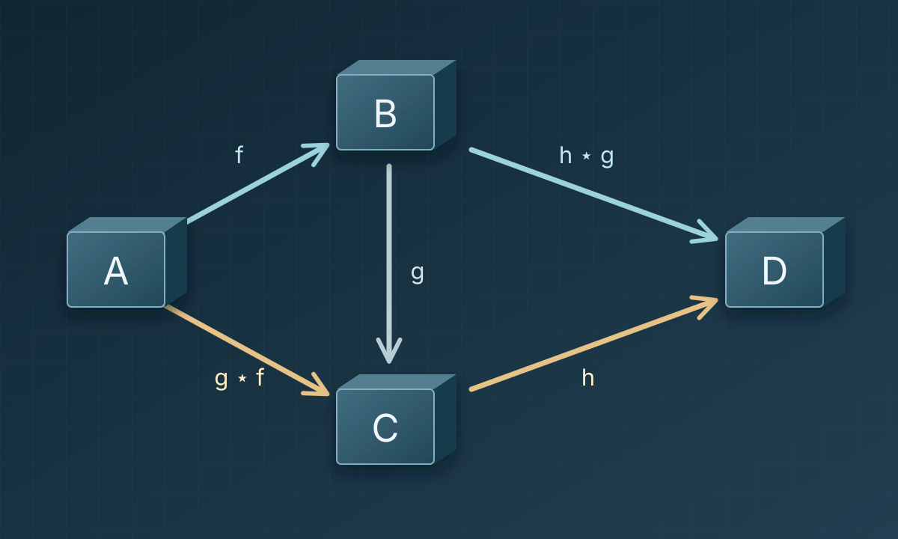
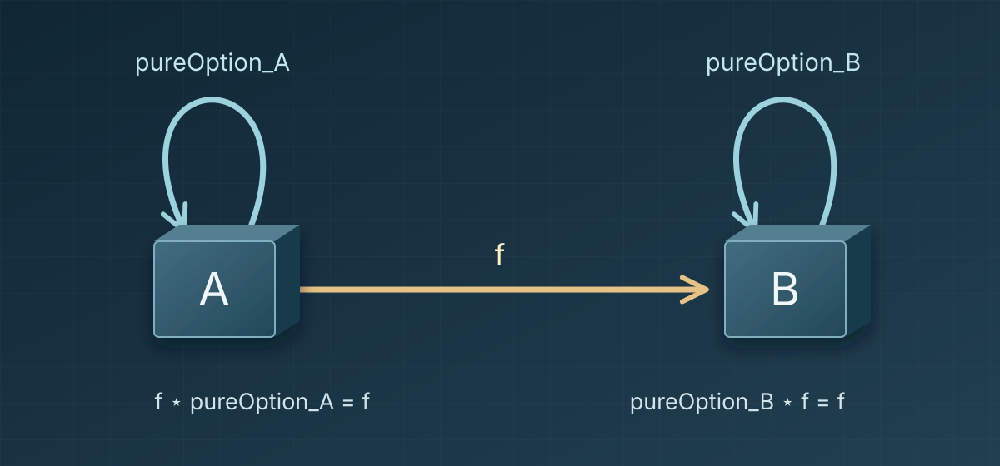
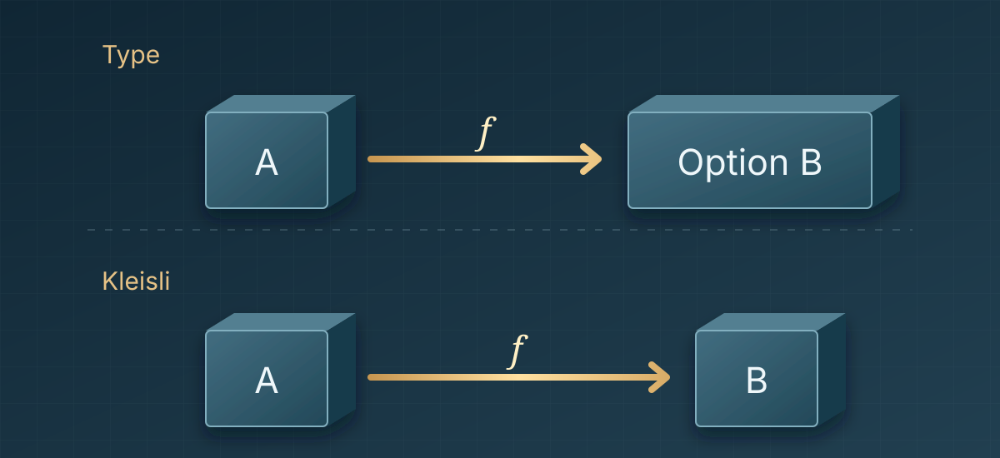

안녕하세요, HyperAccel Compiler팀 최재호입니다.

1편에서는 값이 없을 수 있는 두 함수를 잇는 `composeOption`을 정의했습니다. 첫 함수의 결과와 다음 함수를 연결하는 일은 `Option.bind`에 맡겼습니다. 이렇게 합성한 결과도 `Option`을 반환하는 함수이므로, 그 뒤에 다른 함수를 다시 이어 붙일 수 있습니다. 값의 부재를 다루면서도, 작은 함수들을 합쳐 더 큰 함수를 만드는 방식을 이어 갈 수 있게 된 것입니다.

그런데 이 방법은 값의 부재, 즉 `Option`을 처리하는 데에만 쓸 수 있을까요? 이번에는 `List`를 반환하는 두 함수를 잇는 합성 연산 `composeList`를 만들어 보겠습니다.

두 합성에서 공통으로 남는 형태를 찾은 뒤에는, 함수들을 더 길게 이어 붙여 보겠습니다. 같은 순서의 계산을 어느 구간부터 묶어도 결과가 같으려면, 또 아무 단계도 수행하지 않는 경우까지 다루려면 무엇이 필요할까요? 이 질문에서 결합법칙과 항등법칙을 도입하고, `composeOption`이 두 법칙을 만족하는 이유를 Lean 4로 확인하겠습니다. 마지막에는 이렇게 만든 구조를 **범주**(category)의 정의에 맞춰 읽어 보겠습니다.

---

## 1. 여러 결과를 돌려주는 함수 잇기

예를 들어 문자열을 공백으로 나누어 단어들의 목록으로 바꾸는 함수와, 단어 하나를 문자 목록으로 바꾸는 함수가 있다고 해 봅시다. 이 두 함수를 연결해 `"hi ok"`에서 `['h', 'i', 'o', 'k']`를 얻고 싶습니다. 먼저 단어들을 구하고, 각 단어의 문자를 구한 뒤 순서대로 이어 붙이는 것입니다.

첫 함수를 $f$, 두 번째 함수를 $g$라고 하면 타입은 다음과 같습니다.

~~~text
f : String → List String   -- 문자열을 공백으로 나눔
g : String → List Char     -- 단어를 문자 목록으로 바꿈
~~~

두 함수를 보통의 함수 합성으로 연결하려 하면, 1편에서 만났던 문제가 다시 나타납니다.

~~~text
g (f sentence)  -- 컴파일 에러: List String을 String 자리에 넣을 수 없음
~~~

$f$가 돌려주는 것은 **단어들의 목록**인 `List String`인데, $g$가 받는 것은 **단어 하나**인 `String`입니다. 이번에는 값이 있는지 확인하는 것만으로는 연결할 수 없습니다. 목록에 들어 있는 각 단어에 $g$를 적용하고, 그 결과들을 모아야 합니다.

이제 두 함수를 Lean 코드로 구체화해 보겠습니다. 문장을 단어로 나누는 `splitWords`를 정의하고, 단어를 문자 목록으로 바꾸는 `String.toList`에는 `wordChars`라는 이름을 붙이겠습니다. 앞에서 쓴 $f$와 $g$가 각각 이 두 함수입니다. `#eval`은 뒤에 적은 식을 실행하고 계산 결과를 보여 줍니다.

~~~lean
def splitWords (s : String) : List String := s.splitOn " "
def wordChars : String → List Char := String.toList

#eval splitWords "hi ok"   -- ["hi", "ok"]
#eval wordChars "hi"       -- ['h', 'i']
#eval wordChars "ok"       -- ['o', 'k']
~~~

먼저 목록을 `match`로 나누어 두 함수를 직접 연결해 보겠습니다. 빈 목록이라면 더 넘길 단어가 없으므로 `[]`를 돌려줍니다. 단어가 있다면 첫 단어의 문자 목록을 구하고, 나머지 단어에서 얻은 문자 목록과 이어 붙입니다. 1편에서 `Option`의 `none`과 `some`을 나누었던 방식과 닮았습니다.

~~~lean
def sentenceCharsByMatch (sentence : String) : List Char :=
  let rec collect (words : List String) : List Char :=
    match words with
    | [] => []
    | word :: rest => wordChars word ++ collect rest
  collect (splitWords sentence)

#eval sentenceCharsByMatch "hi ok" -- ['h', 'i', 'o', 'k']
~~~

`word :: rest`는 첫 단어 `word`와 나머지 단어 목록 `rest`로 이루어진 목록입니다. `++`는 두 목록을 이어 붙이고, `collect rest`는 남은 단어에도 같은 규칙을 적용합니다. `"hi ok"`에서도 두 단어를 처리한 뒤에는 `collect []`에 도달하며, 이때 `[]` 분기가 재귀 계산을 끝냅니다.

이 코드는 원하는 결과를 계산합니다. 하지만 1편의 `runOption` 코드와 마찬가지로, `wordChars`라는 *개별 계산*과, 단어마다 얻은 문자 목록을 `++`로 *이어 붙이는 연결 규칙*이 함께 섞여 있습니다. 이로 인해 `wordChars`를 `reverseWordChars : String → List Char` 같은 다른 함수로 바꾸려고 할 때도 `collect` 코드 본문을 수정해야만 합니다.

1편에서는 값이 없으면 멈추고 있으면 다음 함수로 넘기는 규칙을 `Option.map`과 `Option.join`으로 풀어 본 뒤, 이를 한 번에 수행하는 `Option.bind`로 `composeOption`을 정의했습니다. 이번에도 `collect`가 하는 일을 나누어 보겠습니다. 먼저 `List.map`으로 각 단어에 `wordChars`를 적용해 보겠습니다.

~~~lean
#eval (splitWords "hi ok").map wordChars
-- [['h', 'i'], ['o', 'k']]
~~~

`map`을 거친 결과에는 필요한 문자가 모두 있지만, 타입은 우리가 원한 `List Char`가 아니라 `List (List Char)`입니다. 안쪽 목록들을 순서대로 이어 붙여야 `List Char`를 얻을 수 있습니다.

Lean에서 이 일을 하는 연산은 `List.flatten`입니다. `map`의 결과에 적용하면 원하는 문자 목록을 얻습니다.

~~~lean
#eval ((splitWords "hi ok").map wordChars).flatten
-- ['h', 'i', 'o', 'k']
~~~

`map`은 각 단어에 `wordChars`를 적용했고, `flatten`은 그렇게 얻은 목록들을 이어 붙였습니다. 처음에 `collect` 안에 함께 적었던 두 일을 나누어 계산한 것입니다.

---

## 2. 두 계산에 공통으로 남는 합성의 형태

이제 1편의 `Option`과 방금 계산한 `List`를 나란히 놓아 보겠습니다. 두 경우 모두 `map` 다음에 중첩이 생기지만, 그 중첩을 줄이는 연산은 다릅니다.

| 계산의 성격 | 함수의 반환 형태 | 중첩된 결과 | 중첩을 줄이는 방식 |
|---|---|---|---|
| **값의 부재 (`Option`)** | $A \to \text{Option } B$ | `Option (Option C)` | `none`이면 `none`, `some result`이면 안쪽 `result`를 취함 |
| **다중 결과 (`List`)** | $A \to \text{List } B$ | `List (List C)` | 안쪽 목록들을 차례로 이어 붙임(concat) |

1편에서는 `m : Option B`와 `g : B → Option C`에 대해 `(m.map g).join = m.bind g`를 확인했습니다.

`List`에서도 `map` 다음 `flatten`을 Lean의 `List.flatMap`으로 한 번에 쓸 수 있습니다. 임의의 `xs : List B`와 `h : B → List C`에 대해 `(xs.map h).flatten = xs.flatMap h`입니다.

두 계산에서 중첩을 줄이는 방식은 다르지만, 다음 함수를 적용하고 결과를 한 겹으로 합친다는 형태는 같습니다. 이제 `Option.bind`로 `composeOption`을 정의했듯, `List.flatMap`으로 `composeList`를 정의해 보겠습니다.

~~~lean
def composeList {A B C : Type}
    (f : A → List B) (g : B → List C) : A → List C :=
  fun x => (f x).flatMap g

#eval composeList splitWords wordChars "hi ok"
-- ['h', 'i', 'o', 'k']
~~~

`composeOption`과 `composeList`를 함께 다루기 위해 $M$을 `Option` 또는 `List`를 대신하는 기호로 쓰겠습니다. 새 합성은 보통 함수 합성 $\circ$와 구분하여 $\star$로 적습니다. $g \star f$는 먼저 $f$를 실행한 뒤 $g$를 잇는 합성으로, $M$이 `Option`이면 `composeOption f g`, `List`이면 `composeList f g`를 뜻합니다.

이 표기로 $f : A \to M\\,B$와 $g : B \to M\\,C$를 살펴보겠습니다. 보통 함수 합성 $g \circ f$라면 입력 $a$에서 `g (f a)`를 계산해야 합니다. 하지만 `f a`는 `M B`이고 $g$는 `B`를 받으므로 이 식은 타입이 맞지 않습니다. 반면 새 합성 $g \star f$는 `f a`와 $g$를 `bind` 또는 `flatMap`에 넘깁니다. `Option`에서는 값이 있을 때 그 값을, `List`에서는 목록의 각 값을 $g$에 전달하므로 $(g \star f)(a) : M\\,C$를 얻습니다. **보통 합성으로는 이어지지 않던 두 함수가 새 합성에서는 `A → M C`인 하나의 함수가 된 것입니다.**

이 합성을 기준으로 **화살표**를 그려 보겠습니다. `A → M B`인 함수는 $A$에서 $B$로, `B → M C`인 함수는 $B$에서 $C$로 가는 화살표로 읽습니다. 다음 함수가 입력으로 받는 타입이 `B`이므로 첫 화살표의 도착점을 $B$로 삼습니다. 두 화살표를 이은 결과도 `A → M C` 형태이므로 $A$에서 $C$로 가는 화살표가 됩니다.

앞의 예제에 대입하면, `splitWords : String → List String`이 돌려주는 목록의 각 단어(`String`)를 `wordChars : String → List Char`에 넘깁니다. 따라서 방금 정한 화살표 표기에서는 `splitWords`를 `String`에서 `String`으로, `wordChars`를 `String`에서 `Char`로 가는 화살표로 그릴 수 있습니다.

이 관계를 `Option`과 `List`에 공통인 그림으로 나타내면 다음과 같습니다.

서로 이어지는 화살표를 차례로 놓은 것을 **경로**(path)라고 부르겠습니다. 화살표의 개수를 경로의 길이라고 하면, 화살표 하나도 길이 1인 경로입니다. 위 그림에서 $f$ 다음 $g$는 길이 2인 경로이고, 밑변 $g \star f$는 이 경로를 합성해 얻은 하나의 화살표입니다. 합성 결과도 `A → M C` 형태이므로, $h : C \to M\\,D$를 붙여 같은 연산을 다시 적용할 수 있습니다.

두 화살표를 이은 $g \star f$를 정의했으니, 세 화살표를 이은 결과도 $h \star g \star f$라고 적고 싶습니다. 하지만 $\star$는 두 화살표를 합치는 연산이므로, 셋을 이으려면 먼저 합칠 쌍을 골라야 합니다. $f$와 $g$를 먼저 합치면 $h \star (g \star f)$이고, $g$와 $h$를 먼저 합치면 $(h \star g) \star f$입니다. 두 결과가 다르다면 묶는 순서를 따로 정하지 않는 한, 괄호 없는 $h \star g \star f$는 합성 결과 하나를 가리키지 못합니다. 이 두 결과가 언제 같아지는지 살펴보겠습니다.

---

## 3. 결합법칙: 묶는 위치가 달라도 같은 계산인가

화살표가 세 개인 경로를 그림으로 살펴보겠습니다. 각 함수의 타입은 다음과 같습니다.

~~~text
f : A → M B
g : B → M C
h : C → M D
~~~

먼저 $f$와 $g$를 이으면 $g \star f : A \to M\\,C$이고, $g$와 $h$를 이으면 $h \star g : B \to M\\,D$입니다. 두 경우를 함께 그리면 다음과 같습니다.

위쪽 경로 $A \to B \to D$는 $g$와 $h$를 먼저 묶어 $(h \star g) \star f$를 만듭니다. 아래쪽 경로 $A \to C \to D$는 $f$와 $g$를 먼저 묶어 $h \star (g \star f)$를 만듭니다. 두 경로는 $f$, $g$, $h$를 같은 순서로 이으면서 먼저 합성하는 구간만 달리한 것입니다.

이 두 결과가 같아야 묶는 순서를 지정하지 않고도 $h \star g \star f$를 하나의 합성 화살표로 다룰 수 있습니다. 이 조건을 **결합법칙**(associativity)이라고 합니다. 위쪽과 아래쪽 경로가 같은 화살표를 줄 때, 이 그림이 **가환한다**(commutes)고 말합니다.

~~~text
h ⋆ (g ⋆ f) = (h ⋆ g) ⋆ f
~~~

앞의 `splitWords`, `wordChars`에 문자 하나를 두 번 나열하는 `duplicateChar : Char → List Char`를 붙여 보겠습니다. `splitWords`와 `wordChars`를 먼저 합성하면 문장 전체의 문자를 모은 뒤 각각을 두 번 나열합니다. `wordChars`와 `duplicateChar`를 먼저 합성하면 단어마다 문자를 두 번씩 나열한 뒤 결과를 모읍니다. 두 합성에 `"hi ok"`를 넣어 결과를 비교해 보겠습니다.

`composeList`에는 실행할 순서대로 함수를 적습니다. 아래 첫 식은 첫 두 함수를, 둘째 식은 뒤의 두 함수를 먼저 합성하지만, 어느 쪽도 실제 계산은 `splitWords`, `wordChars`, `duplicateChar` 순서로 진행합니다. `#guard`는 뒤에 적은 조건이 참인지 검사하며, 거짓이면 오류를 냅니다. 여기서 `==`는 계산 결과가 기대한 목록과 같은지 비교합니다.

~~~lean
def duplicateChar (c : Char) : List Char := [c, c]

#guard composeList (composeList splitWords wordChars) duplicateChar "hi ok"
    == ['h', 'h', 'i', 'i', 'o', 'o', 'k', 'k']
#guard composeList splitWords (composeList wordChars duplicateChar) "hi ok"
    == ['h', 'h', 'i', 'i', 'o', 'o', 'k', 'k']
~~~

두 식은 `"hi ok"`에서 같은 결과를 냅니다. 다만 이 실행 결과만으로 모든 함수와 입력에서 결합법칙이 성립한다고 말할 수는 없습니다.

결합법칙이 성립한다면 같은 순서로 놓인 세 화살표는 어느 쌍부터 합성해도 결과가 같습니다. 결합법칙을 반복해서 적용하면 네 개, 다섯 개, 더 나아가 유한하게 이어진 화살표도 괄호 위치와 관계없이 합성할 수 있습니다. 프로그래밍 관점에서는 실행 순서를 유지한 채 연속된 단계 일부를 먼저 헬퍼 함수로 묶어도 전체 함수가 같다는 뜻입니다.

---

## 4. 항등법칙: 아무것도 하지 않는다는 것의 의미

이제 `f` 하나로 된 경로부터, `f` 다음 `g`, 그 뒤에 `h`를 이은 경로, 더 나아가 화살표가 $n$개 이어진 경로까지 다룰 수 있게 되었습니다. 화살표가 하나라면 그 자체를 결과로 삼고, 둘 이상이라면 차례로 합성합니다. 결합법칙 덕분에 같은 순서의 화살표들을 어느 구간부터 묶어도 하나의 결과가 정해집니다.

여기서 한 걸음 더 나아가, 길이 0인 경로까지 같은 방식으로 다룰 수 있을까요? 지금까지 각 경로에 그 경로를 합성한 화살표를 대응시켰듯이, 아무 화살표도 지나지 않는 **빈 경로**에도 화살표 하나를 대응시키려 합니다. $A$에서 출발해 그대로 $A$에 머무는 경로이므로, 그 화살표의 출발점과 도착점은 모두 $A$여야 합니다. 또 빈 경로를 다른 경로의 앞이나 뒤에 붙여도 계산 단계는 늘어나지 않으므로, 이 화살표를 합성해도 원래 결과가 유지되어야 합니다.

보통 함수 합성에서는 입력을 그대로 돌려주는 `id_A : A → A`가 이 역할을 합니다. 함수 $p : A \to B$의 앞에 `id_A`를, 뒤에 `id_B`를 합성해도 $p$는 바뀌지 않습니다.

식으로 쓰면 다음과 같습니다.

~~~text
p ∘ id_A = p
id_B ∘ p = p
~~~

우리가 만든 합성에도 각 타입 $A$마다 같은 역할을 할 화살표가 필요합니다. 다만 `fun x => x`는 `A → A` 타입이므로 `A → Option A`인 화살표로 쓸 수 없습니다. `Option`에서는 입력값을 `some`으로 감싸 돌려주는 `fun x => some x`가 후보입니다. `List`에서는 입력 하나를 결과 하나로 돌려주는 `fun x => [x]`가 후보입니다. 빈 목록 `[]`을 돌려주면 다음 계산에 넘길 입력이 사라지고, `[x, x]`를 돌려주면 같은 계산을 두 번 이어 가므로 원래 계산을 유지하지 못합니다.

순수한 값을 각 계산의 반환 형태에 맞게 넣어 주는 이 함수들을 여기서는 `pureOption`과 `pureList`라고 부르겠습니다:

- **Option의 항등 화살표 후보**: `pureOption x = some x`
- **List의 항등 화살표 후보**: `pureList x = [x]`

예를 들어 $f : A \to \text{Option } B$라면 $\text{pureOption}_A : A \to \text{Option } A$와 $\text{pureOption}_B : B \to \text{Option } B$가 양쪽 항등 화살표 후보입니다. 앞서 정한 새 합성 $\star$에 대해 두 식이 모두 성립해야 합니다.

~~~text
f ⋆ pureOption_A = f    -- 먼저 감싼 뒤 f 실행
pureOption_B ⋆ f = f    -- f 실행 뒤 결과를 다시 감쌈
~~~

앞 절에서 정한 화살표 표기로 두 식을 그리면 다음과 같습니다.

그림에서 `pureOption_A`와 `pureOption_B`는 각각 $A$와 $B$에서 출발해 같은 곳으로 돌아오는 화살표입니다. $A$의 둥근 화살표를 먼저 지나 $f$로 가거나, $f$를 지난 뒤 $B$의 둥근 화살표를 돌아도 합성 결과가 $f$와 같아야 합니다. 이 두 조건을 **항등법칙**(identity laws)이라고 합니다. 두 조건이 성립하면 두 둥근 화살표를 각각 $A$와 $B$의 빈 경로에 대응시킬 수 있습니다.

`List`에서도 앞서 쓴 `wordChars : String → List Char`로 양쪽에서 무슨 일이 일어나는지 살펴보겠습니다. 먼저 `"hi"`를 `pureList`로 감싸면 `["hi"]`가 됩니다. 이 목록에 `flatMap wordChars`를 적용하면 원소가 `"hi"` 하나뿐이므로, `wordChars "hi"`의 결과인 `['h', 'i']`가 그대로 나옵니다. 이 입력에서는 `pureList`를 앞에 붙여도 원래 계산과 같은 결과를 얻은 것입니다.

반대 순서로 `wordChars "hi"`를 먼저 실행하면 `['h', 'i']`를 얻습니다. 각 문자를 `pureList`로 감싸면 `[['h'], ['i']]`가 되고, 안쪽 목록을 이어 붙이면 다시 `['h', 'i']`입니다. 이번에는 `pureList`를 뒤에 붙여도 결과가 바뀌지 않았습니다. 결과가 빈 목록이거나 더 길어도 같은 방식으로 각 원소를 한 번씩 감쌌다가 이어 붙입니다. 값의 부재와 다중 결과는 다른 계산이지만, 양쪽에서 원래 계산을 유지한다는 조건은 같습니다.

두 방향을 Lean에서도 확인해 보겠습니다.

~~~lean
def pureList {A : Type} (x : A) : List A := [x]

#eval (pureList "hi").flatMap wordChars   -- ['h', 'i']
#eval (wordChars "hi").flatMap pureList   -- ['h', 'i']
~~~

덧셈의 $0$이나 곱셈의 $1$처럼, 여기서는 `pureOption`과 `pureList`가 각 합성에서 계산을 바꾸지 않는 기준이 됩니다.

---

## 5. 예제 확인에서 모든 입력에 대한 증명으로

3절에서는 `List`의 한 입력에서 두 합성의 결과를 비교했고, 4절에서는 `Option`과 `List`의 항등 화살표 후보를 정했습니다. 하지만 결합법칙과 항등법칙은 선택한 입력 하나가 아니라 임의의 타입과 함수에 대해 성립해야 합니다. 먼저 1편에서 정의한 `Option`의 합성으로 돌아가, 이 법칙들을 증명하겠습니다. `Option`의 결과는 `none` 또는 `some b`이므로, 두 경우로 나누어 등식을 확인할 수 있습니다.

`#eval`이나 `#guard`로 고른 입력을 실행하는 대신, 이번에는 어떤 함수를 골라도 두 식이 같다는 명제를 적고 그 이유를 제시합니다. Lean은 이 명제와 이유를 함께 검사합니다. 입력을 하나 정해 대입하는 것이 아니라, 임의의 입력에 대해 가능한 경우를 빠짐없이 다루는 것이 여기서의 증명입니다.

이를 위해 1편의 `composeOption`을 다시 적고, 항등 화살표 후보인 `pureOption`을 정의하겠습니다.

~~~lean
-- Option의 합성과 항등 화살표 후보
def composeOption {A B C : Type}
    (f : A → Option B) (g : B → Option C) : A → Option C :=
  fun x => (f x).bind g

def pureOption {A : Type} (x : A) : Option A :=
  some x
~~~

### 5.1. 결합법칙: 두 방식으로 묶은 함수가 같다

2절의 표기대로 `composeOption f g`는 $g \star f$입니다. 증명할 명제는 `f`와 `g`를 먼저 묶은 함수와 `g`와 `h`를 먼저 묶은 함수가 같다는 것입니다. 두 함수가 같음을 보이려면, 모든 입력에서 같은 결과를 돌려준다는 것을 보이면 됩니다. 이를 **함수 외연성**(function extensionality)이라고 합니다.

임의의 입력 `x`를 놓고 첫 결과 `f x`에 따라 경우를 나누어 보겠습니다. `none`이면 어느 방식으로 묶어도 전체 결과가 `none`입니다. `some b`이면 두 식 모두 `g b`를 계산하고, 그 결과가 없으면 멈추며 있으면 `h`로 넘깁니다. 두 방식이 같은 계산으로 줄어드므로 모든 입력에서 결과가 같습니다.

아래 코드는 이 논증을 Lean이 검사할 수 있는 형태로 적은 것입니다. `theorem` 뒤에는 정리의 이름과 임의로 주어진 타입·함수를, `:` 뒤에는 증명할 등식을 적습니다. `by` 뒤에는 그 등식을 증명하는 명령들이 이어집니다.

~~~lean
-- 결합법칙 (associativity)
-- h ⋆ (g ⋆ f) = (h ⋆ g) ⋆ f
theorem composeOption_assoc {A B C D : Type}
    (f : A → Option B) (g : B → Option C) (h : C → Option D) :
    composeOption (composeOption f g) h = composeOption f (composeOption g h) := by
  funext x
  unfold composeOption
  cases f x with
  | none => rfl
  | some b => rfl
~~~

`funext x`는 앞에서 설명한 함수 외연성을 적용하여, 함수의 등식을 임의의 입력 `x`에서의 결과 비교로 바꿉니다. `unfold composeOption`은 합성의 정의를 펼치고, `cases f x`는 첫 결과에 따라 두 경우를 나눕니다. 마지막의 `rfl`은 정의를 따라 계산했을 때 양변이 같은 식으로 줄어든다는 것을 Lean에 확인시킵니다. 따라서 이 명령들은 방금 말로 살펴본 증명의 각 단계에 대응합니다.

### 5.2. 항등법칙: 앞이나 뒤에 넣어도 원래 함수가 된다

먼저 `f` 뒤에 `pureOption`을 연결하는 경우입니다. `f x`가 `none`이면 그대로 `none`이고, `some b`이면 `pureOption b`가 다시 `some b`를 돌려줍니다. 두 경우 모두 원래 결과를 유지합니다. 합성 기호로 쓰면 `pureOption ⋆ f = f`이며, 항등 화살표가 기호의 왼쪽에 있으므로 좌측 항등법칙이라고 부릅니다.

~~~lean
-- 좌측 항등법칙 (left identity)
-- pure ⋆ f = f
theorem composeOption_left_id {A B : Type} (f : A → Option B) :
    composeOption f pureOption = f := by
  funext x
  unfold composeOption pureOption
  cases f x with
  | none => rfl
  | some b => rfl
~~~

증명에서도 `f x`의 두 경우를 나누면 각각의 등식이 정의의 계산으로 확인됩니다.

반대로 `pureOption`을 먼저 실행한 뒤 `f`를 연결해 보겠습니다. `pureOption x`는 언제나 `some x`이므로, 이 값을 `Option.bind`에 넘기면 곧바로 `f x`를 얻습니다. 합성 기호에서는 `f ⋆ pureOption = f`이며, 이번에는 항등 화살표가 오른쪽에 있어 우측 항등법칙이라고 부릅니다.

~~~lean
-- 우측 항등법칙 (right identity)
-- f ⋆ pure = f
theorem composeOption_right_id {A B : Type} (f : A → Option B) :
    composeOption pureOption f = f := by
  funext x
  unfold composeOption pureOption
  rfl
~~~

첫 결과가 항상 `some x`이므로, 이번 증명에서는 경우를 나눌 필요도 없습니다.

이 세 정리는 선언에 나온 임의의 타입과 함수에 대해 `composeOption`과 `pureOption`이 법칙을 만족한다는 증명입니다. `List`에 대해서도 일반적인 법칙을 증명할 수 있습니다. 다만 직접 증명하려면 빈 목록에서 성립함을 보이고, 나머지 목록에서 성립한다는 사실을 이용해 원소 하나를 더 붙인 목록에서도 성립함을 보이는 **귀납법**(induction)이 필요합니다. 이번 편에서는 `Option`의 두 경우를 나누는 증명에 집중하겠습니다.

전체 예제와 증명은 [Lean 4 Playground에서 직접 실행해 볼 수 있습니다](https://live.lean-lang.org/#code=--%20%EB%AA%A8%EB%82%98%EB%93%9C%EC%99%80%20%EB%B2%94%EC%A3%BC%EB%A1%A0%20%E2%91%A1%20%EB%8B%A4%EB%A5%B8%20%EA%B3%84%EC%82%B0%2C%20%EA%B0%99%EC%9D%80%20%ED%95%A9%EC%84%B1%0A--%20Lean%204.32.1.%20%EB%B3%84%EB%8F%84%EC%9D%98%20%EB%9D%BC%EC%9D%B4%EB%B8%8C%EB%9F%AC%EB%A6%AC%20%EC%97%86%EC%9D%B4%20%EC%8B%A4%ED%96%89%EB%90%A9%EB%8B%88%EB%8B%A4.%0A%0Adef%20splitWords%20%28s%20%3A%20String%29%20%3A%20List%20String%20%3A%3D%20s.splitOn%20%22%20%22%0Adef%20wordChars%20%3A%20String%20%E2%86%92%20List%20Char%20%3A%3D%20String.toList%0A%0A%23eval%20splitWords%20%22hi%20ok%22%20%20%20--%20%5B%22hi%22%2C%20%22ok%22%5D%0A%23eval%20wordChars%20%22hi%22%20%20%20%20%20%20%20--%20%5B%27h%27%2C%20%27i%27%5D%0A%23eval%20wordChars%20%22ok%22%20%20%20%20%20%20%20--%20%5B%27o%27%2C%20%27k%27%5D%0A%0Adef%20sentenceCharsByMatch%20%28sentence%20%3A%20String%29%20%3A%20List%20Char%20%3A%3D%0A%20%20let%20rec%20collect%20%28words%20%3A%20List%20String%29%20%3A%20List%20Char%20%3A%3D%0A%20%20%20%20match%20words%20with%0A%20%20%20%20%7C%20%5B%5D%20%3D%3E%20%5B%5D%0A%20%20%20%20%7C%20word%20%3A%3A%20rest%20%3D%3E%20wordChars%20word%20%2B%2B%20collect%20rest%0A%20%20collect%20%28splitWords%20sentence%29%0A%0A%23eval%20sentenceCharsByMatch%20%22hi%20ok%22%20--%20%5B%27h%27%2C%20%27i%27%2C%20%27o%27%2C%20%27k%27%5D%0A%0A%23eval%20%28splitWords%20%22hi%20ok%22%29.map%20wordChars%0A--%20%5B%5B%27h%27%2C%20%27i%27%5D%2C%20%5B%27o%27%2C%20%27k%27%5D%5D%0A%0A%23eval%20%28%28splitWords%20%22hi%20ok%22%29.map%20wordChars%29.flatten%0A--%20%5B%27h%27%2C%20%27i%27%2C%20%27o%27%2C%20%27k%27%5D%0A%0Adef%20composeList%20%7BA%20B%20C%20%3A%20Type%7D%0A%20%20%20%20%28f%20%3A%20A%20%E2%86%92%20List%20B%29%20%28g%20%3A%20B%20%E2%86%92%20List%20C%29%20%3A%20A%20%E2%86%92%20List%20C%20%3A%3D%0A%20%20fun%20x%20%3D%3E%20%28f%20x%29.flatMap%20g%0A%0A%23eval%20composeList%20splitWords%20wordChars%20%22hi%20ok%22%0A--%20%5B%27h%27%2C%20%27i%27%2C%20%27o%27%2C%20%27k%27%5D%0A%0Adef%20duplicateChar%20%28c%20%3A%20Char%29%20%3A%20List%20Char%20%3A%3D%20%5Bc%2C%20c%5D%0A%0A%23guard%20composeList%20%28composeList%20splitWords%20wordChars%29%20duplicateChar%20%22hi%20ok%22%0A%20%20%20%20%3D%3D%20%5B%27h%27%2C%20%27h%27%2C%20%27i%27%2C%20%27i%27%2C%20%27o%27%2C%20%27o%27%2C%20%27k%27%2C%20%27k%27%5D%0A%23guard%20composeList%20splitWords%20%28composeList%20wordChars%20duplicateChar%29%20%22hi%20ok%22%0A%20%20%20%20%3D%3D%20%5B%27h%27%2C%20%27h%27%2C%20%27i%27%2C%20%27i%27%2C%20%27o%27%2C%20%27o%27%2C%20%27k%27%2C%20%27k%27%5D%0A%0Adef%20pureList%20%7BA%20%3A%20Type%7D%20%28x%20%3A%20A%29%20%3A%20List%20A%20%3A%3D%20%5Bx%5D%0A%0A%23eval%20%28pureList%20%22hi%22%29.flatMap%20wordChars%20%20%20--%20%5B%27h%27%2C%20%27i%27%5D%0A%23eval%20%28wordChars%20%22hi%22%29.flatMap%20pureList%20%20%20--%20%5B%27h%27%2C%20%27i%27%5D%0A%0A--%20Option%EC%9D%98%20%ED%95%A9%EC%84%B1%EA%B3%BC%20%ED%95%AD%EB%93%B1%20%ED%99%94%EC%82%B4%ED%91%9C%20%ED%9B%84%EB%B3%B4%0Adef%20composeOption%20%7BA%20B%20C%20%3A%20Type%7D%0A%20%20%20%20%28f%20%3A%20A%20%E2%86%92%20Option%20B%29%20%28g%20%3A%20B%20%E2%86%92%20Option%20C%29%20%3A%20A%20%E2%86%92%20Option%20C%20%3A%3D%0A%20%20fun%20x%20%3D%3E%20%28f%20x%29.bind%20g%0A%0Adef%20pureOption%20%7BA%20%3A%20Type%7D%20%28x%20%3A%20A%29%20%3A%20Option%20A%20%3A%3D%0A%20%20some%20x%0A%0A--%20%EA%B2%B0%ED%95%A9%EB%B2%95%EC%B9%99%20%28associativity%29%0A--%20h%20%E2%8B%86%20%28g%20%E2%8B%86%20f%29%20%3D%20%28h%20%E2%8B%86%20g%29%20%E2%8B%86%20f%0Atheorem%20composeOption_assoc%20%7BA%20B%20C%20D%20%3A%20Type%7D%0A%20%20%20%20%28f%20%3A%20A%20%E2%86%92%20Option%20B%29%20%28g%20%3A%20B%20%E2%86%92%20Option%20C%29%20%28h%20%3A%20C%20%E2%86%92%20Option%20D%29%20%3A%0A%20%20%20%20composeOption%20%28composeOption%20f%20g%29%20h%20%3D%20composeOption%20f%20%28composeOption%20g%20h%29%20%3A%3D%20by%0A%20%20funext%20x%0A%20%20unfold%20composeOption%0A%20%20cases%20f%20x%20with%0A%20%20%7C%20none%20%3D%3E%20rfl%0A%20%20%7C%20some%20b%20%3D%3E%20rfl%0A%0A--%20%EC%A2%8C%EC%B8%A1%20%ED%95%AD%EB%93%B1%EB%B2%95%EC%B9%99%20%28left%20identity%29%0A--%20pure%20%E2%8B%86%20f%20%3D%20f%0Atheorem%20composeOption_left_id%20%7BA%20B%20%3A%20Type%7D%20%28f%20%3A%20A%20%E2%86%92%20Option%20B%29%20%3A%0A%20%20%20%20composeOption%20f%20pureOption%20%3D%20f%20%3A%3D%20by%0A%20%20funext%20x%0A%20%20unfold%20composeOption%20pureOption%0A%20%20cases%20f%20x%20with%0A%20%20%7C%20none%20%3D%3E%20rfl%0A%20%20%7C%20some%20b%20%3D%3E%20rfl%0A%0A--%20%EC%9A%B0%EC%B8%A1%20%ED%95%AD%EB%93%B1%EB%B2%95%EC%B9%99%20%28right%20identity%29%0A--%20f%20%E2%8B%86%20pure%20%3D%20f%0Atheorem%20composeOption_right_id%20%7BA%20B%20%3A%20Type%7D%20%28f%20%3A%20A%20%E2%86%92%20Option%20B%29%20%3A%0A%20%20%20%20composeOption%20pureOption%20f%20%3D%20f%20%3A%3D%20by%0A%20%20funext%20x%0A%20%20unfold%20composeOption%20pureOption%0A%20%20rfl%0A). 앞의 함수를 바꾸어 계산을 확인하고, 증명의 각 단계도 살펴보세요.

---

## 6. 다른 계산, 같은 규칙: 범주와 Kleisli 범주

`Option`은 값이 없으면 멈추고, `List`는 여러 결과를 이어 붙입니다. 동작은 전혀 다르지만, 우리가 만든 합성은 둘 다 `A → M B` 형태의 함수를 화살표로 삼아 새 화살표를 만들었습니다. 그 합성을 여러 단계에 사용하기 위해 결합법칙과 항등법칙도 살펴봤습니다.

이 닮음은 우연한 코드 패턴이 아닙니다. 계산의 내용이 달라도 **무엇을 화살표로 삼고, 어떻게 합성하며, 어떤 법칙을 지키는가**라는 공통의 구조가 남습니다. 수학에서는 이런 화살표를 **사상**(morphism)이라고 부르고, 대상과 사상, 합성, 항등 사상이 그 법칙을 만족하는 구조를 **범주**(category)라고 부릅니다. 이제 범주의 정의를 적고, 5절에서 법칙을 증명한 `Option`의 합성이 어떻게 들어맞는지 보겠습니다.

- **대상**(object): 사상이 출발하고 도착하는 대상들의 모임입니다.
- **사상**(morphism): 대상 $A$, $B$를 정할 때마다 $A$에서 $B$로 가는 사상들의 모임 $\mathrm{Hom}\_{\mathcal C}(A,B)$를 정합니다. 그 안의 사상 $f$는 $f : A \to B$라고 적습니다. 따라서 각 사상에는 출발 대상과 도착 대상이 정해져 있습니다.
- **합성**(composition): $f \in \mathrm{Hom}\_{\mathcal C}(A,B)$와 $g \in \mathrm{Hom}\_{\mathcal C}(B,C)$에 대해 $g \circ f \in \mathrm{Hom}\_{\mathcal C}(A,C)$를 정합니다.
- **항등 사상**(identity morphism): 각 대상 $A$에 $\mathrm{id}\_A \in \mathrm{Hom}\_{\mathcal C}(A,A)$를 지정합니다. 앞에서 빈 경로에 대응시킨 사상이 여기에 해당합니다.

그리고 이 데이터는 다음 법칙을 만족해야 합니다. $f : A \to B$, $g : B \to C$, $h : C \to D$일 때,

~~~text
h ∘ (g ∘ f) = (h ∘ g) ∘ f    -- 결합법칙
f ∘ id_A = f                  -- 우측 항등법칙
id_B ∘ f = f                  -- 좌측 항등법칙
~~~

여기서 '집합' 대신 '모임'이라고 쓴 것은 범주의 대상 전체를 언제나 하나의 집합으로 묶을 수 있는 것은 아니기 때문입니다. 하지만 지금은 너무 깊이 들어가지 말고, 이 시리즈 글에서는 대상과 사상의 집합이라고 생각해도 충분합니다.

대상은 같아도 사상들의 모임, 합성, 항등 사상을 다르게 정하면 서로 다른 범주가 됩니다. 이 글에서는 `Type`에 속하는 타입들을 대상으로 하는 두 범주를 비교해 보겠습니다. 일반적인 범주에서 대상이 반드시 타입이거나 사상이 반드시 함수여야 하는 것은 아닙니다.

### 6.1. 타입과 보통 함수의 범주 $\mathbf{Type}$

- **대상**: Lean의 `Type`에 속하는 타입 $A$, $B$, $C$, $\dots$
- **사상**: $\mathrm{Hom}\_{\mathbf{Type}}(A,B)$는 함수 `f : A → B`들의 모임
- **합성**: `f : A → B`와 `g : B → C`를 `g ∘ f : A → C`로 이음. 입력 `a`에서 `g (f a)`를 계산함
- **항등 사상**: 각 타입 $A$의 `id_A : A → A`. 입력을 그대로 돌려줌

이 데이터는 범주의 법칙을 만족합니다. 세 함수를 어느 쌍부터 합성하든 입력 `a`에서 얻는 값은 `h (g (f a))`입니다. 또 `id_A`와 `id_B`는 각각 $f$의 앞뒤에 붙여도 입력마다 결과를 바꾸지 않습니다. 따라서 보통 함수 합성은 결합법칙과 양쪽 항등법칙을 만족하며, 이 범주를 $\mathbf{Type}$이라고 쓰겠습니다.

### 6.2. `Option`의 Kleisli 범주

이번에는 대상인 타입은 그대로 두고, 앞에서 만든 `Option`의 사상과 합성을 사용하겠습니다. 지금 만드는 범주를 잠시 $K$라고 적겠습니다.

- **대상**: 위와 같은 타입 $A$, $B$, $C$, $\dots$
- **사상**: $\mathrm{Hom}\_{K}(A,B)$는 함수 `f : A → Option B`들의 모임. 이 함수들을 $A \to_K B$라고도 적음
- **합성**: `f : A → Option B`와 `g : B → Option C`를 `composeOption f g`, 즉 $g \star f : A \to \text{Option } C$로 이음. 입력 `a`에서 `(f a).bind g`를 계산함
- **항등 사상**: 각 타입 $A$의 `pureOption_A : A → Option A`. 입력 `a`를 `some a`로 감쌈

$A \to_K B$로 적어도 사상으로 삼은 함수의 반환 타입은 여전히 `Option B`입니다. 아래 그림은 같은 함수 `f : A → Option B`를 $\mathbf{Type}$에서는 $A$에서 `Option B`로 가는 사상으로, 지금 만든 범주에서는 $A$에서 $B$로 가는 사상으로 읽는 차이를 보여 줍니다.

5절의 `composeOption_assoc`, `composeOption_left_id`, `composeOption_right_id`는 이 합성이 결합법칙과 양쪽 항등법칙을 만족함을 임의의 타입과 함수에 대해 증명했습니다. 따라서 위 데이터는 범주를 이루며, `composeOption`으로 정의한 합성을 **Kleisli 합성**(Kleisli composition), 이 범주를 `Option`의 **Kleisli 범주**(Kleisli category)라고 부릅니다.

`List`를 택하면 같은 타입들을 대상으로 하되 사상은 `A → List B`, 합성은 `composeList`, 항등 사상은 `pureList`인 별도의 Kleisli 범주를 얻습니다. `Option`의 사상과 `List`의 사상을 한 범주 안에서 섞어 합성하는 것은 아닙니다. 예를 들어 `f : A → Option B`와 `g : B → List C`는 `composeOption`이나 `composeList` 어느 쪽에도 그대로 넣을 수 없습니다. 이번 편에서는 `Option`의 법칙만 Lean 4로 증명했고, `List`의 일반적인 증명은 생략했습니다.

---

## 7. 합성에서 발견한 구조, 그리고 다음 질문

1편에서 우리가 원했던 것은 값이 없을 수 있는 함수들도 이어 붙이는 일이었습니다. 이번 편에서는 여러 결과를 내는 함수까지 합성했고, 그 합성으로 더 긴 계산을 만들 때 묶는 위치를 자유롭게 바꿀 수 있는 이유도 확인했습니다. 개별 함수를 조립하는 코드에서 출발했지만, 이제는 그 조립을 지탱하는 수학적 구조까지 범주라는 이름으로 설명할 수 있습니다.

3편에서는 보통 함수 `A → B`를 사상으로 삼는 범주 $\mathbf{Type}$으로 돌아갑니다. 방금 적은 범주의 정의는 각 타입에 어떤 필드가 있고 값이 몇 개인지 요구하지 않습니다. 그런데 프로그래밍할 때는 `struct`로 두 값을 함께 담고, `enum`으로 여러 경우 중 하나를 담는 타입을 만듭니다. 이 타입들을 내부 표현 대신 드나드는 함수들의 관계로 특징지을 수 있을까요?

다음 편에서는 `struct`의 두 필드로 가는 함수들과 `enum`의 각 경우를 받아 다른 타입으로 보내는 함수들을 출발점으로 삼겠습니다. 각각의 함수들이 주어졌을 때 이들과 맞물리는 사상이 **정확히 하나 존재한다**는 조건을 살펴봅니다. 이처럼 사상의 존재성과 유일성으로 대상을 특징짓는 조건을 **보편 성질**(universal property)이라고 합니다. 같은 보편 성질을 만족하는 타입들은 서로 동형, 즉 서로 역이 되는 함수로 연결되지만, 내부 구현까지 같을 필요는 없습니다.
