# Know Your Enemy, Know Yourself, Part 3: Groq's LPU (Acquired by NVIDIA for $20B)

> **"If you know the enemy and know yourself, you need not fear the result of a hundred battles."**  
> This series aims to deeply understand competitors' hardware for AI accelerator design.  
> In this third article, we cover the **LPU** (Language Processing Unit) from Groq, an American startup acquired by NVIDIA for approximately $20 billion in late last year.

---

## A Bold Challenge from an Engineer Who Left Google

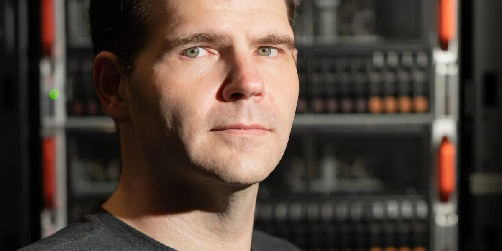

To understand the background of Groq's founding, we need to learn about its founder, Jonathan Ross. He was a key member who initiated the TPU (Tensor Processing Unit) project at Google. While working on the TPU development team, he sensed the growth potential of the future AI **inference market** and left Google to found Groq. He then introduced the world to **LPU** (Language Processing Unit), a dedicated inference chip.

The market they targeted is very similar to what we at HyperAccel are pursuing.

- **GPU / TPU:** Support both training and inference, but are inherently optimized for large-scale computation-intensive **training**
- **LPU:** Boldly abandons training and goes all-in on optimizing **inference for Large Language Models (LLMs)**

Those unfamiliar with the concepts of training and inference may have this question:

> ??? : Training? Inference? Aren't they all the same AI operations? Can't GPUs do everything? Why do we need inference-specific chips?

For those readers, let's briefly touch on the difference between training and inference in AI operations.

---

## Training and Inference: The Limits of General-Purpose Chips and the Opportunity for Dedicated Chips

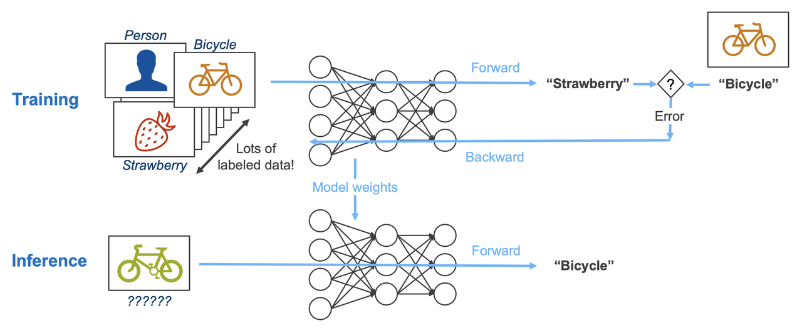

AI workloads can be broadly divided into **training**, which updates weights, and **inference**, which uses fixed weights.  
Let's assume we're developing an AI model that identifies what an image is from a given image. To do this, we first need to train the model with a large amount of image data. During the training process, the model looks at the image and outputs an answer based on the current weights (**Forward path**), then compares the error with the actual answer according to a defined learning mechanism and updates the current weights (**Backward path**). Repeating this process continuously updates the model's weights, and after sufficient time, the model's error decreases and it becomes able to identify images well. Once training has progressed to some extent, we need to actually use this model, right? Unlike training, the inference process does not require weight updates. This is because updating the weights of an already-trained model is unnecessary computation in the actual usage stage. Therefore, the inference process only involves the **Forward path**.

What we can learn from this is that **inference does not require as much computation as training**.

However, this alone is insufficient to justify dedicated chips. If inference simply requires less computation, we could just run many inference operations on hardware with massive computational capacity like GPUs or TPUs, even if it's over-spec. In reality, AI companies use top-tier GPU lineups (B200, etc.) for training and relatively lower-tier GPUs (H200, etc.) for inference. To understand the need for inference chips in the current generative AI market led by LLMs, we need to examine the structural limitations of currently used LLMs.

### Structural Limitations of LLMs: The Bottleneck is Memory, Not Computing

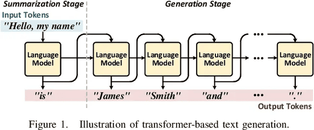

The fundamental characteristic of the Transformer architecture, which forms the basis of current LLM models like GPT, Gemini, and Grok, is that it does not generate results as complete sentences at once, but rather **generates words (hereafter tokens) one by one sequentially**. This is expressed as having auto-regressive properties. This is because the Transformer model does not generate results solely from input values, but recalculates the relationships between input tokens and all previously generated output tokens each time an output token is generated to create the next output token. This requires an enormous amount of computation. However, the problem is not just the amount of computation. If we recalculate all values every time we generate a token, computational inefficiency increases, so reusable intermediate values (**KV cache**) are stored in memory and read from memory when computing the next token for recalculation. The problem is that this requires reloading past data from memory every time a token is generated, so the amount of memory movement increases as more tokens are generated.

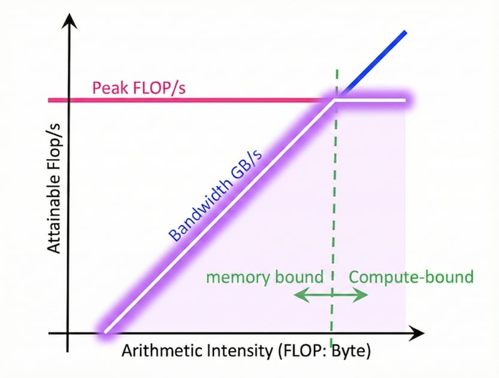

In computer architecture, we use a measurement technique called the **Roofline Model** to diagnose hardware performance limits. This checks the maximum possible performance of an operation through the computational characteristics of software used on hardware and hardware specifications. 

The Roofline Model graph consists of two axes. The **x-axis** is **computational intensity** (Operational Intensity). This is an indicator of how much computation is performed with data fetched once, and it increases as data reusability increases. The **y-axis** is **performance**, typically expressed as floating-point operations per second (FLOPS/s).

Each line on the graph represents the hardware's performance limit. The **sloped line** represents the performance limit due to memory bandwidth, and when computational intensity is low (left region), the maximum performance is determined along this line. In this region, no matter how excellent the hardware's computational capability is, performance is limited by the speed of fetching data from memory, so only performance proportional to memory bandwidth can be obtained (**Memory bound**). The slope of this line equals performance (FLOPS/s) / computational intensity (FLOPS/BYTE), which is the same as the hardware's memory bandwidth (BYTE/s).

On the other hand, the **horizontal line** represents the hardware's maximum computational performance limit. When computational intensity is sufficiently high (right region) to reach this horizontal line, the performance of that operation equals the maximum computational performance the hardware can deliver (**Compute bound**). The point where the two lines meet is called the **Ridge Point**, where memory and computational performance are balanced. Beyond this point, even if computational intensity increases, maximum performance can no longer increase due to hardware limitations. 

- **Compute Bound** : The required computation is too much compared to hardware specs, causing a bottleneck due to the physical limits of the chip's computation speed
- **Memory Bound** : Computation units are sufficient, but the speed of fetching data from memory is slow relative to that, causing a bottleneck

The training process is close to **compute bound** because it requires a lot of computation and can be parallelized. However, in the LLM inference process, especially after calculating the first output token for the initial input tokens (**Prefill Stage**), the process of extracting output tokens one by one (**Decoding Stage**) requires reading past data from memory every time to output individual tokens. Moreover, the size of this data increases as the output token length increases. This lowers computational intensity, so inference operations are close to **memory bound**.  

This is exactly why GPUs and other datacenter-oriented chips must use expensive HBM (High Bandwidth Memory). No matter how fast the chip's computation speed is, it's useless if it can't overcome the Memory Wall. As mentioned earlier, since the slope of the graph in the memory-bound region equals memory bandwidth, using HBM to increase bandwidth allows us to extract higher performance at the same computational intensity, as shown in the graph below.

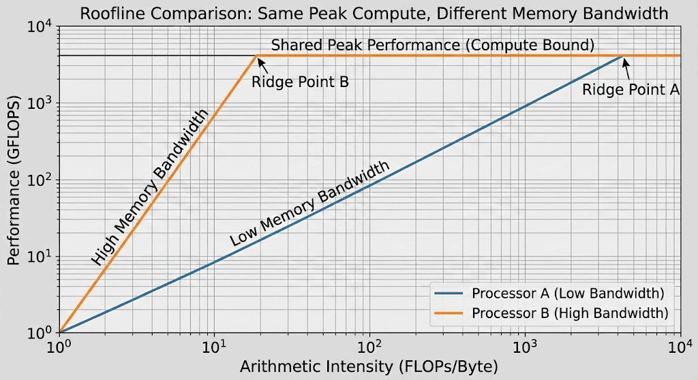

Inference chips target these bottlenecks in LLMs. If performance limits are inevitably reached due to memory bound no matter how high the computational performance, we compete with chips that have architectures suited to LLM structures or maximize memory bandwidth. General-purpose chips like GPUs are also showing such movements, but it's difficult to make bold hardware innovations and structural improvements. This is because while GPUs are currently widely used for LLM operations, GPUs are not only used for LLM but also for training and computation of various AI model structures, and have become **general-purpose chips** used not only for AI operations but also for various tasks like image rendering. This is why **dedicated chips** that remove unnecessary parts and target specific workloads can show strengths.  

Next, let's explore the bold attempts Groq has shown in the hardware market through this dedicated chip.

---

## Groq's Bold Gamble: Shatter the Conventional Wisdom of Memory Hierarchy

The biggest feature of Groq's LPU is its memory structure. As I mentioned earlier, memory bandwidth is very important. Looking at the A100 GPU's memory structure, it looks like the diagram below. 

An individual GPU's memory hierarchy consists of **on-chip SRAM** inside the GPU chip, **off-chip memory** (HBM) attached to the GPU chip, and **system memory** (DRAM) allocated to individual nodes when running on GPU servers. In the memory hierarchy, as you go down, capacity increases, bandwidth decreases, and price per capacity becomes cheaper. During LLM operations, weights and intermediate computation values are mostly stored in HBM and then read again, and data read from HBM is stored in cache form in GPU SRAM near the compute units for reuse, increasing memory efficiency. This is a format that has been adopted in CPUs and other traditional computer architectures as well.

While large companies including Nvidia and many inference chip startups have been thinking about ways to use HBM and memory more efficiently, Groq questioned this memory hierarchy and asked a game-changing question.

> ??? : Why not just put all data **inside the chip** (On-chip)?

This is not simply about increasing SRAM capacity. It means **not using off-chip memory**. Groq boldly removed **HBM**, which corresponds to the middle of the hierarchy above, from their chip. Instead, they use **SRAM, which is used as cache memory inside the chip, as main memory**.

- **HBM bandwidth** : 8 TB/s (B200 standard)
- **LPU SRAM bandwidth** : **80 TB/s or more** (at least 10-20x difference)

Using this overwhelming bandwidth, Groq proved superior performance to GPUs in image classification models like ResNet at ISCA (International Symposium on Computer Architecture) in 2020.

### Problem: Cost and Capacity

However, using only on-chip memory doesn't solve all problems. If using only SRAM solved everything, many hardware companies would have already adopted that method. The problem is cost. SRAM and DRAM may look like the same memory, but their structures are very different.

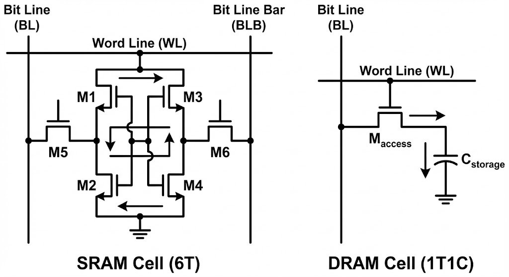

This is an image that those who majored in electrical engineering may have seen at least once. Simply put in numbers, DRAM requires **1 transistor and 1 capacitor per individual cell** that stores one bit, while SRAM requires **6 transistors per cell**. This is a 3x difference in just component count, and considering wiring complexity, the area difference can be tens of times. Therefore, increasing SRAM capacity increases chip size, and there are limits to increasing capacity due to the [reticle limit](https://hyper-accel.github.io/posts/tpu-deep-dive/#%ED%95%98%EB%93%9C%EC%9B%A8%EC%96%B4-%EA%B4%80%EC%A0%90) mentioned in a previous article. Moreover, increasing SRAM capacity means the proportion of SRAM in the chip increases. This means less space for logic needed for computation. No matter how important memory is, you can't compute with just memory. Due to these limitations, the reality is that individual chips can only hold SRAM at most about 1/10 of HBM capacity (hundreds of MB).

Latest LLM models basically have parameters in the billions. Even with a simple calculation assuming no compression, storing weights alone requires tens of GB of memory, so using only SRAM makes it impossible to even load one model on one chip.   

### Solution: Split and Store, Run Like a Conveyor Belt

Groq solved this problem with **Scale-out**. If one chip can't hold a model, they split (Shard) the model's weights and store them across hundreds of chips. This is where AI parallelization techniques come in.

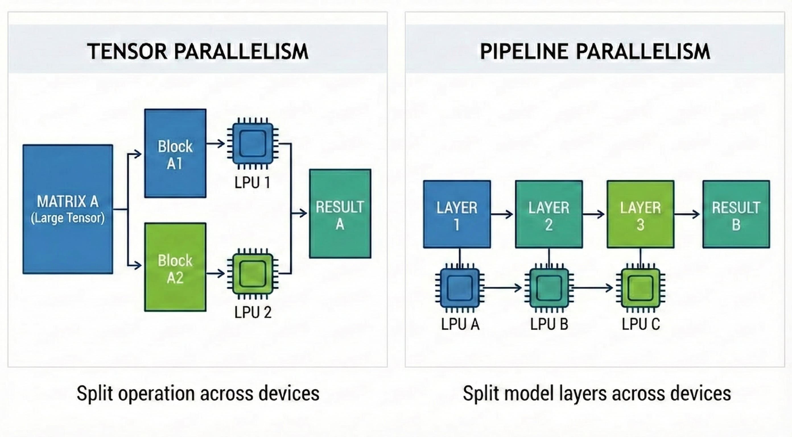

- **Tensor Parallelism (TP)** : Decomposes one large matrix operation into multiple smaller matrix operations. Weights needed for partial matrix operations are distributed and stored in the main memory of multiple chips, and each chip performs partial matrix operations
- **Pipeline Parallelism (PP)** : Divide the model's layers into groups for processing. In computation order, each chip receives computation results from the previous chip and performs computation for the next layer

Groq likens the system they built by applying these parallelization techniques to a giant **conveyor belt**. When input data enters the first chip (the start of the belt), each chip only performs its assigned computation and passes data to the next chip. The final token pops out from the last chip. This can be visualized in the animation below.

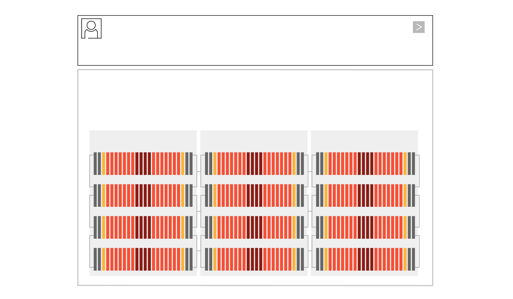

On the other hand, if a GPU's single chip were to perform the same task,

> Memory load from HBM -> computation -> memory load from HBM again -> computation

This process would need to be repeated. This is because while HBM stores data needed for computation, there are still limits to the amount of data that can be loaded near the compute units (SRAM). Groq's claim is that bottlenecks occur in this process of repeated memory loads. This can be visualized in the animation below.

For Groq's system to operate successfully, **Chip-to-Chip (C2C) communication** speed is critical. If the middle of the conveyor belt breaks, the entire factory stops. Groq tied 8 or more chips together like one giant node through their proprietary **C2C interconnect** technology (**RealScale**) and **Dragonfly Topology**. They made multiple chips share each other's SRAM, appearing like one giant single chip, converging communication overhead to almost zero.

GPUs are not incapable of using this method. The TP and PP explained earlier are parallelization methods widely used in distributed training with GPUs. However, when GPUs use these techniques (especially TP), work is needed to synchronize data between devices. GPUs support inter-GPU communication through the runtime library NCCL (Nvidia collective communication library). In the process of using TP mentioned earlier, **all-reduce** is needed, where matrix multiplication results computed on each GPU are shared with other GPUs to obtain summation.

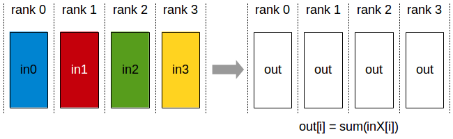

However, in Groq's LPU, runtime libraries like NCCL used by Nvidia are unnecessary. This is because in LPU, inter-device communication is predictable at compile time, not through runtime libraries like NCCL. Let's learn how this is possible through another architectural philosophy of Groq.

---

## Software-defined Hardware: The Compiler Decides Everything

Another characteristic of Groq's LPU is that software (especially the **compiler**) takes precedence over hardware design. In fact, looking at the official documents containing LPU's design philosophy, they say they didn't even touch chip design until the compiler architecture was designed. This is to make the compiler capable of controlling all hardware and make individual hardware operations predictable at the compiler level.

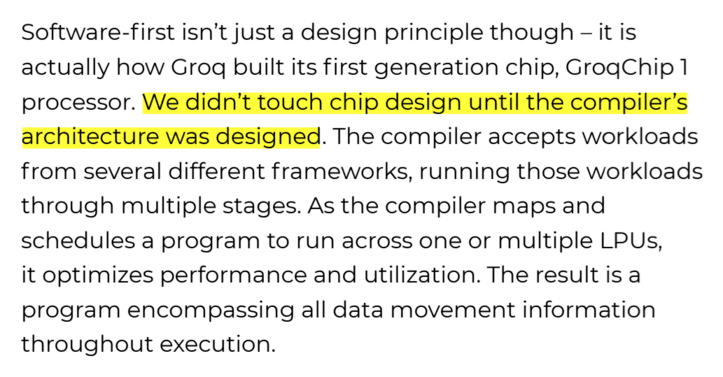

### Deterministic Execution

CPUs and GPUs don't know when or what data will come in, so they use complex schedulers (Branch Prediction, Cache Managing, Warp Scheduling, etc.) at the hardware level. This is flexible but creates unpredictable delays (Tail Latency).

Let's briefly revisit the [**warp scheduling**](https://hyper-accel.github.io/posts/how-gpu-works/#single-warp-scheduling) example from GPU that appeared in Part 1.

**(The examples explained from now on are for simple explanation and may differ from actual hardware operation.)**

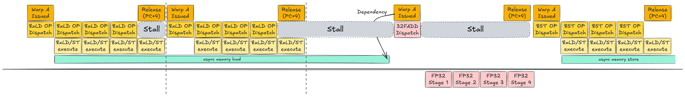

In the warp scheduling introduced earlier, load/store commands that read and write data to memory occur asynchronously. This is fundamentally because we don't know when memory load/store commands will complete. During this time, the processor has no choice but to wait until the asynchronous command completes. But what if we could know when this command completes? What if we could accurately predict the time we need to stall? The processor could calculate what it can do during that time and optimize the system by doing other work, minimizing idle processes.

LPU's static scheduling aims to apply this to deep learning and LLMs, especially inference operations. As mentioned earlier, inference operations are a process of calculating final results (output tokens in LLMs) through fixed weights. In this process, if the model is fixed, the computation order is generally fixed. A fixed computation order is one of the optimal conditions for applying static scheduling. This is because we can remove scheduling that might occur during computation. This allows us to utilize limited hardware resources for other units like compute units or memory instead of scheduling, increasing hardware efficiency. 

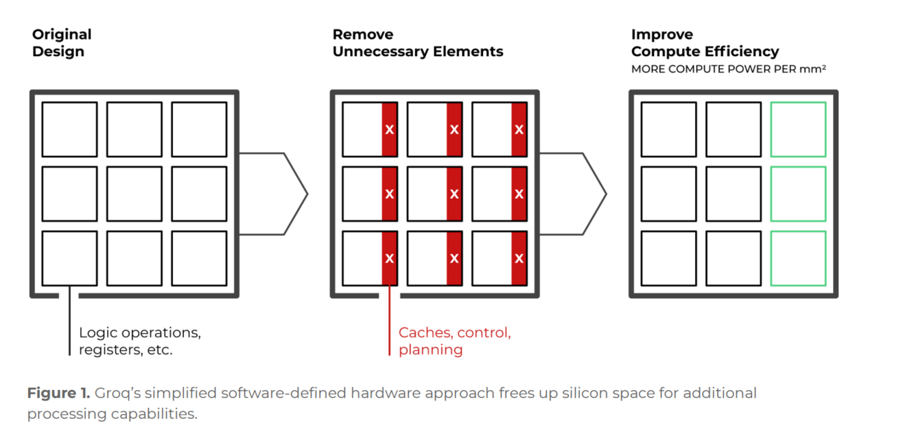

The effects of this static scheduling shine even more when using multiple chips simultaneously. 

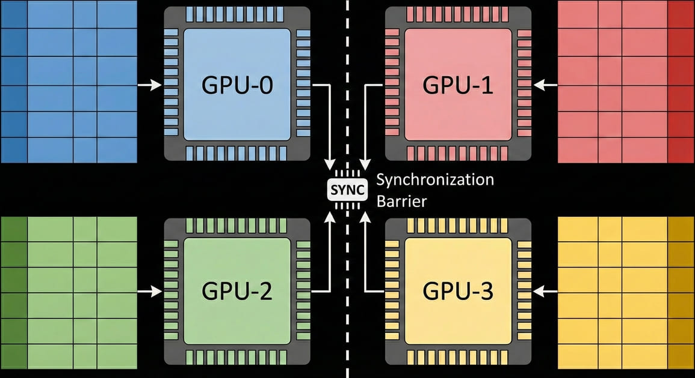

The process of using all-reduce/all-gather through Nvidia's NCCL library mentioned just before requires synchronization between devices. This is because all devices must finish their work before the next task can be performed, but we don't know when each device will finish its work. 

But what if the compiler could know when work completes on each device? It could perform not only the synchronization work needed during NCCL operations but also the work needed by NCCL at the compiler level.

For this reason, Groq minimized the **scheduling** function, which corresponds to the hardware's 'brain', and delegated this function to the **compiler**. Let's summarize the static scheduling of Groq's LPU explained so far:

1. The compiler pre-calculates data flow inside chips and across all chips to be used at compile time in hardware time units (clock cycles).
2. When and which memory address of which chip data will arrive at is 100% predictable (**Deterministic**).
3. Hardware simply executes as the compiler instructs without complex deliberation.
4. LPU secured predictability of execution time and was able to focus hardware resources that would have been used for scheduling on computation.

---

## Why Did NVIDIA Acquire Groq?

Groq's LPU was innovative and had clear strengths technically, but faced business challenges. From a customer's perspective, even running just one LLM model on LPU requires hundreds of chips (rack-level), so initial adoption costs reach **a tens to hundreds of millions of USD**. Perhaps due to this problem, Groq initially sold chips (**GroqChip**) but later diversified their business to provide cloud API rental services through **GroqCloud**. They provide APIs that allow use of servers or racks they directly built with Groq chips.

So what is the background behind NVIDIA's acquisition of Groq? In general economic articles, the prevailing opinion is that it's for technology licensing to expand dominance in the inference market. However, as an engineer, I'll add a bit of technical imagination and conclude this article by discussing several technical scenarios that might unfold after Groq's acquisition. 

### Hypothesis 1: Building a New Heterogeneous Computing Platform

One recent trend in AI inference operations is the separation of Prefill and Decoding operations (prefill-decode disaggregation). This is because operations with different characteristics coexist even within inference operations.

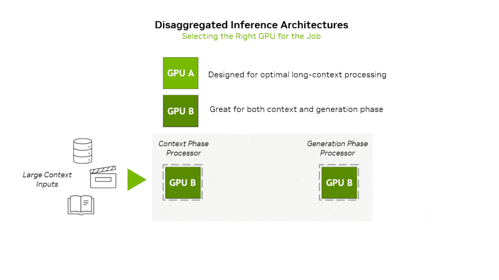

- **Prefill(Context) phase** : Input prompt is inserted at once, requiring much computation → Compute Bound
- **Decoding(Generation) phase** : After the first token is generated, generated tokens are input sequentially one by one → Memory Bound

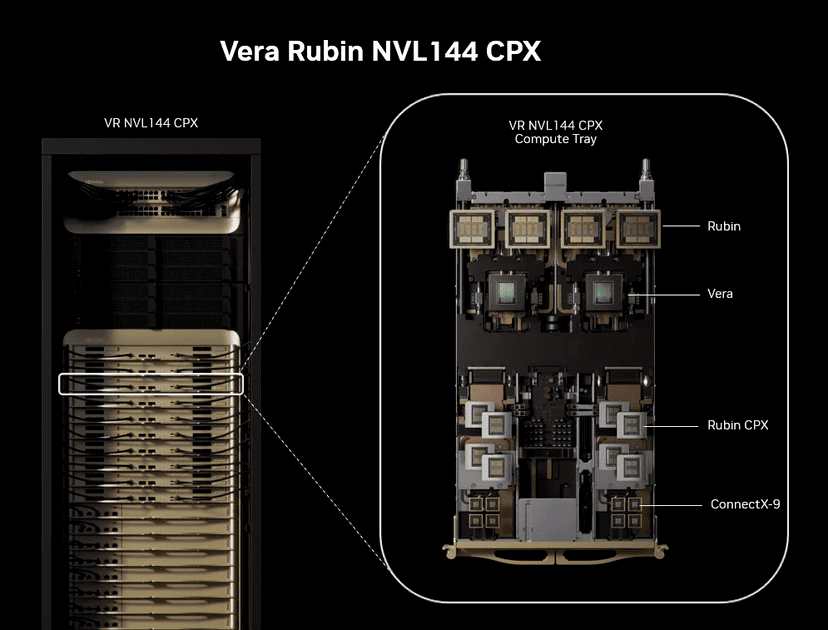

NVIDIA has previously announced a heterogeneous hardware platform that uses different compute units for prefill and decode. They announced **Rubin CPX**, specialized for the context-phase and based on the next-generation GPU architecture Rubin, along with the platform equipped with it. 
To summarize the idea of this platform, **Prefill stage** runs on Rubin CPX → **Decoding stage** runs on Rubin GPU. If we utilize Groq's LPU architecture in this platform, we can imagine new platforms in the following 2 ways:

1. Install GPU + LPU hybrid hardware (**Rubin LPU**) instead of Rubin GPU on the current platform
- Rubin CPX → Prefill  
- Rubin LPU → Decoding
2. Add the hardware mentioned in 1 to the current platform 
- Rubin CPX → Prefill  
- Rubin LPU → Decoding
- Rubin GPU → Prefill + Decoding

However, realistically, building such platforms is expected to be very difficult. This is because the hardware architecture differences between LPU and GPU are large, making integration within a single platform not easy. Therefore, I think the scenario to be introduced next is more likely than this scenario.

### Hypothesis 2: Building a Hybrid AI Giga Factory

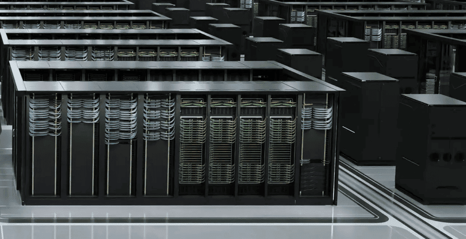

NVIDIA is moving beyond being a simple hardware company to **directly building datacenters.** The so-called **AI Giga Factory** that NVIDIA is preparing is a platform where they directly build datacenters that hyperscalers (Meta, Google, Amazon) build and provide them to other customers. Think of it as an expanded version of the **GroqCloud API** that Groq provided.  
Building datacenters requires not just hardware knowledge but **understanding of systems overall, customer experience, and various tangible/intangible assets**, so there aren't many companies (especially among hardware companies) with the technical capability to do this. Usually, hyperscalers have built their know-how and technical capabilities while building their own datacenters. Groq is a **hardware company** that actually built datacenters with their inference chips and provided real APIs. From NVIDIA's perspective, acquiring Groq would allow them to expand the hardware lineup for their giga factory.

If we expand the heterogeneous computing mentioned earlier from server or node level to datacenter level:

1. GPU-specialized tasks including training are computed in **GPU clusters**
2. Tasks that can proceed faster on LPU are computed in **LPU clusters**

Then what tasks can LPU proceed faster with? From the perspective of LLM inference operations mentioned earlier, we can think of separating **Prefill/Decoding** tasks between GPU and LPU clusters. This time, let me introduce a few workloads where LPU can show strengths from a task-level perspective.  

**(From here on, my personal views are heavily reflected.)**

**Speculative Decoding**

One recent trend in LLM serving is **Speculative Decoding**. As model sizes grow and computation time becomes longer, a small and fast model (**Draft Model**) that distills or is trained to behave similarly to the existing model (**Target Model**) quickly generates the latter part of a sentence in advance, then the Target Model verifies this in parallel. Groq's LPU clusters can be used for small-sized Draft Model computation here. This is because LPU boasts overwhelming token generation speed in small-sized models. From an overall perspective, the roles of LPU/GPU clusters can be divided as follows:

- **LPU** : Generate candidate tokens at high speed
- **GPU** : Verify at once whether the tokens thrown by LPU are correct

However, such systems fundamentally have limitations. This is due to communication overhead between GPU - LPU clusters. If LPU only throws the **tokens** it generated to GPU, overhead wouldn't be large, but Speculative decoding's Target Model needs **data generated by the Draft Model** (KV cache) for token verification. If communication occurs within one chip or node, overhead would be relatively small, but if large-capacity KV cache movement is needed in inter-cluster communication, the overhead becomes a big problem. This is because it can actually degrade the service's performance itself. This is a problem that must be considered not only for speculative decoding but also when performing prefill-decode disaggregation at the cluster level.

Moreover, recent speculative decoding is transforming into a method applied through internal optimization in a **single model** rather than separating models in the target-draft way explained above, changing to an environment where heterogeneous computing is difficult to use.

**Agentic AI**

Another scenario is Agentic AI. AI is evolving beyond simple chatbots that only answer questions into **agent** forms that make their own plans, use tools, and go through multiple stages of reasoning. In each stage of making plans and using tools, large and small models exchange data they each generated to create final results. From the perspective that various models are used, we can think of a scenario using heterogeneous computing similar to Speculative Decoding mentioned just before.  

- **LPU** : Handles light agent tasks (Worker) requiring fast response such as simple judgment, tool selection, repetitive routine work, routing, etc.
- **GPU** : Handles heavy tasks requiring massive computation such as complex logical reasoning, code generation, image rendering, etc.

Agentic AI systems communicate based on text (JSON) rather than tensor forms like KV cache, so physical hardware separation is free. This is because concerns about communication overhead, the bottleneck mentioned in Speculative decoding, are low. Therefore, combining LPU + GPU clusters could form a datacenter platform optimized for Agentic AI serving.

---

## Summary

In this article, we explored:

1. The background of LPU's emergence and the difference between general-purpose and dedicated chips
2. Groq's hardware/software design philosophy
3. Several technical scenarios expected after NVIDIA's acquisition of Groq

Personally, this acquisition seemed like NVIDIA's move to maintain a monopolistic position in the hardware market with capital, which was both intimidating, while also feeling ambivalent because the term LPU, which our company also uses, seemed to become more known to the market and public. I also felt anticipation that if we prove our products in the market, great opportunities would open up for our company as well.

Throughout this three-part series, we've explored various AI accelerators, from **GPUs to TPUs and LPUs**. While we've focused on accelerator architectures and computational structures so far, in the next article, we'll expand the topic to **storage**, which plays an equally important role as accelerators outside of computation. In the next installment, we'll examine NVIDIA's **BlueField**, which garnered attention at this year's CES, and explore **storage** and **DPUs** (Data Processing Units) that play crucial roles in AI datacenters.

### P.S. : HyperAccel is Hiring

We at HyperAccel are on the verge of launching our first LPU product. Not only for this product but also for other products to come, HyperAccel needs more excellent engineers. 

If you're interested after seeing the technologies we work with, please apply at [HyperAccel Career](https://hyperaccel.career.greetinghr.com/ko/guide)! 

HyperAccel has many truly excellent and smart engineers. We're waiting for your application.

---
## Reference
[Jonathan Ross Interview](https://youtu.be/UneoszmxRGg)  
[Think Fast: A Tensor Streaming Processor (TSP) for Accelerating Deep Learning Workloads, ISCA 2020](https://cdn.sanity.io/files/chol0sk5/production/16e7e13197dfe5f52d3b0ed62e29620662c38743.pdf)  
[A Software-defined Tensor Streaming Multiprocessor for Large-scale Machine Learning, ISCA 2022](https://cdn.sanity.io/files/chol0sk5/production/81d0c45ed70a10f1804bbd82f2d0076af1186ff0.pdf)  
[What is Language Processing Unit? - groq blog](https://groq.com/blog/the-groq-lpu-explained)  
[groq whitepapers](https://groq.com/papers)  
[Speculative Decoding - Nvidia blog](https://developer.nvidia.com/blog/an-introduction-to-speculative-decoding-for-reducing-latency-in-ai-inference/)  
[Rubin CPX platform - Nvidia blog](https://developer.nvidia.com/blog/nvidia-rubin-cpx-accelerates-inference-performance-and-efficiency-for-1m-token-context-workloads/)   
[NCCL Collective Operations](https://docs.nvidia.com/deeplearning/nccl/user-guide/docs/usage/collectives.html)

