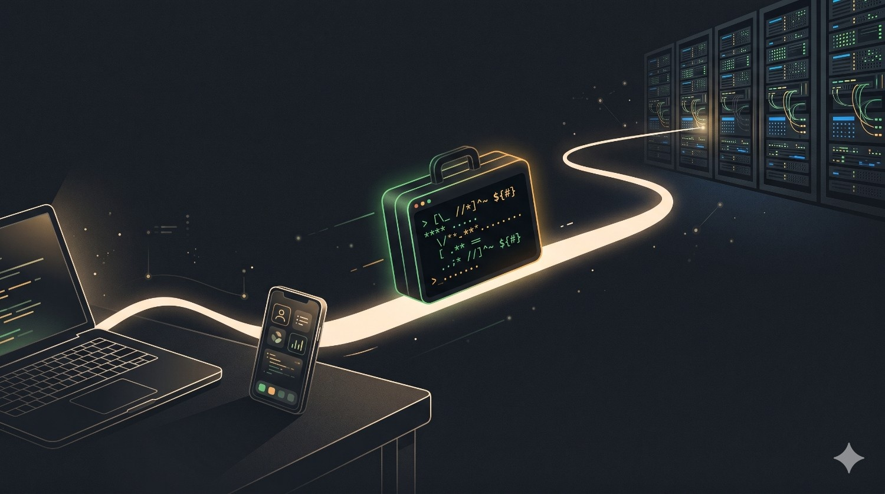
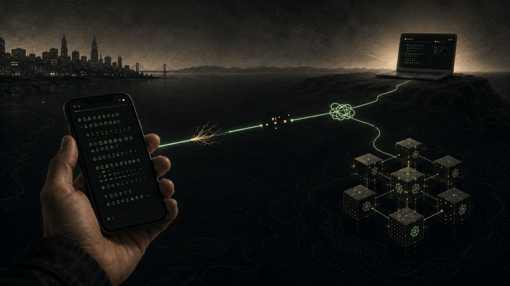

안녕하세요, HyperAccel의 LLMOps 팀 엄태서입니다.

지난 글에서는 우리가 **Copy & Paste** 워크플로우에서 코딩 에이전트로 어떻게 넘어왔는지 이야기했습니다. 처음의 AI가 조금 더 똑똑한 검색창 정도로 보였다면, 곧 자동완성이 되었고, 이제는 레포지토리를 직접 읽고, 테스트를 돌리고, 실패를 확인하고, 파일을 고친 뒤 다시 시도하는 데까지 왔습니다.

이번 글은 그 변화와 함께 조용히 다시 중요해진 도구, 바로 터미널에 관한 이야기입니다. 더 정확히는 그 터미널의 중요성을 만드는 **Command Line Interface(CLI)** 에 관한 이야기이기도 합니다.

요즘 들어 달라졌다고 느끼는 점은, 터미널 네이티브 에이전트가 개발과 로컬 **Integrated Development Environment(IDE)** 세션 사이의 오래된 결속을 느슨하게 풀어놓았다는 것입니다. 이제 일은 제가 닿을 수 있고 신뢰할 수 있는 실행 환경을 따라 움직입니다. 그 환경은 레포지토리가 놓인 워크스테이션일 때도 있고, 서비스에 더 가까운 개발 환경일 때도 있는데, 이때 **Secure Shell(SSH)** 은 그 환경으로 들어가는 통로일 뿐 그 자체가 목적은 아닙니다.

이 변화는 하루를 보내는 개발의 감각을, 그리고 어디에서 디버깅할 수 있는지를 바꿔놓았고, 더 나아가 무엇을 진짜 개발 환경이라고 부를 것인지까지 다시 생각하게 만들었습니다.

## 터미널이 다시 하나의 장소가 되었다

오랫동안 제게 터미널은 도구 서랍에 가까웠습니다. `git`, 빌드, 패키지 매니저, 로그 확인, 가끔 손대는 쉘 스크립트 정도가 그 안에 들어 있었죠. 실제 작업은 IDE에서 일어났고, 터미널은 그 작업이 현실을 버텨내는지 확인하는 곳일 뿐이었습니다.

코딩 에이전트는 터미널을 다시 중심으로 끌어왔습니다.

이유는 단순합니다. 에이전트가 무언가를 하려면 시스템을 직접 만질 수 있어야 합니다. 파일을 읽고, 코드를 검색하고, 명령을 실행하고, 오류를 관찰하고, 그 흔적을 증거로 남겨야 하는데, CLI는 애초에 바로 그런 loop를 위해 만들어진 인터페이스입니다. 명령도 텍스트, 출력도 텍스트, 실패도 diff도 전부 텍스트이고, 테스트 결과는 사람과 에이전트가 함께 이해할 수 있을 만큼 단순한 신호로 돌아옵니다.

에이전트가 터미널 안에서 일하면, 시각적인 패널 너머에서 무슨 일이 있었는지 추측할 필요가 줄어듭니다. 제가 실행했을 명령을 그대로 실행하고, 제가 읽었을 로그를 그대로 읽기 때문에, 피드백 loop가 짧고 직접적으로 유지됩니다.

이 직접성은 생각보다 중요합니다. 채팅 **User Interface(UI)** 는 친근하게 느껴질 수 있지만, 소프트웨어 작업은 대화만으로 끝나지 않습니다. 결국 제약 안에서 실제 행동이 일어나야 하고, 터미널은 그 행동이 또렷한 흔적을 남기는 장소를 내어줍니다.

터미널은 또 다른 종류의 기억도 줍니다. 스크롤백에는 일이 어디서 시작됐는지, 어떤 명령이 처음 실패했는지, 어떤 가정이 틀렸는지, 그리고 어떤 테스트가 마지막에 초록불로 바뀌었는지가 고스란히 남습니다. 증거 없는 속도는 늘 불안하기 마련인데, 터미널은 제가 중간에 멈춰 묻고 방향을 바꿀 수 있을 만큼 작업을 충분히 눈에 보이게 해줍니다.

## 노트북에 SSH로 들어가 일을 시작했다

이때 처음 생긴 습관은 작고 평범했습니다. 집에 있거나 책상에서 멀지 않을 때조차, 저는 제 노트북에 SSH로 접속해 일을 시작하게 되었습니다.

에이전트 워크플로우 이전에도 SSH는 유용했지만 어디까지나 제한적이었습니다. 로그를 확인하거나 프로세스를 재시작하거나 아주 작은 수정을 하는 정도는 괜찮았어도, 조금만 큰 일이 되면 불편해졌고, 제대로 된 컨텍스트가 필요할 때면 대개 책상으로 돌아가 IDE를 열 때까지 그냥 기다렸습니다.

터미널 네이티브 에이전트를 쓰기 시작하면서 그 선이 움직였습니다.

노트북에 SSH로 접속해 레포지토리를 열고 작업을 설명하면, 이제는 에이전트가 먼저 움직여 코드베이스를 살피고, 계획을 세우고, 테스트를 돌리고, diff를 건네줄 수 있었습니다. 휴대폰이나 원격 쉘을 완벽한 워크스테이션으로 바꾸려던 게 아니라, 이미 믿고 쓰던 워크스테이션에 에이전트가 닿게 해준 것뿐이었습니다.

원격 디버깅의 감각도 함께 달라졌습니다. 책상에서 멀리 있을 때 문제가 터져도, 더는 그것을 나중에 볼 메모로 줄여 적어둘 필요가 없었습니다. 그 자리에서 곧장 디버깅을 시작할 수 있었으니까요. 제가 다른 곳에서 터미널을 들여다보는 동안, 에이전트는 로그를 모으고, 호출부를 찾고, 실패하는 명령을 재현하면서 문제의 범위를 좁혀갑니다.

이건 마법이 아니라, 그저 역할 분담이 더 나아진 것입니다. 무엇이 중요한지는 여전히 제가 정하고 패치도 제가 리뷰하지만, 그 지루한 첫 번째 통과만큼은 더 이상 레포지토리가 놓인 바로 그 화면 앞에 앉아서 시작할 필요가 없어졌습니다.

원격 디버깅에는 나름의 리듬이 있습니다. 저는 먼저 증상을 너무 성급하게 결론으로 몰아가지 않으려 합니다. 요청이 timeout 난다거나, 테스트가 flaky하다거나, 특정 설정 변경 뒤에만 서비스가 죽는다는 식으로 상황만 짚어두는 거죠. 그런 다음 에이전트에게는 수정에 손대기 전에 사실부터 모으라고 부탁합니다. 최근 로그를 확인하고, 코드 경로를 찾고, 재현 명령을 식별하고, 무엇이 바뀌었는지 알려주되 아직 패치는 하지 말라고요.

이 멈춤이 중요합니다. 원격에서는 혼란을 견딜 여유가 적고, 작은 화면 앞에서는 잘못 든 길 하나하나가 책상에서보다 더 비싸게 느껴지기 때문입니다. 그래서 첫 단계는 triage에 가깝기를 바랍니다. 신호를 모으고, 불확실성을 줄이고, 가장 가능성 높은 문제의 가지에 이름을 붙이는 것까지가 먼저고, 수정은 그다음입니다.

흥미로운 점은 이런 세션이 의외로 꽤 차분하다는 것입니다. 저는 한 손에 휴대폰을 들고 있을 뿐, 실제 무거운 일은 집에 있는 노트북이 합니다. 레포지토리는 이미 clone되어 있고, 의존성도 설치되어 있고, 테스트 cache까지 따뜻하게 남아 있죠. 저는 휴대폰으로 코딩하는 게 아니라, 그 작업에 훨씬 잘 맞는 곳에서 일어나는 일을 멀리서 조종하고 있는 셈입니다.

## 다섯 시간 reset 전략

초기에는, 지금 돌아보면 짧지만 묘했던 한 시절의 스냅사진 같은 습관도 하나 있었습니다.

에이전트 사용 한도가 지금보다 빡빡하던 시절, 저는 reset window를 기준으로 하루 전체를 계획했습니다. 전날 밤이면 신중하게 prompt를 준비했죠. 컨텍스트를 모으고, 목표를 적고, 관련될 법한 파일을 나열하고, 작업을 최대한 깔끔하게 다듬어두는 일이었습니다.

그리고 아침 7시 전에 시작했습니다.

대략의 계획은 단순했습니다. 오전의 reset window를 하나의 긴 uninterrupted run으로 쓰고, 에이전트를 약 다섯 시간 동안 일하게 둔 다음, 점심을 먹고 12시쯤 fresh reset을 받으면 오전에 배운 것을 들고 다시 시작하는 것이었습니다.

지금 들으면 조금 우스운 루틴이지만, 당시에는 충분히 말이 됐습니다. 부족했던 자원은 모델의 지능만이 아니라 연속성이었기 때문입니다. 첫 한 시간을 레포지토리 설명에 다 써버리면 유용한 window의 큰 부분을 그대로 날리는 셈이었고, 그래서 저는 prompt를 일종의 launch checklist처럼 다루게 되었습니다.

터미널 네이티브 작업은 이 전략을 한결 낫게 만들어줬습니다. 환경이 이미 코드 바로 옆에 있었던 덕분에, 에이전트가 레포지토리와 테스트, 로그가 함께 있는 곳에서 계획을 그대로 실행할 수 있었기 때문입니다. 그래도 본질적으로는 여전히 scarcity를 전제로 한 전략이었습니다. 열심히 준비하고, 일찍 시작하고, window를 꽉 채워 쓰고, 다음 reset을 기다리는 것이죠.

이 방식은 제 계획 습관까지 바꿔놓았습니다. 전날 밤의 prompt는 더 이상 단순한 요청이 아니라 압축된 briefing이 되었거든요. 목표와 의심되는 파일, 믿을 수 있는 명령, 중요한 테스트, 그리고 절대 건드리면 안 되는 것들을 적고, 이미 시도해본 것까지 함께 넣어 다음 날 아침 run이 어제의 실수를 되풀이하지 않도록 했습니다. 위험한 길이 보이면 더 안전한 첫걸음도 그 옆에 같이 적어두었고요.

이 계획은 분명 유용했지만, 동시에 어딘가 의식(儀式)처럼 느껴지기도 했습니다. 비행기가 뜨기 전에 활주로부터 준비해야 했으니까요. 아침 8시에 prompt에서 중요한 제약 하나가 빠졌다는 걸 뒤늦게 알아차리면 run 전체가 흔들릴 수 있었고, 에이전트가 엉뚱한 층을 너무 오래 헤매면 reset window가 눈앞에서 타들어 가는 느낌마저 들었습니다.

그 시절의 좋은 prompt는 작은 design document에 가까웠습니다. 목표와 범위, 제약, 검증 방법, 그리고 종료 조건까지 담겨 있었죠. 이 습관은 도구가 좋아진 뒤에도 그대로 남았습니다. 이제는 다섯 시간짜리 scarcity window에 맞춰 하루를 짜고 싶지는 않지만, 에이전트에게 선명한 완료의 정의를 건네고 싶은 마음만큼은 여전합니다.

## Android와 Termux를 쓰던 시기

한동안 이 워크플로우의 가장 이동성 높은 버전은 Android와 Termux 위에서 돌아갔습니다.

Termux는 Android용 터미널 환경인데, 바로 이 도구 덕분에 아이디어가 비로소 실제처럼 느껴졌습니다. 처음에는 휴대폰이 주로 제 노트북으로 SSH 접속하는 통로, 그러니까 이미 잘 동작하던 개발 환경에 닿기 위한 길에 가까웠습니다. 제가 믿고 쓰던 머신을 멀리서 조종하는 리모컨에 가까웠을 뿐, 그 자체로 하나의 개발 환경은 아니었던 셈이죠.

이 설정에는 묘한 매력이 있었지만, 그만큼 마찰도 적지 않았습니다.

우선 Android 기기가 있어야 했고, 작은 화면에서도 참고 쓸 만한 터미널 emulator와 **Virtual Private Network(VPN)** 접근이 필요했습니다. 거기에 더해 키, shell 설정, kube config, 폰트, 단축키, 그리고 네트워크가 바뀌어도 무너지지 않을 만큼의 환경 설정까지 갖춰야 했습니다.

잘 동작할 때는 정말 놀라웠습니다. 책상에서 멀리 떨어져 있어도 의미 있는 조사를 시작할 수 있었으니까요. 훨씬 더 잘 갖춰진 머신이 무거운 일을 도맡는 동안, 저는 그저 작은 화면을 들고 있기만 하면 됐습니다.

반대로 실패할 때는 아주 평범한 방식으로 실패했습니다. VPN이 붙지 않거나, 키보드가 제가 입력하던 줄을 가리거나, 키 하나가 빠져 있거나, 세션이 툭 끊기는 식이었죠. 터미널 자체는 어디로든 들고 다닐 수 있었지만, 그 터미널까지 가닿는 길은 늘 매끄럽지만은 않았습니다.

이런 깨짐은 대개 하나의 큰 사고라기보다 작은 모서리들이 한꺼번에 걸리는 연쇄에 가까웠습니다. 모바일 네트워크가 Wi-Fi에서 셀룰러로 넘어가는 사이 VPN 터널이 조용히 죽고, SSH 세션은 잠깐 버티다가 하필 에이전트가 확인을 요청하는 순간 멈췄으며, 휴대폰 키보드는 명령 flag를 멋대로 자동 수정하거나 가장 곤란한 위치에 보이지 않는 줄바꿈을 끼워 넣곤 했습니다.

환경 drift도 만만치 않은 문제였습니다. 제 노트북 shell에는 몇 년 동안 쌓인 습관이 — alias, 패키지 버전, 기본 editor 설정, SSH config, prompt 동작, 그리고 의존하고 있는 줄도 몰랐던 자잘한 스크립트들이 — 켜켜이 배어 있었습니다. 그중 필요한 만큼만 Android에 다시 옮겨두는 것은 가능했지만, 결코 완전히 같지는 않았고, 빠진 세부 하나하나가 휴대폰은 개발 환경 자체가 아니라 그저 개발 환경으로 들어가는 좁은 문일 뿐이라는 사실을 자꾸 상기시켰습니다. 진짜 환경은 늘 그 문 너머 어딘가에 있었으니까요.

그래도 이 시기는 제게 중요한 것을 하나 가르쳐줬습니다. 가치는 휴대폰 그 자체에 있던 게 아니라, 살아 있는 개발 표면이 텍스트를 통해 도달 가능해졌다는 사실에 있었다는 점입니다.

## 노트북에서 pod 직접 접속으로

Kubernetes가 바꾼 것은 아이디어의 크기보다 접근 경로였습니다.

예전 경로는 여전히 제 노트북에 기대고 있었습니다. 휴대폰이나 다른 원격 기기에서 먼저 노트북으로 SSH 접속을 한 뒤, 이미 VPN과 kube config, credential, alias, 그리고 손에 익은 습관까지 갖춰진 그 익숙한 shell에서 비로소 Kubernetes pod나 development namespace로 들어가 로그와 설정, 실행 중인 process를 들여다보는 식이었죠. 휴대폰이 pod와 직접 대화하는 구조는 아니었습니다. 노트북은 문제가 사는 곳이라기보다, 그곳으로 건너가기 위한 다리였던 셈입니다.

직접 접속은 이 경로를 바꿔놓았습니다. 그렇다고 pod가 production이 되거나 조심할 필요가 사라진 건 아니고, 다만 한 단계가 줄었을 뿐입니다. 노트북을 한 번 거친 뒤에야 관련 로그와 config, process에 도착하는 대신, 처음부터 그 자리에서 시작할 수 있게 되었고, 덕분에 디버깅 context도 덜 끊겼습니다.

Android와 Termux 설정은 이 경로를 한층 더 짧게 줄여줬습니다. Termux와 VPN 접근, 그리고 기기 안의 kube config만 충분히 갖춰지면, 노트북을 거치지 않고 Android에서 바로 Kubernetes 환경으로 들어갈 수 있었으니까요. 같은 작은 화면이 이제 서비스가 실제로 살아 있는 곳과 곧바로 이어진 셈입니다.

여기서 중요한 건 모든 작업을 pod 안에서 해야 한다는 이야기가 아닙니다. 그런 규칙은 오히려 나쁜 규칙이죠. 핵심은 에이전트가 shell의 출처를 거의 신경 쓰지 않는다는 데 있습니다. 그 shell이 노트북에서 왔든, 원격 virtual machine에서 왔든, Android에서 왔든, container에서 왔든, 파일과 명령과 로그와 권한만 갖춰져 있으면 loop는 변함없이 돌아갑니다.

그 덕분에 이동 중에 pod로 직접 접근하는 일도 제법 쓸모 있어졌습니다. 실행 중인 서비스 가까이에서 동작을 확인해야 할 때면, 알맞은 development 환경에 들어가 에이전트에게 로그를 읽히고, 설정을 확인시키고, 실패 경로를 추적하게 할 수 있습니다. 무언가를 생각하기 시작하려고 온 세상을 로컬에 다시 구축할 필요가 줄어든 거죠.

이런 설정에서 저는 에이전트가 조심스러운 operator처럼 행동하기를 바랍니다. 바꾸기 전에 먼저 읽고, mutation보다 관찰을 앞세우고, 사실과 추측을 분리하고, 공유 환경에 영향을 줄 수 있는 명령 앞에서는 멈춰 묻기를요. 터미널에서는 이런 경계를 표현하기가 쉽습니다. 작업이 이미 명령 중심으로 흘러가고 있기 때문입니다.

바로 이 지점에서 생활의 변화와 기술의 요구가 만납니다. 생활의 장점은 책상 밖에서도 얼마든지 조사를 시작할 수 있다는 것이고, 기술적인 조건은 그럼에도 환경을 여전히 조심스럽게 다뤄야 한다는 것입니다. 원격의 편리함은 운영 규율의 필요를 줄여주기는커녕, 오히려 그것을 더 중요하게 만듭니다.

물론 분명한 경계는 필요합니다. Production 시스템은 보호받아야 하고, credential은 신중히 다뤄야 하며, 어떤 명령은 결코 가볍게 위임해서는 안 됩니다. 하지만 development pod나 통제된 환경에서라면 터미널 에이전트는 자연스럽게 들어맞습니다. Kubernetes 작업 자체가 이미 명령의 형태를 띠고 있기 때문입니다.

## 모바일 코드 작업은 더 이상 Android 전용이 아니다

최근의 변화는, 이 모바일 워크플로우가 더 이상 Android와 Termux에만 묶여 있지 않다는 점입니다.

Claude Code의 remote work 기능은 그 변화를 보여주는 하나의 예입니다. 저는 이것이 이야기의 전부라고 보지도, 어떤 단일 도구가 이 패턴을 독점한다고 생각하지도 않습니다. 다만 워크플로우가 어디로 향하고 있는지는 꽤 잘 보여줍니다. 원격 머신이 개발 환경을 떠안고, 사람은 훨씬 가벼운 client를 통해 그것과 상호작용하는 방향으로요.

이 점이 중요한 이유는, 예전 설정에 전제 조건이 지나치게 많았기 때문입니다. Android 기기와 terminal emulator, VPN, SSH key, 환경 설정은 물론, 그 모든 것이 일상처럼 익숙해질 때까지 버텨낼 인내심까지 필요했으니까요.

이제는 같은 기본 아이디어가 Claude app을 통해 펼쳐질 수 있습니다. 책상에서 멀리 떨어져 있어도 app을 열어 원격 머신에서 돌아가는 작업에 닿을 수 있죠. 에이전트에게는 여전히 실제 환경이, 그러니까 파일과 명령과 테스트와 권한이 필요하지만, 사람이 들어가는 입구만큼은 더 이상 손으로 일일이 조립한 모바일 터미널 stack일 필요가 없어졌습니다.

이것은 생활의 측면에서 꽤 의미 있는 변화입니다. 이제 휴대폰은 워크스테이션인 척할 필요 없이 control surface가 되고, 실제 일은 알맞은 설정을 갖춘 머신에서 일어나면 되니까요.

진입 장벽도 실질적으로 낮아집니다. 이 기기에 맞는 terminal profile이 있는지, VPN이 지금 멀쩡한지, 모바일 키보드가 필요한 key combination을 제대로 보낼 수 있는지 매번 확인할 필요가 없어지니까요. 그냥 app을 열고, 원격 작업 컨텍스트를 찾아, 하던 일을 이어가면 됩니다.

그렇다고 책임까지 사라지는 건 아닙니다. 오히려 들어가는 길이 부드러울수록 리뷰 습관은 더 중요해집니다. 일을 시작하기가 쉬워질수록, 어떤 일을 시작할지를 더 의식적으로 골라야 하기 때문입니다. 원격 에이전트는 여전히 계획과 건드린 파일, 실행한 명령, 그리고 그 변경이 동작한다는 증거를 보여줘야 합니다. 편의성이 ownership을 대신해주지는 않습니다.

그래서 저는 app에서 시작할 때면 작업의 크기를 작게 유지하려고 합니다. 모바일 세션은 조사를 막 시작하거나, 집중된 패치를 요청하거나, 테스트 결과를 확인하거나, 막연한 버그 리포트를 구체적인 계획으로 바꾸기에 좋거든요. 낮은 진입 장벽은 시작을 도와주지만, 그것이 완료의 기준까지 함께 낮추도록 내버려두어서는 안 됩니다.

바로 그래서, 눈에 보이는 UI가 터미널이 아니더라도 터미널은 여전히 중요합니다. 그 아래의 실행 계층은 변함없이 명령의 형태를 띠고 있기 때문입니다. 에이전트는 app에서 시작될 수 있지만, 정작 쓸모 있는 일은 여전히 shell과 파일, process, 로그, 테스트를 통해 일어납니다.

## IDE는 죽지 않았다

이 글은 IDE가 끝났다는 글이 아닙니다.

저는 여전히 IDE를 좋아합니다. 낯선 코드를 읽고, debugger로 한 줄씩 따라가고, type을 탐색하고, 조심스러운 refactor를 하기에는 IDE만 한 것이 없죠. 수천 개의 reasoning token을 태울 필요가 없는 마지막 polish와 리뷰에도 잘 맞고요. 원격 에이전트 세션보다 IDE가 훨씬 잘 받쳐주는 종류의 깊은 local attention이 분명히 존재합니다.

다만 역할은 바뀌고 있습니다.

요즘 저는 IDE를 깊은 local work와 polish를 위한 장소로 여깁니다. 설계를 살피고, 거친 모서리를 다듬고, 이름을 신중히 바꾸고, 전체 시각적 컨텍스트 안에서 코드를 읽는 곳이죠. 터미널 에이전트는 그와는 완전히 다른 역할을 맡습니다. 그것은 portable execution layer, 그러니까 거의 어디서든 목표가 명령과 패치, 테스트, 로그로 바뀌는 자리입니다.

이 두 역할은 서로 다투기보다 자연스럽게 맞물립니다. 제가 책상에서 떨어져 있는 동안 에이전트가 첫 pass를 해두면, 나중에 IDE를 열어 더 꼼꼼히 리뷰할 수 있습니다. 반대로 IDE로 까다로운 영역을 먼저 이해한 뒤, 터미널의 에이전트에게 반복적인 변경을 레포지토리 전체에 적용하도록 맡길 수도 있고요.

흔한 실수는 이 모든 것을 화면과 화면 사이의 싸움으로 바라보는 것입니다. 그보다는 어떤 도구가 어떤 종류의 주의를 잘 받쳐주는지를 묻는 편이 훨씬 유용합니다.

## Context Engineering은 Environment Engineering이 된다

copy and paste 시대의 prompt engineering은 더 좋은 요청을 쓰는 일에 가까웠습니다. 모델에게 역할을 주고, 예시를 더하고, 단계별 답변을 부탁하는 식이었죠. 이런 것들은 지금도 도움이 되지만, 에이전트가 직접 행동할 수 있게 된 순간부터는 그것만으로는 부족해집니다.

한 걸음 더 들어간 기술이 바로 context engineering입니다. 에이전트가 어떤 파일을 읽어야 하는지, 어떤 테스트가 성공을 정의하는지, 어떤 명령이 안전하고 어떤 directory가 금지 구역인지, 테스트가 실패하면 무엇을 해야 하는지, 그리고 작업이 끝났다고 말할 때 어떤 증거를 남겨야 하는지까지 정해두는 일이죠.

일이 SSH 세션, Termux, Kubernetes pod, 원격 머신 사이를 오가기 시작하면 context engineering은 environment engineering이 되기도 합니다.

이제 질문은 더 이상 “모델에게 무엇을 말할까?”에만 머무르지 않습니다. “이 작업은 대체 어디에서 돌아야 할까?” 역시 그만큼 중요해집니다.

어떤 때는 그 답이 제 노트북입니다. 전체 레포지토리와 로컬 도구가 모두 거기 있으니까요. 또 어떤 때는 development pod인데, 버그가 service mesh나 secret, cluster 설정 근처에서만 모습을 드러내기 때문입니다. 그런가 하면 원격 머신이 답일 때도 있습니다. 휴대폰이 잠기거나 네트워크가 바뀌어도 작업이 계속 이어지기를 바라기 때문이죠.

에이전트의 품질은 바로 이 환경에 크게 좌우됩니다. 아무리 똑똑한 모델이라도 잘못된 shell 안에서는 시간을 허비할 수 있고, 반대로 알맞은 shell에서 잘 정의된 작업이라면 제가 기차 안에 있든, 커피를 기다리든, 회의 사이를 오가든 그 와중에도 차곡차곡 진전될 수 있습니다.

그래서 저는 이것을 동료에게 접근 권한을 내어주는 일처럼 생각하게 되었습니다. 중요한 질문은 그 동료가 유능한가에만 있지 않습니다. 그 동료가 맞는 방에 서 있는지, 그리고 맞는 도구를 손에 쥐고 있는지까지 함께 봐야 하죠. prompt가 의도를 정한다면, 환경은 현실을 정합니다.

## 일의 질감이 바뀌었다

가장 큰 변화는 제가 타이핑하는 글자 수가 줄었다는 데 있지 않습니다. 그것도 사실이긴 하지만, 정작 핵심은 아니거든요.

더 큰 변화는 일이 한 의자에 덜 묶이게 됐다는 점입니다.

출근 전에 디버깅 thread를 미리 시작해둘 수도 있고, 원격 세션에서 실패한 테스트를 확인할 수도 있으며, 노트북에서 멀리 있을 때 development pod를 한번 살펴보라고 에이전트에게 부탁할 수도 있습니다. 복잡한 환경은 원격 머신이 품고 있고, 저는 더 작은 기기를 steering wheel처럼 쥐고 있으면 되는 셈입니다.

이 변화는 작은 작업이 지니는 감정의 결까지 바꿔놓습니다. 버그 리포트가 더 이상 나중을 위한 reminder로만 남아 있지 않아도 되고, refactor 아이디어가 책상 앞에서 mental stack을 다시 쌓아 올릴 때까지 기다릴 필요도 없어집니다. 컨텍스트가 아직 머릿속에서 신선할 때, 일의 일부를 곧바로 시작할 수 있으니까요.

물론 여기에는 위험도 따릅니다. 이동성은 자칫 압박으로 바뀔 수 있거든요. 어디서든 일할 수 있다는 말은, 일이 어디로든 침입할 수 있다는 뜻이기도 하니까요. 목적은 가능한 모든 장소에서 코딩하는 것이 아니라, 나쁜 종류의 기다림을 줄이는 데 있습니다. 생각이 필요해서 기다리는 시간이 아니라, 순전히 환경 마찰 때문에 흘려보내는 기다림을 줄이는 것이죠.

제게 이 워크플로우의 가장 좋은 버전은 끊임없는 constant work가 아니라, 더 부드러운 handoff입니다. 원격으로 일을 시작해 증거를 모으고, 지루한 경로는 에이전트가 먼저 밟아보게 두는 거죠. 그러면 나중에 돌아왔을 때 diff와 로그, 그리고 한층 선명해진 질문을 손에 들고 다시 출발할 수 있습니다.

이 handoff는 의외로 인간적입니다. 처음에는 그저 어지러운 생각 한 조각에서 출발할 수 있거든요. 이 endpoint가 어딘가 이상하다거나, 이 refactor가 아직 확인하지 못한 경로를 깨뜨렸을 것 같다는 정도의 막연함 말입니다. 제가 이동하는 동안 에이전트는 그 막연함을 첫 pass로 바꿔놓고, 나중에 제가 큰 화면과 full keyboard 앞에 앉았을 때 저는 더 이상 불안에서 시작하지 않습니다. artifact에서 시작합니다.

## 검은 화면은 향수가 아니다

터미널이 돌아온 이유는 개발자들이 old school system administrator 흉내를 내고 싶어서가 아닙니다. 터미널이 의도와 실행 사이를 잇는 가장 깨끗한 인터페이스 중 하나이기 때문입니다.

에이전트가 그 사실을 더 분명하게 만들었습니다.

에이전트에게는 텍스트 지시가 필요하지만, 그것만으로는 충분하지 않습니다. 행동할 세계가 있어야 하죠. CLI는 그 세계를 읽고 바꿀 수 있는 형태로 건네주고, SSH는 그 세계에 닿게 해주며, Termux는 휴대폰조차 진지한 입구가 될 수 있음을 보여줬습니다. Kubernetes는 같은 패턴을 실제 서비스 가까이에서 쓸모 있게 만들고, Claude Code 같은 도구의 remote work 기능은 그 동일한 loop에 도달하기 위해 필요했던 모바일 설정의 부담을 덜어줍니다.

그 결과는 모든 개발자가 IDE를 내다 버리는 미래가 아닙니다. 저는 그런 미래를 바라지 않습니다. 결과는 오히려 더 layered한 워크플로우입니다. IDE는 깊은 주의를 위한 든든한 장소로 남고, 터미널은 portable execution layer가 되며, 에이전트는 그 계층 안에서 의도를 관찰 가능한 작업으로 바꿔놓습니다.

그래서 저는 자꾸만 검은 화면으로 돌아옵니다. 그것이 오래된 물건이어서가 아니라, 어디로든 잘 따라오기 때문입니다.

## 마치며

이렇게 정리하고 보니, 결국 이 변화의 핵심은 도구 하나가 아니라 일을 대하는 태도였다는 생각이 듭니다. 터미널이든 IDE든, SSH든 Termux든 Kubernetes든, 중요한 건 "이 일을 어디서, 어떤 환경에서 돌릴 것인가"라는 질문을 매번 진지하게 던지게 됐다는 점이거든요. 에이전트는 제 손이 닿는 범위를 넓혀줬지만, 그 손이 무엇을 만질지 정하는 일은 여전히 온전히 제 몫으로 남아 있습니다. 그 균형을 잡아가는 과정 자체가, 요즘 제게는 가장 재미있는 엔지니어링이기도 합니다.

그리고 이 모든 시도는 혼자 한 게 아닙니다. HyperAccel 안에는 각자의 방식으로 AI를 워크플로우에 녹여내는 동료들이 가득하고, 누군가의 시행착오가 곧 다음 사람의 출발점이 되곤 합니다. 이 글도 그런 공유의 한 조각이라고 생각해 주시면 좋겠습니다.

---

## Upcoming...

이번 글이 "일을 **어디서** 돌릴 것인가"에 대한 이야기였다면, 다음 글에서는 한 걸음 더 들어가 그 환경을 실제로 어떻게 설계하는지를 다뤄보려 합니다. 프롬프트가 작은 설계 문서가 되는 과정, 에이전트에게 건네는 가드레일과 검증 단계, 그리고 context engineering이 environment engineering으로 넘어가는 지점을 더 구체적인 사례와 함께 정리해 공유하겠습니다.

HyperAccel은 AI가 우리의 워크플로우에 자연스럽게 스며드는 방식을 끊임없이 탐색하고 있습니다. 앞으로도 그 시행착오와 인사이트를 계속 나누겠습니다.

---

## HyperAccel 채용 중!

사실 우리가 이 테크 블로그를 운영하는 큰 이유 중 하나는 **최고의 인재를 끌어오기 위해서**입니다!

저희가 다루는 기술에 관심이 있고, 이 혁신의 흐름에 함께하고 싶다면 아래 링크에서 지원해 주세요.
[HyperAccel Career](https://hyperaccel.career.greetinghr.com/ko/guide)

HyperAccel에는 뛰어난 엔지니어들이 가득합니다.
함께할 날을 기다리고 있겠습니다.
