# NAVER DAN 2025 참관기

## Introduction

안녕하세요? HyperAccel ML팀 박신현입니다. 2025년 11월 6~7일 양일간 코엑스에서 열렸던 NAVER DAN 2025에 다녀와서 느낀 점을 공유하려고 합니다.

### 참관 동기

이번 컨퍼런스 참관의 주요 목적은 다음과 같습니다:

1. **확장 가능한 스토리지 인프라 인사이트 확보**: 컴퓨팅 클러스터 내 노드끼리 데이터를 공유하는 것을 넘어, 서로 다른 클러스터 간 데이터를 주고 받을 수 있는 스토리지 인프라 구축을 위한 기술적 인사이트를 얻고자 했습니다.

2. **AI 클러스터 자원의 효율적 활용 방식 학습**: HyperAccel에서는 AI 워크로드를 수행하기 위해 GPU, FPGA로 구성된 AI 클러스터를 운영하고 있습니다. 이러한 AI 클러스터 내 자원을 효율적으로 활용하기 위해, 다른 기업에서는 AI 클러스터를 어떻게 운영하고 있는지 학습하고자 했습니다.

## NAVER DAN 2025 주요 사항

### IDC Seamless HDFS

분산 스토리지 인프라 인사이트를 얻기 위해 들었던 세션인 `IDC Seamless HDFS` 내용을 공유합니다. NAVER 검색 플랫폼에서 거대한 데이터와 트래픽을 처리하며 겪었던 멀티 IDC 환경의 한계와, 이를 극복하기 위해 자체 구축한 분산 스토리지 기술에 대한 이야기입니다.

#### 문제: **데이터 고립**과 **데이터 복구**
NAVER는 평촌, 판교, 세종 등 여러 IDC에 걸쳐 `대규모 Hadoop 클러스터(C3)`를 운영 중인데, IDC 간 물리적 거리로 인해 다음과 같은 한계에 봉착했습니다.

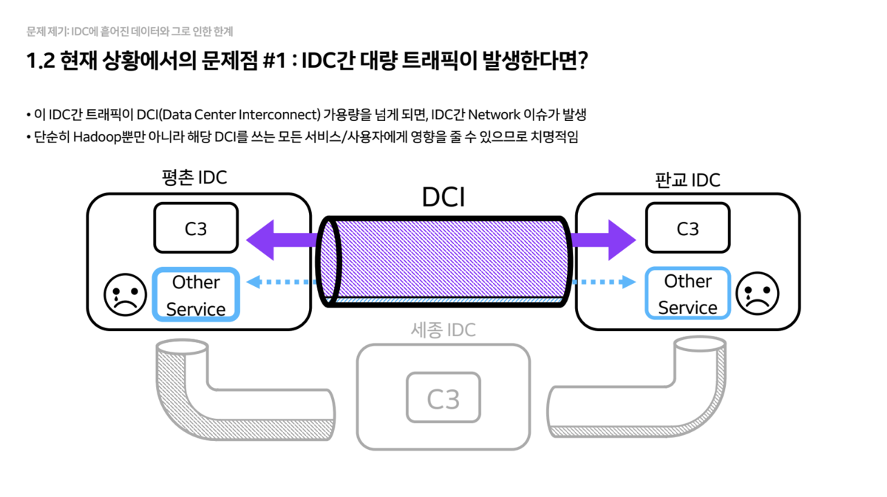

- **데이터 고립(Data Silo)**
  - 클러스터가 IDC별로 독립적으로 구성되어 있어, 타 IDC에 있는 데이터에 접근하려면 `IDC 간 네트워크(DCI)`를 타야 합니다.
  - 이때 발생하는 트래픽이 DCI 대역폭을 초과하면, 해당 회선을 쓰는 다른 모든 서비스에 장애를 유발할 수 있어 매우 위험합니다.

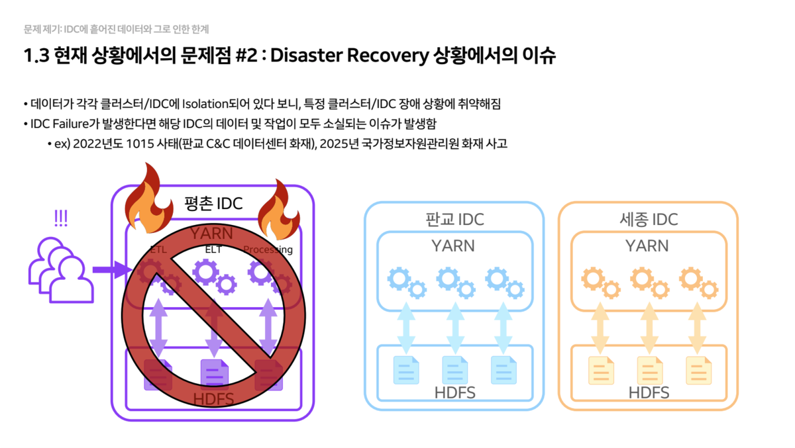

- **데이터 복구(Data Recovery)**
  - 데이터가 특정 IDC에만 고립되어 저장되므로, 화재 등으로 해당 IDC가 전소될 경우 데이터가 영구 소실될 위험이 있습니다.

#### 솔루션: IDC Seamless HDFS

NAVER는 이러한 문제를 해결하기 위해 **IDC Seamless HDFS**라는 새로운 아키텍처를 도입했습니다.

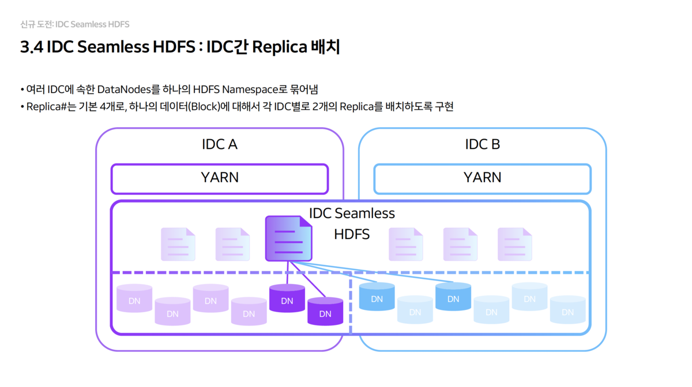

- **Logical Single Namespace**
  - 다른 IDC에 위치한 `DataNode`들을 논리적으로 하나의 HDFS Namespace로 묶었습니다.
  - 사용자 입장에서는 데이터가 어느 IDC에 있는지 신경 쓸 필요 없이, 마치 하나의 로컬 스토리지처럼 편리하게 사용할 수 있습니다.
  - 한 IDC에 장애가 발생하더라도, 다른 IDC를 통해 서비스와 데이터 접근이 중단 없이 유지됩니다.

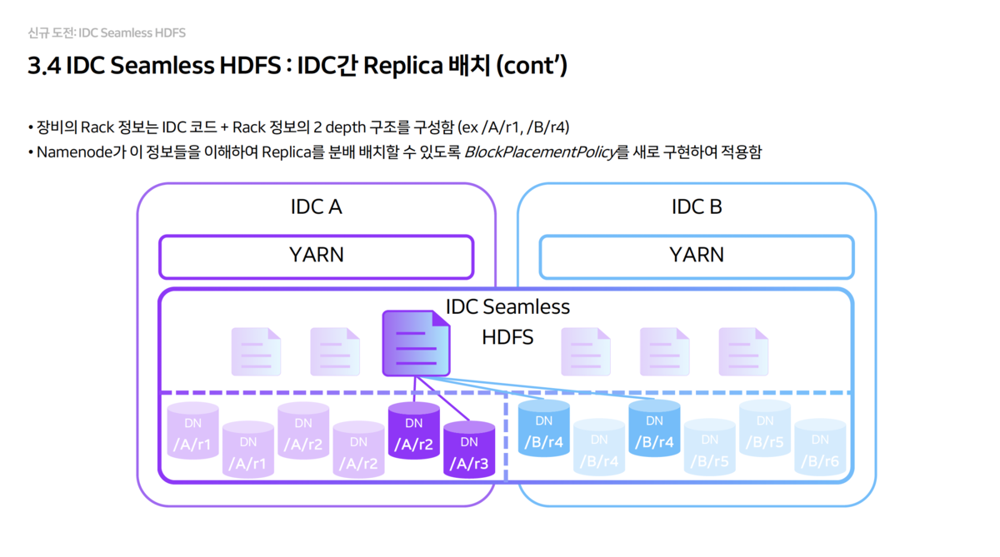

- **Replica 배치 전략 (2+2 구조)**
  - 기본 복제본(Replica) 수를 4개로 설정하고, 각 IDC에 2개씩 강제로 배치되도록 `BlockPlacementPolicy`를 새로 개발했습니다.
  - Rack 정보를 `IDC 코드 + Rack` 형태로 2 depth로 구성하여 `NameNode`가 물리적 위치를 인지하게 했습니다.

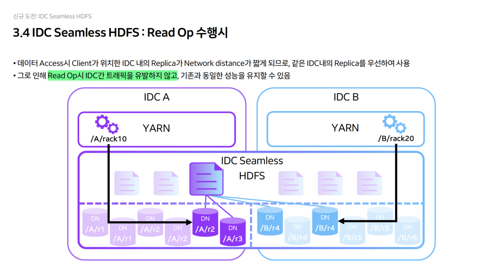

- **Read Operation 최적화**
  - 클라이언트가 데이터를 읽을 때는 항상 자신이 위치한 IDC 내의 Replica(2개 중 하나)를 우선적으로 읽도록 유도합니다.
  - 이를 통해 Read 작업 시에는 IDC 간 트래픽이 전혀 발생하지 않으며, 성능 저하도 없습니다.

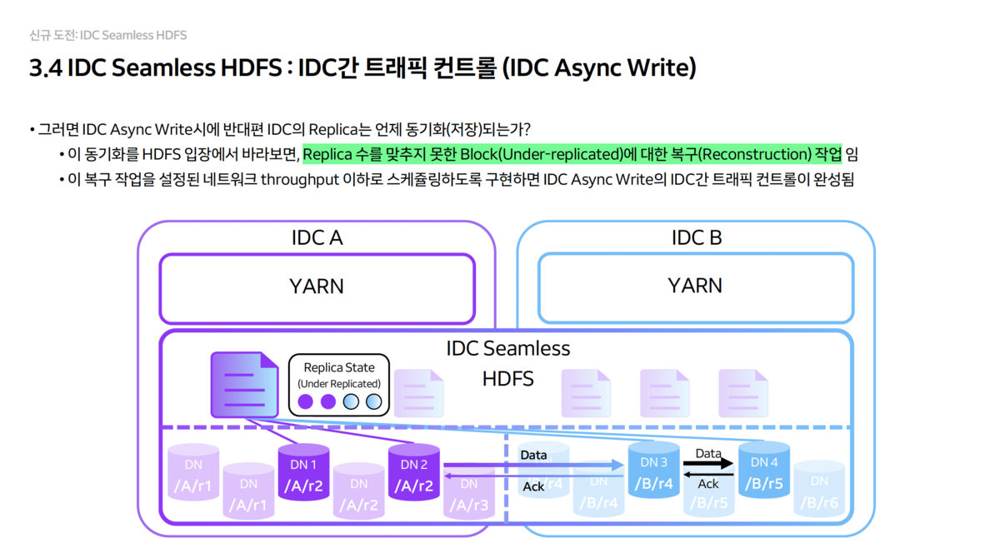

- **Write Operation 최적화**
  - **Sync Write:** 데이터 안전성이 중요할 때 사용합니다. 양쪽 IDC에 동시에 쓰기를 수행하며, 즉시 동기화됩니다.
  - **Async Write:** 성능이 중요할 때 사용합니다. 로컬 IDC에만 먼저 쓰고, 반대편 IDC로는 백그라운드에서 복제합니다.

### MLXP - GPU 효율화를 선도하는 대규모 MLOps 플랫폼

다음으로는 NAVER의 `MLOps 플랫폼, MLXP`에 대해 다룹니다. 수천 대의 GPU를 운영하는 NAVER가 어떻게 자원 효율성을 극대화하고, 대규모 학습/서빙 워크로드를 안정적으로 처리하는지 2가지 핵심 파트로 나누어 정리했습니다.

#### 전사 GPU 자원 통합 및 쿼터 시스템 구축

NAVER는 물리적 노드들을 각 조직에게 할당하는 `Private Zone` 방식으로 GPU 클러스터를 운영하고 있었습니다.

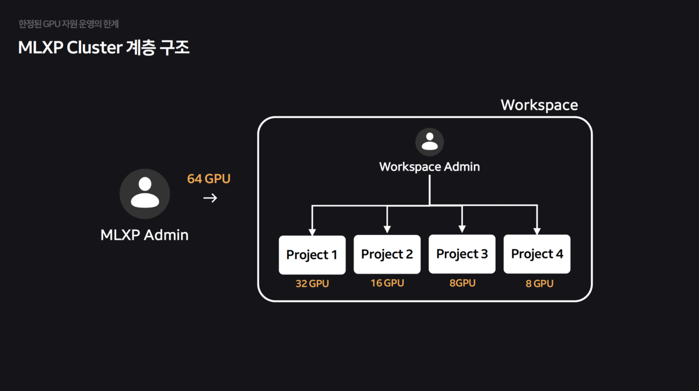

- 특정 팀은 GPU가 남아서 놀고(유휴 자원), 특정 팀은 부족해서 대기하는 불균형이 발생했습니다. 또한, A100, H100 등 이기종 GPU가 섞이면서 자원 파편화가 심화되었습니다.

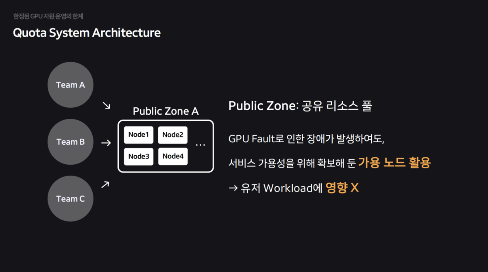

- 물리적 독점 구조를 타파하고, 모든 GPU를 하나의 `공유 리소스 풀(Public Zone)`로 통합하여 유휴 자원을 최소화했습니다.

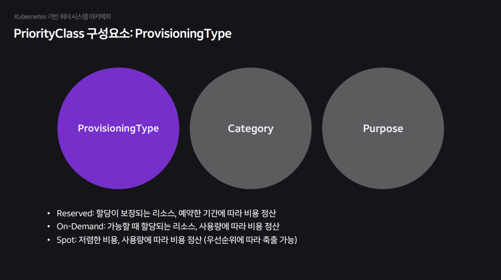

- **Priority Class:** 단순히 합치는 것을 넘어, 체계적인 쿼터 시스템을 개발하여 적용했습니다.
  - Provisioning Type: 워크로드 성격에 따라 Reserved(보장형), Spot(저가형/축출가능) 등으로 구분합니다.
  - Category & Purpose: Serving(고가용성), Training(배치), Interactive(개발) 등 목적에 따라 우선순위를 세분화하여 스케줄링의 공정성을 확보했습니다.

#### AI 워크로드 특성에 최적화된 네트워크 토폴로지 인지 스케줄링

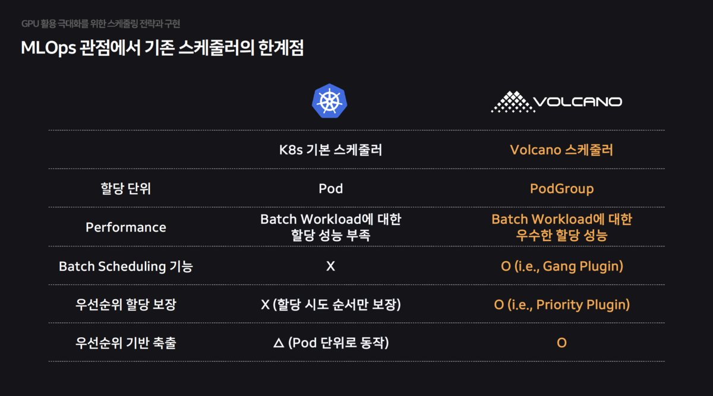

`Kubernetes`의 기본 스케줄러는 **AI 워크로드(Batch, Gang Scheduling)** 에 최적화되어 있지 않아 성능 저하를 유발했습니다. 이를 해결하기 위해 `Volcano 스케줄러`를 기반으로 기능을 고도화했습니다.

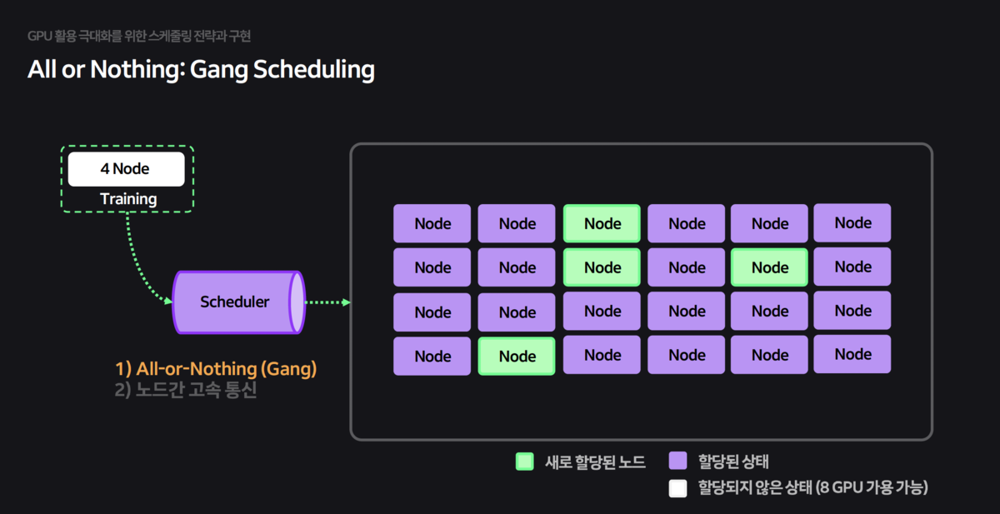

  - `Gang Scheduling:` 학습에 필요한 모든 Pod이 준비되었을 때만(All-or-Nothing) 자원을 할당하여 교착 상태(Deadlock)를 방지했습니다.

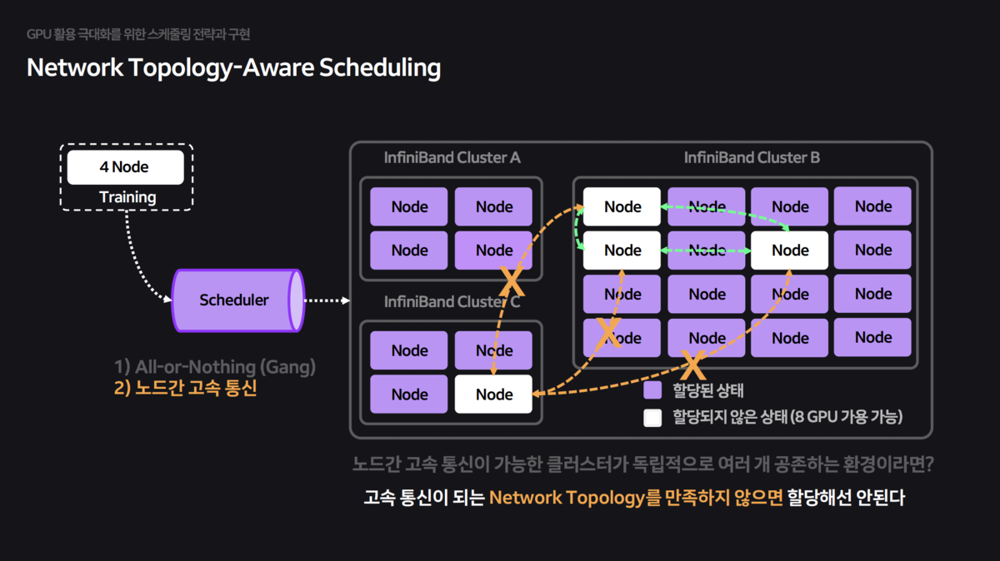

분산 학습 시 노드 간 통신 속도가 전체 학습 속도를 좌우합니다. 하지만 기본 스케줄러는 물리적 네트워크 구조(InfiniBand Switch 연결 등)를 모른 채 Pod을 무작위로 배치하여 심각한 성능 저하를 초래했습니다.

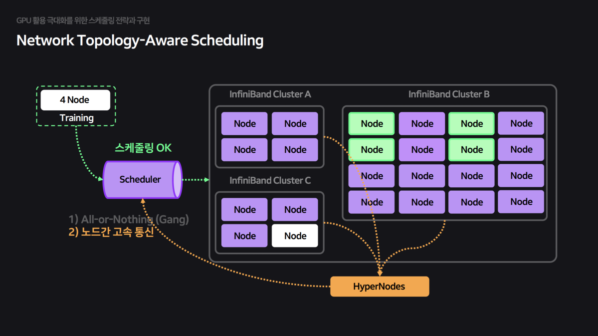

- **HyperNode CRD:** 스케줄러가 물리적 네트워크 토폴로지를 인지하고, 고속 통신이 가능한 같은 스위치 하위 노드들에 Pod을 묶어서 배치하도록 HyperNode CRD를 구현했습니다.
  - `HyperNode:` 네트워크 토폴로지 정보를 담은 CRD(Custom Resource Definition)를 정의하여 스케줄러가 이를 참조하게 했습니다
  
## 참관 후기

### 기술적 인사이트

이번 컨퍼런스에서 가장 인상 깊었던 부분은 **IDC Seamless HDFS**였습니다. 현재 HyperAccel의 개발 환경 역시 여러 클러스터로 분산되어 있어, 물리적 위치에 구애받지 않고 데이터를 공유할 수 있는 스토리지 인프라 구축이 중요한 과제입니다. NAVER의 `2+2 Replica` 배치 전략과 Read/Write 최적화 방식은 향후 우리 인프라 설계에 좋은 참고가 될 것입니다.

**MLXP** 세션에서는 대규모 AI 클러스터 운영에 대한 실질적인 인사이트를 얻을 수 있었습니다. 특히, InfiniBand 등 네트워크 토폴로지를 인지한 스케줄링은 분산 학습 성능에 직접적인 영향을 미치는 핵심 요소입니다. 대규모 LLM을 실행하려면 자사 칩을 장착한 노드들이 고속 네트워크로 연결되어야 하므로, 토폴로지를 무시한 무작위 배치는 심각한 성능 저하를 초래합니다. 

결국, 좋은 AI 칩을 만드는 것만으로는 충분하지 않습니다. **스케줄러를 비롯한 SW 스택까지 함께 개발**해야 자사 칩을 효율적으로 활용할 수 있다는 점을 다시 한번 확인할 수 있었습니다. 

## 추신

### HyperAccel 채용 안내

HyperAccel은 LLM 추론을 위한 차세대 AI 칩을 개발하고 있습니다. FPGA 검증을 완료했으며, 곧 ASIC 칩과 서버 솔루션을 출시할 예정입니다. PyTorch 생태계와의 통합을 통해 개발자들이 쉽게 사용할 수 있는 솔루션을 만들어가고 있습니다.

**채용 사이트**: https://hyperaccel.career.greetinghr.com/ko/guide

혹시 관심이 있으시다면 언제든지 연락 주세요!
