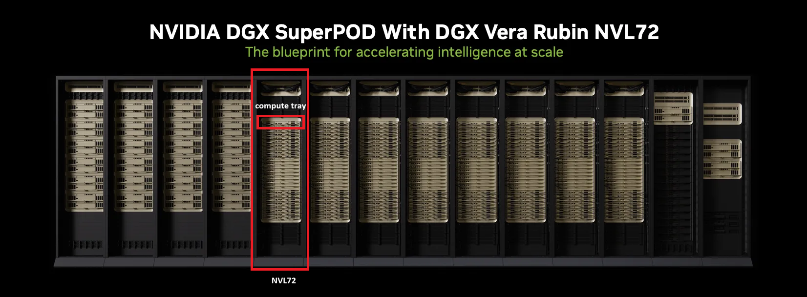
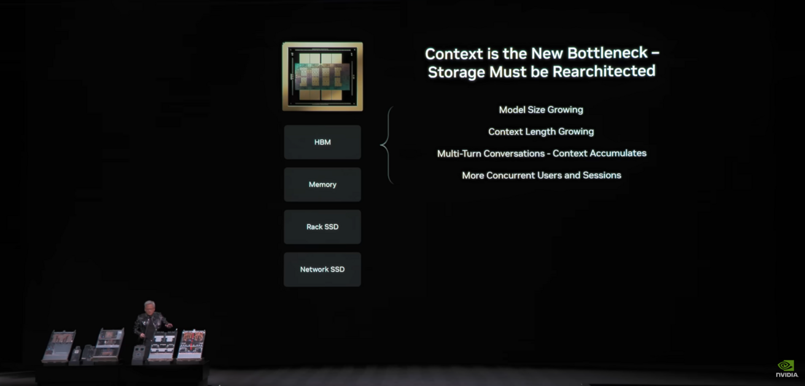
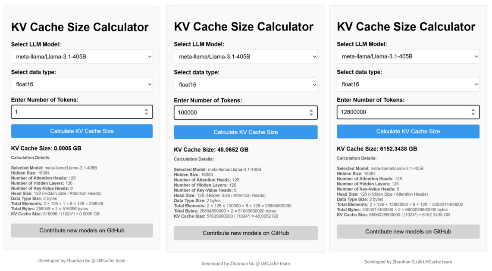
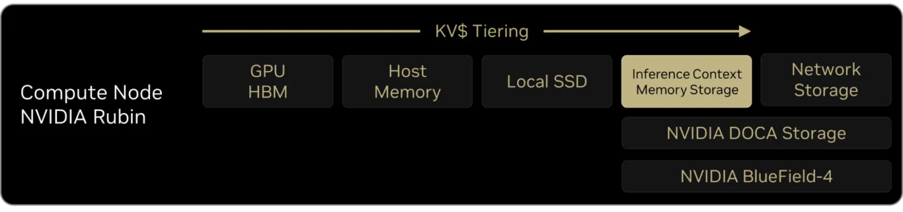
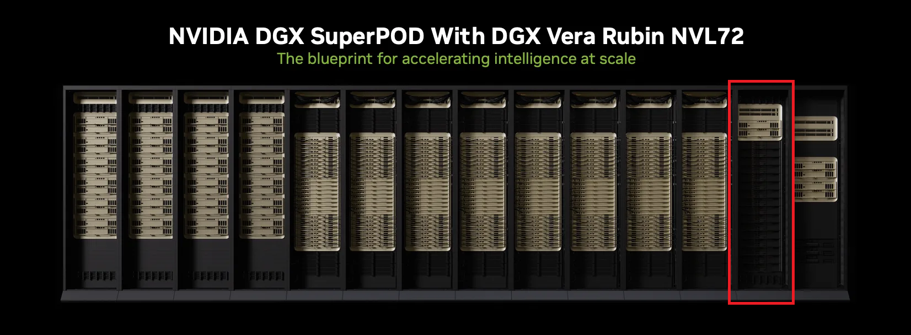
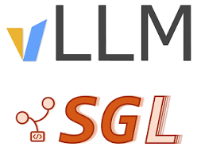
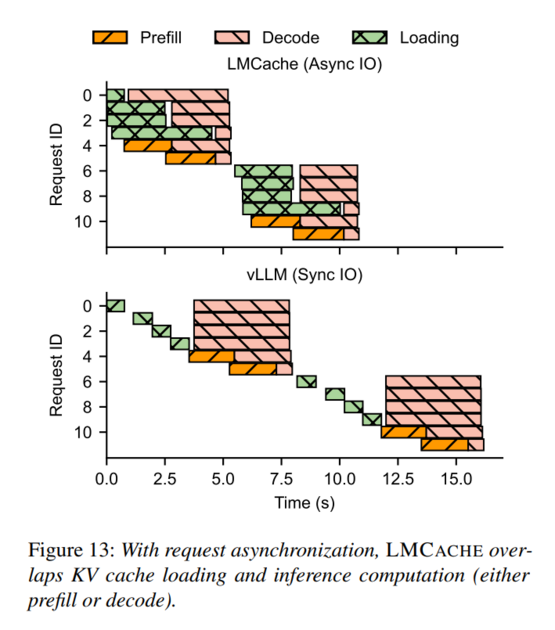
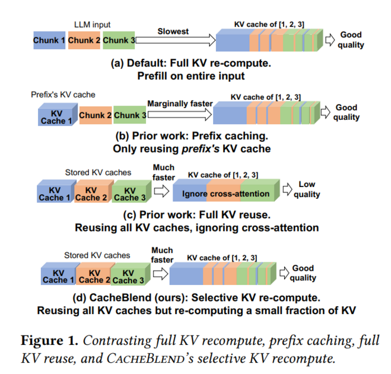
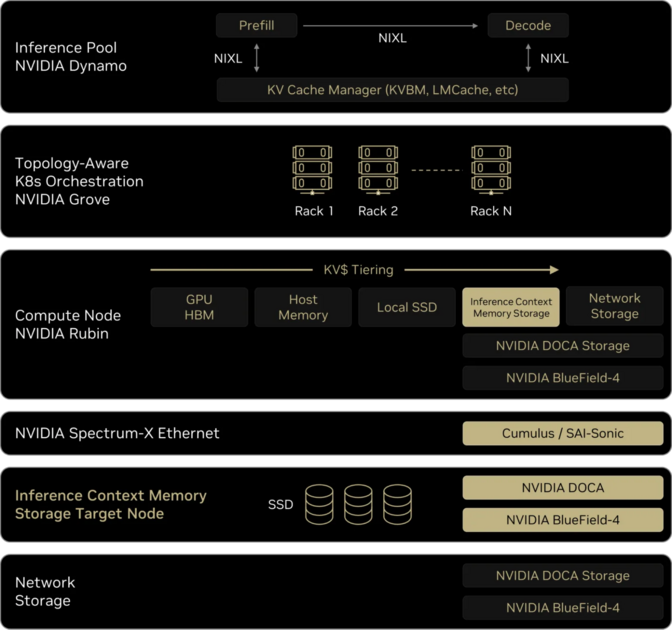

# Know Your Enemy, Know Yourself, Part 4: Memory Capacity Bottleneck and NVIDIA ICMS

> **"If you know the enemy and know yourself, you need not fear the result of a hundred battles."**  
> This series aims to deeply understand competitors' hardware for the purpose of AI accelerator design.  
> In this fourth installment, we cover **ICMS** (Inference Context Memory Storage), announced by NVIDIA CEO Jensen Huang at his CES keynote earlier this year, and the **DPU** (Data Processing Unit) that manages it.

---

Hello! I'm Jaewon Lim, a hardware verification engineer on the DV team at HyperAccel.

Today's post begins with NVIDIA CEO Jensen Huang's keynote session at CES 2026 last month. Most of the content I'll be introducing is covered in the latter half of this keynote video. I've included the link in the references section below, so if you'd like to learn more, please refer to the full video.

## The Rubin Platform

Every year, Jensen Huang's keynote serves as an important indicator of the direction of AI advancement and what the semiconductor industry needs to deliver. In particular, the latest NVIDIA GPU lineup set to launch that year and the evolution of the various components that make up the GPU pod are introduced together.

What CEO Jensen Huang emphasized in this year's keynote is the Rubin Platform — a datacenter product built around the Rubin GPU, scheduled for official release in the second half of this year.

The section highlighted with a rectangle in the image above is the NVL72 rack, equipped with 36 Vera CPUs and 72 Rubin GPUs. This rack contains 18 compute trays stacked together, with each tray housing 2 CPUs and 4 GPUs. Additionally, each tray contains other chips beyond CPUs and GPUs, designed for communication with other trays or devices such as storage.

Looking at all the chips that make up the Vera Rubin Platform together, we get the image below. While the performance improvements in CPU and GPU are certainly remarkable, what we're focusing on today is not the CPU or GPU, but the chip in the 5th position in the figure below: the **Bluefield-4 DPU**. To understand why we should pay attention to the DPU, we need to explore the **new bottleneck** in AI — a topic Jensen Huang introduced after the Rubin Platform presentation.

## Context Is the New Bottleneck: When Memory Capacity Itself Becomes the Bottleneck

Memory bandwidth is not the only bottleneck. Memory capacity itself has become a new bottleneck. In the previous post, we explained why LLM computation is memory-bound and the background behind the increasing demand for HBM. Since the KV cache must be fetched from memory every time a token is generated, memory bandwidth became the bottleneck.

However, a new problem has recently emerged: the KV cache has grown so large that it can no longer fit in GPU memory. This is because recent LLM development has been moving in the direction of increasing context length.

Representative examples include reasoning models, first introduced by OpenAI in late 2024, and agentic AI such as Claude's collaborative workflows.

### Reasoning Models

Reasoning models, led by OpenAI's o1 and o3, have gained significant attention for their remarkable performance improvements. They solve complex problems by taking extended 'thinking time.' During this process, the model internally generates numerous 'thinking tokens' before producing the final answer.
- **Internal reasoning tokens:** Even if not visible to the user, the 'thinking' tokens generated by the model to follow logical steps occupy a significant portion of the overall context.
- **Self-correction:** As the model repeatedly discovers and corrects errors during the reasoning process, even a question consisting of a few hundred tokens can rapidly accumulate thousands of tokens of context.

### Agentic AI

Agentic AI goes beyond simply answering questions — it autonomously makes plans, uses tools, and interacts with its environment. This process is carried out through repeated loops of 'observe-judge-act.'
- **Maintaining interaction history:** For consistent behavior, the agent must keep all records in its context — what tools it used, what the results were, and what the next plan is.
- **Large volumes of environmental data:** The sheer volume of data an agent must process — web page screenshots, entire codebases, extensive documents — causes the context window requirements to skyrocket.
- **Iterative refinement:** When the agent doesn't succeed on the first try, the process of analyzing failure causes and retrying accumulates, consuming tens of times more tokens compared to a typical chatbot.

To give you a sense of the capacity requirements, here is a numerical example.  
The formula for calculating the KV cache size per token in a Transformer architecture is as follows:

$$\text{Total KV Cache Memory} = 2 \times B \times S \times L \times H_{kv} \times D_h \times P$$

$$B : batch\ size$$
$$S : sequence\ length$$
$$L : num\ layer$$
$$H_{kv} : num\ head$$
$$D_{h} : head\ dimension$$
$$P : precision(BF16: 2B,\ FP8: 1B)$$

Applying this formula to the Llama 3.1 405B model (whose model config is publicly available), approximately **516KB** of KV cache is used per token. If we assume a context length of around 100K per user, the KV cache required per user is **48GB**. If 128 users are active simultaneously, the instantaneous KV cache requirement grows to **6TB**.

That's 6TB of memory needed for the KV cache alone, excluding model parameters. Even by the standards of the yet-to-be-released Rubin GPU, this amounts to the HBM of approximately 20 GPUs. In practice, memory-offloading techniques are already being used to address this — storing KV cache in the CPU's DRAM alongside the GPU, or using other GPUs' HBM to expand the available storage.

Then why not offload KV cache to neighboring compute tray GPUs connected via NVLink? With 72 GPUs in a single rack, theoretically over 20TB of HBM memory could be shared. While this may seem like the fastest approach at first glance, there are several issues at datacenter scale:

- **Opportunity cost of HBM:** HBM is too expensive and scarce a resource to use as simple storage. The moment you offload your KV cache to another GPU's HBM, that GPU loses space to handle its own new requests — essentially stealing its KV cache capacity. From a datacenter operator's perspective, GPU utilization rates must be kept high to generate revenue, making it an inefficient choice to use HBM as mere storage.
- **NVLink traffic congestion:** NVLink traffic is already dominated by communication for Model Parallelism. If KV cache sharing between GPUs becomes frequent, it encroaches on the communication bandwidth needed for actual model computation, causing traffic congestion.
- **Failure propagation risk:** If the neighboring GPU node holding your KV cache encounters a problem, your inference task stops too — creating a dependency issue.

Beyond NVLink-based sharing, there is yet another problem. So far, we've only considered the scenario where a user sends a single request. But users don't send just one request. What happens when they send multiple requests? What if one of those requests requires the same KV cache as a previous request? If the previously generated KV cache was already evicted due to capacity constraints, the GPU must recompute tens to hundreds of gigabytes of KV cache from scratch. As we discussed last time, recomputing this volume of data is an enormous waste of both computation and time.

### The Need for KV Cache Storage

Ultimately, in a datacenter environment, we need a **dedicated shared storage** solution that allows each GPU to focus solely on computation while also being able to **persistently retain** large volumes of KV cache without eviction.

This means we have no choice but to leverage memory from lower tiers of the memory hierarchy. The first option that comes to mind is storing KV cache on the **local SSDs** installed inside each server tray. However, local SSDs have two fundamental limitations:

- **Capacity constraints:** The number of SSDs that can fit inside a single server tray is very limited due to space and power constraints.
- **Sharing problem:** KV cache stored on one server's local SSD cannot be directly read by another server. It must be transferred over the network with CPU involvement, which is far too slow.

On the other hand, using general-purpose remote network storage (such as NAS) from across the datacenter provides sufficient capacity, but network latency is too high to meet the bandwidth demands of LLM serving. Local SSDs are fast but too small and cannot be shared; network storage is large but too slow.

**This is precisely the problem NVIDIA aims to solve with the DPU.**

## NVIDIA's Solution: ICMS (Inference Context Memory Storage)

NVIDIA introduced ICMS — referred to as the **G3.5 tier** — between local SSDs (G3 tier) and network storage (G4 tier) to solve this problem. It combines the fast bandwidth of local SSDs with the massive sharing capability of network storage.

Although ICMS resides in a dedicated separate rack, it is directly connected via BlueField-4 DPU and PCIe Gen 6, delivering speeds nearly indistinguishable from reading local SSDs. At the same time, it serves as a massive shared memory pool that all GPUs can access through the DPU as if it were their own local memory. NVIDIA's goal is to extend the memory available for GPU inference computation from HBM and DRAM all the way to SSD (NAND Flash) through ICMS. The highlighted section of the Rubin Platform rack shown earlier is this ICMS rack. Through this, each GPU in the Rubin Platform can utilize **1TB of existing HBM + an additional 16TB of storage** as if it were its own HBM memory. The Bluefield-4 DPU, mounted alongside the GPU in the compute tray, manages the data communication between GPU and ICMS.

## Software Optimization to Overcome Bandwidth Limitations

However, looking at the DPU's spec sheet raises a question. While HBM bandwidth is **2.2 TBps**, DPU bandwidth is **100 GBps** — approximately 1/20th the level. Even if the memory capacity available to each GPU has increased, wouldn't a memory bandwidth bottleneck occur if data from that memory arrives at a speed far slower than HBM?

This is a perfectly reasonable concern. However, this limitation can be overcome by leveraging the usage characteristics of KV cache — the very memory that ICMS targets. KV cache has the characteristic of repeatedly reusing previously generated KV cache during the decode phase. Therefore, prefetching the KV cache needed for the next token computation into the GPU ahead of time poses no significant issue. This is a domain where software-based prediction is entirely feasible.

### Inference Optimization Frameworks: vLLM, SGLang, and LMCache

Various frameworks have been developed to optimize inference computation by leveraging the KV cache characteristics described above. [SGLang](https://hyper-accel.github.io/posts/sglang-review/), which Jaewoo Kim ([Author](https://hyper-accel.github.io/authors/jaewoo-kim/), [LinkedIn](https://www.linkedin.com/in/jaewoo-kim-b38325237/)) introduced in a previous post, is one of them.

**vLLM & SGLang**

vLLM and SGLang are inference acceleration engines that provide functionality for efficiently managing KV cache **within GPU memory**. One such feature is **prefix caching**: when the the beginning(prefix) of a sequence in a given request overlaps with the beginning of a sequence in the next request, the KV cache generated from the previous request can be directly reused. Reusing KV cache generated within the same request during decoding — for each token generation — has always been possible by default. This feature goes one step further: since the same input tokens will produce the same KV cache regardless of which request they come from, KV cache can be reused across different requests without any additional computation.

However, the limitations of vLLM and SGLang are that their KV cache management scope is confined to GPU memory (+ CPU host memory), and prefix caching can only be used when input tokens are identical **from the very beginning**. Even if the same subsequence appears in the middle, it cannot be reused if the preceding prefix differs. This is because of the nature of causal attention: the KV cache generated for a given token is influenced by all tokens that come before it. This is also why the feature is called "prefix" caching.

**LMCache**

**LMCache** is a <u>distributed cache management framework dedicated to KV cache</u>, created to overcome these limitations. It provides the ability to prefetch the KV cache needed for the next computation from device memory concurrently during the current computation.

Furthermore, it supports non-prefix cache reuse using the **CacheBlend** technique, which overcomes the limitations of prefix caching. By applying additional computation for token position and prior context to KV cache generated at different positions, it can compute the KV cache with far less computation than recalculating it from scratch.

LMCache is also integrated into NVIDIA's inference framework **Dynamo**, and Dynamo with LMCache functionality is utilized within ICMS. <u>HyperAccel is also developing software to support LMCache on the LPU.</u>

## The Role of Bluefield-4 DPU

The DPU is a **co-processor** that uses this software to perform computation for data transfer and memory offload between the GPU and other devices, efficiently managing data movement. The DPU internally houses a **Grace CPU** — the predecessor to the Vera CPU — enabling it to run the storage management software described above. Previously, the CPU handled most of these tasks, but with the DPU taking over data movement operations, the existing CPU can reduce its computational burden and focus its resources on LLM scheduling and other computations. Additionally, the DPU accelerates **data encryption** functionality essential for AI cloud services, helping to build a confidential computing environment.

## Summary

Today, we explored the emerging storage bottleneck in LLMs, along with NVIDIA's new ICMS platform designed to address it, the DPU — a new processor that manages it — and the software frameworks that run on the DPU. Through this, we gained insight into the hardware and software technologies NVIDIA employs to extend GPU-accessible memory all the way to flash memory.

But what if we could place that flash memory right next to the chip for even faster access? That's exactly what **HBF** (High Bandwidth Flash), an emerging technology gaining traction recently, enables. Next time, we'll explore the solutions leveraging HBF to tackle the memory bottleneck in LLM inference.

### P.S.: HyperAccel is Hiring!

HyperAccel is on the verge of launching its first datacenter LPU product, and we are developing solutions through hardware and software optimization to address the critical LLM inference bottlenecks.

If our technical journey interests you, please apply now through [HyperAccel Career](https://hyperaccel.career.greetinghr.com/ko/guide)!

HyperAccel is waiting for your application.

## Reference

- [CES 2026 Jensen Huang Keynote](https://www.youtube.com/watch?v=0NBILspM4c4)
- [LMCache KV Cache Calculator](https://lmcache.ai/kv_cache_calculator.html)
- [Inside the NVIDIA Rubin Platform](https://developer.NVIDIA.com/blog/inside-the-NVIDIA-rubin-platform-six-new-chips-one-ai-supercomputer/)
- [Introducing Bluefield-4 powered ICMS](https://developer.NVIDIA.com/blog/introducing-NVIDIA-bluefield-4-powered-inference-context-memory-storage-platform-for-the-next-frontier-of-ai/)
- [LMCache: An Efficient KV Cache Layer for Enterprise-Scale LLM Inference](https://arxiv.org/pdf/2510.09665)
- [CacheBlend: Fast Large Language Model Serving for
RAG with Cached Knowledge Fusion](https://arxiv.org/pdf/2405.16444)
- [NVIDIA Dynamo LMCache integration](https://docs.NVIDIA.com/dynamo/latest/integrations/lm-cache)
