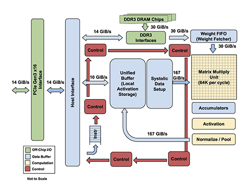
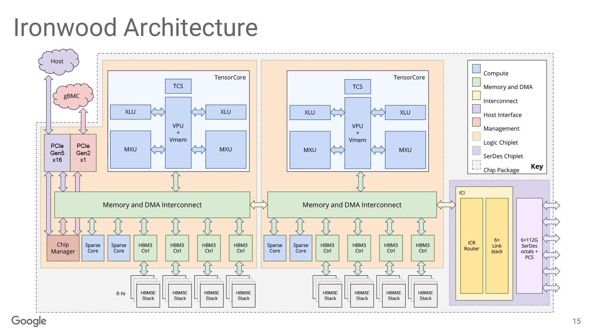
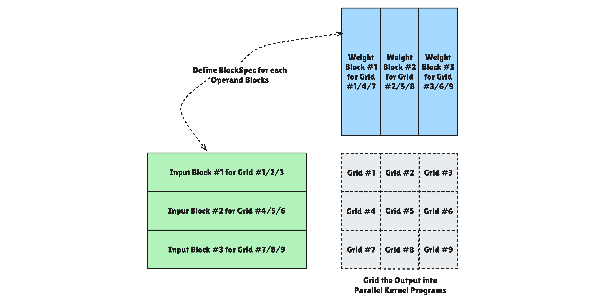
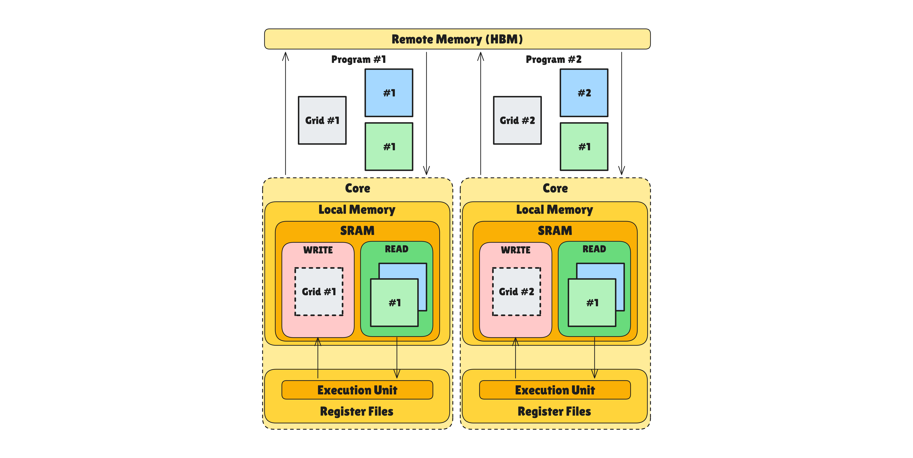
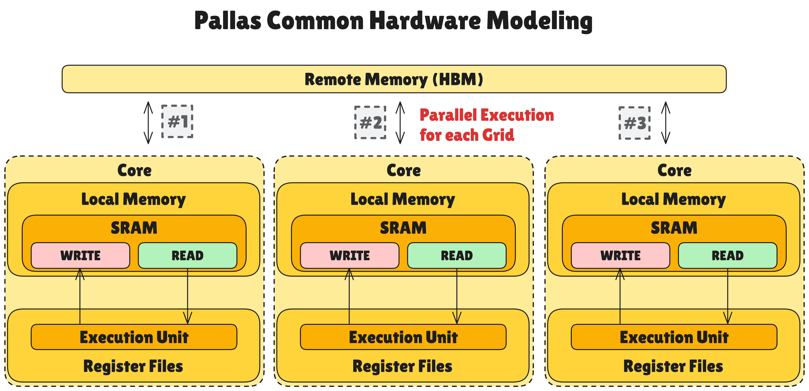
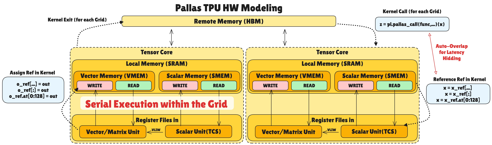
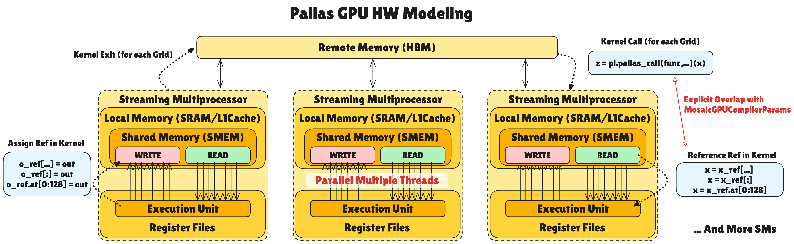
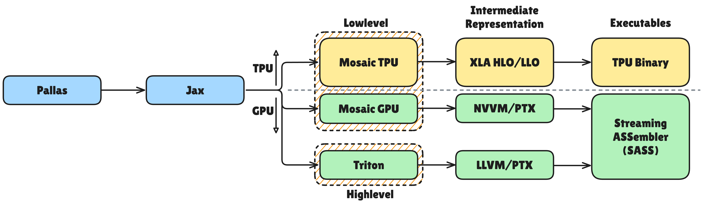

# 지피지기면 백전불태 번외편: Pallas Programming Model

> **지피지기면 백전불태(知彼知己 百戰不殆)**  
> 상대를 알고 나를 알면 백 번 싸워도 위태롭지 않다는 뜻입니다.  
> 이 시리즈는 AI 가속기 설계를 위해 경쟁사들의 하드웨어를 깊이 이해하는 것을 목표로 합니다.  
> 이번 글에서는 TPU에서 커스텀 커널을 작성할 수 있게 해주는 **Pallas** 프로그래밍 모델에 대해 다룹니다.

안녕하세요, HyperAccel ML팀 엔지니어 최동현입니다.

지난 2편에서 부상하고 있는 TPU의 하드웨어 아키텍처와 소프트웨어 스택에 대해 살펴봤습니다. 이번 글에서는 2편에 이어 TPU 소프트웨어 스택 중 Pallas에 대해 더 자세히 알아보려고 합니다.

최신 TPU 세대인 Ironwood에서는 **Pallas** 라는 프로그래밍 모델이 성능 최적화의 핵심 역할을 하고 있습니다. Pallas는 TPU에서 CUDA나 Triton처럼 커스텀 커널을 작성할 수 있게 해주는 도구로, 하드웨어의 세부 구조를 직접 제어할 수 있으면서도 Python 환경에서 비교적 쉽게 사용할 수 있다는 점이 특징입니다.

2편에서 XLA 컴파일러의 한계를 언급했듯이, 자동 컴파일러만으로는 최신 알고리즘들을 최적화하기 어려운 경우가 많습니다. Pallas는 바로 이런 한계를 넘어서기 위해 구글이 만든 커널 언어입니다. Ironwood와 함께 공개되면서 "Extreme performance: Custom kernels via Pallas"라는 슬로건으로 강조되고 있습니다. TPU의 성능을 극대화하는 데 중요한 역할을 합니다.

따라서 본 시리즈의 번외로 Pallas 프로그래밍 모델을 한번 짚고 넘어가겠습니다. 이번 글에서는 Pallas가 무엇인지, 왜 필요한지, 그리고 어떻게 TPU의 성능을 끌어올리는지 알아봅니다.

---

## Background: TPU 아키텍처와 Pallas의 필요성

Pallas를 이해하기 위해서는 먼저 TPU가 CPU나 GPU와 어떻게 다른지 알아야 합니다.

---

### 전통적인 구조 vs TPU의 Systolic Array

전통적인 CPU나 GPU 아키텍처는 연산을 위해 SRAM에서 레지스터 파일로 데이터를 매번 가져오고 저장하는 과정을 반복합니다. 행렬곱처럼 동일한 데이터를 반복해서 사용하는 연산에서는 이 방식이 막대한 **메모리 대역폭 낭비** 를 초래합니다.

TPU는 이를 해결하기 위해 **한 번 로드된 데이터가 연산기 사이를 흐르며 연속적으로 계산되는 구조** 를 채택했습니다. 이것이 바로 2편에서 설명한 Systolic Array 구조입니다.



TPU 내에서의 연산은 다음과 같은 흐름을 가집니다:

1. **Weight 공급**: DRAM에 저장된 가중치 데이터가 Weight FIFO를 거쳐 Matrix Multiply Unit(MXU)로 로드됩니다.
2. **Activation 공급**: Unified Buffer(UB)에 저장된 입력 데이터가 MXU로 전달됩니다.
3. **행렬 연산 수행**: MXU 내부의 Systolic Array 구조를 통해 곱셈과 누적(Multiply-Accumulate) 연산이 동시다발적으로 일어납니다.
4. **후처리 파이프라인**: MXU의 출력값은 Accumulator, Activation Unit(ReLU 등), Normalize/Pool Unit을 차례로 통과하며 AI 모델에 필요한 추가 연산을 수행합니다.
5. **결과 저장**: 모든 연산 플로우를 마친 최종 출력은 다시 Unified Buffer로 돌아와 저장됩니다.

---

### GPU와의 핵심 차이점: 실행 단위의 변화

이러한 구조적 차이는 프로그래밍 모델의 관점에서 매우 큰 차이를 만듭니다.

- **GPU (Single Instruction Multiple Thread, SIMT)**: 수많은 스레드가 독립적으로 계산을 수행하며, 32개의 스레드를 워프(Warp) 단위로 묶어 관리합니다. 데이터 하나하나에 집중하는 세밀한 병렬 처리가 특징입니다.
- **TPU (Single Instruction Multiple Data, SPMD)**: 한 번의 데이터 로드로 전체 연산 시퀀스를 끝내버립니다. 즉, 개별 스레드가 아닌 **'텐서(또는 타일) 하나에 대한 전체 프로그램'을 하나의 최소 실행 단위** 로 간주합니다.

> **Why Pallas?** Pallas는 TPU의 하드웨어적 특성(Unified Buffer 직접 제어, MXU 스케줄링 등)을 추상화하면서도, 개발자가 직접 '텐서 단위의 흐름'을 최적화할 수 있도록 설계된 언어입니다.



TPU는 세대를 거듭하며 벡터 연산 유닛을 강화하고, 대규모 모델 대응을 위한 스케일업 기술을 발전시켜 왔습니다. 최신 아키텍처인 Ironwood에 이르러서는 칩렛(Chiplet) 구조를 채택한 거대한 패키지 위에 **256x256 크기의 Systolic Array(MXU)를 총 4개** 나 탑재한 "괴물 연산기"가 되었습니다.

하지만 하드웨어의 체급이 비약적으로 커졌음에도 불구하고, **한 번의 데이터 로드를 통해 최대한 많은 연산을 수행한다** 는 핵심 설계 기조는 변함없이 유지되고 있습니다.

---

### 왜 Pallas가 필요한가?

2편에서 XLA 컴파일러에 대해 다뤘을 때, XLA는 강력한 최적화 컴파일러지만 한계가 있다고 했습니다. 새로운 연산 알고리즘이 등장하면 어떻게 될까요? 컴파일러가 이를 최적화할 수 있는 버전으로 업데이트되기 전까지는 수동으로 만든 커스텀 커널의 성능을 따라잡기 어렵습니다.

예를 들어 Flash Attention이나 MoE(Mixture of Experts) 같은 최신 알고리즘들은 메모리 접근 패턴이 복잡하거나 데이터 의존성이 높아 자동 컴파일러가 최적화하기 어려운 경우가 많습니다. 이런 경우에는 개발자가 직접 메모리 계층 구조를 이해하고, 데이터를 어떻게 타일링할지, 언제 메모리 간 데이터 이동을 할지 등을 세밀하게 제어해야 합니다.

GPU에서는 이런 문제를 CUDA나 Triton으로 해결했습니다. CUDA는 하드웨어를 직접 제어할 수 있지만 진입장벽이 높습니다. Triton은 CUDA보다 추상화 수준이 높아서 비교적 쉽게 사용할 수 있습니다. 하지만 둘 다 GPU에서만 작동합니다.

TPU에서는 어떻게 할까요? 구글은 2023년 무렵부터 JAX의 실험적인 확장 기능으로 **Pallas** 라는 커널 언어 API를 제공하기 시작했습니다. Pallas는 Triton과 비슷한 철학을 가지고 있지만, GPU와 TPU 양쪽을 모두 지원한다는 점이 큰 차이입니다.

---

## Pallas란 무엇인가?

Pallas는 JAX 생태계 내에서 커스텀 커널을 작성할 수 있게 해주는 커널 언어입니다. GPU와 TPU 양쪽에서 작동하며, 하드웨어의 메모리 계층 구조, 데이터 타일링, 블록 단위 병렬성 등을 직접 제어할 수 있게 해줍니다.

Pallas의 핵심 아이디어는 간단합니다. 높은 수준의 자동화된 컴파일러가 처리하기 어려운 연산을 개발자가 하드웨어에 가까운 수준에서 직접 제어할 수 있게 해줍니다. CUDA처럼 완전히 낮은 수준으로 내려가는 것은 아니고, Python 환경에서 비교적 쉽게 사용할 수 있도록 추상화되어 있습니다. 자동 컴파일러의 편의성과 수동 최적화의 제어력을 모두 제공하는 균형점을 찾은 것입니다.

---

### 핵심 추상화: Grid, BlockSpec, Ref

Pallas는 세 가지 핵심 추상화를 통해 하드웨어를 제어합니다: **Grid**, **BlockSpec**, 그리고 **Ref** 입니다.

> **Grid: 병렬 실행 추상화**



Pallas는 **Grid** 라는 추상화를 통해 실행 단위를 모델링합니다. Grid는 하드웨어별로 다른 의미를 가지지만, 통일된 인터페이스를 제공합니다.

```python
def kernel(o_ref):
    i = pl.program_id(0)  # 현재 프로그램의 ID
    o_ref[i] = i

# Grid 크기 지정: (8,) = 8개의 병렬 프로그램
result = pl.pallas_call(
    kernel,
    out_shape=jax.ShapeDtypeStruct((8,), jnp.int32),
    grid=(8,),  # 8개의 병렬 인스턴스
)()
```

Pallas에서 **Grid** 는 전체 작업을 잘게 쪼갠 실행 단위들의 집합입니다. 다만 하드웨어가 이 Grid를 처리하는 방식은 아키텍처에 따라 근본적인 차이가 있습니다.

&nbsp;

> **GPU에서의 Grid**

GPU 백엔드(Triton/Mosaic)에서 Grid는 하드웨어 스케줄러에 의한 **완전 병렬 실행** 을 전제로 합니다. 각 Grid 아이템은 하나의 **스레드 블록(Thread Block)** 에 매핑되어 개별 Streaming Multiprocessor(SM)에서 독립적으로 실행됩니다.

하드웨어가 비결정적으로 스레드를 스케줄링하므로 Grid 간의 실행 순서가 보장되지 않습니다. 따라서 개발 시 `BlockSpec`의 `index_map` 설계에서 서로 다른 프로그램이 동일한 High Bandwidth Memory(HBM) 위치에 쓰지 않도록 경쟁 조건(Race condition)을 엄격히 관리해야 합니다.

&nbsp;

> **TPU에서의 Grid**



TPU 백엔드에서 Grid는 다중 코어 간의 병렬성과 단일 코어 내의 **순차적 파이프라이닝** 을 조합한 모델입니다. 

TPU는 매우 넓은 SIMD 머신이지만, 소프트웨어적으로는 **단일 스레드 프로세서** 처럼 코딩할 수 있습니다. Tensor Control System(TCS)이 루프를 돌며 전체 연산을 제어하는 직관적인 흐름을 제공합니다.

여러 개의 TensorCore가 있을 경우 작업을 분산하여 **물리적으로 동시에** 실행하는 Parallel 차원과, 단일 TensorCore 내에서 **직렬 실행** 을 보장하는 Sequential 차원이 있습니다.

Sequential 차원은 단순히 느리게 실행하는 것이 목적이 아닙니다. **세마포어(Semaphore)** 를 통해 현재 연산과 다음 데이터의 로드를 중첩(Overlap)시켜 **메모리 레이턴시를 숨기기 위한 전략적 수단** 으로 사용됩니다.  
&nbsp;

> **BlockSpec: 메모리 레이아웃 추상화**

Pallas는 **BlockSpec** 을 통해 거대한 데이터를 하드웨어가 소화할 수 있는 크기(Chunk)로 쪼개는 과정을 추상화합니다. 이는 단순히 데이터를 자르는 것을 넘어, **HBM(Remote)과 SRAM(Local) 사이의 데이터 전송 방식 설정** 입니다.

BlockSpec은 세 가지 구성 요소로 이루어져 있습니다:

- **`block_shape`**: 각 프로그램 인스턴스가 Local Memory(SRAM) 작업대 위에 올려둘 데이터의 크기입니다. 하드웨어의 SRAM 용량을 초과하지 않도록 설계하는 것이 성능 최적화의 핵심입니다.
- **`index_map` 함수**: `grid` 인덱스(i, j)를 입력받아 HBM 상의 블록 시작 위치를 반환합니다. 이 함수는 컴파일 시점에 분석되어 하드웨어의 Direct Memory Access(DMA) 주소 계산 로직으로 변환됩니다.
- **`memory_space`**: 조각난 데이터가 머물 물리적 그릇을 지정합니다. 지정하지 않을 경우 백엔드 설정에 따라 기본 공간(`pl.SRAM`)으로 할당됩니다.  

&nbsp;

> **Ref: 메모리 참조 추상화**

Pallas는 `Ref` 객체를 통해 복잡한 하드웨어 메모리 주소 체계를 추상화합니다. 이는 단순히 데이터를 가리키는 포인터를 넘어, **SRAM(Local Memory) 상의 특정 데이터 블록에 대한 논리적 뷰** 를 제공합니다.

`Ref`의 핵심 특징은 다음과 같습니다:

- **Local Memory 참조**: `Ref`는 HBM이 아닌, 하드웨어의 가장 빠른 작업대인 **SRAM(TPU의 Vector MEM/Scalar MEM, GPU의 Shared Memory)** 에 올라온 데이터를 가리킵니다.
- **Dereferencing (역참조)**: `x_ref[...]`와 같이 대괄호를 사용하는 시점에 비로소 **SRAM → Register File** 로의 실제 데이터 로드가 발생하며, 값(`Value`)으로 변환됩니다.
- **하드웨어 추상화**: 동일한 `Ref` 인터페이스를 사용하더라도 백엔드에 따라 TPU의 Vector/Scalar 메모리나 GPU의 Shared Memory 접근으로 자동 변환됩니다. 명확한 최적화를 위해 직접 설정할 수도 있습니다.

---

### Pallas Hardware Modeling

Pallas는 TPU와 GPU 각각에 대하여 하드웨어 모델을 제공합니다. 큰 그림은 같으나 세부적으로는 다르므로, 먼저 공통적으로 구조화되어 있는 전체 구조를 살펴봅시다.



Pallas가 추상화하는 공통 하드웨어 모델은 다음과 같은 계층 구조를 가집니다:

- **Remote Memory (HBM)**: 고대역폭 메모리(High Bandwidth Memory)로, 가장 느리지만 용량이 큰 메모리 공간입니다. `pltpu.HBM` 등을 통해 명시적으로 지정하거나 `pl.ANY`를 통해 자동으로 지정할 때 주로 사용됩니다.
- **Multiple "Core" structure**: 그리드를 병렬적으로 처리하기 위한 독립적 연산 유닛들의 집합입니다. 각 코어는 독립적으로 연산을 수행할 수 있습니다.
  - **Local Memory (SRAM 혹은 Cache)**: 코어 내부에 위치한 빠른 메모리입니다. Remote Memory보다 훨씬 빠르지만 용량은 제한적입니다. HBM 상의 데이터와 일치성을 위해 READ용 변수와 WRITE용 변수를 분리하는 것을 권장합니다.
  - **Register Files in Execution Units**: 연산 유닛과 직접적으로 데이터를 주고 받을 수 있는 가장 빠른 메모리입니다. 연산에 필요한 데이터를 즉시 제공합니다.

일반적으로 Local Memory는 Register File의 10배, Remote Memory는 Local Memory의 10배 레이턴시가 소요됩니다. 그러나 Chiplet 구조를 채택한 TPU v7 Ironwood에서는 하나의 칩 안에 HBM까지 모두 가지고 있어, Remote Memory 통신이 기존 10배에서 2~5배로 빨라질 수 있습니다.

&nbsp;

> **Pallas의 TPU 하드웨어 모델**



TPU의 하드웨어 모델은 공통 모델을 기반으로 하되, TPU만의 특수한 구조를 가집니다:

**메모리 계층 구조**:

- **Local Memory** 는 Vector Memory와 Scalar Memory로 분리되어 있습니다:
  - **Vector Memory(VMEM)**: Vector 및 Matrix 관련 연산을 위한 데이터를 저장하는 메모리입니다. 동일 텐서 코어 내의 Vector/Matrix Unit (VPU/MXU/XLU)에서 접근 가능합니다.
  - **Scalar Memory(SMEM)**: Logic flow(loop, condition 등)를 위한 scalar 연산 관련 데이터를 저장하는 메모리입니다. 동일 텐서 코어 내의 Scalar Unit (TCS)에서 접근 가능합니다. TCS에서 생성하는 고수준의 명령을 통해 SMEM 상에 저장된 데이터를 벡터 연산에 직접 사용할 수도 있습니다.

- 각 VMEM과 SMEM에는 READ/WRITE를 위한 영역을 따로 배치하여 HBM과의 data sync를 확보합니다. READ로 불러와진 데이터를 수정 시 다시 write-back을 안 하기 때문에 HBM과의 데이터 불일치가 발생할 수 있어서입니다.

**데이터 흐름과 파이프라이닝**:

- 커널 호출 시 Remote Memory(HBM)에서 Local Memory(VMEM/SMEM)로 지정된 BlockSpec에 맞추어 데이터를 로드합니다. 이때 설정된 Grid 번호에 맞추어 해당하는 데이터를 자동으로 가져옵니다.

- 커널 내에서 Ref 데이터 호출 시 Local Memory에서 Register File로 데이터를 가져가 연산을 진행합니다. Local Memory ↔ Register File 간 이동 및 연산 작업 수행 중 다음 Grid에 대한 Remote Memory → Local Memory 데이터 로드가 자동으로 겹쳐져 진행됩니다. 이를 통해 메모리 레이턴시를 상당량 감출 수 있습니다.

- 커널에서 설정된 출력 Ref 데이터에 결과 데이터를 쓰면 Local Memory로 write-back되며, 이후 해당 그리드에 대한 모든 프로그램 종료 시에 출력 Ref 데이터가 Remote Memory에 write-back됩니다.

&nbsp;

> **Pallas의 GPU 하드웨어 모델**



GPU 또한 하드웨어 모델은 공통 모델을 기반으로 하되, GPU만의 구조를 가집니다:

**메모리 계층 구조**:

- **Local Memory는 Shared Memory(SMEM)**: 각 Streaming Multiprocessor(SM)별로 독립적인 Shared Memory/L1 Cache 공간을 가집니다. TPU와 달리 Scalar/Vector 구분이 없는 통합된 작업 공간이며, 수많은 스레드가 이 공간에 동시 접근하여 병렬 연산합니다.

**데이터 흐름과 파이프라이닝**:

- 단순히 하드웨어 스케줄링에만 의존하는 기존 방식과 달리 Pallas GPU는 **HBM(Remote) → SMEM(Local) 데이터 로드와 TensorCore 연산을 명시적으로 중첩(Overlap)** 합니다. `plgpu.emit_pipeline` 등을 통해 연산 유닛이 현재 데이터를 처리하는 동안 비동기적으로 다음 그리드의 데이터를 미리 가져와 메모리 레이턴시를 감춥니다.
- 커널 내부의 Ref 변수는 HBM이 아닌, Local Memory(SMEM)에 올라왔거나 올라올 예정인 데이터 조각의 주소를 가리킵니다. `memory_space=plgpu.GPUMemorySpace.GMEM` 설정을 통해 HBM(Remote) 공간을 명시하고 `copy_gmem_to_smem`으로 직접 제어할 수 있습니다.

---

### 메모리 파이프라이닝과 세마포어

TPU 아키텍처에서 HBM(Remote Memory)과 VMEM(Local Memory) 간의 데이터 이동은 수백 사이클의 레이턴시를 발생시킵니다. MXU가 아무리 빠르게 행렬 연산을 수행해도, 데이터가 도착할 때까지 기다려야 한다면 전체 성능은 메모리 병목에 갇히게 됩니다.

Pallas는 이 문제를 하드웨어 수준의 **세마포어(Semaphore)** 를 활용한 파이프라이닝으로 해결합니다.

> **Pallas의 동기화 메커니즘: Semaphore 기반의 비동기 제어**

Pallas에서 DMA와 연산 유닛은 서로 독립적으로 작동하며, 이들의 속도 차이를 조율하기 위해 **세마포어(Semaphore)** 를 사용합니다. 동작 원리는 다음과 같이 상호 신호 체계로 이루어집니다.

- **Data Load (Producer)**: DMA가 외부 메모리(HBM)에서 로컬 메모리(VMEM/SMEM)로 데이터 로드를 완료하면, 세마포어 값을 증가(Signal)시켜 데이터가 준비되었음을 알립니다.
- **Compute (Consumer)**: 연산 유닛은 세마포어 값을 확인하며 데이터가 로드될 때까지 대기(Wait)합니다. 값이 충족되면 즉시 연산을 시작합니다.
- **Feedback Loop**: 연산이 완료되면 연산 유닛은 다시 세마포어를 Signal하여 DMA에게 버퍼가 비었음을 알리고, 다음 데이터를 로드할 수 있도록 허용합니다.

이러한 Wait-Signal 구조를 통해 데이터 로드와 연산을 겹쳐서 실행(Overlapping)함으로써 하드웨어 가동률을 극대화합니다.

&nbsp;

> **Double Buffering: 레이턴시를 숨기는 핵심 기법**

세마포어를 활용한 가장 기본적인 파이프라이닝 기법이 Double Buffering입니다. Local Memory 내에 두 개의 버퍼(Buffer 0, Buffer 1)를 할당하고, 다음과 같이 동작합니다:

1. **초기화**: DMA가 첫 번째 데이터를 Buffer 0에 로드
2. **루프 시작**: VPU가 Buffer 0을 연산하는 **동시에**, DMA는 다음 데이터를 Buffer 1에 로드
3. **버퍼 교체**: 연산과 로드가 모두 완료되면 역할 교대 - VPU는 Buffer 1을, DMA는 Buffer 0에 로드
4. **반복**: 이 과정을 데이터가 끝날 때까지 반복

결과적으로 **메모리 로드 시간이 연산 시간 뒤로 완전히 숨겨집니다**. 연산이 데이터 로드보다 오래 걸리는 compute-bound 워크로드에서 특히 효과적입니다.

Pallas에서는 `pltpu.semaphore`를 통해 이러한 동기화를 명시적으로 제어할 수 있습니다. 'Read-before-ready(데이터 도착 전 읽기)'와 'Write-over-active(연산 중 덮어쓰기)' 같은 위험한 상황을 하드웨어 수준에서 방지하며, 컴파일러가 자동으로 **Prefetch와 Overlap을 최적화** 합니다.

---

### Backend Lowering과 JAX 통합



Pallas로 작성된 커널은 최종적으로 하드웨어 코드로 변환됩니다. 
GPU에서는 Triton 또는 Mosaic GPU 백엔드를 통해, TPU에서는 Mosaic 컴파일러를 통해 MLIR 형태로 낮춰지고 최종적으로 하드웨어 코드로 변환됩니다. 
이 과정에서 연산자 fusion, 타일링 자동화, 데이터 전송과 계산의 오버랩(overlap) 등이 최적화됩니다. 개발자가 작성한 고수준 코드가 하드웨어에 최적화된 코드로 변환되는 것입니다.

또한 Pallas 커널은 JAX의 `jit`, `vmap`, `grad` 같은 변환(Transform)과 호환됩니다. 따라서 고성능 커널을 작성하면서도 자동 미분, 매핑, 컴파일 등의 기능을 여전히 활용할 수 있다는 것이 큰 장점입니다. 이는 Pallas가 단순한 커널 언어를 넘어 JAX 생태계와 완전히 통합된 도구임을 보여줍니다.

---

## CUDA vs Pallas: 프로그래밍 모델 비교

1편에서 살펴본 CUDA와 Pallas를 비교해봅니다.

### 핵심 비교

| 구분 | CUDA | Pallas |
|:---:|:---|:---|
| **추상화** | 스레드 중심 (Thread → Warp → Block → Grid) | 데이터 중심 (Grid + BlockSpec + Ref) |
| **메모리 제어** | 명시적 (`__shared__`, `__global__`) | 선언적 (`memory_space`, 자동 매핑) |
| **동기화** | 수동 (`__syncthreads()`) | 자동 (세마포어 기반 파이프라이닝) |
| **하드웨어** | NVIDIA GPU 전용 | GPU + TPU 지원 |
| **생태계** | 성숙 (Nsight, cuBLAS, cuDNN) | 실험적 (JAX 통합) |
| **언어** | C/C++ | Python |

### 코드 비교: 벡터 덧셈

**CUDA** - 스레드 ID 직접 계산, 경계 체크 필요:
```cuda
__global__ void vector_add(float *A, float *B, float *C, int N) {
    int idx = blockIdx.x * blockDim.x + threadIdx.x;
    if (idx < N) C[idx] = A[idx] + B[idx];
}
```

**Pallas** - 데이터 블록 단위 추상화:
```python
def vector_add_kernel(a_ref, b_ref, c_ref):
    c_ref[...] = a_ref[...] + b_ref[...]

result = pl.pallas_call(vector_add_kernel, out_shape=..., grid=(N,))(a, b)
```
> 위 코드는 개념적 예시이며, 실제 동작을 위해서는 `out_shape`와 `BlockSpec` 등을 완성해야 합니다.

### 선택 가이드

| CUDA 선택 | Pallas 선택 |
|:---|:---|
| NVIDIA GPU 최대 성능 필요 | GPU/TPU 이식성 필요 |
| 프로덕션 안정성 중요 | 빠른 프로토타이핑 |
| 기존 CUDA 코드베이스 활용 | JAX 생태계 (`jit`, `vmap`, `grad`) 활용 |
| 성숙한 디버깅/프로파일링 도구 필요 | TPU 커스텀 커널 작성 |

---

## TPU에서 Pallas가 어떻게 활용되는가

최신 TPU 세대인 Ironwood에서는 Pallas를 중심에 두고 "Extreme performance: Custom kernels via Pallas"라는 슬로건으로 강조하고 있습니다. Ironwood 스택에서는 Pallas 정의를 통해 개발자가 Python 속에서 메모리 타일링, 데이터 이동, MXU 활용에 대한 전략을 직접 기술할 수 있습니다. Mosaic 컴파일러가 이를 TPU 코드로 낮춰 구현합니다.

이 조합을 통해 데이터 고착(input stationary), 가중치 고착(weight stationary), 출력 고착(output stationary) 등의 타일링 전략과 스트라이드, 배치(batch) 단위의 분산 처리가 효율적으로 설계됩니다. 또한 HBM ↔ 온칩 메모리 데이터 전송과 MXU 계산을 동시에 겹치게 하면서 전체 파이프라인의 스케줄링 병목을 최소화하는 설계가 가능해졌습니다.

- **최대 성능 잠재력 실현**: 자동 컴파일러가 발견하기 힘든 메모리 액세스 패턴, 타일링 전략 등을 명시적으로 조정할 수 있기 때문에, 매우 빠른 커널을 만들 수 있습니다.

- **하드웨어 추상화 유지**: 여전히 Python 언어, JAX 생태계 내에서 작업하며, `jit`, `grad` 등의 기능을 그대로 사용할 수 있습니다.

- **다중 백엔드 대응**: GPU와 TPU 양쪽을 지원하며, 동일한 커널 정의로 여러 하드웨어에서 동작하게 할 수 있는 유연성이 있습니다.

### 고려해야 할 사항

- **실험 단계**: Pallas는 아직 자주 변경되는 실험적 단계에 있습니다. 버전 업에 따라 breaking changes가 있을 수 있고, 일부 기능이 완전하지 않거나 "미구현(unimplemented)" 에러가 나올 수 있습니다.

- **실질적 이식성**: Pallas가 GPU와 TPU 플랫폼 모두를 위한 backend를 가지고 있긴 하지만, 동일 코드가 두 시스템에서 최적으로 돌아간다는 것은 아닙니다. 현재 Pallas의 이식성은 동작 가능성에 가깝습니다.

- **디버깅 및 최적화 도구 필요성**: MXU utilization, memory bandwidth utilization 등을 세밀하게 보는 도구가 CUDA ecosystem보다 부족합니다.

- **채택 장벽**: TPU 없이 GPU만 있는 상황이라면 PyTorch 기반의 Triton을 사용하는 것이 더 합리적입니다. 일반적인 ML스택(PyTorch + AWS 혹은 온프레미스 서버)에서 JAX 기반이며 대체로 GCP 기반으로 TPU를 사용해야하는 Pallas는 채택되기 어렵습니다.

---

## 마치며

이번 글에서는 TPU에서 커스텀 커널을 작성할 수 있게 해주는 **Pallas** 프로그래밍 모델에 대해 살펴봤습니다.

먼저 TPU의 Systolic Array 구조가 CPU/GPU와 어떻게 다른지, 그리고 이러한 하드웨어적 특성이 프로그래밍 모델에 어떤 영향을 미치는지 확인했습니다. TPU는 텐서 단위의 실행 모델을 채택하여, 한 번의 데이터 로드로 전체 연산 시퀀스를 수행하는 구조적 특징을 가지고 있습니다.

XLA 컴파일러가 자동으로 최적화하기 어려운 영역을 위해 등장한 Pallas는 Grid, BlockSpec, Ref라는 핵심 추상화를 통해 하드웨어의 메모리 계층 구조와 데이터 타일링을 직접 제어할 수 있게 해줍니다. TPU의 VMEM/SMEM, GPU의 Shared Memory처럼 각 하드웨어에 맞춘 메모리 모델을 제공하면서도 Python 환경에서 비교적 쉽게 사용할 수 있는 추상화 수준을 유지합니다.

CUDA와의 비교를 통해 Pallas가 더 높은 추상화 수준을 제공하면서도 하드웨어 제어력을 유지한다는 점을 확인했고, Ironwood 세대에서 Pallas가 "Extreme performance"를 위한 핵심 도구로 자리잡고 있음을 살펴봤습니다.

Pallas는 자동화된 컴파일러와 수동 최적화 사이의 간극을 메우는 중요한 도구로, 최신 알고리즘들이 요구하는 복잡한 메모리 접근 패턴을 효율적으로 처리할 수 있게 해줍니다. Flash Attention, MoE, Sparse 연산처럼 비표준적인 연산 패턴이 중요해질수록 Pallas와 같은 커스텀 커널 도구의 역할은 더욱 커질 것입니다.

---

## Reference

- [Pallas Documentation](https://docs.jax.dev/en/latest/pallas/index.html)
- [Pallas TPU Details](https://docs.jax.dev/en/latest/pallas/tpu/details.html)
- [Inside the Ironwood TPU codesigned AI stack](https://cloud.google.com/blog/products/compute/inside-the-ironwood-tpu-codesigned-ai-stack)
- [PyTorch/XLA 2.4 improves Pallas and adds eager mode](https://cloud.google.com/blog/products/ai-machine-learning/pytorch-xla-2-4-improves-pallas-and-adds-eager-mode)
- [TPU Architecture (qsysarch.com)](https://qsysarch.com/posts/tpu-architecture/)
- [TPU v7 Documentation](https://docs.cloud.google.com/tpu/docs/tpu7x?hl=ko)

---

## 추신: HyperAccel은 채용 중입니다!

지피지기면 백전불태라지만 백전백승을 위해서는 훌륭한 인재가 많이 필요합니다!

저희가 다루는 기술들을 보시고, 관심이 있으시다면 [HyperAccel Career](https://hyperaccel.career.greetinghr.com/ko/guide)로 지원해 주세요!

HyperAccel에는 정말 훌륭하고 똑똑한 엔지니어분들이 많습니다. 여러분의 지원을 기다립니다.
