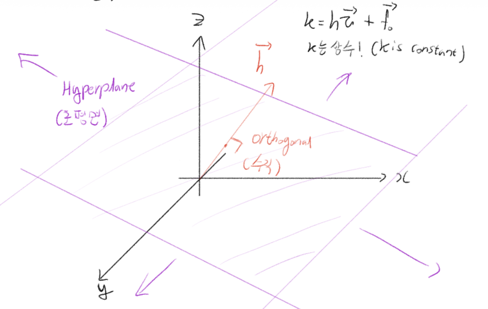
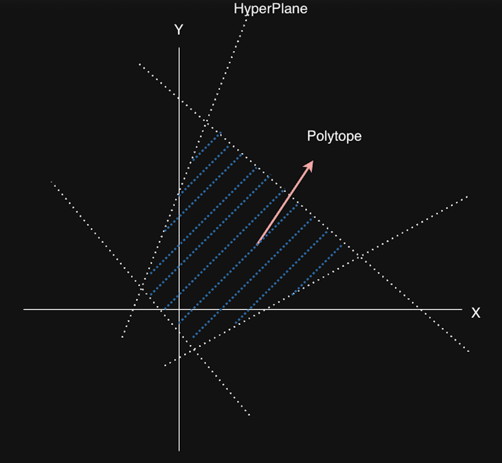

오늘은 조금은 색다른 주제를 가지고 왔습니다. 컴파일러를 사용하다가, 자동으로 컴파일러가 loop을 변형하여 최적화해주거나, 병렬화를 해 주면 좋겠다고 생각한 적이 있지 않은가요? 컴파일러 엔지니어들도 이러한 고민들을 해왔습니다. 그 중 하나의 방법으로 등장한 것이 polyhedral compiler 인데요, LLVM 의 polly 프로젝트, MLIR의 affine dialect가 사용하는 방법이기도 합니다. 오늘은 이 방법에 대해 소개해 보겠습니다. 

---

## 기본 개념

먼저, 자세히 설명하기 전에 기본적인 개념을 짚고 넘어가고자 합니다. 대부분의 개념들은 선형대수학을 조금만 알고 있다면 쉽게 접할 수 있는 것들입니다.

### Affine function (아핀 함수)

Affine 함수는 선형 변환 + 평행이동 으로 정의 가능한 함수를 의미합니다. Affine 변환을 하게 되면, 원래 선을 이루던 점들은 같은 선으로 이동하고, 두 선분의 중앙에 있던 점은 변환 후에도 여전히 중앙에 있지요. 즉, 일차 변환에서 상수합을 가능하도록 한 것을 affine 변환이라고 생각하시면 됩니다.

$f(\vec{v})=M_f\vec{v}+\vec{f_o}$

M은 행렬을 의미하며 $\vec{f}_0$ 는 상수 행렬을 의미합니다.

### Affine hyperplane (아핀 초평면)

n 차원 공간에서 n-1 차원인 affine subspace를 affine hyperplane 이라고 합니다.

hyperplane은 다음을 만족하는 벡터 ( $\vec{v}$) 의 집합입니다.

$k = h\vec{v}$ (k는 상수)

즉, n이 3차원이라면, hyperplane은 2차원 면이 됩니다.


### Polyhedron

Polyhedron이란, 유한 개의 Affine hyperplane으로 인해 나눠진 공간 (half-space) 의 교집합입니다. 그리고, bounded된 polyhedron을 polytope이라고 부릅니다. (닫힌 공간이라는 의미입니다)



### Farkas Lemma

도메인 D를 half-space들로 정의되는 polyhedron이라고 할 때,

Farkas lemma는 도메인 D 안에서 affine form (아핀 함수)을 도메인 D를 정의하는 half-space 들의 선형 식으로 표현 가능함을 의미합니다.

다시 말해, half space들이 다음과 같이 정의될 때,

$a_k\vec{x} + b_k ≥ 0, k = 1,p$

affine function (아핀 함수) $\psi(\vec{x})$ 가 D 안에서 non-negative인 것과 $\psi(\vec{x})$ 가 non-negative인 half space들의 선형 결합으로 표현 가능하다는것은 동치입니다.

$\psi(\vec{x}) = \lambda_0 + \sum_{k=1}^{p}\lambda_k(a_k\vec{x} + b_k)\   where \ \lambda_0, \lambda_1, ..., \lambda_p \ge 0$ 

조금 더 풀어서 설명하자면 우리가 어떤 아핀 함수를 정의했고, 이것이 domain D 안에 있다고 하겠습니다. 만약 이 함수가 비음수 (non-negative)라면, 그 함수는 domain D를 정의하는 half-space들의 선형 식으로 표현이 가능하며, 또한 그 반대(역) 도 성립합니다.

이 Lemma를 이용하여 Affine 함수로 정의된 schedule을 변환할 때, half-space들의 선형 결합으로 변환하여 ILP를 이용해 문제를 더 쉽게 풀 수 있도록 해 줍니다.

---

## 프로그램의 구성 요소의 해석

이제 기본이 되는 개념들을 소개했으니, 어떻게 우리가 프로그램을 표현할 수 있는지 살펴보도록 합시다. 

간단한 프로그램을 하나 가져와 보겠습니다

```c
for(int i = 0; i < N; ++i){
  for(int j = 0; j < N; ++j){
    x[i] = x[j]*2 + y[j]; // Statement 1, iteration vector : (i, j)
  }
  for(int k = 0; k < N; ++k){
    y[i] = y[i]*2;        // Statement 2, iteration vector : (i, k)
  }
}
```

이 프로그램은 3개의 loop과 2개의 statement로 이루어져 있습니다. 각 statement 는 **iteration vector**를 가지는데, iteration vector란, 각 statement가 영향을 받는 loop induction variable (iterator variable)들을 벡터 형태로 표현한 것입니다.

즉, Statement 1 `x[i] = x[j]*2 + y[j]` 의 iteration vector는 `(i, j)` 가,

Statement2 `y[k] = y[k]*2` 의 iteration vector는 `(i, k)` 가 됩니다.

### Schedule vector

Schedule vector란 각 statement가 언제 실행될지 나타내는 vector입니다. schedule vector에는 statement가 속한 위치와 감싸고 있는 loop들에 대한 정보가 들어 있습니다.

Schedule vector는 statement의 실행 시점을 나타내며, polyhedral analysis에서는 이를 이용하여 statement의 조건을 검사하거나, transformation을 수행하게 됩니다.

위 예시에서, Statement 1의 schedule vector는 `(i, 0, j)` 가, Statement 2는 `(i, 1, k)` 가 됩니다.

Schedule vector를 설정하는 방법은 다음과 같습니다.

1. Outermost scope부터 기술
2. loop이 존재한다면, 그 loop의 induction variable을 넣는다
3. 한 scope안에 여러 statement (loop 포함) 이 존재한다면, scalar 값을 넣어 분리합니다 (이를 scalar dimension이라 부릅니다)
    1. 위 예시에서는 loop i 내부에 loop이 2개가 있으므로, 이를 scalar dimension으로 분리했습니다.
4. 1,2,3 에 의해, 가능한 schedule vector의 최대 길이는 nested loop이 m개 있다 할 때, 2m + 1개가 됩니다.
    1. `<가장 바깥쪽 scope의 scalar dimension> + <각 loop의 iteration vector>*m + <각 loop 내부의 scalar dimension> = 2m + 1`
    2. 일반적으로, scalar dimension이 필요 없는 경우 (즉, scope내부에 statement가 1개인 경우) 는 scalar dimension을 생략합니다.

또 다른 예시를 들어 볼까요?

아래와 같은 코드가 있다고 합시다.

```c
for (int i = 0; i < N; ++i) {
    for (int j = 0; j < N; ++j) {
        A[i][j] = A[i][j] + u[i]  * v[j] + u2[i] * v2[j];   // S0
    }
    B[i] = A[i][0]; // S1
}
for (int k = 0; k < N; ++k) {
    for (int l = 0; l < N; ++l) {
        x[k] = x[k] + beta * A[l][k] * y[l];  // S2
    }
}
```

그렇다면, 각 Statement는 다음과 같은 schedule vector를 가지게 됩니다

S0 : $\begin{pmatrix}0&i&0&j\end{pmatrix}$  → 0 번째 loop i 내부 0번째 loop j의 유일한 statement

S1 : $\begin{pmatrix}0&i&1\end{pmatrix}$ → 0번째 loop i 내부 1번째 statement

S2 :  $\begin{pmatrix}1&k&l\end{pmatrix}$ → 1번째 loop k의 내부 유일한 loop l 의 유일한 statement

---

## Polyhedral analysis

이제 Polyhedral analysis를 수행해 봅시다. 가장 먼저, loop이 병렬화가 가능한지 분석을 해 보겠습니다.

### Parallelism analysis

다음 코드를 생각해보죠. 아래 코드는 병렬화가 가능할까요?

```c
// Q. loop i 와 loop j 는 병렬화가 가능한가?
for(int i = 0; i < N; ++i){
  for(int j = 0; j < N; ++j){
    if(i > j)
      b[i][j] = b[j][i]; // S0
  }
}
```

우선 병렬화가 가능하려면 어떤 조건이 필요할까요? loop i 혹은 loop j를 병렬화 하려면, 각 iteration사이에 아무런 연관성이 없어야 합니다. 각 iteration이 독립적으로 실행된다면 상관 없지만, 한 iteration에서 쓴 것을 이후의 다른 iteration에서 읽어야 한다면 (혹은 그 반대가 된다면) loop을 병렬화할 수 없겠지요. 그렇다면 위의 예시 코드는 어떤가요?

이 코드는 matrix B를 transpose하고 있습니다. 상삼각 matrix (upper-triangular matrix)를 하삼각 matrix(lower-triangular matrix) 로 옮겨 쓰고 있지요. 따라서, 각 loop iteration 사이에 아무런 관계가 없으므로 (dependency가 없으므로) 병렬화가 가능합니다.

그러면 이것을 Polyhedral analysis로 어떻게 알 수 있을까요?
우리는 몇 가지 과정을 거쳐서 이를 알아낼 수 있습니다.
  
1. 각 statement의 iteration vector를 구합니다.
2. iteration vector를 바탕으로, Domain을 나타냅니다.
3. Domain이 비어있는지 확인합니다.

S0의 iteration vector는 (i, j)가 됩니다. 그리고, S0에는 읽기와 쓰기, 두 개의 동작이 있지요.

그럼 S0를 읽기와 쓰기 관점에서 보게 되면,

Read_s0(i, j) = (j, i)

Write_s0(i, j) = (i, j)

그리고, S0의 polyhedron (Domain $D_{s0}$)은 다음과 같이 정의됩니다.

1. i ≥ 0 && i < N
2. j ≥ 0 && j < N
3. i > j

Memory dependency가 있으려면, 다음을 만족해야 합니다.

$$
\exists(\vec{s}, \vec{t}) : \begin{cases} \vec{s} \in D_{s0} \newline \vec{t}\in D_{s0} \newline W(\vec{s}) = R(\vec{t})\end{cases}
$$

이때 $\vec{s}$ 와 $\vec{t}$ 는 서로 다른 임의의 iteration vector 이며, 각 iteration에서 statement S0를 read 및 write관점으로 해석합니다. 즉, 각 loop에서 병렬화가 가능하려면 서로 다른 iteration vector를 넣었을 때, $R(\vec{t})$(`READ_s0(i, j)`) 와 $W(\vec{s})$(`WRITE_s0(i, j))`)가 같으면 안 되겠지요?

자 이제, $\vec{s} = (i, j), \vec{t} = (i' ,j')$ 으로 표현하여 그대로 대입해보겠습니다.

$W(\vec{s}) = R(\vec{t})$ 를 풀어 쓰면, $(i', j') = (j, i)$ 이고, 이를 Read시의 조건에 대입하면,  $i' > j' \implies j > i$ 이며, Write시 조건은 $i > j$ 가 되지요. 

그런데, $i > j$ 과 $j > i$ 는 당연히 동시에 만족될 수 없겠지요?

따라서, dependence polyhedron은 공집합이 되어 아무런 iteration간 아무런 dependency가 없으므로, loop i 및 loop j가 모두 병렬화 가능하다는 결론에 이르게 됩니다. (애초에 domain이 공집합이니, Schedule vector를 만들 필요가 없지요)

하나의 예시를 더 들어 보겠습니다.

```c
for(int i = 0; i < N; ++i){
  for(int j = 0; j < M; ++j){
    a[i][j] = a[i][j-1]; // S0
  }
}
```

이 경우 코드는 어떻게 병렬화가 가능할까요?

1. iteration domain
    1. i ≥ 0 && i < N
    2. j ≥ 0 && j < M
2. iteration vector
    
    $$
    \exists(s, t) : \begin{cases} \vec{s} \in D_{s0} \newline \vec{t}\in D_{s0} \newline W(\vec{s}) = R(\vec{t})\end{cases}
    $$
    

이를 통해 Schedule vector를 만들어 봅시다. Parallel 하다는 것은, 각 Schedule 사이의 dependency가 없어야 한다는 의미이므로, 모든 loop이 병렬화가 가능하려면, 아래와 같은 조건을 만족해야 합니다. (일부만 0이라면 해당 dimension에 해당하는 loop만 병렬화가능)

($\phi(\vec{s}), \phi(\vec{t})$ 는 각 iteration에서의 schedule vector라 합시다.)

$$
\phi_{s0}(\vec{t}) - \phi_{s0}(\vec{s}) =\vec{0}
$$

Scalar dimension을 생략한다면,

$$
\begin{pmatrix}i \newline j \end{pmatrix} - \begin{pmatrix} i' = i \newline j' = j-1 \end{pmatrix} = \begin{pmatrix}0 \newline 1 \end{pmatrix}
$$

즉, loop i는 0, loop j는 1이 나왔으므로, loop j에만 dependency가 존재함을 알 수 있습니다. 따라서, 위 예제는 loop i만 병렬화가 가능합니다.

이렇게 schedule vector를 만들어서 병렬성을 분석하는 예시도 만들어 보았습니다.

---

## Polyhedral transformation

이제, polyhedral transformation에 대해 알아봅시다. polyhedral transformation은 분석한 code를 더 효율적으로 바꾸는 과정인데요, llvm-polly같은 라이브러리에서 최적화를 위해 실행합니다.

핵심은, 코드의 correctness를 유지하면서, cost function을 만들어, cost를 줄이는 방향으로 코드를 변환하는 것입니다.

Statement $S^k$의 $i$ 번째 dimension에 관하여 schedule vector의 일부를 다음과 같이 쓸 수 있습니다.

$$
\phi_{S_i^k}(\vec{t})=\begin{pmatrix}c_0^i&c_1^i&\cdots&c_n^i\end{pmatrix}\begin{pmatrix}i_0\newline i_1\newline i_2\newline \cdots\newline i_{n-1}\newline 1\end{pmatrix}
$$

$c_0^i ...c_n^i$ 은 polyhedral optimization을 통해 찾는 transformation parameter 들입니다. $c_n^i$는 scalar dimension을 나타낼 때 사용됩니다.

이를 모든 dimension에 관해 표현할 경우 다음과 같이 쓸 수 있습니다.

$$
\tau_s \vec{t}=\begin{pmatrix}\phi_{S_i^0}(\vec{t}) \newline\phi_{S_i^1}(\vec{t}) \newline\vdots \newline\phi_{S_i^{k-1}}(\vec{t})\end{pmatrix}=\begin{pmatrix}c_1^0 & c_2^0 & \cdots & c_n^0 \newline c_1^1 & c_2^1 & \cdots & c_n^1 \newline\vdots & \vdots & \ddots & \vdots \newline c_1^{k-1} & c_2^{k-1} & \cdots & c_n^{k-1}\end{pmatrix}\vec{t}+\begin{pmatrix}c_0^0 \newline c_0^1 \newline \vdots \newline c_0^{k-1}\end{pmatrix}
$$

이때 $\vec{t}$는 iteration vector를 의미합니다.

Transformation matrix 내부의 parameter들을 정하게 되면, 새로운 schedule vector가 나오겠지요? 그럼 우리가 이전에 정한 constraint들을 유지한 채로, transformation matrix를 적용해서 나온 schedule vector대로 프로그램을 만들면,
그 프로그램은 모습이 조금 바뀌겠지만, (Loop 의 구조나 statement들의 index가 바뀌겠지만) 변환 이후에도 정상적인 동작을 할 것입니다. 어쩌면 새로운 구조에서는 병렬화가 가능해지거나, temporary variable이 필요하지 않을수도 있지요.

Transformation parameter는 일반적으로는 ILP를 통해 cost function을 최소화시키는 방향으로 찾으나 genetic algorithm, bayesian optimization, RL 등등의 다양한 방법을 생각해볼 수 있습니다.

이 역시 예시를 통해 자세히 생각해 봅시다.

```c
for(i = 0; i < N; ++i){
  for(j = 0; j < N; ++j){
    for(k = 0; k < N; ++k){
      c[i][j] = c[i][j] + a[i][k] * b[k][j]; // S1
    }
  }
}
for(i = 0; i < N; ++i){
  for(j = 0; j < N; ++j){
    for(k = 0; k < N; ++k){
      d[i][j] = d[i][j] + e[i][k]*c[k][j]; // S2
    }
  }
}
```

자 그럼 이 코드를 간단히 transformation 하는 예시를 봅시다.

**Statement S1의 변환:**

$$
\tau_{s_1}(\vec{i}_{s_1}) = \begin{pmatrix} 0 & 1 & 0 \newline 1 & 0 & 0 \newline 0 & 0 & 0 \newline 0 & 0 & 1\end{pmatrix}\begin{pmatrix}i \newline j \newline k \end{pmatrix} + \begin{pmatrix} 0 \newline 0 \newline 0 \newline 0\end{pmatrix}
$$

따라서 각 dimension의 schedule은:

$$
(\phi_{S_1}^1, \phi_{S_1}^2, \phi_{S_1}^3, \phi_{S_1}^4) = (j, i, 0, k)
$$

**Statement S2의 변환:**

$$
\tau_{s_2}(\vec{i}_{s_2}) = \begin{pmatrix} 0 & 1 & 0 \newline 0 & 0 & 1 \newline 0 & 0 & 0 \newline 1 & 0 & 0\end{pmatrix}\begin{pmatrix}i \newline j \newline k \end{pmatrix} + \begin{pmatrix} 0 \newline 0 \newline 1 \newline 0\end{pmatrix}
$$

따라서 각 dimension의 schedule은:

$$
(\phi_{S_2}^1, \phi_{S_2}^2, \phi_{S_2}^3, \phi_{S_2}^4) = (j, k, 1, i)
$$

이것은 새로운 schedule vector입니다.  vector의 각 loop을 순서대로 t0, t1, t3 라 하고 새로운 loop을 만들어 보면 아래와 같은 코드를 얻을 수 있습니다.

```c
for(t0 = 0; t0 < N; ++t0){
  for(t1 = 0; t1 < N; ++t1){
    for(t3 = 0; t3 < N; ++t3){
      // i -> t1, j -> t0, k -> t3
      c[t1][t0] = c[t1][t0] + a[t1][t3]*b[t3][t0]; // S0
    }
    for(t3=0; t3 < N; ++t3){
      // i -> t3, j -> t0, k -> t1
      d[t3][t0] = d[t3][t0] + e[t3][t1]*c[t1][t0]; // S1
    }
  }
}
```

이 코드느 원래 코드와 같은 동작을 하지만, loop의 구조가 조금 달라졌습니다 (맨 바깥쪽 loop이 하나로 합쳐졌지요). 이 프로그램이 기존과 똑같은 결과를 낸다는 것은 우리가 transformation matrix의 파라미터를 이전 프로그램의 constraint (dependency 등) 를 만족한다는 가정을 미리 넣고 찾았기 때문에 보장된다고 할 수 있습니다.

결국 핵심은, domain constraint들을 모두 만족하면서 가장 cost function을 작게 만드는 transformation matrix $\tau_s$를 찾는 것인데요, 보통은 ILP를 통해 찾습니다. 예를 들어, 위 예시에서는 statement `S2` 에서 C를 read하는 부분이 statement `S1` 에서 C를 write하는 부분보다 나중에 실행되어야 한다는 constraint와, i, j, k의 loop 범위에 관한 constraint들을 추가할 수 있겠지요? 이러한 constraint를 추가한 다음 ILP를 푸는 식이지요.

보다 구체적으로 optimal transformation matrix를 어떻게 찾는지에 관한 알고리즘은 다음 글에서 설명드리도록 하겠습니다.

## 참고 문헌
[Effective Automatic Parallelization AND Locality Optimization Using The Polyhedral Model ](https://www.csa.iisc.ac.in/~udayb/publications/uday-thesis.pdf)(Uday, 2008)
