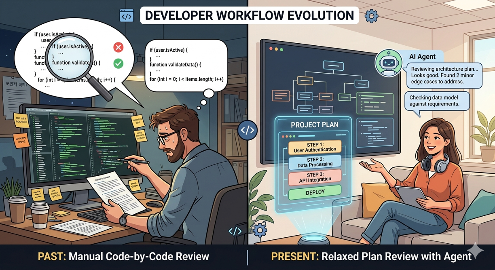

# Project Glasswing: Claude Mythos Preview

Hi, I'm Hyunjun Park from the HyperAccel CL (Compute Library) Team.

In early April 2026, Anthropic introduced an unreleased frontier model called **Claude Mythos Preview** alongside an industry coalition called [Project Glasswing](https://www.anthropic.com/glasswing). News about new models usually stops at "benchmark scores went up," but this time the [Frontier Red Team blog](https://red.anthropic.com/2026/mythos-preview/) went on at unusual length: a month of internal evaluation and vulnerability write-ups. Mythos-level coding and reasoning now extend in one stride past what typical benchmarks cover, into **vulnerability discovery** and **exploit code generation** as well. I'll admit I first wondered if it was mostly marketing, but the more I read, the more this felt like a story bigger than the numbers alone.

---

## What Is Mythos Preview?

### Project Glasswing

Glasswing is a **defense-first** collaboration program with participants including AWS, Apple, Google, Microsoft, and the Linux Foundation. The key idea is not to maximize broad release speed, but to connect high-risk capabilities to defensive communities first so they can improve real response capacity. In other words, this is less about a simple "release vs. no release" decision and more about a staged distribution strategy: who gets access first, and under what controls.

Anthropic explicitly states there is **no general availability (GA) plan** for Mythos Preview. This looks less like a technical limitation and more like a deliberate choice to contain the downside risk of rapidly spreading strong cyber capabilities.

According to the Red Team write-up, when instructed by a user, Mythos Preview can identify **zero-day vulnerabilities** (previously undisclosed flaws) and even produce exploit code across **major operating systems and major web browsers**. That capability can dramatically improve defense productivity, but it can also increase misuse velocity, which helps explain the restricted-release approach.

### The Emergence of a New Kind of LLM Value

What separates Mythos from previous models is not simply "how well it scores on known tests," but "how far it can solve problems that were not in its learned patterns." Older models improved by recalling learned patterns on human-made tests. Mythos appears to create a new kind of value even in **vulnerability discovery** outside those patterns.

This "new value" does not mean a higher benchmark number by itself. It means the model can uncover severe system flaws that remained hidden for years in real operational environments, and turn those findings into directly actionable defensive decisions. The Red Team cases (OpenBSD, FFmpeg, FreeBSD) are presented as evidence of exactly that: long-missed flaws being identified in practice.

---

## What Is Different About Mythos Preview?

### Evolution of Benchmarks

Each time a new frontier model arrives, benchmark design tends to tilt toward the dimensions where that model's strengths are visible, while new metrics are added on top.

If we simplify benchmark evolution since the rise of LLMs, it looks like this:

1. **Pattern-matching style tests** — early benchmarks, focused on short knowledge questions or tiny function-level fixes.
2. **Real codebase-level coding** — evaluates whether the model can solve tasks with full project context, not isolated snippets.
3. **Long-horizon agentic execution** — checks whether the model can complete higher-level tasks through **attempt, failure, and retry**, not just one-shot answers.
4. **Real-outcome-oriented evaluation** — have the model hunt for **zero-days** (vulnerabilities absent from public benchmark datasets), then use successful hits to verify the capability is not merely memorizing known tests.

As this shift continues, many public benchmarks approach saturation and stop being strongly discriminative. Measurement naturally moves to the next questions: can the model push larger chunks of work end-to-end, and can it operate reliably in domain-specific contexts? The center of gravity is moving toward **large-scale tasks** and **domain-specialized workloads**.

The evaluation tables Anthropic published with [Claude Opus 4.7](https://www.anthropic.com/news/claude-opus-4-7) reflect this trend as well, with side-by-side domain benchmarks across coding agents, terminal tasks, long context, tool use, finance, and document understanding.

### Mythos Benchmark Results

The Glasswing page and the Red Team post both include several benchmark tables. On the rows they cite, Mythos Preview is listed with higher scores than Opus 4.6; the tables are long, so here is a small excerpt:

| Benchmark | Mythos Preview | Opus 4.6 |
| --- | ---: | ---: |
| CyberGym | 83.1% | 66.6% |
| SWE-bench Verified | 93.9% | 80.8% |
| Terminal-Bench 2.0 | 82.0% | 65.4% |

The numbers alone already suggest a large jump, but unfamiliar benchmarks landed more slowly for me than the concrete stories in the [Red Team post](https://red.anthropic.com/2026/mythos-preview/). The write-ups include vulnerabilities found in software that had been running in production for a long time; I go through the details in the next section.

## Cases of Successful Defensive Use

### OpenBSD, TCP SACK (27-year-old vulnerability)

The first case is a bug that sat inside an OS for 27 years before it was surfaced. **Selective Acknowledgment (SACK)** is a TCP feature that tells the sender to retransmit only missing segments. According to the Red Team report, Mythos Preview found a problematic combination in OpenBSD's SACK handling: a weak range-boundary validation path and an **integer arithmetic overflow** in sequence-number comparison logic. Under conditions that should not become true at the same time, the kernel may attempt writes to invalid addresses, potentially causing **remote Denial of Service (DoS)**.

### FFmpeg, H.264 Decoder (16-year-old vulnerability)

The model also surfaced a bug in a video decoder that had been in use for over 16 years. The H.264 decoder processes frames in small units called **slices**. Here, the problem is a **width mismatch**: slice numbers can span 32 bits, but the table that records which slice each block belongs to uses only 16 bits. That table fills "empty" slots with **65535**; if someone packs an extreme number of slices, the real slice index **65535** collides with that empty marker. The wrong cell gets touched, which can lead to a small **heap out-of-bounds access** scenario; that is the behavior the write-up highlights as the finding.

### FreeBSD NFS, **Remote Code Execution (RCE)** (17-year-old vulnerability)

Mythos also found a security issue in file-sharing software that had been around for 17 years. NFS is a network file-sharing service. According to the Red Team report, Mythos Preview completed a path from **bug discovery through exploit writing** with no human intervention—including **unauthenticated** access that reaches **root**. Loose length checks in **RPCSEC_GSS** handling inside **Remote Procedure Call (RPC)** processing allowed a kernel stack overflow, and the chain continued with **Return-Oriented Programming (ROP)** to add an attacker key to `authorized_keys`.

---

## Developers: How Should We Work in the Agent Era?

Through these examples, I kept seeing LLMs move past the phase of chasing high benchmark scores and into creating real value. Each time agent capability rises a notch, developers spend less time **writing code line by line** and more time **designing, validating, and owning outcomes**. Security is just one instance; I feel the same pressure in everyday development. In a post I wrote two months ago on [how we adopted agents](/posts/how-we-use-ai/), I wrote that as agent-driven code productivity goes up, the bottleneck shifts to review—and review is exactly the work of **validating and taking responsibility**.

Reading code line by line has a hard speed limit, so among teams that move fast, you also see people trying to review `plan.md` first. Still, the space changes too quickly to call any single workflow "the answer" today. What I think matters is not declaring one fixed process forever, but staying ready to **refresh how we work each time the model takes another jump**.

Our team already encourages plan review strongly, and we plan to keep tuning prompts, harnesses, and verification as new agent capabilities ship. For example, we are shaping harnesses with guardrails and clear **checkpoints** so agents don't fall into infinite loops or idle spinning, **using different models for different tasks** where it helps, and running self-attack style probes to harden security. I'll keep sharing what we learn as we iterate through more trial and error.

---

## References

- [Project Glasswing](https://www.anthropic.com/glasswing)
- [Assessing Claude Mythos Preview's cybersecurity capabilities (Red Team)](https://red.anthropic.com/2026/mythos-preview/)
- [Claude Mythos Preview System Card (PDF)](https://cdn.sanity.io/files/4zrzovbb/website/7624816413e9b4d2e3ba620c5a5e091b98b190a5.pdf)
- [Introducing Claude Opus 4.7](https://www.anthropic.com/news/claude-opus-4-7)

---

## HyperAccel Is Hiring

It's been three and a half years since ChatGPT launched. The same LLMs that once droned on about Admiral Yi Sun-sin's smartphone can now threaten the security posture of programs engineers have trusted for years. At HyperAccel, we don't shy away from cutting-edge agents: with lean security guardrails, strong company support, and internal study groups, we put them to work in production.

As agents spread across more work environments, demand for the underlying **compute, memory, and power** required for reasoning also grows. HyperAccel is building sustainable acceleration infrastructure to meet that demand.

If you're interested in the technologies we build, please apply at [HyperAccel Career](https://hyperaccel.career.greetinghr.com/ko/guide). Thank you for reading.

