# PyTorch Conference 2025 참관기

## Introduction

안녕하세요? HyperAccel ML팀 Lead 박민호입니다. 지난 10월 22일~23일에 샌프란시스코에서 열렸던 PyTorch Conference 2025에 다녀와서 보고 느낀 점을 공유하려고 합니다.

### HyperAccel 소개

저희 [HyperAccel](https://hyperaccel.ai/)은 Large Language Model (LLM)을 효율적으로 추론하는 AI Chip을 설계하는 회사입니다. 현재 [FPGA](https://docs.hyperaccel.ai/1.5.3/)로 IP 검증을 완료했으며, ASIC 칩 및 서버는 내년에 출시 예정입니다. ASIC에서는 Inference를 위해 PyTorch를 지원하는 SDK를 제공할 예정이며, vLLM 및 Kubernetes 지원 계획입니다.

### 참관 동기

이번 컨퍼런스 참관의 주요 목적은 다음과 같습니다:

1. **Torch Hardware Backend 구현 인사이트 확보**: PyTorch의 하드웨어 백엔드 구현 방식과 최신 동향을 파악하여 우리 칩에 최적화된 백엔드를 개발하기 위한 기술적 인사이트를 얻고자 했습니다.

2. **PyTorch Foundation 멤버십 가입 희망**: HyperAccel에서는 PyTorch 생태계에 기여하고 커뮤니티와 협력하기 위해 Foundation 멤버십 가입을 검토 중입니다. 이번 PyTorch Conference 2025에 참여하면서, Linux Foundation의 Membership Solutions 담당자인 [Meredith Roach](https://www.linkedin.com/in/meredithroachde/)를 만나 PyTorch Membership 가입 관련 논의를 나누었습니다.

3. **다른 하드웨어 벤더들의 접근 방식 학습**: Google TPU, AMD, Rebellions, Furiosa AI 등 다른 하드웨어 벤더들이 PyTorch, vLLM, SGLang 등에 어떻게 접근하고 통합하고 있는지 정보를 수집하고자 했습니다.

## PyTorch Conference 2025 주요 사항

### Scalable

대규모 모델 학습과 추론을 위한 확장성 솔루션들이 주목받았습니다. 기존에는 대규모 분산 학습/추론을 위해 third-party SW를 사용해야 하는 경우가 많았습니다. (Megatron, DeepSpeed, Horovod, ...) 하지만 이번 PyTorch Conference에서는 PyTorch Organization에서 자체적으로 지원하는 분산 학습 프레임워크 및 통신 라이브러리, 추상화 개념을 소개했습니다.

#### **Monarch**

- Monarch는 PyTorch를 위한 **Distributed Programming Framework**로써, 대규모 모델의 효율적 분산 학습과 추론을 지원하기 위해 설계되었습니다.
- API를 보았을 때, [Ray](https://ray.io)의 Actor, Task 개념에 상당히 영향을 많이 받은 것으로 보입니다.
- 복잡한 병렬화 전략을 수동으로 구성할 필요 없이, 자동화된 **분할 및 통신 최적화 기능**을 제공합니다.
- 이를 통해 기존 분산 학습 프레임워크 대비 **코드 복잡도와 통신 오버헤드**를 크게 줄였습니다.
- **DTensor**: 여러 디바이스에 걸친 모델 병렬화를 단순화합니다. 복잡한 분산 설정 없이도 대규모 모델을 효율적으로 실행할 수 있게 해주는 추상화 레이어입니다.

#### **TorchComms**

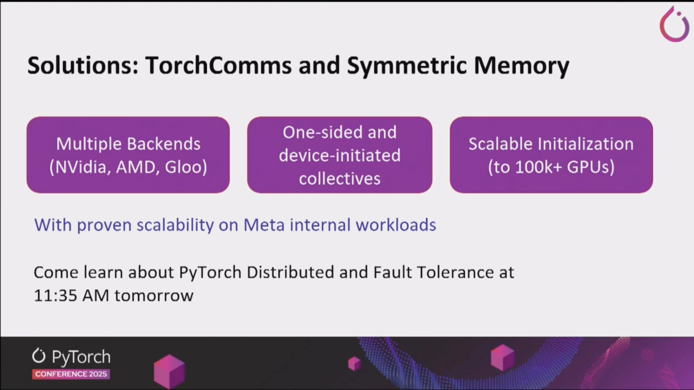

- PyTorch의 차세대 분산 통신을 지원하기 위한 새로운 API입니다.
- 기존 PyTorch Distributed의 `c10d::Backend`는 기술 부채가 많아 현대화 및 확장이 어려워 새로운 hardware 추가에 어려움이 있었습니다.
- 통신 계층을 PyTorch core와 분리하여, 새로운 collective communication이나 backend를 더 빠르고 독립적으로 구현할 수 있도록 하였습니다.
- 새로운 backend 구현이 용이하다는 점은 저희 HyperAccel에도 굉장히 중요한 일입니다. LLM Inference 시, Latency를 줄이기 위해서는 Tensor Parallelism을 구현하는 것이 필수적인데, 이 때 저희 Chip을 위한 통신 backend 구현이 필수적이고, 이를 TorchComms를 통해 독립적으로 구현할 수 있을 것으로 보입니다. 

#### **Ray**

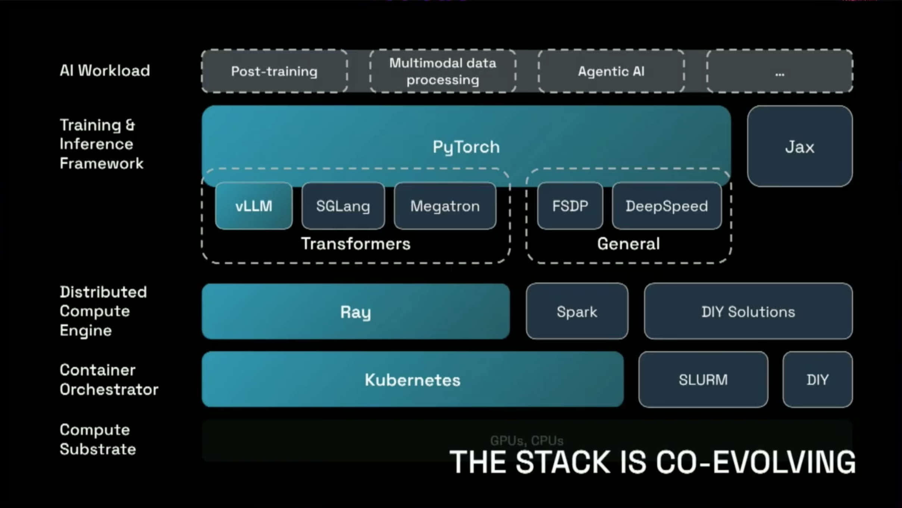

- Python 분산 처리를 위한 컴퓨팅 프레임워크로, PyTorch와의 통합을 통해 대규모 ML 워크로드를 쉽게 확장할 수 있게 해줍니다.
- Python의 function은 **Task**로, class는 **Actor**로 간주되어 Ray Cluster내의 어느 곳에서든 실행할 수 있게 변환됩니다.
- Ray는 Distributed Compute Engine으로써, Container Orchestrator인 Kubernetes 위에서 동작하고, PyTorch 기반의 vLLM, SGLang, Megatron과 같은 Training&Inference Framework에서 제공되는 Workload를 효율적으로 분산 처리할 수 있게 도와줍니다.

### Even faster for advanced users

고급 사용자들을 위한 성능 최적화 도구들이 소개되었습니다.

#### **Helion**

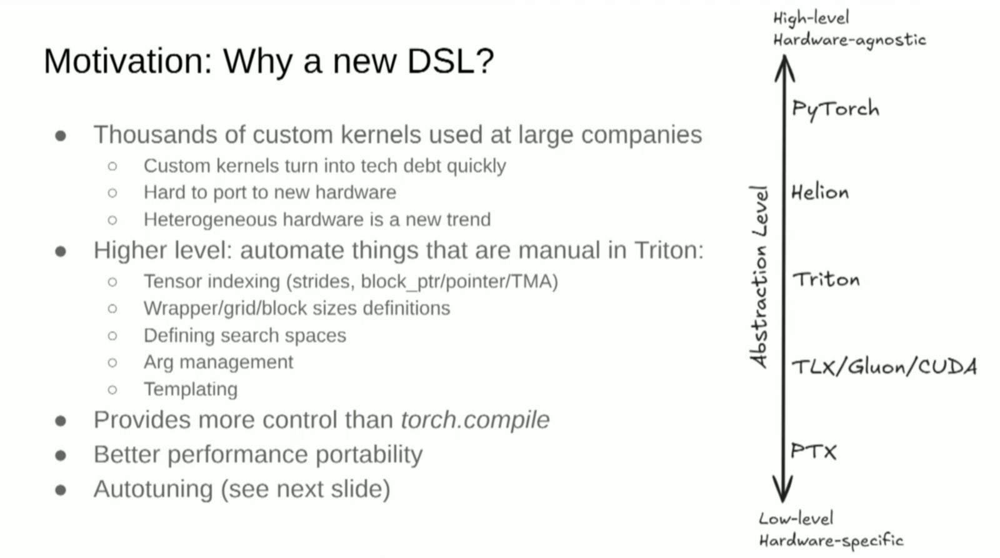

- PyTorch의 eDSL(Embedded Domain-Specific Language)로, 컴파일 타임 최적화를 통해 런타임 성능을 극대화합니다. 복잡한 연산 그래프를 더 효율적으로 실행할 수 있게 해줍니다.
- Transformer를 빠르게 실행하기 위해, 다양한 회사에서 엄청나게 많은 양의 **Custom Kernels**가 사용되고 있습니다. 하지만 새로운 하드웨어에서 Custom Kernel을 지원하기는 어려워, 이는 굉장히 빠르게 기술 부채가 될 수 있습니다.
- Triton 커널 작성 시 manual하게 해야 하는 작업을 자동화해주는 Higher Level DSL입니다.
- 실제 Helion DSL의 결과는 Triton Kernel이 되고, Triton Kernel의 Backend추가로 다양한 Hardware지원이 가능합니다.
- 다양한 Hardware를 agnostic하게 지원할 수 있는 필수적인 Abstraction Layer가 될 수 있을 것으로 보입니다.
- PyTorch User입장에서는 좀 더 효율성 높은 Kernel을 작성할 수 있는 수단이 될 수 있을 것 같습니다.

#### **CuTile**

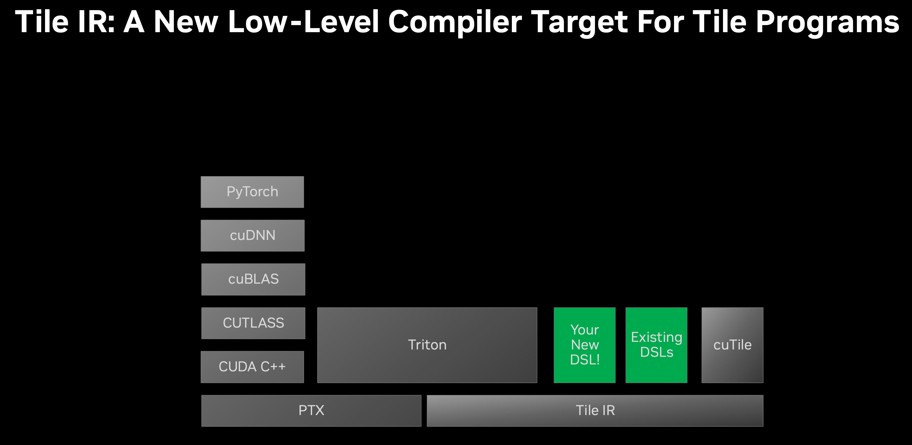

- GPU Architecture가 진화함에 따라, 다양한 기능들이 추가되기 시작했습니다. (Ex, TMA in Hopper, TensorCore from Turing Architecture)
- GPU Kernel PTX를 통해 구현을 하게되면, 하드웨어의 새로운 spec이 추가될 경우 기존 커널들은 그 기능을 지원하기 어려운 문제가 있습니다.
- 또한 PTX 레벨의 구현은 User가 직접 work를 block 단위로 나누고, 데이터를 tile로 나누어주어야 하고, 직접 thread에 매핑까지 해야 합니다. 이런 abstraction은 방대한 코드 작성을 불러일으킵니다.
- Tile IR의 경우, System이 work를 thread에 매핑하는 작성을 대신 수행해줍니다.
- 이런 Tile Level의 abstraction은 [Triton-lang](https://triton-lang.org/main/index.html)에서 소개되었으며, 위에서 소개드린 Helion에서도 Tile Level의 abstraction을 통해 DSL을 지원합니다.
- CUDA에서도 Tile Level의 DSL 및 IR을 지원하게 됨으로써, User와 System 사이의 적절한 abstraction layer를 설정하였습니다.

### Runs Everywhere

PyTorch가 다양한 플랫폼과 디바이스에서 실행될 수 있도록 하는 프로젝트들이 발표되었습니다.

#### **PrivateUse1** and **torch.accelerator**

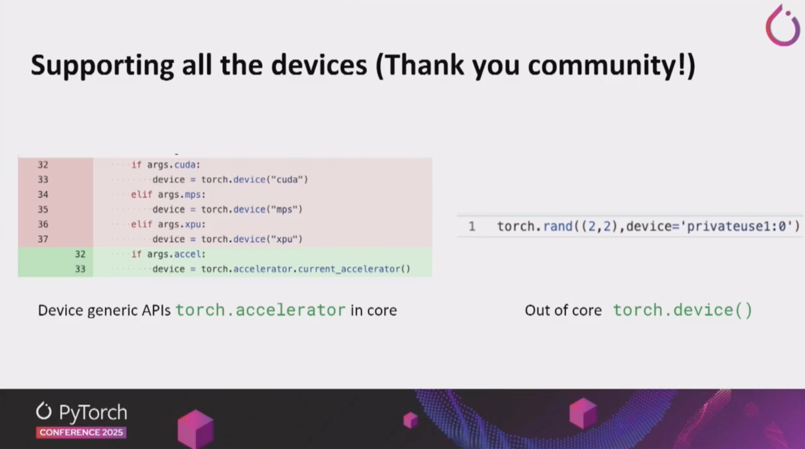

- **torch.accelerator** 
  - 통합된 accelerator 추상화 API로, 다양한 하드웨어 백엔드를 일관된 인터페이스로 사용할 수 있게 해줍니다.
  - 기존에는 NVIDIA GPU만을 사용할 것이라는 가정으로 인해, PyTorch code에 `torch.cuda.*` 가 많이 사용되었습니다. 하지만 이런 코드는 Hardware 이식성을 떨어뜨리는 코드입니다.
  - 이제 torch에서는 Device generic API인 `torch.accelerator`가 지원되어, hardware agnostic한 코드를 작성할 수 있도록 지원합니다.
- **PrivateUse1** 
  - 커스텀 하드웨어 백엔드를 위한 확장 가능한 인터페이스입니다. 우리와 같은 AI 칩 벤더들이 PyTorch를 자신의 하드웨어에 포팅할 수 있게 해주는 중요한 기능입니다.
  - PyTorch의 지원을 위해 PyTorch main branch로 우리 backend가 포함되어야 할 필요 없이, **Out-Of-Tree 방식인 plugin 형식으로 PyTorch 지원이 가능**합니다. (Rebellions, Huawei Ascend 의 PyTorch 지원 방식)

#### **Executorch**: 

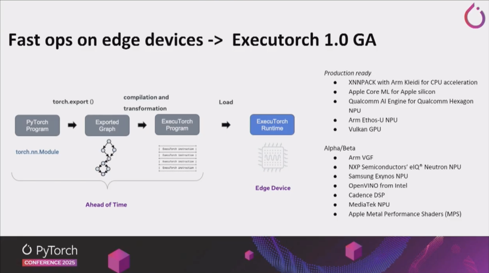

- 엣지 디바이스를 위한 경량화된 PyTorch 런타임으로, 모바일과 IoT 디바이스에서도 PyTorch 모델을 효율적으로 실행할 수 있게 해줍니다.

### LLM Inference Engine

LLM 추론 엔진에 대한 세션이 많았고, 실제 산업계 적용 사례들이 공유되었습니다.

#### **vLLM**: 

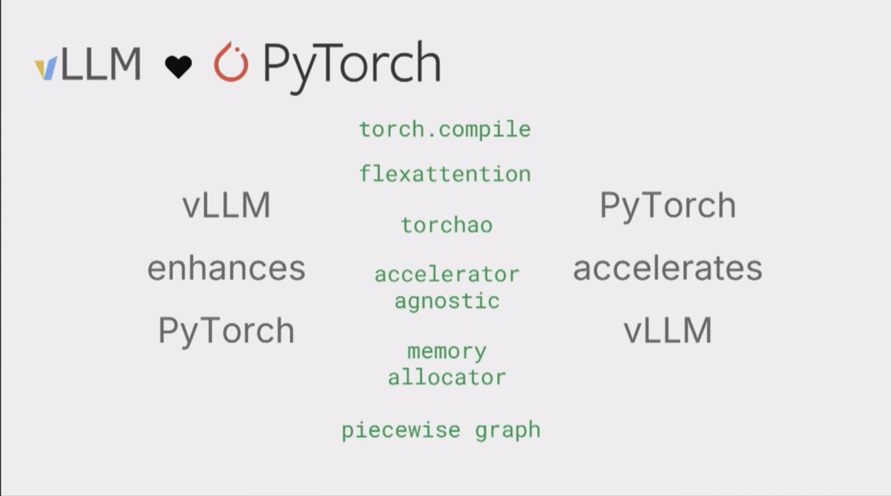

- vLLM은 더욱 더 PyTorch와 서로 관여되고 있으며, vLLM은 PyTorch의 기능들을 향상시키는 데 큰 역할을 하고 있고, PyTorch의 새로운 feature들로 vLLM은 더욱 더 가속화되고 있습니다.
- vLLM은 LLM Inference Framework로서 새로운 Model 지원 및 Hardware를 지원할 수 있는 Hub로서 역할을 하고 있습니다.
- PyTorch Conference 2025에서는 기조연설 및 단독 세션에서 7개의 관련 발표가 있을 정도로 가장 주요한 프로젝트 중 하나였습니다.
- HyperAccel에서도 vLLM의 feature를 최대한 지원하는 것을 Software Group의 가장 큰 목표로 삼고 있습니다.

#### **SGLang**

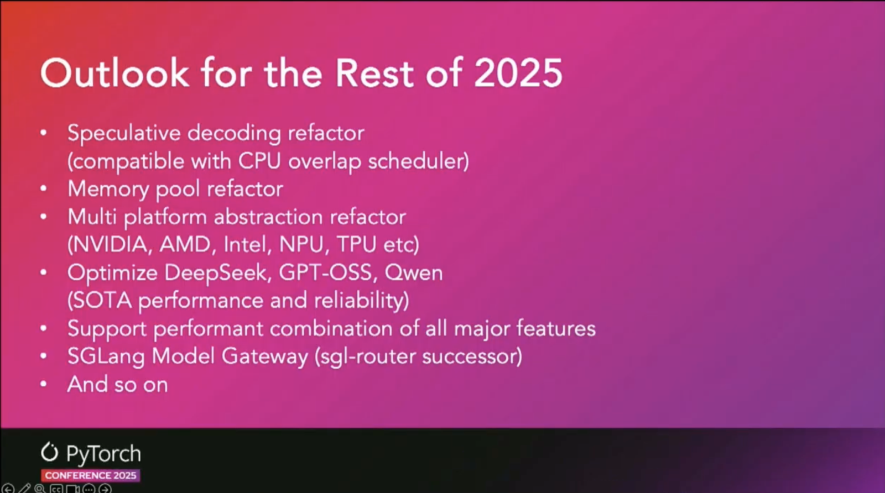

- **SGLang**도 vLLM과 같이 산업계에서 많이 사용되고 있는 LLM Inference Framework입니다.
- 특히 **xAI Grok**, **AMD**, **TogetherAI** 등에서 적극적으로 도입중인 프레임워크 입니다.
- 아직 GPU가 아닌 Hardware를 Backend로 붙일 수 있는 Plugin 기능이 지원되지 않았는데, 이번 Conference에서 Multi platform abstraction refactor를 통해 다양한 Hardware를 지원할 계획을 공유하였습니다.

#### **산업계 적용 사례**

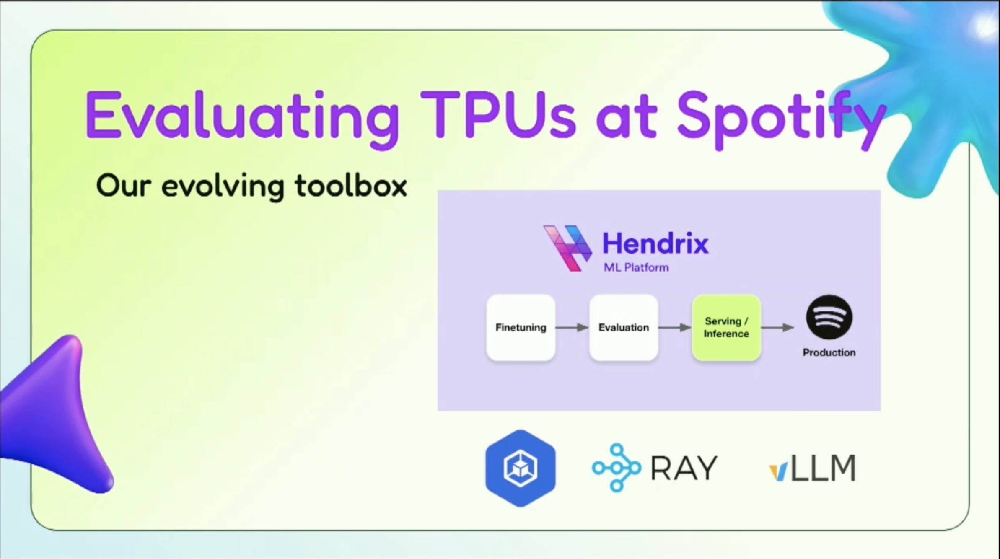

- **Spotify**가 vLLM과 **Google TPU**를 조합하여 대규모 음악 추천 시스템에 LLM을 적용한 사례가 발표되었습니다. 실제 프로덕션 환경에서의 성능 최적화와 운영 경험이 공유되어 매우 유용했습니다.
- 실제로 **Prefill Heavy**인 상황에서는 **L4, A100** 보다 TPU가 훨씬 **Performance, Cost Efficiency 측면에서 훌륭**했습니다.

### System Level LLM Inference

시스템 레벨에서의 LLM 추론 최적화에 대한 발표들이 있었습니다.

#### **llm-d**

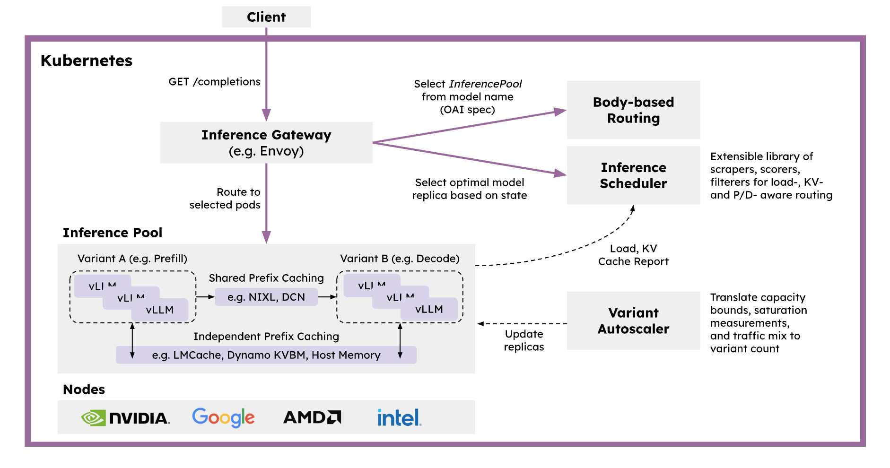

- llm-d는 **Kubernetes-native distributed inference serving stack**으로, 대규모 생성형 AI 모델을 효율적으로 서빙하기 위한 Production Ready 솔루션을 제공합니다.
- vLLM을 기본 모델 서버로, Inference Gateway를 요청 스케줄러 및 밸런서로, Kubernetes를 인프라 오케스트레이터로 통합하여 구성됩니다.
- 주요 기능:
  - **Intelligent Inference Scheduler**: Envoy proxy 기반의 스마트 로드 밸런싱으로 P/D 분리, KV 캐시, SLA, 부하 인식 기반 라우팅을 제공합니다.
  - **Disaggregated Serving**: Prefill과 Decode 단계를 독립적인 인스턴스로 분리하여 GPU 활용도를 최적화하고 TTFT(Time To First Token)와 TPOT(Time Per Output Token)를 개선합니다.
  - **Disaggregated Prefix Caching**: KV 캐시를 호스트 메모리, 원격 스토리지, LMCache 등으로 Off-loading하는 Pluggable KV Cache 계층을 제공합니다.
  - **Variant Autoscaling**: 트래픽과 하드웨어를 인식하는 오토스케일러로, Prefill, Decode, 지연 허용 요청을 위한 최적 인스턴스 조합을 계산합니다.
- 다양한 하드웨어 가속기(NVIDIA GPU, AMD GPU, Google TPU, Intel XPU)를 지원하며, 프로덕션 환경에서 검증된 Helm 차트와 가이드를 제공합니다.

#### **Dynamo**

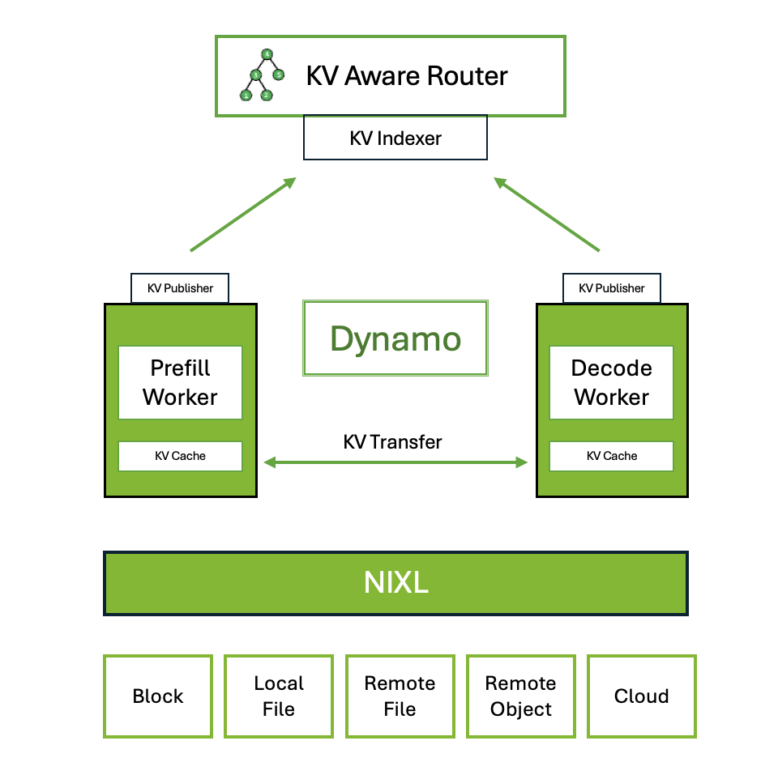

- Dynamo는 NVIDIA의 **high-throughput, low-latency inference framework**로, 멀티노드 분산 환경에서 생성형 AI 및 추론 모델을 서빙하기 위해 설계되었습니다.
- Inference engine agnostic으로 TRT-LLM, vLLM, SGLang 등을 지원하며, Rust와 Python으로 구현되어 성능과 확장성을 모두 고려했습니다.
- 주요 기능:
  - **Disaggregated Prefill & Decode Inference**: Prefill과 Decode를 분리하여 GPU 처리량을 최대화하고 처리량과 지연시간의 균형을 맞춥니다.
  - **Dynamic GPU Scheduling**: 실시간 수요에 기반한 성능 최적화를 제공합니다.
  - **LLM-aware Request Routing**: KV 캐시 히트율이 가장 높은 워커로 요청을 라우팅하여 불필요한 KV 캐시 재계산을 제거합니다.
  - **Accelerated Data Transfer**: NIXL(NVIDIA Inference Transfer Library)을 사용하여 추론 응답 시간을 단축합니다.
  - **KV Cache Offloading**: HBM, DDR, NVMe 또는 원격 스토리지 등 여러 메모리 계층을 활용하여 시스템 처리량을 높이고 지연시간을 낮춥니다.

## 참관 후기

### 기술적 인사이트

이번 컨퍼런스에서 가장 인상 깊었던 부분은 **PrivateUse1**과 **torch.accelerator** API였습니다. 우리가 개발 중인 AI 칩에 PyTorch를 포팅하기 위해서는 이러한 확장 가능한 인터페이스가 필수적입니다. 특히 PrivateUse1을 통해 커스텀 하드웨어 백엔드를 구현하는 방법에 대한 세부 사항을 파악할 수 있어 매우 유용했습니다.

**vLLM** 세션에서 특히 많은 영감을 얻었습니다. vLLM이 PyTorch 생태계와 어떻게 긴밀하게 통합되어 있는지, 그리고 새로운 하드웨어를 지원하기 위한 Hub로서의 역할을 어떻게 수행하고 있는지 확인할 수 있었습니다. 이를 통해 단순히 PyTorch 백엔드만 구현하는 것이 아니라 **전체 소프트웨어 스택을 체계적으로 구성**하는 것이 중요하다는 것을 깨달았습니다. 사용자들이 우리 칩을 쉽게 사용할 수 있도록 상위 레벨 추론 엔진(vLLM, SGLang 등)과의 통합뿐만 아니라, 시스템 레벨의 최적화까지 고려한 전체적인 SW 스택을 잘 구성하는 것이 핵심 과제입니다.

### 커뮤니티와의 교류

PyTorch Foundation 관계자들과의 미팅을 통해 멤버십 가입 절차와 기여 방안에 대해 논의할 수 있었습니다. PyTorch Foundation에 가입하여 Torch 생태계에 함께 참여하는 것에 대해 **긍정적으로 검토 중**입니다. 또한 AMD, Rebellions, Furiosa AI 등 다른 하드웨어 벤더들의 기술력을 확인할 수 있었고 많은 영감을 받았습니다.

### 향후 계획

컨퍼런스에서 얻은 인사이트를 바탕으로 다음과 같은 작업을 진행할 예정입니다:

1. **PrivateUse1 백엔드 구현**: 우리 칩에 대한 PyTorch 백엔드를 PrivateUse1 인터페이스를 통해 구현
2. **전체 SW 스택 구성**: vLLM/SGLang 통합을 포함한 체계적인 소프트웨어 스택 구성
3. **PyTorch Foundation 멤버십 검토**: Torch 생태계 참여를 위한 공식 멤버십 가입 검토
4. **오픈소스 기여**: 우리의 하드웨어 백엔드 구현 경험을 커뮤니티에 공유

## 추신

### HyperAccel 채용 안내

HyperAccel은 LLM 추론을 위한 차세대 AI 칩을 개발하고 있습니다. FPGA 검증을 완료했으며, 곧 ASIC 칩과 서버 솔루션을 출시할 예정입니다. PyTorch 생태계와의 통합을 통해 개발자들이 쉽게 사용할 수 있는 솔루션을 만들어가고 있습니다.

**채용 사이트** : https://hyperaccel.career.greetinghr.com/ko/guide

혹시 관심이 있으시다면 언제든지 연락 주세요!