# AITER Analysis: How AMD Doubled ROCm Inference Performance

Hello, I'm Minho Park from the HyperAccel ML team.

Semi Analysis is a well-known semiconductor research firm. They run the [InferenceX](https://inferencex.semianalysis.com) benchmark, which measures and compares inference performance of major GPUs.

According to the [InferenceX v2](https://newsletter.semianalysis.com/p/inferencex-v2-nvidia-blackwell-vs) report released in February 2026, AMD MI300X SGLang performance improved by **nearly 2×** between December 2025 and January 2026. At the center of this improvement was a kernel library called **AI Tensor Engine for ROCm (AITER)**.

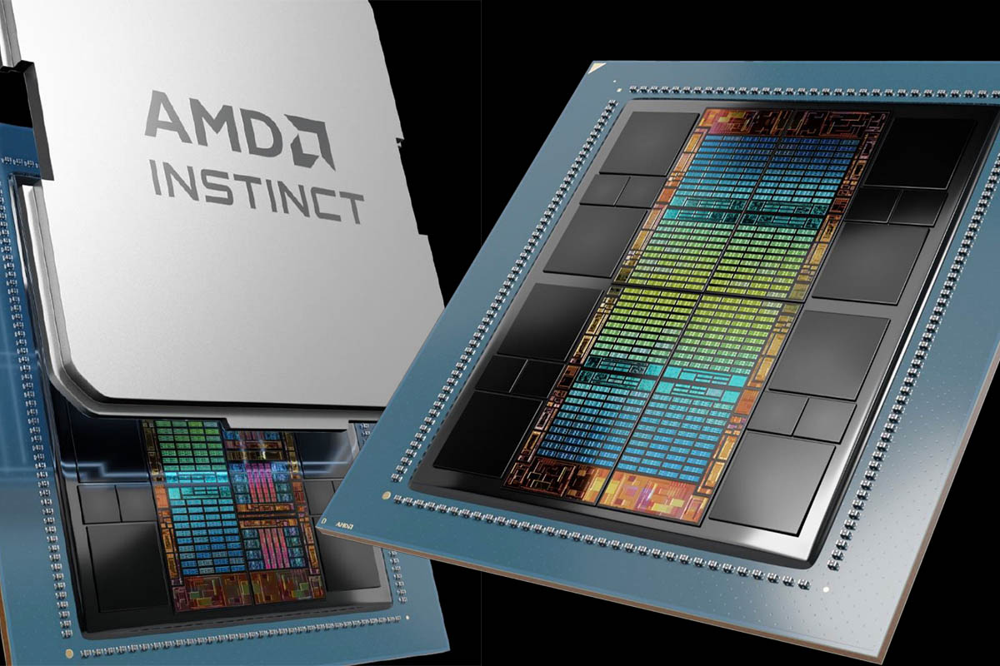

That news made me curious. What is AITER, and how could software optimization alone nearly double hardware performance? In this post I summarize AITER’s architecture, kernel backend strategy, and the principles behind the speedup. It may be useful if you:

1. Want to understand the current state of AMD GPU inference performance
2. Are interested in GPU kernel optimization techniques
3. Are curious about AI accelerator ecosystems beyond NVIDIA

---

## What is AITER?

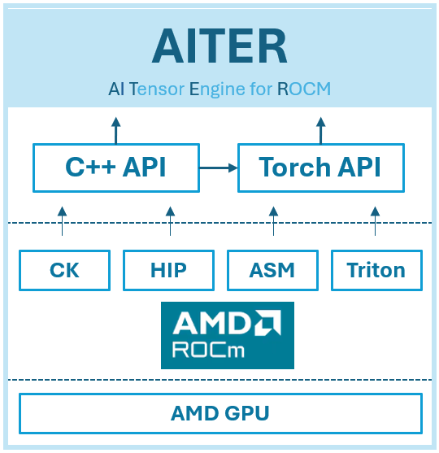

**AI Tensor Engine for ROCm (AITER)** is AMD’s open high-performance AI operator repository. In short, it is a **collection of kernels** for accelerating AI workloads on AMD GPUs. In the ROCm ecosystem, AITER plays a role analogous to cuDNN in the NVIDIA ecosystem.

| Item | Description |
| --- | --- |
| **Repository** | [ROCm/aiter](https://github.com/ROCm/aiter) |
| **License** | MIT |
| **Languages** | Python (63.6%), CUDA/HIP (25.8%), C++ (9.7%) |
| **Supported GPUs** | AMD Instinct MI300X, MI325X, MI350 |
| **Inference Frameworks** | vLLM, SGLang |

AITER’s main value is **drop-in replacement**. In inference frameworks such as vLLM or SGLang, turning on a single environment variable causes existing operators to be automatically replaced with AITER’s optimized kernels. You get better performance without changing application code.

---

## What Operations Does It Support?

AITER supports a wide range of **Large Language Model (LLM)** inference operations.

| Category | Operations | Backends |
| --- | --- | --- |
| **Attention** | Flash Attention, **Multi-head Latent Attention (MLA)**, Paged Attention | CK, ASM, Triton |
| **Fused MoE** | Top-K routing, MoE sorting, BlockScale FP8 FFN | HIP, CK, ASM |
| **GEMM** | FP8 per-token/channel, block-scale FP8, INT8, pre-shuffle | CK, ASM |
| **Normalization** | RMSNorm, LayerNorm (including fused quantization) | Triton, CK |
| **Embedding** | **Rotary Position Embedding (RoPE)** forward/backward | Triton |
| **Quantization** | BF16/FP16 → FP8/INT4 conversion | CK, Triton |
| **Communication** | AllReduce, reduce-scatter, all-gather | Triton, HIP |

Notable here is the backend column: a single operation can have multiple backends (CK, ASM, Triton, etc.). This reflects AITER’s core design philosophy—a **multi-backend strategy**—which we’ll cover in more detail later.

---

## Performance Benchmarks: AITER by the Numbers

Seeing is believing. Here are the performance gains AITER achieves on MI300X.

| Kernel/Workload | Improvement |
| --- | --- |
| Block-scale **General Matrix Multiplication (GEMM)** | **2×** |
| Block-scale Fused **Mixture of Experts (MoE)** | **3×** |
| MLA Decode | **17×** |
| **Multi-Head Attention (MHA)** Prefill | **14×** |
| DeepSeek V3/R1 throughput (SGLang) | **2×** (6,485 → 13,704 tok/s) |
| DeepSeek R1 prefill latency | **↓52%** (3.13s → 1.51s) |
| DeepSeek R1 decode latency | **↓47%** (0.053s → 0.028s) |
| vs. NVIDIA H200 (DeepSeek R1) | **2–5×** higher throughput at same latency |

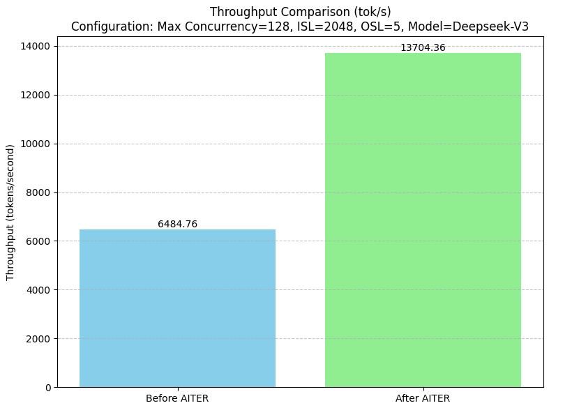

MLA Decode 17× and MHA Prefill 14× are not numbers you get from simple tuning. They are possible because AITER writes kernels at the assembly level.

---

## Architecture

### High-Level Architecture

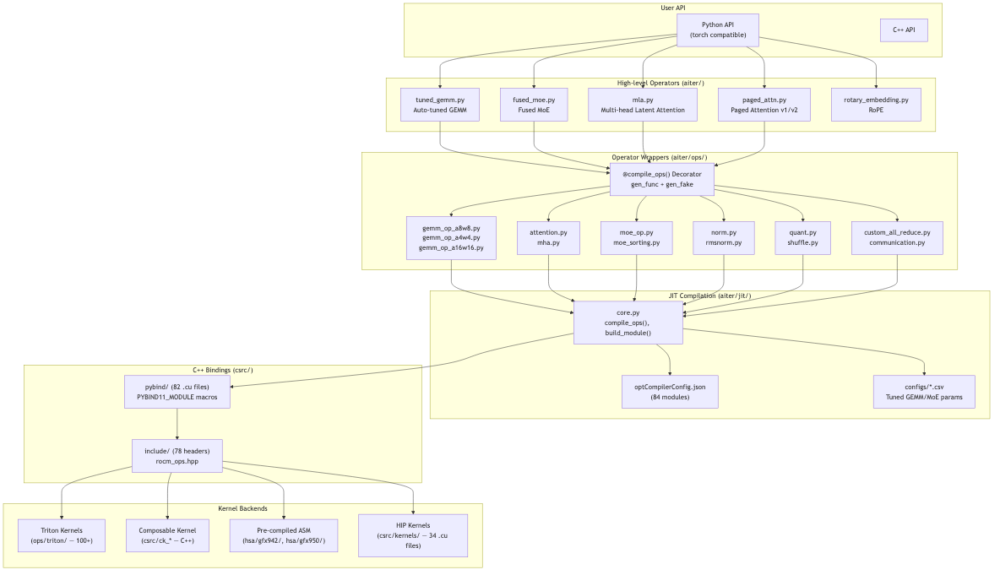

AITER’s architecture is organized into five main layers.

1. **User API**: Python (torch-compatible) and C++ APIs
2. **High-level operators**: Operator orchestrators such as `tuned_gemm.py`, `fused_moe.py`, `mla.py`
3. **Operator wrappers**: Wrapping layer based on the `@compile_ops` decorator
4. **JIT compilation**: Compiles kernels on first use and caches them as `.so` files
5. **Kernel backends**: Four backends—Triton, **Composable Kernel (CK)**, HIP, and ASM

From the user’s perspective, you call PyTorch-compatible functions via `import aiter`. AITER handles selecting, compiling, and caching the best kernel.

### JIT Compilation Pipeline

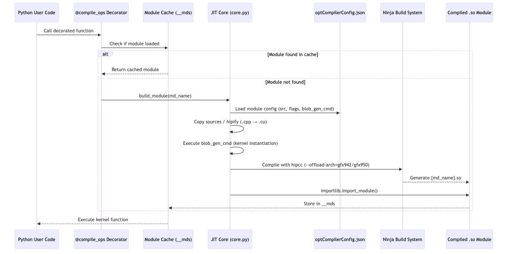

All AITER operators follow the `@compile_ops` decorator pattern.

```python
@compile_ops("module_gemm_a8w8", fc_name="gemm_a8w8",
             gen_func=cmdGenFunc, gen_fake=fake_shape_fn)
def gemm_a8w8(XQ, WQ, x_scale, w_scale, Out):
    ...  # Body is not executed — replaced by compiled C++ at runtime
```

The flow is:

1. The decorated function is called from Python.
2. The module cache is checked for an already-compiled `.so` file.
3. If missing, module configuration is loaded from `optCompilerConfig.json`.
4. The code is compiled with `hipcc` and Ninja to produce a `.so` file.
5. The module is loaded with `importlib.import_module()` and cached.
6. Subsequent calls use the cached kernel.

Compilation cost is paid only on first run; afterward you get native-level performance. Eighty-four compile modules are managed this way.

---

## Four Kernel Backends

AITER’s distinctive trait is that it **does not rely on a single kernel language**. It uses four backends, chosen per operator.

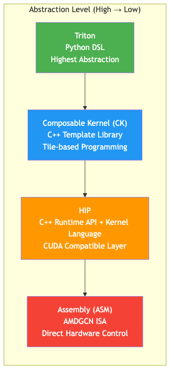

### Triton

Triton is a Python-based GPU programming **Domain-Specific Language (DSL)** developed by OpenAI and ported to ROCm by AMD. It uses a block-level programming model: you write the algorithm at the tile level and the compiler handles optimization.

In AITER, **the largest number of kernels (100+)** are written in Triton. They are used mainly for utility-style operations such as RMSNorm, RoPE, quantization, and MoE sorting.

```python
# Triton RMSNorm kernel example
@triton.jit
def _rms_norm_fwd_kernel(
    X_ptr, W_ptr, Out_ptr,
    stride_x_row, N, eps,
    BLOCK_N: tl.constexpr,
):
    row_idx = tl.program_id(0)          # Each program handles one row
    cols = tl.arange(0, BLOCK_N)
    mask = cols < N

    x = tl.load(X_ptr + row_idx * stride_x_row + cols, mask=mask, other=0.0)
    x_sq = x * x
    mean_sq = tl.sum(x_sq, axis=0) / N
    rrms = tl.rsqrt(mean_sq + eps)      # reciprocal square root

    w = tl.load(W_ptr + cols, mask=mask)
    out = x * rrms * w
    tl.store(Out_ptr + row_idx * stride_x_row + cols, out, mask=mask)
```

Triton’s strength is development speed: you write GPU kernels in Python, and the compiler handles memory coalescing and shared-memory management. On the other hand, compiler limitations make it hard to reach more than ~95% of theoretical bandwidth.

### Composable Kernel (CK)

CK is AMD’s C++ template-based high-performance kernel library, analogous to NVIDIA’s CUTLASS. As the name “composable kernels” suggests, you build complex operators by combining reusable tile-operation building blocks.

CK’s focus is **operation fusion**. For example, you can fuse scaling of GEMM results inline, without a separate kernel.

```cpp
// Fuse dequantization inline with GEMM result
template <typename AccDataType, typename DDataType, typename EDataType>
struct RowwiseScale {
    __host__ __device__ constexpr void operator()(
        EDataType &e, const AccDataType &c,
        const DDataType &d0,    // weight scale
        const DDataType &d1     // activation scale
    ) const {
        const F32 x = ck::type_convert<F32>(c)
                    * ck::type_convert<F32>(d0)
                    * ck::type_convert<F32>(d1);
        e = ck::type_convert<EDataType>(x);
    }
};
// → GEMM computation + dequantization run in a single kernel
```

In AITER, CK is used for matrix-centric kernels: GEMM (A8W8, A4W4, block-scale), MoE 2-stage, and some Attention. A heuristic dispatcher chooses among 100+ pre-tuned instances based on M, N, K shapes.

### HIP

**Heterogeneous-computing Interface for Portability (HIP)** is AMD’s C++ runtime API and kernel language. It is the AMD counterpart to CUDA; most CUDA kernel code runs on HIP with little more than name changes.

```text
CUDA concept            →  HIP equivalent
─────────────────────────────────────────
cudaMalloc()             →  hipMalloc()
cudaMemcpy()             →  hipMemcpy()
__global__ void kernel   →  __global__ void kernel  (same!)
__shared__               →  __shared__              (same!)
cudaStream_t             →  hipStream_t
nvcc                     →  hipcc
```

AITER uses HIP for general-purpose operations such as Paged Attention, KV cache, TopK, and AllReduce. Thirty-four `.cu` files under `csrc/kernels/` are written this way.

### Assembly (ASM)

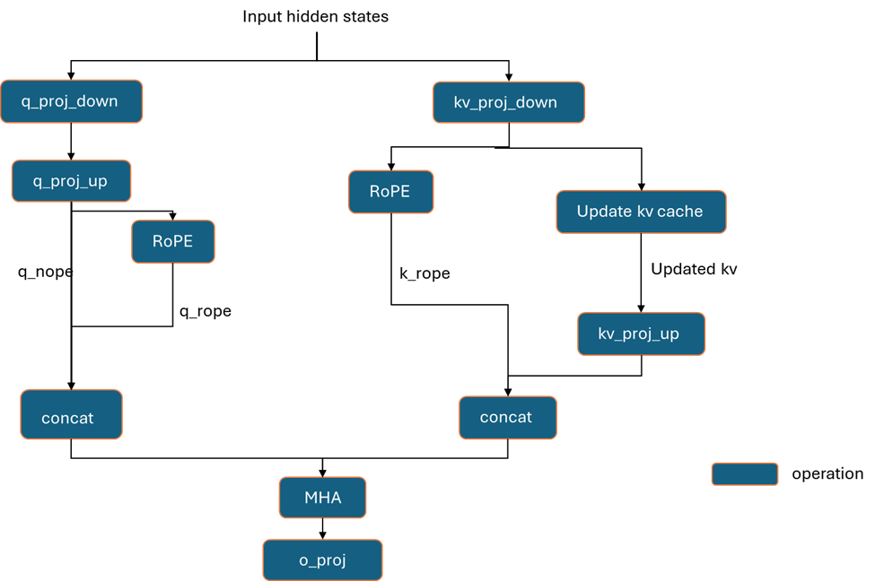

The ASM backend consists of kernels written directly in **AMDGCN Instruction Set Architecture (ISA)**, the machine code of AMD GPUs. All compiler abstraction is bypassed; the developer has full control over GPU registers, instruction scheduling, and memory access patterns.

Why go this low? High-level compilers generate safe code but miss optimization opportunities. ASM can fully exploit the GPU’s **Matrix Fused Multiply-Add (MFMA)** instructions, special registers, and instruction pipelining. The result is MLA Decode **17×** and MHA Prefill **14×** improvements.

```text
Register types:
  SGPR (Scalar GPR)  — control flow, constants (shared across threads)
  VGPR (Vector GPR)  — data operations (per-thread values)
  AccVGPR            — MFMA accumulator (stores matrix multiply result)

Key instructions:
  v_mfma_f32_32x32x8_f16  — 32×32 matrix multiplication (FP16→FP32)
  v_mfma_f32_16x16x32_fp8 — 16×16 matrix multiplication (FP8→FP32)
  buffer_load_dwordx4      — Load 128 bits from global memory
  ds_read_b128             — Load 128 bits from LDS
```

AITER’s `hsa/` directory contains **354+ precompiled ASM kernels (.co files)**. So many instances are needed because ASM kernels fix all parameters at compile time. Every viable combination is precompiled with no runtime branching.

```text
head_dim:  {64, 128, 256}      → 3 options
dtype:     {fp16, bf16, fp8}   → 3 options
causal:    {true, false}       → 2 options
→ Combinatorial explosion → 162+ FMHA instances
```

### Backend Selection Criteria

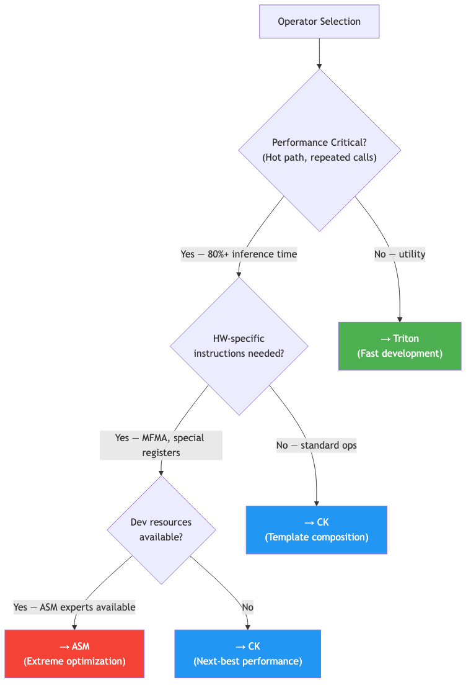

AITER’s criteria for choosing a backend per operation can be summarized as follows.

| Criterion | Triton | CK | HIP | ASM |
| --- | --- | --- | --- | --- |
| **Development speed** | ★★★★★ | ★★☆☆☆ | ★★★☆☆ | ★☆☆☆☆ |
| **Peak performance** | ★★★☆☆ | ★★★★☆ | ★★★☆☆ | ★★★★★ |
| **Portability** | ★★★★★ | ★★★☆☆ | ★★★★☆ | ★☆☆☆☆ |
| **Maintainability** | ★★★★★ | ★★★☆☆ | ★★★★☆ | ★☆☆☆☆ |
| **Kernel count** | 100+ | ~20 | 34 | 354+ (.co) |

You might ask: “Why not write everything in ASM?” ASM is very hard to develop and maintain, and when the GPU architecture changes, you have to rewrite from scratch. AITER uses ASM only on the hottest paths where performance matters most, and keeps development efficiency with Triton and CK elsewhere.

---

## Framework Integration: Enable with One Environment Variable

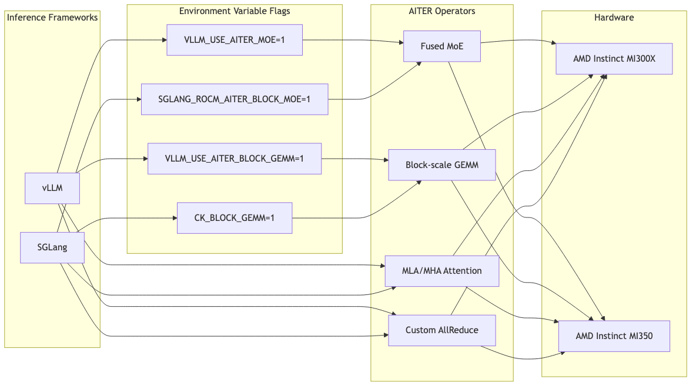

AITER integrates without touching existing code. You only need to set environment variables.

```bash
# Enable AITER in vLLM
VLLM_USE_AITER_MOE=1 VLLM_USE_AITER_BLOCK_GEMM=1 \
  vllm serve deepseek-ai/DeepSeek-V3 --tensor-parallel-size 8

# Enable AITER in SGLang
CK_BLOCK_GEMM=1 SGLANG_ROCM_AITER_BLOCK_MOE=1 \
  python3 -m sglang.launch_server --model deepseek-ai/DeepSeek-V3 --tp 8
```

Frameworks read these variables and conditionally dispatch to AITER operators. That makes A/B testing straightforward: turn the variables on or off to compare performance with and without AITER.

On first run, JIT compilation is triggered and `.so` files are created under `~/.cache/aiter/`. Later runs reuse the cached kernels, so there is no extra cost.

---

## Summary of Key Design Patterns

Here are the design patterns that stood out while reviewing AITER.

### Multi-Backend Kernel Dispatch

AITER does not commit to a single kernel language. It uses ASM for decode attention, CK for GEMM, and Triton for MoE sorting—a different approach from a unified-compiler strategy.

### FP8 Block-Scale Quantization

Per-token (1×128) activation scale plus per-weight (128×128) scale enables efficient mixed-precision operations. This is especially effective for MoE architectures like DeepSeek.

### CSV-Based Auto-Tuning

Kernel parameters are stored in CSV files per (M, N, K, cu_num) shape. Tuning per model is possible without recompilation. Pre-tuned settings exist for 21 models including DeepSeek V3, Qwen3, and LLaMA 405B.

### Hardware-Specific Optimizations

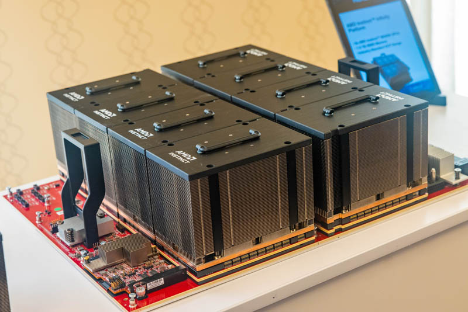

AITER includes hardware-level optimizations such as custom AllReduce tailored to MI300X inter-GPU topology and weight pre-shuffling (16×16 layout) for better memory access patterns.

---

## Conclusion

AITER is AMD’s kernel library to narrow the AI inference performance gap with NVIDIA. Instead of depending on one kernel language, it uses four backends—Triton, CK, HIP, and ASM—and selects the right one per operator.

As noted in Semi Analysis’s InferenceX v2 report, AITER’s optimizations nearly doubled MI300X SGLang performance. At the same time, as Semi Analysis pointed out, individual kernel performance is strong, but when many optimizations—FP4, disaggregated serving, expert parallelism, etc.—are **combined**, composability still lags behind NVIDIA.

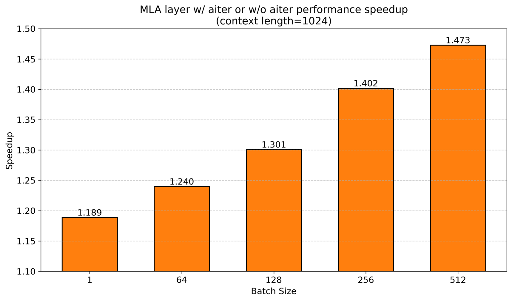

What AITER demonstrates is clear: software optimization alone can double performance on the same hardware. For us, working on NPU development, it’s a reminder of how important it is to turn theoretical hardware performance into real-world performance.

---

## References

- [GitHub: ROCm/aiter](https://github.com/ROCm/aiter)
- [Semi Analysis: InferenceX v2 — NVIDIA Blackwell Vs AMD vs Hopper](https://newsletter.semianalysis.com/p/inferencex-v2-nvidia-blackwell-vs)
- [Semi Analysis: AMD 2.0 — New Sense of Urgency](https://newsletter.semianalysis.com/p/amd-2-0-new-sense-of-urgency-mi450x-chance-to-beat-nvidia-nvidias-new-moat)
- [AMD Blog: AITER — AI Tensor Engine For ROCm](https://rocm.blogs.amd.com/software-tools-optimization/aiter-ai-tensor-engine/README.html)
- [AMD Blog: Accelerate DeepSeek-R1 with AITER + SGLang](https://rocm.blogs.amd.com/artificial-intelligence/aiter-intergration-s/README.html)

---

## P.S.

### HyperAccel Careers

Analyzing AITER drove home how much difference kernel-level optimization can make. At our NPU company we are also building a software stack that can fully utilize hardware performance. With our LPU ASIC launch ahead, we are looking for teammates to work on everything from kernel optimization to inference framework integration.

**Careers**: https://hyperaccel.career.greetinghr.com/ko/guide

If you’re interested, we’d love to hear from you!
