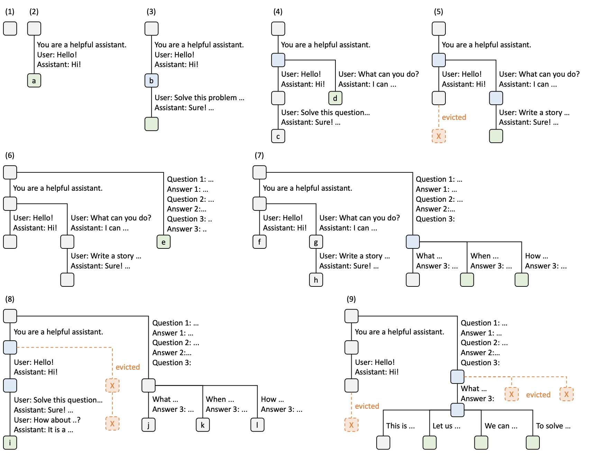
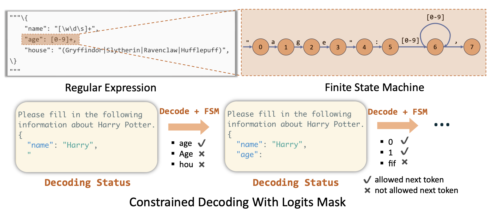
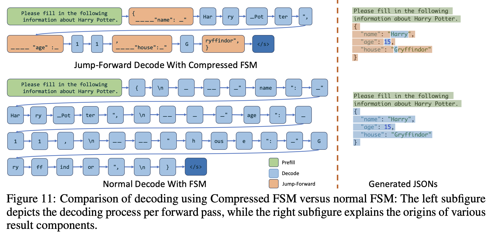

### Philosophy of SGLang

Since the introduction of LLMs, they have been used to solve complex tasks in various fields—including problem-solving, code writing, and answering questions. Today, they are expanding their ability to be agentic, completing tasks users request without human interference.

This requires a wide range of prompting techniques, such as skeleton of thought or tree of thought. In other words, we structure LLMs to follow certain patterns to fit our needs, and we require programmability to control and guide them to meet our requirements.

The authors argue this process has been inefficient in current solutions for the following reasons:

1. Programming LM(Language Model) programs is difficult since LLMs are non-deterministic.
    1. We cannot predict what LLMs will emit before running a command.
    2. This reduces readability of LLM outputs.
2. Executing LM programs is inefficient due to redundant computation and memory usage.
    1. Current solution (Solutions like vLLM or TGI at the time when this paper was written) lack effective mechanisms to reuse KV-cache.
    2. When output format is fixed or follows certain grammar rules, current solutions cannot effectively leverage this, since they always emit tokens one at a time.

The core idea of the SGLang is to simplify LM programs into structure using new programming language (in Python-embedded DSL) which can be compiled.

### SGLang DSL

Here's a DSL example from the paper.

Let's say we're building an AI application that evaluates essays about images.

We want our system to:

1. Read the essay and image, then judge whether the essay is about the image. If not, terminate.
2. If the essay matches the image, evaluate it across multiple dimensions (such as clarity, grammar, readability, and structure).
3. Based on these evaluations, assign a grade from A+ to D-.
4. Output the grade and summary in JSON format.

This process can be described in SGLang DSL as follows.

```python
@function
def multi_dimensional_judge(s, path, essay):
	s += system("Evaluate an essay about an image.")
	s += user(image(path) + "Essay:" + essay)
	s += assistant("Sure!")
	
	# Return directly if it is not related
	s += user("Is the essay related to the image?")
	s += assistant(select("related", choices=["yes", "no"]))
	if s["related"] == "no": return
	
	# Judge multiple dimensions in parallel
	forks = s.fork(len(dimensions))
	for f, dim in zip(forks, dimensions):
	f += user("Evaluate based on the following dimension:" +
	dim + ". End your judgment with the word 'END'")
	f += assistant("Judgment:" + gen("judgment", stop="END"))
	
	# Fetch the judgements results & merge the judgments
	judgment = "\n".join(f["judgment"] for f in forks)
	
	# Generate a summary and a grade. Return in the JSON format.
	s += user("Provide the judgment, summary, and a letter grade")
	s += assistant(judgment + "In summary," + gen("summary", stop=".")
	+ "The grade of it is" + gen("grade"))
	schema = r'\{"summary": "[\w\d\s]+\.", "grade": "[ABCD][+-]?"\}'
	s += user("Return in the JSON format.")
	
	# Runtime optimize for fast constrained decoding with regex
	s += assistant(gen("output", regex=schema))
	
state = multi_dimensional_judge.run(...)
print(state["output"]) # Runs an SGLang program
```

With SGLang, this can be written with simple expressions, which is much shorter than previous solutions.

In the program, we can observe SGLang language primitives such as `fork`, `join`, `regex` ,etc.

`fork` will generate multiple requests to judge the essay in multiple dimensions, (it is going to judge the essay in different fields) while `join` will merge all judgements. `regex` accepts regular expressions, and it can constrain output of the LLM to be in specific format.  `+=` operator is used to append the string.

Some primitives will instruct SGLang execute in __asynchronous stream__, such as `select`, `gen` or `extend`. Authors say we can view this as launching CUDA kernels with CUDA streams asynchronously.

## RadixAttention

SGLang introduces a technique for managing KV cache called RadixAttention. This algorithm uses a radix tree to efficiently manage KV caches in the context of SGLang DSL.

(Note: A radix tree is a tree where a node that is an only child is merged with its parent node, saving space.)

The algorithm is simple. It maintains prompts as a tree that branches when a different prompt or answer is given. It evicts leaf nodes using an LRU (Least Recently Used) policy when no running requests are using them.



Here is an example of a radix tree, which can express multiple possible contexts. It naturally represents multiple states of the prompts and reuses all previous KV caches when a new request matches stored nodes in the tree.

**Decision Process**

1. Tree is empty
2. Request "Hello" is accepted, and LLM answers "Hi". This sequence is stored as new node `a`.
3. New request arrives ("Solve this problem"), and the conversation matches. We can safely reuse the KV cache.
4. Another request arrives. The request matches up to "You are a helpful assistant" (the system prompt), but we must branch out the tree since the user did not say "hello".
5. Due to memory limits, we evict one least-recently-used node.
6. New request arrives, but it did not use the previous system prompt. Therefore, we branch out from the root.
7. We have more queries coming in, but they share the same prompts as the previous request without a system prompt, so we branch out from the last node.
8. We receive a new message after "Hello" and "Hi!", so we append a new node. However, due to lack of KV cache space, we evict other least-recently-used nodes.
9. Now, we have more requests sharing the same prompts up to "Answer 3", but we must evict other nodes until we have enough space for them. We evict them using LRU policy.

If you've read this far, you might wonder: what if cache performance goes down due to suboptimal request ordering? You're very sharp—the authors thought of this too. They designed a __cache-aware scheduling__ algorithm to maximize performance. It sorts requests by the prefix length that best matches the radix-tree KV cache (essentially pre-evaluating cache hit rate before processing incoming requests).

## Constrained decoding with compressed FSM (Finite state machine)


Some LM programs require output in a specific format (such as JSON in our example). If we're building an AI program for generating presentation slides, we want the LLM output to follow a specific format. SGLang supports this efficiently using FSMs.

During decoding, the correct LLM output is sometimes always fixed. For example, if an LLM is prompted to output JSON, we always know when to output colons, commas, or braces—which can be expressed as regex in SGLang DSL.

Example: In the figure above, we always know we must emit `{\n "name": }` before we emit "Harry".

The problem with regex is that it's defined at the character and string level, which doesn't align with LLM tokens. Therefore, we must make the LLM emit small tokens one at a time.

Example: The LLM decodes `{`, `\n`, `"` one-by-one, which is very inefficient.



However, SGLang can re-tokenize these sequences so that fixed consecutive expressions are "compressed" into a single expression. The FSM tracks which compressed token to output, allowing SGLang to "jump forward" over multiple expressions and prevent the LLM from inferencing them one by one—accelerating the decoding process.

In the example above, `{ \n ____ "name"` is merged into a single compressed expression. We can skip decoding that part entirely and simply paste it in, allowing the LLM to proceed directly to the next output.

## Evaluations

SGLang is very effective in agent-based AI workloads due to inference context-aware KV-cache mechanisms, which will be most of the inference workloads in the future.



Performance speedup comes from Radix attention, FSM based decoding. Authors say cache hit rate was between 50-90% in DsPy RAG pipeline that showed best performance.

## My personal thoughts

We are living in a world of agentic AI, and agentic AI workloads are expanding. AI workloads are integrated into various services, including coding, creating slides, creating music, and work tools. These workloads require many system prompts and output constraints to control the model. I personally think SGLang will be very efficient in these cases since they fit really well with radix attention. Also, I liked the idea of saving time and energy using FSMs with regex when tokens don't need to be generated. While SGLang won't always be better than vLLM, it would be much more suitable for agentic AI workloads.

### Reference
[SGLang: Efficient Execution of Structured Language Model Programs](https://arxiv.org/abs/2312.07104)
