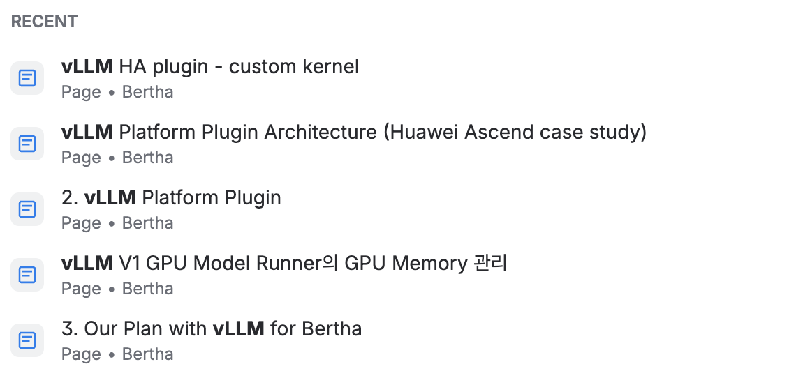
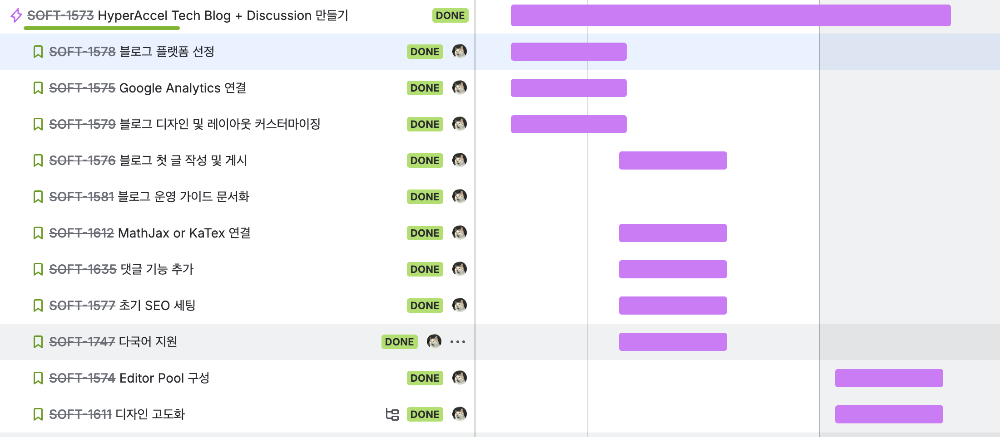
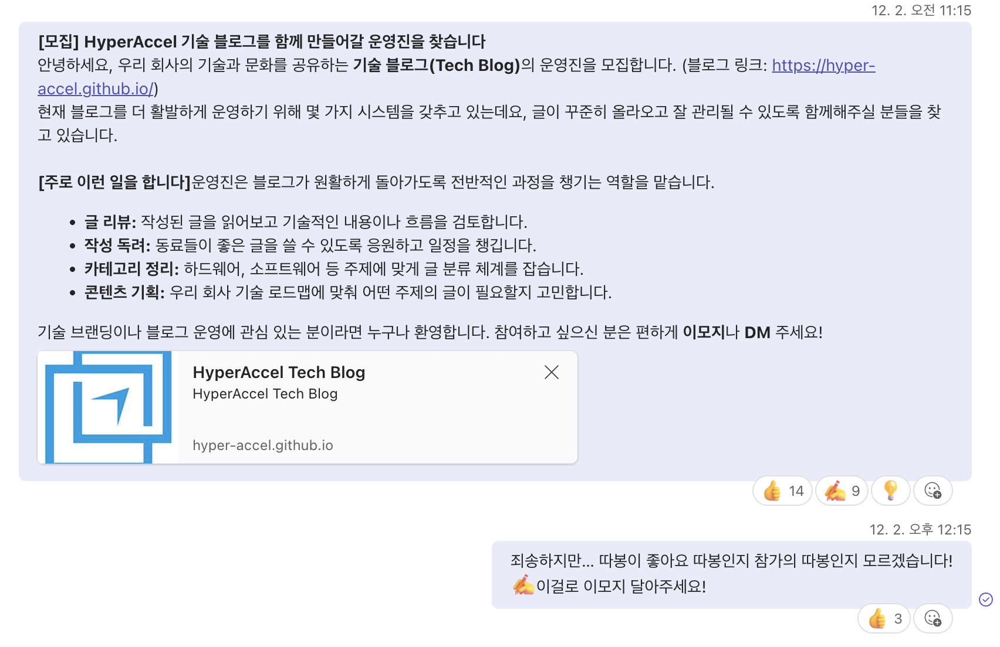
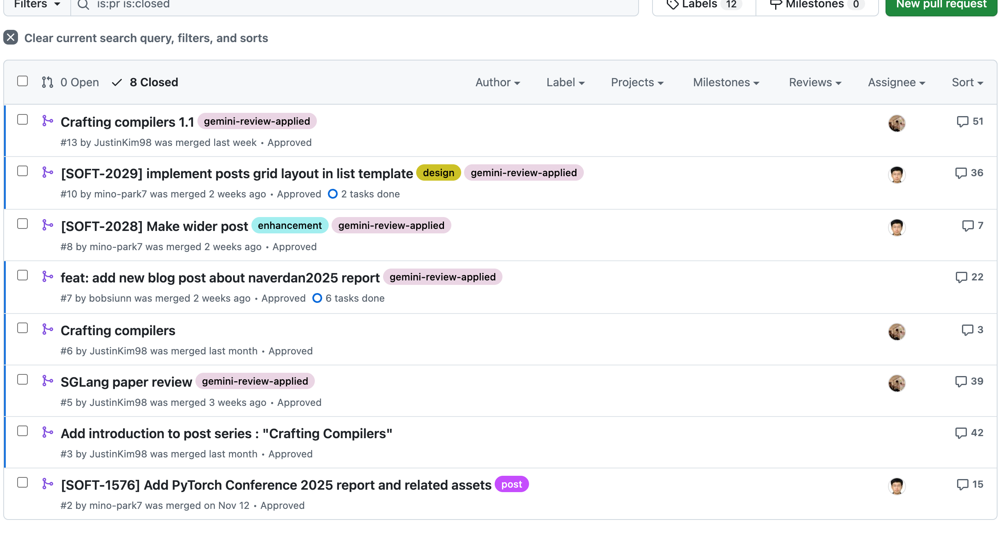
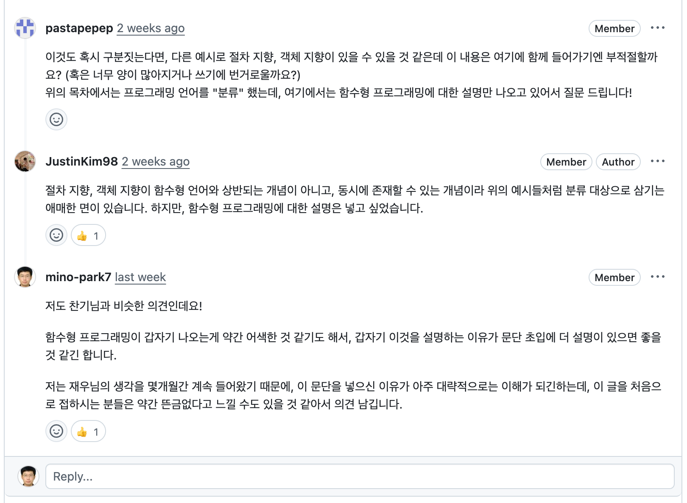

## Tech Blog를 시작하게 된 계기

저희 회사 SW group에는 김재우([Author](https://hyper-accel.github.io/authors/jaewoo-kim/), [LinkedIn](https://www.linkedin.com/in/jaewoo-kim-b38325237/))님이라는 개발자가 계십니다. 재우님께서는 저희 HW kernel 개발을 위한 언어인 `legato`를 개발해주고 계신데요. 재우님께서 몇 달 전부터 꾸준히 요청해주신 것이 있습니다.

> **저희 회사 기술 블로그 하면 안되나요?**                   (from 재우)

재우님께서는 이전 직장에서 진행하셨던 프로젝트를 기술 블로그에 올렸던 경험이 있으셨고, 그 포스트 덕분에 여러 실력 있는 개발자분들께서 회사에 관심을 가지게 되어 입사까지 하셨던 경험이 있다고 하셨습니다.

그리고 저도 저희 회사가 **고성능의 LLM Inference Chip을 만들기 위해 고민**하는 내용, 그 **Chip을 잘 지원하기 위한 Software Stack을 만들기 위해 고민**하는 바가 엄청나게 많은데, 그것을 외부 개발자분들께 전달드리고 싶다는 생각을 많이 하였습니다.

> **그런데.... 누가 만들고 운영하지?**

블로그에 올릴 글들은 저희 회사의 Wiki (confluence로 운영 중)에 아주 풍부하게 있다는 것은 알고 있었습니다.
하지만 올릴 글이 많다는 것과, 블로그를 만들어서 운영한다는 것은 또 다른 차원의 문제였죠.

> HyperAccel의 LLM Inference Engine 지원을 위한 오픈소스 분석 (**Coming Soon...**)

재우님께서 기술 블로그를 운영하면 좋겠다는 말씀을 하신지도 몇 개월이 지났지만, 아직 아무도 엄두를 내지 못하였습니다. 왜냐하면 아무도 운영을 해본 적이 없으니까요!

그런데 저는 **사실 저는 해본 적이 있었습니다**... 저의 [개인 블로그](https://mino-park7.github.io/blog/categories/)에 몇 년간 글을 올린 적이 있었기 때문이죠.

하지만 **누군가는 나서서 하지 않을까?** 라는 막연한 기대감과, "난 지금도 너무 바쁜데..." 라는 생각으로 인해 애써 모른 척을 하고 있었습니다.

그런데 올해 10월에 재우님과 PyTorch Conference를 같이 다녀올 일이 생겼습니다([이전 포스트](https://hyper-accel.github.io/posts/pytorchcon2025-report/) 참고).

그때 재우님께서 미국 출장 중에도 한국 시간에 계속 팀원들과 논의하면서 컴파일러를 개발하는 것을 보고, **내가 바빠서 못하는 것은 핑계가 아닐까?** 라는 생각을 하게 됐습니다.

그리고 제가 팀장으로서 팀원들에게 언제나 하는 이야기가 있었어요. 
> **"나다 싶으면 해라"** 라는 마인드 셋입니다.

그래서 결정했습니다. **내가 하기로**

## 기술 블로그 플랫폼 선정

기술 블로그를 만들 때는 여러 가지 선택지가 있습니다.

- 블로그 플랫폼 이용
  - Velog
  - Medium
  - Tistory
  - ...
- 자체 구축 (Static Site Generator + github pages 이용)
  - Jekyll
  - Hugo
  - ...

물론 제일 간편한 것은 블로그 플랫폼을 이용하는 것이겠지요. 간단하게 회원가입 후 블로그를 만들면 되니까요.

하지만 제가 생각했던 기술 블로그 **운영 시에 중요한 요소**들이 몇 가지 있었습니다.

- 댓글 기능이 있어야 함
- Google Analytics를 붙일 수 있어야 함
- SEO가 잘 되어야 함
- 유지 보수가 편리해야 함
- 여러 사용자가 쉽게 본인 글을 투고할 수 있어야 함

다른 요소들은 블로그 플랫폼을 이용하여도 충분히 지원이 가능했지만, **유지 보수가 편리해야 함**과 **여러 사용자가 쉽게 본인 글을 투고할 수 있어야 함**은 블로그 플랫폼을 활용해서는 달성하기가 어려워보였습니다.

> 어 그런데 블로그 플랫폼을 사용해야 유지 보수가 편리하지 않나요?

그렇습니다. 개인 블로그를 운영할때는 아마 블로그 플랫폼을 사용하는 것이 훨씬 편할 겁니다. 하지만 저희가 반드시 고려해야하는 점이 있었습니다.

"저희 기술블로그는 직원 한명이 운영하는 것이 아닌 **Editor Group**이 운영해야 한다" 입니다.

저는 [Software Engineering at Google](https://abseil.io/resources/swe-book)이라는 책을 굉장히 좋아하고, 이 책에서 배운 것들을 팀 운영시에 많이 적용을 하고 있는데요. 이 책에 [Bus Factor](https://en.wikipedia.org/wiki/Bus_factor)라는 용어가 나옵니다.

> Bus Factor : 프로젝트를 진행하는 팀원 중 몇 명이 제대로 된 인수인계 등의 절차 없이 갑작스럽게 빠지게 되었을 때 프로젝트가 중단 내지는 그에 준하는 심각한 상황에 놓이는지를 나타내는 지수

**Bus Factor가 높을수록 프로젝트의 안정성이 높아지는데요**, 만약 블로그 플랫폼을 이용하여 블로그 운영을 한다면 블로그 운영자(아마도 저겠죠?)가 **블로그 운영을 할 수 없는 상황에 빠진다면, 저희 기술블로그는 유령블로그가 될 것입니다.**

하지만 자체 구축을 Github을 이용해서 한다면, 블로그 구축 자체는 제가 대부분 해야하지만 운영은 Editor Group에서 할 수 있습니다.

그래서 시작되었습니다. **Hugo를 이용한 기술 블로그 구축**

## 기술 블로그 구축!

기존에 제가 운영하던 블로그는 **Jekyll**로 만들었습니다. 하지만 Jekyll은 테마 수정이 어렵고, Ruby 기반이기 때문에 가끔 dependency 문제를 일으키는 경우가 있었습니다. 저는 Ruby를 사용해 본적이 없어서, dependency 문제가 발생해도 흐린눈 뜨고 그냥 무시를 했었죠

그런데, 최신 SSG (Static Site Generator)를 찾아보니 Go 언어로 된 [Hugo](https://gohugo.io/)라는 녀석이 보였고, 테마도 다양하고, 커뮤니티도 많이 활성화 되어있어, 이를 기반으로 블로그 구축을 시작했습니다.

그리고 Editor Group으로 참여하고 싶은 사람도 모집을 하였지요.

> 무려 9명이나 지원자가!

그리고 **댓글 기능, 다국어 지원 (한국어, 영어), 검색 기능, Google Search 등록, Google Analytics 등록, Author 기능...** 도 모두 구현을 완료하였습니다!

## 기술 블로그 운영

저희 기술 블로그에 글을 작성하고 싶으면 Github Pull Request를 통해서 진행이 가능합니다. Github PR로 진행되기 때문에, 특정 관리자가 아닌, 글을 작성하고 싶은 사람이 자유롭게 투고를 할 수 있는 시스템으로 운영이 됩니다.

그리고, **Editor Group은 PR에서 자유롭게 글에 대한 의견을 댓글로 남길 수 있습니다.**

Editor Group의 아주 중요한 역할이 하나 있습니다. 바로 개발자 분들께 **기술 블로그 포스트 작성을 독려** 하는 것이죠.

저는 2018년경에 BERT라는 논문을 읽고 [BERT 논문정리](https://mino-park7.github.io/nlp/2018/12/12/bert-%EB%85%BC%EB%AC%B8%EC%A0%95%EB%A6%AC/)라는 블로그 글을 포스팅한 적이 있었는데요. 감사하게도 이 글을 굉장히 많은 분들이 읽어주셔서 한동안 Google 검색 결과 최상단에 노출이 되었습니다.

자신이 공부하고 조사한 내용을 외부에 알리는 것은 회사의 기술력을 홍보하기에도 좋지만, 개인에 대한 홍보도 되고 또 되어야 한다고 믿기 때문에, 개발자 분들께 사내 wiki에 정리한 내용 중 외부에 공개해도 좋은 글들이 있다면 적극적으로 블로그 포스팅해주시는 것을 독려하고 있습니다.

## 추후 올라갈 글들...

저희 HyperAccel에서는 LLM Inference를 위한 HW 설계와 그것을 위한 Software Stack 전체를 다 개발하는 회사입니다.

그렇기 때문에 정말 넓은 범위의 기술을 한 회사 내에서 다루고 있는데요. 그래서 기술 블로그에 올리게 될 글들도 정말 다양한 topic을 다룰 것입니다.

- Compiler는 어떻게 만드는 것인지?
- GPU의 특성 (지피지기면 백전백승)
- LLM Inference Framework (vLLM, SGLang, ...) 오픈소스 분석
- Cluster 환경에서 Hardware 지원을 위한 Kubernetes Components 개발기
- Kubernetes 기반 사내 개발 환경 구축기
- ...

정말 다양하고 퀄리티 높은 글들을 공유할 예정이니, 많이 관심 가져 주세요!

## HyperAccel은 채용 중 입니다!

저희가 이 기술 블로그를 운영하는 목적 중 가장 큰 것은, **인재 영입** 입니다!

저희가 다루는 기술들을 보시고, 관심이 있으시다면 [HyperAccel Career](https://hyperaccel.career.greetinghr.com/ko/guide)로 지원해주세요!

HyperAccel에는 정말 훌륭하고 똑똑한 엔지니어분들이 많습니다. 여러분의 지원을 기다립니다.
