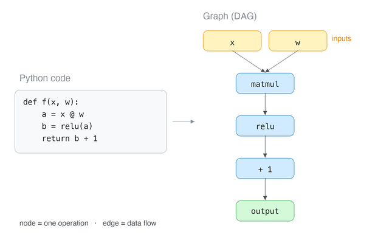
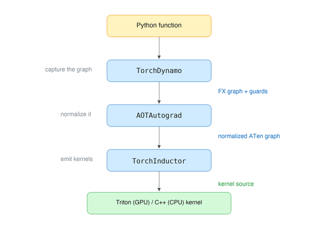
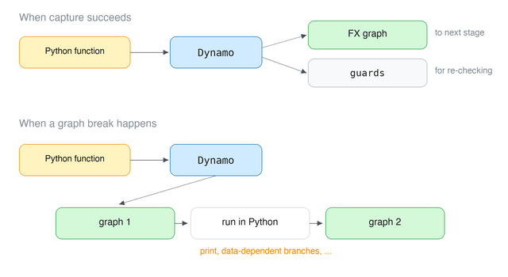
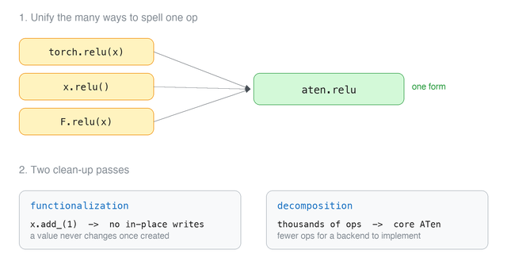
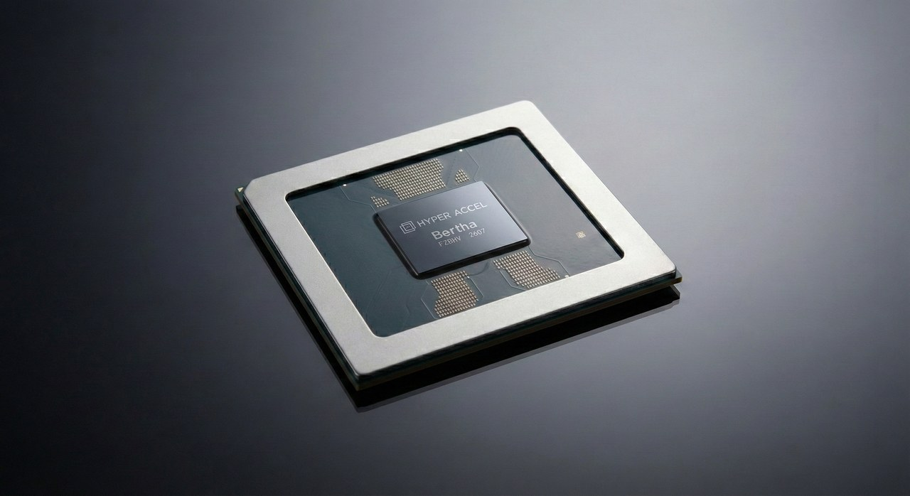

### Introduction

Hello! I'm Hyunjun Park from the CL (Compute Library) team at HyperAccel. We're a startup building a chip called the **LLM Processing Unit (LPU)**, purpose-built for **Large Language Model (LLM)** inference. Just as a GPU is driven through CUDA, the LPU is driven through [Legato]() — an embedded Domain Specific Language (eDSL) built in-house by our compiler team. The CL team's job is to write Legato kernels that squeeze the most out of the LPU architecture.

`torch.compile()` has been one of the hotter topics lately, and plenty of people report large speedups from it. Ask someone how it actually works, though, and the answer usually stops at "it captures a graph and fuses kernels."

One reason PyTorch won so many people over is eager execution — you run one line at a time. That lowered the barrier to entry enormously. But paradoxically, that same choice means line *n* has no idea what comes after it. And that blind spot is exactly what blocks fusion and a whole family of other optimizations, which costs PyTorch a great deal of performance.

So PyTorch has long been looking for a way to keep Python's character while recovering that performance: `TorchScript`, `torch.jit.trace`, `torch.fx`, and others. After many attempts, `torch.compile()` is what came out of that line of work.

There's more here than fits in one post, so this is a two-parter. This first one takes `torch.compile()` apart piece by piece. The second will look at how NPU companies — including us — are climbing aboard the `torch.compile()` ecosystem.

---

## Part 0. Background

### What exactly is a "graph"?

The word "graph" is going to keep coming up, so let's pin it down first. Feel free to skip ahead if this is already familiar.

A graph here is **a picture of how operations depend on one another**. Each operation becomes a **node**, and "the result of this operation feeds into that one" becomes an **edge**. A result never flows back into itself, so what you get is a directed graph with no cycles — a **Directed Acyclic Graph (DAG)**.

The right side is just the left side rewritten. In code, values move around under names like `a` and `b`; in the graph, that same movement is **spelled out as edges**.

That difference is the whole point. While Python executes line by line, there is no way to know where the result of `x @ w` will end up next. The graph, on the other hand, **has the entire flow written down at once**. You can see up front that `matmul`'s result goes only to `relu` and nowhere else — which is what lets you decide whether the two can be handled together.

This is the answer to the problem from the introduction, the one where line *n* can't see past itself. Which is why half of what `torch.compile()` does is simply **getting its hands on this graph**.

### What is an "FX graph"?

PyTorch has its own data structure for holding that graph. It's called an **FX graph**.

The format came out of an earlier attempt, `torch.fx`, and today the entire `torch.compile()` stack passes it around. From here on, when this post says "graph," it almost always means this one.

There's nothing exotic about it — think of it as the picture above written down in code. One operation is one node, and each node carries the list of nodes it depends on, which form the edges. What matters is that it's an **ordinary Python object**: easy to walk over and easy to rewrite, which is what makes AOTAutograd's clean-up passes possible later on.

---

## Part 1. The three components of torch.compile {#part1}

### Three components

Now that graphs are out of the way, let's get into `torch.compile()` proper. It breaks down into three stages: TorchDynamo, AOTAutograd, and TorchInductor.

Here's the whole thing at a glance. First, at the front end, Dynamo takes user code and builds a graph. **Building the graph** means interpreting the Python interpreter itself — pulling operations defined in PyTorch out into graph form while contending with dynamic typing, data-dependent branches, calls into external libraries, and so on.

AOTAutograd then tidies that FX graph up and passes it down to the backend. **Tidying the graph** means simplifying its representation without changing its meaning: collapsing the many ways of calling the same operation into one, stripping out side effects, and shrinking the variety of operations.

Finally, in the backend, Inductor produces Triton or C++ code. **Making kernels** is where you deal with hardware: which operations to group, how to use memory, and which language to emit.

Here's what each component hands to the next:

| Component | Input | Output |
| --- | --- | --- |
| **TorchDynamo** | Python function | FX graph + guards + residual bytecode |
| **AOTAutograd** | FX graph | normalized ATen graph |
| **TorchInductor** | ATen graph | Triton (GPU) or C++ (CPU) kernel source |

The **FX graph** in that table is the name of the data structure PyTorch actually stores the graph from Part 0 in. We'll look at its structure in Part 2.

And these three components are **independently replaceable**. `torch.compile(backend=...)` lets you drop in a compiler other than Inductor — which is exactly what we do with our Legato backend. More on that next time.

---

## Part 2. TorchDynamo: turning Python code into an fx.Graph {#part2}

TorchDynamo's job is **extracting a graph from Python code**. It doesn't actually compute anything — it just follows how values flow, and records tensor operations into a graph as it goes. What comes out is the FX graph from Part 0, and it's what AOTAutograd tidies up and what Inductor turns into kernels.

This is where **the destination of every operation's result** becomes visible. It's precisely the information Python code couldn't give us, and it's the basis on which Inductor can later group operations together and fuse them.

### Graph breaks: what doesn't fit in a graph

Not all Python code becomes a graph. When Dynamo hits something it can't handle, it **cuts the graph right there**. This is called a **graph break**. Two kinds of code account for most of them:

- **Control flow that depends on tensor values** — a branch like `if x.sum() > 0:` that needs the actual value to resolve
- **Python behavior a graph can't express** — `print`, file I/O, network calls, and so on

When a break happens, Dynamo compiles and runs the graph it has collected so far, hands control back to Python for the problematic part, and then starts extracting a fresh graph from there. So a single function can end up split across several graphs.

The catch is that every break introduces a context switch between compiled code and the Python interpreter, and — more importantly — **a shorter graph means a smaller window to fuse within**. The moment you split the graph, any optimization that would have crossed that boundary is gone. Which is why a good deal of real optimization work amounts to reducing graph breaks.

---

## Part 3. AOTAutograd: tidying up the captured graph {#part3}

The graph Dynamo hands over isn't quite ready to become kernels, because **its representation is still too user-facing**. Dynamo's graph keeps whatever form we wrote in our code. And in PyTorch there are several ways to call the same operation — as a method, as a function, as an operator. For someone writing a backend, that means implementing the same thing several times over.

So before kernels get made, the graph needs to be **normalized** once. That's AOTAutograd's job. The name comes from handling autograd **A**head **o**f **T**ime.

### Catching operations below the dispatcher

It's worth a quick look at how an operation actually executes in PyTorch.

When we write `a + b`, the addition doesn't run immediately. The kernel that needs to be called differs depending on whether the two tensors live on CPU or GPU. The **dispatcher** is what makes that call. The same one-line `+` is routed to a CPU kernel if the tensors are on CPU, and to a GPU kernel if they're on GPU. The actual computation only begins once that choice is settled. AOTAutograd intercepts operations **at the very bottom of this dispatcher**, using a hook that fires just before the final kernel would run.

That's the difference from the earlier approach. `torch.fx` intercepted **above** the Python level, so it saw the name `torch.relu`. AOTAutograd intercepts **below**, so it sees the real operation, `aten::relu`. That's why the graph AOTAutograd produces is uniform throughout.

### Two clean-up passes

Two clean-up passes run over the captured graph.

**Functionalization** removes **operations that overwrite existing memory**. `x.add_(1)` modifies `x` in place instead of making a new tensor, and a tensor created by `view` shares memory with its original. That forces the compiler to keep track of "which point in time is this `x` from?" every time it wants to move or merge operations. So the graph is rewritten such that **once a value is created, it never changes**.

**Decomposition** lowers thousands of operations down to a few hundred, a subset called **core ATen IR**. For anyone writing a backend this is decisive: the number of operations you have to implement drops by an order of magnitude. Why that property matters so much when attaching new hardware to PyTorch is something we'll come back to in the next post.

Once both passes are done, what's left in the graph is **operations with no side effects, drawn from a limited set**. All that remains is turning them into actual kernels.

---

## Part 4. TorchInductor: turning the tidied graph into kernels {#part4}

![How TorchInductor generates code. Plugging Triton rules into the single per-element expression y[i] = floor(x[i]) yields tl.load and libdevice.floor, while C++ rules yield C++/OpenMP code](images/part4-inductor-en.png)

The last component. Inductor takes the tidied graph and generates **actual kernel source code** — [Triton](https://triton-lang.org/) on GPU, C++/OpenMP on CPU. It works in three broad stages: **lowering** (dropping the graph into Inductor's own IR), **scheduling** (deciding which operations to group), and **codegen** (emitting the code).

Part 3's decomposition was also described as "lowering," but the two move along different axes. Decomposition reduced the *number of distinct operations* (thousands down to hundreds). The lowering here changes the *level of the representation*: it doesn't shrink the op set further, it rewrites what was expressed per tensor into an expression written per element. That's what the next section is about.

### From per-tensor to per-element

There's one point here that's easy to trip over. Inductor has an IR of its own, and it **works at a different granularity** than the FX graph. In the FX graph, **one operation was one node** and its arguments were whole tensors. Inductor rewrites that same operation **in terms of a single element**: think of `y = floor(x)` becoming `y[i] = floor(x[i])`.

The parallelization strategy is settled afterwards. That's what lets the same expression be laid out differently on different devices. This stage is called a **loop-level IR** — it works one level inside the loop nest rather than on whole tensors.

### Fusion is just concatenating formulas

Why this representation is a good idea becomes clear with **fusion**. As mentioned in the introduction, eager execution's fundamental loss comes from launching a separate kernel per operation and writing intermediate results out to memory only to read them back. When a single normalization splits into five or six operations, a memory round trip wedges itself into every gap. Fusion is the optimization that **merges those operations into one kernel**, so you read once and write once.

With the IR written this way, fusion becomes straightforward to handle, because merging two operations turns into **concatenating two formulas**. If `y[i] = floor(x[i])` is followed by `z[i] = y[i] + 1`, you just write it as `z[i] = floor(x[i]) + 1`. The intermediate `y` never has to go out to memory. No elaborate transformation of moving graph nodes around and rewiring them.

### Emitting strings instead of computing values

So how does Triton code come out of that formula? `y[i] = floor(x[i])` is really a combination of two **primitive steps**: reading `x[i]`, and applying floor to it. You **swap those steps for functions that return strings of code** instead of computing values. In the slot where a load happens you plug in a function that produces the string `tl.load(...)`; where the floor happens, one that produces `libdevice.floor(...)`.

Now run the expression `y[i] = floor(x[i])` in the perfectly ordinary way. Strings get produced at each slot, concatenate in order, and out comes **Triton kernel source code**. Run the same expression with the C++ rule set and you get C++ code instead. **The IR stays put; swapping only the rules produces code in a different language.** And that property is where the next post begins.

---

## Conclusion

`torch.compile()` was an answer to a long-standing PyTorch problem: getting a graph without giving up Python's flexibility. It recovered optimization opportunities like fusion that eager execution structurally struggled to reach, and the resulting speedups got a lot of attention.

What I find more interesting, though, is that `torch.compile()`'s real character is its **structure** — one built with extensibility in mind. As you saw in Part 4, Inductor produced both Triton and C++ by changing nothing but a set of rules. So: **what happens if you plug a code generator for entirely different hardware into that slot?** And what does it mean, for someone trying to attach new hardware, that the decomposition from Part 3 sharply reduces the number of operations you must implement?

I think PyTorch is designing for that extensibility deliberately — holding a door open for accelerators that aren't CUDA, for NPUs to walk into the PyTorch ecosystem, and in doing so keeping its place as the standard framework across the whole AI hardware market.

Next time we'll look at what that door actually looks like: the extension points PyTorch leaves open for third-party accelerators, and how different NPU companies, facing the same problem, arrived at **different answers**.

And finally, where our own [Legato]() is aiming to plug into this ecosystem, and why that particular spot.

## Reference

**PyTorch documentation**

- [torch.compile programming model](https://docs.pytorch.org/docs/2.9/compile/programming_model.html) — Dynamo core concepts, graph breaks, guards, dynamic shapes
- [Custom Backends](https://docs.pytorch.org/docs/main/user_guide/torch_compiler/torch.compiler_custom_backends.html)
- [torch.fx](https://docs.pytorch.org/docs/stable/fx.html) — the structure of an FX graph

## P.S. HyperAccel is hiring!

With the LPU, HyperAccel is throwing down a gauntlet in the AI infrastructure market with a genuinely new architecture. And the software team's work is to draw every last bit of performance out of that hardware while making sure users can reach it in **the most intuitive and elegant way possible** — which takes no small amount of research and implementation.

If you'd like to join us on that ride, apply through [HyperAccel Career](https://hyperaccel.career.greetinghr.com/en/guide)!
