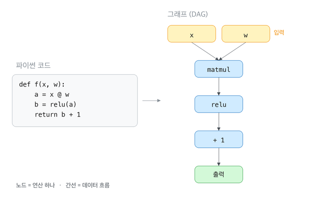
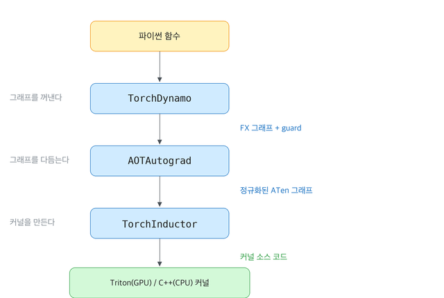
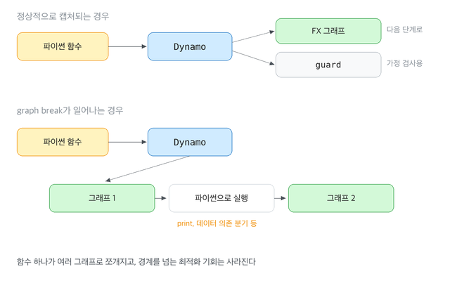
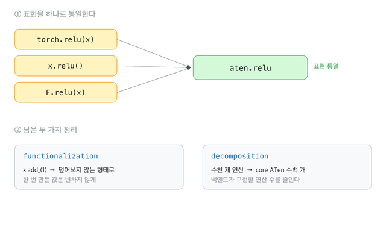

### 개요

안녕하세요? HyperAccel CL(Compute Library)팀 박현준입니다. 저희는 **Latency Processing Unit(LPU)** 이라는 **Large Language Model(LLM)** 특화 반도체를 만드는 스타트업입니다. 그리고 GPU가 CUDA라는 언어로 동작하듯이, LPU는 저희 컴파일러팀에서 자체 제작한 embedded Domain Specific Language(eDSL)인 [Legato]()라는 프로그래밍 언어를 통해 동작하고, CL팀은 LPU라는 architecture에 대한 이해를 기반으로 최적화된 legato kernel을 작성하는 업무를 주로 하고 있습니다.

요즘 `torch.compile()` 이 매우 핫한 주제 중 하나인데요, 실제 실행이 많이 빨라졌다는 평가도 많습니다. 그러나 이것의 동작 방식을 설명해 보라고 하면, 대부분 "그래프를 캡처해서 커널을 합쳐 준다" 정도에서 멈춥니다.

사실 PyTorch가 많은 사랑을 받게 된 이유 중 하나는 eager 방식으로 한 줄씩 실행할 수 있다는 점이라고 생각합니다. 이러한 방식 덕분에 진입 장벽이 크게 낮아졌으니까요. 하지만 역설적으로, 이 방식을 채택함으로 인해 n번째 줄에 있는 코드는 그 이후에 올 코드를 알지 못하게 됩니다. 그리고 이러한 특성이 fusion을 비롯한 여러 최적화를 가로막아 PyTorch의 성능을 크게 낮추게 됩니다.

그래서 PyTorch는 예전부터 파이썬의 정체성을 유지하면서도 성능을 높일 수 있는 시도를 해왔고, `TorchScript`, `torch.jit.trace`, `torch.fx` 등의 시도가 있었습니다. 그리고 꾸준한 시도 끝에 결국 `torch.compile()` 이 탄생하게 됩니다.

이번 글에서는 다루고 싶은 내용이 많기에 2부작으로 구성하고자 하는데요, 이번 편에서는 `torch.compile()` 의 구성 요소를 낱낱이 분해해서 살펴보고, 다음 편에서는 저희를 포함한 다양한 NPU 회사들이 어떤 식으로 `torch.compile()` 의 생태계에 탑승하고 있는지 정리해보고자 합니다.

---

## Part 0. 배경 지식

### "그래프"란 무엇인가

앞으로 "그래프"라는 말이 계속 나올 예정이니 한 번 짚고 넘어가겠습니다. 이미 아시는 분들께서는 스킵하셔도 좋습니다.

여기서 그래프는 **연산들의 의존 관계를 그린 그림** 입니다. 연산 하나가 **노드** 가 되고, "이 연산의 결과가 저 연산의 입력으로 들어간다"는 관계가 **간선** 이 됩니다. 결과가 자기 자신에게 되돌아오는 일은 없으니 방향이 있고 순환이 없는 그래프, 즉 **방향 비순환 그래프(Directed Acyclic Graph, DAG)** 가 됩니다.

왼쪽 파이썬 코드를 오른쪽처럼 옮겨 적은 것입니다. 코드에서는 `a`, `b` 같은 변수 이름으로 값을 주고받지만, 그래프에서는 그 주고받음이 **간선으로 드러나 있습니다.**

이 차이가 핵심입니다. 파이썬 코드를 한 줄씩 실행하는 동안에는 `x @ w` 의 결과가 다음에 어디로 갈지 알 수 없습니다. 반면 그래프에는 **전체 흐름이 한꺼번에 적혀 있습니다.** `matmul` 의 결과가 `relu` 로만 가고 다른 데서는 쓰이지 않는다는 사실을 미리 알 수 있으니, 두 연산을 묶어서 처리해도 되는지 판단할 수 있게 됩니다.

개요에서 이야기한 "n번째 줄이 그 이후를 알지 못한다"는 문제를 푸는 방법이 바로 이것입니다. 그래서 `torch.compile()` 이 하는 일의 절반은 **어떻게든 이 그래프를 손에 넣는 것** 입니다.

---

## Part 1. torch.compile의 3대 요소 {#part1}

### 세 개의 요소

자 이제 그래프에 대해 알았으니, 본격적으로 `torch.compile()`에 대해 알아보겠습니다. `torch.compile()` 은 크게 3단계(TorchDynamo,  AOTAutograd, TorchInductor)로 이루어져 있습니다.

전체 그림으로 보면 다음과 같이 정리할 수 있습니다. 우선 Frontend에서 Dynamo가 사용자 코드를 받아 그래프를 만듭니다. **그래프를 만든다는 것** 은 파이썬 인터프리터를 해석하는 일입니다. pytorch로 정의된 연산을 동적 타입, 데이터 의존 분기, 외부 라이브러리 호출 같은 것들을 고려하여 그래프 형태로 추출한다고도 이야기할 수 있습니다.

AOTAutograd는 FX 그래프를 다듬어 아래쪽 Backend로 넘깁니다. **그래프를 다듬는 것** 은 의미를 보존하면서 표현을 단순하게 만드는 일입니다. 같은 연산을 부르는 여러 방법을 하나로 통일하고, 부작용을 걷어내고, 연산의 종류를 줄입니다.

마지막으로 backend에서 Inductor가 Triton이나 C++ 코드를 뽑아냅니다. **커널을 만드는 일** 은 하드웨어를 상대하는 일입니다. 어떤 연산들을 묶을지, 메모리를 어떻게 쓸지, 어떤 언어로 코드를 뽑을지를 정합니다.

각 요소가 무엇을 주고받는지 다시 한 번 정리해보겠습니다.

| 요소                | 입력            | 출력                            |
| ----------------- | ------------- | ----------------------------- |
| **TorchDynamo**   | 파이썬 함수 | FX 그래프 + guard + 잔여 바이트코드     |
| **AOTAutograd**   | FX 그래프        | 정규화된 ATen 그래프                  |
| **TorchInductor** | ATen 그래프      | Triton(GPU) 또는 C++(CPU) 커널 소스 |

그리고 이 세 요소는 **독립적으로 교체할 수 있습니다.** `torch.compile(backend=...)` 으로 Inductor 대신 다른 컴파일러를 꽂을 수 있고, 실제로 저희도 Legato Backend를 붙여서 사용하고 있는데, 이 부분은 다음 편에서 자세히 다루겠습니다.

---

## Part 2. TorchDynamo: 파이썬 코드를 fx.graph(이하 그래프)타입으로 바꿔주는 모듈 {#part2}

TorchDynamo는 **파이썬 코드에서 그래프를 추출하는 작업** 을 수행합니다. 실제로 계산하지는 않고 값이 어떻게 흘러가는지만 따라가다가, 텐서 연산을 만나면 그래프에 기록합니다. Dynamo가 만들어 내는 그래프의 형식이 `fx.Graph` 입니다. AOTAutograd가 다듬는 것도, Inductor가 받아 커널로 만드는 것도 이 그래프입니다.

구조는 단순합니다. 연산 하나가 **노드(node)** 하나이고, 노드들이 데이터 흐름을 따라 이어진 방향 비순환 그래프(DAG)입니다. 각 노드는 자신이 의존하는 노드 목록도 함께 들고 있고, 이것이 그래프의 간선이 됩니다. 덕분에 **어떤 연산의 결과가 어디로 흘러가는지** 를 그래프만 보고 알 수 있습니다. 파이썬 코드로는 알 수 없었던 바로 그 정보이고, 뒤에서 Inductor가 연산을 묶어 융합할 수 있는 근거가 됩니다.

### graph break: 그래프에 담기지 못하는 것들

모든 파이썬 코드가 그래프가 되지는 않습니다. Dynamo가 다룰 수 없는 것을 만나면 **그 자리에서 그래프를 끊습니다.** 이것을 **graph break** 라고 합니다. 가장 흔하게 발견되는 코드는 두 종류입니다:

- **텐서 값에 의존하는 제어 흐름** — `if x.sum() > 0:` 처럼 실제 값을 알아야 판정되는 분기
- **그래프로 표현할 수 없는 파이썬 동작** — `print`, 파일 입출력, 네트워크 호출 등

그래프가 끊기게 되면 거기까지 모은 그래프를 컴파일해서 실행하고, 문제가 된 부분은 제어권을 파이썬에 돌려주어 원래대로 실행하고, 그다음부터 다시 새 그래프를 추출합니다. 따라서 함수 하나가 여러 개의 그래프로 쪼개질 수도 있습니다.

다만 끊을 때마다 컴파일된 코드와 파이썬 인터프리터 사이를 오가는 문맥 전환이 생기고, **그래프가 짧아지면 융합할 수 있는 범위도 좁아집니다.** 그래프를 나누는 순간, 그 경계를 넘는 최적화 기회는 사라지기 때문입니다. 그래서 실제 최적화 작업의 상당 부분은 graph break를 줄이는 일이 됩니다.

---

## Part 3. AOTAutograd: 생성된 그래프를 다듬는 모듈 {#part3}

Dynamo가 꺼낸 그래프를 그대로 커널로 만들기에는 **표현이 너무 사용자 친화적** 이라는 문제가 있습니다. Dynamo의 그래프에는 우리가 코드에 쓴 형태가 그대로 남아 있습니다. 그런데 PyTorch에서 같은 연산을 부르는 방법은 여러 가지입니다. 메서드로도 부를 수 있고, 함수로도 부를 수 있고, 연산자로도 부를 수 있습니다. 백엔드를 만드는 사람 입장에서는 같은 것을 여러 번 구현해야 하는 셈입니다.

그래서 커널을 만들기 전에 그래프를 한 번 **정규화** 하는 단계가 필요합니다. 그 일을 맡은 것이 AOTAutograd입니다. 이름은 autograd를 **A**head-**o**f-**T**ime으로 처리한다는 데서 왔습니다.

### 디스패처 아래에서 연산을 잡는다

PyTorch에서 연산이 실행되는 과정을 잠깐 볼 필요가 있습니다.

우리가 `a + b` 라고 쓰면 곧바로 덧셈이 실행되지 않습니다. 두 텐서가 CPU에 있느냐 GPU에 있느냐에 따라 불려야 할 커널이 다르기 때문입니다. 이 판단을 맡은 것이 **디스패처(dispatcher)** 입니다. 같은 `+` 한 줄이라도 텐서가 CPU에 있으면 CPU 커널로, GPU에 있으면 GPU 커널로 보내집니다. 실제 계산은 이 선택이 끝난 뒤에야 시작됩니다. AOTAutograd는 이 **디스패처의 맨 아래** 에서 연산을 가로챕니다. 최종 커널이 실행되기 직전에 발동하는 훅을 쓰는 것입니다.

이것이 이전 방식과의 차이입니다. `torch.fx` 의 방식은 파이썬 레벨 **위** 에서 가로챘기 때문에 `torch.relu` 라는 이름을 보았습니다. AOTAutograd는 **아래** 에서 가로채기 때문에 `aten::relu` 라는 실제 연산을 봅니다. 그래서 AOTAutograd가 내놓는 그래프는 표현이 전부 통일되어 있습니다.

### 그래프를 다듬는 두 가지 작업

잡아낸 그래프에 두 가지 정리가 들어갑니다.

**functionalization** 은 **기존 메모리를 덮어쓰는 연산** 을 없애는 작업입니다. `x.add_(1)` 은 새 텐서를 만드는 대신 `x` 자체를 고치고, `view` 로 만든 텐서는 원본과 메모리를 공유합니다. 이러면 컴파일러가 연산을 옮기거나 합칠 때마다 "지금 이 `x` 가 언제 시점의 값인지"를 일일이 따져야 합니다. 그래서 **한 번 만들어진 값은 변하지 않도록** 그래프를 고쳐 둡니다.

**decomposition** 은 수천 개의 연산을 **core ATen IR** 이라는 수백 개짜리 부분집합으로 낮추는 작업입니다. 백엔드를 만드는 사람 입장에서 이건 결정적입니다. 구현해야 할 연산의 개수가 한 자릿수 배 줄어듭니다. 새로운 하드웨어를 PyTorch에 붙일 때 이 성질이 왜 중요한지는 2편에서 다시 이야기하겠습니다.

이 두 작업을 거치고 나면, 그래프에 남는 것은 **부작용이 없고, 종류가 제한된 연산들** 뿐입니다. 이제 이것을 실제 커널로 옮기는 일만 남았습니다.

---

## Part 4. TorchInductor: 다듬은 그래프를 커널로 만드는 모듈 {#part4}

![TorchInductor의 코드 생성 방식. 원소 단위 수식 y[i] = floor(x[i]) 하나에 Triton 규칙을 끼우면 tl.load와 libdevice.floor가, C++ 규칙을 끼우면 C++/OpenMP 코드가 생성된다](images/part4-inductor.png)

마지막 요소입니다. Inductor는 다듬어진 그래프를 받아 **실제 커널 소스 코드** 를 생성합니다. GPU에서는 [Triton](https://triton-lang.org/), CPU에서는 C++/OpenMP를 뱉습니다. Inductor에서 진행하는 동작은 크게 세 단계입니다. **lowering**(그래프를 Inductor 자체 IR로 낮추기), **scheduling**(어떤 연산들을 묶을지 정하기), **codegen**(실제 코드 생성).

### 텐서 단위에서 원소 단위로

여기서 헷갈리기 쉬운 지점이 하나 있습니다. Inductor도 자기만의 IR을 갖는데, 이것이 지금까지 본 그래프와 **표현하는 단위가 다릅니다.** 지금까지 본 그래프에서는 **연산 하나가 노드 하나** 였습니다. `floor` 노드는 "이 텐서 전체에 내림을 적용한다"는 뜻이죠. 텐서를 통째로 다루는 표현입니다.

Inductor는 같은 연산을 **원소 하나 기준으로** 다시 적습니다. `y = floor(x)` 를 `y[i] = floor(x[i])` 로 바꿔 쓰는 셈입니다. 엑셀에 비유하면 이렇습니다. 앞의 표현이 "B열은 A열을 내림한 값이다"라고 **열 단위로 말하는 것** 이라면, Inductor의 표현은 **`B1` 칸에 `=FLOOR(A1)` 이라는 수식 하나를 적어 두는 것** 에 가깝습니다. 그 수식을 몇 행까지 끌어내릴지는 아직 정하지 않았고요.

이 "몇 번 반복할지 아직 정하지 않았다"가 핵심입니다. 반복 횟수와 병렬화 방식을 뒤에서 정할 수 있으니, 같은 수식을 GPU에서는 이렇게 CPU에서는 저렇게 펼칠 수 있습니다. 그래서 이 단계를 **루프 수준 IR(loop-level IR)** 이라고 부릅니다. Part 1의 구조도 아래쪽에 적힌 `Inductor Loop-level IR` 이 이것입니다.

그리고 이 수식은 **기본 동작** 들의 조합입니다. 방금 예에서는 `x[i]` 를 읽는 동작과, 거기에 내림을 적용하는 동작 두 개죠. 아직 실제 코드는 아니고 "여기서 읽는다", "여기서 내린다"고 표시만 해 둔 상태입니다. Inductor는 이 수식을 자료 구조가 아니라 **파이썬 함수** 로 들고 있어서, 무엇을 계산하는지 알려면 실행해 봐야 합니다. 이 방식을 **define-by-run IR** 이라고 부르는데, 바로 다음에 나오는 코드 생성 방식이 여기서 나옵니다.

### 융합은 계산식을 이어 붙이는 일

이 표현이 왜 좋은지는 **융합(fusion)** 에서 드러납니다. 개요에서 이야기했듯이, eager 방식의 근본적인 손해는 연산마다 커널을 따로 띄우면서 중간 결과를 메모리에 썼다가 다시 읽는 데서 옵니다. 정규화 하나가 연산 대여섯 개로 쪼개지면, 그 사이사이마다 메모리 왕복이 끼어듭니다. 융합은 이 연산들을 **커널 하나로 합쳐서** 읽기 한 번, 쓰기 한 번으로 끝내는 최적화입니다.

IR을 이렇게 표현하면 융합이 놀랄 만큼 단순해집니다. 연산 두 개를 융합한다는 것이 **두 계산식을 이어 붙이는 일** 이 되기 때문입니다. `y[i] = floor(x[i])` 다음에 `z[i] = y[i] + 1` 이 온다면, 그냥 `z[i] = floor(x[i]) + 1` 로 이어 쓰면 됩니다. 중간 결과 `y` 는 메모리에 나갈 일이 없어집니다. 그래프 노드를 옮기고 다시 연결하는 복잡한 변환도 필요 없습니다.

### 계산하는 대신 문자열을 뱉게 하기

그럼 이 계산식에서 어떻게 Triton 코드가 나올까요? 앞서 말한 **기본 동작들** 을, 실제 값을 계산하는 대신 **코드 문자열을 반환하는 함수로 갈아끼웁니다.** 읽는 동작 자리에는 `tl.load(...)` 라는 문자열을 만들어 반환하는 함수를, 내림 동작 자리에는 `libdevice.floor(...)` 를 만들어 반환하는 함수를 꽂아 두는 것입니다. 

이 상태에서 `y[i] = floor(x[i])` 라는 식을 그냥 평범하게 실행하면 각 자리에서 문자열이 만들어져 차례로 이어지고 그 결과 **Triton 커널 소스 코드가 완성됩니다.** 그리고 같은 식을 C++용 교체 규칙으로 실행하면 C++ 코드가 나옵니다. **IR은 그대로 두고 교체 규칙만 갈아끼우면 다른 언어의 코드가 생성되는 것입니다.** 그리고 이 성질이 2편의 출발점입니다.

---

## Conclusion

`torch.compile()` 은 파이썬의 유연함을 포기하지 않으면서 그래프를 얻는다는, PyTorch의 오랜 숙제에 대한 답이었습니다. 성과는 분명합니다. eager 방식이 구조적으로 포기했던 fusion을 되찾았고, 사람이 손으로 짜던 융합 커널을 컴파일러가 대신 쓰게 되었습니다.

그런데 저는 `torch.compile()` 이 남긴 진짜 성과가 속도가 아니라 확장성을 고려한 **구조** 라고 생각합니다.

Part 4에서 보셨듯이, Inductor는 교체 규칙 하나만 바꿔서 Triton과 C++을 모두 만들어 냈습니다. 그렇다면 **저 자리에 완전히 다른 하드웨어를 위한 코드 생성기를 꽂으면 어떻게 될까요?** Dynamo 백엔드 자리에 Inductor 대신 다른 컴파일러를 넣으면요? Part 3에서 본 decomposition이 구현해야 할 연산 수를 크게 줄여 준다는 사실은, 새 하드웨어를 붙이려는 입장에서 어떤 의미일까요?

이건 우연이 아닙니다. PyTorch는 이 확장성을 의도적으로 설계하고 있습니다. CUDA가 아닌 가속기, NPU들이 PyTorch 생태계 안으로 들어올 수 있는 문을 열어 두고, 그럼으로써 AI 하드웨어 시장 전체의 표준 프레임워크 자리를 지키려는 것이라고 생각합니다.

다음 편에서는 그 문이 구체적으로 어떻게 생겼는지 살펴보겠습니다. PyTorch가 서드파티 가속기를 위해 열어 둔 확장점들, 그리고 같은 문제 앞에서 여러 NPU 회사들이 어떻게 **서로 다른 답** 을 골랐는지 비교해 보려고 합니다.

그리고 마지막으로, 저희 HyperAccel의 [Legato]()가 이 생태계의 어느 자리에 꽂히려 하는지, 그리고 왜 그 자리인지를 이야기하겠습니다.

## Reference

**PyTorch 공식 문서**

- [torch.compile programming model](https://docs.pytorch.org/docs/2.9/compile/programming_model.html) — Dynamo 핵심 개념, graph break, guard, dynamic shape
- [Custom Backends](https://docs.pytorch.org/docs/main/user_guide/torch_compiler/torch.compiler_custom_backends.html)
- [torch.fx](https://docs.pytorch.org/docs/stable/fx.html) — FX 그래프의 구조

**도구**

- [Triton](https://triton-lang.org/) — Inductor가 GPU 커널을 생성할 때 쓰는 언어

## 추신: HyperAccel은 채용 중입니다!

LPU 소프트웨어 스택과 컴파일러를 함께 만들어 갈 동료를 찾고 있습니다. 저희가 다루는 기술에 관심이 있으시다면 [HyperAccel Career](https://hyperaccel.career.greetinghr.com/ko/guide)로 지원해 주세요!