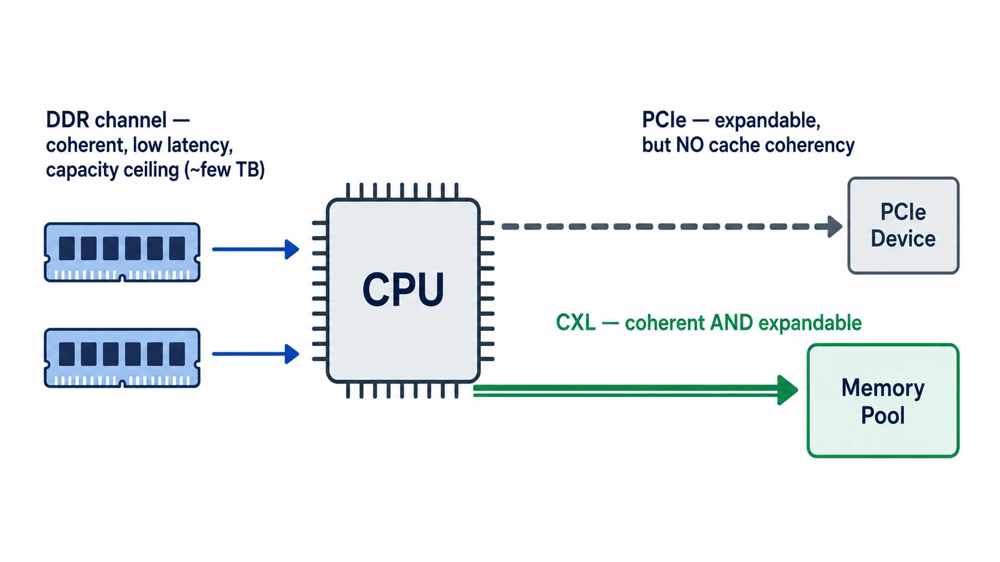
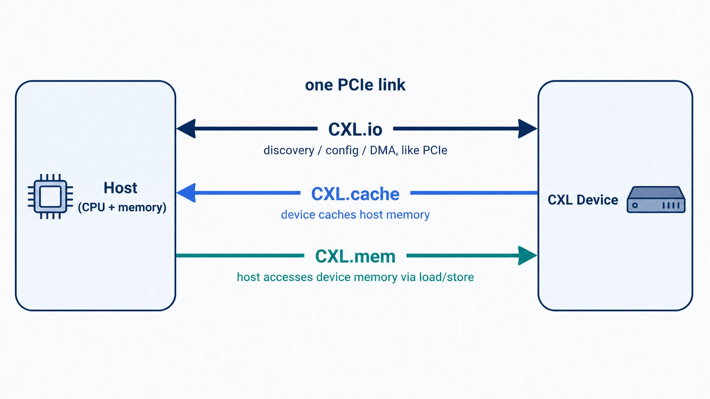
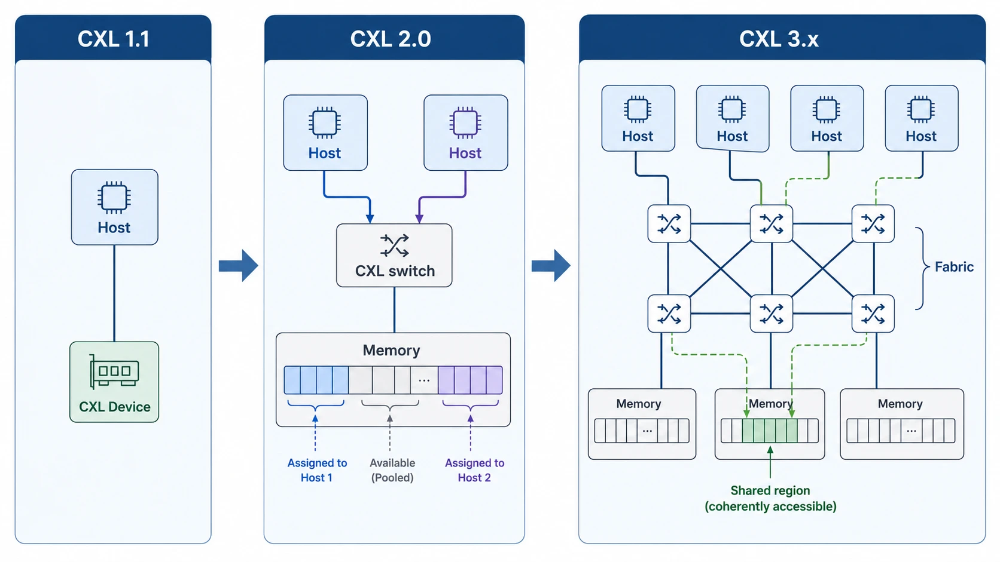

> 이 글은 **AI 시대의 필수 소비재, 메모리 이해하기** 시리즈의 4편입니다.
> [1편](https://hyper-accel.github.io/posts/what-is-hbf/), [2편](https://hyper-accel.github.io/posts/hbf-workload/), [3편](https://hyper-accel.github.io/posts/hbf-challenge/) 에서는 GPU 옆 메모리 계층의 빈 자리를 채우는 **High Bandwidth Flash(HBF)** 를 다뤘습니다.
> 이번 편부터는 시점을 GPU 바깥, 시스템 레벨로 옮겨서 **Compute Express Link(CXL)** 이 메모리 계층의 어디를 채우는지 살펴봅니다.

## 들어가며

안녕하세요, HyperAccel에서 RTL Designer로 재직 중인 신승빈입니다.

지난 1-3편을 통해 우리는 **GPU 바로 옆의 메모리 계층** 을 깊게 들여다보았습니다. HBM은 DRAM을 쌓아 대역폭을 끌어올렸고, HBF는 NAND에 HBM의 패키징을 입혀 용량을 끌어왔죠.

그런데 데이터센터 메모리 얘기를 하다 보면 GPU 옆이 아닌 다른 자리에서 자꾸 들리는 이름이 있습니다. 바로 **CXL** 입니다.

"메모리 풀(pool)을 만든다", "VM 사이에 메모리를 공유한다", "AI 서버의 hot/warm/cold 데이터를 계층화한다" 같은 이야기에 빠지지 않고 등장하는 키워드죠.

그런데 막상 CXL을 검색해 보면 약자부터 다양합니다. CXL.io, CXL.cache, CXL.mem이 있고, Type 1·2·3 device가 있으며, 버전도 1.1, 2.0, 3.0, 3.1까지 등장합니다. 진입 장벽이 꽤 높은 인터페이스입니다.

그래서 이번 편에서는 한 가지 질문에서 출발하려고 합니다.

**"이미 DDR도 있고 PCIe도 있는데, 왜 또 새로운 인터페이스가 필요했을까?"**

이 질문에 답해 보면 CXL이 메모리 계층 어디에 자리잡는지, 그리고 메모리 3사(삼성, SK하이닉스, 마이크론)가 일제히 CXL 제품 라인업을 키우는 이유가 자연스럽게 보입니다.

이 포스팅의 내용은 제가 개인적으로 공부하고, 경험한 내용을 바탕으로 작성되었습니다.
오류가 있다면 언제든지 댓글로 알려주세요.

---

## 왜 또 새로운 인터페이스인가 — DDR과 PCIe 사이의 빈 자리

결론부터 말하면, **DDR은 늘릴 수 없고 PCIe는 메모리로 쓰기 어렵기 때문** 입니다.

서버 한 대 안에서 CPU가 데이터를 주고받는 통로는 크게 두 가지입니다.

- **DDR 채널**: CPU 바로 옆의 DRAM 모듈과 연결되는 메모리 전용 버스
- **PCIe**: GPU, NIC, SSD 같은 주변장치와 연결되는 범용 직렬 버스

이 두 통로는 각자 잘하는 역할이 명확합니다. 그런데 두 통로 모두 한계에 부딪혀 있습니다.

### DDR의 한계: 채널 수가 곧 천장

CPU가 DDR DRAM을 더 붙이려면 **메모리 채널을 늘려야** 합니다. 그런데 채널을 늘리려면 CPU 패키지의 핀 수가 늘어나고, 메인보드 배선도 같이 복잡해집니다.

서버용 CPU의 최신 세대도 채널 수는 8-16개 수준에서 멈춰 있고, 채널당 모듈 수도 1-2개로 제한됩니다.

결과적으로 한 소켓의 DRAM 용량은 수 TB가 천장입니다. 그 이상은 물리적으로 못 붙이는 구조죠.

LLM 추론이 한 노드에서 다루는 데이터(KV cache, 모델 weight, 임베딩)가 수십 TB로 불어나면서, 이 천장에 닿는 상황이 점점 잦아지고 있습니다.

### PCIe의 한계: 빠르지만 일관성이 없다

그럼 PCIe로 메모리를 붙이면 어떨까요? PCIe Gen5는 16-lane 기준 **단방향 약 64 GB/s** (양방향 합산 128 GB/s)의 대역폭을 제공합니다. DDR5 채널 하나(약 50 GB/s)와 견줄 만합니다.

공교롭게도 이 64 GB/s는 3편에도 등장했던 숫자입니다. HBF를 GPU 옆에 붙일 때 "대역폭 천장"으로 지목됐던 바로 그 PCIe죠. 그런데 메모리 확장이라는 관점에서 보면 이 대역폭 자체는 그렇게 부족하지 않습니다. 진짜 걸림돌은 다른 데 있습니다.

PCIe로 메모리를 붙일 때 생기는 문제는 두 가지입니다.

첫째, **캐시 일관성(cache coherency)이 없습니다.** CPU가 PCIe 장치의 메모리를 직접 load/store 하려면 캐시 라인 단위로 일관성이 보장되어야 합니다. PCIe는 본래 패킷 기반 I/O 프로토콜이라 이 보장이 없습니다. PCIe 메모리를 메인 메모리처럼 쓰려면 OS가 명시적으로 데이터를 옮겨주는(memcpy) 방식이 필요합니다.

둘째, **메모리 시맨틱이 거칠다.** PCIe는 64B 캐시 라인이 아니라 더 큰 transaction 단위로 동작합니다. 메모리처럼 작은 단위로 fine-grained access를 할 수 없습니다.

PCIe로 메모리를 붙일 수는 있지만, CPU 입장에서는 그 메모리가 "내 메모리"가 아닌 "남의 메모리" 입니다.

### 빈 자리: 캐시 일관성 있는 메모리 인터페이스

지금까지 정리를 한 줄로 묶으면 이렇습니다.

> **DDR처럼 일관성 있는 메모리 인터페이스인데, PCIe처럼 시스템 외부로 확장할 수 있는 무언가가 필요하다.**

이 빈 자리를 채우기 위해 등장한 표준이 바로 **CXL** 입니다.

CXL은 처음부터 새로 만든 물리 계층이 아닙니다. **PCIe의 물리 계층(PHY)을 그대로 빌려 쓰면서, 그 위에 캐시 일관성을 지원하는 새로운 프로토콜을 얹은** 표준입니다.

PCIe 5.0이라는 기성 인프라 위에 캐시 일관성 계약을 추가한 것. 이것이 CXL의 핵심 아이디어입니다.

---

## CXL의 세 얼굴 — CXL.io / CXL.cache / CXL.mem

CXL은 하나의 프로토콜이 아니라 **세 개의 sub-protocol** 묶음입니다. 하나의 PCIe 링크 위에서 셋이 동시에 흐릅니다.

| Sub-protocol | 역할 | 모델 |
|---|---|---|
| **CXL.io** | 디바이스 발견, 설정, DMA | PCIe와 동일 |
| **CXL.cache** | 디바이스가 호스트 메모리를 캐싱 | 디바이스 → 호스트 |
| **CXL.mem** | 호스트가 디바이스 메모리를 직접 접근 | 호스트 → 디바이스 |

이름만 봐서는 헷갈리니, 각자의 역할을 풀어 보겠습니다.

### CXL.io — PCIe와 같은 토대

CXL.io는 사실상 **PCIe와 동일** 합니다. 디바이스를 발견하고(enumeration), 설정 공간을 읽고(configuration), 인터럽트를 전달하고, DMA로 큰 데이터를 옮기는 일을 합니다.

모든 CXL 디바이스는 반드시 CXL.io를 구현해야 합니다. CXL을 PCIe 위에 얹은 표준으로 만든 이유가 여기 있습니다. 기존 PCIe 인프라(OS 드라이버, BIOS, 컨트롤러 IP)를 그대로 재활용할 수 있도록 한 것이죠.

### CXL.cache — 디바이스가 CPU 메모리를 캐싱

GPU나 가속기 같은 디바이스가 CPU의 메인 메모리를 자주 읽는 경우를 생각해 봅시다.

PCIe라면 매번 메인 메모리에서 데이터를 가져와야 합니다. 그런데 만약 디바이스 안에 작은 캐시를 두고, 자주 쓰는 데이터를 거기에 저장해 두면 어떨까요? CPU와 디바이스가 같은 데이터를 보고 있다는 보장만 있다면, 통신량을 크게 줄일 수 있을 겁니다.

**CXL.cache** 는 정확히 이 일을 합니다. 디바이스가 호스트 메모리를 **캐시 라인 단위(64B)로 캐싱** 하고, 그 캐시가 CPU 캐시와 **일관성을 유지** 하도록 합니다.

내부적으로는 CPU의 캐시 일관성 프로토콜(예: MESI)을 CXL 링크 너머로 확장한 형태입니다. 디바이스가 캐시 라인을 가져갈 때 어떤 상태(Modified/Exclusive/Shared/Invalid)로 가져갈지, 다른 캐싱 에이전트가 그 라인을 가지고 있으면 어떻게 처리할지가 모두 표준화되어 있습니다.

### CXL.mem — CPU가 디바이스 메모리를 메인 메모리처럼

반대 방향도 있습니다. 디바이스에 메모리(DRAM, 또는 그 이상)를 잔뜩 달아 놓고, CPU가 그 메모리를 **자신의 메인 메모리처럼 load/store** 하고 싶은 경우입니다.

**CXL.mem** 이 이 역할을 담당합니다. CPU 입장에서는 디바이스 메모리가 자신의 물리 주소 공간 안의 한 구간으로 보이고, 일반적인 load/store 명령으로 직접 접근할 수 있습니다.

여기서 중요한 점은 **CPU가 일관성을 책임지는 주체(home agent) 역할을 한다** 는 것입니다. Type 3처럼 디바이스가 메모리만 들고 있는 경우, 호스트가 단독으로 일관성을 관리하면 충분합니다.

반면 Type 2처럼 **디바이스도 자체 캐시를 가지는 경우** 에는 한 캐시 라인의 "주인"을 디바이스로 둘지 호스트로 둘지 명시적으로 표시하는 **bias-based coherency** 가 적용됩니다. 주인이 된 쪽이 그 라인의 일관성을 책임지므로, 양방향 일관성 트래픽을 크게 줄일 수 있습니다.

복잡하게 들리지만, 실제 구현 부담은 디바이스 쪽에서는 가벼운 편입니다. Type 3의 경우 디바이스는 그저 메모리 컨트롤러처럼 read/write 요청에 응답하면 됩니다.

### 세 프로토콜의 조합

CXL 디바이스는 자신이 어떤 일을 하느냐에 따라 세 프로토콜을 골라 구현합니다.

- 디바이스에 **자체 메모리가 없고 호스트 메모리를 캐싱만 하는** 경우: CXL.io + CXL.cache
- 디바이스에 **메모리가 있고 호스트가 그걸 자기 메모리처럼 쓰기만 하면 되는** 경우: CXL.io + CXL.mem
- 디바이스에 **메모리도 있고, 그 디바이스가 호스트 메모리도 캐싱해야 하는** 경우: CXL.io + CXL.cache + CXL.mem

이 세 가지 조합이 다음 절에서 다룰 **Type 1 / Type 2 / Type 3 디바이스** 의 기준이 됩니다.

---

## 무엇을 꽂을 것인가 — Type 1 / 2 / 3 디바이스

세 가지 sub-protocol을 어떻게 조합하느냐에 따라 CXL 디바이스는 세 가지 타입으로 나뉩니다.

| | Type 1 | Type 2 | Type 3 |
|---|---|---|---|
| **사용 프로토콜** | CXL.io + CXL.cache | CXL.io + CXL.cache + CXL.mem | CXL.io + CXL.mem |
| **디바이스 자체 메모리** | 없음 | 있음 | 있음 |
| **호스트 메모리 캐싱** | 함 | 함 | 안 함 |
| **대표 예시** | SmartNIC, FPGA 가속기 | GPU, AI 가속기 | 메모리 확장 모듈 |

각 타입의 역할과 활용처를 풀어 보겠습니다.

### Type 1 — 캐싱만 하는 가속기

Type 1 디바이스는 **자체 메모리는 없고, 호스트 메모리를 캐싱** 합니다.

대표적인 후보는 **SmartNIC** 입니다. 네트워크에서 들어오는 패킷을 처리할 때 호스트의 디스크립터 큐나 패킷 버퍼를 빈번하게 읽습니다. 이걸 매번 호스트 메모리까지 다녀오는 대신 NIC 내부 캐시에 보관하고 일관성을 유지하면, 패킷 처리 지연을 크게 줄일 수 있습니다.

FPGA 가속기처럼 **호스트 자료구조를 자주 참조하는 워크로드** 에서 Type 1이 가치를 발휘합니다.

### Type 2 — 메모리와 캐시를 모두 가진 가속기

Type 2 디바이스는 **자체 메모리도 있고, 호스트 메모리도 캐싱** 합니다. 세 프로토콜을 모두 씁니다.

전형적인 예는 **CXL을 통해 붙는 GPU나 AI 가속기** 입니다. 가속기는 자체 HBM/GDDR을 가지고 있지만, 모델 weight나 입력 데이터를 호스트 메모리에서 가져와 캐싱하기도 합니다. CXL.cache로 호스트 데이터를 가져오고, CXL.mem으로 가속기의 메모리를 호스트에 노출합니다.

문제는 Type 2가 가장 구현이 복잡한 타입이라는 것입니다. 일관성 관리를 양방향으로 해야 하므로, 디바이스 쪽 컨트롤러 부담이 큽니다. 그래서 실제 양산되는 Type 2 디바이스는 아직 많지 않습니다.

### Type 3 — 가장 흔히 보이는 메모리 확장 모듈

Type 3 디바이스는 **자체 메모리만 있고, 호스트 메모리는 캐싱하지 않습니다.** CXL.io와 CXL.mem만 구현하면 됩니다.

쉽게 말하면 **"CXL 인터페이스를 단 메모리 모듈"** 입니다. 호스트 입장에서는 DDR 모듈을 한 단계 멀리 둔 것처럼 보이고, 일반적인 load/store로 접근할 수 있습니다.

현재 양산되거나 상용화 직전인 CXL 제품의 **대부분은 Type 3** 입니다. 이유는 명확합니다.

- 구현 복잡도가 가장 낮고
- DDR 채널의 천장을 가장 직접적으로 풀어 주며
- 기존 메모리 사업자의 제품 라인업으로 자연스럽게 이어집니다

뒤에서 살펴볼 메모리 3사의 **CXL Memory Module(CMM)** 제품군도 모두 Type 3입니다.

---

## 한 디바이스에서 패브릭으로 — CXL 1.1 → 2.0 → 3.x

CXL은 2019년에 1.0이 나온 이후로 빠르게 진화하고 있습니다. 버전마다 추가되는 기능은 결국 한 가지 방향을 가리킵니다.

> **메모리를 더 멀리, 더 많이, 더 여러 호스트가 공유할 수 있게.**

각 버전의 핵심 변화를 짚어 보겠습니다.

### CXL 1.1 — 한 호스트에 직접 연결

가장 기본 형태입니다. 하나의 호스트 CPU에 하나의 CXL 디바이스를 **PCIe 슬롯처럼 직접 연결** 합니다.

이 단계에서 CXL은 "DDR 옆에 추가 메모리를 한 단계 멀리 붙이는" 도구입니다. 한 노드의 메모리 용량을 늘리는 것이 주된 목적이고, 다른 노드는 알 바가 아닙니다.

### CXL 2.0 — 스위치와 메모리 풀링

2020년에 나온 2.0에서 결정적인 변화가 일어납니다. **CXL 스위치** 가 도입되어 여러 호스트와 여러 메모리 디바이스를 그물처럼 엮을 수 있게 됩니다.

가장 인상적인 응용은 **메모리 풀링(memory pooling)** 입니다. 데이터센터의 메모리 활용률은 평균적으로 40~50% 수준입니다. 어떤 서버는 메모리가 모자라고 어떤 서버는 절반 이상 비어 있는 상황이 흔하죠.

CXL 2.0에서는 **여러 호스트가 하나의 메모리 풀에서 필요한 만큼 동적으로 할당받을 수 있습니다.**

한 가지 주의할 점이 있습니다. 이때의 "공유"는 **동시 공유가 아니라 동적 할당** 입니다.

거대한 메모리 디바이스는 **Multi-Logical Device(MLD)** 형태로 여러 chunk로 쪼개집니다. 그리고 **Fabric Manager(FM)** 라는 컨트롤 플레인이 "이 chunk는 호스트 A에게, 저 chunk는 호스트 B에게" 식으로 나눠 줍니다. 한 chunk는 한 시점에 한 호스트만 소유합니다. 그래서 **캐시 일관성 충돌이 일어날 영역 자체가 없습니다.**

호텔 객실로 비유하면, 한 객실(chunk)은 한 손님(호스트)이 체크인·체크아웃 하면서 회전될 뿐, 두 손님이 같은 객실에 동시에 들어가지 않습니다.

이 모델만으로도 서버마다 최악의 경우를 가정해 메모리를 과다 구매하는 관행을 줄이는 데에는 충분합니다. 이 단계에서 CXL은 더 이상 단일 노드의 확장 인터페이스가 아닙니다. **랙 단위 메모리 자원 관리의 기반** 이 되기 시작합니다.

### CXL 3.x — 패브릭과 멀티 호스트 코히런스

3.0(2022), 3.1(2023), 3.2(2024)까지 이어지는 흐름은 더 야심차게 갑니다.

핵심은 두 가지입니다.

첫째, **동적 할당에서 진짜 공유로.** 2.0의 풀링이 "한 chunk = 한 호스트(동적 회전)"였다면, 3.x에서는 **여러 호스트가 같은 메모리 영역을 동시에 읽고 쓰면서 캐시 일관성을 HW가 유지** 합니다. 이를 **Global Fabric Attached Memory(GFAM)** 라고도 부릅니다. 이 단계부터 진짜 conflict가 발생할 수 있고, 호스트와 디바이스의 **home agent** 가 캐시 라인 단위로 이를 해소합니다.

둘째, **포트 단위 연결에서 패브릭(fabric) 연결로.** 3.x는 다수의 CXL 스위치를 엮어 큰 규모의 패브릭을 구성하고, **Port-Based Routing(PBR)** 같은 기능으로 mesh·dragonfly·3D torus 같은 다양한 토폴로지로 디바이스를 배치할 수 있게 합니다.

이 단계까지 오면 CXL은 사실상 **데이터센터 내부의 새로운 인터커넥트 표준** 으로 자리잡습니다. NVIDIA의 NVLink, 그리고 UALink(가속기 연결용 오픈 표준) 같은 가속기 인터커넥트와도 비교 대상이 되기 시작하죠.

지금 2026년 시점에서 양산되는 제품은 대부분 **CXL 2.0** 을 지원합니다. 3.x는 표준은 나와 있지만 실제 디바이스와 호스트 CPU의 지원이 막 따라잡는 단계입니다.

---

## 메모리 3사가 그리는 CXL 청사진

CXL의 큰 그림을 짚었으니, 실제 제품으로 내려와 보겠습니다.

흥미로운 점은 표준을 주도하는 곳이 인텔, AMD, 마이크로소프트, 메타 같은 컨소시엄 멤버들임에도 불구하고, **양산 제품 라인업을 가장 공격적으로 펼치고 있는 쪽은 메모리 3사** 라는 것입니다. 삼성, SK하이닉스, 마이크론이 거의 같은 시기에 비슷한 형태의 CXL 메모리 모듈을 발표했죠.

세 회사의 제품군을 정리해 보면 다음과 같습니다.

| 회사 | 대표 제품 | 폼팩터 | 핵심 특징 |
|---|---|---|---|
| **삼성** | CMM-D (CXL Memory Module - DRAM) | E3.S | 단순 메모리 확장, CXL 2.0 |
| **삼성** | CMM-B (CXL Memory Module - Box) | 박스형 어플라이언스 | 랙 레벨 메모리 풀링 |
| **삼성** | CMM-H (CXL Memory Module - Hybrid) | E3.S | DRAM + NAND 하이브리드 |
| **SK하이닉스** | CMM-DDR5 | E3.S | DDR5 기반 메모리 확장 |
| **SK하이닉스** | CMM-Ax | E3.S | 메모리 + 연산 엔진 통합 |
| **마이크론** | CZ120 / CZ122 | E3.S | 메모리 확장 모듈 |

대부분 폼팩터가 **E3.S** 인 것이 눈에 띕니다. 서버 스토리지에서 흔히 보이는 핫스왑 가능한 표준 폼팩터로, 이미 데이터센터 배치 노하우가 쌓여 있어 채택 장벽이 낮습니다.

용량은 모델에 따라 96 GB - 256 GB 수준이고, 인터페이스는 PCIe Gen5 x8을 공통으로 사용합니다. 세 회사 제품의 스펙은 의외로 비슷합니다. 진짜 차이는 "메모리 모듈로 끝낼 것이냐, 그 다음 칸까지 갈 것이냐"에서 갈립니다.

### 1차 라인: 정직한 메모리 확장 (Type 3 그대로)

가장 기본적인 제품은 그냥 **CXL 인터페이스를 단 DDR5 메모리 모듈** 입니다.

- 삼성 **CMM-D**, SK하이닉스 **CMM-DDR5**, 마이크론 **CZ120/CZ122** 가 모두 이 카테고리에 속합니다.
- 호스트 입장에서는 "조금 멀리 있는 DDR 모듈" 처럼 보이고, 일반적인 load/store로 접근합니다.

타깃 워크로드는 명확합니다. **소켓당 DRAM 용량의 천장에 닿은 워크로드** 입니다.

- in-memory DB와 대용량 분석
- LLM 추론에서 CPU 측에 두는 KV cache, 임베딩 저장소
- VM consolidation 환경의 메모리 부족 노드

세 회사가 거의 동일한 스펙으로 경쟁하는 1차 격전지가 여기입니다.

### 2차 라인: 풀링과 연산을 모듈 너머로

진짜 흥미로운 쪽은 다음입니다. 메모리 3사는 단순 확장 모듈에서 멈추지 않고, **CXL의 후속 기능(풀링, 연산)을 자기 제품으로 끌어오는** 시도를 하고 있습니다.

대표적으로 두 갈래의 방향이 있습니다.

**풀링 박스 형태로 묶기.** 삼성의 **CMM-B(Box)** 는 여러 장의 CMM-D를 하나의 어플라이언스에 담아 **랙 레벨의 메모리 풀** 을 구성합니다. CXL 2.0 스위치를 내장해, 여러 호스트가 이 박스에서 필요한 만큼 메모리를 할당받습니다.

**메모리 모듈 안에 연산 엔진을 넣기.** SK하이닉스의 **CMM-Ax** 가 대표적이고, 삼성도 **CMM-H** 와 **CXL-PNM** 으로 비슷한 그림을 그립니다.

이 아이디어는 **Near-Memory Processing(NMP)** 또는 **Processing-in-Memory(PIM)** 의 한 갈래입니다. 데이터를 가져와서 연산하는 대신, **데이터가 있는 곳에서 직접 연산해 결과만 가져오는 방식** 이죠.

후보 워크로드는 다음과 같은 것들입니다.

- 벡터 임베딩 유사도 비교(RAG)
- 데이터베이스의 필터·집계
- LLM 추론의 일부 단계(예: KV cache 압축, top-k 선택)

이 모델이 의미를 가지려면 **데이터를 CXL 너머로 옮기는 비용이 연산 비용보다 큰 워크로드** 여야 합니다. 거대한 임베딩 컬렉션을 호스트로 끌어와서 유사도 비교하는 대신, 메모리 모듈 안에서 끝내고 결과만 넘기면 traffic도 줄고 latency도 짧아집니다.

2편에서 다룬 HBF + HAVEN 조합(거대 vector DB를 HBF에 올려 두고, 그 옆에 search 엔진을 붙여 RAG 유사도 비교를 그 자리에서 끝내는 발상)이 CXL 영역에서는 NMP 통합 모듈로 다시 나타나는 셈입니다.

### 패브릭과 IP 진영 — 컨트롤러부터 스위치 실리콘까지

메모리 3사 외에도 CXL 생태계에서 빠지지 않는 플레이어가 있습니다. **CXL 컨트롤러·스위치 IP를 공급하거나, 자체 실리콘으로 직접 만드는** 회사들입니다.

- **Astera Labs**: Leo 시리즈 컨트롤러가 **Microsoft Azure의 M-series CXL 메모리** 등에 쓰이며, CXL 메모리 컨트롤러의 "표준 부품" 자리를 노리고 있습니다.
- **Marvell**, **Microchip(구 Microsemi)**: 컨트롤러 라인업으로 IP 진영의 한 축을 차지합니다. 앞서 본 Micron CZ120도 Microchip의 **SMC 2000** 컨트롤러를 사용합니다.
- **Panmnesia(파네시아)**: KAIST **CAMELab(Computer Architecture and Memory Systems Laboratory)** 에서 나온 한국 fabless 스타트업입니다. 흥미로운 연결고리가 하나 있습니다. 앞서 인용한 *Memory Pooling With CXL* 논문의 저자 M. Jung이 바로 이 회사를 창업한 **정명수 KAIST 교수** 입니다. 단순한 컨트롤러에서 멈추지 않고, [**CXL 3.2 fabric switch 실리콘(PANSWITCH)**](https://panmnesia.com/) 까지 직접 만드는 풀스택 플레이어죠. **PBR** 과 mesh·dragonfly·3D torus 토폴로지처럼 3.x의 최첨단 기능을 가장 먼저 실리콘으로 구현하고 있습니다. 2026년 4월에는 하반기 양산 계획과 pre-release 실리콘 공급을 발표하며 본격적인 사업화 단계에 들어섰습니다.

메모리 회사가 자체 CXL 컨트롤러를 설계하는 경우도 있지만, 표준이 빠르게 진화하는 만큼 IP·실리콘 공급사에 위탁하거나 협업하는 경우가 흔합니다. 특히 **3.x 패브릭처럼 표준 자체가 막 자리잡는 영역** 은 Panmnesia 같은 전문 플레이어가 한 발 앞서 가는 모양새인데, 한국 반도체 생태계 입장에서 봐도 꽤 흥미로운 지점이죠.

### 메모리 회사들이 일제히 CXL에 들어가는 이유

세 회사가 거의 같은 시기에 같은 카테고리의 제품을 내는 데에는 공통된 동기가 있습니다.

> **메모리가 "모듈을 끼우는 것"에서 "시스템 안에 자리를 차지하는 것"으로 한 단계 올라설 수 있는 기회.**

구체적으로는 세 가지 효과가 있습니다.

- **노드당 판매 용량 확대**: DDR 채널 천장 너머로 메모리를 더 팔 수 있음
- **모듈 단가 상승 여지**: 풀링·NMP 같은 부가 기능으로 차별화 가능
- **솔루션 사업 진입**: 단순 부품이 아니라 풀링 어플라이언스(예: CMM-B) 단위로도 제안 가능

HBM이 GPU 옆 메모리 비즈니스를 키웠다면, CXL은 **CPU 옆 / 시스템 메모리 비즈니스를 다시 키울 수 있는 카드** 인 셈입니다. 세 회사가 비슷한 시점에 비슷한 제품군을 내는 것이 이상한 일이 아닌 이유입니다.

---

## 그래서 진짜 쓸 만한가 — 남는 숙제

여기까지 들으면 CXL이 만능처럼 보이지만, 실제 도입 단계에서는 무시 못 할 숙제들이 있습니다.

### 지연 비용(Latency Tax)

CXL을 통해 붙은 메모리는 DDR 직접 연결 메모리보다 느립니다.

- DDR5 native: 약 80-100 ns
- CXL 메모리(Type 3): 약 170-300 ns

**약 2-3배의 지연** 입니다. 이건 PCIe PHY 위에 프로토콜을 얹은 구조에서 오는 본질적인 비용입니다.

이 비용을 감안하면 CXL 메모리는 메인 메모리 전체를 대체하는 자리가 아니라, **"가까운 DDR + 한 단계 멀리의 CXL"이라는 2-tier 메모리 구성** 의 두 번째 칸으로 들어가는 것이 자연스럽습니다.

### 소프트웨어 스택 성숙도

CPU 입장에서 CXL 메모리는 "약간 느린 NUMA 노드"처럼 보입니다. 그래서 OS와 런타임이 **어떤 데이터를 가까운 DDR에 두고 어떤 데이터를 CXL에 보낼지 결정** 해야 합니다.

Linux 커널은 CXL 드라이버, hot/cold page tracking, transparent page migration 등을 빠르게 정비 중이지만, 워크로드별 최적 튜닝까지는 아직 시간이 필요합니다.

특히 LLM 추론처럼 **메모리 접근 패턴이 결정론적** 인 워크로드라면 OS의 자동 tiering보다 애플리케이션이 직접 데이터 배치를 결정하는 편이 더 효율적입니다. 이 부분은 아직 개척의 여지가 많은 영역입니다.

### Type 2의 빈 자리, Type 3 위주의 현실

표준상으로는 Type 1·2·3이 모두 정의되어 있지만, **실제 시장은 Type 3 중심으로 굴러가고 있습니다.** Type 2가 갖는 양방향 일관성의 복잡도, 그리고 GPU 벤더들이 자체 인터커넥트(NVLink 등)를 밀고 있는 사정이 겹쳐서 그렇습니다.

CXL이 정말 "가속기 인터커넥트의 표준"까지 갈지, 아니면 **메모리 확장 + 풀링 표준** 으로 자리잡을지는 아직 열려 있는 질문입니다.

---

## 마무리 & 다음 편 예고

이번 글에서는 CXL이 메모리 계층에서 어떤 빈 자리를 채우는지, 어떤 부품들로 구성되어 있는지를 살펴봤습니다.

정리하면 이렇습니다.

- **빈 자리**: DDR은 한 노드 안에서 채널 천장이 명확하고, PCIe는 일관성이 없어 메모리로 쓰기 어렵다. 그 사이의 자리.
- **세 얼굴**: CXL.io(PCIe와 동일), CXL.cache(디바이스가 호스트 캐싱), CXL.mem(호스트가 디바이스 메모리 직접 접근).
- **세 타입**: Type 1(캐시만), Type 2(메모리+캐시), Type 3(메모리 확장). 시장은 Type 3 중심.
- **표준 진화**: 1.1(단일 호스트) → 2.0(스위치, 풀링) → 3.x(패브릭, 멀티 호스트 코히런스).
- **메모리 3사의 CMM**: 1차는 정직한 메모리 확장(삼성 CMM-D, SK하이닉스 CMM-DDR5, 마이크론 CZ120). 2차는 풀링 박스(삼성 CMM-B)와 연산 통합(SK하이닉스 CMM-Ax, 삼성 CXL-PNM).
- **남는 숙제**: 2-3배의 latency tax, 소프트웨어 스택의 미성숙, Type 2의 빈 자리.

다만 이 글은 아직 "CXL이 무엇인가"에 답한 단계입니다. 진짜 흥미로운 질문은 다음입니다.

> **CXL이 실제 LLM 서빙 워크로드에서 어떻게 쓰이고, 어떤 워크로드에 잘 맞는가?**

다음 5편에서는 CXL을 활용한 **KV cache offload, 메모리 풀링을 통한 VM 통합, hot/warm/cold tiering** 같은 구체적인 활용 사례와, 그 안에서 메모리 3사의 CMM 라인업이 어떻게 자리잡을 수 있는지를 살펴보겠습니다.

---

## 추신

저는 HyperAccel에서 LLM 가속 ASIC 칩 출시를 위해 RTL을 설계하고 있습니다.
메모리 계층을 GPU 옆에서 GPU 바깥, 시스템 레벨까지 확장해 보니 가속기 설계자가 풀어야 할 문제도 한층 다양해집니다.
이 시리즈를 통해 메모리 기술의 흐름을 함께 이해하고, 앞으로의 변화를 함께 지켜볼 수 있으면 좋겠습니다.

HyperAccel은 HW, SW, AI를 모두 다루는 회사로, 전 방면에 걸쳐 뛰어난 인재들이 모여 있습니다.
폭넓은 지식을 깊게 배우며 함께 성장하고 싶으신 분들은 언제든지 지원해 주세요!

**채용 사이트**: https://hyperaccel.career.greetinghr.com/ko/guide

## Reference

- [Compute Express Link Consortium — Specifications](https://www.computeexpresslink.org/)
- [CXL 3.1 Specification Overview](https://www.computeexpresslink.org/_files/ugd/0c1418_a8713008916044ae9604405d10a125bb.pdf)
- [Intel — Compute Express Link Technology](https://www.intel.com/content/www/us/en/products/docs/accelerator-engines/compute-express-link.html)
- [Samsung — CXL Memory Module (CMM-D / CMM-B / CMM-H)](https://semiconductor.samsung.com/news-events/tech-blog/)
- [SK hynix CMM-DDR5 / CMM-Ax Product Briefs](https://news.skhynix.com/)
- [Micron CZ120 / CZ122 CXL Memory Expansion Module](https://www.micron.com/products/memory/cxl-memory)
- [Astera Labs Leo CXL Smart Memory Controllers](https://www.asteralabs.com/products/leo-cxl-memory-controllers/)
- [Panmnesia — Full Stack CXL Link Solution](https://panmnesia.com/)
- [Panmnesia PANSWITCH — CXL 3.2 / PCIe 6.x Fabric Switch (pre-release silicon Apr 2026, mass production H2 2026)](https://panmnesia.com/)
- [Linux Kernel CXL Documentation](https://docs.kernel.org/driver-api/cxl/index.html)
- D. Gouk, M. Kwon, H. Bae, S. Lee, M. Jung, "Memory Pooling With CXL," *IEEE Micro*, vol. 43, no. 2, pp. 48-57, 2023. DOI: [10.1109/MM.2023.3237491](https://doi.org/10.1109/MM.2023.3237491)
- D. Das Sharma, R. Blankenship, D. S. Berger, "An Introduction to the Compute Express Link (CXL) Interconnect," *ACM Computing Surveys*, vol. 56, no. 11, Article 290, 2024. DOI: [10.1145/3669900](https://doi.org/10.1145/3669900) ([arXiv:2306.11227](https://arxiv.org/abs/2306.11227))
