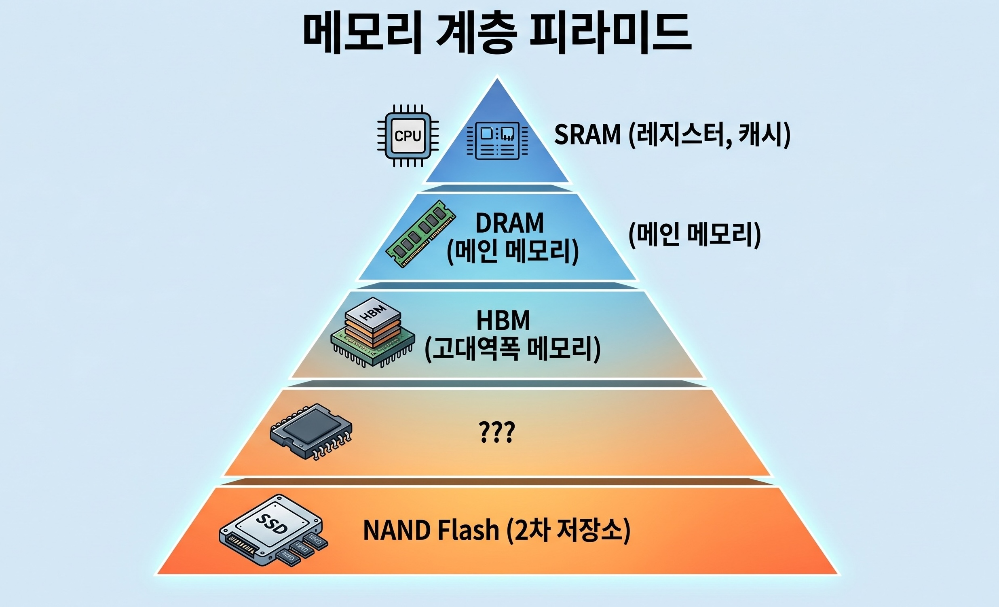
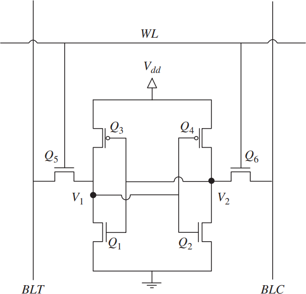
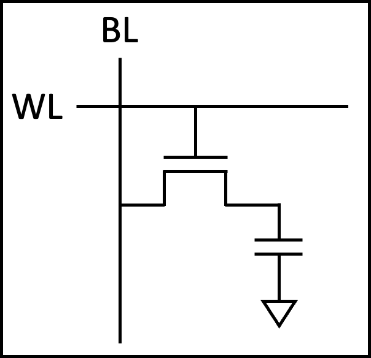
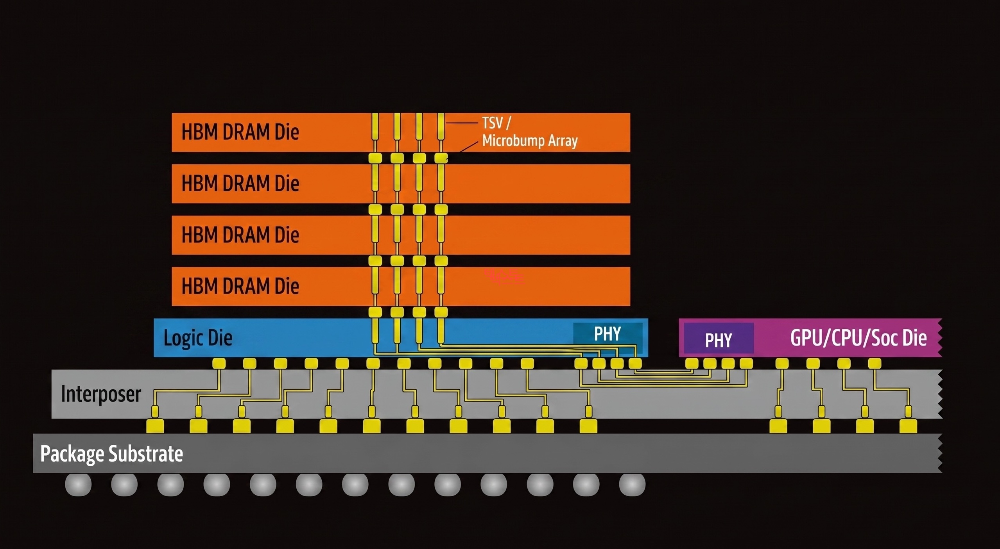
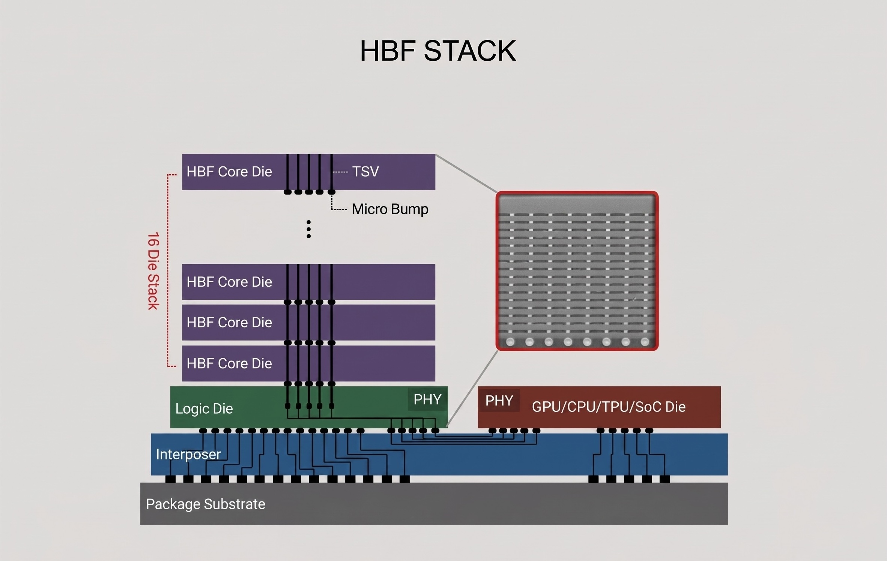

> This is Part 1 of the **Understanding Memory: Essential Commodity of the AI Era** series.
> Part 1: Understanding the Memory Hierarchy (this post)
> Part 2: The Memory Wall and Industry Response (coming soon)
> Part 3: The Inference Era — Synergy Between HBF and LPU (coming soon)

## Introduction

Hello, I'm Seungbin Shin, an RTL Designer at HyperAccel.

Recently, "memory and semiconductor stocks" have been making headlines in the stock market.
Lately, a new term — "HBF" — has started popping up, and people are asking "What even is that?" and "So should I buy it?"

So what exactly is **High Bandwidth Flash (HBF)**?

To understand HBF, you first need to be able to answer one question:

**"Why do computers have so many different types of memory?"**

Inside our computers, there are memories with confusing names — SRAM, DRAM, HBM, SSD — organized into multiple layers.
They all "store data," so why not just use one type?

As you work through this question, you'll naturally see why HBF emerged and where it fits in.

The content of this post is based on my personal study and experience.
If you find any errors, please let me know in the comments.

---

## Why So Many Types of Memory — The Speed/Capacity/Cost Trilemma

The short answer: **fast memory is expensive and small, while cheap memory is slow and large.**

This isn't simply because technology hasn't advanced enough.
The physical structure of the memory cell itself determines this trade-off.
Build a cell with many transistors and it's fast but takes up a lot of area;
simplify the cell and it's slower but can store far more data in the same space.

Computers work around this physical limitation by stacking different types of memory in a **hierarchy**.
Faster, smaller memory sits closer to the processor, while slower, larger memory sits further away.

Now let's look at why each layer of memory has the characteristics it does, starting with the cell structure.

---

## SRAM — The Fastest, and the Most Expensive

### Cell Structure: 6 Transistors per Bit

**Static Random Access Memory (SRAM)** uses 6 transistors to store a single bit.
This is called a **6T SRAM cell**.

Four of the six transistors form two inverters whose outputs are cross-coupled to each other.
This structure creates a latch that maintains its state as long as power is supplied.
The remaining two transistors serve as pass gates for reading and writing to the cell.

### Why It's Fast

The reason SRAM is fast is straightforward.

Because the latch maintains its state on its own, **no refresh is needed.**
This is where the name "Static" comes from.
A read operation simply transfers the voltage state stored in the latch to the bitline, resulting in access latency of **under 1 ns**.

### Why It's Expensive

The problem is size.
With 6 transistors needed per bit, each cell occupies a large area.
This means fewer bits can be produced on the same silicon wafer, which translates to a **very high cost per bit**.

This makes using SRAM in large capacities physically and economically impractical.
It's deployed only in amounts of a few MB to tens of MB as **cache (L1/L2/L3)** inside CPUs and GPUs, or as **on-chip memory** in AI accelerators.

Fast but expensive, and small in capacity. That's why it sits right next to the processor, holding only the most frequently used data.

---

## DRAM — Cheap and Large, but Constantly Refreshing

### Cell Structure: 1 Transistor + 1 Capacitor

The cell structure of **Dynamic Random Access Memory (DRAM)** is dramatically different from SRAM.
It stores a single bit using just two components: one transistor and one capacitor.
This is called the **1T1C structure**.

If the capacitor is charged, it's a 1; if discharged, it's a 0.
The transistor acts as a switch to access the capacitor.

### Why It's Cheap

With only two components per cell, the **cell area is 1/4 to 1/6 that of SRAM**.
Far more bits can be produced on the same wafer, significantly lowering the cost per bit.
Thanks to this density advantage, DRAM is used as main memory in capacities of several GB to tens of GB.

### Why It's Slower (Relatively)

Over time, the charge stored in the capacitor gradually leaks away.
Before the data is lost, the charge must be periodically replenished through a **refresh** operation.
The name "Dynamic" comes from exactly this characteristic.

The read operation is also more complex than SRAM.
The capacitor's charge must be shared with the bitline (charge sharing) and then amplified by a sense amplifier.
Since the read process depletes the charge, the data must be rewritten (restored) immediately after reading.

These additional steps result in access latency of **10–100 ns**, more than 10x slower than SRAM.

### DDR: The Interface That Speeds Up DRAM

While DRAM cells themselves are slow, improving the **interface standard** for exchanging data with the outside world can increase effective transfer speeds.
That standard is **Double Data Rate (DDR)**.

Before DDR, SDRAM transferred data only on the rising edge of the clock.
DDR, as its name suggests, transfers data on **both the rising and falling edges**, doubling the throughput at the same clock speed.

Subsequent generations increased transfer speeds by deepening the prefetch depth.
Prefetch is a technique that retrieves multiple beats from a single internal memory access, making the external transfer rate faster than the internal clock.
DDR4 prefetches 8 bits at a time, while DDR5 prefetches 16 bits.
As a result, DDR5 delivers a maximum bandwidth of **approximately 50 GB/s** per module.

But there is a fundamental ceiling to this improvement.

---

## HBM — Stacking DRAM Up

### Breaking the Pin Limit Through Packaging

The data bus width of DDR is **64 bits** as of DDR5.
Because there's a physical limit to the number of pins connecting the processor to memory,
no matter how much you increase the clock, there's a ceiling on how much data can be transferred at once.

For workloads like AI that need to read massive amounts of data simultaneously, this bottleneck is critical.
**High Bandwidth Memory (HBM)** solves this problem not by changing the cell structure, but through **packaging**.

The core idea is simple:
stack DRAM dies vertically and place them right next to the processor on the same substrate.

### TSV: Vertical Wiring Through Silicon

Conventional DRAM modules connect to the processor through traces on a PCB.
HBM is different.
Tiny holes are drilled through the silicon die itself and filled with copper wiring, vertically connecting dies above and below.
This is the **Through-Silicon Via (TSV)** — a through-silicon electrode.

Thanks to TSV, multiple DRAM dies can be stacked into a single unit,
and because each die has independent data paths, the bus width can be dramatically widened.
As of HBM4, the data bus width is **2,048 bits** — **32x that of DDR5**.

### Interposer: Placing It Right Next to the Processor

HBM stacks are placed alongside a GPU or AI accelerator on a **silicon interposer**, an intermediate substrate.
The fine wiring inside the interposer connects HBM to the processor at a distance of just a few millimeters,
a dramatic reduction compared to conventional DDR modules traveling tens of centimeters through a PCB.

Shorter wiring = lower latency + lower power consumption + higher signal integrity.
This combination is what makes HBM's bandwidth possible.

### HBM by the Numbers

| Metric | DDR5 | HBM3E | HBM4 |
|--------|------|-------|------|
| Bus Width | 64-bit | 1024-bit | 2048-bit |
| Bandwidth per Stack | ~50 GB/s | ~1.2 TB/s | ~2 TB/s+ |
| Capacity per Stack | - | 24–36 GB | 36–48 GB |
| Distance to Processor | ~tens of cm (PCB) | ~mm (interposer) | ~mm (interposer) |

In April 2025, **Joint Electron Device Engineering Council (JEDEC)**, the semiconductor standards body, officially published the HBM4 standard, and mass production began in early 2026.
SK hynix unveiled the world's first 16-layer, 48 GB HBM4 stack,
and NVIDIA's next-generation GPU, Vera Rubin, targets a total of **384 GB and approximately 22 TB/s** of memory bandwidth with eight HBM4 stacks.

### HBM's Limitation: Fast, but Still Not Enough Capacity

While bandwidth and capacity have both grown significantly through HBM4, the fundamental constraints remain.

The cell itself is still DRAM (1T1C), so the limits on bit density haven't changed.
Combined with the challenges of TSV processing, interposer fabrication, yield management during die stacking, and heat dissipation,
**the cost per unit of capacity is very high.**

Even with a full complement of eight HBM4 stacks, the maximum is 384 GB.
Yet the parameter sizes of the latest **Large Language Models (LLMs)** range from hundreds of GB to several TB.
The rate at which models are growing outpaces HBM's ability to scale capacity.

---

## NAND Flash — Cheap and Large, but Far Too Slow

### Cell Structure: Trapping Charge to Store Bits

**NAND Flash** stores data using a fundamentally different principle from SRAM or DRAM.

At the heart of a NAND cell is a conductor surrounded by an insulating layer called a **floating gate**.
When a high voltage is applied, electrons are injected into the floating gate through quantum tunneling,
and the insulating layer prevents the electrons from escaping, **preserving data even when power is off**.
This is why NAND is a **non-volatile** memory.

### Why It's Cheap and Large: Extreme Density

NAND's density advantage comes from two factors.

First, **multi-level cells**.
By finely distinguishing the amount of charge stored in a single cell, multiple bits can be packed in.
**Triple-Level Cell (TLC)** stores 3 bits per cell, and **Quad-Level Cell (QLC)** stores 4 bits per cell.

The difference becomes even more dramatic when comparing areal bit density.
SRAM achieves roughly 0.04 Gb/mm², DRAM about 0.2–0.3 Gb/mm²,
while the latest 3D NAND reaches **approximately 5–15 Gb/mm²**.
That means over 100x more data than SRAM and over 20x more than DRAM in the same silicon area.

Second, **3D stacking**.
Modern NAND stacks cells vertically rather than laying them flat, reaching hundreds of layers.
Samsung's V-NAND and SanDisk's BiCS NAND are representative examples, with the latest products exceeding 200 layers.

Together, these two factors allow NAND to deliver TB-scale capacity at a very low cost per bit.

### Why It's Slow: Microseconds Just to Read

NAND's read operation involves measuring the threshold voltage of the transistor, which varies depending on the amount of charge in the floating gate.
In multi-level cells, multiple voltage levels must be precisely distinguished, adding time.

As a result, NAND's random read latency is **approximately 50–100 µs**.
Compared to DRAM's tens of nanoseconds and SRAM's sub-nanosecond latency, that's **over 1,000x slower**.

Writes are even slower, and overwriting data requires erasing an entire block first.
On top of that, there's a physical limit on the number of erase/write cycles (write endurance).

### Current Role in AI Servers

In today's AI servers, NAND (SSD) serves as **model storage** and **checkpoint storage**.
It holds trained model weights and loads them into HBM when needed — essentially a "warehouse."

But it's far too slow to directly feed data during computation.
The GPU ends up waiting for data longer than it takes to actually compute.

Ample capacity and low cost, but critically insufficient speed.
NAND has been trapped within this limitation.

---

## The Gap — Between HBM and SSD

Let's put the memory hierarchy we've covered so far into a single table.

| | SRAM | DRAM (DDR5) | HBM4 | ??? | NAND (SSD) |
|---|---|---|---|---|---|
| **Cell Structure** | 6T | 1T1C | 1T1C (TSV stacked) | | Floating gate |
| **Access Latency** | ~1 ns | ~10–100 ns | ~10–100 ns | | ~50–100 µs |
| **Bandwidth (stack/module)** | ~TB/s (on-chip) | ~50 GB/s | ~2 TB/s | | ~7 GB/s |
| **Capacity** | MB–tens of MB | GB–tens of GB | 36–48 GB | | TB-scale |
| **Cost per Bit** | Very high | Medium | High | | Very low |
| **Volatility** | Volatile | Volatile | Volatile | | Non-volatile |

One thing immediately stands out.

HBM4 maxes out at 48 GB per stack, or 384 GB with eight stacks.
SSD offers TB-scale capacity at low cost, but bandwidth is only around 7 GB/s.

**HBM has great bandwidth but limited capacity; SSD has ample capacity but is far too slow.**

Granted, HBM's capacity is relatively large at this point, but it falls short of what people expect.

Between the two, there is no memory that provides "TB-scale capacity at TB/s-level bandwidth."

With LLM parameters growing from hundreds of GB to several TB,
what if we could fill this gap?

---

## HBF — Dressing NAND in HBM's Clothes

### Core Idea: Familiar Cells, New Packaging

**High Bandwidth Flash (HBF)** is a new memory tier that keeps the NAND cell as-is while applying packaging technology proven in HBM.

Earlier, we saw how HBM revolutionized bandwidth without changing the DRAM cell — purely through TSV stacking and interposer placement.
HBF applies exactly the same strategy to NAND.

NAND dies are vertically stacked with TSV and placed on an interposer right next to a GPU or AI accelerator.
Just as HBM broke through DDR's pin-count limitation with packaging, HBF breaks through SSD's bandwidth limitation with packaging.

### CBA Architecture: Optimizing NAND for High Bandwidth

The technical core of HBF is the **CMOS Bonding Array (CBA)** architecture developed by SanDisk.

Conventional NAND accesses a single large memory array sequentially.
CBA divides this into **thousands of independent storage sub-arrays**.
Each sub-array has its own read/write channel and **operates in parallel simultaneously**,
extracting bandwidth levels that a single NAND die could never achieve on its own.

This is combined with SanDisk's **BiCS NAND** (3D vertical stacking NAND) technology.
BiCS NAND dies stacked hundreds of layers high are connected via TSV,
and CBA drives the sub-arrays across these dies simultaneously.

### HBF by the Numbers

| | HBM4 | HBF Gen 1 | HBF Gen 2 | HBF Gen 3 |
|---|---|---|---|---|
| **Read Bandwidth** | ~2 TB/s | 1.6 TB/s | >2 TB/s | >3.2 TB/s |
| **Stack Capacity** | 36–48 GB | 512 GB | 1 TB | 1.5 TB |
| **Access Latency** | ~10–100 ns | ~10 µs | - | - |
| **Cell Structure** | 1T1C DRAM | Floating gate NAND | Floating gate NAND | Floating gate NAND |

There's a number worth noting here.

HBF Gen 1's read bandwidth of 1.6 TB/s approaches that of HBM4.
Yet its capacity of 512 GB is **over 10x that of an HBM4 stack (48 GB).**
Providing **8–16x the capacity of HBM at similar bandwidth and similar cost** is HBF's core value proposition.

### Compatibility with HBM Controllers

Another strength of HBF is that its **physical interface (PHY) and pinout are compatible with HBM**.

Existing HBM controllers already built into AI accelerators can connect to HBF with no or minimal modifications.
Since there's no need to design a new memory controller from scratch, the adoption barrier is significantly lowered from an accelerator designer's perspective.

### HBF's Limitations: Not a Silver Bullet

HBF is a strong candidate for filling the gap, but its limitations are clear.

**Latency**: At approximately 10 µs, it's **roughly 100x slower** than HBM's tens to hundreds of nanoseconds.
Because the NAND cell's read mechanism is inherently slower than DRAM, packaging alone cannot fully close this gap.

**Write speed and endurance**: NAND's characteristically slow writes and limited erase/write cycles remain.
This makes HBF unsuitable for AI **training**, which requires frequent writes.

Conversely, for AI **inference** workloads — where pre-loaded model weights are read repeatedly — these limitations are much less of a concern.
This is exactly why HBF is attracting attention as "the memory for the AI inference era."

---

## Conclusion & Next Episode Preview

In this post, we explored why memory is divided into so many types and how each memory's cell structure determines the speed/capacity/cost trilemma.

Here's the summary:

- **SRAM**: 6T cell — the fastest, but the most expensive and smallest
- **DRAM**: 1T1C cell — density advantage makes it the main memory, but bandwidth is limited
- **HBM**: DRAM cells with TSV + interposer packaging — revolutionized bandwidth, but capacity scaling is difficult
- **NAND**: Extreme density and low cost, but too slow to directly participate in computation
- **HBF**: HBM packaging applied to NAND cells — a new tier filling the gap between HBM and SSD

But being able to fill the gap alone doesn't complete the story.

**Why is HBF needed right now?**
In the next installment, we'll cover the **Memory Wall** problem emerging as AI models grow exponentially,
and the technology competition among SK hynix, SanDisk, and Samsung Electronics.

---

## P.S.

I'm designing RTL at HyperAccel for the launch of an LLM acceleration ASIC chip.
Many of us are putting our heads together to find more efficient ways to maximize performance from the limited resource of memory bandwidth.
I hope this series helps us understand the flow of memory technology together and watch the changes ahead.

HyperAccel is a company that covers HW, SW, and AI, bringing together outstanding talent across all domains.
If you want to learn broadly and deeply while growing together, please apply to HyperAccel anytime!

**Careers**: https://hyperaccel.career.greetinghr.com/ko/guide

## Reference

- [SanDisk HBF Fact Sheet](https://documents.sandisk.com/content/dam/asset-library/en_us/assets/public/sandisk/collateral/company/Sandisk-HBF-Fact-Sheet.pdf)
- [Scaling the Memory Wall: Behind Sandisk's High Bandwidth Flash for AI Inferencing](https://www.sandisk.com/en-ua/company/newsroom/blogs/2025/scaling-beyond-the-wall-inside-sandisks-high-bandwidth-flash-for-ai)
- [SK hynix and Sandisk Begin Global Standardization of Next-Generation Memory 'HBF'](https://news.skhynix.com/sk-hynix-and-sandisk-begin-global-standardization-ofnext-generation-memory-hbf/)
- [SK Hynix Unveils AI Chip Architecture with HBF](https://www.trendforce.com/news/2026/02/12/news-sk-hynix-unveils-ai-chip-architecture-with-hbf-reportedly-boosts-performance-per-watt-by-up-to-2-69x/)
- [HBM VS HBF VS HBS: Building the Memory Hierarchy for AI](https://www.lovechip.com/blog/hbm-vs-hbf-vs-hbs)
- [High Bandwidth Flash: NAND's Bid for AI Memory](https://www.viksnewsletter.com/p/high-bandwidth-flash-nands-bid-for-ai)
- [HBF: A High-Bandwidth Flash New Star Breaking the "Memory Wall" for AI](https://www.oscoo.com/news/hbf-a-high-bandwidth-flash-new-star-breaking-the-memory-wall-for-ai/)
- [High Bandwidth Flash is years away despite its promise](https://blocksandfiles.com/2025/11/27/stacked-layers-of-stacked-layers-hbf-capacity-and-complexity/)
- [SK hynix and SanDisk announce new High Bandwidth Flash — Tom's Hardware](https://www.tomshardware.com/pc-components/ssds/sk-hynix-and-sandisk-announce-new-high-bandwidth-flash-speedy-hbf-standard-is-targeted-at-inference-ai-servers)
- [HBM roadmaps for Micron, Samsung, and SK hynix: To HBM4 and beyond](https://www.tomshardware.com/tech-industry/semiconductors/hbm-roadmaps-for-micron-samsung-and-sk-hynix-to-hbm4-and-beyond)
- [The State of HBM4 Chronicled at CES 2026](https://www.eetimes.com/the-state-of-hbm4-chronicled-at-ces-2026/)
