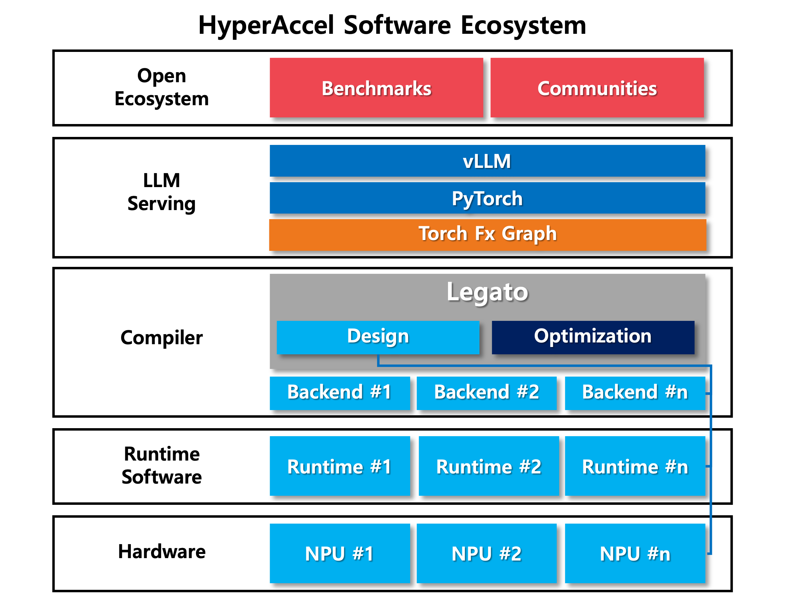
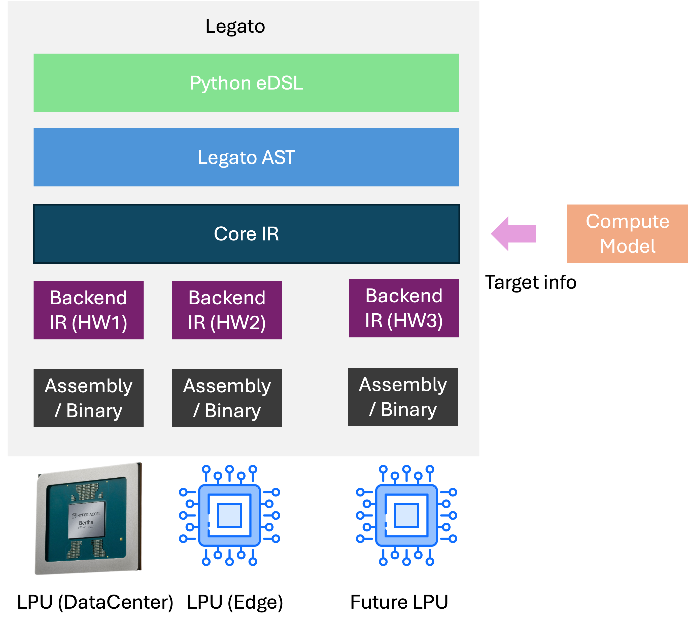

# Legato: LPU를 위한 프로그래밍 모델

> 본 글은 HyperAccel의 고객사 및 협력사 개발자를 대상으로, Legato가 무엇이며 무슨 역할을 하고, 왜 만들었으며, 어떻게 설계되었는지를 설명합니다.

---

## 1. Legato는 무엇이며 왜 필요한가?

### 1.1 소프트웨어 생태계가 승부를 가른다

AI 가속기 시장에서 NVIDIA가 가진 진정한 해자(moat)는 무엇일까요? 흔히 GPU의 연산 성능을 떠올리지만, 실제로 경쟁사와의 *하드웨어적* 격차는 생각보다 크지 않습니다. 트랜지스터 공정, 메모리 대역폭, 연산 유닛의 설계는 여러 회사가 빠르게 추격하고 있습니다.

차이를 만드는 것은 결국 **소프트웨어 생태계**입니다. 수많은 개발자가 CUDA 위에 쌓아 올린 라이브러리, 프레임워크, 노하우, 그리고 "어떤 모델이든 일단 NVIDIA에서는 돌아간다"는 신뢰가 진입 장벽을 만듭니다. 하드웨어가 아무리 뛰어나도, 그것을 자유롭고 익숙하게 다룰 수 있는 소프트웨어가 없다면 시장은 움직이지 않습니다.

### 1.2 HyperAccel의 LPU가 갖춰야 할 소프트웨어 경쟁력

HyperAccel의 LPU(LLM Processing Unit)가 이 경쟁에서 살아남으려면, 단순히 빠른 칩을 만드는 것을 넘어 두 가지 조건을 충족해야 합니다.

**첫째, 개발자가 사용하면서 위화감을 느껴서는 안 됩니다.** 새로운 하드웨어를 쓰기 위해 개발자가 자신의 워크플로를 통째로 갈아엎어야 한다면, 그 하드웨어는 외면받습니다. 현 시점 AI추론 시장에서 사실상 표준으로 취급받는  `torch`와 `vllm` 기반의 추론 스택 — 과 자연스럽게 호환되어야 합니다.

**둘째, 자유로운 모델을 지원할 수 있어야 합니다.** 회사 내부에서 일일이 포팅하고 관리하는 일부 모델만 돌아가는 가속기는 진정한 의미의 플랫폼이 아닙니다. 사용자가 가져오는 임의의 모델을 받아들일 수 있어야 합니다.

### 1.3 Legato의 역할

**Legato는 이 모든 것을 가능하게 하는, 하드웨어와 소프트웨어 개발자를 이어주는 인터페이스입니다.**

Legato는 하나의 프로그래밍 언어이자, 소프트웨어 개발자에게 **프로그래밍 모델**을 제공합니다. 프로그래밍 모델이란 *LPU가 소프트웨어 개발자에게 어떻게 보일 것인지*를 결정하는 약속입니다.

이 개념은 CUDA를 떠올리면 명확합니다. 우리는 NVIDIA 칩 내부의 모든 디테일을 알지 못합니다. 그러나 CUDA라는 프로그래밍 모델 하나만 익히면, 어느 세대의 칩이든 프로그래밍할 수 있습니다. CUDA가 칩의 복잡성을 가린 **간소화된 프로그래밍 모델**을 제공하기 때문입니다.

Legato도 마찬가지입니다. 개발자에게 LPU의 간소화된 프로그래밍 모델을 제공하여, 하드웨어의 세부 구현을 몰라도 LPU를 프로그래밍할 수 있게 합니다.


### 1.4 스택 안에서 Legato의 위치

Legato가 전체 추론 스택에서 어디에 위치하는지 보면 역할이 분명해집니다.




Legato는 위로는 기존 생태계(PyTorch/vLLM)와 맞물리고, 아래로는 LPU 하드웨어로 내려가는 다리 역할을 합니다. 위쪽 세계의 개발자는 익숙한 방식 그대로 코드를 작성하고, 아래쪽 세계의 복잡함은 Legato가 흡수합니다.

---

## 2. Legato 한눈에 보기 (Quick Look)

추상적인 설명보다 코드 한 조각이 더 빠르게 와닿습니다. 다음은 행렬 곱(matmul)을 LPU에서 수행하는 최소 예제입니다.

```python
import torch

import legato
import legato.model.bertha as bertha


# Compile target 을 설정합니다.
# 이 예시에서는 128GB의 메모리와 32코어를 갖춘 Bertha칩을 컴파일 타깃으로 설정합니다.
def get_bertha(ctx):
    gigabyte = 1024**3
    return bertha.Bertha(
        ctx,
        "bertha",
        32,              # num_cores
        False,           # use_pim
        8,               # num_memory_channels
        128 * gigabyte,  # shared_memory_size
    )

# legato.compile decorator는 이 함수를 더이상 Python 함수가 아닌 Legato 커널로 변환되어 컴파일됩니다.
# 이 함수 내에 구현되는 모든 코드는 더 이상 Python이 아닌 Legato 코드가 됩니다. (Triton이나 Mojo등과 같은 개념입니다)
@legato.compile(
    backend=get_bertha
)
def simple_matmul(
    a: legato.get_model().tensor_type(
        legato.types.float("bfloat16"), ((-1, 10), 256), "shared_dram"
    ),
    b: legato.get_model().tensor_type(
        legato.types.float("bfloat16"), [256, 128], "mpu_dram"
    ),
    out: legato.get_model().tensor_type(
        legato.types.float("bfloat16"), [10, 128], "shared_dram"
    )
):
    # backend에 제공된 device를 불러옵니다
    device = legato.get_context().get_device()

    # Bertha의 Top module 에서 실행되는 코드
    with device.get_top():
        # a, b 를 0번 코어의 sram 과 mpu_buffer로 복사합니다.
        legato.tensor.request_load(a, device.get_core(0), "sram")
        legato.tensor.request_load(b, device.get_core(0), "mpu_buffer")

    # Bertha의 0번 코어에서 실행되는 코드 영역
    with device.get_core(0):
        weight_type = legato.get_model().tensor_type(
            legato.types.float("bfloat16"), [256, 128], "mpu_weight"
        )
        
        # Top module에서 requiest_load를 통해 전달받은 data를 수신합니다.
        loaded_a = legato.tensor.receive(a, 0, "sram")
        loaded_b = legato.tensor.receive_type(weight_type, 0, None, "mpu_buffer")
        
        # 수신된 데이터로 Matmul 연산을 수행합니다
        result = loaded_a @ loaded_b
        
        # 연산 결과를 out tensor에 복사합니다.
        legato.tensor.memcpy(out, result)


output = torch.zeros(10, 128, dtype=torch.bfloat16)

# legato.session 을 통해 JIT 컴파일 옵션을 지정할 수 있습니다.
# simple_matmul 호출 시점에 JIT 컴파일되어 코드가 실행되며, 이미 컴파일된 바이너리가 있다면 코드가 변경되지 않은 이상 cache된 바이너리를 사용합니다.
with legato.session(output_type=legato.OutputType.BINARY, output_path="simple_matmul"):
    simple_matmul(
        torch.randn(10, 256, dtype=torch.bfloat16),
        torch.randn(256, 128, dtype=torch.bfloat16),
        output,
    )
```

이 짧은 코드에 Legato의 핵심 개념이 모두 담겨 있습니다.

- **`@legato.compile`** — 컴파일 대상이 되는 진입점(entry point)을 정의합니다.
- **`with device.get_top()` / `with device.get_core(0)`** — 각 연산이 *어디서 실행될지*(실행 컨텍스트)를 명시합니다.
- **`request_load` → `receive`** — 데이터가 *언제, 어디로 이동하는지*를 명시합니다.
- **`legato.session(...)`** — 컴파일 결과물(여기서는 `BINARY`)을 어떤 형태로, 어디에 만들지 결정합니다.

---

## 3. Legato의 프로그래밍 모델 (핵심 설계 개념)

Legato 설계의 심장은 **프로그래밍 모델**입니다. 즉, "개발자 눈에 LPU가 어떻게 보이는가"입니다.

### 3.1 단순화된 가상 하드웨어 모델

중요한 전제가 하나 있습니다. **개발자에게 보여지는 하드웨어 모델은, 실제 하드웨어 구조와 의도적으로 다릅니다.** Legato는 복잡한 물리적 디테일을 숨기고, 프로그래머가 이해하기 쉬운 단순화된 가상의 하드웨어를 제시합니다.

이 가상 하드웨어는 대략 다음과 같이 구성됩니다.

- **DRAM + Controller** — 모든 코어가 접근할 수 있는 Shared DRAM. 실제로는 8개의 메모리 칩이지만, 프로그래밍 모델에서는 하나의 큰 메모리로 간주합니다.
- **Virtual DRAM** — Shared DRAM처럼 모든 코어가 공유하되, MMU를 통해 접근하는 영역. MMU는 미리 구성되어 있다고 가정합니다.
- **PIM (Processing-in-Memory)** — 필요에 따라 선택적으로 사용합니다.
- **Core** — 코어의 개수는 구성 가능합니다(32개보다 많거나 적을 수 있음). 각 코어는 PC와 레지스터, 여러 실행 유닛(MPU, VPU 등 Executor), 온칩 SRAM(Cache), 그리고 코어가 사적으로 쓰는 Private DRAM을 가집니다.

### 3.2 메모리 모델

메모리도 소프트웨어 관점에서 세 가지로 단순화됩니다.

1. **Shared Memory** — 모든 코어가 공유하는 공간. Bertha에서는 DRAM에 해당합니다.
2. **Virtual Shared Memory** — MMU가 관리하는 공유 공간.
3. **Core Memory** — Private DRAM과 SRAM을 합친 코어 전용 공간.

여기서 중요한 설계 결정이 드러납니다. 프로그래머가 Core Memory에 데이터를 할당하면, **그것이 SRAM에 놓일지 Private DRAM에 놓일지는 컴파일러의 planning이 결정합니다.** 개발자는 "이 코어의 메모리"라는 추상적 위치만 다루고, 물리적 배치의 최적화는 컴파일러에 위임합니다.

### 3.3 실행 컨텍스트(Executor)와 명시적 데이터 이동

Legato의 연산은 항상 어떤 **실행 컨텍스트** 아래에서 발생합니다. 컨텍스트는 다음 연산이 어디서 실행될지를 나타냅니다.

```python
device = legato.get_context().get_device()

with device.get_top():
    legato.tensor.request_load(input_data, device.get_core(0), "sram")

with device.get_core(0):
    loaded = legato.tensor.receive(input_data, 0, "sram")
    result = loaded + loaded
```

- `device.get_top()` — 오케스트레이션과 top 측 로드 요청에 사용합니다.
- `device.get_core(i)` — 특정 코어 하나에서 실행합니다.
- `device.get_all_cores()` — 모든 코어에서 해당 영역을 실행합니다.

LPU는 모듈마다 PC(Program Counter)가 별도로 동작하는 특성이 있습니다. Legato는 이를 ContextOp으로 실행 컨텍스트를 분리하여 자연스럽게 표현합니다.

또한 데이터 이동은 **암묵적이지 않고 명시적**입니다. `request_load`로 소스 컨텍스트에서 로드를 요청하고, `receive`(또는 `receive_type`)로 타깃 컨텍스트에서 데이터를 받습니다. 어떤 데이터가 언제 어디로 움직이는지가 코드에 그대로 드러납니다.

한 가지 규칙이 있습니다. Legato의 스코프는 Python 스코프보다 엄격합니다. 한 영역에서 만든 값을 다음 영역에서 써야 한다면, `yield`로 명시적으로 넘겨주어야 합니다.

```python
with device.get_core(0):
    q = loaded @ weight
    yield q

with device.get_core(0):
    legato.tensor.memcpy(output, q)
```

### 3.4 세대 호환성 (Forward Compatibility)

이 단순화된 프로그래밍 모델이 주는 가장 큰 보상은 **세대 호환성**입니다.

미래의 LPU가 이 프로그래밍 모델과 호환되는 구조를 유지하는 한, 한 번 작성한 프로그램은 **코드 수정 없이** 다음 세대 하드웨어에서도 실행됩니다. CUDA로 짠 코드가 새 GPU 세대에서도 돌아가는 것과 정확히 같은 약속입니다. "하드웨어가 진화해도 코드는 그대로"라는 약속의 근거가 바로 이 프로그래밍 모델의 안정성입니다.

---

## 4. Legato의 설계 철학

### 4.1 Python embedded DSL

Legato는 Python에 내장된 DSL(Domain Specific Language)로 설계되었습니다. 이는 의도적인 선택입니다. 별도의 복잡한 툴체인 설치 없이 `pip install` 한 번으로 파이썬 환경에서 바로 사용할 수 있어, 진입 장벽을 최대한 낮춥니다. 개발자는 이미 익숙한 파이썬 문법(`with`, 함수, 데코레이터) 안에서 LPU 프로그래밍을 시작합니다.

### 4.2 PyTorch 친화적 텐서 추상화

Legato의 연산은 프로그래머에게 익숙한 **tensor**를 기반으로 동작합니다. broadcast, reshape, matmul 등 PyTorch나 NumPy에서 쓰던 것과 유사한 operation들을 제공합니다.

그 이외에 성능 튜닝이 용이하도록 synchronization (동기화), Metaprogramming (static evaluation) 등 고급 프로그래밍 기능들도 지원합니다.

각 라이브러리 operation의 의미(semantic)는 LPU 세대가 진화하더라도 코드 변경 없이 쓸 수 있도록 범용적으로 설계되었습니다. 즉, API는 안정적으로 유지되고, 그 아래에서 세대별 최적 구현으로 컴파일됩니다.

### 4.3 명시적 제어 vs 자동화의 트레이드오프

Legato는 실행 위치, 데이터 이동, 컴파일타임 파라미터를 개발자가 **명시적으로** 기술하는, 비교적 로우레벨의 인터페이스입니다. 언뜻 번거로워 보일 수 있지만 이는 의도된 설계입니다. 알고리즘의 데이터 흐름을 명시적으로 표현해야 하는 커널 — 즉 성능이 곧 가치인 코드 — 에서는 이 명시성이 곧 제어력이 됩니다.

동시에 Legato는 자동화 경로도 제공합니다. 따라서 사용자는 상황에 따라 선택할 수 있습니다.

- **완전 자동** — `torch.compile` 백엔드로 모델 전체를 맡긴다.
- **완전 수동** — 핵심 커널을 직접 작성해 세밀하게 튜닝한다.

### 4.4 용이한 확장성

**PyTorch 에서 Legato를 활용하는 방법** 

Legato는 torch의 backend operation을 구현하여 LPU가 torch와 호환되도록 합니다. 이는 Triton이 GPU 연산을 구현하여 torch를 떠받치는 것과 같은 개념입니다. 구체적으로는 다음 흐름을 따릅니다.

1. 지원하려는 PyTorch 연산에 대해 Legato 함수를 구현합니다.
2. 하나의 연산에 여러 구현(예: float32용/bfloat16용)이 있을 수 있으므로, **resolver** 함수가 적절한 구현을 골라 컴파일러에 돌려줍니다.
3. 구현된 모듈을 임포트하거나 `legato-library` 엔트리포인트로 노출합니다.

```python
import torch

@torch.compile(backend="legato", options={"legato.device": "bertha"})
def model(x, y):
    ...
```

**부분 컴파일(Mixed Execution).** 모든 연산이 LPU로 내려갈 수 있는 것은 아닙니다. Legato는 모든 그래프를 `LegatoGraphWrapper`로 감싸, 컴파일 가능한 노드는 Legato 커널로 묶어 내리고, 지원되지 않는 노드는 eager extern으로 실행합니다. resolver가 없거나 특정 dtype/shape 조합에서 `AssertionError`를 던지면 그 노드는 extern fallback 후보가 됩니다. 덕분에 커스텀 연산이나 미지원 ATen 연산이 섞인 모델도 즉시 실패하지 않고, 컴파일 가능한 영역은 그대로 가속됩니다.

**플랫폼 무관 확장.** torch에 국한되지 않습니다. NumPy, CuPy 등 다른 플랫폼으로도 자유롭게 확장 가능합니다. Backend만 Legato로 적절히 구현하면 확장성에 본질적 한계가 없습니다.

**단독 사용.** Legato는 그 자체로도 충분히 사용 가능합니다. NVIDIA GPU에서 프로그램을 실행하기 위해 CUDA나 Triton만으로도 충분한 것과 같은 개념으로, 상위 프레임워크 없이 Legato만으로 LPU 프로그램을 작성하고 빌드할 수 있습니다.

---

## 5. Legato의 내부 구조

### 5.1 컴파일 파이프라인

Legato 프로그램은 다음 단계를 거쳐 하드웨어 산출물로 변환됩니다.



- **Frontend** — 사용자에게 보여지는 표면을 정의합니다. 파이썬으로 작성된 Legato 코드를 받아 MLIR 기반의 Legato IR로 변환합니다.
- **Core IR / Backend IR** — 여러 lowering 패스를 거치며 점점 하드웨어에 가까운 형태로 내려갑니다.
- **Artifact** — 최종적으로 Assembly 또는 Binary가 생성됩니다.

### 5.2 ComputeModel — 하드웨어 정보를 주입하는 단위

파이프라인 전반에는 **ComputeModel**이 결합되어, 각 하드웨어의 정보를 컴파일러에 제공합니다.

ComputeModel은 하드웨어의 정보를 담은 간소화된 모델로, lowering이나 최적화 결정에서 핵심 역할을 합니다. **ComputeModel을 교체하는 것만으로 하드웨어 타깃을 전환할 수 있습니다.** 예제에서 보았던 `get_bertha`처럼, backend 팩토리가 ComputeModel 인스턴스를 만들어 컴파일러에 넘겨줍니다.

ComputeModel은 단순한 정보 제공을 넘어 검증의 기준이 됩니다. 특정 하드웨어에서 실행이 불가능하거나 비효율적인 연산을 사용자가 작성하면, 컴파일러는 가능한 변환을 시도하거나, 그것이 어렵다면 사용자에게 적합한 에러 메시지를 띄워 안내합니다.

### 5.3 하드웨어별 Backend

Compiler backend는 각 하드웨어마다 별도로 만들어져, 그 하드웨어에 특화된(HW-specific) 변환을 수행합니다. 새로운 LPU를 지원하려면 해당 하드웨어용 backend와 ComputeModel을 구현하면 되며, 상위의 프로그래밍 모델과 사용자 코드는 그대로 재사용됩니다.

### 5.4 출력 타깃 — 투명성과 디버깅

Legato는 컴파일의 어느 단계에서든 산출물을 뽑아볼 수 있습니다. `legato.session`의 `output_type`으로 다음 중 하나를 선택합니다.

| Output Type  | 설명                       |
| ------------ | -------------------------- |
| `MLIR`       | 초기 Legato IR (MLIR 형태) |
| `CORE_IR`    | Core IR 단계               |
| `BACKEND_IR` | Backend IR 단계            |
| `ASM`        | 어셈블리                   |
| `BINARY`     | 최종 실행 바이너리         |

```python
with legato.session(output_type=legato.OutputType.MLIR, output_path="test-output"):
    kernel(*args)
```

각 단계의 IR을 직접 확인할 수 있다는 것은, 컴파일 과정이 블랙박스가 아니라는 뜻입니다. 문제가 생겼을 때 어느 단계에서 어떻게 변환되었는지 추적할 수 있어, 디버깅과 검증이 투명합니다.

### 5.5 ELF Binary

최종 출력은 ELF binary로 생성됩니다. 이 바이너리는 단순한 명령어 덩어리가 아니라, 하드웨어 정보, 컴파일러 정보, checksum 등 다양한 메타데이터를 함께 담습니다. 런타임은 실행 시 이 정보를 읽어, 해당 바이너리가 지금 이 하드웨어/환경에서 실행하기에 적합한지 검증합니다. 잘못된 바이너리를 잘못된 하드웨어에서 실행하는 사고를 사전에 차단합니다.

---

## 6. 견고성과 검증 (신뢰 신호)

플랫폼을 도입하는 입장에서 가장 중요한 질문은 "이것을 믿고 프로덕션에 올릴 수 있는가"입니다. Legato는 여러 층위의 검증으로 이에 답합니다.

### 6.1 ComputeModel 기반 검증

앞서 본 것처럼, 사용자가 특정 하드웨어에서 불가능하거나 비효율적인 연산을 작성하면 컴파일러는 자동 변환을 시도하고, 불가능하면 **무엇이 왜 안 되는지** 알려주는 actionable한 에러 메시지를 제공합니다. 조용히 잘못된 결과를 내는 대신, 컴파일 시점에 문제를 드러냅니다.

### 6.2 타입 · 레이아웃 · 동적 shape 검증

Legato는 텐서의 타입과 메모리 레이아웃을 함수 시그니처에서 검증합니다. 특히 동적 차원(dynamic dimension)은 반드시 상한(upper bound)을 가져야 합니다.

```python
x = torch.zeros(16, 32, 32)
torch._dynamo.mark_dynamic(x, 0, max=128)  # dim 0은 동적, 상한 128
```

하드웨어 제약상 텐서가 완전히 동적일 수는 없습니다. 모든 동적 차원은 버퍼 할당과 명령 생성을 위한 상한을 가져야 하며, 상한이 없는 동적 차원은 컴파일 시점에 거부됩니다. 이는 입력이 커질 때마다 조용히 재컴파일되는 사고를 막기 위한 안전장치입니다.

### 6.3 Host-Device ABI (Instruction Table)

호스트와 디바이스 경계에서 인자를 정확히 주고받기 위해, Legato는 **Instruction Table**이라는 바이너리 ABI를 정의합니다. 64-bit 정렬 규칙을 엄격히 따르며, 스칼라/텐서/튜플 인자를 정해진 규약에 맞춰 패킹합니다. 최대 테이블 크기를 함수 시그니처로부터 컴파일 타임에 계산할 수 있어, 런타임의 인자 전달이 예측 가능하고 안전합니다.

---


# Q. 그럼 LPU를 쓰려면 Legato를 다 공부해야 하나요?

아니오. 물론 그럴 필요는 없습니다. GPU를 쓰는 모든 AI 개발자들이 모두 Cuda, OpenCL, Vulkan같은 것을 알고 있진 않지요? HyperAccel LPU도 마찬가지입니다.


__Legato는 torch 혹은 여러 library의 backend를 구현하는데 쓰이며, AI 개발자에게 항상 직접적으로 들어나지는 않습니다__. `torch` 나 `numpy` 등을 LPU에서 사용할 때, 개발자는 평소에 CPU나 GPU에서 하던 것처럼 사용할 수 있습니다. 하지만, 내부적인 연산들은 Legato로 구현됩니다.

__하지만, custom kernel이나 성능 최적화를 극한까지 하고 싶다면, Legato를 직접 사용할 수 있습니다__. GPU프로그래밍을 할 때도 성능을 끌어올리거나 이전에 구현되지 않은 연산을 만들고 싶다면 `torch`에 이미 구현된 것을 사용하는 대신 Triton 혹은 Cuda 등을 이용해서 custom kernel을 만들어 사용하는 경우가 있지요? LPU도 마찬가지입니다.  Legato는 언제든지 사용자가 직접 사용할 수 있도록 열려 있으며, 원한다면 `torch` 로 구현된 모델 중간에 Legato로 직접 구현한 layer를 끼워 넣을 수도 있습니다. 아래처럼요.

```python
@legato.compile(backend=bertha)
def custom_kernel(input: legato.get_model().tensor_type(
        legato.types.float("bfloat16"), ((-1, 10), 256), "shared_dram"
    ),
    output: legato.get_model().tensor_type(
        legato.types.float("bfloat16"), [256, 128], "shared_dram"
    )):
    # Some implementation...
    
    
c = torch.add(a, b)
out = torch.zeros(256, 128)

# Call legato kernel
custom_kernel(c, out)
print(f"output from legato kernel : {out}")

# Keep going with torch
out_exp = torch.exp(out)

```


## 7. 정리 및 다음 단계

### 7.1 요약

Legato는 LPU의 **단순화된 프로그래밍 모델**을 제공하여, 세 가지를 동시에 달성하는 인터페이스입니다.

- **생태계 호환성** — `torch`/`vllm` 등 기존 소프트웨어 스택과 자연스럽게 맞물립니다.
- **세대 호환성** — 프로그래밍 모델이 유지되는 한, 코드 수정 없이 미래 LPU에서 실행됩니다.
- **확장성** — backend와 ComputeModel만 구현하면 새로운 하드웨어와 플랫폼으로 확장됩니다.

CUDA가 NVIDIA 생태계를 떠받치듯, Legato는 HyperAccel LPU 생태계의 토대입니다.

### 7.2 지원 타깃과 로드맵

현재 Legato는 Bertha 아키텍처를 타깃으로 합니다(EVT0, EVT1 등 세대별 가이드 제공). ComputeModel 교체를 통한 타깃 전환 구조 덕분에, 향후 LPU 세대로의 확장이 설계 차원에서 준비되어 있습니다.

### 7.3 시작하기 / 더 읽을거리

- 공식 문서: `legato/Documentation` (Programming Model, Decorators, Context Management, Memory Operations 등)
  - 현 시점 아직 public하게 공개되어 있지는 않습니다.
- 예제: `simple_matmul`, `static_multi_core`, `attention` 등
  - 마찬가지로, 아직 public하게 공개되어 있지 않습니다.
- PyTorch 통합 가이드: `torch.compile(backend="legato")` 사용법과 primitive/resolver 작성법
