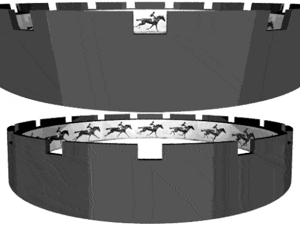
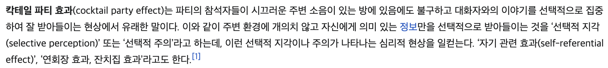

# SDD, 일의 의미가 변하는 시대에 적응하기 위하여

## 목차

- [들어가며](#들어가며)
- [SDD? BDD, TDD, RDD와는 무엇이 다른가?](#sdd-bdd-tdd-rdd와는-무엇이-다른가)
- [알아보기도 전에 끝나버린 바이브 코딩의 시대, 다시 돌아온 엔지니어링](#알아보기도-전에-끝나버린-바이브-코딩의-시대-다시-돌아온-엔지니어링)
- [LLM 맛보기: Context Window와 Attention이란?](#llm-맛보기-context-window와-attention이란)
    - [Context Window: 창문을 통해 보는 영화](#context-window-창문을-통해-보는-영화)
    - [Attention Mechanism: 칵테일 파티 효과](#attention-mechanism-칵테일-파티-효과)
- [왜 SDD인가: 채팅 기반 코딩의 구조적 한계와 붕괴](#왜-sdd인가-채팅-기반-코딩의-구조적-한계와-붕괴)
- [SDD 워크플로우의 등장과 표준화](#sdd-워크플로우의-등장과-표준화)
- [SDD를 위한 차세대 도구들](#sdd를-위한-차세대-도구들)
- [결론: 우리는 어디로 가야하는가?](#결론-우리는-어디로-가야하는가)
- [추신](#추신)
- [Reference](#reference)

## 들어가며

안녕하세요, 저는 HyperAccel에서 RTL Designer로 재직중인 신승빈입니다.

저는 일을 잘 하고 싶지만, 그렇다고 시간을 필요 이상으로 투자해서 그 목표를 달성하고 싶지는 않습니다. 

즉 "어떻게 하면 일의 가성비를 더 높일지" 항상 궁리하고 있습니다. 동일 시간동안 업무 퀄리티는 높이고 더 많은 일을 하면 저에게나 회사에게나 이득이니까요.

2025년은 23년, 24년보다 더 활발했던 생성형 AI의 개발, 발전과 함께 소프트웨어 개발 업계는 이 글을 읽는 많은 분들께서 체감하실 정도로 그 형태가 많이 바뀐 한 해였다고 생각합니다.

소프트웨어 개발 관련 지식이 전무한 **하드웨어쟁이**인 저도 몇 번의 대화를 거치면 제가 원하는 형태의 앱을 만들 수 있게 되었고, 홈페이지도 뚝딱하고 만들 수 있었죠.

하지만 앱에 제가 원하는 기능을 하나씩 더 추가하고, 디자인도 보기 좋게 수정하려고 몇 번의 대화를 거치면 이전에 해결했던 버그가 새로 등장하거나, 버튼을 자기 마음대로 배치하는 등 엉뚱한 행동을 하기 십상이었습니다.

결국 "제가 원하는 형태의 무언가"에는 도달할 수 있었지만, 2%, 아니 10%정도 부족한 수준에서 더 개선하기 어렵고 saturate되는 상황을 많이 직면할 수 있었습니다.

이런 상황이 발생했을 경우 저는 해당 언어의 전문가가 아니기 때문에 그 코드셋을 바탕으로 수정할 수도 없었고, 만약 전문가였다고 해도 여러 번의 대화로 인해 뒤엉켜버린 스파게티 코드를 이해하기엔 시간이 많이 소요되었을 것입니다.

저 혼자서는 그런대로 타협해서 쓸 수 있었지만, 이걸 실제로 사람들에게 서비스한다거나 판매한다고 생각하면 절대 관리할 수 없을 것이라고 생각했고, 결국 이런 형태의 개발은 한계가 명확하다고 느꼈습니다.

물론 제가 전문가가 아니기 떄문에 발생한 문제일 수 있지만, 오히려 전문가에게도 이런 형태의 업무 프로세스는 코드 리뷰의, 리팩토링, 룰 준수, 테스트 생성 등의 과정이 더 많은 시간을 잡아먹고 결론적으로는 생산성 향상이 아닌 하락으로 이어질 수 있는 가능성이 훨씬 높을 것입니다. 

실제로 내가 많은 일을 하고 있는 것 처럼 보이지만,  쓸데없는 코드를 많이 생산하고, 유지보수에 많은 시간을 쏟고있는 것일 뿐, 시간 대비 생산하는 가치는 더 낮아질 수 있는 것이죠. 

이 글을 읽고 계신 분들 중에서도 이런 경험을 하신 분들이 적지 않을 것이라고 생각합니다.

이런 악순환을 피하고, 최대한 효율적이면서도 빠르게, 양질의 토큰을 LLM들로부터 뽑아내서 저희가 원하는 결과물을 얻기 위한 방법론, SDD에 대해서 함께 알아봅시다.

이 포스팅의 내용은 제가 개인적으로 공부하고, 경험한 내용을 바탕으로 작성되었습니다. 오류가 있다면 언제든지 댓글로 알려주세요.

---

## SDD? BDD, TDD, RDD와는 무엇이 다른가?

과거에, 어쩌면 지금도 여전히 많은 개발자들은 사람들끼리 업무를 할 때 과정과 품질을 높이면서도 협업 효율을 높이기 위해서 다양한 방법론을 사용하고 있습니다. 대중적인 방법론 몇 가지를 소개해 드리겠습니다.

### BDD(Behavior-Driven Development)
BDD(Behavior-Driven Development)는 사용자의 행위(Behavior)를 자연어로 정의한 시나리오를 먼저 쓰고, 이를 테스트 코드로 변환하여 개발하는 방법론입니다. 예를 들면 "로그인 기능 구현" 이라고 하지 않고, "사용자는 아이디를 입력하고, 비밀번호를 입력한다. 이후 로그인 버튼을 클릭하면 비밀번호를 확인하고, 맞으면 메인 페이지로 이동하고, 틀리면 에러 메시지를 보여주고 메인 페이지로 이동하지 않는다." 와 같이 구체적인 사용자의 행위를 기반으로 한 요구사항 명세서를 작성하는 것이지요.

### TDD(Test-Driven Development)
TDD(Test-Driven Development)는 최소한의 테스트부터 작성하고, 이를 통과하는 코드를 작성하며 끊임없이 리팩토링하며 개발하는 방법론입니다. 마찬가지로 로그인 기능을 구현해야 했다면, "아이디가 비어있을 때 false를 뱉는 함수", "비밀번호가 틀리면 예외처리를 하는 함수" 부터 시작하여 점차 복잡한 기능을 구현해 나가는 방향으로 개발이 진행됩니다.

### RDD(README Driven Developement)
RDD(README Driven Developement)는 코드를 짜기 전에, 소프트웨어 설명서를 가장 완벽하게 작성하고, 사용자가 어떻게 설치하고 사용할지를 상상하며 개발합니다. 특히 오픈소스 프로젝트에서 중요한데, 이 기능을 가져다 쓸 다른 개발자를 위한 안내서를 쓴 다음에 구현이 이루어진다는 점이 포인트입니다.

앞서 설명한 3가지 방법론과, SDD(Spec-Driven Development)의 가장 큰 차이점은 "누구를 위한 약속인가"에 있습니다. 

기본적으로 지금까지의 방법론들은 "내가"혹은 "우리 팀이" 일을 잘 하기 위한 도구였습니다. 문서를 작성하다 보면 기업의 문화나 내부적인 성격이 녹아들어 다른 팀이 이해하기 어려운 경우가 발생할 수도 있죠. 하지만 애초에 내부 품질 향상을 위한 목적을 가지고 있기 때문에, 큰 문제가 되지 않습니다.

이제 저희는 사람들과 한 코드를 가지고 씨름하는 시간보다도, LLM과 대화하며 결과물을 만들어내는 시간이 훨씬 많아졌습니다. 그런데 cursor나 antigravity와 같은 코딩 IDE 속에서도 코드 생성 모델을 바꾸기도 하고, 다른 세션에서 시작하기도 하고, 간혹 코드를 긁어서 다른 웹페이지의 모델에게 질문하기도 하죠. 이럴 때마다 **확률형 생성 모델**인 LLM은 조금씩 다른 결과물을 만들어 낼 수 밖에 없습니다. 그리고 가장 큰 문제는, LLM은 "기업 문화"라는 것에 관심이 없죠. 우리의 개발 환경과 스타일에 대한 "맥락 이해" 자체가 부족합니다.

SDD는 "나"와 "LLM(AI Agent)" 사이의 엄격한 약속입니다. 그 어떤 모델이 오더라도 반드시 따라야 하는 룰로써 작동하고, 생성된 코드들의 연결과 호환성을 보장하는 역할을 합니다. 기존에 LLM을 마법 지팡이처럼 다루던 시대는 금세 지나가고, 이제는 LLM을 잘 다루기 위한 방법론이 필요한 시대가 온 것입니다. 물론 SDD가 만능은 아닙니다. 하지만 적어도 하나의 문서를 가지고 지속적으로 검증을 거치고, 최대한 원하는 형태에 가까운 결과물을 얻을 수 있다는 점에서 생산성 향상에 직접적인 도움을 주는 것이죠.

간단하게 SDD가 어떤 느낌인지에 대해서 알아보았는데요, 그렇다고 TDD는 이제 죽은 방법론이고, SDD만 쓰면 되는 것일까요? 그렇지 않습니다. SDD는 TDD를 대체하는 방법론이 아니라, LLM을 더 효율적으로 쓰면서, TDD가 채워주지 못하는 부분을 보완하는 방법론입니다. 

여전히 SDD가 왜 필요한지, 설명서를 읽고 코드를 생성한다는 것 같은데, 애초에 원론적으로 이것이 왜 필요한지 의문이 드실 수도 있습니다. 다음 섹션부터 SDD의 등장 배경부터 이론적인 부분들까지 더 자세히 알아보도록 하겠습니다.

---

## 알아보기도 전에 끝나버린 바이브 코딩의 시대, 다시 돌아온 엔지니어링

**"어? 이게 되네?"**

제가 학부생활을 하던 시절, 처음으로 Chat GPT 3에게 코드를 짜 달라고 했을 떄의 전율을 기억합니다. 

대충 말해도 찰떡같이 알아듣고 코드를 뱉어내는 경험은 정말 새로웠죠. 업계에서는 이걸 바이브 코딩(Vibe Coding)이라고 부르더라구요. AI와의 소통으로, 느낌(Vibe)만 가지고 결과물을 만들 수 있었으니까요. 

하지만 이 시기는 짧았습니다. 

앞서 제가 겪었던 것처럼, 프로젝트 규모가 조금만 커져도, 혹은 몇 번의 대화를 거칠수록 AI는 급속도로 멍청해지기 시작했습니다. 

변수명을 까먹고, 아까 고친 버그를 다시 만들어내고, 결국엔 "그냥 내가 짜고 말지"라는 생각이 들게 만드는 **수정의 늪-Doom Loop**에 빠지게 되죠. 

심지어 이미 뭔가 잘못됐다는 생각이 들었을 때는 코드가 너무 지저분하고 꼬여 있어 리팩토링을 한다거나, 수정한다는 것은 거의 불가능하기 일쑤였습니다.

바이브 코딩의 실패는 단순히 AI 모델의 성능 문제가 아닙니다. 

이건 확률론적 생성에 의존하는 LLM의 본질적인 한계와, 엔지니어링의 부재가 만났을 때 필연적으로 발생하는 사고였습니다. 

**이제 우리는 "마법"이 아니라 "공학"의 관점에서 AI를 바라봐야 할 때가 되었습니다.**

---

## LLM 맛보기: Context Window와 Attention이란?
왜 AI는 대화가 길어지면 멍청해질까요? 이걸 이해하려면 LLM의 두뇌 구조인 **Context Window**와 **Attention 메커니즘**을 이해해야 합니다.

### Context Window: 창문을 통해 보는 영화
LLM의 기억력은 무한하지 않습니다. 가끔 채팅 모델을 사용하다 보면 "이걸 까먹었다고?" 라는 생각이 들 때가 있으셨을겁니다.

이런 장난감을 보신 적 있나요? 저는 어릴 때 가지고 놀아 본 기억이 있는데요, 빙글빙글 돌리면 구멍을 통해서 말이 달리는 모습을 볼 수 있는, 잔상효과를 이용한 장난감입니다. 

LLM의 Context Window는 이 장난감의 구멍과 비슷하게 생각할 수 있습니다. 한번에 볼 수 있는 정보의 양이 제한적인 특징이 있죠. 

심지어 그 정보를 저장하는 메모리 또한 유한하기 때문에, 무한하게 늘릴 수도 없습니다. 결국 창 밖으로 벗어나버린 정보는 처리되지 않거나 잊혀지게 됩니다.

### Attention Mechanism: 칵테일 파티 효과
위에서 말한 창문이 정말 넓어져서 무한해졌다고 해도, 또 다른 문제가 있습니다. 바로 뭐가 중요한지 선택하기가 매우 어려워진다는 것입니다. 

우리는 친구가 열 명일때는 얼굴과 이름, 성격, 어쩌면 생년월일과 전화번호까지도 기억할 수 있습니다. 

게다가 열 명의 친구들은 모두 소중하죠. 하지만 친구가 만 명이 됐다면? 십만 명이 됐다면? 이름을 기억하는 것 조차 어려워집니다.

어텐션 메커니즘은 칵테일 파티 효과와 참 비슷합니다. 

소란스러운 대화 속에서 중요한 한 줄, 사용자가 진짜 원하는 것을 찾아내야 하기 때문입니다.

LLM도 수만 줄의 코드와 대화 로그에서 중요한 내용, 즉 핵심 요구 사항을 찾아내기 위한 수학적 메커니즘이 존재하는데요, 그것이 바로 Attention Mechanism입니다. 한 번쯤 들어보시거나 읽어보셨을 유명한 논문, "Attention is all you need"에서 제시한 개념이기도 하죠. 수학적인 설명은 생략하고, 전체를 다 기억하는 대신, 중요한 것만 골라보는 방법이라고 생각하시면 됩니다.

대화가 짧을 때는 AI가 정확히 중요한 구간을 찾아냅니다. 하지만 대화가 수백 턴 이어지면 파티장은 아수라장이 되고, AI는 느려지고, 틀리고, 엉뚱한 답을 내뱉게 되는 것입니다. 마치 우리 저 식당 갔었지? 라고 말하는 상황처럼요..

---

## 왜 SDD인가: 채팅 기반 코딩의 구조적 한계와 붕괴

이런 기술적 배경을 알고 나면, 왜 우리가 채팅창에서 코드를 짤 때 고통받았는지 명확해집니다.

중간 소실 (Lost in the Middle) 현상: 연구에 따르면 LLM은 텍스트의 처음과 끝은 잘 기억하지만, 중간에 있는 내용은 기가 막히게 잘 까먹습니다. 채팅 초반에 정의한 데이터 구조나 유틸리티 함수들이 대화 중반부에 묻혀버리면, AI는 엉뚱하게도 이미 있는 함수를 새로 만들거나(중복 코드), 엉뚱한 변수를 가져다 쓰기 시작합니다.   

어텐션 희석 (Attention Dilution): 대화가 길어질수록 AI가 정보 하나하나에 쏟을 수 있는 '집중력'이 줄어듭니다. 중요한 요구사항이 잡담이나 에러 로그 사이에 섞여 희석되어 버리는 것이죠. 단순히 "아니 그게 아니라" 라고 치는 행동이 저희의 LLM을 더 힘들게 만들고 있던 것이죠. 감정적으로나 메모리적으로나 말입니다...

둠 루프 (Doom Loop): 에러가 나서 로그를 주면, 보통은 AI가 수정 코드를 줍니다. 근데 똑같은 에러가 또 납니다. AI의 컨텍스트 윈도우가 '실패한 시도'와 '에러 로그'로 가득 차버려서, 정답을 찾기보다 오답 패턴을 학습해버린 상태가 되는 겁니다. 실제로 학습해서 평생 그 답을 내는 일은 드물겠지만, 적어도 정답도 아닌 오답으로 가득찬 창문에서는 질문을 찾는 것 조차 어려워질 것입니다.

결국 "채팅 로그를 스펙으로 삼는 것" 자체가 구조적으로 실패할 수밖에 없는 게임이었던 겁니다. 그래서 우리는 SDD로, **채팅을 최소화하고, 정제된 문서를 던져주는 방식**으로 전환해야 합니다. 채팅 로그는 최소화하고, 필요한 내용들을 문서로 정리하고, 문서를 바탕으로 AI가 코드를 작성하는 방식으로 전환해야 합니다.

---

## SDD 워크플로우의 등장과 표준화

SDD의 핵심은 간단합니다. **코드는 휘발적이고, 스펙은 영구적이다**라는 철학입니다. 코드는 스펙에서 언제든 다시 뽑아낼 수 있는 '부산물(Artifact)'로 취급하고, 우리가 관리해야 할 원본(Source of Truth)은 '자연어 명세서'가 됩니다. 특히 LLM 모델들의 성능이 기하급수적으로 좋아지면서, 오히려 "코드 품질"을 걱정하기 보다 내가 작성하는 "스펙 문서의 품질"을 더욱 중요하게 생각해야 합니다. 저에게 가장 부족한 문과적 소양이 다시 필요해지고 있는 것이죠...

일반적인 SDD 워크플로우는 다음과 같습니다.

Intent (의도 설정): "무엇을 만들고 싶은가?"를 정의합니다.

Spec Writing (명세 작성): AI와 대화하며 spec.md나 PRD.md 파일을 작성합니다. 여기에 기능, 데이터 모델, 제약 사항을 꽉 채워 넣습니다. 이 파일은 지속적으로 LLM이 참조하고, 상호 수정하고, 계속해서 업데이트되고 보존됩니다.

Generation (생성): "이 스펙대로 구현해"라고 명령합니다. AI는 스펙을 보고 구현 계획(Plan)을 세우고 코드를 짭니다. 이 부분은 특히 Antigravity가 잘 하는 것 같더라구요.

Verification (검증): 결과물이 이상한가요? 코드를 고치지 마세요. 스펙을 고치고 다시 생성하거나, 테스트를 위한 문서를 작성하세요.

이 과정은 마치 컴파일러에게 소스코드를 주고 실행 파일을 뽑는 것과 비슷합니다. 여기서 '소스코드'는 '자연어 스펙'이고, '컴파일러'는 'AI 에이전트'가 되는 셈이죠. 잠깐, 컴파일러가 무엇인지 궁금하신가요? 그렇다면 [이 글](https://hyper-accel.github.io/posts/crafting-compilers/)을 읽어보세요.

---

## SDD를 위한 차세대 도구들
SDD가 무엇이고, 왜 등장했고, 사용해야 될 것 같다는 생각은 드셨을 것 같습니다. 간단하게 SDD를 사용해보실 수 있는 코딩 IDE를 소개합니다. 다행히 2025년과 2026년을 기점으로 SDD를 지원하는 강력한 도구들이 많이 쏟아져 나오고 있습니다.

### Cursor & .cursorrules:
  가장 접근하기 쉬운 도구입니다. 프로젝트 최상단에 .cursorrules 파일을 만들면 어떤 모델이든지 실행될 때 마다 이 규칙을 참조하게 됩니다. 이 파일이 LLM에게는 일종의 prefix처럼 작동하는 것이죠. 저는 보통 RTL Design이나, C++ 코딩에 관련된 rule들을 세팅하고 사용했는데요, [example_cursorrules.txt](./example_cursorrules.txt)는 제가 실제로 사용했던 rule 파일입니다. 당시엔 잘 몰라서 https://cursorrules.org/category 사이트에서 찾아 붙여넣는 형태로 작성했습니다. 엄밀하게는 SDD 라기보단 전체적인 코드 생성 스타일을 통일하는 목적으로 사용할 수 있습니다. 넓은 의미의 Spec 정의인 것이죠.

### Google Antigravity
  구글이 내놓은 '에이전트 우선(Agent-First)' IDE입니다. 여기서는 AI가 단순히 코딩만 하는 게 아니라, 먼저 **Implementation Plan**이나 할 일 목록(Task List) 같은 문서를(Artifact) 먼저 만들어 결재를 받습니다. "코딩하기 전에 계획부터"라는 사수의 멘토링을 시스템화한 느낌이죠. 실제로 spec 문서를 작성하기가 어렵다면 이 implementation plan 문서를 바탕으로 시작해도 괜찮을 것 같습니다.

### Oh-My-OpenCode (OpenCode)
  오픈소스 진영의 반격입니다. oh-my-zsh처럼 플러그인 형태로 동작하는데, 재미있는 건 'Ultrawork' 모드입니다. "이거 될 때까지 집에 가지 마" 모드랄까요. 에러가 나면 AI 에이전트(Sisyphus)가 스스로 문서를 찾아보고, 디버깅하고, 재시도합니다. 특히 다양한 모델을 사용할 수 있고, 좀 더 "스스로 작동하는" 형태에 가까운 AI Agent를 엿볼 수 있다고 생각합니다. 제가 업무하는 형태와는 좀 방향이 달라서 저는 잘 사용하지 않지만, 최근에 굉장히 주목받고 있습니다.

이 모든 게 가능한 이유는 SGLang이나 Guidance 같은 기술들이 AI가 뱉는 결과물을 강제로 JSON이나 특정 포맷으로 고정해주기 때문입니다. 덕분에 AI의 환각을 억제하고, 시스템끼리 대화할 수 있는 구조가 만들어진 것이죠. SGLang에 대해서는 [이전 글](https://hyper-accel.github.io/posts/sglang-review/)에서 자세히 다루고 있으니, 궁금하신 분들은 참고해보시면 좋을 것 같습니다.

---

## 결론: 우리는 어디로 가야하는가?
SDD는 단순히 개발 방법론의 변화라기보단, 개발자의 정체성이 바뀌는 지점이 아닐까 생각하고 있습니다. 물론 전 일반적으로 **개발자**라고 불리우는 SW 개발자는 아니지만, HW 개발(RTL Design)에 있어서도 무언가 변하고 있다 내지는 가능성이 보인다고 체감하고 있습니다.

이제 코딩을 하는 우리 모두는 똑똑한 AI 인부들을 지휘하는 **작은 PM**로 변모해야 합니다. 

코드를 빨리 치는 능력보다, **모호한 생각을 명확한 글로 정리하는 능력**이 훨씬 중요한 시대가 다가올 것입니다. 

**공학을 하기 위해 문학을** 해야 하는 시대가 개화하고 있는 것이죠. 

게다가 대다수의 LLM들은 영어 입력에 대한 학습이 더 많이 이루어져 있기 떄문에, 영어로 문서를 작성하는 것이 더욱 좋은 결과를 가져올 것은 거의 당연해 보입니다.

혹자는 이를 두고 '1인 유니콘(1-Person Unicorn)' 기업이 탄생할 기반이 마련되었다고 합니다. 혼자서 기획, 디자인, 개발, 배포를 수십 명의 AI 에이전트에게 위임하며 운영하는 미래죠. 물론 바이브코딩만으로는 절대 달성할 수 없는 미래이고, 스펙 작성에 있어서도 너무 많은 문서작업이 수반되지 않으면서도 최고의 효율을, 내가 원하는 목적을 달성할 수 있도록 고민해야 합니다.

어쩌면 우리는 개발자로서 매우 중요한 시기를 지나고 있는지도 모릅니다. 인간과 AI가 함께 시스템을 만들어가는 새로운 프로토콜, 그 시작점에 SDD가 있습니다. 이 글을 읽으시는 분들은 지금 어떤 기능을, 서비스를 개발하고 계신가요? 마크다운 파일을 열고, 상상하고 계신 내용을 스펙으로 정의하는 순간, 새로운 엔지니어링이 시작될 것입니다.

---

## 추신

저는 "어떤 엔지니어로 성장해야 하는가?"에 대한 고민을 계속 이어나가고 있고, 그 과정에서 SDD를 알게 되었습니다. 개인적으로 SDD는 가까운 시일 내에 주류가 될 개발 방법론이며, 스펙 문서를 작성하는 능력 자체도 경쟁력이 될 수 있다고 생각합니다. 결국 언젠가 사람들은 이 스펙 문서의 작성조차 생성형 AI 모델에게 요청하겠지만, 그 또한 "스펙 문서를 위한 스펙 문서"를 잘 작성할 수 있어야 최고의 스펙 문서를 얻을 수 있을 것입니다. 내가 뭘 하고 있는지는 당연히 잘 설명할 수 있어야 하지만, 이 개발의 Context를 알지 못하는 LLM에게 내가 원하는 바를 정확히 전달하는 능력이 중요해질 것입니다.

순수하게 비어있는 main.cpp에서부터 코드를 작성하는 시대는 지나갔습니다. 이제는 어디서 내 경쟁력을 찾아야 할 지 고민이 필요한 시점이고, 저는 그 시작이 바로 스펙 문서를 작성하는 능력을 키우는 것이라고 생각합니다. 여러분은 어떻게 생각하시나요?

개인의 성장을 위해서는 스펙 문서를 잘 쓰는 것도 중요하지만 "누구와 함께" 일하는지도 매우 중요합니다.. 이런 점에서 저희 HyperAccel은 이런 부분에서 최고의 회사라고 자부합니다. LLM이 되었든 사람이 되었든 업무를 지시하기 위해서는 다방면으로 지식이 필요하게 됩니다. 저희는 LLM 가속 ASIC 칩 출시를 위해 HW, SW, AI를 모두 다루는 회사로 전 방면에 걸쳐 뛰어난 인재들이 모여있고, 이런 환경에서 한 분야에 국한된 것이 아닌 폭넓은 지식을, 심지어 깊게 배우며 지식을 공유하고 함께 성장하고 싶으신 분들은 언제든지 저희 HyperAccel에 지원해주세요!

**채용 사이트**: https://hyperaccel.career.greetinghr.com/ko/guide

## Reference

- [칵테일 파티 효과](https://ko.wikipedia.org/wiki/%EC%B9%B5%ED%85%8C%EC%9D%BC_%ED%8C%8C%ED%8B%B0_%ED%9A%A8%EA%B3%BC)
- [조이트로프](https://ko.wikipedia.org/wiki/%EC%A1%B0%EC%9D%B4%ED%8A%B8%EB%A1%9C%ED%94%84)
- [Why Your AI Coding Agent Keeps Making Bad Decisions(And How To Fix It)](https://www.thegnar.com/blog/why-your-ai-coding-agent-keeps-making-bad-decisions-and-how-to-fix-it)
- [Spec-Driven Development: Building Better Software, Faster with Kiro](https://medium.com/@thebrianhammons/spec-driven-development-building-better-software-faster-with-kiro-ad6ac38d56f8)
- [Lost in the Middle: How Language Models Use Long Contexts](https://cs.stanford.edu/~nfliu/papers/lost-in-the-middle.arxiv2023.pdf)
- [Attention Dilution](https://ask-y.ai/blog/learn-about-llm/attention-dilution/)
- [Reasons I Found Why AIs Struggle With Coding](https://www.amazingcto.com/where-ai-struggle-doom-loops/)
- [introducing-google-antigravity](https://antigravity.google/blog/introducing-google-antigravity)
- [The Ultimate Guide to AI-Powered Development with Cursor: From Chaos to Clean Code](https://medium.com/@vrknetha/the-ultimate-guide-to-ai-powered-development-with-cursor-from-chaos-to-clean-code-fc679973bbc4)
- [Oh-My-OpenCode](https://www.npmjs.com/package/oh-my-opencode)
- [The Rise of the “Zero-Employee” Unicorn: The Comprehensive Guide to the Post-Labor Startup](https://futureideas.medium.com/the-rise-of-the-zero-employee-unicorn-the-comprehensive-guide-to-the-post-labor-startup-afc50cf20c11)
- [Extract, Edit, Apply – a design pattern for AI](https://dsyme.net/2025/02/12/extract-edit-apply/)