Hi, I'm Hyunjun Park from the HyperAccel ML Team. Since ChatGPT launched in November 2022, AI technology has been advancing at an exponential pace, with new AI tools emerging almost every day.

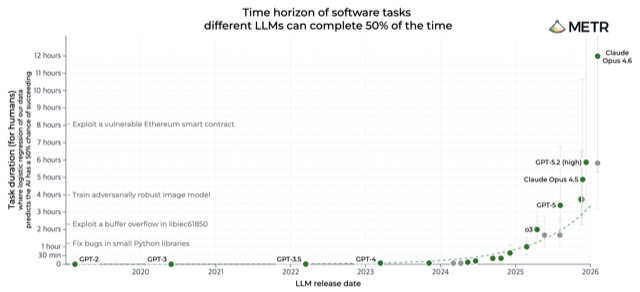

In hardware, Moore's Law states that chip transistor density doubles every two years. More recently, research shows that LLM autonomous task performance doubles every seven months. While early services drew ridicule for confidently describing Admiral Yi Sun-sin's smartphone, today's services handle natural language, images, video, and audio with remarkable quality. At the heart of this progress is the **Transformer** architecture.

I believe that to use any tool well, you need to understand how it works in detail. In this post, we first explore the background behind the Transformer. Then we look at how it works, and finally examine the bottlenecks and a few fundamental optimization techniques to address them.

## Part 1: Background

### The Architecture That Changed the World: Transformer

In 2017, a Google research team published a paper titled **"Attention Is All You Need."** This paper not only solved the speed limitations of previous sequential models (RNN/LSTM) by processing entire sentences **at once** as matrices, but also significantly improved performance with an "Attention" mechanism that mimics how humans understand sequences. Today's most popular LLMs — including **Gemini** and **ChatGPT** — are built on the Transformer architecture proposed in this paper.

### What LLMs Do: Next-Word Prediction

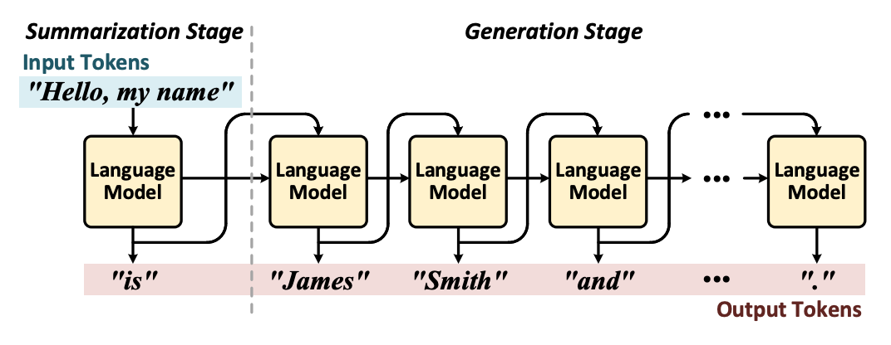

Mathematically, a **Large Language Model (LLM)** is "a sophisticated mathematical function that predicts the next word given some text." Rather than deterministically picking a single word, it assigns a **probability** to every possible next word. Because it samples from this probability distribution each time, the same question can produce different answers on different runs. Training is the process of making these predictions increasingly accurate by processing enormous amounts of text.

Imagine someone asking an LLM to write a short movie script. The user feeds a prompt to the LLM — a "magic machine that plausibly predicts the next word for any given sentence." We feed the script so far into the machine, append the predicted word, feed it back in, and repeat. This is exactly what happens when we chat with a chatbot.

## Part 2: Breaking Down the Transformer

### Architecture Overview

Although details vary by model, we'll use the simplest model — **GPT-2** — as our reference. A Transformer can be divided into three major stages: Token Embedding, Decoder Block, and LM Head. The Decoder Block is typically a stack of n identical blocks (24 in GPT-2's case). Each block can be further broken down into six steps:

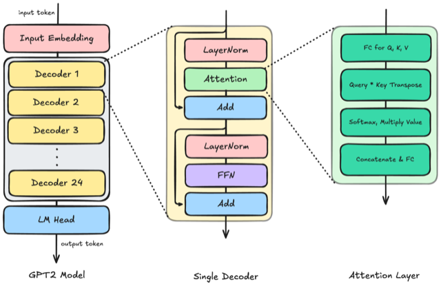

1. **Layer Normalization**
2. **Multi-Head Attention**
3. **Residual Connection**
4. **Layer Normalization**
5. **Feed-Forward Network (FFN)**
6. **Residual Connection**

### Token & Positional Embedding

The first stage of the Transformer converts human language into a language computers can understand. This is called **Token Embedding**, where each **token** is mapped to a long list of numbers — a vector. (In practice, the mapping between words and tokens isn't strictly one-to-one, but we'll assume it is for simplicity.) After this conversion, each word becomes a numeric vector that carries the word's meaning. Since the same word can mean different things depending on its position in a sentence, **Positional Embedding** is also applied.

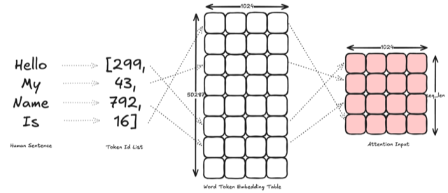

Let's look at **GPT-2** Medium as an example. This model's **vocabulary size** is 50,287, and each token is encoded as a vector of size 1024 (the **embedding dimension**). We also call this 1024 dimensions. The **Word Token Embedding Table (WTE)** has shape [50287, 1024], mapping each token to a 1,024-dimensional vector.

The **Word Positional Embedding Table (WPE)** has shape [1024, 1024], mapping each position in the sequence to a 1,024-dimensional vector. By looking up the token ID sequence in the WTE to get [seq_len, 1024] and the position indices in the WPE to get [seq_len, 1024], then adding the two matrices, we have the input ready for the Decoder Block.

### Layer Normalization

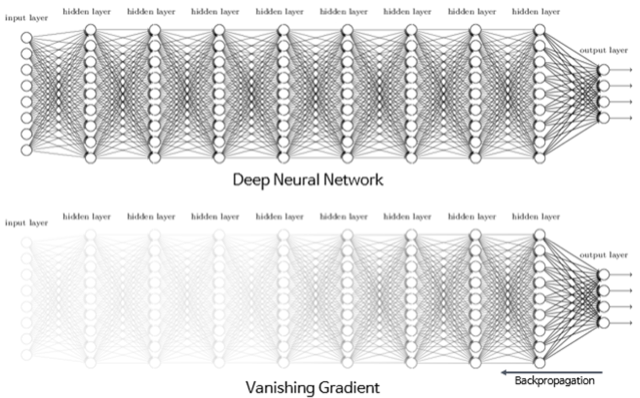

**Layer Normalization (LayerNorm)** is the first step of the Decoder Block. It normalizes each token's vector by adjusting its mean and variance — the same normalization concept you may have learned in math class. If the input distribution varies wildly from layer to layer, training becomes unstable and gradients can explode or vanish. LayerNorm keeps each position's vector at an "appropriate scale and distribution," stabilizing training and enabling deep networks with many layers.

### Self-Attention: The Meaning of Query, Key, and Value

#### The Problem Attention Solves: Context-Dependent Meaning

Let's use the word **tower** as an example. Right after embedding, it gets a vector pointing in the general direction of "tall structure." But if **Eiffel** appears right before it, that vector gets updated toward "Eiffel Tower." If **miniature** is added further before, the association with "large" weakens and the meaning becomes more specific. Information transfer between tokens can span long distances and capture rich context. To predict the next word in "Therefore the murderer was..." at the end of a mystery novel, the last vector **was** must absorb context from the entire preceding text. Attention computes exactly "which token should attend to which other token, and by how much."

#### Q, K, V Generation and Intuitive Meaning

GPT-2 Medium accepts at most 1024 input tokens. Since each token is converted to a vector of size 1024, the Attention input is at most [1024, 1024] (= [seq_len, N_embed]). We multiply this by three different **weight matrices** W_Q, W_K, W_V to produce the **Query (Q)**, **Key (K)**, and **Value (V)** matrices. The embedding dimension (N_embed=1024) is split into the number of heads (N_head=16) and per-head dimension (head_dim=64), so each of Q, K, V has shape [seq_len, N_head, head_dim].

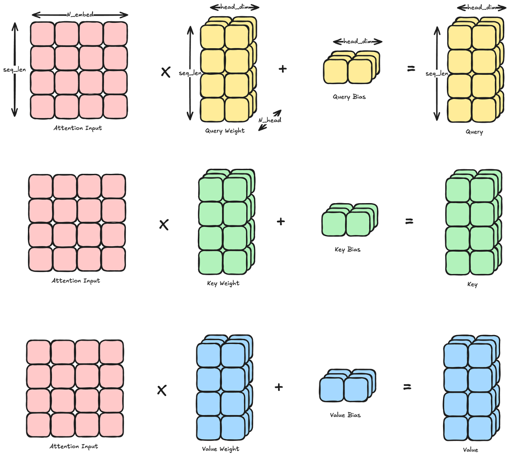

For intuition, consider predicting the blank in "Hello, my name is ____." Recall from Part 1 that an LLM is a next-word prediction machine. To fill in the blank, the last token **is** needs to gather information from the preceding words. Here's what Q, K, and V each do:

- **Query (Q)** — The question that **is** asks: "What information do I need from the preceding context to predict the next word?" This question is encoded in **is**'s Q vector.
- **Key (K)** — The name tag each preceding word holds up. **Hello** carries a tag like "I'm a greeting," **my** carries "I'm a possessive," and **name** carries "I'm about a name." When we compare (dot-product) **is**'s Q with each word's K, **name** scores the highest — because we need to figure out "what the name is."
- **Value (V)** — The actual content that high-scoring words deliver. **name**'s V contains the meaning "a name," and this information is combined proportionally by scores to update **is**'s vector.

After this update, **is**'s vector now condenses the context "greeting + my + name + is," and when this vector passes through the LM Head, a person's name like **John** comes out with high probability. In summary: Q is "what do I need to predict the next word (question)," K is "what kind of clue do I hold (name tag)," and V is "the actual meaning I deliver (content)."

#### Query · Keyᵀ: Similarity Scores and Masking

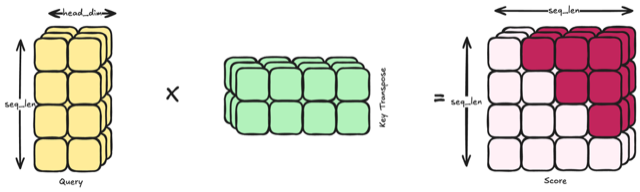

We mentioned earlier that there are N_head heads. Within a single head, both Q and K have shape [N_position, head_dim]. By transposing K to Kᵀ [head_dim, N_position] and computing **Score = Q · Kᵀ**, we get an [N_position, N_position] matrix. Rows represent "the token holding the current Query," columns represent "all referenceable positions," and element (i, j) is the score for how important token i considers token j. The more aligned the Query and Key vectors are, the larger the dot product.

Just as humans read text from left to right, Attention must ensure that **past tokens cannot see future tokens**. This is achieved through **masking**: setting scores at "positions after me" to −∞ before Softmax. After Softmax, these become 0, preventing later tokens from influencing earlier ones — in other words, blocking "future tokens from modifying past tokens."

#### Softmax & Value Weighted Sum

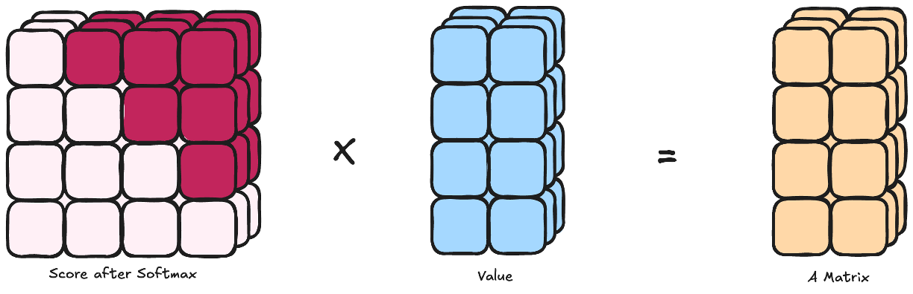

We're almost there — let's push through! **Softmax** is applied to each **row** (each Query position) of the Score matrix. Due to the nature of the softmax operation, each row sums to 1, turning the scores into a probability distribution representing "how much weight to give each other token." For example, raw scores like "gym 2, tennis 1, bed 0.1" become "gym 0.7, tennis 0.2, bed 0.1" — numbers go from **scores** to **probabilities**. At each Query position, we take the **weighted sum** of all positions' Value vectors using these weights, producing the update vector (ΔE) to add to that position.

#### Multi-Head Attention and Output Projection

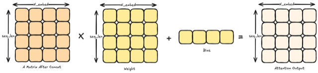

When entering the Attention layer, [seq_len, N_embed] was split into [seq_len, N_head, head_dim]. The concept of heads was adopted to improve model performance. A single head might specialize in one type of relationship like "adjective–noun," but language has diverse ways of shifting context. So we split into multiple heads with different Q, K, V matrices and process each head in parallel to enhance contextual understanding. Each head produces an [N_position, head_dim] output in a different subspace, then these are **concatenated** into [N_position, N_embed].

Finally, **Output Projection** (FC): ConcatenatedAttention · W_O + b_O applies an [N_embed, N_embed] weight matrix to merge information from all heads back into a single representation space. This is the final output of one block's **Multi-Head Attention**. The hard part is done!

### Residual Connection

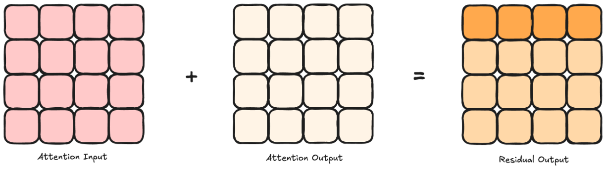

The connection that **adds** the Self-Attention output to the original input is called a **Residual Connection (skip connection)**. In the form y = x + AttentionOutput, the name sounds grand but it's essentially matrix addition. By preserving the original information x and only adding the **delta** captured by Attention, gradients flow well even in deep networks, keeping training stable.

### Feed-Forward Network (FFN)

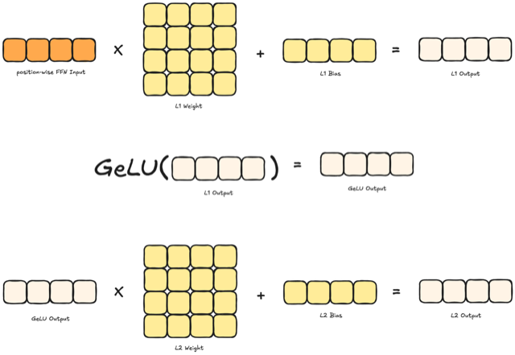

As a reminder, a single decoder layer consists of 6 steps (LayerNorm–Attention–Residual–LayerNorm–FFN–Residual). Since LayerNorm and Residual are repeated, let's wrap up with the **Feed-Forward Network (FFN)**. The FFN consists of two **Linear** layers with an **Activation Function** in between. The input [N_position, N_embed] is **expanded** by the first Linear layer, passed through an activation (e.g., GeLU), then **compressed** back by the second Linear layer to produce [N_position, N_embed]. The same MLP is applied independently at each position (**position-wise FFN**), mapping the information gathered by Attention into a more complex feature space via nonlinear transformation. After completing all 6 steps, one decoder block is done, and repeating this process N times (24 for GPT-2) completes the entire Decoder Block computation.

### LM Head: Next-Token Prediction

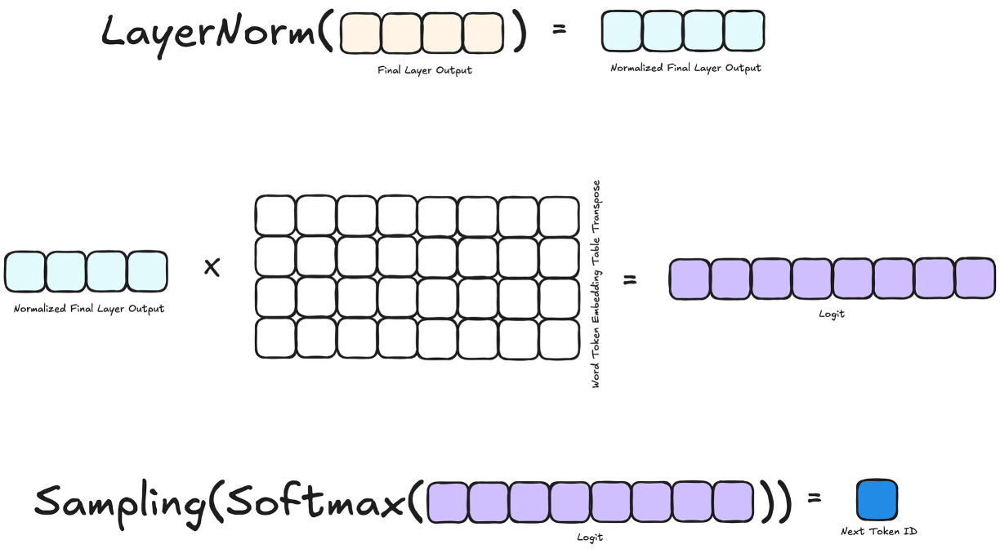

The final stage, LM Head, converts vectors back into words that humans can understand. It typically uses the transpose of the **Token Embedding Table (WTE)** to compute **logits**. Applying **Softmax** to these logits produces a probability distribution over the entire vocabulary for the next token.

While one could simply output the highest-probability token, **sampling** is generally used to draw one token according to the probability distribution. Two key parameters control the sampling range: **top_k** and **top_p**. Using both together prevents "absurd words from being selected" while maintaining natural diversity.

Congratulations! If you've followed along this far, you've grasped the full basic structure of the Transformer. It's perfectly fine if not everything clicks on the first read. The Transformer is a recent architecture and by no means an easy topic. This post focused on concrete numbers and the meaning behind each operation, but as you continue reading explanations from various perspectives, it will gradually become more familiar. Now let's move on to the final part and cover some key optimization techniques.

## Part 3: Optimization Techniques

### KV Cache and Memory/Bandwidth Issues

The most important operation from Part 2 is undoubtedly Attention. The Score matrix produced by multiplying Query and Key has size proportional to the **square of the context size**. With N tokens, it's an N×N matrix, so computation and memory grow rapidly as context lengthens. During inference, previously computed **Key** and **Value** are stored in a **KV cache** for reuse, but as context grows, this cache becomes enormous, making context length, memory, and bandwidth major bottlenecks.

For example, consider running **LLaMA-3-70B** with **bfloat16 (bf16)** at a 1-million-token context. Model parameters: 70B × 2 bytes ≈ 140 GB. The KV cache works out to roughly 2 (K,V) × batch 1 × 80 layers × 8 KV heads × 128 head_dim × 1M sequence × 2 bytes ≈ 328 GB. The total memory that must be read to generate one token is about 468 GB (model + KV cache), and generating 20 tokens per second would theoretically require ~10 TB/s of memory bandwidth.

### KV Cache Architecture Comparison (MHA, MQA, GQA, MLA)

There are four main approaches depending on how KV is stored and shared: MHA, MQA, GQA, and MLA. The core trade-off is between **accuracy (expressiveness)** and **KV cache size (memory/bandwidth)**. A [paper](https://arxiv.org/pdf/2503.11486) that visually illustrates these differences well is attached below.

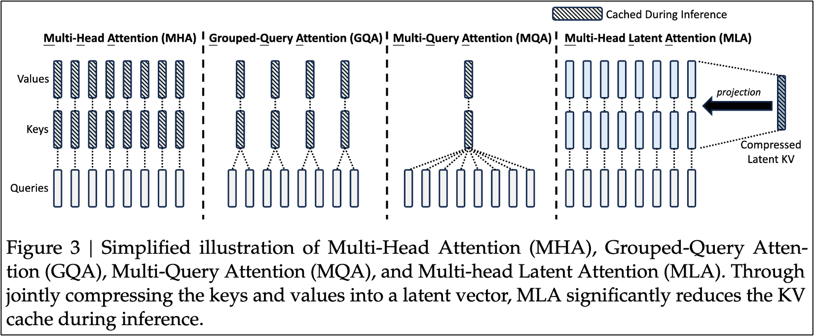

#### Multi-Head Attention (MHA)

The original structure proposed in the Transformer paper. Each Query head has its own dedicated K, V head — a **1 Query : 1 KV** relationship. Used by **GPT-3**, **LLaMA 1/2**, and others.

- **Pros**: Each head has independent K, V, providing the highest expressiveness and the ability to capture diverse patterns simultaneously. Most advantageous in terms of accuracy.
- **Cons**: KV cache must be stored for every head, so memory usage and bandwidth requirements grow rapidly as context lengthens.

#### Multi-Query Attention (MQA)

All Query heads share **a single** K, V head. **N Query : 1 KV**. Used by **PaLM**, **Falcon**, **StarCoder**, and others.

- **Pros**: KV cache size drops to **1/N_head** of MHA, significantly reducing memory and bandwidth overhead during inference. Much more favorable for increasing batch size or processing long contexts.
- **Cons**: Since all heads see the same K, V, the ability to capture different relationships per head is reduced. There's an accuracy trade-off compared to MHA.

#### Grouped-Query Attention (GQA)

Query heads are divided into several **groups**, with each group sharing one KV pair. A middle ground between MHA (1:1) and MQA (N:1), with an **N Query : M KV** relationship. For example, with 32 Query heads and 8 KV heads, every 4 Query heads share 1 KV head. Used by **LLaMA-2-70B**, **LLaMA-3**, **Mistral**, and others.

- **Pros**: More KV heads than MQA means higher expressiveness, while smaller KV cache than MHA. Widely regarded as the most balanced practical choice between accuracy and efficiency.
- **Cons**: Compared to MHA, KV is still shared across heads, limiting expressiveness. Cannot reduce memory as much as MQA.

#### Multi-Head Latent Attention (MLA)

K, V are compressed (projected) into low-dimensional **latent** vectors, and Attention is performed in that latent space. Only these small latent vectors need to be stored in the KV cache instead of the original K, V. Used by **DeepSeek-V2/V3** and others.

- **Pros**: By compressing KV cache to a much smaller latent dimension, memory efficiency surpasses even GQA. At the same time, independent Q per head is maintained, avoiding significant loss of expressiveness.
- **Cons**: Additional computation for latent projection (compression/decompression matrix multiplications) is required, and implementation complexity is high. Information loss can occur during compression, so the compression ratio must be carefully tuned.

### Summary

In this post, we explored how LLMs work and the meaning of each operation that makes up an LLM, with appropriate analogies. To recap: the Transformer architecture consists of three major stages — Token Embedding, Decoder Block, and LM Head — and the Decoder Block can be further broken down into LayerNorm, Attention, Residual, LayerNorm, FFN, and Residual. Finally, we compared the O(N²) cost with context length, KV cache memory/bandwidth issues, and fundamental architectural variations like MHA, MQA, GQA, and MLA designed to address them.

## Reference
https://arxiv.org/pdf/2209.10797

https://arxiv.org/pdf/2503.11486

https://metr.org/blog/2025-03-19-measuring-ai-ability-to-complete-long-tasks/

## HyperAccel is Hiring!

We are an NPU design startup growing at the forefront of LLM inference optimization. This post was written based on HyperAccel's internal training materials — sharing expertise and growing together is one of our core strengths.

If you're interested in the technologies we work with and want to join this journey, please apply at the link below.
[HyperAccel Career](https://hyperaccel.career.greetinghr.com/ko/guide)
